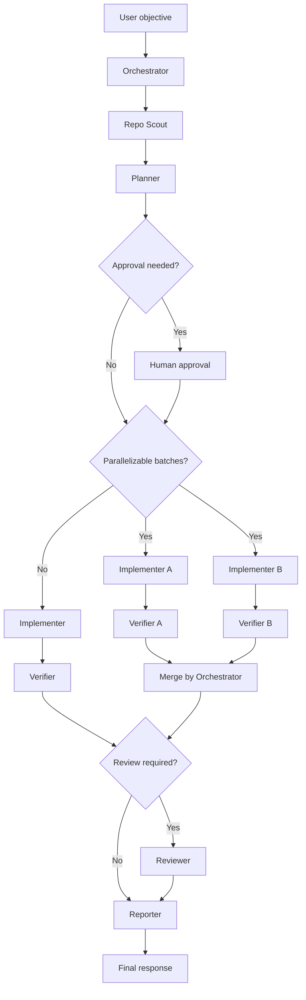
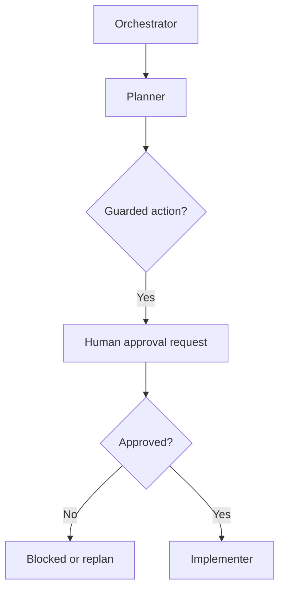
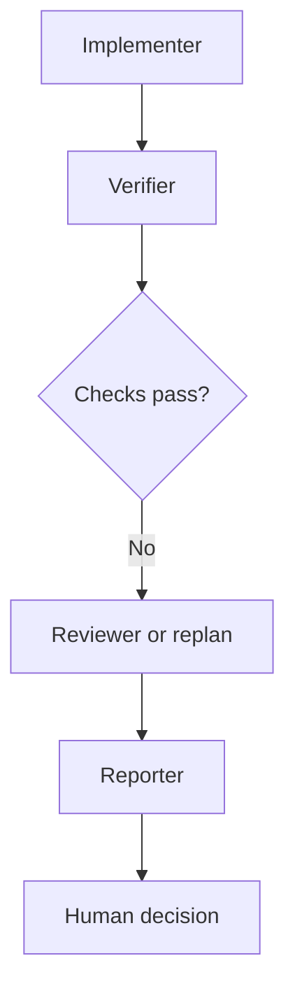

# Orchestrator Agent Flows

## Normal flow

```mermaid
flowchart TD
  U["User objective"] --> O["Orchestrator"]
  O --> S["Repo Scout"]
  S --> P["Planner"]
  P --> A{"Approval needed?"}
  A -- Yes --> H["Human approval"]
  A -- No --> B{"Parallelizable batches?"}
  H --> B
  B -- Yes --> I1["Implementer A"]
  B -- Yes --> I2["Implementer B"]
  B -- No --> I["Implementer"]
  I1 --> V1["Verifier A"]
  I2 --> V2["Verifier B"]
  I --> V["Verifier"]
  V1 --> M["Merge by Orchestrator"]
  V2 --> M
  V --> R{"Review required?"}
  M --> R
  R -- No --> T["Reporter"]
  R -- Yes --> W["Reviewer"]
  W --> T
  T --> F["Final response"]
```

## Blocked flow

```mermaid
flowchart TD
  O["Orchestrator"] --> P["Planner"]
  P --> A{"Guarded action?"}
  A -- Yes --> H["Human approval request"]
  H --> D{"Approved?"}
  D -- No --> B["Blocked or replan"]
  D -- Yes --> I["Implementer"]
```

## Failure flow

```mermaid
flowchart TD
  I["Implementer"] --> V["Verifier"]
  V --> X{"Checks pass?"}
  X -- No --> R["Reviewer or replan"]
  R --> T["Reporter"]
  T --> F["Human decision"]
```
