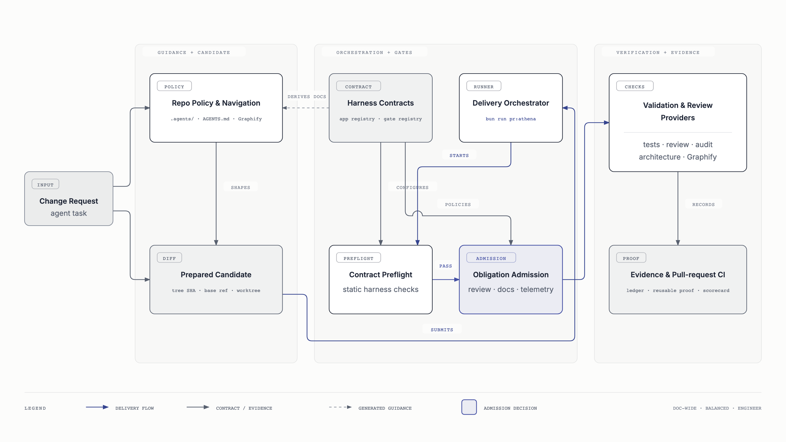

# Agent Delivery Harness Architecture

This page is the visual overview of Athena's repository delivery harness. The
canonical [Repo Harness And Sensors](../harness.md) document owns the detailed
command behavior, gate semantics, generated artifacts, CI wiring, and failure
handling.

## System Overview



The harness turns a prepared repository candidate into candidate-bound evidence:

1. Repo-local policy and generated navigation guide preparation of the exact
   candidate.
2. The delivery orchestrator sequences the gate lifecycle; it does not
   implement gate policy itself.
3. Contract preflight detects deterministic registry, documentation, fixture,
   and harness drift before expensive validation.
4. Obligation admission decides whether the candidate has enough exact-tree
   evidence, an authorized waiver or delegation, or a valid non-applicability
   result to proceed.
5. Validation providers run the admitted work and record reusable proof for the
   same candidate. Pull-request CI independently enforces the repository
   contracts.

## Ownership Boundary

The delivery orchestrator owns ordering and run state. The registries own
declarative contracts, preflight owns static consistency checks, admission owns
the fail-closed decision, and providers own the validation work they report.
Keeping those responsibilities separate prevents the runner from silently
becoming the policy authority.

## Source Boundaries

- Package and documentation contracts:
  [`harness-app-registry.ts`](../../scripts/harness-app-registry.ts).
- Gate obligations and admission policy:
  [`harness-gate-registry.ts`](../../scripts/harness-gate-registry.ts) and
  [`harness-gate-admission.ts`](../../scripts/harness-gate-admission.ts).
- Static contract checks:
  [`harness-contract-preflight.ts`](../../scripts/harness-contract-preflight.ts).
- Delivery orchestration:
  [`pr-athena-delivery-run.ts`](../../scripts/pr-athena-delivery-run.ts).

## Diagram Source And Export

The editable source is
[`athena-harness-architecture.html`](./athena-harness-architecture.html).
Regenerate all committed architecture images from the repository root with:

```bash
bun run docs:diagrams
```

The exporter waits for web fonts and captures each SVG at 2× device scale so
GitHub renders the intended typography without depending on external fonts in
Markdown.
