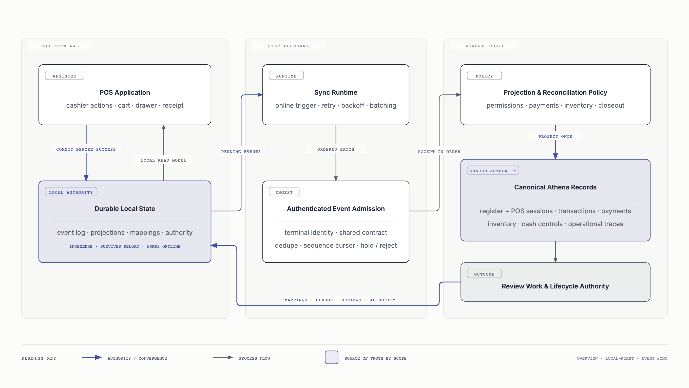
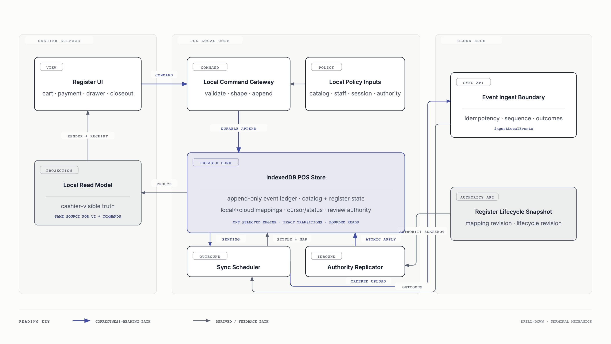

# POS And Cloud Sync

Athena POS is local-first by design. A healthy provisioned terminal records a
cashier action durably before reporting success, then synchronizes the resulting
event to Athena Cloud when connectivity is available. Convex remains the shared
source of truth after ordered admission and projection.

## System Overview

The overview keeps the system boundary intentionally small: local execution,
ordered event admission, cloud projection, and reconciliation back to the
terminal.



- **Immediate authority:** the terminal is authoritative for whether the
  cashier command was durably recorded.
- **Shared authority:** Athena Cloud is canonical after the event is accepted
  and projected.
- **Convergence:** mappings, cursor outcomes, review state, and register
  lifecycle authority return to the durable local store the UI reads.

## POS Mechanics

The drill-down shows how commands, local projections, outbound event upload,
and inbound register lifecycle authority interact inside the terminal.



The outbound scheduler and inbound authority replicator are independent. A
reactive cloud query never directly authorizes a cashier command; exact cloud
authority is applied to IndexedDB first, and the command gateway reads the
refreshed local projection.

## Source Boundaries

- Local commands and persistence:
  [`localCommandGateway.ts`](../../packages/athena-webapp/src/lib/pos/infrastructure/local/localCommandGateway.ts),
  [`posLocalStore.ts`](../../packages/athena-webapp/src/lib/pos/infrastructure/local/posLocalStore.ts),
  and
  [`syncScheduler.ts`](../../packages/athena-webapp/src/lib/pos/infrastructure/local/syncScheduler.ts).
- Browser runtimes:
  [`usePosLocalSyncRuntime.ts`](../../packages/athena-webapp/src/lib/pos/infrastructure/local/usePosLocalSyncRuntime.ts)
  and
  [`useRegisterLifecycleAuthorityRuntime.ts`](../../packages/athena-webapp/src/lib/pos/infrastructure/local/useRegisterLifecycleAuthorityRuntime.ts).
- Cloud sync boundary:
  [`public/sync.ts`](../../packages/athena-webapp/convex/pos/public/sync.ts),
  [`ingestLocalEvents.ts`](../../packages/athena-webapp/convex/pos/application/sync/ingestLocalEvents.ts),
  and
  [`projectLocalEvents.ts`](../../packages/athena-webapp/convex/pos/application/sync/projectLocalEvents.ts).
- Shared event contract:
  [`posLocalSyncContract.ts`](../../packages/athena-webapp/shared/posLocalSyncContract.ts).

## Diagram Source And Export

The editable source is
[`athena-pos-cloud-sync-architecture.html`](./athena-pos-cloud-sync-architecture.html).
Regenerate both committed images from the repository root with:

```bash
bun run docs:diagrams
```

The exporter waits for web fonts and captures each SVG at 2× device scale so
GitHub renders the intended Instrument Serif and Geist Mono typography without
depending on external font loading in Markdown.
