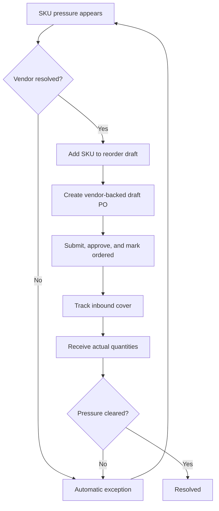

# Procurement Stock Continuity Workspace

## Summary

The procurement workspace should become Athena's SKU-pressure-first stock continuity workspace. It should help store operators move from daily inventory pressure to vendor-backed purchase orders, PO lifecycle actions, inbound monitoring, receiving, and automatically generated exceptions without leaving the procurement context.

---

## Problem Frame

Store operators need a daily operating surface for deciding what stock pressure needs action. Low on-hand inventory, constrained sellable availability, existing reservations, open purchase orders, and receiving outcomes all affect whether the store can keep selling. When those facts are split across separate surfaces or presented as generic purchase-order administration, the operator has to mentally reconcile what is exposed, what is already planned, what is actually inbound, and what is broken.

Procurement also sits between several parts of store operations. POS and storefront activity create demand and reservations. Inventory adjustments correct stock reality. Purchase orders create planned and inbound cover. Receiving changes inventory counts and clears or reduces pressure. The workspace needs to preserve that loop while still feeling like a fast daily command surface rather than a back-office ledger.

---

## Actors

- A1. Store operator: Reviews SKU pressure and takes day-to-day procurement actions.
- A2. Store manager: Approves or advances purchase-order lifecycle actions and resolves exceptions when needed.
- A3. Receiving operator: Records actual received quantities against ordered purchase orders.
- A4. Athena: Derives stock continuity state from inventory, purchase-order, receiving, vendor, and reservation facts.

---

## Key Flows

- F1. Clear SKU pressure into draft purchase orders
  - **Trigger:** The operator opens procurement and sees SKUs in a needs-action state.
  - **Actors:** A1, A4
  - **Steps:** Athena ranks SKU pressure by urgency. The operator selects exposed SKUs, confirms suggested quantities, assigns or quick-adds vendors where required, and creates draft purchase orders grouped by vendor.
  - **Outcome:** Each selected SKU has planned PO action tied to a vendor, while the SKU remains visibly not covered until the PO becomes ordered.
  - **Covered by:** R1, R2, R3, R4, R6, R7, R8, R9, R10, R11, R12

- F2. Advance purchase orders from the pressure context
  - **Trigger:** A SKU has planned PO action in draft, submitted, or approved state.
  - **Actors:** A1, A2, A4
  - **Steps:** The workspace shows the valid next PO action. The operator or manager submits, approves, marks ordered, or cancels the PO without leaving procurement. Athena updates the SKU continuity state to planned, inbound, exposed, or exception based on the resulting facts.
  - **Outcome:** PO progress stays attached to the SKU pressure it is meant to resolve.
  - **Covered by:** R12, R13, R14, R22, R23, R24

- F3. Monitor inbound cover and receive stock
  - **Trigger:** A PO reaches ordered or partially received state.
  - **Actors:** A1, A3, A4
  - **Steps:** Athena treats the remaining ordered quantity as inbound cover. The receiving operator records actual quantities when stock arrives. Athena updates inventory, receiving progress, PO status, and SKU pressure.
  - **Outcome:** Pressure clears when enough stock is received, remains partially covered when a gap remains, or becomes an exception when receiving does not cleanly resolve the issue.
  - **Covered by:** R14, R15, R16, R17, R18

- F4. Resolve automatically generated exceptions
  - **Trigger:** Athena detects that planned or inbound action is not cleanly resolving stock pressure.
  - **Actors:** A1, A2, A4
  - **Steps:** The workspace surfaces the exception in the SKU pressure queue, explains the operational facts behind it, and offers the next meaningful action such as choosing a vendor, advancing stale planned work, updating or cancelling cover, receiving partial stock, or creating replacement reorder action.
  - **Outcome:** Exceptions stay visible until the underlying stock continuity issue is resolved or explicitly handled.
  - **Covered by:** R17, R18, R19, R20, R21

---

## Requirements

**SKU-Pressure Workspace**
- R1. Procurement must use SKU pressure as the primary organizing lens rather than purchase orders as the default starting point.
- R2. The default workspace mode must focus on needs-action work: exposed SKUs, vendor-missing rows, partially covered rows with remaining gap, stale planned action, cancelled cover, late inbound, and short receipt.
- R3. The workspace must distinguish at least these operational SKU states: exposed, vendor missing, planned, stale planned action, inbound, late inbound, partially covered, short receipt, cancelled cover, and resolved.
- R4. Each pressure row must explain the stock continuity facts that matter for action: current stock, sellable availability, reserved or held stock when available, suggested order quantity, planned PO context, inbound cover, and related exception facts.
- R5. Secondary workspace modes should support planned work, inbound work, exceptions, and resolved work without weakening needs-action as the default operating rhythm.

**Pressure to PO**
- R6. Operators must be able to select one or more pressure rows into a reorder draft.
- R7. Reorder draft lines must allow quantity review or adjustment before PO creation.
- R8. Every reorder draft line must have a vendor before it can become part of a purchase order.
- R9. Procurement must support choosing an existing active vendor for a reorder line.
- R10. Procurement must support minimal inline vendor quick-add when a needed vendor does not exist yet.
- R11. Creating purchase orders from the reorder draft must group lines by vendor so each resulting PO is vendor-backed.
- R12. Draft, submitted, and approved POs must communicate planned action, not inbound cover.

**PO Lifecycle and Inbound Cover**
- R13. Operators must be able to take valid PO lifecycle actions from the procurement workspace, including submit, approve, mark ordered, cancel, and receive when eligible.
- R14. Ordered and partially received POs must count as inbound cover for the affected SKUs.
- R15. Receiving must require actual quantity confirmation rather than treating ordered quantity as automatically received.
- R16. Receiving outcomes must update SKU pressure so a row can become resolved, remain partially covered, or move into an exception state.

**Automatically Generated Exceptions**
- R17. Procurement exceptions must be generated from operational facts rather than manually created as a separate checklist.
- R18. V1 exception states must include late inbound, short receipt, cancelled cover, vendor missing, and stale planned action.
- R19. Exceptions must appear in the SKU pressure queue and explain what fact caused the exception.
- R20. Exceptions must remain visible until the underlying issue is resolved or explicitly handled with an operational reason.
- R21. Exception actions must point operators toward the next stock-continuity move, such as choosing a vendor, advancing or cancelling planned action, receiving partial stock, or creating replacement reorder action.

**Daily Operating Rhythm and Auditability**
- R22. The workspace must optimize for fast daily operating rhythm: the operator should quickly see what needs action today, what can wait, what is inbound, and what is blocked.
- R23. Auditability must exist underneath the daily workflow through visible history, PO lifecycle events, receiving history, and exception source facts, without making audit history the main screen.
- R24. A SKU detail surface should show continuity history and related PO context for operators who need to inspect why a row is in its current state.
- R25. Routine copy and state labels should stay calm, clear, restrained, and operational.

---

## Acceptance Examples

- AE1. **Covers R1, R2, R3, R4.** Given multiple SKUs with different procurement states, when the operator opens procurement, the default view prioritizes needs-action SKU pressure and clearly separates exposed, planned, inbound, exception, and resolved states.
- AE2. **Covers R6, R7, R8, R9, R11, R12.** Given two exposed SKUs assigned to different vendors, when the operator adds both to the reorder draft and creates POs, Athena creates separate vendor-backed draft POs and the SKU rows show planned action rather than inbound cover.
- AE3. **Covers R8, R10, R18, R19.** Given an exposed SKU has no assigned vendor, when the operator tries to include it in reorder action, the row shows a vendor-missing state and offers choosing or quick-adding a vendor before PO creation can proceed.
- AE4. **Covers R13, R14.** Given a draft PO exists for an exposed SKU, when the operator advances it through approval and marks it ordered, the SKU moves from planned action to inbound cover.
- AE5. **Covers R15, R16, R18.** Given an ordered PO arrives with fewer units than needed to clear pressure, when the receiving operator records the actual quantity, the SKU remains partially covered or moves to short receipt instead of appearing resolved.
- AE6. **Covers R17, R18, R20, R21.** Given an ordered PO is past its expected arrival date with remaining quantity open, when the operator views procurement, Athena automatically shows late inbound and offers operational next actions without requiring manual exception creation.

---

## Success Criteria

- Store operators can open procurement and immediately understand what stock continuity work needs action today.
- Operators can move from exposed SKU pressure to vendor-backed draft purchase orders without leaving the workspace.
- Planned PO work, inbound cover, receiving outcomes, and exceptions are clearly distinguished so procurement does not falsely communicate that stock is covered.
- Automatically generated exceptions keep broken procurement states visible until they are resolved or explicitly handled.
- The next implementation plan can execute the workspace foundation without inventing product behavior, state semantics, or workflow boundaries.

---

## Scope Boundaries

- Full vendor administration is out of scope for the first foundation.
- Preferred vendor per SKU is out of scope for the first foundation.
- Vendor catalog, pricing, lead-time automation, reliability scoring, and payment terms are out of scope.
- Damaged-receipt and wrong-SKU receiving workflows are deferred beyond the initial exception set.
- Generic product, catalog, and SKU administration are out of scope.
- The workspace should not become a broad inventory admin surface; it should remain focused on stock continuity.
- Implementation-level schema, route, component, and API design belongs to planning, not this requirements document.

---

## Key Decisions

- SKU pressure first: Operators think in terms of what stock is at risk, so purchase orders should support the SKU-pressure queue rather than replace it as the primary lens.
- Pressure to PO as the first slice: The workspace must become actionable early by turning exposed SKUs into draft purchase orders.
- Vendor required: A draft PO must be operationally real, so each reorder line needs a vendor before creation.
- Hybrid vendor onboarding: Procurement should unblock reorder work with inline quick-add, while deeper vendor management remains outside this workspace.
- Planned is not covered: Draft, submitted, and approved POs indicate intent, while ordered and partially received POs indicate inbound cover.
- Actions in context: Operators should be able to advance PO lifecycle and receiving work from the same workspace where pressure is visible.
- Automatic exceptions: Athena should derive exception states from stock and PO facts so operators do not maintain a separate manual exception list.
- Daily rhythm first: The screen should help a manager clear today's stock continuity work quickly, with auditability available underneath.

---

## Dependencies / Assumptions

- Procurement has access to current stock, sellable availability, reserved or held quantities when available, PO status, receiving progress, and vendor availability.
- PO lifecycle and receiving actions can be represented in operator-facing language without exposing backend enum names.
- Inline vendor quick-add can remain minimal in the first foundation without blocking later full vendor administration.
- Existing operational event and inventory movement concepts are sufficient to support the auditability expectations at the requirements level.
- A later plan will decide exact thresholds for stale planned action and late inbound behavior.

---

## Outstanding Questions

### Resolve Before Planning

- None.

### Deferred to Planning

- [Affects R3, R17, R18][Technical] Define the exact derivation order when multiple states apply to the same SKU.
- [Affects R10][Product/technical] Define the minimum required fields for inline vendor quick-add.
- [Affects R13][Product/technical] Decide whether all PO lifecycle actions require the same permission level or whether approval-sensitive actions need additional checks.
- [Affects R18][Product/technical] Set the age thresholds for stale planned action and late inbound.
- [Affects R24][Design] Decide the exact shape of the SKU detail surface and how much history appears inline versus behind a drawer.

---

## Next Steps

-> /ce-plan for structured implementation planning
