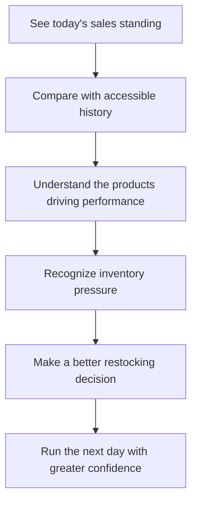

# Athena Landing and Product Page

## Summary

Create Athena's public product page around a business-memory-to-informed-action narrative: show an owner today's sales, make historical performance easy to understand, reveal the products driving the result, and bring that evidence together with current stock pressure to support a better restocking decision.

---

## Problem Frame

The primary prospect is an owner-led, product-heavy small or medium business. One owner remains accountable for the business, wears multiple operational hats, and coordinates a handful of employees.

Important business evidence currently lives in notebooks, physical receipts, and the owner's memory. The owner can see that sales happened, but understanding today's sales standing or comparing it with earlier performance requires manual reconstruction. This delays decisions, weakens the owner's ability to make calculated projections from historical evidence, and leaves the owner uncertain about which products are driving the business and what should happen next.

Athena already spans more than a sales dashboard: it is the operating system in which POS and storefront activity become connected sales, product, inventory, cash, and operational records. A broad inventory of features would obscure the immediate reason this prospect should care. The product page must establish the simple entry value first and let Athena's connected operating record deepen that promise.

The prose requirements govern if the diagram and surrounding text ever diverge.

---

## Actors

- A1. Prospective owner-operator: Evaluates whether Athena can replace fragmented business memory with a clear, useful view of the business.
- A2. Existing Athena customer: Uses the public page as an entry point to sign in without distracting from the prospect-focused story.
- A3. Athena: Demonstrates how connected operational records turn daily activity into historical understanding and an actionable next step.

---

## Key Flows

- F1. Recognize the problem and promise
  - **Trigger:** A1 arrives without prior product context.
  - **Actors:** A1, A3
  - **Steps:** The page names the fragmented-memory problem, states the daily-sales visibility promise, and immediately shows Athena as the product delivering that outcome.
  - **Outcome:** A1 understands who Athena is for and why it is relevant before encountering detailed capabilities.
  - **Covered by:** R1, R2, R5, R9

- F2. Follow standing into action
  - **Trigger:** A1 continues beyond the hero to understand how Athena helps with decisions.
  - **Actors:** A1, A3
  - **Steps:** The story moves from today's sales standing to historical comparison, product drivers, current inventory pressure, and an owner-led restocking decision; a small representative set of broader product strengths appears as supporting evidence around that sequence.
  - **Outcome:** A1 sees a credible path from visibility to a practical business decision.
  - **Covered by:** R3, R6, R7, R8, R10, R11

- F3. Request a walkthrough or sign in
  - **Trigger:** A visitor reaches a point of sufficient interest or already has an Athena account.
  - **Actors:** A1, A2
  - **Steps:** A1 can request a walkthrough, while A2 can sign in through a clearly secondary path; each path provides a clear destination and completion or recovery state.
  - **Outcome:** Each visitor has an obvious next action without the acquisition and customer-entry paths competing.
  - **Covered by:** R12, R13

---

## Requirements

**Audience and positioning**

- R1. The page must primarily address the owner-operator of a product-heavy small or medium business who wears multiple hats and manages a small team.
- R2. The central problem must be framed as fragmented business memory and slow reconstruction from notebooks, physical receipts, and personal recall—not merely the absence of another software tool.
- R3. Athena must be positioned as the operating system where in-person and online sales are captured and connected with product, inventory, cash, and operational records, turning daily activity into accessible business memory and informed action.
- R4. The page must preserve Athena's broader business-operating-system identity without making an exhaustive or absolute “all-in-one” claim.

**Narrative hierarchy**

- R5. The hero must establish immediate visibility into the day's sales as the entry promise.
- R6. Historical accessibility must deepen the hero promise by showing that today's sales standing can be understood in context rather than viewed in isolation and can provide evidence for the owner's own forward projections without implying that Athena generates predictive forecasts.
- R7. The primary story must proceed in this order: today's sales standing, historical comparison, product drivers, current inventory pressure, and an owner-led restocking decision.
- R8. A small representative set of connected operating moments must establish Athena's broader business-operating-system identity without competing with the primary sales-and-inventory story; candidate proof areas include cash, orders, services, staff accountability, approvals, and daily close.

**Product demonstration**

- R9. Athena must be visually prominent from the opening viewport through a real Athena operating surface, using sanitized real data or clearly identified illustrative data; synthetic product compositions may support secondary explanations but must not substitute for the hero's real-product foundation.
- R10. Product demonstrations must make the relationship between sales evidence, historical context, product movement, and current stock pressure understandable without requiring the visitor to know Athena's internal terminology; they must show connected decision context for the owner without claiming that Athena calculates replenishment recommendations from sales history.
- R11. The page must demonstrate breadth through connected outcomes or operating moments rather than a flat catalogue of modules.

**Trust and conversion**

- R12. The primary prospect conversion action must be “Request a walkthrough,” leading to a bounded contact flow with clear required information, successful submission confirmation, and recoverable failure guidance.
- R13. Sign-in must remain available as a secondary action for existing customers.
- R14. Claims, metrics, screenshots, and demonstrations must be grounded in real Athena capabilities or clearly identified illustrative scenarios; the page must not present fabricated evidence as customer or production proof.
- R15. Marketing copy may be more declarative and memorable than in-product operational copy, but it must remain calm, clear, restrained, and credible.

**Responsive, accessible, and validated communication**

- R16. The narrative order and product evidence must remain understandable across viewport sizes by using legible crops or staged details instead of shrinking dense dashboards; visual proof must have semantic text equivalents, and interactive or motion-led storytelling must support keyboard use, touch-sized controls, sufficient contrast, screen readers, and reduced-motion preferences. The hero message and conversion actions must remain usable independently of media loading, while the product frame reserves its layout and provides a meaningful static and semantic fallback if richer evidence is delayed or unavailable.
- R17. Before final copy and showcase direction are approved, exactly five representative owner-operators from product-heavy small or medium businesses must evaluate the fragmented-memory problem statement, the daily-sales entry promise, and the broader connected-operating-record proposition through recorded unaided-comprehension prompts. The Athena product owner must approve the direction only when at least four participants can accurately explain the problem Athena addresses, what Athena does, and why its connected record is more useful than a daily sales total; otherwise R2, R5, R7, and the corresponding Key Decisions must be reopened before planning continues.

---

## Acceptance Examples

- AE1. **Covers R1, R2, R5, R15.** Given an owner currently relies on receipts and memory, when they view the opening section, they can identify the page as relevant to their business and understand that Athena provides visibility into today's sales through copy that is memorable without becoming exaggerated or unrestrained.
- AE2. **Covers R3, R6, R7, R10.** Given the visitor understands today's sales total, when they continue through the primary story, historical comparison reveals product drivers and the owner brings that evidence together with current stock pressure to make a restocking decision without Athena presenting an automated sales-driven recommendation.
- AE3. **Covers R4, R8, R11.** Given Athena has many operational capabilities, when the visitor reaches the broader product story, those capabilities appear as connected support for running the business rather than as an unrelated feature grid.
- AE4. **Covers R9, R14.** Given the page presents opening product proof, when a visitor interprets it as evidence, the hero uses a real Athena operating surface with sanitized real or clearly identified illustrative data; clearly labeled synthetic compositions appear only in secondary explanatory moments.
- AE5. **Covers R12, R13.** Given a prospect and an existing customer reach a conversion point, when each looks for a next action, the prospect can use “Request a walkthrough,” provide the required information, and receive either successful-submission confirmation or recoverable failure guidance, while the customer can find a secondary sign-in path.
- AE6. **Covers R16.** Given a visitor uses a small screen, touch input, keyboard, screen reader, or reduced-motion preference, when they follow the page, they receive the same narrative sequence and product meaning with touch-sized controls, sufficient contrast, and meaningful media fallbacks rather than relying on a scaled-down unreadable dashboard or motion alone.
- AE7. **Covers R17.** Given fewer than four of five representative owner-operators can independently explain the problem, Athena's role, and the value of its connected record, when positioning validation is reviewed, R2, R5, R7, and the corresponding Key Decisions are reopened before final copy and showcase direction are approved.

---

## Success Criteria

- A qualified owner-operator can understand Athena's audience, immediate value, and central difference within the opening product story.
- The visitor can explain the page's core sequence as “see today's sales, compare history, understand what is moving, review stock pressure, and decide what to restock.”
- Athena feels broader than a POS or inventory dashboard without losing the concrete sales-visibility entry promise.
- Real product evidence carries the persuasion; decorative visual treatment supports rather than substitutes for it.
- The page creates a clear acquisition path for prospects while preserving unobtrusive sign-in access for existing customers.
- A downstream planner can design the information architecture and product-showcase moments without inventing the audience, value hierarchy, narrative order, proof standard, or conversion intent.

---

## Scope Boundaries

- The page is prospect-first; investor, partner, and existing-customer storytelling is secondary.
- Services, accounting, automation, staff management, and other supporting domains will not lead the narrative.
- The page will not become an exhaustive feature catalogue.
- The page will not promise accounting-grade profit, universal financial standing, Athena-generated forecasts, or predictive accuracy beyond Athena's trustworthy current capabilities; accessible history may be presented as evidence the owner uses to make their own calculated projections.
- The page will not invent customer logos, testimonials, usage figures, revenue impact, time savings, or growth claims.
- Pricing and self-service onboarding remain excluded until Athena's commercial model supports them.
- This requirements document defines product-page behavior and scope; implementation architecture and code changes belong to planning and execution.

---

## Key Decisions

- Business memory before feature breadth: The page starts with the prospect's fragmented evidence and delayed decisions rather than Athena's module count.
- Sales standing before action: The story begins with today's sales standing, then explains the products and inventory decisions behind it.
- Daily sales as the entry promise: This is the smallest immediately understandable value that earns attention from the target owner.
- The connected operating record as the differentiator: Historical sales become more useful because they remain connected to product movement, current stock pressure, cash, and the wider operating day.
- Inventory as the first actionable consequence: Restocking makes the value of connected operating evidence concrete without implying an automated sales-driven recommendation or speculative forecast.
- Real product as proof: Athena's operational interface should be the page's visual centerpiece.
- Breadth as reinforcement: Athena's wider operating system appears after the core value is understood.

---

## Dependencies / Assumptions

- Athena's current sales, historical reporting, product movement, inventory, procurement, staff, cash, orders, services, approvals, and daily-operations surfaces are candidates for a truthful showcase; planning must map every required narrative stage and every claimed transition between stages to current reviewable evidence, including the visible linkage from sales to history, product movement, current stock pressure, and owner-led action. The story must be narrowed wherever a stage or connection lacks credible product evidence.
- The eventual plan will validate which real product states and screenshots best demonstrate the narrative without exposing sensitive business data.
- Athena's current replenishment path supplies stock-pressure and purchase-order context but does not calculate replenishment recommendations from sales history; the page must preserve the owner as the decision-maker.
- “Request a walkthrough” is the managed prospect conversion path for this page.
- Before R12 implementation begins, planning must define the walkthrough submission transport, system of record, accountable recipient, required payload, and duplicate, retry, confirmation, and recoverable-failure behavior.
- Marketing copy will establish its own memorable voice while remaining compatible with Athena's existing calm and operational brand character.

---

## Outstanding Questions

### Deferred to Planning

- [Affects R9, R10][Needs research] Which real Athena product views and interaction moments best demonstrate each narrative stage at landing-page scale?
- [Affects R14][Needs research] Which demonstrations require sanitized real data, clearly labeled illustrative data, or purpose-built demo fixtures?
- [Affects R12][Technical and operational] What system will receive walkthrough requests, who owns timely follow-up, and how will duplicate or failed submissions be handled?
- [Affects R17][Product research] Which five representative owner-operators will participate in positioning validation, and how will their unaided responses be recorded consistently?
