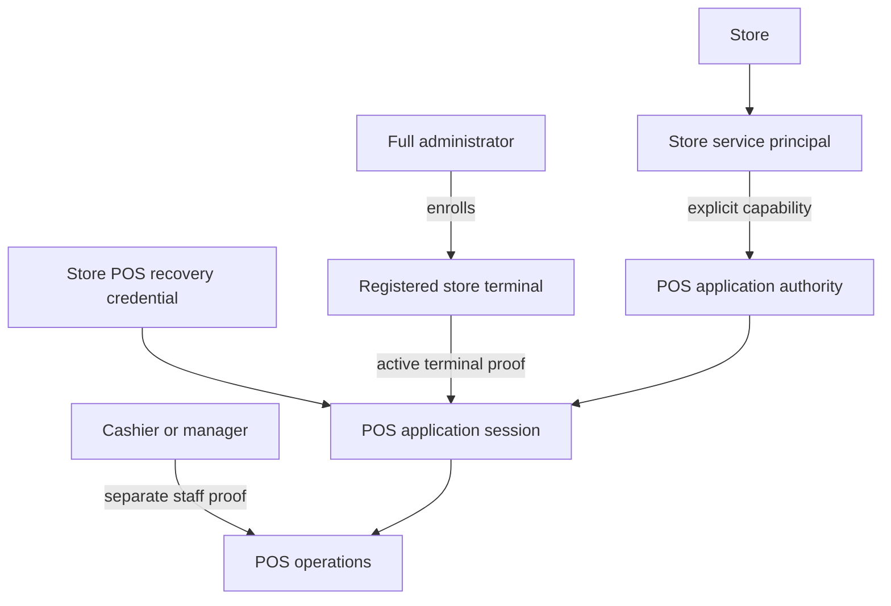

# Store Service Principal Foundation and POS Adoption

## Summary

Athena will add a store-scoped service-principal foundation for non-human systems. POS will be its first consumer, requiring both a store POS recovery credential and an active terminal already registered to that same store before a POS application session can be established.

---

## Problem Frame

Athena currently signs every store's POS application into one shared, human-shaped account. Recovery credentials are store-scoped, but the authenticated application identity is not, and the login UI exposes a hardcoded email that has no operational meaning to the cashier. This makes session identity broader than the store boundary operators expect and leaves registered-terminal proof as a separate recovery concern rather than a mandatory half of application access.

Athena also lacks a general identity category for store-owned software. Modeling every non-human workload as a synthetic user would repeat the same ambiguity for future kiosks, integrations, and managed store runtimes, while coupling the foundational identity model to POS would make those consumers inherit terminal and recovery-code semantics they do not need.

The prose requirements below are authoritative if the diagram and text ever diverge.

---

## Actors

- A1. Full administrator: Establishes store configuration, enrolls or revokes POS terminals, and manages store POS recovery authority.
- A2. POS operator: Uses a registered terminal to recover the POS application session and then signs in separately as staff.
- A3. Store service principal: Represents a non-human system operating for one store with explicitly granted capabilities.
- A4. Registered POS terminal: Supplies store-bound device proof and local continuity evidence for POS access.
- A5. Future store-owned system: Adopts the shared service-principal foundation without depending on POS terminology, terminals, or recovery codes.

---

## Key Flows

- F1. Store service-principal lifecycle
  - **Trigger:** A store is provisioned, deleted, or passes through an available store lifecycle transition.
  - **Actors:** A1, A3
  - **Steps:** Athena creates or reconciles the store's non-human identity, grants only approved capabilities, records lifecycle evidence, and decommissions its authority before deletion or any available disabling/archive transition.
  - **Outcome:** The store has an auditable, default-deny service principal whose authority cannot cross the store boundary.
  - **Covered by:** R1, R2, R3, R5, R6

- F2. Full-admin terminal enrollment
  - **Trigger:** A new browser must become an approved POS terminal.
  - **Actors:** A1, A4
  - **Steps:** The administrator signs in through normal human authentication, chooses the store, registers the browser as a terminal, and leaves it with store-bound terminal proof. POS recovery remains a separate action.
  - **Outcome:** The browser is registered to exactly one store and can proceed to POS recovery for that store.
  - **Covered by:** R7, R8, R9

- F3. Store-and-terminal POS recovery
  - **Trigger:** A registered terminal needs a POS application session.
  - **Actors:** A2, A3, A4
  - **Steps:** Athena derives the store from terminal registration, validates active terminal proof, validates that store's POS capability and recovery credential, establishes a store-scoped POS application session, and then requires separate staff proof for operator work.
  - **Outcome:** POS opens only when the principal, credential, and terminal agree on the same active store.
  - **Covered by:** R10, R11, R12, R13, R14, R15

- F4. Revocation and migration
  - **Trigger:** An administrator revokes authority, a store is disabled, or Athena migrates from the shared POS account.
  - **Actors:** A1, A2, A3, A4
  - **Steps:** Athena independently evaluates principal, capability, recovery credential, terminal, and session state; blocks new server-backed access when any required authority is invalid; preserves queued local business evidence; and records which lane caused the transition. A revoked terminal that proves possession of its last stored terminal proof may receive only a non-authorizing administrator-reconnection disposition and opaque return intent; all other unauthenticated denials stay generic. A disconnected terminal may continue only within its existing bounded validation lease. Reactivation occurs on the affected browser, preserves the same terminal identity and local ledger, rotates proof, and requires fresh POS recovery before upload.
  - **Outcome:** Revocation is narrow, explainable, cannot be bypassed by another valid lane, and never destroys unsynchronized terminal records.
  - **Covered by:** R5, R6, R16, R17, R18

---

## Requirements

**Service-principal foundation**

- R1. Athena must represent store service principals as first-class non-human identities, independent of human users and independent of any one consumer such as POS.
- R2. Every service principal must belong to exactly one organization and one store; no service-principal session or capability may cross that store boundary.
- R3. Service principals must be default-deny and receive explicit consumer capabilities. A valid principal without the required capability must not authorize the consumer.
- R4. The foundation must support consumer-specific credential and session mechanisms so future systems can adopt it without inheriting POS recovery-code or terminal rules.
- R5. Principal creation, capability changes, authentication, revocation, and disabling must produce auditable evidence distinct from consumer-specific and human-actor evidence.
- R6. The foundation must expose an idempotent store-lifecycle reconciliation/decommission boundary: current store deletion and any available or future disabling/archive transition must disable service-principal authority, while individual principals and capabilities remain independently revocable. This initiative does not invent broader store lifecycle product semantics.

**POS as the first consumer**

- R7. Each active store must have exactly one service principal authorized for POS application access, with the legacy shared POS account removed after migration completes.
- R8. A browser may become a registered POS terminal only through a normally authenticated full-administrator enrollment flow.
- R9. Terminal enrollment must bind the browser to exactly one store and must remain separate from POS recovery; a recovery code alone must never enroll a browser.
- R10. POS recovery must derive store scope from the registered terminal rather than accepting an independently selected or overridden store.
- R11. Establishing a POS application session must require all of the following to be valid for the same store: the service principal, its POS capability, the store recovery credential, and active terminal proof.
- R12. An unregistered, revoked, missing-proof, or cross-store terminal must not open POS through ordinary recovery, even when the submitted recovery credential is otherwise valid.
- R13. Recovery failures must remain generic at the unauthenticated boundary so account, principal, terminal, revocation, and credential state cannot be enumerated. The only exception is a non-authorizing `administrator reconnect required` disposition after the submitted terminal ID and last stored proof authenticate the same revoked terminal; it must expose no store, credential, or denial detail and create no application authority.
- R14. The recovery experience must remove the synthetic POS email and instead identify the operational store and terminal. A provisioned terminal's login entry should use its terminal name.
- R15. Service-principal and terminal authentication must not substitute for cashier identity, staff proof, manager approval, drawer authority, or audited command policy.

**Continuity, revocation, and migration**

- R16. Offline POS continuity may continue only for a terminal that previously completed online validation and retains valid local authority; offline mode must not enroll a terminal or establish a fresh service-principal session.
- R17. Administrators must be able to revoke the POS capability, store recovery credential, or terminal independently, and invalidating any required lane must block subsequent server-backed POS recovery and use. Terminal revocation must name the affected store and terminal before confirmation, leave unrelated terminals active, preserve the same terminal identity and queued local records, permit only the remainder of an already-issued offline validation lease, and route the affected browser through one same-store full-administrator reconnection path that rotates proof and requires fresh POS recovery. A recovery credential, old proof, remote terminal-detail action, or replacement terminal row alone cannot satisfy that path.
- R18. Migration must preserve valid store recovery credentials and registered-terminal records where safe, require each existing terminal to recover once against its new store principal, and retire the global shared account only after all stores have a valid replacement path.

---

## Acceptance Examples

- AE1. **Covers R2, R10, R11, R12.** Given an active terminal registered to Store B, when an operator submits Store A's valid recovery credential, recovery fails without opening either store.
- AE2. **Covers R8, R9, R12.** Given a fresh browser with no terminal registration, when an operator supplies a valid store recovery credential, Athena does not enroll the browser or open POS and directs the operator to full-admin enrollment.
- AE3. **Covers R8, R9.** Given a normally authenticated full administrator, when they enroll a new browser for Store A, the browser receives Store A terminal registration but still requires Store A POS recovery before opening POS.
- AE4. **Covers R6, R13, R17.** Given a valid POS session whose terminal is later revoked, when the browser next attempts server-backed POS recovery or use, Athena blocks it even though the service principal and recovery credential remain active, preserves its unchanged terminal identity and queued local records, leaves sibling terminals unaffected, and shows a reconnect-denied state whose only recovery action carries a proof-gated opaque intent through full-administrator sign-in. If that terminal is disconnected when revoked, it may continue local sales only until its existing signed validation lease expires and is denied before upload on reconnect. Same-store full-admin reactivation on that browser rotates proof on the existing terminal row and requires fresh POS recovery; only durably accepted or accepted-for-review event IDs may advance the local sync cursor.
- AE5. **Covers R3, R4, R7, R11.** Given an active store service principal without POS capability, when a registered terminal attempts POS recovery, Athena rejects recovery without granting implicit POS authority.
- AE6. **Covers R14.** Given a registered terminal named Front register for Wigclub Accra, when the operator opens recovery, Athena identifies that store and terminal and does not display a synthetic POS email.
- AE7. **Covers R15.** Given a recovered POS application session, when an operator attempts cashier or manager work without the required staff proof, existing staff and approval gates continue to block the action.
- AE8. **Covers R16.** Given a browser that has never completed online terminal and service-principal validation, when it is offline, Athena does not create a fresh POS session from local or operator-supplied data.
- AE9. **Covers R18.** Given an existing valid terminal during rollout, when its store receives a POS-capable service principal, the terminal retains registration but must complete recovery against that principal before using the new path.

---

## Success Criteria

- No recovery credential can open POS outside its store, and no unregistered browser can open POS through recovery.
- Store-owned systems gain a reusable non-human identity and capability boundary that contains no POS-specific semantics.
- Full administrators have an explicit enrollment and revocation path; POS operators see store and terminal identity rather than a synthetic account.
- Revoking one terminal presents the administrator with its store/name and online/offline consequences, preserves that terminal's unsynchronized records, leaves sibling terminals active, and gives the affected checkout station one administrator reconnection action.
- POS application identity, terminal identity, staff identity, manager approval, and drawer authority remain separately auditable and independently enforceable.
- A downstream planner can identify the shared foundation, POS adapter, migration, rollout, and verification work without inventing product behavior.

---

## Scope Boundaries

- The first delivery implements the foundation and POS consumer; it does not implement a second consumer solely to demonstrate extensibility.
- The foundation does not include POS terminology, recovery-code rules, terminal rules, cashier authority, or drawer policy.
- Cross-store and organization-wide service principals are excluded.
- External customer OAuth, third-party developer applications, and a public API-key platform are excluded.
- Self-service terminal enrollment using only a recovery code is excluded.
- One-time enrollment codes, QR transfer, and existing-terminal-assisted enrollment are deferred.
- One service principal per terminal is excluded; terminals remain a separate proof and lifecycle lane.
- Staff PIN, manager approval, drawer lifecycle, register-session, and command-authorization policy are not redesigned.
- The unrelated storefront build-configuration change already present in the worktree is not part of this initiative.

---

## Key Decisions

- Foundational identity before POS adapter: Service principals are a reusable store identity primitive, while POS contributes only its capability, credential, terminal-proof, and session rules.
- Two independent POS proofs: Store recovery authority and active terminal proof must agree; neither may create, select, or override the other's store scope.
- Full-admin enrollment: New browser registration requires normal administrator authentication rather than treating the recovery code as a provisioning secret.
- Store-derived recovery scope: The registered terminal identifies the store, preventing operator selection from weakening cross-store isolation.
- Separate authority lanes: Application, device, staff, manager, drawer, and command authority remain distinct so a successful login cannot imply operational approval.
- Controlled replacement: Existing terminal registrations and recovery credentials are preserved where safe, but existing terminals must recover once on the new principal before the shared account is retired.

---

## Dependencies / Assumptions

- Stores retain a stable organization relationship and terminal registrations retain a stable store relationship.
- Full administrators continue to use Athena's normal human authentication and organization authorization for terminal enrollment.
- Current recovery credential hashes and salts are already store-scoped and can be rebound without changing the operator's code, but the implementation also persists plaintext today; migration must remove that persisted plaintext and its status exposure.
- Existing local terminal proof can preserve compatibility as one half of POS application recovery when it is validated server-side and treated as bearer proof; stronger asymmetric browser proof is a separate security hardening decision.

---

## Outstanding Questions

### Deferred to Planning

- [Affects R1-R6][Technical] Define the service-principal persistence, capability, session, and authorization boundaries without coupling them to Convex Auth's human-user assumptions.
- [Affects R5, R15][Technical] Map generic principal audit evidence to existing operational events while preserving consumer and human-actor lanes.
- [Affects R7-R18][Needs research] Inventory every POS entry and server authorization boundary that must enforce principal, capability, store, and terminal agreement.
- [Affects R16-R18][Technical] Define the staged migration, compatibility window, session invalidation, and rollback strategy that preserves trading continuity without leaving the shared account as a bypass.
