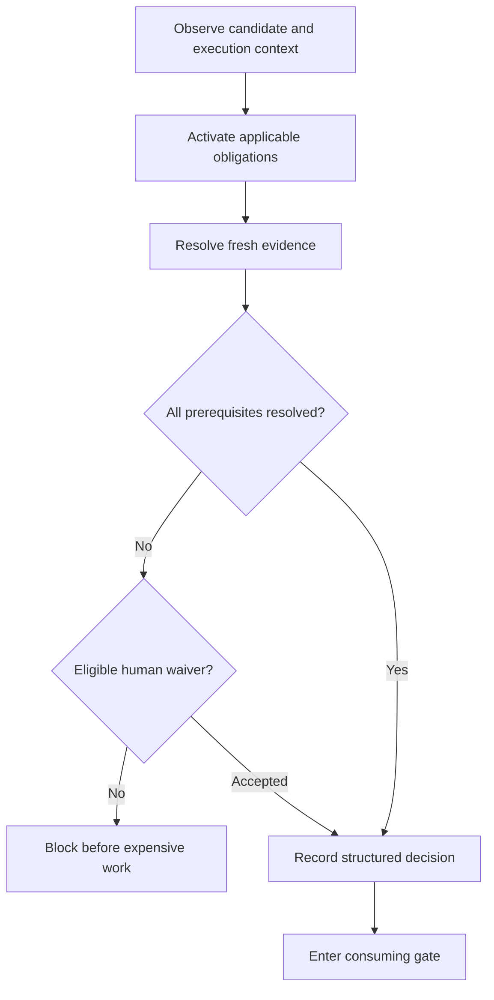

# Harness Gate Obligations And Review Evidence

## Summary

Introduce a reusable harness obligation model in which consuming gates declare prerequisites and accept fresh evidence from approved providers. Use it first to require green independent review before agents enter Athena's heavy validation for large or review-sensitive changes, while preserving a deliberate human acknowledgement path and existing CI ownership.

---

## Problem Frame

Athena's delivery instructions already tell agents to review substantial work before spending the full `pr:athena` merge gate. That ordering is advisory: agents sometimes enter the expensive gate first, consume a full validation cycle, and only then run a review that may request changes and invalidate the work just performed.

The harness can currently prove many facts about a candidate, including its changed surfaces, documentation state, generated-artifact freshness, validation results, tree identity, and base identity. It can also reuse same-candidate validation evidence. It does not have a first-class way for a consuming gate to require evidence of an earlier judgment-bearing action such as independent code review.

Treating review completion as a tracked marker would blur current state with historical claims, dirty the candidate being attested, and introduce copy-forward risk. Treating every caller identically would also make local delivery unnecessarily disruptive for humans, even though the observed failure mode is agents casually disregarding workflow ordering.

The prose requirements are authoritative if this conceptual flow and the text ever diverge.

---

## Actors

- A1. Delivery agent: Implements changes and invokes repo gates through an agent harness.
- A2. Human developer: Runs local validation directly and may deliberately acknowledge a missing judgment-bearing prerequisite.
- A3. CI runner: Repeats repository-owned checks in an environment whose review policy is owned by CI rather than local worktree state.
- A4. Harness maintainer: Registers gates, obligations, evidence providers, activation rules, and review-sensitive surfaces.

---

## Key Flows

- F1. Agent attempts heavy validation for a qualifying candidate
  - **Trigger:** A1 invokes Athena's heavy merge validation after cheap candidate preparation.
  - **Actors:** A1, A4
  - **Steps:** The harness identifies the candidate and execution context, activates the review obligation, verifies approved evidence against the exact candidate and base, and either admits the gate or blocks with review remediation.
  - **Outcome:** Heavy validation cannot begin for qualifying agent work until the current candidate has a green independent review.
  - **Covered by:** R1, R2, R5-R11, R14

- F2. Review changes the candidate
  - **Trigger:** An approved review provider applies or requests a change.
  - **Actors:** A1
  - **Steps:** The candidate changes, prior evidence becomes stale, the resulting candidate is reviewed again, and only a green final review can issue current evidence.
  - **Outcome:** Evidence never authorizes a candidate that differs from the one reviewers approved.
  - **Covered by:** R5-R7, R14

- F3. Human runs the same qualifying gate without independent-review evidence
  - **Trigger:** A2 invokes the gate from an interactive, non-agent context.
  - **Actors:** A2
  - **Steps:** The harness explains the missing prerequisite, offers an inline acknowledgement for this candidate, records the decision accurately as a waiver, and proceeds only after deliberate confirmation.
  - **Outcome:** Humans retain a low-friction path without creating false review evidence.
  - **Covered by:** R4, R10, R12, R16

- F4. A deterministic obligation is evaluated
  - **Trigger:** A gate requires a fact that the harness can derive from current repository state, such as documentation currentness.
  - **Actors:** A1, A2, A3, A4
  - **Steps:** A live deterministic provider evaluates the candidate, returns structured evidence for the current run, and blocks all actors on failure.
  - **Outcome:** Observable truth remains universal and does not require persisted attestations or actor-specific bypasses.
  - **Covered by:** R3, R4, R13, R15

---

## Requirements

**Gate obligation model**

- R1. The harness must maintain one typed, auditable registry of stable gate identifiers, prerequisite obligations, activation rules, acceptable evidence-provider classes, freshness policy, waiver or delegation policy, remediation guidance, and cost classification.
- R2. A consuming gate must own and evaluate its prerequisites before performing the guarded work; invoking a registered public child gate directly must not bypass a prerequisite enforced only by an outer workflow.
- R3. Prerequisite evaluation must be read-only, deterministic for the same inputs, able to report all applicable prerequisite failures together, and return structured decisions suitable for CLI behavior, tests, and delivery telemetry.
- R4. The model must distinguish current facts, activated obligations, evidence that satisfies an obligation, explicit waivers that permit progress without satisfying it, CI delegation, and non-applicable obligations. A waiver must never be represented as successful evidence.

**Candidate identity and evidence**

- R5. Candidate-bound evidence must identify the complete reviewed candidate and its base strongly enough that any material candidate change, base change, or ambiguity makes the evidence stale rather than reusable.
- R6. Multiple explicitly approved independent-review workflows may satisfy the same `review.green` obligation through a common evidence contract, but only after their final outcome is green with no blocking or unresolved actionable findings.
- R7. Local review evidence and human waivers must remain Git-private and worktree-scoped. They must not modify the tracked candidate or be reusable across a different worktree, candidate, or base.

**Review activation**

- R8. The review obligation must activate when a candidate contains at least 50 changed relevant lines, excluding tests, generated artifacts, and lockfiles, or when it touches a registered review-sensitive surface regardless of line count.
- R9. Review sensitivity must be metadata on the existing registered validation scenario or surface, using stable identifiers that the gate policy can reference. The obligation evaluator must not maintain a duplicate list of sensitive path patterns.

**Execution context and exceptions**

- R10. Execution context must be classified centrally as CI, recognized agent, interactive human, or unknown. Positive agent signals must take precedence over terminal interactivity so an agent using a PTY is not treated as human.
- R11. A recognized agent must provide fresh, green evidence from an approved independent-review provider. Agent contexts may not use a human waiver.
- R12. An interactive human may acknowledge the missing review obligation inline. The acknowledgement must be deliberate, accurately recorded as a waiver, and bound to the exact candidate so later changes require a new decision.
- R13. CI may delegate the local review obligation to its declared CI review policy. Unknown or noninteractive contexts without an applicable CI policy must fail closed. Deterministic obligations remain equally binding for agents, humans, and CI.

| Context | Qualifying review obligation | Missing evidence behavior |
|---|---|---|
| Recognized agent | Green independent review required | Block with review remediation |
| Interactive human | Independent review preferred; explicit waiver allowed | Offer candidate-bound acknowledgement |
| CI | Delegated only when CI declares ownership | Follow CI policy; otherwise block |
| Unknown or noninteractive | Fresh acceptable evidence required | Block with context remediation |

**Initial integration and auditability**

- R14. The first enforcement point must guard Athena's expensive validation after cheap preparation has stabilized the candidate and before coverage or other heavy checks begin. If preparation changes a previously reviewed candidate, validation must block until the prepared result is reviewed.
- R15. Documentation currentness must be represented as a live deterministic exemplar of the obligation model without weakening or materially changing the existing documentation policy. It must not require a persisted marker when the current files already prove the fact.
- R16. Gate decisions must be visible in delivery telemetry, including gate, obligation, activation reason, execution context, provider or waiver kind, freshness result, final decision, and prevented cost class. Harness auditing must detect registered public gates that fail to invoke prerequisite evaluation.

---

## Acceptance Examples

- AE1. **Covers R2, R8, R11, R14.** Given an agent candidate with 87 relevant changed lines and no review evidence, when the agent invokes the heavy Athena gate or its registered public validation child directly, the command blocks before expensive validation and directs the agent to an approved review workflow.
- AE2. **Covers R5-R7, R11.** Given a green review receipt for a qualifying candidate, when any tracked candidate content or the resolved base changes, the prior receipt is stale and the agent must obtain a green review for the resulting candidate.
- AE3. **Covers R8, R9, R11.** Given a 12-line change to a review-sensitive authentication or payment scenario, when an agent invokes the heavy gate, the review obligation activates despite being below the line threshold.
- AE4. **Covers R8.** Given a change containing only tests, generated artifacts, or lockfile churn and no review-sensitive surface, when the heavy gate evaluates prerequisites, the line-count rule does not activate the review obligation.
- AE5. **Covers R10, R12.** Given a qualifying candidate with no review evidence in an interactive human shell, when the human accepts the inline acknowledgement, the harness records a candidate-bound waiver and permits that gate run without claiming that independent review passed.
- AE6. **Covers R10-R13.** Given an agent running commands through a PTY, when context is classified, the positive agent signal wins and no human acknowledgement is offered. Given an unknown noninteractive context, the gate blocks rather than guessing that the caller is human.
- AE7. **Covers R3, R4, R13, R15.** Given documentation that is required but missing or stale, when any actor runs the documentation check or a consuming gate evaluates that obligation, the deterministic provider blocks without offering a human review waiver.
- AE8. **Covers R6.** Given either approved review workflow produces a green final result for the same candidate and base, when its evidence is recorded through the common contract, the heavy gate accepts it without depending on which workflow produced it.
- AE9. **Covers R14.** Given review evidence exists before cheap preparation, when preparation repairs generated or tracked artifacts and changes the candidate, the heavy gate stops after preparation and reports the review evidence as stale before entering coverage or other heavy validation.
- AE10. **Covers R16.** Given a new public guarded gate is registered but does not invoke prerequisite evaluation, when the harness audits its own contract, the audit fails with an actionable registration or wiring finding.

---

## Success Criteria

- Agents cannot accidentally spend Athena's heavy merge-validation cycle on qualifying work that has not passed independent review of the current candidate.
- Review-requested changes structurally force another review before the heavy gate, eliminating successful validation of a candidate already known to need correction.
- Human developers retain a concise, deliberate local path and can see that they waived review rather than passed it.
- Harness maintainers can apply the same prerequisite posture to another gate by registering an obligation and provider without inventing a new marker format or actor-detection path.
- Documentation currentness proves that the model supports live deterministic evidence as well as historical candidate-bound attestations.
- Downstream planning can identify every policy decision, actor branch, activation rule, and acceptance scenario without inventing product behavior.

---

## Scope Boundaries

- The first increment will not migrate every existing harness gate into the obligation registry.
- The obligation evaluator will not become a command scheduler, repair engine, or replacement for the existing delivery-run orchestrator.
- Review evidence will not be stored in tracked marker files.
- Human acknowledgement will not be treated as proof that independent review passed.
- The first increment will not add cryptographic, biometric, or externally authenticated proof that a caller is human.
- The design targets accidental and casual workflow bypass. It does not attempt to defend against a deliberately malicious caller that edits the harness or fabricates local state.
- Existing documentation requirements and thresholds will not be relaxed or expanded merely to demonstrate the generic model.

---

## Key Decisions

- Consuming-gate ownership: prerequisite enforcement belongs to the gate that relies on the evidence, protecting every supported invocation path.
- Obligations rather than markers: requirements name the truth a gate needs, while providers decide how that truth can be proven.
- Accurate exceptions: human acknowledgement is a waiver, CI ownership is delegation, and neither is mislabeled as green review evidence.
- Exact-candidate freshness: the system favors a simple strong invariant over permitting unreviewed deltas or trying to infer that a later edit was harmless.
- Registry separation: product-surface metadata continues to describe changed areas, while a distinct gate-policy registry describes prerequisite relationships and cross-references stable surface identifiers.
- Right-sized adoption: the initial increment proves the abstraction with one historical review obligation and one live deterministic documentation obligation before broader migration is considered.

---

## Dependencies / Assumptions

- Approved review workflows can expose a structured final verdict and identify the candidate they reviewed.
- Agent harnesses expose stable positive environment signals that can be maintained centrally; terminal interactivity alone is not sufficient identity evidence.
- Athena's cheap preparation step remains safe to run before prerequisite enforcement and continues to stop on ambiguous untracked or unstaged state.
- CI has an explicit, testable policy boundary that can own or decline delegation of the local review obligation.

---

## Outstanding Questions

### Deferred to Planning

- [Affects R5, R7][Needs research] Which existing tree and diff fingerprint primitives should define the canonical complete candidate without inheriting exclusions intended only for delivery documentation?
- [Affects R6][Technical] What is the smallest common adapter contract that both approved review workflows can produce after their final green pass?
- [Affects R10][Needs research] Which positive environment signals are stable across the agent harnesses Athena supports, and how should precedence with CI signals be tested?
- [Affects R14][Technical] Which public heavy-validation entry points need direct adapters so supported child invocation cannot bypass the prerequisite evaluator?
- [Affects R15][Technical] How should the documentation check expose live structured evidence without duplicating its existing policy evaluation or changing its standalone CLI contract?
