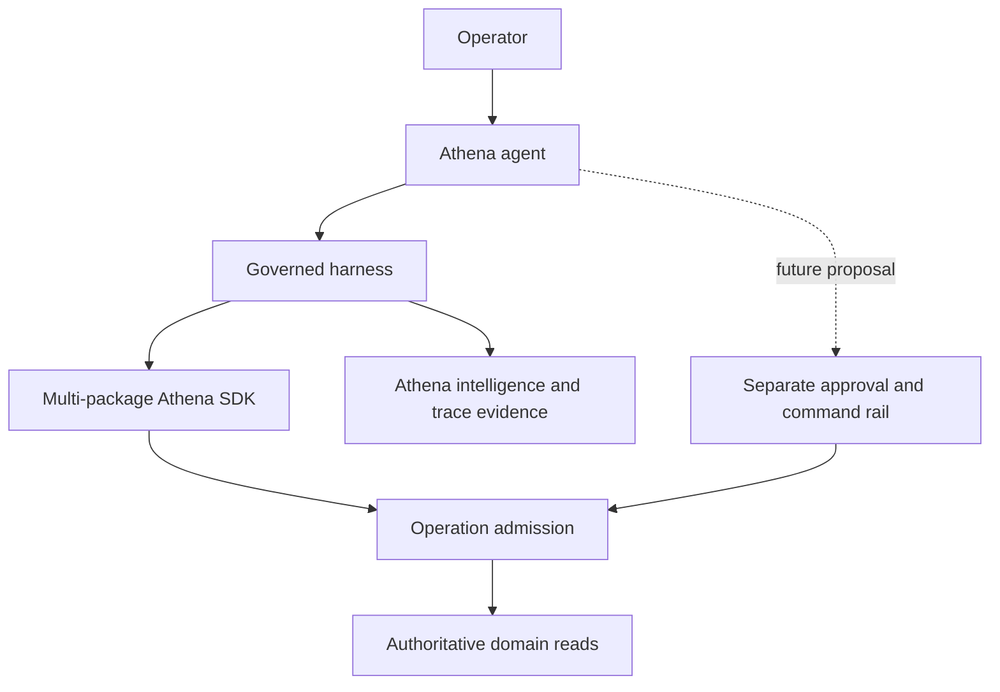

# Athena Agent Harness Foundation

## Summary

Add a foundational agent harness in which Convex Agent is the first conversational runtime while Athena retains authority over identity, permissions, operational truth, intelligence artifacts, evidence, approvals, and domain mutations. Convex Agent integrates through an Athena-owned runtime adapter so its thread, message, persistence, and streaming APIs do not become harness-kernel contracts. Agents will use a constrained, multi-package TypeScript SDK for governed read composition, with the full Daily Operations surface as the first read-only release.

---

## Problem Frame

Athena already has strong but disconnected foundations for intelligence runs and artifacts, deterministic automation, operation admission, approval-aware commands, context snapshots, operational events, and workflow traces. It does not yet have a model-driven execution loop, an agent principal and delegated grant, a semantic data-query layer, or a safe code-execution boundary that lets a model compose those capabilities.

Exposing every backend function as a handwritten model tool would duplicate policy, consume model context, couple tools to individual screens, and constrain emergent cross-domain work. Exposing Convex or database access directly would bypass the semantic, authorization, and evidence boundaries Athena has established. The foundation therefore needs to make Athena's existing product capabilities safely composable without turning the agent runtime into a second source of business truth.

---

## Actors

- A1. Operator: Asks Athena questions and receives evidence-backed answers within their authorized store and role scope.
- A2. Athena agent: Plans, discovers relevant capabilities, writes bounded TypeScript, evaluates results, and explicitly completes or reports partial/blocked work.
- A3. Capability owner: Publishes governed semantic resources from a product domain without modifying the harness core.
- A4. Athena platform: Issues grants, validates and executes programs, enforces budgets, records evidence, and preserves source-of-truth boundaries.
- A5. Manager or approver: Reviews future agent proposals through Athena's existing approval and domain-command contracts; does not confer authority through model-runtime approval alone.

---

## Key Flows

- F1. Read-only agent task
  - **Trigger:** A1 asks a question about the Daily Operations surface.
  - **Actors:** A1, A2, A4
  - **Steps:** The harness derives a run grant; the agent discovers relevant capabilities; it submits a constrained TypeScript program; the platform validates and executes authorized reads; the agent interprets the structured result and returns an evidence-backed answer.
  - **Outcome:** The operator receives a useful answer whose scope, freshness, sources, and completeness are defensible.
  - **Covered by:** R1-R14, R18, R21

- F2. Cross-domain composition
  - **Trigger:** A task requires information from more than one authorized capability package.
  - **Actors:** A2, A3, A4
  - **Steps:** Discovery returns only relevant declarations; the generated SDK combines the authorized domain namespaces; the program performs bounded reads and local deterministic transformations; the platform correlates all calls under one execution trace.
  - **Outcome:** A new outcome can be achieved through composition without adding a use-case-specific model tool or changing the harness core.
  - **Covered by:** R4-R13, R16-R18

- F3. Capability publication
  - **Trigger:** A3 wants a domain resource to become agent-readable.
  - **Actors:** A3, A4
  - **Steps:** The owner declares a semantic manifest tied to admitted backend operations; publication validates naming, schemas, scope, sensitivity, evidence, lifecycle, and conformance; the deployment publishes an immutable registry digest.
  - **Outcome:** Authorized agents can discover and use the capability without gaining raw backend access.
  - **Covered by:** R5-R9, R16-R17

- F4. Future proposed mutation
  - **Trigger:** A future agent task concludes that domain state should change.
  - **Actors:** A1, A2, A4, A5
  - **Steps:** The read executor produces a proposal artifact; Athena refreshes command preconditions; any required approval is obtained through Athena's approval rail; the owning domain command applies or rejects the change.
  - **Outcome:** The model never converts runtime permission into mutation authority, and the domain command remains authoritative.
  - **Covered by:** R3, R15, R20

---

## Requirements

**Authority and runtime boundaries**

- R1. Convex Agent is the only first-release agent runtime and must own conversation, model reasoning, tool-loop progression, runtime thread state, and final narrative through an Athena-owned runtime adapter, while Athena-owned records remain authoritative for business artifacts, authorized history, execution evidence, policy, approvals, operational events, and domain state.
- R2. TanStack AI must remain a provider adapter for existing structured-generation capabilities; adopting Convex Agent behind the runtime adapter must not require moving Athena business authority into either library.
- R3. The first release must be read-only. No mutation, scheduling, network, credential, or domain-command capability may be reachable from the read-program runtime.
- R4. The harness and SDK must be foundational and domain-neutral. Daily Operations must integrate through the same capability-package and agent-profile adapter contracts future surfaces will use, not through Daily Operations logic embedded in the executor, registry, grant engine, or agent loop.
- R21. Convex Agent-specific thread, message, persistence, streaming, cancellation, usage, tool-definition, and cleanup APIs must remain behind an Athena-owned `AgentRuntimeAdapter` contract using opaque runtime references and Athena-normalized events. The contract must include bidirectional tool dispatch—Athena-owned tool definitions and validators, normalized call identity, request-fingerprinted idempotency, and typed handler outcomes—while the adapter alone converts those definitions and outcomes to runtime-native tool objects. Usage normalization must identify each provider invocation/retry stream, fix its delta-versus-cumulative mode, deduplicate and order updates, reconcile terminal totals, and conservatively settle missing terminal usage. Conservative settlement is final for charging; late usage is evidence-only and may not lower spend. Runtime-native usage objects never leave the adapter. The first release does not implement or compare another agent SDK. Convex Agent imports are permitted only inside the adapter directory, including a registration-only composition-root shim and adapter-specific tests; capability, admission, execution, evidence, completion, presentation, and root configuration code must otherwise depend on local Athena contracts.

**Semantic Athena SDK**

- R5. A single run must be able to receive and compose capabilities from multiple authorized packages through canonical product-domain namespaces.
- R6. Agents must query governed semantic resources and authoritative product views rather than Convex tables, raw document identifiers, UI component shapes, or backend module names.
- R7. Resources must expose a predictable read vocabulary with only the supported standard operations, resource-specific typed filters, authorized projections, bounded pagination, and explicit collection limits.
- R8. SDK contracts must use canonical typed domain values, typed opaque references for relationships, and explicit semantics for unknown, unavailable, stale, partial, and unauthorized data.
- R9. Domain-owned manifests must provide purpose, operation support, argument and result contracts, field meaning, scope, freshness, cost, sensitivity, evidence behavior, completeness rules, examples, immutable capability identity, and lifecycle state.
- R10. Manifests must compile at build or deployment time into validated declarations, runtime schemas, and an immutable registry digest; namespace collisions or invalid bindings must prevent publication.
- R11. Capability discovery must be progressive and on demand. The model must not receive the full SDK catalog or every declaration in its default context.

**Delegation, execution, and evidence**

- R12. Every run grant must be the fail-closed intersection of the agent profile, initiating operator permissions, tenant/store scope, capability lifecycle, and run-specific policy. Sensitive fields outside the grant must be absent from discovery, generated types, accepted projections, and results.
- R13. Agents must submit deterministic, import-free TypeScript programs to one execution tool that validates before reading, uses a mediated asynchronous capability bridge, and permits local branching, iteration, transformation, and bounded concurrency.
- R14. The executor must enforce runtime-controlled time, memory, read, result-size, call, pagination, concurrency, and retry budgets; programs may inspect remaining budget but may not modify it.
- R15. Each program must produce exactly one explicit structured output. Expected partial or unavailable reads remain typed results, while invalid programs, grant violations, sandbox violations, and interpreter failures abort safely.
- R16. Every read must return a uniform envelope carrying data, freshness and pagination metadata, completeness, and source references. Final completeness must be derived from cited inputs and may be downgraded but never overstated.
- R17. Capability publication must require generated conformance tests covering schema adherence, scope isolation, grant enforcement, field omission, pagination, freshness, evidence, determinism, and budget accounting. V1 needs only unpublished, enabled, and disabled states plus an immediate kill switch; staged canary/stable promotion ceremony is deferred until product scale justifies it. Before an incompatible deploy, one atomic fence must disable the profile and advance a durable compatibility epoch that every dispatch, result release, and completion checks; old-epoch work is canceled without waiting for drain. While disabled, the post-deploy smoke runs directly against the harness contracts without creating a profile turn; broad enablement follows, and the first real turns are monitored.
- R18. Agent runs, program attempts, capability calls, budgets, source references, scratch artifacts, intelligence artifacts, and completion must share a correlated Athena execution trace. Persist program source and a normalized invocation ledger, but not full intermediate datasets by default.

**Product release and future commands**

- R19. The first release must let an authorized operator ask open-ended questions across the full Daily Operations surface, including but not limited to identifying what needs attention, and receive source-linked, freshness-aware, honestly bounded answers.
- R20. Future mutations must use a separate command namespace and execution rail that creates proposals, refreshes preconditions, obtains Athena-native approval when required, and calls the owning admitted domain command. Read programs must never be widened to perform commands.

---

## Acceptance Examples

- AE1. **Covers R4, R5, R19.** Given an operator asks a question spanning store-day readiness, register activity, operational work, and stock conditions, when all required packages are granted, the agent can compose them in one run without a Daily-Operations-specific backend tool.
- AE9. **Covers R4, R9, R17.** Given a second Athena surface is ready for agent access, when its domain owners publish conforming capability manifests and a new agent profile selects them, the surface can reuse the existing discovery, grant, execution, evidence, and completion rails without changing the harness core or Daily Operations adapter.
- AE2. **Covers R11-R13.** Given an agent profile can access several packages, when it begins a task, it sees a compact discovery interface and receives detailed declarations only for capabilities it selects.
- AE3. **Covers R12.** Given two operators have different store or role access, when they run the same generated program, each execution returns only fields and records authorized by its own grant; changing program text cannot widen access.
- AE4. **Covers R14-R16.** Given a read reaches its collection or execution budget before exhausting available rows, when the program completes, its result is explicitly partial or truncated and the final answer cannot claim complete coverage.
- AE5. **Covers R13, R15.** Given submitted code imports a package, accesses ambient time or randomness, performs network access, omits explicit output, or produces multiple outputs, validation or execution fails without running unauthorized backend work.
- AE6. **Covers R16, R18.** Given an operator inspects an agent answer, when they follow its evidence, Athena can identify the run, program attempt, capability operation, normalized arguments, freshness, source references, and result hash without retaining all intermediate records.
- AE7. **Covers R17.** Given a capability manifest exposes a field that its grant should omit or returns data outside its declared scope, when publication checks run, the capability cannot advance to a grantable lifecycle stage.
- AE8. **Covers R20.** Given a future agent recommends a stock correction, when the change requires approval, the read run can persist a proposal but cannot apply it; application occurs only after fresh preconditions and the existing manager-proof or asynchronous approval path succeed.
- AE10. **Covers R1, R21.** Given the harness kernel, capability packages, or reusable host are tested without a live Convex Agent component, when a contract fake supplies opaque runtime references and drives the normalized lifecycle plus bidirectional tool-dispatch contract, the same authorization, invalid-argument handling, idempotency, cancellation, execution, evidence, completion, and presentation behavior can be verified without importing Convex Agent outside its adapter directory or registration-only shim.

---

## Success Criteria

- Operators can ask varied questions across Daily Operations and receive useful, evidence-backed answers without a new backend tool for each question shape.
- A capability owner can add an agent-readable domain package through a governed manifest and existing admitted operations without changing the harness core.
- A second product surface can be added through a capability/profile adapter without copying or branching the Daily Operations implementation.
- A deterministic runtime contract fake exercises the same run, bidirectional tool dispatch, authorization, evidence, completion, cleanup, and presentation behavior as the Convex Agent adapter, and static checks keep Convex Agent imports inside its adapter directory and registration-only composition seam.
- Security tests demonstrate that generated code cannot expand its grant, reach raw Convex or host facilities, reveal omitted sensitive fields, or invoke mutations.
- Execution remains bounded and auditable under large result sets, partial failures, retries, and concurrent reads.
- Convex Agent, its Athena runtime adapter, TanStack AI, automation, intelligence, workflow traces, and domain commands retain distinct responsibilities with no competing source of truth.
- Convex Agent-specific types and component APIs are absent from capability packages, grants, the executor, evidence, completion, and the reusable presentation host.
- The first-release evaluation suite demonstrates successful multi-resource Daily Operations tasks, honest partial completion, evidence citation, and explicit completion behavior.

---

## Scope Boundaries

- Do not expose raw `ctx.db`, public or internal Convex function registries, table identifiers, document IDs, environment variables, credentials, network, filesystem, imports, dynamic evaluation, timers, randomness, or ambient clock access.
- Do not expose every admitted backend function directly to the model; admitted operations are bindings beneath semantic resources.
- Do not add general server-side joins or a generic predicate/query-string language in the first release; relationships are followed through typed references and composed in bounded TypeScript.
- Do not make agent-runtime tables, provider messages, runtime-native sessions, traces, or model-native tool approvals authoritative business records; this includes Convex Agent component state.
- Do not replace deterministic automation with model judgment. Automation continues to own scheduled, policy-deterministic action; the agent handles open-ended reasoning.
- Do not add RAG, broad long-term memory, background autonomy, self-modification, or multi-agent product behavior to the first release.
- Do not commit to a sandbox technology before the focused runtime evaluation.
- Do not implement or compare OpenAI Agents SDK, Claude Agent SDK, Deep Agents, or another alternate orchestration runtime in the first release; portability is established through the adapter contract and contract fake, not a second production integration.
- Do not include mutation execution in the first release.

### Deferred to Follow-Up Work

- Agent-authored proposals and Athena-native approval/apply flows through the separate command rail.
- Additional product capability profiles beyond Daily Operations.
- Long-running background tasks, richer checkpoint/resume behavior, and durable memory when demonstrated use cases require them.
- RAG-backed document retrieval and semantic search where structured Athena resources are insufficient.

---

## Key Decisions

- Use Convex Agent as the only first-release agent loop behind an Athena-owned `AgentRuntimeAdapter`; borrow selected Deep Agents patterns—progressive capability discovery, constrained code execution, scratch artifacts, explicit completion, and resumable task thinking—without adopting LangChain or implementing a second runtime.
- Treat each product surface as an adapter that selects capability packages, prompt/context policy, budgets, and presentation while reusing one harness kernel.
- Treat the Athena capability SDK, agent-runtime contract, and program protocol as stable Athena boundaries; keep the Convex Agent integration and sandbox engine behind replaceable adapters without requiring an alternate runtime implementation in v1.
- Prefer one foundational code-execution tool over a growing catalog of use-case tools, while keeping every backend read explicit, typed, admitted, budgeted, and auditable.
- Use product/domain vocabulary rather than backend implementation vocabulary throughout manifests and generated declarations.
- Use stable internal capability identities separately from readable namespace paths so domain vocabulary can evolve without losing audit continuity.
- Keep programs stateless per execution; durable work must be explicit through governed scratch or artifact records.
- Deduplicate identical calls only within a program execution; do not introduce implicit cross-run caching.
- Permit ordinary program concurrency while the executor enforces global, package, and operation scheduling limits.

---

## Dependencies / Assumptions

- Athena's complete operation-admission rail remains the mandatory backend enforcement boundary.
- Athena's intelligence run, snapshot, provider-invocation, artifact, source-reference, and visibility concepts remain the starting persistence vocabulary, but their agent-era lifecycle may require extension.
- Existing `CommandResult`, approval proof, approval request, operational event, automation run, and workflow trace rails remain authoritative for future apply behavior and investigation evidence.
- Daily Operations already exposes or can supply bounded authoritative read models for its operator-visible surface.

---

## Outstanding Questions

### Deferred to Planning

- [Affects R13-R15][Needs research] Which sandbox adapter best satisfies isolation, async bridge, TypeScript subset, resource limits, observability, and Convex runtime constraints for the first implementation?
- [Affects R1, R15, R18][Technical] Which agent execution states belong on the existing intelligence run/artifact lifecycle, and which require a distinct child execution or attempt ledger?
- [Affects R9-R10][Technical] How should capability manifests be colocated with domain ownership while compiling into one collision-free registry?
- [Affects R1-R2, R21][Needs research] Which Convex Agent integration path best satisfies the Athena runtime-adapter contract, preserves the existing TanStack provider seam, and prevents component storage or tracing from becoming business truth?
- [Affects R19][Technical] Which authoritative Daily Operations resources form the minimum complete first profile, and where do current read models need semantic reshaping or bounded variants?
