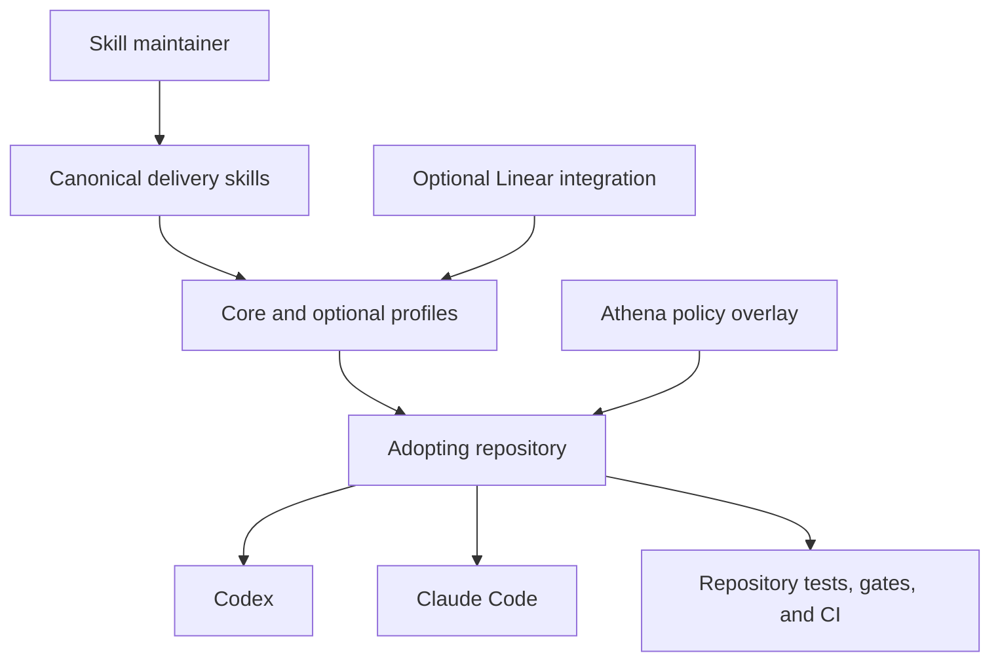

# Cross-Agent Delivery Skills

## Summary

Establish `agent-skills` as the canonical, cross-agent distribution of a focused software-delivery system: standards-compliant reusable workflows, optional integrations, and thin host adapters that can be installed safely into any repository. Athena remains the advanced reference implementation and consumes the portable core alongside a local policy overlay.

---

## Problem Frame

Athena has accumulated a strong agent-delivery system across reusable skills, repository instructions, reviewer prompts, deterministic sensors, and CI-backed gates. That system makes planning, implementation, validation, review, merge readiness, and compounding explicit rather than leaving delivery quality to an agent's unaided judgment.

The reusable workflow behavior is currently mixed with Athena-specific commands, deployment rules, tracking configuration, evidence contracts, and generated-artifact policy. The repo-local collection also vendors skills from several upstream sources, and its provenance has drifted as both Athena and those upstream sources evolved. Copying the whole directory would export unnecessary domain skills, reproduce unresolved dependencies, and make future updates difficult to reconcile.

The existing `agent-skills` repository contains an earlier five-skill extraction, but it is not yet a downstream distribution system. Its source assumptions are stale, its portable copies lag later workflow improvements, and it does not prove safe installation or equivalent behavior across agent hosts.

---

## Actors

- A1. Skill maintainer: Evolves the canonical workflows, compatibility contract, profiles, and release evidence.
- A2. Repository adopter: Installs selected workflows into a repository without surrendering that repository's own commands, architecture, or policy.
- A3. Delivery agent: Uses the installed workflows to plan, implement, validate, review, and hand off software work.
- A4. Agent host: Discovers and invokes the same canonical workflows through host-specific conventions; Codex and Claude Code are the v1 hosts.
- A5. Integration owner: Configures optional external capabilities such as Linear without making them mandatory for the portable core.
- A6. Athena maintainer: Retains Athena-specific delivery policy while consuming the same portable workflow source used elsewhere.

---

## Key Flows

- F1. Install a delivery profile
  - **Trigger:** A2 wants the delivery workflows available in a repository.
  - **Actors:** A1, A2, A4
  - **Steps:** The adopter selects a profile and supported hosts; installation validates the source and dependency closure; it detects conflicts before changing the repository; it exposes the selected canonical workflows to each host; it records enough provenance to reproduce or update the installation.
  - **Outcome:** The repository gains a valid, reviewable skill set without unrelated files being removed or overwritten silently.
  - **Covered by:** R1-R5, R12-R18

- F2. Deliver ordinary software work
  - **Trigger:** A2 asks A3 to build, fix, modify, refactor, debug, or ship software.
  - **Actors:** A2, A3, A4
  - **Steps:** The delivery router selects the appropriate workflow; the agent discovers repository policy and sensors; it establishes the work contract; it implements with the selected test posture; it validates and reviews against repository evidence; it records any durable learning and provides an evidence-backed handoff.
  - **Outcome:** Codex and Claude Code follow materially equivalent delivery behavior while respecting the adopting repository's own finish line.
  - **Covered by:** R6-R11, R19-R22

- F3. Activate optional Linear tracking
  - **Trigger:** A5 installs and configures the Linear profile for a repository.
  - **Actors:** A2, A3, A5
  - **Steps:** The profile resolves configured project context; planning can create atomic work items; execution can maintain status and evidence; missing or unavailable tracker capabilities degrade to an explicit handoff rather than breaking core delivery.
  - **Outcome:** Linear-backed repositories gain Athena's tracking discipline while repositories without Linear retain the complete core workflow.
  - **Covered by:** R8, R10, R15, R20, R21

- F4. Evolve and republish a workflow
  - **Trigger:** A1 identifies a reusable improvement in Athena or another adopting repository.
  - **Actors:** A1, A2, A4, A6
  - **Steps:** The maintainer separates reusable behavior from repository-specific policy; updates the canonical source; validates standards, dependencies, hosts, and representative scenarios; publishes a traceable version; adopters can review and apply the update without losing local overlays.
  - **Outcome:** Reusable learning has one source of truth and does not require parallel edits to host-specific or repository-specific copies.
  - **Covered by:** R1-R5, R16-R18, R22-R26

- F5. Adopt the portable core in Athena
  - **Trigger:** The cross-agent distribution has passed its v1 validation contract.
  - **Actors:** A1, A3, A6
  - **Steps:** Athena adopts the canonical portable workflows; Athena-only tracking, harness, deployment, evidence, reporting, and product rules remain in its local overlay and repository instructions; Athena's existing deterministic gates continue to authorize delivery.
  - **Outcome:** Athena retains its stronger local finish line without maintaining a divergent copy of reusable workflow behavior.
  - **Covered by:** R9-R11, R23-R26

---

## Requirements

**Canonical product and compatibility boundary**

- R1. `agent-skills` must be the canonical source of the portable delivery workflows. Host-specific exposure and repository-specific overlays must not become independent workflow forks.
- R2. Every core workflow must conform to the open Agent Skills format and remain usable without relying on host-specific frontmatter or dynamic-instruction extensions.
- R3. V1 must support Codex and Claude Code as verified hosts with materially equivalent workflow names, triggers, scope boundaries, and outcomes.
- R4. Host adapters may define discovery, invocation, presentation metadata, and tool-capability mappings, but must not redefine delivery policy.
- R5. The distribution must declare its supported hosts, environment assumptions, external tools, optional integrations, and compatibility limits rather than relying on a maintainer's machine state.

**Portable delivery capabilities**

- R6. The core must provide a default router for ordinary software-delivery requests and route fuzzy requirements, diagnosis, planning, implementation, review, and compounding to the appropriate workflow when each is applicable.
- R7. The core delivery contract must preserve explicit planning, test-first or characterization-first execution, focused validation, independent review proportional to risk, scope control, compounding, and evidence-backed handoff.
- R8. Tracking must be an optional capability. Core planning and delivery must function without an issue tracker, while the Linear profile may add atomic ticket creation, dependency management, status updates, evidence comments, and closure.
- R9. Reusable skills must discover and respect the adopting repository's instructions, documented commands, architecture constraints, and validation sensors instead of embedding Athena commands or assuming a particular language, framework, package manager, branch policy, or deployment topology.
- R10. A missing optional capability must produce a clear degraded path or handoff. It must not leave an invoked workflow stranded on an unresolved skill, plugin, connector, or agent prompt.
- R11. Repository policy, domain facts, sensitive operational rules, and deterministic enforcement belong to repository instructions, overlays, scripts, tests, and CI rather than the portable workflow body.

**Profiles, installation, and lifecycle**

- R12. An adopter must be able to select a focused profile rather than receiving every available skill. V1 must distinguish at least the tracker-neutral core from the optional Linear capability.
- R13. Installation must validate the complete selected source, dependency graph, and target conflicts before mutating the adopting repository.
- R14. Installation and updates must preserve unrelated existing skills, instructions, and repository changes. No workflow may delete or replace an unselected target as a side effect.
- R15. Installation must be repeatable and produce an inspectable record of the installed profile, canonical source version, host exposure, optional integrations, and local overlay boundary.
- R16. Reapplying the same version and profile must be idempotent; applying an update must surface local divergence or conflicts before replacement.
- R17. The distribution must provide a supported removal or rollback path that removes only artifacts owned by that installation.
- R18. Installation must not embed maintainer-specific absolute paths, credentials, private machine configuration, or implicit global-skill dependencies.

**Validation and evidence**

- R19. Every published core skill must pass Agent Skills structural validation, relative-reference validation, and dependency-closure validation.
- R20. Representative scenarios must prove that equivalent user requests select the intended workflow and preserve the same delivery contract in Codex and Claude Code.
- R21. Validation must cover both configured and absent optional integrations, including an unavailable Linear capability.
- R22. A clean fixture repository must prove installation, discovery by both v1 hosts, invocation of the selected core workflows, update behavior, conflict safety, and removal or rollback.
- R23. Automated checks must prevent Athena-specific commands, deployment mappings, tracking identifiers, credentials, or product URLs from entering the tracker-neutral core.
- R24. Every vendored or adapted upstream artifact must carry source provenance, version or revision, modification status, and applicable license information.

**Athena extraction and adoption**

- R25. Porting must classify each candidate rule as portable workflow behavior, optional integration behavior, host-adapter behavior, Athena overlay policy, upstream dependency, or excluded domain skill before moving it.
- R26. Athena must adopt the validated canonical core plus an Athena-owned overlay only after parity scenarios demonstrate that its existing delivery finish line is preserved; portability work must not weaken Athena's harness, review evidence, deployment, reporting, telemetry, or generated-artifact obligations.

---

## Acceptance Examples

- AE1. **Covers R1-R5, R12, R19, R22.** Given a clean repository and the core profile, when the adopter enables Codex and Claude Code, both hosts discover the same canonical workflow set and can invoke materially equivalent delivery behavior without duplicate workflow bodies.
- AE2. **Covers R13-R18.** Given a repository already contains unrelated local skills and instructions, when installation encounters a naming conflict, it reports the conflict before mutation and leaves the repository unchanged unless the adopter explicitly resolves it.
- AE3. **Covers R8, R10, R21.** Given the core is installed without Linear, when delivery identifies follow-up work, it records an actionable handoff instead of attempting unavailable tracker operations or failing the delivery workflow.
- AE4. **Covers R8, R12, R15, R21.** Given the Linear profile is installed and configured, when approved work needs decomposition, the tracking workflow can create atomic, dependency-aware work items and hand them to execution without changing the tracker-neutral core.
- AE5. **Covers R6-R11, R20.** Given the same bounded implementation request and the same repository instructions, when Codex and Claude Code execute the workflow, both establish the same scope, test posture, expected sensors, review finish line, and handoff categories even if their tool calls differ.
- AE6. **Covers R13, R14, R16, R17.** Given an update contains an invalid skill or unresolved dependency, when an adopter attempts to apply it, validation fails before replacement and the previously installed version remains usable.
- AE7. **Covers R10, R19, R24.** Given a core skill references another workflow, reviewer prompt, script, or optional connector, when release validation runs, the dependency is either bundled, explicitly declared optional with a degraded path, or rejected as unresolved.
- AE8. **Covers R23, R25, R26.** Given an Athena delivery rule is being considered for export, when it names Athena-only gates or operational behavior, it remains in the Athena overlay unless a repository-neutral contract and cross-host scenario prove it belongs in the core.
- AE9. **Covers R1, R15, R25, R26.** Given a reusable improvement is first proven in Athena, when it is promoted to the canonical distribution and Athena updates, the reusable behavior is changed once while Athena's local policy remains intact.

---

## Success Criteria

- A repository adopter can clone the distribution, select a profile, and make the workflows available to Codex and Claude Code without manually rewriting skill instructions.
- The tracker-neutral core completes planning and delivery scenarios without Linear, Compound Engineering, Superpowers, or another undeclared plugin being installed.
- Enabling the Linear profile adds tracking behavior without changing the canonical core workflows or making Linear mandatory elsewhere.
- A clean fixture proves safe install, host discovery, representative invocation, update, conflict handling, and removal or rollback.
- Automated validation rejects broken references, unresolved required dependencies, unsafe target replacement, invalid skill metadata, missing provenance, and Athena-specific leakage into the core.
- Athena can consume the canonical core with a local overlay while retaining its current merge-ready and post-merge delivery obligations.
- A reviewer can trace each exported rule to its source classification and understand why it belongs in the core, an adapter, an integration, an overlay, or the excluded set.
- The resulting repository provides a concise, demonstrable account of how reusable AI workflows, repository policy, and deterministic enforcement combine to deliver software responsibly.

---

## Scope Boundaries

### Deferred for later

- Additional issue trackers beyond Linear.
- Verified host adapters beyond Codex and Claude Code.
- Public marketplace or plugin-directory publication.
- Organization-wide managed installation and centrally enforced update policy.
- Domain packs for Convex, Cloudflare, frontend motion, browser automation, documents, or other specialized work.
- Quantitative cross-model workflow evaluations beyond the representative v1 scenarios.
- Automated promotion of repository-specific learnings into the canonical core.

### Outside this product's identity

- A mirror of every skill, reviewer prompt, or plugin currently present in Athena.
- A replacement for repository-owned architecture documentation, tests, runtime scenarios, CI, or release gates.
- A bundle of credentials, authenticated connectors, MCP servers, or proprietary project configuration.
- A universal deployment system or a portable clone of Athena's production topology.
- A mechanism that silently overwrites local skills or makes global machine configuration the source of repository behavior.
- A requirement that all supported agents expose identical tools or execute identical low-level steps; equivalent delivery contracts and outcomes are the compatibility target.

---

## Key Decisions

- One canonical workflow source: Cross-agent support is implemented through adapters and profiles, not duplicated skill bodies.
- Standards-first core: The common workflow contract uses the open Agent Skills format; host extensions are optional adapter concerns.
- Codex and Claude Code first: Two verified hosts prove the boundary without expanding v1 into an unbounded compatibility project.
- Tracker-neutral core with optional Linear: Software delivery remains portable while preserving Athena's mature Linear workflow as an installable capability.
- Self-contained required behavior: The core may integrate with external skills or plugins when available, but its required delivery path cannot depend on undeclared or missing components.
- Safe distribution over raw synchronization: The adopting repository is the protected target; validation and conflict detection happen before mutation.
- Athena as overlay and proving ground: Athena contributes reusable learnings and consumes the canonical core without exporting its operational policy as a universal default.

---

## Dependencies / Assumptions

- Codex and Claude Code continue to support the open Agent Skills format and project-scoped skill discovery.
- Git remains the primary review and provenance boundary for the distribution and adopting repositories.
- The existing private `agent-skills` repository can become the canonical source after its current synchronization model is replaced.
- Athena's repo-local skills and history provide enough evidence to classify the initial portable rules without treating every vendored artifact as authored locally.
- Linear remains the first optional tracker because Athena already exercises that workflow deeply; no assumption is made that other repositories use it.

---

## Outstanding Questions

### Deferred to Planning

- [Affects R4, R15-R18][Technical] What installation and host-exposure mechanism best provides reproducible repository state across platforms while retaining one canonical workflow source?
- [Affects R3-R5, R20][Needs research] What minimum capability vocabulary lets the same instructions map cleanly to Codex and Claude Code tools without reducing the workflow to the least capable host?
- [Affects R6-R10, R19-R21][Technical] Which existing planning, review, and compounding dependencies should be absorbed into the focused core, adapted behind optional capabilities, or replaced with smaller self-contained workflows?
- [Affects R19-R22][Needs research] Which deterministic checks and prompt scenarios provide credible cross-host behavioral evidence without depending on unstable transcript text?
- [Affects R24-R26][Technical] What provenance format best records upstream revision, local modifications, licensing, and the rule-level core-versus-overlay classification?
