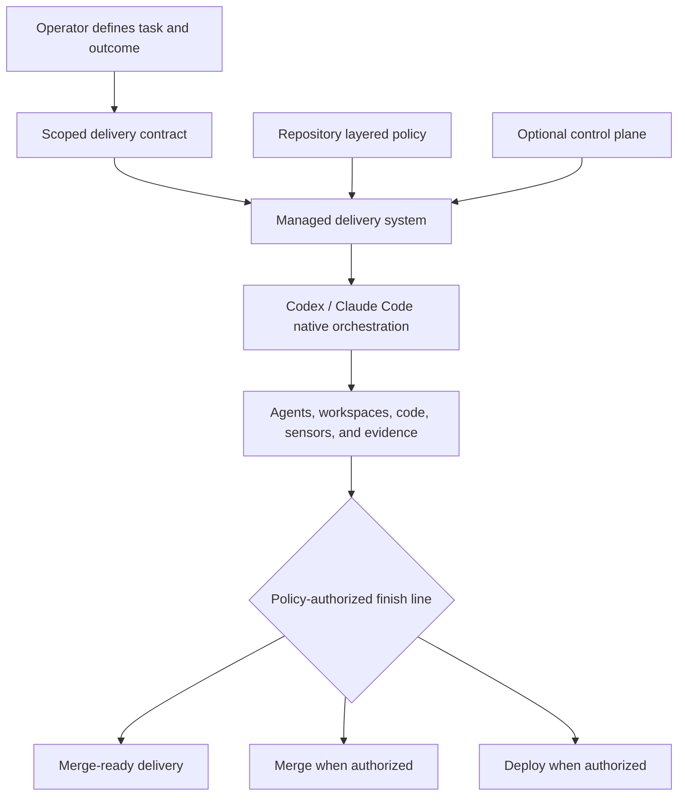

# Managed Agent Delivery System

## Summary

Establish one managed system that accepts a scoped outcome, composes modular delivery workflows with evidence enforcement, applies repository policy, and owns durable delivery state through a policy-authorized finish line. Codex and Claude Code retain responsibility for agent sessions, subagents, permissions, tools, and workspaces; adopting repositories provide a layered policy overlay rather than operating skills and the evidence harness as separate products.

---

## Problem Frame

Athena has proven a strong agent-delivery posture across workflow skills, repository instructions, deterministic sensors, review evidence, merge admission, telemetry, and deployment rules. The extracted portable workflows and standalone delivery harness preserve important parts of that posture, but their current product boundary leaves the adopting repository responsible for installing, versioning, connecting, and reconciling multiple subsystems.

That integration burden conflicts with the intended operator experience. An operator should define the task and intended outcome, or collaborate until the work is scoped, and then hand the result to one system. They should not coordinate workflow discovery, agent sessions, validation stages, review evidence, harness invocation, and delivery transitions themselves.

The system must still respect repository authority. Athena and other mature repositories already own architecture rules, commands, sensors, approval boundaries, merge policy, and deployment behavior. Managed workflow coordination cannot replace or weaken those local constraints, and a unified product surface cannot justify a tightly coupled internal monolith.

The prose requirements below are authoritative if the diagram and text ever diverge.

---

## Actors

- A1. Operator: Defines the task and intended outcome, participates in scoping when needed, and responds only when policy or authority requires a human decision.
- A2. Repository policy owner: Declares the repository's obligations, finish lines, approval boundaries, and authoritative executable capabilities.
- A3. Managed delivery system: Owns the registered delivery record, composes internal modules, enforces policy, retains evidence, exposes valid workflow transitions, and evaluates the authorized finish line without replacing the coding-agent harness.
- A4. Coding-agent harness: Codex, Claude Code, or another compatible host that natively manages sessions, subagents, permissions, tools, workspaces, and stage execution while consuming and updating managed delivery state.
- A5. Local execution and evidence runtime: Holds authoritative repository state, invokes repository-owned sensors and operations, and binds evidence to the exact candidate.
- A6. Optional control plane: Coordinates queues, durable scheduling, upgrades, and cross-repository visibility without superseding local policy, code, or evidence authority.

---

## Key Flows

- F1. Scope and hand over work
  - **Trigger:** A1 has already-scoped work or an outcome that requires collaborative clarification.
  - **Actors:** A1, A3
  - **Steps:** The task and outcome are made explicit; discussion resolves product scope when needed; the system packages the result as a bounded delivery contract; repository policy is resolved and validated; A1 hands the contract to a registered run.
  - **Outcome:** The system knows what it is delivering, what completion means, what authority it has, and when it must return to the operator.
  - **Escape path:** If the intended outcome or required authority remains materially ambiguous, the system does not begin mutation and returns the unresolved decision to A1.
  - **Covered by:** R5-R8, R13

- F2. Execute an autonomous delivery
  - **Trigger:** A3 accepts a scoped delivery contract under a valid repository policy.
  - **Actors:** A3, A4, A5
  - **Steps:** The system selects the applicable workflows and exposes the next valid stage; A4 uses its native orchestration to run planning, implementation, validation, review, and remediation; stage outcomes are checkpointed; the system retains candidate-bound evidence and evaluates the repository-selected finish line.
  - **Outcome:** Work reaches merge-ready, merge, or deployment according to policy, with a complete evidence-backed run record.
  - **Escape path:** A blocker, contradictory evidence, failed required sensor, or missing authority stops advancement and produces an actionable, resumable state rather than an unsupported success claim.
  - **Covered by:** R1-R4, R6-R8, R15-R18

- F3. Interrupt, recover, and resume
  - **Trigger:** An agent session fails, the coding-agent harness pauses or resumes, the candidate changes, or the run requires a policy-mandated decision.
  - **Actors:** A1, A3, A4, A5, A6
  - **Steps:** Durable delivery state identifies the last trustworthy checkpoint; stale evidence is rejected; the same or another supported coding-agent harness reloads the managed entrypoint and continues from the next valid stage; and the run resumes only after the blocker or required decision is resolved.
  - **Outcome:** Delivery continuity does not depend on one conversation or agent session, and resumed work cannot inherit invalid evidence or authority. When no coding-agent harness is observably active, host activity is reported as paused or unknown according to trusted lifecycle evidence rather than progressed by a competing agent runtime.
  - **Covered by:** R7-R10, R17-R18

- F4. Adopt or update the managed system
  - **Trigger:** A2 adopts the system or an approved managed-system release becomes available.
  - **Actors:** A2, A3, A5, A6
  - **Steps:** The system validates its exact compatible module set and the repository policy contract; exposes supported host entry points; applies the change through one managed lifecycle; verifies the integrated result; and retains a bounded rollback path.
  - **Outcome:** The repository consumes one managed product release without independently reconciling workflow, harness, host-adapter, or control-plane versions.
  - **Escape path:** An incompatible module, invalid policy, local conflict, or failed qualification leaves the prior working system authoritative.
  - **Covered by:** R1-R4, R11-R14, R19-R20

---

## Requirements

**Managed product and mandatory modularity**

- R1. The adopter-facing product must be one managed agent-delivery system with one installation, execution, status, update, and rollback lifecycle.
- R2. The system must remain modular by design. Delivery workflows, checkpoint orchestration, evidence and admission, host integration, policy integration, local execution, and optional control-plane coordination must remain distinct modules with explicit contracts and independent qualification.
- R3. Each managed-system release must compose one exact compatible set of internal module identities. Repositories must not be required to select, version, update, or reconcile those modules independently.
- R4. Module boundaries must permit internal components and coding-agent harnesses to evolve or be replaced without changing repository policy semantics or transferring integration responsibility to the adopter.

**Intake and managed run ownership**

- R5. The system must accept either already-scoped work or an outcome that is clarified through discussion, and must package the result as a bounded delivery contract before autonomous execution begins.
- R6. Work initiated from an interactive agent session, issue, or control-plane trigger must become a registered managed run before the system claims ownership of delivery.
- R7. The managed system must own durable delivery state, valid workflow transitions, evidence, and finish-line evaluation; the selected coding-agent harness must own agent/session/subagent orchestration, permission enforcement, tools, and workspace lifecycle; an individual conversation must not become the durable delivery record. A trusted model-external host-control integration must apply the system's stage-specific execution grant and pinned workflow generation at the native task/turn/session admission boundary, but it must not implement a competing permission or agent runtime.
- R8. After handoff, an active supported coding-agent harness must drive the managed workflow without operator orchestration and interrupt only for policy-required approval, a genuine blocker, contradictory outcomes, or authority beyond the scoped contract. If that harness stops or becomes unavailable, host activity must be reported honestly as paused when a trusted lifecycle event exists or unknown when it does not, while the underlying delivery checkpoint remains unchanged; a supported host may later resume from durable state, and the managed system must not introduce a parallel agent supervisor merely to continue execution. Each active host invocation must be monotonically fenced. Same-workspace reuse requires non-model-mintable graceful host-runtime termination provenance — a trusted clean-end lifecycle event on a host whose descendant teardown has been verified; provenance for a crashed host is not obtainable and must never be inferred. Without that provenance, cancellation or takeover must quarantine the prior workspace and use the last trusted candidate or a fresh isolated workspace, and this is the designed default rather than a degraded mode; it may supersede the old invocation's delivery authority but must never claim the old host process terminated.

**Hybrid local and control-plane authority**

- R9. Repository policy, source state, candidate identity, executable sensor results, and delivery evidence must remain authoritative in the local repository execution boundary. Candidate-controlled tools and host tasks must not be able to write managed authority state directly or use inherited external credentials to bypass policy-selected finish lines.
- R10. An optional control plane may coordinate queues, persistence, upgrades, scheduling, and cross-repository visibility, but it must not override local policy, manufacture evidence, or advance a delivery past the locally authorized state.

**Layered repository policy**

- R11. A repository must provide a declarative policy layer that defines delivery obligations, activation conditions, approval boundaries, acceptable finish lines, and granted delivery authority.
- R12. A repository must be able to expose its existing commands, sensors, validation gates, merge operations, and deployment operations through executable policy adapters rather than rewriting them inside the managed system.
- R13. The system must validate and normalize the declarative policy and executable capabilities into one coherent policy surface before accepting a managed run; ambiguity, contradiction, or unavailable required capabilities must block acceptance.
- R14. Repository instructions and architecture guidance may inform agent behavior, but prose alone must not silently grant delivery authority or satisfy a deterministic obligation.

**Autonomous SDLC and evidence-backed delivery**

- R15. The system must define and enforce the applicable SDLC progression—including scoping, planning, implementation, focused validation, review, remediation, evidence retention, and delivery—through host-native workflow entrypoints without requiring the operator to connect those stages manually.
- R16. Repository policy must select the delivery finish line. Merge-ready is the safe default; autonomous merge or deployment is permitted only when the policy explicitly grants that authority and all activated obligations are satisfied.
- R17. Every successful delivery claim must bind the scoped outcome, exact candidate, policy version, completed obligations, sensor results, review disposition, and final action into a coherent, inspectable run record.
- R18. Candidate changes, interrupted runs, stale evidence, failed required sensors, unsupported capabilities, unresolved actionable findings, or security revocation of the pinned product generation must fail closed and leave an actionable state that can be safely resumed, explicitly migrated, or terminated.

**Adoption, evolution, and Athena integration**

- R19. Managed-system installation and updates must validate before mutation, preserve unrelated repository work, expose supported coding-agent harnesses through product-owned native integration surfaces, avoid taking ownership of host-managed sessions or workspaces, and retain a source-independent rollback path to a still-trusted prior release. A host integration may claim support for mutation only if its trusted model-external admission layer applies and attests the product's stage grant and run-pinned workflow root before model tools become available — a model-external interceptor that denies every tool invocation until a valid admission attestation exists is an equivalent mechanism, since the enforced property is that no tool executes outside the grant — including protection against direct shell/tool bypass and authority-state tampering; sensitive human approvals must use a user-originated, non-model-mintable host-native or OS-native assertion or remain disabled. Current product-trust revocation state — in V1 a local, operator-maintained revocation list with a monotonic epoch under maintenance-lane authority; a signed revocation authority only once external distribution or a control plane introduces one — must be checked at host admission, every mutation-capable transition, evidence/admission acceptance, approval consumption, transition to ready, external action, and terminal success; revoked generations remain audit-retained but execution-ineligible.
- R20. Athena must adopt the unified system through a layered Athena policy overlay that preserves its existing authoritative tests, `pr:athena` finish line, Graphify, Convex checks, telemetry, reporting, merge, deployment, and operational rules without making those rules universal defaults.

---

## Acceptance Examples

- AE1. **Covers R1-R4, R19.** Given a repository using one managed-system release, when an internal workflow or evidence module advances, the adopter receives one qualified system update and is not asked to reconcile independent component versions.
- AE2. **Covers R5-R8.** Given an operator has only an intended outcome, when discussion resolves scope and authority, the system records a bounded delivery contract and proceeds without requiring the operator to connect planning, execution, validation, review, and evidence steps.
- AE3. **Covers R5, R8, R13.** Given the requested outcome remains materially ambiguous, when the operator attempts handoff, the system returns the unresolved decision before modifying the repository.
- AE4. **Covers R6-R8, R15.** Given work begins in a supported coding-agent task, when the operator hands it over, the host natively orchestrates the managed workflow; if that task ends, the durable delivery record survives and a resumed supported task continues from the next trustworthy stage without a product-owned agent daemon. A simultaneous stale task cannot advance the journal, mutate the authoritative resumed candidate, or perform an external action.
- AE5. **Covers R9-R10.** Given the control plane reports that a run is complete but the local required sensor failed, when the system reconciles the run, local policy blocks advancement and the control plane cannot claim delivery success.
- AE6. **Covers R11-R14.** Given Athena declares an obligation and exposes its authoritative command through the policy adapter, when a relevant change activates that obligation, only the command's accepted result can satisfy it; prose claiming equivalence cannot.
- AE7. **Covers R16-R18.** Given a repository grants only merge-ready authority, when every activated obligation passes, the system produces the evidenced merge-ready result and does not merge or deploy.
- AE8. **Covers R16-R18.** Given policy explicitly grants merge authority but not deployment authority, when the merge obligations pass, the system may merge and must stop before deployment.
- AE9. **Covers R7-R9, R17-R19.** Given a host-managed agent or session fails after producing partial evidence, when the coding-agent harness resumes or another supported host continues the delivery, it restarts from the last trustworthy checkpoint and rejects any evidence no longer bound to the current candidate. Takeover either proves the prior invocation ended or uses a newly isolated workspace and permanently fences the prior invocation.
- AE10. **Covers R19-R20.** Given a managed-system update is incompatible with Athena's policy or fails its integrated qualification, when update is attempted, Athena retains the prior working release and its existing delivery authority remains unchanged.

---

## Success Criteria

- An operator can define or collaboratively scope a task and outcome, hand it to Codex or Claude Code once, and receive either a policy-authorized delivery or one actionable interruption without manually orchestrating the internal SDLC stages.
- Athena consumes one managed product lifecycle while preserving its stronger local finish line and repository-specific policy.
- A managed delivery can survive conversation/session loss, host-native agent replacement, and control-plane interruption without losing trustworthy state or accepting stale evidence; it reports host activity honestly as paused or unknown when no supported coding-agent harness is observably active.
- Every completed run provides an inspectable chain from scoped outcome through exact candidate, activated policy, validation, review, evidence, and final delivery action.
- Internal modules remain independently qualified behind explicit contracts, while adopters are insulated from their compatibility and upgrade choreography.
- A second repository can supply a different layered policy without forking the managed workflows, evidence model, or checkpoint-orchestration semantics.

---

## Scope Boundaries

### Deferred for later

- Verified host-native integrations beyond Codex and Claude Code.
- Additional tracker and work-management adapters beyond the first qualified integration.
- Organization-wide policy administration, fleet governance, and centrally enforced rollout waves.
- Fully hosted execution that removes local authoritative delivery state.
- Automated promotion of repository-specific learnings into managed workflow releases.
- Domain workflow packs for Convex, Cloudflare, frontend motion, browser automation, documents, or other specialized work.

### Outside this product's identity

- A set of independently operated skills, harness packages, and adapters that the repository owner must assemble.
- A tightly coupled monolith whose workflow, checkpoint orchestration, evidence, host integration, policy, and control-plane responsibilities cannot evolve independently.
- A remote control plane that overrides repository policy, code state, candidate identity, sensor results, or evidence.
- A universal repository policy that replaces project-specific architecture, tests, CI, merge, deployment, or operational rules.
- A system that silently interprets prose as authorization, bypasses deterministic sensors, or weakens a repository's existing finish line.
- A requirement that all coding-agent harnesses use identical low-level tools or execution steps; equivalent contracts and outcomes are the compatibility target.
- A product whose durable delivery state belongs to one interactive agent session.

---

## Key Decisions

- One managed product: The adopter operates one delivery system rather than composing skills and harness components.
- Mandatory modularity: Product unity is achieved through explicit composition and qualification, not internal coupling.
- Managed handoff: Work may begin through several entry points, but the system becomes the durable owner once the operator hands over a scoped contract.
- Hybrid authority: The control plane coordinates; the local repository boundary authorizes code, policy, evidence, and delivery.
- Layered policy: Declarative rules state what must happen, while executable adapters preserve authoritative repository capabilities.
- Policy-selected finish line: Merge-ready is safe by default; broader autonomy must be deliberately granted.
- Host-native orchestration: Codex and Claude Code own agents, sessions, subagents, permissions, tools, and workspaces; the managed system owns workflow meaning, durable delivery checkpoints, policy, evidence, and outcomes.
- Athena as reference policy: Athena proves the richest overlay without turning Athena-specific mechanics into universal workflow semantics.

---

## Dependencies / Assumptions

- Git remains the primary candidate and versioned-work boundary for the first product release.
- Supported coding-agent harnesses expose enough model-external control — native admission inputs or a deny-until-attested interception point — to enforce a stage grant, plus a host-created isolated workspace into which the product can materialize the per-run workflow root. Richer lifecycle provenance unlocks higher qualification tiers (honest pause reporting, same-workspace resume); a host that cannot enforce the grant at all qualifies only for read-only use in V1.
- Repository owners can identify authoritative sensors and operations even when their current policy is distributed across instructions, scripts, CI, and generated registries.
- The existing portable workflows and delivery-harness contracts remain useful internal modules, but their current adopter-facing lifecycle is subject to composition by the managed product.
- Athena's current delivery system provides enough evidence to characterize the layered policy adapter without treating every Athena-specific behavior as portable.
- Optional external capabilities degrade to explicit blockers or handoffs when unavailable; they do not create an implicit transport fallback.

---

## Outstanding Questions

### Deferred to Planning

- [Affects R1-R4, R19][Technical] What product-level composition and release mechanism exposes one lifecycle while retaining exact internal module identities and independent qualification?
- [Affects R6-R10][Technical] What local-versus-control-plane run-state boundary preserves offline authority, safe reconciliation, and resumability without creating two competing sources of truth?
- [Affects R11-R14, R20][Technical] How should Athena's distributed instructions, scripts, registries, and CI contracts be projected into the first layered policy adapter without duplicating authority?
- [Affects R7-R8, R15-R18][Technical] What normalized checkpoint and evidence lifecycle lets heterogeneous coding-agent harnesses resume the same managed delivery while retaining their native orchestration behavior?
- [Affects R2-R4, R17-R19][Needs research] Which conformance scenarios and compatibility evidence are sufficient to qualify modular composition, independent module evolution, and one managed release across supported platforms?
