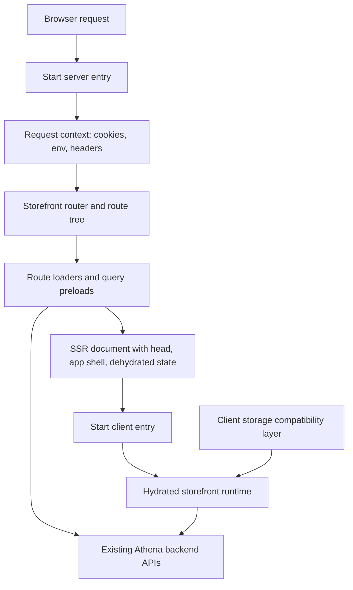
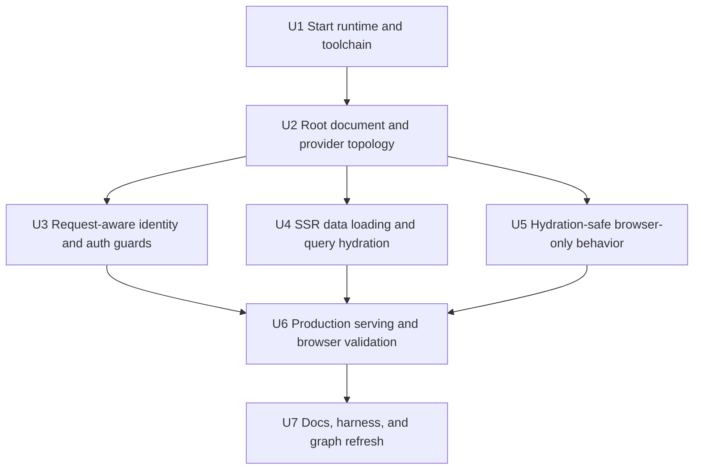
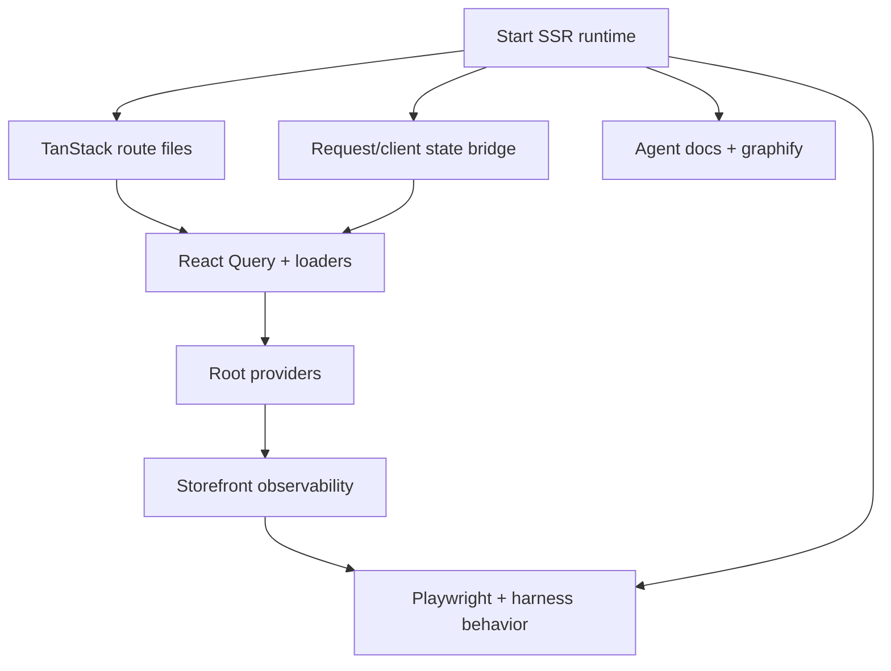

# refactor: Migrate Storefront to TanStack Start SSR

## Overview

Migrate `packages/storefront-webapp` from its current Vite + TanStack Router SPA runtime to a full TanStack Start SSR runtime using the latest Start/Router package line available during planning: `@tanstack/react-start@1.167.48`, `@tanstack/react-router@1.168.24`, `@tanstack/router-plugin@1.167.26`, and Vite 8.0.10. The migration should preserve the current storefront surface while introducing server-rendered initial documents, request-aware app state, hydration-safe client behavior, and production-ready Start hosting.

This is a full SSR migration, not TanStack Start SPA mode. The work should therefore treat browser-only assumptions in loaders, auth guards, API wrappers, and shared providers as migration blockers rather than deferring them behind client-only rendering.

---

## Problem Frame

The storefront is currently documented and implemented as a Vite + TanStack Router SPA. Runtime entrypoints are `packages/storefront-webapp/index.html`, `packages/storefront-webapp/src/main.tsx`, `packages/storefront-webapp/src/router.tsx`, and `packages/storefront-webapp/src/routes/__root.tsx`. The package already uses file-based TanStack Router routes, React Query, route loaders, and app-level providers, so the routing model is close to Start, but the runtime model is not: the app assumes browser globals during route guards and shared API access, and it has no Start server/client entrypoint, SSR document shell, or production server target.

Local research found 34 route files and 49 source files referencing browser-only APIs such as `window`, `document`, `localStorage`, `sessionStorage`, or `navigator`. The highest-risk SSR blockers are the auth `beforeLoad` guards in `packages/storefront-webapp/src/routes/login.tsx`, `packages/storefront-webapp/src/routes/signup.tsx`, and `packages/storefront-webapp/src/routes/_layout/account.tsx`; the store marker access in `packages/storefront-webapp/src/api/storefront.ts` and `packages/storefront-webapp/src/api/storeFrontUser.ts`; `navigator.language` at module scope in `packages/storefront-webapp/src/components/checkout/CheckoutProvider.tsx`; and document scanning at module scope in `packages/storefront-webapp/src/utils/versionChecker.ts`.

---

## Requirements Trace

- R1. The storefront must run on TanStack Start full SSR, with Start-managed client and server entrypoints rather than the current SPA-only `src/main.tsx` bootstrap.
- R2. The migration must preserve the current public route surface, including catalog, product detail, auth, account, bag, checkout, order history, review, rewards, policy, and contact pages.
- R3. Server rendering must not execute browser-only APIs during module evaluation, route guards, route loaders, provider initialization, or shared API wrapper calls.
- R4. Auth, store identity, guest marker, and checkout/session state must become request-aware where SSR needs them, while preserving existing client persistence semantics after hydration.
- R5. React Query ownership must be unified so loaders, SSR hydration, and client queries share a coherent cache boundary instead of the current double `QueryClientProvider` setup.
- R6. Start build, preview, production serving, Playwright, and harness behavior checks must prove both server-rendered first load and hydrated browser journeys.
- R7. Storefront observability, synthetic-readiness selectors, and checkout/auth architecture boundaries must remain intact.
- R8. Package, agent, and generated harness documentation must reflect the new Start SSR runtime after the migration lands.

---

## Scope Boundaries

- Do not redesign storefront UX, route hierarchy, product copy, checkout behavior, payment provider behavior, or Athena backend contracts.
- Do not introduce React Server Components as part of this migration; TanStack Start's current React Server Components support remains separate from the SSR migration goal.
- Do not migrate Athena admin or other workspaces.
- Do not convert backend API wrappers into first-party Start server functions unless SSR requires a narrow server-only adapter; the existing backend remains the source of truth.
- Do not use Start SPA mode as the final state.

### Deferred to Follow-Up Work

- Broader SEO metadata authoring per product/category page can follow after SSR is stable. This plan preserves current head behavior and enables later route-specific improvements.
- Performance tuning beyond the SSR migration baseline, such as route-level streaming optimization or CDN cache policy refinement, can follow after production measurements exist.
- React 19 adoption is not required for the initial Node/Nitro SSR path. Re-evaluate it only if the final deployment target is Bun-specific hosting.

---

## Context & Research

### Relevant Code and Patterns

- `packages/storefront-webapp/docs/agent/architecture.md` states the package currently ships as a Vite + TanStack Router SPA and explicitly has no TanStack Start bootstrap.
- Runtime wiring is concentrated in `packages/storefront-webapp/index.html`, `packages/storefront-webapp/src/main.tsx`, `packages/storefront-webapp/src/router.tsx`, `packages/storefront-webapp/src/routes/__root.tsx`, and `packages/storefront-webapp/vite.config.ts`.
- Route files under `packages/storefront-webapp/src/routes` already use TanStack Router file routes, `beforeLoad`, loaders, `validateSearch`, and root `head`, which should be preserved where compatible with Start.
- API access is intentionally thin under `packages/storefront-webapp/src/api` and `packages/storefront-webapp/src/lib/queries`; SSR adapters should preserve that boundary instead of pulling backend logic into routes.
- Storefront observability is centered in `packages/storefront-webapp/src/contexts/StorefrontObservabilityProvider.tsx`, `packages/storefront-webapp/src/lib/storefrontObservability.ts`, and `packages/storefront-webapp/src/lib/storefrontJourneyEvents.ts`.
- Harness validation maps runtime/build pipeline edits to package tests, build, typecheck, and behavior scenarios in `packages/storefront-webapp/docs/agent/validation-map.json`.

### Institutional Learnings

- No directly relevant Start/SSR migration learning exists under `docs/solutions/`.
- The repo convention requires graphify orientation before architecture work and `bun run graphify:rebuild` after code-file modifications in the implementation session.
- Storefront product copy should continue to follow `docs/product-copy-tone.md` if any user-facing error or fallback copy changes during implementation.

### External References

- TanStack Start build-from-scratch docs identify `@tanstack/react-start`, `@tanstack/react-router`, Vite, React, and the Start Vite plugin as core runtime pieces, and show that the Start plugin should run before the React Vite plugin: https://tanstack.com/start/latest/docs/framework/react/build-from-scratch
- TanStack Start server entry docs describe the optional `src/server.ts` fetch-handler entrypoint and its role in SSR, server routes, and server function requests: https://tanstack.com/start/latest/docs/framework/react/guide/server-entry-point
- TanStack Start client entry docs describe `src/client.tsx` and `StartClient` hydration: https://tanstack.com/start/latest/docs/framework/react/guide/client-entry-point
- TanStack Start hydration docs call out browser/server mismatches from locale/time zone, `Date.now()`, random IDs, feature flags, and user preferences: https://tanstack.com/start/latest/docs/framework/react/guide/hydration-errors
- TanStack Start environment docs preserve the `VITE_` boundary for client-exposed env values while allowing server-only `process.env` usage: https://tanstack.com/start/latest/docs/framework/react/guide/environment-variables
- TanStack Start hosting docs recommend Nitro for broad deployment targets and show the `tanstackStart()`, `nitro()`, `viteReact()` plugin shape: https://tanstack.com/start/latest/docs/framework/react/guide/hosting
- Vite 7+ requires Node 20.19+ or 22.12+; local planning checks found this workspace currently runs Node v23.5.0, which satisfies that class of requirement: https://vite.dev/blog/announcing-vite7

---

## Key Technical Decisions

- Use full TanStack Start SSR with a Node/Nitro production path first: This satisfies the user's explicit SSR goal while avoiding the extra React 19 constraint called out for Bun-specific hosting. If deployment later chooses Bun as the production runtime, treat that as a targeted follow-up.
- Keep the existing file-route topology: The route tree is already TanStack Router-based, and preserving routes reduces migration risk for checkout, auth, order history, rewards, and observability.
- Add explicit Start entrypoints instead of adapting `src/main.tsx` in place: Start's client/server entry model is meaningfully different from a Vite SPA root render, and separate entrypoints make browser-only initialization easier to isolate.
- Move request-owned identity to cookies or request context before relying on client storage: `localStorage` cannot participate in SSR route guards. Auth and store identity decisions that affect server render need request-readable state, with client storage retained only as a post-hydration compatibility layer.
- Unify React Query provider ownership at the Start root: The current nested providers can produce disconnected caches. SSR loader hydration needs one intentional QueryClient lifecycle per request/client hydration boundary.
- Treat hydration warnings as migration failures: The storefront has time, locale, random marker, and preference-driven logic. SSR success means rendered markup and hydrated client state agree for the first route load.
- Refresh harness docs and validation maps as part of the migration: The package docs currently say there is no Start bootstrap, so they must change with the architecture.

---

## Open Questions

### Resolved During Planning

- **Should this target Start SPA mode or full SSR?** Full SSR. The user explicitly asked for a full SSR Start migration.
- **Which Linear context should track the work?** Cwd-derived project `athena`, team `yaegars` (`V26`), with the `Store frontend` milestone available.
- **Should React 19 be part of the migration?** Not for the default Node/Nitro path. TanStack Start peers allow React 18 or 19, and the current package is on React 18.3.1. React 19 should be reconsidered only if implementation chooses Bun-specific hosting or uncovers a Start adapter issue requiring it.
- **Is there a relevant upstream requirements doc?** No. The only current `docs/brainstorms/*-requirements.md` file is unrelated product-copy work.

### Deferred to Implementation

- **Exact production hosting preset:** Implementation should confirm the deployed storefront target and choose Nitro's Node-compatible output unless infrastructure requires a different preset.
- **Cookie names and compatibility bridge details:** The plan requires request-readable auth/store/marker state, but exact cookie names and migration mechanics should be chosen while editing the auth/store modules.
- **Whether to add dedicated SSR snapshot tests or extend existing component tests:** The plan names expected scenarios; the implementer should choose the smallest useful test shape once the Start test harness is in place.
- **Exact route-by-route prerender/streaming policy:** Start SSR should land first; route-specific streaming and caching behavior can be tuned after functional parity.

---

## High-Level Technical Design

> *This illustrates the intended approach and is directional guidance for review, not implementation specification. The implementing agent should treat it as context, not code to reproduce.*

The intended shape is a request-first SSR shell: server render reads only request-safe state, fetches or preloads data through the existing API/query boundary, emits a Start document, and then hydrates into the current interactive storefront. Client-only effects, storage synchronization, version checking, observability session identifiers, and payment redirects stay on the client side.

---

## Implementation Units

- U1. **Start Runtime and Toolchain**

**Goal:** Replace the SPA-only build/runtime wiring with TanStack Start SSR dependencies, Vite plugin configuration, and server/client entrypoint scaffolding.

**Requirements:** R1, R6

**Dependencies:** None

**Files:**
- Modify: `packages/storefront-webapp/package.json`
- Modify: `packages/storefront-webapp/vite.config.ts`
- Modify: `packages/storefront-webapp/tsconfig.json`
- Modify: `packages/storefront-webapp/bun.lockb`
- Modify: `packages/storefront-webapp/src/main.tsx`
- Create: `packages/storefront-webapp/src/client.tsx`
- Create: `packages/storefront-webapp/src/server.ts`
- Modify or retire: `packages/storefront-webapp/index.html`
- Test: `packages/storefront-webapp/vitest.config.ts`
- Test: `packages/storefront-webapp/playwright.config.ts`

**Approach:**
- Add `@tanstack/react-start` and align TanStack Router/plugin versions with the Start dependency line.
- Upgrade Vite to a version compatible with latest Start while checking Vitest and plugin compatibility.
- Configure the Start Vite plugin before the React plugin, adding Nitro only if the chosen production path requires it in the same Vite config.
- Introduce Start client/server entrypoints and remove the app's dependency on direct `ReactDOM.createRoot` bootstrapping for production runtime.
- Keep route tree generation owned by TanStack tooling; do not manually edit `src/routeTree.gen.ts`.

**Execution note:** Sensor-only for dependency/config scaffolding, then characterization-first once the existing package build/test behavior starts changing.

**Patterns to follow:**
- Existing runtime concentration in `packages/storefront-webapp/src/main.tsx`, `packages/storefront-webapp/src/router.tsx`, and `packages/storefront-webapp/vite.config.ts`.
- TanStack Start build-from-scratch docs for plugin and entrypoint shape.

**Test scenarios:**
- Integration: The package builds a Start SSR output rather than only a SPA asset bundle.
- Integration: The generated route tree still includes all existing routes after Start tooling runs.
- Error path: Unsupported or mismatched Vite/TanStack package versions fail at install/build time rather than hiding behind runtime hydration errors.

**Verification:**
- Storefront dev, build, and typecheck sensors recognize the Start runtime.
- The app no longer requires `src/main.tsx` as the production browser bootstrap.
- Existing route tree generation remains tool-owned and reproducible.

---

- U2. **Root Document and Provider Topology**

**Goal:** Convert the root route, router factory, and app shell to Start-compatible SSR document rendering with one coherent React Query and provider lifecycle.

**Requirements:** R1, R2, R5, R7

**Dependencies:** U1

**Files:**
- Modify: `packages/storefront-webapp/src/router.tsx`
- Modify: `packages/storefront-webapp/src/routes/__root.tsx`
- Modify: `packages/storefront-webapp/src/contexts/StoreContext.tsx`
- Modify: `packages/storefront-webapp/src/contexts/StorefrontObservabilityProvider.tsx`
- Modify: `packages/storefront-webapp/src/contexts/NavigationBarProvider.tsx`
- Test: `packages/storefront-webapp/src/routes/__root.test.tsx`
- Test: `packages/storefront-webapp/src/contexts/StoreContext.test.tsx`

**Approach:**
- Rename or adapt the router factory to the Start convention while preserving typed router registration and route context.
- Move the HTML document responsibilities into the root route using Start-compatible head/script rendering.
- Remove the duplicate QueryClient providers currently split between `src/main.tsx` and `src/routes/__root.tsx`; define a request-safe server QueryClient and hydrated client QueryClient lifecycle.
- Keep `StoreProvider`, `NavigationBarProvider`, `StorefrontObservabilityProvider`, `Toaster`, maintenance mode, and not-found/error boundaries in the same behavioral order unless SSR requires a safer wrapper split.
- Ensure observability uses router state after hydration without requiring `window` or session storage during server render.

**Execution note:** Characterization-first around provider order and maintenance-mode behavior before changing the root shell.

**Patterns to follow:**
- Existing root composition in `packages/storefront-webapp/src/routes/__root.tsx`.
- Existing router context in `packages/storefront-webapp/src/router.tsx`.
- Existing error boundary components in `packages/storefront-webapp/src/components/DefaultCatchBoundary.tsx` and `packages/storefront-webapp/src/components/states/error/ErrorBoundary.tsx`.

**Test scenarios:**
- Happy path: Rendering the root route with normal store config produces the navigation shell, route outlet, toaster, and observability provider without duplicate QueryClient boundaries.
- Edge case: Maintenance-mode store config renders the maintenance surface without attempting to render route content beneath it.
- Error path: A route error still reaches the existing storefront error boundary with route context preserved.
- Integration: Server-rendered root markup includes head and script responsibilities required by Start and hydrates into the same app shell.

**Verification:**
- Root SSR output and hydrated client output share a single query/provider topology.
- Current global providers remain available to route content.
- Storefront observability and readiness contracts still initialize after hydration.

---

- U3. **Request-Aware Identity and Auth Guards**

**Goal:** Replace browser-storage-dependent auth, store identity, and marker reads in SSR-sensitive paths with request-readable state while retaining client persistence compatibility.

**Requirements:** R3, R4, R7

**Dependencies:** U2

**Files:**
- Modify: `packages/storefront-webapp/src/routes/login.tsx`
- Modify: `packages/storefront-webapp/src/routes/signup.tsx`
- Modify: `packages/storefront-webapp/src/routes/_layout/account.tsx`
- Modify: `packages/storefront-webapp/src/routes/auth.verify.tsx`
- Modify: `packages/storefront-webapp/src/api/storefront.ts`
- Modify: `packages/storefront-webapp/src/api/storeFrontUser.ts`
- Modify: `packages/storefront-webapp/src/lib/utils.ts`
- Modify: `packages/storefront-webapp/src/lib/constants.ts`
- Create: `packages/storefront-webapp/src/lib/requestState.ts`
- Test: `packages/storefront-webapp/src/lib/requestState.test.ts`
- Test: `packages/storefront-webapp/src/routes/authGuards.test.ts`
- Test: `packages/storefront-webapp/src/api/storefront.test.ts`

**Approach:**
- Introduce a small request-state helper that can read server request cookies/headers during SSR and client storage after hydration.
- Move route guard decisions away from direct `localStorage` access. Auth redirects should be expressible from request-readable identity and safe backend checks.
- Preserve existing client storage keys for compatibility, but treat them as a hydration synchronization source rather than an SSR source of truth.
- Convert the guest marker used by storefront and user APIs to a request-safe marker path, likely cookie-backed, so SSR can call the same backend APIs without crashing.
- Keep API wrapper behavior thin and aligned with Athena backend contracts.

**Execution note:** Characterization-first for current auth redirect behavior, then test-first for request-state helper behavior.

**Patterns to follow:**
- Existing auth guard intent in `packages/storefront-webapp/src/routes/login.tsx`, `packages/storefront-webapp/src/routes/signup.tsx`, and `packages/storefront-webapp/src/routes/_layout/account.tsx`.
- Existing storage constants in `packages/storefront-webapp/src/lib/constants.ts`.
- Existing API wrapper style in `packages/storefront-webapp/src/api/storefront.ts` and `packages/storefront-webapp/src/api/storeFrontUser.ts`.

**Test scenarios:**
- Happy path: A request with authenticated identity and store identifiers redirects away from `/login` and `/signup` to `/account`.
- Happy path: A request without authenticated identity redirects from `/account` to `/login`.
- Edge case: A request without a marker creates or schedules a request-safe marker without touching `localStorage` during SSR.
- Error path: A stale identity whose backend active-user check fails clears client compatibility state after hydration and routes to login without server-render crashes.
- Integration: The same auth guard decisions work during server navigation and client navigation.

**Verification:**
- No route `beforeLoad` path reads `localStorage`, `sessionStorage`, `window`, or `document` during SSR.
- Auth redirects and guest/store identity behavior remain compatible with existing customer flows.
- Request-state tests prove server and client storage modes separately.

---

- U4. **SSR Data Loading and Query Hydration**

**Goal:** Make route loaders and React Query data access SSR-safe, deterministic, and cache-coherent across server render and client hydration.

**Requirements:** R2, R3, R5

**Dependencies:** U2, U3 for identity-sensitive calls

**Files:**
- Modify: `packages/storefront-webapp/src/routes/-homePageLoader.ts`
- Modify: `packages/storefront-webapp/src/routes/index.tsx`
- Modify: `packages/storefront-webapp/src/lib/queries/store.ts`
- Modify: `packages/storefront-webapp/src/lib/queries/product.ts`
- Modify: `packages/storefront-webapp/src/lib/queries/user.ts`
- Modify: `packages/storefront-webapp/src/lib/queries/checkout.ts`
- Modify: `packages/storefront-webapp/src/hooks/useGetStore.ts`
- Modify: `packages/storefront-webapp/src/components/HomePage.tsx`
- Test: `packages/storefront-webapp/src/routes/-homePageLoader.test.ts`
- Test: `packages/storefront-webapp/src/lib/queries/ssrQueryHydration.test.ts`
- Test: `packages/storefront-webapp/src/components/HomePage.test.tsx`

**Approach:**
- Audit each route loader and query helper for direct browser API assumptions, nondeterministic timestamps, and request-context needs.
- Ensure home page loader data, store config, product queries, user queries, and checkout queries can either run safely on the server or explicitly defer to client-only execution with a deterministic pending state.
- Feed loader/query results into the unified QueryClient boundary from U2 so hydration does not refetch or mismatch unexpectedly.
- Replace raw `Date.now()` values in SSR-visible loader payloads with deterministic server-side values or isolate them from rendered markup.
- Keep failure-tolerant homepage loading semantics: failed best-seller or featured-product requests should still allow the page to render available sections.

**Execution note:** Characterization-first for current home page partial-failure behavior, then test-first for hydration-sensitive query paths.

**Patterns to follow:**
- Existing loader test in `packages/storefront-webapp/src/routes/-homePageLoader.test.ts`.
- Existing `queryOptions` helpers under `packages/storefront-webapp/src/lib/queries`.
- Existing HomePage initial-data behavior in `packages/storefront-webapp/src/components/HomePage.tsx`.

**Test scenarios:**
- Happy path: Server loading homepage data preloads best sellers and featured products and hydrates without duplicate loading flashes.
- Edge case: Best-seller request succeeds while featured request fails; SSR and hydrated UI both render the available section without throwing.
- Error path: Store config fetch failure reaches the existing error/maintenance behavior rather than producing an unhandled server exception.
- Integration: Query data loaded during SSR is available to client `useQuery` consumers under the unified QueryClient provider.

**Verification:**
- SSR-sensitive loaders and query helpers do not touch browser-only state.
- Hydrated UI preserves current loading, partial-data, and error behavior.
- React Query cache ownership is observable through tests rather than duplicate providers.

---

- U5. **Hydration-Safe Browser-Only Behavior**

**Goal:** Isolate browser-only effects, nondeterministic values, and DOM APIs so SSR output matches hydration and client-only behavior still works after hydration.

**Requirements:** R3, R4, R6, R7

**Dependencies:** U2

**Files:**
- Modify: `packages/storefront-webapp/src/utils/versionChecker.ts`
- Modify: `packages/storefront-webapp/src/components/checkout/CheckoutProvider.tsx`
- Modify: `packages/storefront-webapp/src/components/DefaultCatchBoundary.tsx`
- Modify: `packages/storefront-webapp/src/components/states/error/ErrorBoundary.tsx`
- Modify: `packages/storefront-webapp/src/contexts/StorefrontObservabilityProvider.tsx`
- Modify: `packages/storefront-webapp/src/lib/storefrontObservability.ts`
- Modify: `packages/storefront-webapp/src/components/HomePage.tsx`
- Modify: `packages/storefront-webapp/src/hooks/useEnhancedTracking.ts`
- Test: `packages/storefront-webapp/src/utils/versionChecker.test.ts`
- Test: `packages/storefront-webapp/src/components/checkout/CheckoutProvider.test.tsx`
- Test: `packages/storefront-webapp/src/lib/storefrontObservability.test.ts`

**Approach:**
- Move module-scope DOM reads, `navigator` reads, `window` reads, and client storage access behind client-only effects or safe helper functions.
- Make default region calculation deterministic during SSR and refine it after hydration when `navigator.language` is available.
- Ensure version checking starts only in the client entry or a client-only effect; the server must not inspect document scripts.
- Make observability session IDs deterministic enough for SSR or created only after hydration, without breaking synthetic-monitor filtering.
- Review high-traffic interactive components for `Date.now()`, `Math.random()`, viewport size, and local preferences that can change rendered first-load markup.

**Execution note:** Characterization-first for current checkout default-region behavior and observability session behavior.

**Patterns to follow:**
- Existing storage guard in `packages/storefront-webapp/src/components/checkout/checkoutStorage.ts`.
- Existing observability tests in `packages/storefront-webapp/src/lib/storefrontObservability.test.ts`.
- Existing storefront failure reporting in `packages/storefront-webapp/src/lib/storefrontFailureObservability.ts`.

**Test scenarios:**
- Happy path: Rendering checkout provider in a server-like environment selects a deterministic default region and hydrates to browser locale without form-state loss.
- Happy path: Version checker initialization is skipped during SSR and starts after client hydration.
- Edge case: Observability session storage is unavailable; event context still forms without throwing.
- Error path: Default/error boundaries render useful storefront fallbacks without reading `window.location` until client context is available.
- Integration: A server-rendered checkout route hydrates without React hydration mismatch warnings from region, observability, or version-checking state.

**Verification:**
- SSR module import of the storefront package does not crash on missing browser globals.
- Browser-only behavior remains active after hydration.
- Hydration warnings are treated as actionable failures during browser validation.

---

- U6. **Production Serving and Browser Validation**

**Goal:** Prove the Start SSR app runs through local dev, production-like serve, Playwright, and harness behavior scenarios without losing checkout/auth observability coverage.

**Requirements:** R2, R6, R7

**Dependencies:** U1, U3, U4, U5

**Files:**
- Modify: `packages/storefront-webapp/package.json`
- Modify: `packages/storefront-webapp/playwright.config.ts`
- Modify: `scripts/harness-behavior-scenarios.ts`
- Modify: `docs/operations/production-observability-v1.md`
- Test: `packages/storefront-webapp/tests/e2e/helpers/bootstrap.ts`
- Test: `packages/storefront-webapp/tests/e2e/helpers/env.ts`

**Approach:**
- Update package scripts so dev, build, serve, and start map to Start's SSR development and production outputs.
- Update Playwright webServer expectations to boot the Start app rather than Vite SPA preview assumptions.
- Extend or adjust harness behavior scenarios only where current readiness logic assumes Vite SPA boot or static-preview behavior.
- Preserve existing checkout behavior scenarios: `storefront-checkout-bootstrap`, `storefront-checkout-validation-blocker`, and `storefront-checkout-verification-recovery`.
- Confirm production observability runbook still describes the correct readiness selector and synthetic-monitor behavior after SSR.

**Execution note:** Sensor-only for script/config changes, then test-first if harness scenarios need new readiness assertions.

**Patterns to follow:**
- Existing Playwright config in `packages/storefront-webapp/playwright.config.ts`.
- Existing behavior scenario definitions in `scripts/harness-behavior-scenarios.ts`.
- Existing production observability runbook in `docs/operations/production-observability-v1.md`.

**Test scenarios:**
- Happy path: Production-like server responds to a direct deep link such as a checkout or product route with SSR HTML and then hydrates client navigation.
- Happy path: Playwright can load the home page and a checkout route from a fresh server process.
- Error path: Unknown routes still reach the existing not-found surface through SSR.
- Integration: Checkout bootstrap and validation behavior scenarios still observe the expected readiness and failure/analytics signals.

**Verification:**
- Dev, build, production-like serve, e2e, and harness behavior sensors all target the Start runtime.
- Direct deep links no longer rely on static SPA fallback behavior.
- Observability runbook matches the deployed runtime contract.

---

- U7. **Docs, Harness, and Graph Refresh**

**Goal:** Update durable repo knowledge and generated agent artifacts so future work treats storefront as a TanStack Start SSR app.

**Requirements:** R8

**Dependencies:** U6

**Files:**
- Modify: `packages/storefront-webapp/AGENTS.md`
- Modify: `packages/storefront-webapp/docs/agent/index.md`
- Modify: `packages/storefront-webapp/docs/agent/architecture.md`
- Modify: `packages/storefront-webapp/docs/agent/testing.md`
- Modify: `packages/storefront-webapp/docs/agent/code-map.md`
- Modify: `packages/storefront-webapp/docs/agent/validation-map.json`
- Regenerate: `packages/storefront-webapp/docs/agent/route-index.md`
- Regenerate: `packages/storefront-webapp/docs/agent/test-index.md`
- Regenerate: `packages/storefront-webapp/docs/agent/key-folder-index.md`
- Regenerate: `graphify-out/*`

**Approach:**
- Replace statements that the package has no Start bootstrap with the new Start SSR architecture.
- Update validation guidance so runtime/build pipeline edits point to Start SSR sensors, production-like serve checks, and hydration/browser behavior checks.
- Keep docs explicit that route tree files remain generated and should not be manually edited.
- Regenerate harness docs and graphify artifacts once after code changes settle, rather than churning generated artifacts in each implementation branch.
- Add a `docs/solutions/` learning only if implementation uncovers a reusable SSR migration bug pattern or missing sensor.

**Execution note:** Sensor-only. This is generated/documentation alignment, not behavior-bearing work.

**Patterns to follow:**
- Existing package docs under `packages/storefront-webapp/docs/agent`.
- Repo graphify rule in `AGENTS.md`.
- Existing solution docs structure under `docs/solutions/`.

**Test scenarios:**
- Test expectation: none -- docs and generated artifacts do not add user-facing behavior, but harness/docs drift sensors should prove consistency.

**Verification:**
- Package docs accurately describe the Start SSR runtime.
- Harness indexes and validation map cover all changed runtime surfaces.
- Graphify output reflects changed code files after implementation.

---

## System-Wide Impact

- **Interaction graph:** Request handling moves from static HTML plus client boot to Start server entry, request context, route loaders, SSR document, and Start client hydration. This affects router factory, root route, providers, API wrappers, auth guards, checkout providers, observability, Playwright, and harness behavior scenarios.
- **Error propagation:** Server-render-time failures must route through Start-compatible error boundaries or deterministic HTTP responses. Client-only failures should continue through storefront failure observability and existing UI error boundaries.
- **State lifecycle risks:** Auth identity, store identity, guest marker, checkout session state, query cache, observability session, and version-check state all cross the server/client boundary. Each must have one owner during SSR and a clear hydration handoff.
- **API surface parity:** Existing Athena backend APIs, query option helpers, and shared types should not change shape. Any request-state adapter should sit at the storefront boundary.
- **Integration coverage:** Unit tests alone will not prove SSR. Direct deep-link browser tests, production-like Start serving, checkout harness behavior scenarios, and hydration warning checks are required.
- **Unchanged invariants:** Checkout route architecture boundaries remain protected by `lint:architecture`; route sources remain under `src/routes`; route tree remains generated; synthetic monitor `origin=synthetic_monitor` remains the reserved observability marker.

---

## Risks & Dependencies

| Risk | Likelihood | Impact | Mitigation |
|------|------------|--------|------------|
| Browser globals crash server render | High | High | Audit and characterize all SSR-sensitive modules; move browser reads into client-only effects/helpers before enabling route SSR broadly. |
| Auth redirect behavior changes | Medium | High | Characterize current login/signup/account redirects, then migrate guards to request-readable state with explicit server/client tests. |
| Hydration mismatches from time, locale, random IDs, or client preferences | High | High | Treat hydration warnings as validation failures; make first render deterministic and refine browser-only state after hydration. |
| Query cache split causes refetches or stale UI | Medium | Medium | Consolidate QueryClient ownership in root Start lifecycle and test loader-to-query hydration. |
| Deployment target mismatch | Medium | High | Default to Node/Nitro unless infrastructure requires another target; defer Bun-specific React 19 decision until target is confirmed. |
| Generated artifacts create merge churn across tickets | High | Medium | Keep generated route tree, harness indexes, lockfile, and graphify refresh in a coordinated integration batch. |
| Checkout/payment flows regress under direct deep links | Medium | High | Preserve checkout behavior scenarios and add production-like deep-link e2e validation. |

---

## Alternative Approaches Considered

- **TanStack Start SPA mode:** Lower risk, but rejected because the requested goal is full SSR and SPA mode would leave server-render readiness, request-owned auth, and hydration safety mostly unproven.
- **Big-bang React 19 plus Bun hosting migration:** Deferred because Start peers allow React 18, the package is currently React 18, and Bun-specific hosting adds an avoidable runtime variable to an already broad migration.
- **Rewrite routes around server functions immediately:** Deferred because existing backend API wrappers are thin and stable. Introduce server functions only where SSR request boundaries require them.
- **One implementation ticket for the entire migration:** Rejected because runtime scaffolding, request-state migration, query hydration, browser-global cleanup, validation, and docs can be reasoned about separately even if final generated artifacts should be integrated once.

---

## Phased Delivery

### Phase 1: Runtime Spine

- U1 establishes Start dependencies, plugin configuration, and entrypoints.
- U2 gives the app a Start-compatible root document and provider topology.

### Phase 2: SSR Safety

- U3 migrates auth/store/marker state to request-aware boundaries.
- U4 makes loaders and query hydration coherent.
- U5 isolates browser-only effects and hydration-sensitive logic.

### Phase 3: Production Proof

- U6 updates serving, Playwright, harness behavior, and observability proof.
- U7 refreshes docs, generated harness artifacts, and graphify output once the code settles.

---

## Linear Tracking

- U1: V26-383 — Storefront SSR: Add TanStack Start runtime and toolchain — https://linear.app/v26-labs/issue/V26-383/storefront-ssr-add-tanstack-start-runtime-and-toolchain
- U2: V26-384 — Storefront SSR: Convert root document and provider topology — https://linear.app/v26-labs/issue/V26-384/storefront-ssr-convert-root-document-and-provider-topology
- U3: V26-385 — Storefront SSR: Make identity and auth guards request-aware — https://linear.app/v26-labs/issue/V26-385/storefront-ssr-make-identity-and-auth-guards-request-aware
- U4: V26-386 — Storefront SSR: Wire SSR-safe data loading and query hydration — https://linear.app/v26-labs/issue/V26-386/storefront-ssr-wire-ssr-safe-data-loading-and-query-hydration
- U5: V26-387 — Storefront SSR: Isolate browser-only and hydration-sensitive behavior — https://linear.app/v26-labs/issue/V26-387/storefront-ssr-isolate-browser-only-and-hydration-sensitive-behavior
- U6: V26-388 — Storefront SSR: Prove production serving and browser journeys — https://linear.app/v26-labs/issue/V26-388/storefront-ssr-prove-production-serving-and-browser-journeys
- U7: V26-389 — Storefront SSR: Refresh agent docs, harness maps, and graph artifacts — https://linear.app/v26-labs/issue/V26-389/storefront-ssr-refresh-agent-docs-harness-maps-and-graph-artifacts

---

## Documentation / Operational Notes

- Update `packages/storefront-webapp/docs/agent/architecture.md` during U7 so it no longer says the package has no TanStack Start bootstrap.
- Update `packages/storefront-webapp/docs/agent/testing.md` and `packages/storefront-webapp/docs/agent/validation-map.json` with SSR-specific validation surfaces.
- Update `docs/operations/production-observability-v1.md` if readiness selectors, synthetic monitor startup behavior, or serving topology changes.
- Add a solution learning under `docs/solutions/` only if implementation reveals a recurring SSR migration trap, missing harness sensor, or reusable request-state pattern.
- After code files change during implementation, run the repo graphify rebuild per `AGENTS.md`.

---

## Success Metrics

- A direct request to the storefront home page returns server-rendered HTML and hydrates without warnings.
- Direct requests to representative deep links, including product/category and checkout routes, render through the Start server without static SPA fallback assumptions.
- Login, signup, account, guest, checkout, rewards, order history, and review flows retain current user-visible behavior.
- Browser-only APIs are absent from SSR module evaluation and SSR route guard/loader paths.
- Package tests, typecheck, build, Playwright, harness review, relevant behavior scenarios, and graphify checks are green or have documented environmental blockers.
- Storefront agent docs accurately describe Start SSR runtime ownership and validation.

---

## Sources & References

- Related code: `packages/storefront-webapp/package.json`
- Related code: `packages/storefront-webapp/vite.config.ts`
- Related code: `packages/storefront-webapp/src/main.tsx`
- Related code: `packages/storefront-webapp/src/router.tsx`
- Related code: `packages/storefront-webapp/src/routes/__root.tsx`
- Related code: `packages/storefront-webapp/src/routes/login.tsx`
- Related code: `packages/storefront-webapp/src/routes/signup.tsx`
- Related code: `packages/storefront-webapp/src/routes/_layout/account.tsx`
- Related code: `packages/storefront-webapp/src/api/storefront.ts`
- Related code: `packages/storefront-webapp/src/api/storeFrontUser.ts`
- Related code: `packages/storefront-webapp/src/components/checkout/CheckoutProvider.tsx`
- Related code: `packages/storefront-webapp/src/utils/versionChecker.ts`
- Related docs: `packages/storefront-webapp/docs/agent/architecture.md`
- Related docs: `packages/storefront-webapp/docs/agent/testing.md`
- Related docs: `packages/storefront-webapp/docs/agent/validation-map.json`
- External docs: https://tanstack.com/start/latest/docs/framework/react/build-from-scratch
- External docs: https://tanstack.com/start/latest/docs/framework/react/guide/server-entry-point
- External docs: https://tanstack.com/start/latest/docs/framework/react/guide/client-entry-point
- External docs: https://tanstack.com/start/latest/docs/framework/react/guide/hydration-errors
- External docs: https://tanstack.com/start/latest/docs/framework/react/guide/environment-variables
- External docs: https://tanstack.com/start/latest/docs/framework/react/guide/hosting
- External docs: https://vite.dev/blog/announcing-vite7
