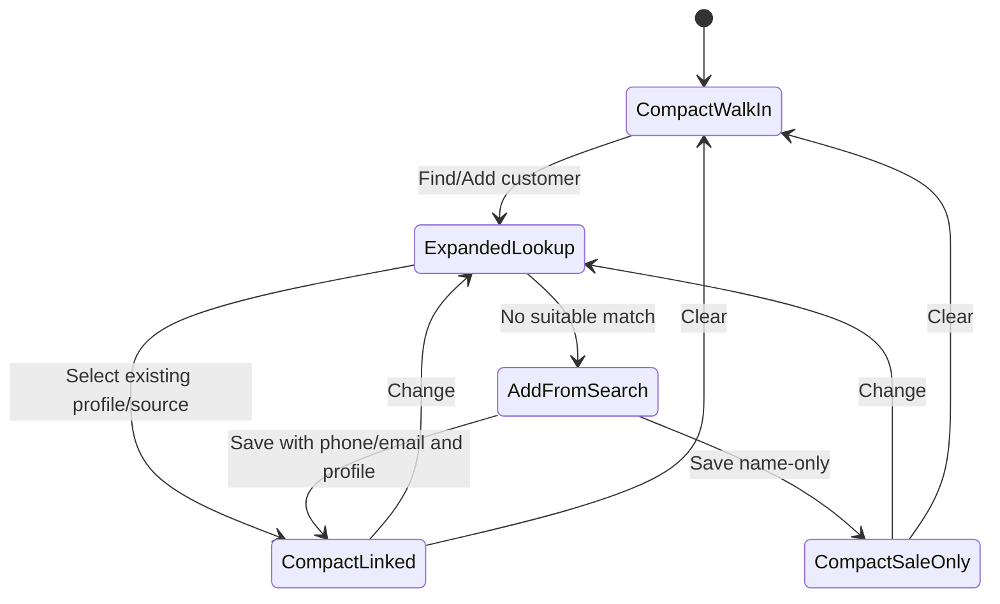

# feat: Refine POS customer attribution flow

## Overview

Refine POS customer attribution from a form-heavy collapsible panel into a persistent compact strip above the register workspace. The strip should make walk-in state visible, prioritize lookup, support adding a customer from no results, and preserve the existing sale/session behavior when attribution changes. The canonical customer identity for this workflow is `customerProfile`; POS customers, storefront users, and guests are source records that should resolve into that profile when strong identity is available.

---

## Problem Frame

Cashiers need to attach a customer during an active sale without leaving the register flow or fighting a large form surface. The origin requirements define a lookup-first, persistent strip that makes customer attribution optional, reversible, and quick enough for checkout pressure (see origin: docs/brainstorms/2026-04-25-pos-customer-attribution-flow-requirements.md). Attribution should also mean the same customer across POS and storefront history, so the implementation should treat `customerProfile` as the identity being linked even where existing POS session fields still carry `posCustomer` ids.

---

## Requirements Trace

- R1. Show customer attribution as a persistent compact strip above the main workspace while a sale is active.
- R2. Default state communicates walk-in customer and exposes one obvious find/add action.
- R3. Selected state collapses into a calm customer summary with one secondary identifier when available.
- R4. Expanded state optimizes for lookup by name, phone, or email.
- R5. No suitable match offers adding a customer seeded from the search text.
- R6. Selecting or adding a customer attributes the active sale immediately and returns to compact view.
- R7. Clearing attribution returns to walk-in without changing cart, payments, cashier, or session state.
- R8. Changing the attached customer is supported during the sale.
- R9. `customerProfile` is the canonical customer identity for cross-channel attribution. POS customer records, storefront users, and guests are source records that should link into a customer profile when they are selected or created.
- R10. UI follows the restrained POS shell language.
- R11. Error and empty states use calm operator-facing copy.
- R12. Adding with phone or email creates or resolves a reusable customer profile; name-only attribution remains sale-only.

**Origin actors:** A1 Cashier, A2 Customer, A3 Store operator
**Origin flows:** F1 Lookup and link an existing customer profile, F2 Add a new customer from lookup, F3 Change or clear attribution
**Origin acceptance examples:** AE1, AE2, AE3, AE4, AE5

---

## Scope Boundaries

- Loyalty prompts, rewards enrollment, and marketing consent stay out of scope.
- Customer deduplication or merge workflows stay out of scope beyond lookup-first duplicate prevention and existing email/phone profile resolution.
- Dedicated storefront account-management UI stays out of scope, but attribution should use existing storefront user/guest matches when they can be resolved through customer profiles.
- Post-sale customer reassignment is out of scope.
- Customer attribution remains optional before checkout.

---

## Context & Research

### Relevant Code and Patterns

- `packages/athena-webapp/src/components/pos/register/POSRegisterView.tsx` already places `RegisterCustomerPanel` above the workspace and controls the fullscreen register shell.
- `packages/athena-webapp/src/components/pos/register/RegisterCustomerPanel.tsx` currently delegates to the older `CustomerInfoPanel`.
- `packages/athena-webapp/src/components/pos/CustomerInfoPanel.tsx` contains existing search/create/update UI, but its card/form structure conflicts with the compact register shell.
- `packages/athena-webapp/src/lib/pos/presentation/register/useRegisterViewModel.ts` owns local customer state, session metadata persistence, and checkout completion snapshots.
- `packages/athena-webapp/src/lib/pos/infrastructure/convex/customerGateway.ts` exposes existing customer search/create/update hooks through the shared command-result normalizer.
- `packages/athena-webapp/convex/pos/public/customers.ts` and `packages/athena-webapp/convex/pos/application/commands/assignCustomer.ts` already support reusable POS customer creation, duplicate conflicts by email/phone, and linking POS customers to storefront users or guests.
- `packages/athena-webapp/convex/operations/customerProfiles.ts` and `packages/athena-webapp/convex/operations/helpers/linking.ts` provide the canonical customer profile bridge: they resolve by direct source ids first, then email/phone within a store, and create/update `customerProfile` records from POS, storefront user, or guest sources.
- `packages/athena-webapp/convex/pos/application/queries/searchCustomers.ts` already exposes `findPotentialMatches` for storefront user/guest lookup by email or phone, which can help the add/link flow avoid creating isolated POS-only records when a storefront identity exists.
- `packages/athena-webapp/convex/storeFront/helpers/onlineOrder.ts` already resolves `customerProfileId` for storefront orders, so POS attribution should converge on the same profile identity rather than inventing a POS-only customer concept.
- `packages/athena-webapp/convex/inventory/posSessions.ts` already traces customer linked, updated, and cleared stages when session metadata changes.
- `packages/athena-webapp/src/components/pos/register/POSRegisterView.test.tsx` currently mocks the customer panel and is the right shell-level test surface.

### Institutional Learnings

- `docs/solutions/logic-errors/athena-pos-drawer-invariants-at-command-boundaries-2026-04-24.md` reinforces that UI gates are not invariants. This plan only changes customer attribution UI and must not weaken existing session/drawer command boundaries.

### External References

- None. Local POS/customer patterns are direct and sufficient.

---

## Key Technical Decisions

- Replace the register-facing customer surface rather than polish the old panel in place: the existing `CustomerInfoPanel` is broadly functional, but it carries a form-card interaction model that fights the new register shell.
- Keep customer attribution persistence through the existing view-model/session update path where possible: this preserves session tracing and avoids adding a second active-sale write path for customer state.
- Treat `customerProfile` as the canonical identity and `posCustomer` as the current POS-session compatibility source. Existing session and transaction fields may continue to carry `customerId: Id<"posCustomer">` in this iteration, but selecting or creating a reusable identity must ensure that a `customerProfile` exists and that the POS source record is linked to any matching storefront user or guest.
- Implement hybrid persistence in the register component/backend boundary: phone/email additions should create or resolve a reusable customer profile, while name-only attribution should commit sale-only `customerInfo` without creating a POS customer or customer profile record.
- Seed add fields from the lookup query using conservative classification: email-shaped text seeds email, phone-shaped text seeds phone, everything else seeds name. Execution can refine the exact parser while preserving this behavior.

---

## Open Questions

### Resolved During Planning

- Adapt current panel or replace it: replace the register-facing surface with a focused register component while keeping reusable customer gateway hooks.
- Search-text seeding behavior: use conservative name/email/phone classification; do not attempt sophisticated parsing in this iteration.

### Deferred to Implementation

- Exact component names and helper boundaries: the implementer may choose names that best fit the local component style.
- Exact copy for no-results and conflict states: should follow `docs/product-copy-tone.md` and avoid raw backend wording.

---

## High-Level Technical Design

> *This illustrates the intended approach and is directional guidance for review, not implementation specification. The implementing agent should treat it as context, not code to reproduce.*

---

## Implementation Units

- U1. **Introduce the register customer strip surface**

**Goal:** Replace the register customer panel delegation with a compact strip component that supports compact walk-in, compact linked, and expanded lookup states.

**Requirements:** R1, R2, R3, R4, R8, R10; F1, F3; AE1, AE2

**Dependencies:** None

**Files:**
- Modify: `packages/athena-webapp/src/components/pos/register/RegisterCustomerPanel.tsx`
- Create or modify: `packages/athena-webapp/src/components/pos/register/RegisterCustomerAttribution.tsx`
- Test: `packages/athena-webapp/src/components/pos/register/RegisterCustomerAttribution.test.tsx`

**Approach:**
- Build a register-specific component instead of rendering `CustomerInfoPanel` inside the shell.
- Keep the compact strip stable in height where possible and place expanded content directly under the strip.
- In compact walk-in state, show a concise walk-in label plus one clear find/add action.
- In selected state, show customer name plus phone/email when available, with `Change` and `Clear` actions.
- Expanded state starts in lookup mode with search input focused and scannable result rows.

**Execution note:** Implement component behavior test-first; the UI states are product-bearing.

**Patterns to follow:**
- Register shell spacing and restrained cards from `packages/athena-webapp/src/components/pos/register/POSRegisterView.tsx`.
- Button and input primitives already used by `packages/athena-webapp/src/components/pos/CustomerInfoPanel.tsx`.

**Test scenarios:**
- Covers AE1. Happy path: given empty customer info, rendering the component shows walk-in state and a find/add action; opening it focuses lookup behavior.
- Covers AE2. Happy path: given customer search results, selecting a result calls the customer commit callback and returns to compact linked state.
- Covers F3 / AE5. Happy path: given linked customer info, clicking clear calls the commit callback with empty customer info and shows walk-in state.
- Edge case: given a linked customer with only a name, compact state does not render empty secondary contact chrome.
- Accessibility: lookup, change, and clear actions are reachable as buttons with clear accessible names.

**Verification:**
- The strip replaces the old large panel in the register flow and supports walk-in, lookup, linked, change, and clear states without changing cart or checkout rendering.

---

- U2. **Implement profile-backed lookup and add flow with hybrid persistence**

**Goal:** Support lookup and add from search while resolving reusable identities into `customerProfile`; name-only additions become sale-only attribution.

**Requirements:** R5, R6, R9, R11, R12; F1, F2; AE2, AE3, AE4

**Dependencies:** U1

**Files:**
- Modify: `packages/athena-webapp/src/components/pos/register/RegisterCustomerAttribution.tsx`
- Modify or create: `packages/athena-webapp/src/lib/pos/customerAttribution.ts`
- Modify: `packages/athena-webapp/convex/pos/application/queries/searchCustomers.ts`
- Modify: `packages/athena-webapp/convex/pos/application/commands/assignCustomer.ts`
- Modify: `packages/athena-webapp/convex/pos/public/customers.ts`
- Test: `packages/athena-webapp/src/components/pos/register/RegisterCustomerAttribution.test.tsx`
- Test: `packages/athena-webapp/src/lib/pos/customerAttribution.test.ts`
- Test: `packages/athena-webapp/convex/pos/application/searchCustomers.test.ts`
- Test: `packages/athena-webapp/convex/pos/application/assignCustomer.test.ts`

**Approach:**
- Return enough identity metadata from lookup results for the UI to distinguish POS customers, storefront users, guests, and already-linked customer profiles without exposing raw backend concepts in operator copy.
- Prefer existing `customerProfile` matches when email/phone is strong; use `findPotentialMatches` to surface storefront user/guest matches that should be linked rather than duplicated.
- When selecting an existing POS customer, ensure or load its `customerProfile` before committing attribution.
- When selecting a storefront user or guest that has no POS customer source yet, create or reuse the POS source record required by the current session path, link it to that storefront source, and ensure the shared `customerProfile`.
- Add no-result affordance that opens an add form seeded from the current search text.
- Classify seed text conservatively: email-shaped -> email, phone-shaped -> phone, otherwise name.
- If add form has phone or email, create or resolve the reusable identity through a backend command that ensures the `customerProfile` and returns the POS-compatible `customerId` plus profile summary.
- If add form only has name, skip reusable writes and commit sale-only customer info.
- Present create-customer conflicts with calm copy that nudges the cashier back to lookup rather than exposing raw command text.

**Execution note:** Start with helper tests for query classification and backend customer-profile resolution behavior, then component tests for persistence branching.

**Patterns to follow:**
- `packages/athena-webapp/src/lib/pos/infrastructure/convex/customerGateway.ts` for command-result normalized customer creation.
- `packages/athena-webapp/convex/operations/customerProfiles.ts` and `packages/athena-webapp/convex/operations/helpers/linking.ts` for profile resolution and source-link semantics.
- `packages/athena-webapp/src/lib/errors/runCommand.ts` and POS operator error presentation conventions for command failures.
- `docs/product-copy-tone.md` for operator-facing copy.

**Test scenarios:**
- Covers AE2 / R9. Happy path: selecting an existing POS customer resolves or returns its customer profile and commits the POS-compatible customer id plus display fields.
- Covers AE2 / R9. Happy path: selecting a storefront user or guest match links through a POS source record, ensures a customer profile, and commits the POS-compatible customer id plus display fields.
- Covers AE3. Happy path: given a no-result name-only add, submitting commits name/email/phone customer info without creating a POS customer or customer profile.
- Covers AE4. Happy path: given a no-result add with email, submitting creates or resolves a customer profile and commits returned customer id/profile summary.
- Covers AE4. Happy path: given a no-result add with phone, submitting creates or resolves a customer profile and commits returned customer id/profile summary.
- Edge case: email-shaped search text seeds email while leaving name empty for cashier review.
- Edge case: phone-shaped search text seeds phone while leaving name empty for cashier review.
- Error path: duplicate/profile conflict renders calm duplicate guidance and keeps the attribution surface open.

**Verification:**
- Adding from lookup follows hybrid persistence, avoids weak name-only reusable records, links reusable identity through `customerProfile`, and keeps the cashier in the customer attribution flow after recoverable errors.

---

- U3. **Wire attribution through register view-model state**

**Goal:** Ensure the new strip commits customer-profile-backed attribution through the existing register view-model and session metadata path without disrupting cart, payment, cashier, or drawer state.

**Requirements:** R6, R7, R8, R9, R12; F1, F2, F3; AE2, AE3, AE4, AE5

**Dependencies:** U1, U2

**Files:**
- Modify: `packages/athena-webapp/src/lib/pos/presentation/register/registerUiState.ts`
- Modify: `packages/athena-webapp/src/lib/pos/presentation/register/useRegisterViewModel.ts`
- Test: `packages/athena-webapp/src/lib/pos/presentation/register/useRegisterViewModel.test.ts`

**Approach:**
- Keep the view-model as the owner of customer state and `onCustomerCommitted`.
- Extend the customer panel state only as needed for the new component; avoid leaking Convex hook details into the view-model unless implementation reveals that the component cannot own them cleanly.
- Preserve `commitCustomerInfoBestEffort` behavior so customer linked/updated/cleared traces continue to flow through session metadata updates.
- Keep existing POS session compatibility fields intact during this iteration, but carry `customerProfileId` through the UI/backend return shape if the implementation can do so without destabilizing transaction completion.
- Ensure clear/change attribution only updates customer fields, not payments, cart, cashier, drawer, or session lifecycle.

**Patterns to follow:**
- Existing customer synchronization in `packages/athena-webapp/src/lib/pos/presentation/register/useRegisterViewModel.ts`.
- Existing command-boundary invariant guidance in `docs/solutions/logic-errors/athena-pos-drawer-invariants-at-command-boundaries-2026-04-24.md`.

**Test scenarios:**
- Covers AE2. Integration: committing a selected customer calls `updateSession` with `customerId` and customerInfo while preserving current totals.
- Covers AE3. Integration: committing name-only attribution calls `updateSession` with customerInfo but no `customerId`.
- Covers R9 / AE4. Integration: committing profile-backed attribution retains or receives the resolved `customerProfileId` in the attribution payload where supported, without replacing existing POS `customerId` session behavior prematurely.
- Covers AE5. Integration: clearing attribution calls `updateSession` with no customerId/customerInfo and does not clear payments or active cart state.
- Edge case: committing customer info with no active session updates local state but does not attempt session mutation.

**Verification:**
- Existing session metadata and trace behavior remains the single persistence route for active-sale customer attribution.

---

- U4. **Integrate strip layout into the POS register shell**

**Goal:** Place the new strip cleanly above the main workspace, matching the current POS shell and avoiding the old full card feel.

**Requirements:** R1, R2, R3, R10, R11

**Dependencies:** U1, U2, U3

**Files:**
- Modify: `packages/athena-webapp/src/components/pos/register/POSRegisterView.tsx`
- Modify: `packages/athena-webapp/src/components/pos/register/RegisterCustomerPanel.tsx`
- Test: `packages/athena-webapp/src/components/pos/register/POSRegisterView.test.tsx`

**Approach:**
- Keep the strip in the existing above-workspace position.
- Ensure it is hidden when transaction completion state already owns the workspace and hidden behind drawer gate states.
- Preserve product lookup and payment workspace behavior; expanding customer lookup should not force unrelated layout mode changes.
- Keep copy concise and operational: walk-in state, find/add, selected customer, change, clear, no results, add customer.

**Patterns to follow:**
- Register fullscreen shell in `packages/athena-webapp/src/components/pos/register/POSRegisterView.tsx`.
- Product lookup empty state density and muted visual hierarchy in the same file.

**Test scenarios:**
- Happy path: active sale shell renders customer attribution above product/cart workspace.
- Edge case: drawer gate renders instead of the customer strip and selling surface.
- Edge case: completed transaction state does not render active customer attribution controls.
- Regression: payment workspace activation still swaps product/cart surfaces as before.

**Verification:**
- The register page keeps a stable, scannable layout with customer attribution visible but visually secondary to sale work.

---

- U5. **Retire or quarantine the old register customer form behavior**

**Goal:** Avoid two competing customer-attribution experiences in the register while keeping any reusable customer utilities intact.

**Requirements:** R10, R11

**Dependencies:** U1, U2, U4

**Files:**
- Modify: `packages/athena-webapp/src/components/pos/CustomerInfoPanel.tsx`
- Modify or remove references from: `packages/athena-webapp/src/components/pos/register/RegisterCustomerPanel.tsx`
- Test: `packages/athena-webapp/src/components/pos/register/RegisterCustomerAttribution.test.tsx`

**Approach:**
- Prefer leaving `CustomerInfoPanel` untouched if other legacy surfaces still depend on it; remove it from the register path.
- If it becomes unused, remove dead imports and any no-longer-referenced code in the same PR.
- Do not broaden this into a full customer-management refactor.

**Patterns to follow:**
- Existing repo preference for narrowly scoped UI refactors.

**Test scenarios:**
- Test expectation: none for pure removal if the behavior is already covered by U1-U4 tests. If the old panel remains used elsewhere, no behavior change is expected there.

**Verification:**
- The register path has one customer attribution experience, and any retained legacy panel code has an explicit remaining purpose.

---

## System-Wide Impact

- **Interaction graph:** POS register shell -> attribution UI -> customer lookup/link/create command -> customer profile bridge -> register view-model -> session update mutation -> customer trace stages remains the core flow.
- **Error propagation:** Customer creation errors should pass through command-result normalization and render calm inline guidance; unexpected errors may use existing generic POS/operator fallback.
- **State lifecycle risks:** Clearing or changing attribution must not reset cart, payments, cashier identity, drawer state, product search, or checkout mode.
- **API surface parity:** Existing Convex customer public commands may need a narrow return-shape expansion or new profile-backed helper so the frontend can commit POS-compatible `customerId` while knowing the canonical `customerProfileId`.
- **Integration coverage:** View-model tests should prove session metadata update behavior; component tests should prove UI branching and create-customer branching.
- **Unchanged invariants:** Drawer/session mutation invariants are not relaxed. Customer attribution remains optional and active-sale scoped.

---

## Risks & Dependencies

| Risk | Mitigation |
|------|------------|
| Name-only attribution accidentally creates low-quality reusable customers | Branch create behavior on phone/email presence and test name-only path explicitly. |
| POS customer and storefront identity stay disconnected | Use existing storefront user/guest potential-match queries and `ensureCustomerProfileFromSources` during reusable attribution. |
| Customer profile identity is modeled only in UI and not persisted | Add backend tests around profile resolution/linking, not just component tests. |
| New strip duplicates old customer form behavior | Remove old panel from register path and keep one register-specific component. |
| Customer changes disrupt sale state | Keep state ownership in `useRegisterViewModel` and cover cart/payment preservation in tests. |
| Backend duplicate conflict copy leaks raw command text | Normalize conflict presentation in the component using restrained operator copy. |
| Search-text parser overreaches | Use conservative classification only; defer sophisticated parsing. |

---

## Documentation / Operational Notes

- No customer-facing documentation is needed.
- Operator-facing copy should follow `docs/product-copy-tone.md`.
- No graph rebuild is required for this plan document alone; implementation must run `bun run graphify:rebuild` after code edits per repo instructions.

---

## Sources & References

- **Origin document:** [docs/brainstorms/2026-04-25-pos-customer-attribution-flow-requirements.md](../brainstorms/2026-04-25-pos-customer-attribution-flow-requirements.md)
- Related code: `packages/athena-webapp/src/components/pos/register/POSRegisterView.tsx`
- Related code: `packages/athena-webapp/src/components/pos/register/RegisterCustomerPanel.tsx`
- Related code: `packages/athena-webapp/src/components/pos/CustomerInfoPanel.tsx`
- Related code: `packages/athena-webapp/src/lib/pos/presentation/register/useRegisterViewModel.ts`
- Related code: `packages/athena-webapp/src/lib/pos/infrastructure/convex/customerGateway.ts`
- Related code: `packages/athena-webapp/convex/pos/public/customers.ts`
- Related code: `packages/athena-webapp/convex/pos/application/queries/searchCustomers.ts`
- Related code: `packages/athena-webapp/convex/pos/application/commands/assignCustomer.ts`
- Related code: `packages/athena-webapp/convex/operations/customerProfiles.ts`
- Related code: `packages/athena-webapp/convex/operations/helpers/linking.ts`
- Related code: `packages/athena-webapp/convex/storeFront/helpers/onlineOrder.ts`
- Related learning: `docs/solutions/logic-errors/athena-pos-drawer-invariants-at-command-boundaries-2026-04-24.md`
