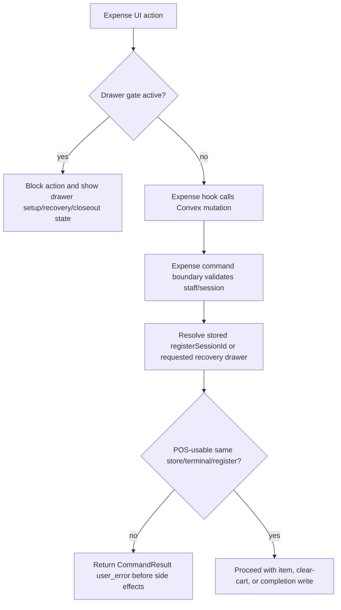

# fix: Harden expense session drawer workflow

## Summary

Bring expense sessions up to the same cash-drawer hardening pattern as POS by persisting the active register-session binding, validating that binding at every expense mutation boundary, and surfacing drawer setup/recovery states before operators can mutate expense carts or complete expense transactions.

---

## Problem Frame

POS now treats the drawer gate as both UI guidance and a backend invariant: sale mutations require a cashier-owned active session plus a matching POS-usable register session. Expense sessions still auto-create and mutate without the same persisted `registerSessionId` or recovery gate, so stale clients or direct Convex calls can bypass drawer state while inventory holds and expense transactions continue to write.

---

## Assumptions

*This plan was authored without synchronous user confirmation. The items below are agent inferences that fill gaps in the input and should be reviewed before implementation proceeds.*

- Expense sessions should follow POS drawer semantics exactly for `open` and `active` register sessions, while treating `closing` as visible but not usable for cart or completion mutations.
- Expense metadata-only updates may keep existing modifiable-session validation, but any action that changes cart, inventory holds, or completion state must require a valid drawer binding.
- Expense transaction records should carry enough register-session linkage for cash-control and audit follow-up if the existing transaction schema supports or can safely add it.

---

## Requirements

- R1. Expense sessions must persist a `registerSessionId` binding and return it through active/session query DTOs.
- R2. Creating, reusing, resuming, and recovering an expense session must resolve a POS-usable register session with matching store, terminal, and register identity.
- R3. Expense item add/update, item removal, cart clear, and completion mutations must reject missing, closed, closing, store-mismatched, terminal-mismatched, or register-mismatched drawer bindings before inventory, item, transaction, or session writes.
- R4. Recovery binding must be idempotent for the same drawer and must not clear cart items, inventory holds, cashier identity, notes, expiration, or other sale state.
- R5. The expense register view-model must expose the shared drawer gate for initial setup, recovery, and closeout-blocked states, and must disable expense product/cart/completion actions while the gate is active.
- R6. Browser-facing expense hooks must normalize command-result failures through existing safe operator-message paths rather than leaking raw thrown backend text.
- R7. Focused expense validation guidance must stay accurate after the new backend and UI test surface is added.

---

## Scope Boundaries

- Do not redesign POS drawer behavior; expense should mirror the established POS command-boundary pattern.
- Do not redesign expense product search, inventory hold accounting, or expense transaction numbering beyond the drawer binding needed for safety.
- Do not introduce browser E2E coverage unless a required recovery behavior cannot be honestly covered through existing Vitest hooks/component tests.
- Do not edit generated Convex artifacts unless public Convex references actually require refresh through the documented `convex dev` flow.
- Do not broaden this into stock operations, service-case payments, storefront checkout, or POS customer attribution.

### Deferred to Follow-Up Work

- Workflow traces for expense-session lifecycle events: useful for audit parity, but not required to close the drawer-invariant gap.
- Rich cash-control reporting for expense transactions by register session: only add the minimal linkage this hardening needs; broader reporting can follow separately.

---

## Context & Research

### Relevant Code and Patterns

- `docs/plans/2026-04-28-001-test-pos-session-workflow-hardening-spec.md` is the coverage model to mirror for expense where the workflows overlap.
- `docs/plans/2026-04-28-003-test-expense-session-workflow-hardening-spec.md` translates the overlapping POS test units into expense-specific test coverage and explicitly excludes POS-only customer/payment scenarios.
- `packages/athena-webapp/convex/pos/application/commands/sessionCommands.ts` resolves and validates POS register-session bindings for start, resume, recovery, item mutation, and cart mutation boundaries.
- `packages/athena-webapp/convex/inventory/posSessions.ts` exposes browser-callable POS session mutations and includes `bindSessionToRegisterSession`.
- `packages/athena-webapp/convex/pos/application/commands/completeTransaction.ts` validates stored/provided register-session identity before transaction creation.
- `packages/athena-webapp/src/lib/pos/presentation/register/useRegisterViewModel.ts` computes initial setup, recovery, and closeout-blocked drawer gates and skips sale mutations while recovery is required.
- `packages/athena-webapp/src/components/pos/register/POSRegisterView.tsx` currently renders `RegisterDrawerGate` only for POS workflow mode, so expense gating needs a deliberate rendering update.
- `packages/athena-webapp/convex/inventory/expenseSessions.ts`, `packages/athena-webapp/convex/inventory/expenseSessionItems.ts`, `packages/athena-webapp/src/lib/pos/presentation/expense/useExpenseRegisterViewModel.ts`, `packages/athena-webapp/src/hooks/useExpenseSessions.ts`, `packages/athena-webapp/src/hooks/useSessionManagementExpense.ts`, and `packages/athena-webapp/src/hooks/useExpenseOperations.ts` are the primary expense workflow surfaces.

### Institutional Learnings

- `docs/solutions/logic-errors/athena-pos-drawer-invariants-at-command-boundaries-2026-04-24.md`: UI drawer gates are ergonomics; backend command boundaries must enforce drawer invariants for stale clients and direct Convex calls.

### External References

- Not used. Local POS patterns are strong enough and this is a same-codebase parity fix.

---

## Key Technical Decisions

- Extend the POS command-boundary pattern to expense rather than adding ad hoc checks in public mutations: this keeps lifecycle, mutation, and recovery semantics in one testable backend service.
- Persist `registerSessionId` directly on `expenseSession`: POS already uses this shape, and expense recovery needs durable binding to prevent cart/completion mutations from depending on transient UI state.
- Reuse `isPosUsableRegisterSessionStatus` and POS register identity rules: drawer usability should not fork between POS sale and expense workflows.
- Render the shared `RegisterDrawerGate` for expense when the expense view-model returns a gate: this avoids creating a second drawer UI and keeps operator-facing recovery behavior consistent.
- Keep validation characterization-first: existing expense behavior is broad and inventory-affecting, so tests should capture expected safety boundaries before changing production code.

---

## Open Questions

### Resolved During Planning

- Does expense currently match POS drawer hardening? No. Expense sessions lack persisted `registerSessionId`, expense cart/completion mutations do not validate register-session binding, and the expense view-model returns `drawerGate: null`.
- Is external research needed? No. POS already provides the direct same-repo pattern and the repo has an institutional learning for the invariant.

### Deferred to Implementation

- Exact transaction schema linkage: implementation should inspect current cash-control consumers before deciding whether `expenseTransaction` needs `registerSessionId` immediately or whether the session linkage is sufficient for this hardening.
- Final command-service boundaries: implementation may choose one expense command service or narrowly shared helpers, as long as public Convex mutations stay thin and all mutation preconditions are covered.
- Generated Convex client refresh: only needed if new public functions are added and local credentials permit the documented `bunx convex dev` flow.

---

## High-Level Technical Design

> *This illustrates the intended approach and is directional guidance for review, not implementation specification. The implementing agent should treat it as context, not code to reproduce.*

---

## Implementation Units

- U1. **Persist Expense Register Binding**

**Goal:** Add durable drawer binding to expense sessions and expose it through existing query payloads.

**Requirements:** R1

**Dependencies:** None

**Files:**
- Modify: `packages/athena-webapp/convex/schemas/pos/expenseSession.ts`
- Modify: `packages/athena-webapp/convex/schema.ts`
- Modify: `packages/athena-webapp/convex/inventory/expenseSessions.ts`
- Test: `packages/athena-webapp/convex/inventory/expenseSessions.test.ts`
- Test: `packages/athena-webapp/convex/inventory/sessionQueryIndexes.test.ts`

**Approach:**
- Add optional `registerSessionId` to the expense session schema and index it if query or audit paths need direct lookup.
- Thread `registerSessionId` through `getStoreExpenseSessions`, `getExpenseSessionById`, and `getActiveExpenseSession` return validators.
- Keep the field optional so existing sessions remain readable during rollout.

**Execution note:** Start with failing schema/query characterization coverage for an expense session that already has a register binding.

**Patterns to follow:**
- `packages/athena-webapp/convex/schemas/pos/posSession.ts`
- `packages/athena-webapp/convex/schema.ts` POS session indexes
- `packages/athena-webapp/convex/inventory/posSessions.ts` active/session DTOs

**Test scenarios:**
- Happy path: an expense session with a stored register-session id is returned by store, by-id, and active-session queries with the same id.
- Edge case: an existing expense session without a register-session id remains valid and returns `undefined` for the binding.
- Integration: index validation includes the new expense binding index if introduced.

**Verification:**
- Expense session schema and query tests prove the persisted binding can round-trip without breaking legacy sessions.

---

- U2. **Introduce Expense Session Command Boundary**

**Goal:** Centralize expense lifecycle and drawer validation in a POS-aligned command service.

**Requirements:** R2, R3, R4, R6

**Dependencies:** U1

**Files:**
- Create: `packages/athena-webapp/convex/pos/application/commands/expenseSessionCommands.ts`
- Modify: `packages/athena-webapp/convex/inventory/expenseSessions.ts`
- Modify: `packages/athena-webapp/convex/inventory/expenseSessionItems.ts`
- Test: `packages/athena-webapp/convex/pos/application/expenseSessionCommands.test.ts`
- Test: `packages/athena-webapp/convex/inventory/expenseSessions.test.ts`

**Approach:**
- Model create/reuse/resume/recovery, add/update item, remove item, clear cart, void, and complete as command-boundary operations with injected dependencies or a testable repository pattern.
- Resolve a register session using store, terminal, register number, and optional preferred drawer id, then require `isPosUsableRegisterSessionStatus`.
- Validate active expense session ownership, status, expiration, and drawer binding before inventory-hold or transaction side effects.
- Add a bind/recovery operation that patches only `registerSessionId` and minimal timestamps when the drawer is valid.
- Keep public mutations as thin adapters returning `CommandResult` payloads.

**Execution note:** Characterize existing expense lifecycle behavior first, then add failing drawer-validation cases before production changes.

**Patterns to follow:**
- `packages/athena-webapp/convex/pos/application/commands/sessionCommands.ts`
- `packages/athena-webapp/convex/pos/infrastructure/repositories/sessionCommandRepository.ts`
- `packages/athena-webapp/shared/registerSessionStatus.ts`
- `packages/athena-webapp/convex/inventory/helpers/expenseSessionValidation.ts`

**Test scenarios:**
- Happy path: creating an expense session with a usable drawer stores the drawer id and returns the active session.
- Happy path: resuming a held expense session binds a matching usable drawer and preserves cart items and inventory holds.
- Happy path: binding recovery for an unbound active expense session patches the same session and leaves cart, notes, staff, terminal, and expiration behavior intact.
- Edge case: same-drawer recovery is idempotent and does not refresh unrelated state.
- Error path: create/resume/recovery rejects missing drawer, closed drawer, closing drawer, wrong store, wrong terminal, and wrong register before session mutation.
- Error path: add/update item, remove item, clear cart, and complete reject missing or invalid drawer binding before item writes, inventory-hold calls, transaction writes, or session completion patches.
- Error path: staff mismatch, active session on another terminal, expired session, completed session, and void session return safe `CommandResult` errors.
- Integration: public expense mutations delegate to the command boundary and preserve the existing browser-safe result shapes.

**Verification:**
- Command tests assert both returned error shape and absence of downstream side effects after failed preconditions.

---

- U3. **Carry Drawer Binding Through Expense Completion**

**Goal:** Ensure expense transaction creation and completion cannot bypass drawer validation and preserve register attribution needed for audit.

**Requirements:** R3, R6

**Dependencies:** U2

**Files:**
- Modify: `packages/athena-webapp/convex/inventory/expenseTransactions.ts`
- Modify: `packages/athena-webapp/convex/schemas/pos/expenseTransaction.ts`
- Modify: `packages/athena-webapp/convex/schema.ts`
- Test: `packages/athena-webapp/convex/inventory/expenseSessions.test.ts`
- Test: `packages/athena-webapp/convex/inventory/expenseTransactions.test.ts`

**Approach:**
- Have completion enter through the expense command boundary before transaction creation.
- Preserve the existing session-to-transaction atomicity: validate preconditions first, create the transaction and items, then mark the session completed.
- Add direct register-session attribution to the transaction only if implementation confirms it is needed for cash-control or audit consumers; otherwise rely on the session linkage and keep the schema smaller.

**Patterns to follow:**
- `packages/athena-webapp/convex/pos/application/commands/completeTransaction.ts`
- `packages/athena-webapp/convex/inventory/expenseTransactions.ts`
- `packages/athena-webapp/convex/operations/paymentAllocations.ts`

**Test scenarios:**
- Happy path: completion with a valid drawer creates an expense transaction, transaction items, and a completed session record.
- Error path: missing or invalid drawer binding fails before transaction creation, inventory decrement, item insertion, or session completion.
- Error path: empty cart, missing SKU, invalid SKU data, and insufficient inventory keep the session editable and do not create partial transaction records.
- Integration: transaction attribution includes register number and any chosen register-session linkage from the bound expense session.

**Verification:**
- Completion tests prove validation happens before irreversible inventory and transaction side effects.

---

- U4. **Add Expense Drawer Gate And Recovery UI**

**Goal:** Make the expense register view-model expose the same drawer setup, closeout-blocked, and recovery gate states as POS.

**Requirements:** R4, R5, R6

**Dependencies:** U1, U2

**Files:**
- Modify: `packages/athena-webapp/src/lib/pos/presentation/expense/useExpenseRegisterViewModel.ts`
- Modify: `packages/athena-webapp/src/components/pos/register/POSRegisterView.tsx`
- Modify: `packages/athena-webapp/src/hooks/useExpenseSessions.ts`
- Modify: `packages/athena-webapp/src/hooks/useSessionManagementExpense.ts`
- Modify: `packages/athena-webapp/src/hooks/useExpenseOperations.ts`
- Test: `packages/athena-webapp/src/lib/pos/presentation/register/useRegisterViewModel.test.ts`
- Test: `packages/athena-webapp/src/components/pos/register/POSRegisterView.test.tsx`
- Test: `packages/athena-webapp/src/hooks/useExpenseSessions.test.ts`

**Approach:**
- Query active register-session state for expense using the same store, terminal, register number, and staff identity available to POS.
- Stop auto-creating expense sessions while drawer setup or recovery is required.
- Add a browser action for expense recovery binding and call it only when a usable drawer is present.
- Return `drawerGate` from the expense view-model for initial setup, recovery, and closeout-blocked states.
- Update `POSRegisterView` so drawer gates can render for expense workflow mode when supplied by the view-model.
- Disable product entry, barcode submit, add product, quantity update, item removal, clear cart, and completion when the drawer gate is active.

**Execution note:** Add view-model tests before changing UI behavior so existing auto-create assumptions are visible.

**Patterns to follow:**
- `packages/athena-webapp/src/lib/pos/presentation/register/useRegisterViewModel.ts`
- `packages/athena-webapp/src/lib/pos/presentation/register/registerUiState.ts`
- `packages/athena-webapp/src/components/pos/register/RegisterDrawerGate.tsx`
- `packages/athena-webapp/src/lib/errors/runCommand.ts`
- `packages/athena-webapp/src/lib/errors/presentCommandToast.ts`

**Test scenarios:**
- Happy path: authenticated expense operator with a usable drawer can create/load an expense session and mutate the cart.
- Happy path: unbound active expense session plus usable drawer shows recovery and binds without clearing cart, notes, cashier, or inventory holds.
- Edge case: closeout-blocked drawer shows Cash Controls guidance and no opening-float submit path.
- Error path: no drawer shows initial setup gate and does not auto-create an expense session.
- Error path: recovery bind failure leaves the gate visible and allows retry after drawer state changes.
- Error path: product add, barcode submit, quantity update, remove item, clear cart, and complete do not call mutations while recovery is required.
- Integration: expense mode with a returned drawer gate renders `RegisterDrawerGate` instead of the expense sale surface.

**Verification:**
- Hook and component tests prove expense no longer exposes cart/completion actions while drawer setup or recovery is unresolved.

---

- U5. **Update Validation Harness Guidance**

**Goal:** Keep Athena's focused validation map honest for the new expense drawer-hardening surface.

**Requirements:** R7

**Dependencies:** U2, U4

**Files:**
- Modify: `packages/athena-webapp/docs/agent/testing.md`
- Modify: `scripts/harness-app-registry.ts`
- Generated: `packages/athena-webapp/docs/agent/validation-map.json`
- Generated: `packages/athena-webapp/docs/agent/validation-guide.md`
- Test: `scripts/harness-generate.test.ts`
- Test: `scripts/harness-check.test.ts`

**Approach:**
- Add the new expense command and view-model tests to the expense-session validation slice.
- Update the registry that owns generated validation docs, then regenerate rather than hand-edit generated files.
- Include POS drawer-gate component tests in the slice when the shared register shell renders expense gates.

**Patterns to follow:**
- Existing expense-session lifecycle entry in `packages/athena-webapp/docs/agent/testing.md`
- Generated-doc ownership guidance in `packages/athena-webapp/docs/agent/testing.md`
- Harness registry patterns in `scripts/harness-app-registry.ts`

**Test scenarios:**
- Test expectation: none for product behavior; this unit updates agent validation metadata.
- Integration: harness generation/check tests prove generated docs include the new expense drawer-hardening tests.

**Verification:**
- Harness docs name the focused expense validation set needed for backend command, browser hook, and register-shell drawer-gate changes.

---

## System-Wide Impact

- **Interaction graph:** Expense UI actions flow through expense hooks into Convex mutations, which should become thin adapters over a shared expense command boundary. POS drawer helpers remain the semantic source for register-session usability.
- **Error propagation:** Expected drawer failures return `CommandResult` user errors and browser hooks surface them through existing safe command-toast/operator-message helpers.
- **State lifecycle risks:** Recovery must bind the existing expense session instead of replacing it, or cart items and inventory holds can be lost or orphaned.
- **API surface parity:** New or changed public expense mutations may require generated Convex client references; follow the documented `convex dev` flow when needed.
- **Integration coverage:** Unit tests must prove no inventory hold, item, transaction, or session-completion side effects happen after failed drawer validation.
- **Unchanged invariants:** POS sale behavior, POS customer attribution, and POS checkout semantics should remain unchanged; expense should consume the pattern, not alter POS.

---

## Risks & Dependencies

| Risk | Mitigation |
|------|------------|
| Expense session recovery accidentally clears cart or releases holds | Require idempotent bind tests that assert cart items and inventory hold state are preserved |
| Backend validation lands only in UI or hooks | Put drawer checks in the command boundary and test direct mutation paths |
| Closing drawers are treated as usable because they are visible in cash controls | Reuse `isPosUsableRegisterSessionStatus`, which only permits `open` and `active` |
| Public mutation signature changes break browser generated refs | Refresh generated Convex artifacts through documented `bunx convex dev` when credentials are available, or record manual generated-file handling |
| Plan expands into expense tracing/reporting | Keep trace/reporting work deferred unless needed for the drawer invariant |

---

## Documentation / Operational Notes

- Update Athena testing docs and harness registry so future agents run expense command, hook, and register-shell coverage for this surface.
- Record a `docs/solutions/` learning after implementation if a production bug is found beyond the known POS drawer-invariant class.
- Run `bun run graphify:rebuild` after code changes, per repo instructions.

---

## Sources & References

- Existing implementation plan: `docs/superpowers/plans/2026-04-28-expense-session-drawer-hardening.md`
- Related POS hardening spec: `docs/plans/2026-04-28-001-test-pos-session-workflow-hardening-spec.md`
- Mirrored expense hardening spec: `docs/plans/2026-04-28-003-test-expense-session-workflow-hardening-spec.md`
- Institutional learning: `docs/solutions/logic-errors/athena-pos-drawer-invariants-at-command-boundaries-2026-04-24.md`
- Related code: `packages/athena-webapp/convex/pos/application/commands/sessionCommands.ts`
- Related code: `packages/athena-webapp/convex/inventory/expenseSessions.ts`
- Related code: `packages/athena-webapp/convex/inventory/expenseSessionItems.ts`
- Related code: `packages/athena-webapp/src/lib/pos/presentation/expense/useExpenseRegisterViewModel.ts`
- Related code: `packages/athena-webapp/src/components/pos/register/POSRegisterView.tsx`
