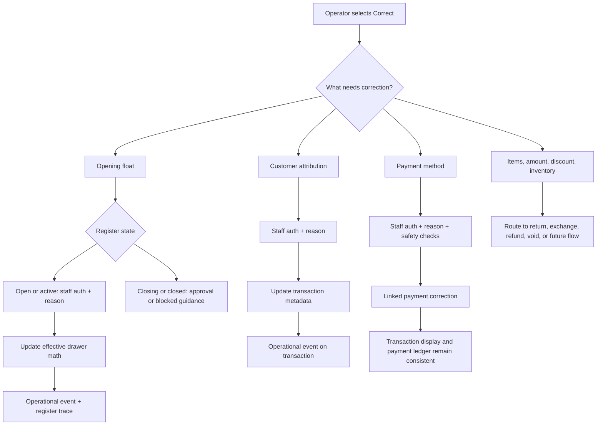

# feat: Build POS correction workflow foundation

## Summary

Build a risk-tiered correction foundation for POS and Cash Controls so operators can recover from inaccurate data entry without silently rewriting committed operational facts. The implementation extends existing register-session, approval-request, operational-event, workflow-trace, and payment-allocation patterns with guided correction actions for opening float, transaction customer attribution, and same-amount payment-method corrections.

---

## Problem Frame

POS operators can enter inaccurate values during high-pressure store workflows: an opening float can be typed wrong, or a completed transaction can carry the wrong customer or payment method. Athena needs to let stores recover quickly while preserving ledger trust: cash, payment, inventory, and completed-sale facts should remain auditable and correction history should be visible wherever the original action is reviewed.

---

## Requirements

- R1. Corrections use a risk-tiered model: low-risk metadata corrections may update the current record with audit history, while cash/payment/inventory-impacting corrections use explicit correction events and approval when needed.
- R2. Opening float can be corrected while the register session is open or active, updating effective drawer math and recording old value, new value, actor, timestamp, and reason.
- R3. Opening float correction is blocked or approval-routed once the register session is closing or closed.
- R4. Completed transaction records are not silently edited for financial or inventory facts; supported corrections are explicit, linked, and timeline-visible.
- R5. Completed transaction customer attribution can be corrected with staff authentication, a reason, and visible audit history.
- R6. Completed transaction payment method can be corrected only when total amount and payment count semantics stay safe; the payment ledger and transaction display remain consistent.
- R7. High-risk corrections route through existing approval request patterns instead of introducing a parallel manager-review system.
- R8. Operator-facing copy follows `docs/product-copy-tone.md`: calm, clear, restrained, and operational.
- R9. Existing POS drawer invariants remain enforced at command boundaries; UI correction entry points are ergonomic gates, not the source of authorization or ledger integrity.

---

## Scope Boundaries

- Do not allow direct editing of completed transaction items, quantities, totals, discounts, or inventory movements in this foundation.
- Do not rebuild return, exchange, refund, or void workflows; the correction picker may route to existing or future flows, but this plan does not implement them.
- Do not introduce a second approval system; use the existing `approvalRequest` rail.
- Do not change receipt rendering beyond reflecting supported corrected metadata and payment-method display state.
- Do not make correction actions available without staff identity.

### Deferred to Follow-Up Work

- Item/quantity, price, discount, and amount-charged corrections: future return, exchange, refund, or financial-adjustment workflows.
- Cashier attribution correction: manager-only follow-up once the first correction foundation is proven.
- Expense-session correction workflows: follow-up after POS transaction and register-session correction patterns are established.
- Documentation refresh for operator runbooks: separate docs follow-up after the UX is validated in implementation.

---

## Context & Research

### Relevant Code and Patterns

- `packages/athena-webapp/convex/operations/registerSessions.ts` owns register-session state transitions, opening float, expected cash, sale/void cash deltas, closeout, reopen, and deposit math.
- `packages/athena-webapp/convex/schemas/operations/registerSession.ts` defines the register-session persisted shape, including `openingFloat`, `expectedCash`, `countedCash`, `variance`, and manager approval linkage.
- `packages/athena-webapp/convex/cashControls/closeouts.ts` shows public command-result wrappers, closeout approval routing, operational events, and workflow-trace recording.
- `packages/athena-webapp/convex/operations/operationalEvents.ts` provides an idempotent subject-scoped audit/timeline rail that already links register sessions, approval requests, payment allocations, and POS transactions.
- `packages/athena-webapp/convex/operations/approvalRequests.ts` provides the existing manager-review path for high-risk operational actions.
- `packages/athena-webapp/convex/operations/paymentAllocations.ts` and `packages/athena-webapp/convex/pos/infrastructure/integrations/paymentAllocationService.ts` define payment ledger entries and idempotent allocation writes.
- `packages/athena-webapp/convex/pos/application/commands/completeTransaction.ts` creates completed POS transactions, records register-session cash deltas, writes payment allocations, and voids completed transactions.
- `packages/athena-webapp/src/components/cash-controls/RegisterSessionView.tsx` is the natural Cash Controls surface for register-session correction controls and timelines.
- `packages/athena-webapp/src/components/pos/transactions/TransactionView.tsx` is the natural completed-transaction detail surface for correction entry points.
- `packages/athena-webapp/src/components/staff-auth/StaffAuthenticationDialog.tsx` supplies the staff-auth gate used by register-session and POS flows.
- `packages/athena-webapp/src/lib/errors/runCommand.ts` and `packages/athena-webapp/src/lib/errors/operatorMessages.ts` provide the expected command-result and safe-copy presentation path.

### Institutional Learnings

- `docs/solutions/logic-errors/athena-pos-drawer-invariants-at-command-boundaries-2026-04-24.md`: POS drawer and register-session invariants must live at command boundaries, not only in UI gates.
- `docs/superpowers/specs/2026-04-22-client-server-error-foundation-design.md`: expected business failures should return `user_error`; unexpected failures should throw and collapse to generic client copy.
- `docs/product-copy-tone.md`: correction blocking states and confirmations should lead with system state, name the next action, and avoid dramatizing operator mistakes.

### External References

- None used. The codebase has strong local patterns for command results, approvals, operational timelines, and ledger-style payment allocation behavior.

---

## Key Technical Decisions

- Use risk-tiered correction semantics: direct audited updates are limited to recoverable operational values and low-risk metadata; financial and inventory facts use linked correction events or existing reversal flows.
- Extend existing ledger rails instead of creating a standalone correction subsystem: register-session math stays in register-session commands, payment facts stay in payment allocations, and visible history uses operational events plus workflow traces where register-session lifecycle needs them.
- Treat opening float correction as an effective-value update while the drawer is still open or active: this keeps closeout math usable during the day while preserving the original and corrected values in audit history.
- Treat completed transaction corrections as guided actions from the transaction detail surface: operators choose what is wrong, and Athena routes to the safe correction path rather than exposing generic edit controls.
- Keep manager review centralized in `approvalRequest`: closing/closed register-session corrections and high-risk completed-sale corrections should not invent a separate review state.
- Prefer inline errors inside correction dialogs/drawers and toasts only for quick confirmations, following the existing command-result presentation model.

---

## Open Questions

### Resolved During Planning

- Should opening float correction rewrite the original opening value? Resolve as: update the effective register-session values needed for closeout math, while recording old/new values in operational history so the correction is not silent.
- Should completed transaction records be directly editable? Resolve as: only low-risk metadata can be updated directly with audit history; payment and ledger-affecting changes must use explicit correction events or reversal flows.
- Should all corrections require manager approval? Resolve as: no. Use manager approval only for high-risk or late-state corrections.

### Deferred to Implementation

- Exact correction event names and metadata field names: choose during implementation to match surrounding event-builder and trace naming conventions.
- Whether same-amount payment-method correction should rewrite `paymentAllocation` rows, void-and-recreate allocations, or create linked correction allocations: decide after implementation reads the current reporting assumptions in payment-allocation consumers.
- Whether the completed transaction correction picker lands as a menu, drawer, or dialog: decide during UI implementation while matching the existing transaction detail layout.

---

## High-Level Technical Design

> *This illustrates the intended approach and is directional guidance for review, not implementation specification. The implementing agent should treat it as context, not code to reproduce.*

---

## Implementation Units

- U1. **Establish correction taxonomy and audit primitives**

**Goal:** Define the shared correction categories and reusable audit shape so later correction actions behave consistently.

**Requirements:** R1, R4, R7, R8, R9

**Dependencies:** None

**Files:**
- Create: `packages/athena-webapp/convex/pos/application/corrections/correctionPolicy.ts`
- Create: `packages/athena-webapp/convex/pos/application/corrections/correctionEvents.ts`
- Modify: `packages/athena-webapp/convex/operations/operationalEvents.ts`
- Test: `packages/athena-webapp/convex/pos/application/corrections/correctionPolicy.test.ts`
- Test: `packages/athena-webapp/convex/pos/application/corrections/correctionEvents.test.ts`

**Approach:**
- Model correction intent at the domain level: opening float, customer attribution, payment method, and unsupported high-risk transaction corrections.
- Centralize risk-tier decisions so UI surfaces and server commands do not each invent their own rules.
- Reuse `operationalEvent` as the visible audit rail, with metadata that can carry previous value, corrected value, correction reason, actor identity, and linked subject IDs.
- Keep expected policy failures as command-result `user_error` outcomes.

**Execution note:** Implement domain behavior test-first so later units can lean on the policy contract.

**Patterns to follow:**
- `packages/athena-webapp/convex/cashControls/closeouts.ts`
- `packages/athena-webapp/convex/operations/operationalEvents.ts`
- `docs/superpowers/specs/2026-04-22-client-server-error-foundation-design.md`

**Test scenarios:**
- Happy path: opening-float correction on an open register session is classified as staff-auth correction.
- Happy path: customer-attribution correction is classified as low-risk metadata correction.
- Happy path: payment-method correction is classified as ledger-affecting and requires stricter validation than metadata correction.
- Error path: item, quantity, total, discount, and inventory correction intents return route-to-other-flow guidance rather than direct edit permission.
- Error path: unknown correction intent returns safe validation feedback.
- Integration: building a correction event includes subject linkage and old/new metadata without requiring a bespoke table.

**Verification:**
- Correction policy can be imported by command and UI units without coupling them to a specific screen.
- Unsupported correction categories produce actionable, product-copy-compliant messages.

---

- U2. **Add opening float correction command**

**Goal:** Allow authorized staff to correct an opening float while a register session is still open or active, update effective drawer math, and record the correction.

**Requirements:** R1, R2, R3, R7, R8, R9

**Dependencies:** U1

**Files:**
- Modify: `packages/athena-webapp/convex/operations/registerSessions.ts`
- Modify: `packages/athena-webapp/convex/cashControls/closeouts.ts`
- Modify: `packages/athena-webapp/convex/schemas/operations/registerSession.ts`
- Modify: `packages/athena-webapp/convex/cashControls/registerSessions.test.ts`
- Modify: `packages/athena-webapp/convex/cashControls/closeouts.test.ts`
- Test: `packages/athena-webapp/convex/operations/registerSessions.test.ts`

**Approach:**
- Add a public command-result mutation in the cash-controls boundary that authenticates staff identity, validates session ownership, validates session status, validates corrected amount, and applies the correction through register-session domain helpers.
- Preserve register-session drawer math by adjusting `openingFloat` and `expectedCash` by the opening-float delta when the drawer is open or active.
- Recalculate `variance` if `countedCash` already exists.
- Record an operational event with previous opening float, corrected opening float, expected-cash delta, actor, reason, and register-session subject link.
- Record a register-session trace event where appropriate so the session timeline tells the full story.
- For `closing` or `closed` sessions, return a safe `user_error` or route to approval depending on the chosen implementation posture; do not silently patch closed drawer math.

**Execution note:** Start with register-session domain tests for the cash math before adding the public mutation.

**Patterns to follow:**
- `buildRegisterSessionDepositPatch` and `buildRegisterSessionCloseoutPatch` in `packages/athena-webapp/convex/operations/registerSessions.ts`
- `submitRegisterSessionCloseout` command-result shape in `packages/athena-webapp/convex/cashControls/closeouts.ts`
- `recordRegisterSessionTraceBestEffort` usage in register-session open/sale/void flows

**Test scenarios:**
- Happy path: correcting opening float from 300 to 200 on an open drawer reduces expected cash by 100 and records the correction event.
- Happy path: correcting opening float after cash sales preserves sale deltas and updates expected cash by only the float delta.
- Edge case: corrected opening float equal to current value returns safe validation feedback or no-op duplicate semantics without creating noisy duplicate events.
- Edge case: corrected opening float cannot be negative or non-finite.
- Error path: correcting a missing, wrong-store, closing, or closed register session returns `user_error` and leaves drawer math unchanged.
- Integration: correction writes an operational event and, when trace creation succeeds, links the register-session trace without failing the correction if trace recording fails.

**Verification:**
- Register-session expected cash remains consistent across open, active, and counted states.
- Stale clients cannot bypass correction status rules.

---

- U3. **Expose opening float correction in Cash Controls**

**Goal:** Add a calm, guided Cash Controls UI for correcting opening float from the register session detail page.

**Requirements:** R2, R3, R8

**Dependencies:** U2

**Files:**
- Modify: `packages/athena-webapp/src/components/cash-controls/RegisterSessionView.tsx`
- Modify: `packages/athena-webapp/src/components/cash-controls/RegisterSessionView.test.tsx`
- Modify: `packages/athena-webapp/src/components/cash-controls/RegisterSessionView.auth.test.tsx`
- Modify: `packages/athena-webapp/src/lib/errors/operatorMessages.ts`

**Approach:**
- Add a `Correct opening float` action near the session summary, visible when the session status can accept corrections.
- Use `StaffAuthenticationDialog` for staff identity, then collect corrected amount and reason in the same durable surface.
- Show the current opening float and expected drawer impact before submission.
- Render command-result failures inline in the correction surface; use short success toast copy after completion.
- Add timeline visibility for opening-float correction events if the register detail already renders operational events; otherwise plan the query/display change in the same unit.

**Execution note:** Add UI tests before wiring visual controls so the auth and command states are locked down.

**Patterns to follow:**
- Existing closeout staff-auth intent handling in `RegisterSessionView.tsx`
- Product copy rules in `docs/product-copy-tone.md`

**Test scenarios:**
- Happy path: open/active register session renders `Correct opening float` and submits corrected amount plus reason after staff auth.
- Happy path: success updates displayed session values and shows concise confirmation.
- Error path: command-result `user_error` renders inline without exposing raw backend copy.
- Error path: closed or closing session does not offer direct correction and shows guidance for Cash Controls review if reached by stale state.
- Authorization: staff auth failure keeps the correction surface open and does not call the correction command.

**Verification:**
- Operators can correct opening float without leaving the register session detail page.
- UI copy stays short and operational.

---

- U4. **Add completed transaction correction entry point and timeline**

**Goal:** Give completed transaction detail pages a consistent `Correct` action that routes operators to safe correction paths and shows correction history.

**Requirements:** R1, R4, R8

**Dependencies:** U1

**Files:**
- Modify: `packages/athena-webapp/src/components/pos/transactions/TransactionView.tsx`
- Modify: `packages/athena-webapp/src/components/pos/transactions/TransactionView.test.tsx`
- Modify: `packages/athena-webapp/convex/pos/public/transactions.ts`
- Modify: `packages/athena-webapp/convex/pos/application/queries/getTransactions.ts`
- Test: `packages/athena-webapp/convex/pos/application/getTransactions.test.ts`

**Approach:**
- Add a transaction detail correction action that presents supported correction categories and routes unsupported categories to safe guidance.
- Query operational events for the transaction subject and render correction history in the transaction detail page.
- Keep this unit UI-only plus read-model focused; mutation behavior for customer and payment corrections lands in U5 and U6.
- Present unsupported high-risk corrections as guided routes: return/exchange/refund/void/future adjustment, not as editable transaction fields.

**Execution note:** Characterize the current transaction detail query shape before adding correction history to avoid breaking completed transaction listings.

**Patterns to follow:**
- `WorkflowTraceRouteLink` on transaction detail
- `listOperationalEventsForSubject` in `packages/athena-webapp/convex/operations/operationalEvents.ts`
- Existing transaction list/detail tests in `packages/athena-webapp/src/components/pos/transactions`

**Test scenarios:**
- Happy path: completed transaction detail renders a `Correct` action and supported correction categories.
- Happy path: transaction correction history renders operational events linked to the transaction.
- Error path: item/quantity/amount/discount correction choices show safe route-to-other-flow guidance.
- Edge case: transaction with no correction history renders without empty visual noise.
- Integration: transaction query can return correction history without affecting completed transaction list rows.

**Verification:**
- The transaction detail page explains how to correct mistakes without exposing direct edit controls for committed financial or inventory facts.

---

- U5. **Implement customer attribution correction**

**Goal:** Allow staff to correct the customer attached to a completed transaction with audit history and safe metadata updates.

**Requirements:** R1, R4, R5, R8

**Dependencies:** U1, U4

**Files:**
- Create: `packages/athena-webapp/convex/pos/application/commands/correctTransactionCustomer.ts`
- Modify: `packages/athena-webapp/convex/pos/public/transactions.ts`
- Modify: `packages/athena-webapp/convex/pos/application/queries/getTransactions.ts`
- Modify: `packages/athena-webapp/src/components/pos/transactions/TransactionView.tsx`
- Test: `packages/athena-webapp/convex/pos/application/correctTransactionCustomer.test.ts`
- Test: `packages/athena-webapp/src/components/pos/transactions/TransactionView.test.tsx`

**Approach:**
- Add a command-result mutation for completed transaction customer correction.
- Validate transaction exists, belongs to the expected store context, is completed or otherwise eligible, and the actor has staff identity.
- Update only customer attribution metadata, not line items, totals, payment, cashier, or inventory fields.
- Record an operational event with previous customer attribution, corrected attribution, actor, and reason.
- Update the transaction detail UI to offer this correction path from the picker.

**Execution note:** Implement command behavior test-first; UI can then mock the command-result outcomes.

**Patterns to follow:**
- Customer attribution shape in `completeTransaction.ts`
- Existing POS customer attribution plan and tests in `docs/brainstorms/2026-04-25-pos-customer-attribution-flow-requirements.md` and `docs/plans/2026-04-25-003-feat-pos-customer-attribution-flow-plan.md`
- `runCommand` client pattern

**Test scenarios:**
- Happy path: completed transaction customer changes from walk-in/customer A to customer B and records old/new values.
- Happy path: clearing customer attribution records a correction and returns the transaction to walk-in display state.
- Error path: missing transaction, wrong store, unsupported transaction status, or missing staff actor returns `user_error`.
- Error path: invalid customer profile ID returns safe not-found feedback and does not patch the transaction.
- Integration: transaction detail refresh shows corrected customer and correction history.

**Verification:**
- Customer correction affects transaction attribution only and never changes sale totals, payments, item lines, register-session cash, or inventory.

---

- U6. **Implement same-amount payment-method correction**

**Goal:** Allow staff to correct a completed transaction's payment method when the amount remains unchanged and ledger integrity can be preserved.

**Requirements:** R1, R4, R6, R7, R8

**Dependencies:** U1, U4

**Files:**
- Create: `packages/athena-webapp/convex/pos/application/commands/correctTransactionPaymentMethod.ts`
- Modify: `packages/athena-webapp/convex/pos/public/transactions.ts`
- Modify: `packages/athena-webapp/convex/operations/paymentAllocations.ts`
- Modify: `packages/athena-webapp/convex/pos/infrastructure/integrations/paymentAllocationService.ts`
- Modify: `packages/athena-webapp/src/components/pos/transactions/TransactionView.tsx`
- Test: `packages/athena-webapp/convex/pos/application/correctTransactionPaymentMethod.test.ts`
- Test: `packages/athena-webapp/convex/operations/paymentAllocations.test.ts`
- Test: `packages/athena-webapp/src/components/pos/transactions/TransactionView.test.tsx`

**Approach:**
- Add a command-result mutation that corrects payment method only when the payment amount and payment count semantics remain safe.
- Preserve ledger trust by linking payment correction history to the original transaction and payment allocation trail. The implementation should choose the least surprising payment-allocation strategy after reading consumers: either void-and-recreate allocations or add explicit correction allocations that reporting can summarize correctly.
- Update transaction display fields only after the ledger representation is consistent.
- Route multi-payment corrections or amount-changing corrections to future workflows unless implementation can prove a safe limited case.
- Record an operational event with previous method, corrected method, actor, reason, and payment allocation linkage.

**Execution note:** Characterize existing payment-allocation reporting before deciding the allocation correction representation.

**Patterns to follow:**
- `recordRetailSalePaymentAllocations` and `recordRetailVoidPaymentAllocations`
- `summarizePaymentAllocations`
- `voidTransaction` payment reversal behavior

**Test scenarios:**
- Happy path: single cash payment can be corrected to card with the same amount and the transaction detail reflects the corrected method.
- Happy path: correction records operational event and linked payment-allocation history.
- Edge case: no-op correction to the same payment method returns safe feedback or duplicate semantics.
- Error path: multi-payment transaction is not corrected by the first slice unless explicitly supported by implementation.
- Error path: amount-changing correction is blocked and routes to refund/additional-payment guidance.
- Error path: closed or approval-sensitive register state routes to manager review if the selected representation impacts cash-control reports.
- Integration: register-session expected cash and payment allocation summaries remain consistent after correction.

**Verification:**
- Payment-method correction cannot hide cash discrepancies or make Cash Controls disagree with the payment ledger.

---

- U7. **Route high-risk corrections through approval and safe guidance**

**Goal:** Ensure corrections that cannot be direct audited updates either create an approval request or clearly route to an existing/future recovery workflow.

**Requirements:** R1, R3, R4, R7, R8

**Dependencies:** U1, U2, U4, U6

**Files:**
- Modify: `packages/athena-webapp/convex/operations/approvalRequests.ts`
- Modify: `packages/athena-webapp/convex/schemas/operations/approvalRequest.ts`
- Modify: `packages/athena-webapp/src/components/cash-controls/RegisterSessionView.tsx`
- Modify: `packages/athena-webapp/src/components/pos/transactions/TransactionView.tsx`
- Test: `packages/athena-webapp/convex/operations/approvalRequests.test.ts`
- Test: `packages/athena-webapp/src/components/cash-controls/RegisterSessionView.test.tsx`
- Test: `packages/athena-webapp/src/components/pos/transactions/TransactionView.test.tsx`

**Approach:**
- Reuse existing approval request status and reviewer semantics for high-risk correction requests.
- Add correction-specific metadata and subject linkage rather than new approval request statuses.
- Ensure rejected corrections leave original ledger state unchanged and leave a visible audit trail.
- Ensure approved corrections call the same domain command path that a direct correction would use, so manager approval does not fork business logic.
- For workflows intentionally deferred, display route guidance instead of generating approvals that no resolver can complete.

**Patterns to follow:**
- Closeout variance review approval path in `packages/athena-webapp/convex/cashControls/closeouts.ts`
- Stock adjustment approval resolution in `packages/athena-webapp/convex/stockOps/adjustments.ts`

**Test scenarios:**
- Happy path: closing/closed opening-float correction request creates a pending approval request with register-session linkage.
- Happy path: approved correction applies through the same register-session correction command path and records decision history.
- Error path: rejected correction leaves effective values unchanged and records rejection notes.
- Error path: non-manager approval attempt returns authorization `user_error`.
- Integration: Cash Controls and transaction detail display pending approval state without offering duplicate correction submission.

**Verification:**
- Manager review remains centralized and auditable.
- High-risk correction requests do not create unresolved approval records for unsupported workflows.

---

- U8. **Refresh tests, docs, and generated graph artifacts**

**Goal:** Keep repo documentation and generated project graph honest after adding the correction foundation.

**Requirements:** R8, R9

**Dependencies:** U1, U2, U3, U4, U5, U6, U7

**Files:**
- Modify: `docs/product-copy-tone.md`
- Create: `docs/solutions/logic-errors/athena-pos-correction-ledger-foundation-2026-04-30.md`
- Modify: `graphify-out/GRAPH_REPORT.md`
- Modify: `graphify-out/graph.json`
- Modify: `graphify-out/wiki/index.md`

**Approach:**
- Add a small product-copy note for correction surfaces if implementation introduces reusable phrasing.
- Capture the durable learning that POS correction workflows should preserve original ledger facts and record correction events.
- Rebuild graphify artifacts once after all code changes land.

**Execution note:** Sensor-only for documentation and generated artifacts; behavior should already be covered by earlier units.

**Patterns to follow:**
- Existing `docs/solutions/logic-errors/*` learning documents.
- Existing graphify update policy in `AGENTS.md`.

**Test scenarios:**
- Test expectation: none -- documentation and generated artifacts only.

**Verification:**
- Documentation describes the new standing behavior and graphify artifacts are current.

---

## System-Wide Impact

- **Interaction graph:** Correction actions touch POS transaction detail, Cash Controls register detail, staff authentication, approval requests, operational events, payment allocations, and register-session traces.
- **Error propagation:** All new user-initiated commands should return `CommandResult` with safe `user_error` for expected business failures and throw only for unexpected faults.
- **State lifecycle risks:** Opening float correction must preserve existing sale/deposit deltas; payment-method correction must not make register expected cash, payment allocations, and transaction display disagree.
- **API surface parity:** Transaction correction commands should be available from transaction detail and remain safe against direct Convex invocation.
- **Integration coverage:** Cross-layer tests are needed for register-session math, operational events, approval resolution, payment allocation summaries, and UI command-result presentation.
- **Unchanged invariants:** Completed transaction item lines, totals, inventory movement, and cash drawer binding rules remain protected; correction entry points do not replace command-boundary validation.

---

## Risks & Dependencies

| Risk | Mitigation |
|------|------------|
| Opening float correction hides cash variance instead of explaining it | Record old/new values and reason as operational events and trace milestones; show correction history in Cash Controls. |
| Payment-method correction breaks Cash Controls reports | Characterize payment-allocation consumers before choosing correction representation; block unsupported multi-payment or amount-changing cases. |
| Operators mistake correction actions for unrestricted editing | Use guided correction picker with route guidance and clear unsupported states. |
| Approval requests become orphaned for unsupported corrections | Only create approval requests for correction categories with implemented resolution paths. |
| Raw backend text leaks through new correction commands | Use command-result helpers and existing client `runCommand` normalization. |

---

## Alternative Approaches Considered

- Direct edits with audit notes: fastest for operators, but too easy to erode trust in completed sales and cash reports.
- Immutable-only reversal model for every correction: strongest audit posture, but too heavy for opening-float typos and low-risk customer metadata corrections.
- Manager approval for every correction: simple policy, but slows routine recovery and creates avoidable approval volume.
- Separate correction table for all correction history: more explicit, but duplicates existing operational-event and approval-request rails before the product needs that carrying cost.

---

## Phased Delivery

### Phase 1
- U1, U2, U3: establish correction policy, backend opening-float correction, and Cash Controls UI.

### Phase 2
- U4, U5: add transaction correction entry point, correction history, and customer attribution correction.

### Phase 3
- U6, U7: add payment-method correction and approval routing for higher-risk cases.

### Phase 4
- U8: refresh docs and graph artifacts after behavior lands.

---

## Documentation / Operational Notes

- Product-copy changes should stay small and focused on reusable correction-state language.
- Any rollout should be observable through operational events and existing workflow trace views.
- Implementation should prefer a coordinated integration PR if multiple tickets touch graphify artifacts or shared generated files.

---

## Sources & References

- Related code: `packages/athena-webapp/convex/operations/registerSessions.ts`
- Related code: `packages/athena-webapp/convex/cashControls/closeouts.ts`
- Related code: `packages/athena-webapp/convex/operations/operationalEvents.ts`
- Related code: `packages/athena-webapp/convex/operations/approvalRequests.ts`
- Related code: `packages/athena-webapp/convex/operations/paymentAllocations.ts`
- Related code: `packages/athena-webapp/src/components/cash-controls/RegisterSessionView.tsx`
- Related code: `packages/athena-webapp/src/components/pos/transactions/TransactionView.tsx`
- Institutional learning: `docs/solutions/logic-errors/athena-pos-drawer-invariants-at-command-boundaries-2026-04-24.md`
- Product copy: `docs/product-copy-tone.md`
