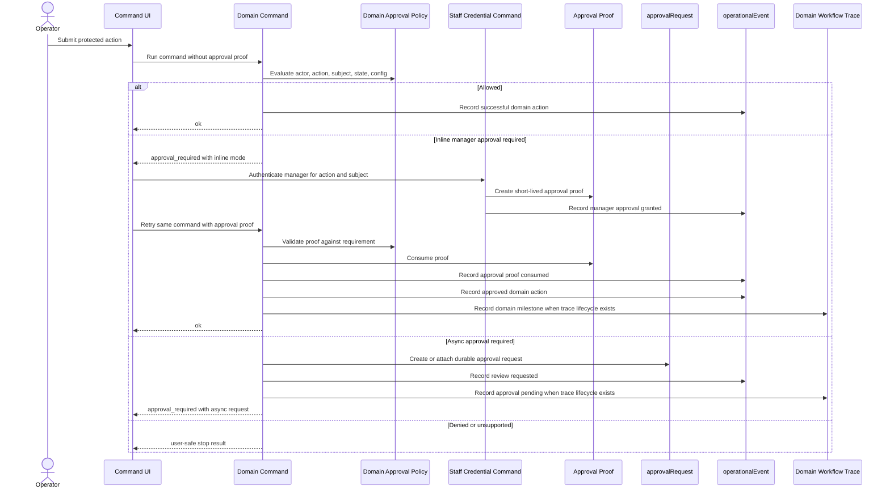

# feat: Add command approval policy layer

## Summary

Add a domain-owned approval policy layer so Athena commands can declare when an action is allowed, denied, requires fresh staff proof, requires inline manager approval, or must route to async approval review. The implementation should prove the foundation through same-amount transaction payment-method correction and register variance review while preserving existing operational events, approval requests, staff credentials, command-result patterns, and domain workflow traces where they already exist.

---

## Problem Frame

Athena currently presents manager or staff sign-in inside individual workflows such as transaction payment correction and register variance review. That solves each local screen, but it does not create an OS-level command boundary where any sensitive command can say "this action requires approval" and have the product present and enforce the right workflow consistently.

The foundational risk is authorization integrity: a generic approval system cannot trust a client-supplied `staffProfileId` as proof that a manager approved. Approval must be represented as server-validated command precondition data, not only as a frontend dialog.

---

## Requirements

- R1. Commands can evaluate a shared approval decision protocol at the command boundary before mutating protected state.
- R2. Approval policy stays domain-owned: each domain owns its business rules while returning a shared decision shape.
- R3. The shared decision protocol supports at least `allow`, `deny`, `requires_fresh_auth`, `requires_manager_approval`, `requires_async_approval`, and `unsupported`.
- R4. Inline manager approval uses fresh server-validated staff credentials and produces a command-verifiable approval proof; commands must not trust raw client-supplied staff profile IDs as proof.
- R5. Async approval continues to use the existing `approvalRequest` rail instead of introducing a parallel queue.
- R6. Approved actions resume or execute through the same domain command path that would have applied the mutation directly.
- R7. Unsupported approval-sensitive actions return guided operator feedback instead of creating approval records with no resolver path.
- R8. The first implementation proves both target workflows: transaction payment-method correction as inline manager approval, and register variance review as async approval.
- R9. Operational audit remains intact: requester, approver, subject, reason, decision, and resulting operational event are visible where the underlying workflow is reviewed.
- R10. Approval requirements and decisions produce explicit operational audit events; workflow trace milestones are recorded only for domains that already have a trace lifecycle.

---

## Scope Boundaries

- Do not build a central global rules registry in v1.
- Do not make every sensitive action async approval work; inline manager approval remains a first-class resolution mode.
- Do not migrate stock adjustment, service case, procurement, or order approval workflows unless needed for shared contract compatibility.
- Do not make all policy rules configurable in store settings; domain rules may read existing config where the domain already owns thresholds.
- Do not replace existing `approvalRequest` records or status semantics.
- Do not introduce a generic workflow-trace subsystem for every approval decision in v1; approval observability uses operational events broadly and existing domain trace lifecycles selectively.

### Deferred to Follow-Up Work

- Broader domain migration: stock operations, service workflows, online order exceptions, procurement approvals, and return/exchange flows can adopt the shared policy protocol after the first POS/cash-controls proof.
- Admin policy configuration UI: expose configurable thresholds and role requirements only after the command-layer contract is stable.
- Generic async command resume: v1 should preserve register variance's existing review resolver and avoid building a full workflow engine until multiple async command families need it.

---

## Context & Research

### Relevant Code and Patterns

- `packages/athena-webapp/shared/commandResult.ts` defines the shared browser/server command-result union used across Convex and React.
- `packages/athena-webapp/convex/lib/commandResultValidators.ts` mirrors the command-result shape for Convex returns.
- `packages/athena-webapp/src/lib/errors/runCommand.ts` and `packages/athena-webapp/src/lib/errors/presentCommandToast.ts` normalize command execution and safe user-facing errors.
- `packages/athena-webapp/convex/operations/staffCredentials.ts` authenticates active staff credentials and filters by operational roles such as `manager` and `cashier`.
- `packages/athena-webapp/src/components/staff-auth/StaffAuthenticationDialog.tsx` is the reusable credential collection UI.
- `packages/athena-webapp/convex/operations/approvalRequests.ts` and `packages/athena-webapp/convex/operations/approvalRequestHelpers.ts` provide the existing async approval rail.
- `packages/athena-webapp/convex/operations/operationalEvents.ts` provides the subject-scoped operational audit rail used by POS corrections, register sessions, approvals, and payment allocation history.
- `packages/athena-webapp/convex/operations/registerSessionTracing.ts` records register-session workflow trace milestones for closeout and variance review.
- `packages/athena-webapp/convex/pos/application/commands/correctTransaction.ts` contains completed transaction customer and payment-method correction domain commands.
- `packages/athena-webapp/src/components/pos/transactions/TransactionView.tsx` currently owns the transaction correction staff-auth handoff.
- `packages/athena-webapp/convex/cashControls/closeouts.ts` contains variance policy, async approval request creation, and approve/reject closeout resolution.
- `packages/athena-webapp/src/components/cash-controls/RegisterSessionView.tsx` currently owns the closeout submit/review staff-auth handoff.

### Institutional Learnings

- `docs/solutions/logic-errors/athena-pos-drawer-invariants-at-command-boundaries-2026-04-24.md` establishes that UI gates are ergonomics only; protected POS invariants belong at command boundaries.
- `docs/solutions/logic-errors/athena-pos-ledger-safe-corrections-2026-04-30.md` establishes that POS corrections should preserve ledger facts, record operational events, and only create approvals when a concrete resolver path exists.
- `packages/athena-webapp/docs/agent/architecture.md` documents the shared command-result foundation and the expectation that raw server errors never leak into user-facing copy.

### External References

- None used. The plan is grounded in Athena's existing command-result, staff credential, approval request, operational event, and POS/cash-control patterns.

---

## Key Technical Decisions

- Domain-owned policy, shared protocol: keep business risk rules beside their domains, but normalize the decision and presentation contract across commands.
- Decision-only policy v1: policy functions decide whether the action may proceed or what approval is required; commands remain responsible for mutation, durable request creation, and operational events.
- Server-validated approval proof: inline approval should produce a short-lived, action-bound proof that the protected command validates and consumes, rather than accepting an arbitrary approver profile ID from the browser.
- Hybrid resolution modes: commands may support inline approval, async approval, or both; the policy decision declares supported modes so UI presentation follows the command's actual resolver path.
- Existing async approval rail stays authoritative: `approvalRequest` remains the durable review object for variance review and future async workflows.
- Same command path after approval: approval should unlock or route the command, not duplicate protected business logic in manager-only mutations.
- Unsupported is explicit: commands return guided feedback when no safe resolver exists instead of producing unresolved pending work.
- Audit events everywhere, workflow traces selectively: approval requirements, granted approvals, consumed proofs, async requests, decisions, and applied approved commands should be recorded as operational events; workflow trace milestones are added only when the protected subject already participates in a domain trace lifecycle.

---

## Open Questions

### Resolved During Planning

- Should policy be domain-owned or centrally registered? Resolved as domain-owned policy with a shared decision protocol.
- Should v1 optimize for synchronous or queued approvals? Resolved as hybrid, with inline manager approval and async approval both supported by the protocol.
- Should policy own orchestration? Resolved as decision-only in v1; orchestration remains in command callers and existing command paths.

### Deferred to Implementation

- Exact approval proof persistence shape: determine while editing Convex schema and staff credential code, but it must be short-lived, action-bound, subject-bound, store-bound, and consumable.
- Exact helper and type names: choose while implementing to match local naming conventions.
- Whether the generic approval presenter is a hook, component wrapper, or both: decide while reducing duplication in the current transaction and closeout screens.
- Exact approval event taxonomy: choose stable event names during implementation, but the taxonomy must distinguish requirement surfaced, manager proof granted, proof consumed, async request created, decision recorded, and approved command applied.

---

## High-Level Technical Design

> *This illustrates the intended approach and is directional guidance for review, not implementation specification. The implementing agent should treat it as context, not code to reproduce.*

---

## Implementation Units

- U1. **Define the shared approval decision protocol**

**Goal:** Add the shared data contract that lets commands and clients understand approval decisions without embedding workflow-specific branches.

**Requirements:** R1, R2, R3, R5, R7

**Dependencies:** None

**Files:**
- Modify: `packages/athena-webapp/shared/commandResult.ts`
- Modify: `packages/athena-webapp/convex/lib/commandResultValidators.ts`
- Create: `packages/athena-webapp/shared/approvalPolicy.ts`
- Test: `packages/athena-webapp/shared/commandResult.test.ts`
- Test: `packages/athena-webapp/convex/lib/commandResultValidators.test.ts`

**Approach:**
- Introduce shared approval decision/result types at the same browser-safe layer as `CommandResult`.
- Preserve existing `ok` and `user_error` semantics while adding an approval-required result branch or compatible extension that command callers can handle explicitly.
- Model action identity, subject identity, required role, reason, supported resolution mode, self-approval policy, and safe operator copy without embedding domain-specific mutation details.
- Ensure `unsupported` and denial paths remain safe user-facing command failures rather than surprise thrown errors.

**Execution note:** Implement new contract behavior test-first because this is a shared API surface.

**Patterns to follow:**
- `packages/athena-webapp/shared/commandResult.ts`
- `packages/athena-webapp/convex/lib/commandResultValidators.ts`
- `packages/athena-webapp/src/routeTree.browser-boundary.test.ts`

**Test scenarios:**
- Happy path: an `ok` result still validates and narrows exactly as before.
- Happy path: a command can return approval-required data with an inline manager resolution mode and Convex validation accepts it.
- Happy path: a command can return approval-required data with an async approval request reference and Convex validation accepts it.
- Edge case: an approval-required result without action identity, subject identity, or supported resolution mode is rejected by validators.
- Error path: unsupported approval-sensitive actions can be represented as safe user-facing stop results without approval request metadata.
- Integration: browser-boundary tests continue to allow shared approval types without importing server-only code.

**Verification:**
- Shared command-result tests prove old result shapes and new approval-required shapes are both supported.
- Convex validators cover every new result variant used by implementation units.

---

- U2. **Add server-validated inline approval proof**

**Goal:** Make inline manager approval enforceable at the command boundary instead of trusting a frontend-provided approver ID.

**Requirements:** R4, R6, R9

**Dependencies:** U1

**Files:**
- Modify: `packages/athena-webapp/convex/schema.ts`
- Modify: `packages/athena-webapp/convex/operations/staffCredentials.ts`
- Modify: `packages/athena-webapp/convex/operations/staffCredentials.test.ts`
- Create: `packages/athena-webapp/convex/operations/approvalProofs.ts`
- Test: `packages/athena-webapp/convex/operations/approvalProofs.test.ts`

**Approach:**
- Add a server-side approval proof/grant concept that is created only after successful fresh staff credential authentication for the required role.
- Bind the proof to store, action key, subject, requesting actor where available, required role, expiry, and consumption state.
- Provide helpers for protected commands to validate and consume the proof before mutation.
- Keep staff credential authentication as the source of proof creation; do not let arbitrary commands mint approver identity without credential validation.

**Execution note:** Implement proof creation and consumption test-first because the security boundary is the core of the feature.

**Patterns to follow:**
- `packages/athena-webapp/convex/operations/staffCredentials.ts`
- `packages/athena-webapp/convex/operations/staffCredentials.test.ts`
- `packages/athena-webapp/convex/operations/approvalRequests.ts`

**Test scenarios:**
- Happy path: an active manager credential creates an approval proof for a matching action and subject.
- Happy path: a protected command helper validates and consumes an unused matching proof.
- Edge case: proof expiry prevents use and returns a safe precondition failure.
- Error path: cashier-only credentials cannot mint a manager approval proof.
- Error path: a proof for one subject cannot approve another subject.
- Error path: a consumed proof cannot be replayed.
- Error path: a proof from another store cannot approve the action.
- Integration: staff credential `lastAuthenticatedAt` behavior still updates during approval authentication.

**Verification:**
- Tests demonstrate that a client cannot approve by guessing a manager `staffProfileId`.
- Proof validation is action-bound, subject-bound, store-bound, role-bound, time-bound, and one-use.

---

- U3. **Introduce a generic approval presenter for command callers**

**Goal:** Let React command surfaces present inline manager approval from a shared command-result protocol instead of embedding bespoke staff-auth handoffs per workflow.

**Requirements:** R1, R3, R4, R6, R7

**Dependencies:** U1, U2

**Files:**
- Modify: `packages/athena-webapp/src/lib/errors/runCommand.ts`
- Modify: `packages/athena-webapp/src/lib/errors/presentCommandToast.ts`
- Create: `packages/athena-webapp/src/lib/commands/approvalResolution.ts`
- Create: `packages/athena-webapp/src/components/operations/CommandApprovalDialog.tsx`
- Test: `packages/athena-webapp/src/lib/errors/runCommand.test.ts`
- Test: `packages/athena-webapp/src/components/operations/CommandApprovalDialog.test.tsx`

**Approach:**
- Extend command normalization so approval-required results are not treated as unexpected failures or generic toasts.
- Build a reusable presenter that receives an approval requirement, authenticates the required staff role, obtains an approval proof, and lets the original surface retry the same command with that proof.
- Reuse `StaffAuthenticationDialog` for credential capture and operator copy conventions rather than creating a second credential UI.
- Keep async approval presentation minimal in v1: surfaces can show the created request/pending state while existing domain views continue to own detailed queue behavior.

**Execution note:** Add characterization coverage around current command error presentation before changing the shared runner behavior.

**Patterns to follow:**
- `packages/athena-webapp/src/components/staff-auth/StaffAuthenticationDialog.tsx`
- `packages/athena-webapp/src/lib/errors/runCommand.ts`
- `packages/athena-webapp/src/lib/errors/presentCommandToast.ts`
- `packages/athena-webapp/src/components/cash-controls/RegisterSessionView.tsx`
- `packages/athena-webapp/src/components/pos/transactions/TransactionView.tsx`

**Test scenarios:**
- Happy path: an approval-required result opens the approval presenter with required role and reason copy.
- Happy path: successful manager auth returns an approval proof to the caller's retry path.
- Edge case: dismissal leaves the original protected command unapplied and does not show success feedback.
- Error path: invalid manager credentials reset PIN entry and preserve the approval requirement.
- Error path: unsupported approval result shows guided operator copy and does not show the manager auth dialog.
- Integration: existing `user_error` and `unexpected_error` toast behavior remains unchanged for non-approval commands.

**Verification:**
- Payment correction and closeout surfaces can use the same approval presenter contract without losing workflow-specific copy or pending-state handling.

---

- U4. **Move transaction payment-method correction onto inline approval policy**

**Goal:** Make completed transaction payment-method correction require command-declared manager approval and command-validated proof before applying a same-amount correction.

**Requirements:** R1, R2, R4, R6, R7, R8, R9, R10

**Dependencies:** U1, U2, U3, U6

**Files:**
- Modify: `packages/athena-webapp/convex/pos/application/commands/correctTransaction.ts`
- Modify: `packages/athena-webapp/convex/pos/public/transactions.ts`
- Modify: `packages/athena-webapp/src/components/pos/transactions/TransactionView.tsx`
- Test: `packages/athena-webapp/convex/pos/application/correctTransactionPaymentMethod.test.ts`
- Test: `packages/athena-webapp/convex/pos/public/transactions.test.ts`
- Test: `packages/athena-webapp/src/components/pos/transactions/TransactionView.test.tsx`

**Approach:**
- Add a POS transaction correction policy that classifies payment-method correction as inline manager approval when the requesting actor is not already satisfying the domain requirement.
- Keep existing same-amount single-payment and payment-allocation constraints intact.
- On first submit without valid approval proof, return approval-required instead of directly applying the correction.
- On retry with a valid matching proof, consume the proof, apply the same correction path, update the transaction/payment allocation, and record approval plus correction operational events with requester and approver context.
- Continue returning guided feedback for multi-payment, amount-changing, ambiguous, or unsupported corrections.

**Execution note:** Start with command-level tests proving the direct bypass is blocked before adjusting the React flow.

**Patterns to follow:**
- `packages/athena-webapp/convex/pos/application/commands/correctTransaction.ts`
- `packages/athena-webapp/convex/operations/paymentAllocations.ts`
- `packages/athena-webapp/convex/operations/operationalEvents.ts`
- `docs/solutions/logic-errors/athena-pos-ledger-safe-corrections-2026-04-30.md`

**Test scenarios:**
- Happy path: cashier submits a same-amount single-payment correction and receives an inline manager approval requirement.
- Happy path: command retry with matching manager approval proof corrects the transaction payment method and matching payment allocation.
- Happy path: operational events record approval granted, proof consumed, and the correction with requester and approver context.
- Edge case: manager approval proof for another transaction is rejected.
- Error path: multi-payment transaction returns guided unsupported feedback and does not create an approval proof or approval request.
- Error path: same transaction cannot reuse an already consumed proof.
- Integration: `TransactionView` opens the shared approval presenter and shows success only after the retried command succeeds.

**Verification:**
- Completed transaction correction cannot be forced by directly passing a staff profile ID.
- Existing transaction history and payment allocation display remain consistent after the approved correction.

---

- U5. **Normalize register variance review onto the policy protocol**

**Goal:** Make register closeout variance review express its approval requirement through the shared policy protocol while preserving its durable async `approvalRequest` workflow.

**Requirements:** R1, R2, R3, R5, R6, R8, R9, R10

**Dependencies:** U1, U6

**Files:**
- Modify: `packages/athena-webapp/convex/cashControls/closeouts.ts`
- Modify: `packages/athena-webapp/src/components/cash-controls/RegisterSessionView.tsx`
- Test: `packages/athena-webapp/convex/cashControls/closeouts.test.ts`
- Test: `packages/athena-webapp/src/components/cash-controls/RegisterSessionView.test.tsx`
- Test: `packages/athena-webapp/src/components/cash-controls/RegisterSessionView.auth.test.tsx`

**Approach:**
- Extract the existing variance threshold/signoff decision into a cash-controls approval policy that returns the shared decision shape.
- Keep current `approvalRequest` creation for variance review when the policy requires async approval.
- Ensure approve/reject remains manager-role enforced at the command boundary and continues to decide the existing approval request.
- Update the register session UI to consume the normalized approval result while preserving current closeout copy, pending state, manager notes, and trace/event behavior.
- Preserve existing register-session workflow trace milestones and add approval-policy audit events where the shared protocol surfaces or resolves approval state.

**Execution note:** Use characterization-first tests around current variance approval outcomes before refactoring the policy shape.

**Patterns to follow:**
- `packages/athena-webapp/convex/cashControls/closeouts.ts`
- `packages/athena-webapp/convex/operations/approvalRequests.ts`
- `packages/athena-webapp/convex/operations/registerSessionTracing.ts`
- `packages/athena-webapp/src/components/cash-controls/RegisterSessionView.tsx`

**Test scenarios:**
- Happy path: closeout without variance approval requirement still closes directly.
- Happy path: closeout exceeding threshold creates or updates a pending async approval request through the shared policy result.
- Happy path: manager approval closes the register session and records approval events/traces as before.
- Happy path: manager rejection leaves the session pending recount/correction and records rejection events/traces as before.
- Happy path: approval-policy operational events link the variance requirement, async request, and final decision to the register session.
- Edge case: superseded pending approval is cancelled when a new closeout submission replaces it.
- Error path: non-manager review attempt returns authorization failure.
- Integration: `RegisterSessionView` displays pending approval and approve/reject affordances without duplicating policy-specific branching.

**Verification:**
- Existing variance approval behavior is preserved while the command result speaks the shared approval protocol.

---

- U6. **Add approval audit events and domain trace hooks**

**Goal:** Make approval decisions observable across the command layer without building a generic workflow-trace subsystem prematurely.

**Requirements:** R9, R10

**Dependencies:** U1, U2

**Files:**
- Modify: `packages/athena-webapp/convex/operations/operationalEvents.ts`
- Modify: `packages/athena-webapp/convex/operations/approvalRequests.ts`
- Modify: `packages/athena-webapp/convex/operations/approvalProofs.ts`
- Modify: `packages/athena-webapp/convex/operations/registerSessionTracing.ts`
- Test: `packages/athena-webapp/convex/operations/approvalRequests.test.ts`
- Test: `packages/athena-webapp/convex/operations/approvalProofs.test.ts`
- Test: `packages/athena-webapp/convex/operations/registerSessionTracing.test.ts`

**Approach:**
- Define a small approval audit event vocabulary for approval required, manager approval granted, approval proof consumed, async request created, decision recorded, and approved command applied.
- Record those events through the existing operational event rail with action key, subject, requester, approver, proof/request identifiers where relevant, and safe reason metadata.
- Reuse existing domain workflow trace adapters only when the protected subject already has a trace lifecycle, starting with register-session closeout/variance review.
- Keep payment-method correction on operational events only unless the POS transaction subject already has a trace context available through the existing transaction/session trace path.

**Execution note:** Implement event-writing behavior test-first because observability regressions are easy to miss in UI-only checks.

**Patterns to follow:**
- `packages/athena-webapp/convex/operations/operationalEvents.ts`
- `packages/athena-webapp/convex/operations/registerSessionTracing.ts`
- `packages/athena-webapp/convex/cashControls/closeouts.ts`
- `packages/athena-webapp/convex/pos/application/commands/correctTransaction.ts`

**Test scenarios:**
- Happy path: inline manager approval writes approval-granted and proof-consumed operational events linked to the protected subject.
- Happy path: approved command application writes an operational event linking requester, approver, subject, action key, and proof id.
- Happy path: async variance approval writes request-created and decision-recorded operational events linked to the `approvalRequest` and register session.
- Edge case: operational event recording failure does not partially apply approval proof consumption without surfacing a safe command failure or preserving retry semantics.
- Error path: unsupported approval decisions do not create misleading success or decision events.
- Integration: register-session variance review records domain workflow trace milestones through existing register-session tracing, while non-traced approval subjects rely on operational events only.

**Verification:**
- Approval decisions can be reconstructed from operational events.
- Register-session variance review keeps its existing trace lifecycle and links approval milestones consistently.
- No generic workflow trace is created for approval-only subjects in v1.

---

- U7. **Refresh docs, generated graph, and agent guidance for approval policy**

**Goal:** Keep Athena's repo docs honest about the new approval policy foundation and its validation surfaces.

**Requirements:** R1, R2, R8, R9, R10

**Dependencies:** U1, U2, U3, U4, U5, U6

**Files:**
- Modify: `packages/athena-webapp/docs/agent/architecture.md`
- Modify: `packages/athena-webapp/docs/agent/testing.md`
- Modify: `packages/athena-webapp/docs/agent/code-map.md`
- Create: `docs/solutions/logic-errors/athena-command-approval-policy-layer-2026-05-01.md`
- Regenerate: `graphify-out/`

**Approach:**
- Document the command approval policy layer as the standard path for approval-sensitive command work.
- Add validation guidance for shared command-result, staff approval proof, approval audit events, POS correction, and cash-control variance slices.
- Capture the command-boundary learning so future approval-sensitive work does not regress to UI-only manager gates.
- Capture the observability rule: operational events everywhere, workflow trace milestones only for domains with existing trace lifecycles.
- Rebuild graphify after code changes land, per repo guidance.

**Execution note:** Sensor-only after behavior implementation is complete.

**Patterns to follow:**
- `packages/athena-webapp/docs/agent/architecture.md`
- `packages/athena-webapp/docs/agent/testing.md`
- `docs/solutions/logic-errors/athena-pos-drawer-invariants-at-command-boundaries-2026-04-24.md`
- `docs/solutions/logic-errors/athena-pos-ledger-safe-corrections-2026-04-30.md`

**Test scenarios:**
- Test expectation: none -- documentation and generated graph refresh do not introduce behavior.

**Verification:**
- Agent docs point future implementers to the approval policy layer and relevant tests.
- Graphify output reflects the new code relationships after code implementation.

---

## System-Wide Impact

- **Interaction graph:** Shared command-result types, Convex validators, staff credential auth, approval proof persistence, approval requests, POS transaction correction, cash-controls closeout, operational events, existing register-session workflow traces, and React command presenters are affected.
- **Error propagation:** Approval-required results must not degrade into generic toasts or unexpected errors; unsupported or denied actions must keep safe operator-facing copy.
- **State lifecycle risks:** Approval proofs must be short-lived and one-use to prevent replay; async approvals must avoid orphan requests; retried commands must not double-apply mutations.
- **API surface parity:** Browser, Convex validator, and command runner contracts must change together so every command surface can consume the same protocol.
- **Integration coverage:** Payment correction and variance review need cross-layer coverage because they cross React, staff auth, Convex command policy, approval proof/request state, operational event history, and existing register-session trace milestones.
- **Unchanged invariants:** Completed transaction amount, items, discounts, inventory, and ambiguous payment allocation cases remain protected; `approvalRequest` remains the durable async approval rail.

---

## Risks & Dependencies

| Risk | Mitigation |
|------|------------|
| Client can spoof manager approval by passing an approver ID | Use server-created, action-bound, subject-bound, one-use approval proofs validated by protected commands |
| Shared command result change breaks legacy callers | Keep `ok` and `user_error` stable; update `runCommand`, validators, and focused tests before migrating workflows |
| Policy layer becomes a premature workflow engine | Limit v1 to decision protocol plus proof/request integration; defer generic async resume |
| Payment correction creates ledger drift | Preserve same-amount single-payment constraints and test transaction/payment allocation updates together |
| Variance review behavior regresses during normalization | Characterize existing closeout approval outcomes before extracting policy decisions |
| Approval decisions become invisible outside UI state | Record approval requirements and decisions as operational events; use workflow traces only where the domain already has a trace lifecycle |
| Generated docs or graph artifacts drift after implementation | Include explicit docs/graph unit and run repo sensors after code changes |

---

## Documentation / Operational Notes

- This feature changes Athena's durable architecture for approval-sensitive commands, so package agent docs and a solution note should be updated with the new standard.
- The durable observability standard is operational audit events for every approval decision, with workflow trace milestones only for domains that already have a trace lifecycle.
- Implementation should use focused package tests first, then package typecheck/build and the repo harness/pre-push validation path before merge.
- New Convex schema or generated client references may require `bunx convex dev` from `packages/athena-webapp` to refresh generated artifacts.

---

## Alternative Approaches Considered

- Inline manager auth per workflow: rejected because it keeps approval as screen-specific UI behavior and does not protect direct command calls consistently.
- Central approval registry: rejected for v1 because POS, cash controls, stock ops, and services have domain-specific risk rules that should not be abstracted before the first shared protocol exists.
- Config-driven policy foundation: rejected for v1 because some approval requirements are safety invariants, not store preferences.
- Queue-first approvals: rejected because a manager standing at the terminal should be able to approve appropriate actions synchronously without turning every store exception into back-office work.
- Full workflow orchestration engine: deferred because v1 only needs shared decision/proof/request semantics, not generic command pause/resume across every domain.

---

## Success Metrics

- A new approval-sensitive command can adopt the shared decision protocol without inventing custom manager-auth UI.
- Transaction payment-method correction cannot be applied without a valid command-checked approval proof.
- Register variance review still behaves as before for async approval, but now reports approval requirements through the shared protocol.
- Approval requirements and decisions can be reconstructed from operational events, and register-session variance review preserves its existing workflow trace lifecycle.
- Operator-facing copy remains safe, operational, and workflow-specific.
- Tests cover direct command bypass attempts, stale/replayed approval proofs, unsupported correction categories, and manager/non-manager role boundaries.

---

## Phased Delivery

### Phase 1: Foundation

- U1 establishes the shared protocol.
- U2 establishes server-validated inline approval proof.
- U3 establishes generic approval presentation.
- U6 establishes approval audit events and selective domain trace hooks.

### Phase 2: Workflow Proofs

- U4 migrates payment-method correction to inline manager approval.
- U5 normalizes variance review onto async approval policy.

### Phase 3: Repo Honesty

- U7 updates docs, solution guidance, and graph output after behavior lands.

---

## Sources & References

- Related code: `packages/athena-webapp/shared/commandResult.ts`
- Related code: `packages/athena-webapp/convex/lib/commandResultValidators.ts`
- Related code: `packages/athena-webapp/convex/operations/staffCredentials.ts`
- Related code: `packages/athena-webapp/convex/operations/approvalRequests.ts`
- Related code: `packages/athena-webapp/convex/operations/operationalEvents.ts`
- Related code: `packages/athena-webapp/convex/operations/registerSessionTracing.ts`
- Related code: `packages/athena-webapp/convex/pos/application/commands/correctTransaction.ts`
- Related code: `packages/athena-webapp/convex/cashControls/closeouts.ts`
- Related code: `packages/athena-webapp/src/components/staff-auth/StaffAuthenticationDialog.tsx`
- Related code: `packages/athena-webapp/src/components/pos/transactions/TransactionView.tsx`
- Related code: `packages/athena-webapp/src/components/cash-controls/RegisterSessionView.tsx`
- Institutional learning: `docs/solutions/logic-errors/athena-pos-drawer-invariants-at-command-boundaries-2026-04-24.md`
- Institutional learning: `docs/solutions/logic-errors/athena-pos-ledger-safe-corrections-2026-04-30.md`
