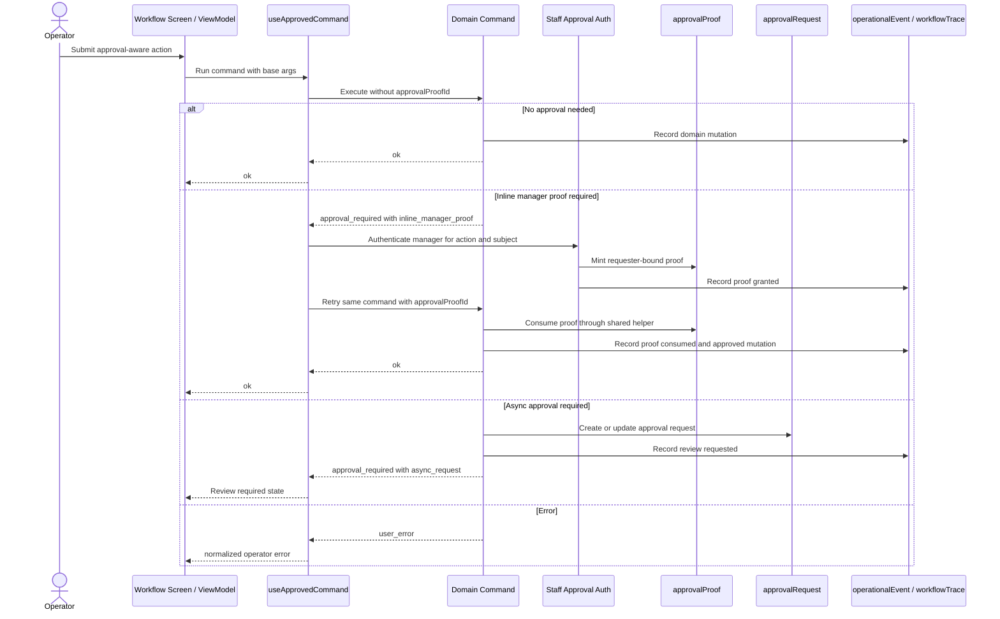

# refactor: Make command approval first class

## Summary

Promote Athena's approval proof, approval requirement, and command-result primitives into a reusable command approval foundation, then migrate transaction payment correction, cash-controls register closeout, POS register closeout, and opening float correction onto that foundation. The plan keeps approval policy domain-owned while removing workflow-specific approval wiring from React screens and hook state.

---

## Problem Frame

The recent inline manager approval work proved the right security model, but it also exposed how much each workflow still hand-wires approval behavior. POS closeout, cash-controls closeout, transaction correction, and opening float correction each know too much about approval proof minting, dialog state, retry behavior, requester binding, and approval-required payload shape.

That duplication made the requester mismatch possible: proof creation and proof consumption were both correct locally, but the workflow boundary did not make the requester invariant first-class. The system needs one reusable command approval path that screens can consume consistently while commands continue to enforce domain policy server-side.

---

## Requirements

- R1. Approval-aware mutations return the shared `ApprovalCommandResult<T>` / `approval_required` contract when approval is required, not workflow-specific `ok({ action: "approval_required" })` payloads.
- R2. Domain commands remain the source of approval policy, including action key, subject, required role, reason, resolution modes, and durable async request creation when needed.
- R3. Inline manager approval proof creation, requester binding, proof consumption, retry, and error propagation become reusable across approval-aware React workflows.
- R4. POS register closeout no longer constructs register closeout approval requirements in `useRegisterViewModel`; the server returns the requirement and the client resolves it generically.
- R5. Cash-controls register closeout, POS register closeout, transaction payment-method correction, and opening float correction all use the same approval presentation and proof retry foundation where their resolution mode supports inline proof.
- R6. Async approval remains on the existing `approvalRequest` rail; this plan must not replace queue/review behavior with an ad hoc inline-only flow.
- R7. Approval proof validation stays server-enforced and bound to store, action key, subject, required role, requester, expiry, and one-use consumption.
- R8. Operational audit events and existing register-session workflow trace milestones remain intact for approval requested, proof granted, proof consumed, approved command applied, and async decision outcomes.
- R9. Operator-facing copy remains calm, explicit, and workflow-appropriate without surfacing raw backend wording.
- R10. The migration leaves external behavior stable except for eliminating duplicated client approval wiring and replacing special approval payload shapes with the shared contract.

---

## Scope Boundaries

- Do not build store-configurable approval policy rules in this plan.
- Do not migrate stock operations, service cases, storefront order exceptions, procurement approvals, or other approval-request domains unless shared contract compatibility requires a small type adjustment.
- Do not replace the `approvalRequest` table, queue UI, or async approval decision semantics.
- Do not create a generic workflow engine or async command-resume framework; only the existing approval-aware workflows move onto the shared foundation.
- Do not redesign staff credential authentication UI beyond the reusable approval wrapper needed by current flows.
- Do not change the approval proof security model to trust client-supplied staff profile IDs.

### Deferred to Follow-Up Work

- Broader domain adoption: stock adjustments, service workflows, online order exceptions, procurement approvals, returns, and exchanges can adopt the first-class approval runner after the current workflows prove the foundation.
- Policy registry expansion: a shared action registry can later become configurable or discoverable in admin tooling if multiple domains need centralized management.
- Operations queue modernization: async approval review screens can later consume richer shared `ApprovalRequirement` metadata if this plan reveals useful queue UI improvements.

---

## Context & Research

### Relevant Code and Patterns

- `packages/athena-webapp/shared/commandResult.ts` already defines `ApprovalCommandResult<T>`, `approvalRequired`, and `isApprovalRequiredResult`.
- `packages/athena-webapp/shared/approvalPolicy.ts` defines `ApprovalRequirement`, resolution modes, subject identity, operator copy, and self-approval metadata.
- `packages/athena-webapp/convex/lib/commandResultValidators.ts` validates approval-required command results for Convex returns.
- `packages/athena-webapp/convex/operations/approvalProofs.ts` creates and consumes one-use approval proofs bound to action, subject, role, requester, store, and expiry.
- `packages/athena-webapp/convex/operations/staffCredentials.ts` mints approval proofs through fresh staff credential authentication.
- `packages/athena-webapp/src/components/operations/CommandApprovalDialog.tsx` is the reusable proof collection presenter.
- `packages/athena-webapp/src/components/pos/transactions/TransactionView.tsx` already uses `CommandApprovalDialog`, but still wires authentication and retry manually.
- `packages/athena-webapp/src/lib/pos/presentation/register/useRegisterViewModel.ts` currently builds a register closeout `ApprovalRequirement` client-side for POS closeout.
- `packages/athena-webapp/src/components/cash-controls/RegisterSessionView.tsx` mixes shared `CommandApprovalDialog` usage with closeout-specific staff auth intent handling.
- `packages/athena-webapp/convex/cashControls/closeouts.ts` owns register closeout variance policy, opening float correction policy, async approval request creation, inline proof consumption, and register-session trace milestones.
- `packages/athena-webapp/convex/pos/application/commands/correctTransaction.ts` owns transaction payment-method correction policy and proof consumption.

### Institutional Learnings

- `docs/solutions/logic-errors/athena-command-approval-policy-boundary-2026-05-01.md` establishes that approval UI is presentation only; commands must return shared approval requirements and enforce approved retries server-side.
- `docs/solutions/logic-errors/athena-pos-ledger-safe-corrections-2026-04-30.md` establishes that POS correction flows should preserve ledger facts, record operational events, and avoid orphaned approval records without a concrete resolver.
- The prior command-approval plan at `docs/plans/2026-05-01-001-feat-command-approval-policy-layer-plan.md` established the approval proof foundation; this plan is a follow-on migration/refactor, not a restart.

### External References

- None. The target behavior is internal to Athena's existing command-result, staff credential, approval proof, approval request, POS, and cash-controls architecture.

---

## Key Technical Decisions

- **Normalize on `ApprovalCommandResult<T>` for approval-aware commands:** Commands should surface approval requirements through the shared result union so clients can resolve approval without knowing workflow-specific payload conventions.
- **Keep approval policy domain-owned:** The server still decides whether approval is needed and what resolution modes are valid. The shared foundation handles orchestration and proof mechanics, not business thresholds.
- **Extract a reusable client approval runner:** React workflows should ask a shared hook/component wrapper to resolve `approval_required`, mint proof through staff credentials, and retry with `approvalProofId`.
- **Move POS closeout approval construction back to the command:** POS may validate notes before submit for operator ergonomics, but closeout variance approval requirement construction belongs in `cashControls/closeouts.ts`.
- **Introduce a server proof-consumption helper around existing proof primitives:** Commands should pass domain facts into a shared helper so requester binding and subject/action validation cannot drift between workflows.
- **Preserve async approval behavior:** Async approval remains a durable `approvalRequest` path; the shared runner presents async requirements as review-required states, not as retryable inline flows unless the requirement includes inline proof mode.
- **Treat observability as part of behavior:** Approval-related events and register-session trace milestones are not optional polish; they prove security and workflow state transitions.

---

## Open Questions

### Resolved During Planning

- **Should this become a central policy registry first?** No. Start with command-owned policy plus small shared helpers. A registry is useful for action metadata reuse, but not for moving business rules out of their domains.
- **Should POS closeout continue precomputing approval client-side for manager auto-approval?** No. The command should return the approval requirement and the client runner should resolve it. The only client-side precondition kept is notes-required ergonomics.
- **Should async approval be folded into the same retry runner?** Partially. The runner should understand async requirements enough to show the right UI/stop state, but it should not invent a generic async resume engine.

### Deferred to Implementation

- Exact helper names and file split for the client runner should follow local naming once implementation starts.
- Whether the first action registry is a shared constants module or domain-local exports re-exported by a shared helper can be decided while reducing duplication.
- Whether the cash-controls register detail content component receives the runner directly or receives a narrower approval coordinator should be decided based on test ergonomics.

---

## High-Level Technical Design

> *This illustrates the intended approach and is directional guidance for review, not implementation specification. The implementing agent should treat it as context, not code to reproduce.*

---

## Implementation Units

- U1. **Normalize register closeout command result contract**

**Goal:** Move `submitRegisterSessionCloseout` from workflow-specific approval payloads to the shared `ApprovalCommandResult<T>` contract while preserving closeout behavior.

**Requirements:** R1, R2, R6, R8, R10

**Dependencies:** None

**Files:**
- Modify: `packages/athena-webapp/convex/cashControls/closeouts.ts`
- Modify: `packages/athena-webapp/convex/lib/commandResultValidators.ts`
- Test: `packages/athena-webapp/convex/cashControls/closeouts.test.ts`
- Test: `packages/athena-webapp/convex/cashControls/registerSessionTraceLifecycle.test.ts`
- Test: `packages/athena-webapp/convex/lib/commandResultValidators.test.ts`

**Approach:**
- Change closeout submission so required approval is represented by the shared `approval_required` result with a full `ApprovalRequirement`.
- Preserve async `approvalRequest` creation for non-inline paths and preserve inline proof close behavior when `approvalProofId` is supplied.
- Keep return payloads for successful `closed` outcomes stable enough for existing screens to continue showing success state.
- Ensure the Convex validator accepts the shared approval result for closeout submission without allowing malformed approval requirements.

**Execution note:** Start with characterization coverage around the current closeout approval-required payload and trace behavior, then change the contract test-first.

**Patterns to follow:**
- `packages/athena-webapp/shared/commandResult.ts`
- `packages/athena-webapp/convex/cashControls/closeouts.ts`
- `packages/athena-webapp/convex/pos/application/commands/correctTransaction.ts`

**Test scenarios:**
- Happy path: a no-variance closeout returns `ok` and closes the register session as before.
- Happy path: a variance closeout without proof returns `approval_required` with action key `cash_controls.register_session.review_variance`, register session subject, manager role, and async request metadata.
- Happy path: a variance closeout with a valid proof consumes the proof, closes the register session, records approval audit events, and records closeout trace milestones.
- Edge case: a closeout proof bound to a different requester, subject, action, role, or store is rejected without closing the register session.
- Error path: a malformed counted cash value or closed register session still returns a user-safe error and does not create approval records.
- Integration: register-session trace lifecycle tests continue to show submitted, pending, approved/rejected, and closed milestones where applicable.

**Verification:**
- Closeout command tests prove both shared approval-required and approved retry paths.
- Existing trace lifecycle tests prove no register-session trace regression.

---

- U2. **Introduce reusable server approval helpers and action identity registry**

**Goal:** Reduce proof-consumption drift by centralizing action identity metadata and the common proof validation call shape.

**Requirements:** R2, R5, R7, R8

**Dependencies:** U1

**Files:**
- Create: `packages/athena-webapp/convex/operations/approvalActions.ts`
- Modify: `packages/athena-webapp/convex/operations/approvalProofs.ts`
- Modify: `packages/athena-webapp/convex/cashControls/closeouts.ts`
- Modify: `packages/athena-webapp/convex/pos/application/commands/correctTransaction.ts`
- Test: `packages/athena-webapp/convex/operations/approvalProofs.test.ts`
- Test: `packages/athena-webapp/convex/cashControls/closeouts.test.ts`
- Test: `packages/athena-webapp/convex/pos/application/correctTransactionPaymentMethod.test.ts`

**Approach:**
- Add a small action identity module for current approval-sensitive actions: register variance review, opening float correction, and payment method correction.
- Add a helper around `consumeApprovalProofWithCtx` that accepts the domain command's requester, subject, store, role, and action identity and applies the same requester-bound proof validation every time.
- Keep domain-specific authorization checks after proof validation where they belong, such as `staffProfileCanReviewCloseoutVariance`.
- Avoid moving thresholds, correction eligibility, or variance policy into the action registry.

**Execution note:** Implement helper coverage test-first because this touches authorization-sensitive behavior.

**Patterns to follow:**
- `packages/athena-webapp/convex/operations/approvalProofs.ts`
- `packages/athena-webapp/convex/operations/approvalAuditEvents.ts`
- `packages/athena-webapp/convex/pos/application/commands/correctTransaction.ts`

**Test scenarios:**
- Happy path: helper consumes a proof when action, subject, role, requester, and store all match.
- Edge case: requester mismatch is rejected consistently for register closeout and payment method correction.
- Edge case: subject/action mismatch is rejected before any domain mutation happens.
- Error path: expired or reused proof still returns the existing user-safe proof error.
- Integration: payment method correction and closeout tests assert they call through the same helper behavior by exercising invalid proof cases.

**Verification:**
- Proof tests demonstrate the helper preserves all existing proof invariants.
- Domain tests prove both cash-controls and POS correction commands still reject tampered approval proofs.

---

- U3. **Extract reusable client approval runner**

**Goal:** Replace per-screen proof dialog and retry wiring with a shared approval runner for React command flows.

**Requirements:** R3, R5, R6, R9, R10

**Dependencies:** U1, U2

**Files:**
- Create: `packages/athena-webapp/src/components/operations/useApprovedCommand.ts`
- Modify: `packages/athena-webapp/src/components/operations/CommandApprovalDialog.tsx`
- Modify: `packages/athena-webapp/src/lib/errors/runCommand.ts`
- Modify: `packages/athena-webapp/src/lib/errors/presentCommandToast.ts`
- Test: `packages/athena-webapp/src/components/operations/useApprovedCommand.test.tsx`
- Test: `packages/athena-webapp/src/components/operations/CommandApprovalDialog.test.tsx`
- Test: `packages/athena-webapp/src/lib/errors/runCommand.test.ts`
- Test: `packages/athena-webapp/src/lib/errors/presentCommandToast.test.ts`

**Approach:**
- Introduce a hook or small coordinator component that runs an approval-aware command, stores a pending `ApprovalRequirement`, authenticates through `authenticateStaffCredentialForApproval`, retries the same command with `approvalProofId`, and returns normalized results to the caller.
- Make async-only requirements produce a clear review-required state without attempting inline proof collection.
- Keep `CommandApprovalDialog` as the presenter but remove the need for every workflow to define its own `onAuthenticateForApproval` adapter.
- Preserve caller control over success toasts and workflow-specific state cleanup after the final result.

**Execution note:** Use test-first coverage for the runner state machine because it replaces duplicated approval orchestration.

**Patterns to follow:**
- `packages/athena-webapp/src/components/operations/CommandApprovalDialog.tsx`
- `packages/athena-webapp/src/components/pos/transactions/TransactionView.tsx`
- `packages/athena-webapp/src/components/cash-controls/RegisterSessionView.tsx`

**Test scenarios:**
- Happy path: a command returning `ok` resolves without opening approval UI.
- Happy path: a command returning inline `approval_required` opens manager auth, mints proof, retries with `approvalProofId`, and returns final `ok`.
- Happy path: an async-only approval requirement exposes review-required state and does not call proof authentication.
- Edge case: dismissing the dialog clears pending approval without retrying the command.
- Error path: manager authentication failure returns the user-safe auth error and keeps the original command state recoverable.
- Error path: retry failure after proof creation surfaces the retry error and does not report success.
- Integration: requester staff profile id is passed into proof minting and then included in the retry command's proof validation path.

**Verification:**
- Runner tests cover no-approval, inline approval, async approval, dismissal, auth failure, and retry failure.
- Existing command dialog tests continue to prove presentation behavior.

---

- U4. **Migrate transaction payment correction to the approval runner**

**Goal:** Keep transaction payment-method correction behavior intact while removing bespoke approval dialog and retry wiring from `TransactionView`.

**Requirements:** R3, R5, R6, R8, R9

**Dependencies:** U2, U3

**Files:**
- Modify: `packages/athena-webapp/src/components/pos/transactions/TransactionView.tsx`
- Modify: `packages/athena-webapp/convex/pos/application/commands/correctTransaction.ts`
- Test: `packages/athena-webapp/src/components/pos/transactions/TransactionView.test.tsx`
- Test: `packages/athena-webapp/convex/pos/application/correctTransactionPaymentMethod.test.ts`
- Test: `packages/athena-webapp/convex/pos/public/transactions.test.ts`

**Approach:**
- Replace `pendingPaymentApproval` and local `CommandApprovalDialog` wiring with the shared runner.
- Preserve the existing correction flow where same-amount payment method correction can request approval and apply through the same command after proof.
- Ensure customer correction and other non-payment correction flows are not dragged into approval runner behavior unless they return shared approval-required results.
- Keep current operational events for request, proof consumption, and applied correction.

**Execution note:** Use characterization-first tests around the existing payment-method correction UI flow before replacing the wiring.

**Patterns to follow:**
- Existing transaction correction tests in `packages/athena-webapp/src/components/pos/transactions/TransactionView.test.tsx`
- Payment correction command tests in `packages/athena-webapp/convex/pos/application/correctTransactionPaymentMethod.test.ts`

**Test scenarios:**
- Happy path: correcting a completed transaction payment method surfaces manager approval and applies correction after valid proof.
- Happy path: async approval requirement still shows review-required copy when inline proof is not available.
- Edge case: non-payment correction behavior stays unchanged.
- Error path: invalid proof, wrong requester, or correction-ineligible transaction is rejected without changing the transaction.
- Integration: operational events still include requester, approver, approval proof, previous payment method, and new payment method.

**Verification:**
- Transaction view tests prove the UI no longer needs direct approval dialog state but preserves operator-visible behavior.
- Convex tests prove ledger-safe correction invariants and approval audit events remain intact.

---

- U5. **Migrate cash-controls register closeout and opening float correction**

**Goal:** Move cash-controls register detail workflows onto the shared approval runner while preserving closeout review, rejected state communication, notes validation, and opening float correction behavior.

**Requirements:** R1, R3, R5, R6, R8, R9, R10

**Dependencies:** U1, U2, U3

**Files:**
- Modify: `packages/athena-webapp/src/components/cash-controls/RegisterSessionView.tsx`
- Modify: `packages/athena-webapp/convex/cashControls/closeouts.ts`
- Test: `packages/athena-webapp/src/components/cash-controls/RegisterSessionView.test.tsx`
- Test: `packages/athena-webapp/src/components/cash-controls/RegisterSessionView.auth.test.tsx`
- Test: `packages/athena-webapp/convex/cashControls/closeouts.test.ts`

**Approach:**
- Replace closeout submit's local inline manager approval chain with the shared runner.
- Keep pending async variance review and approve/reject review behavior intact.
- Migrate opening float correction approval collection through the same runner if it already returns shared `approval_required`.
- Preserve operator copy for rejected closeout, variance notes requirement, currency context, and manager follow-up messaging.
- Keep cash-controls specific layout and history presentation in `RegisterSessionView`; only approval orchestration should move out.

**Execution note:** Use characterization-first tests for the existing closeout submit, rejected closeout, and opening float correction flows before replacing approval wiring.

**Patterns to follow:**
- `packages/athena-webapp/src/components/cash-controls/RegisterSessionView.tsx`
- `packages/athena-webapp/src/components/operations/CommandApprovalDialog.tsx`
- `docs/product-copy-tone.md`

**Test scenarios:**
- Happy path: no-variance closeout submits and closes without approval UI.
- Happy path: manager submitting variance closeout resolves inline proof through the shared runner and closes immediately.
- Happy path: non-manager variance closeout creates async review and communicates review-required state.
- Happy path: opening float correction still requires manager approval and applies after valid proof.
- Edge case: rejected closeout remains clearly communicated in the left rail and does not look pending.
- Error path: missing closeout notes with variance blocks submit before command retry.
- Error path: invalid approval proof or requester mismatch shows a user-safe message and leaves the drawer unclosed.
- Integration: operational events and register-session trace milestones remain present for requested, approved, rejected, and closed transitions.

**Verification:**
- Cash-controls component tests prove UI behavior and copy remain stable.
- Closeout command tests prove shared approval result and proof retry behavior.

---

- U6. **Migrate POS register closeout onto server-returned approval requirements**

**Goal:** Remove POS closeout's client-built approval requirement and route the workflow through the shared command approval runner.

**Requirements:** R3, R4, R5, R6, R8, R9, R10

**Dependencies:** U1, U2, U3

**Files:**
- Modify: `packages/athena-webapp/src/lib/pos/presentation/register/useRegisterViewModel.ts`
- Modify: `packages/athena-webapp/src/lib/pos/presentation/register/registerUiState.ts`
- Modify: `packages/athena-webapp/src/components/pos/register/POSRegisterView.tsx`
- Modify: `packages/athena-webapp/src/components/pos/register/RegisterDrawerGate.tsx`
- Test: `packages/athena-webapp/src/lib/pos/presentation/register/useRegisterViewModel.test.ts`
- Test: `packages/athena-webapp/src/components/pos/register/POSRegisterView.test.tsx`

**Approach:**
- Remove `pendingCloseoutApprovalIntent` and client construction of the register variance `ApprovalRequirement`.
- Keep POS notes-required validation as an ergonomic preflight; then submit to the command and let shared approval-required handling decide inline/async behavior.
- Let the shared runner supply proof retry for manager-authenticated users and async review state for flows without inline proof resolution.
- Preserve register drawer gate layout, cash count, variance, notes helper, and error rendering.

**Execution note:** Use characterization-first tests around the current POS closeout manager flow and notes validation before removing local approval state.

**Patterns to follow:**
- `packages/athena-webapp/src/lib/pos/presentation/register/useRegisterViewModel.ts`
- `packages/athena-webapp/src/components/pos/register/RegisterDrawerGate.tsx`
- `packages/athena-webapp/src/components/cash-controls/RegisterSessionView.tsx`

**Test scenarios:**
- Happy path: manager closeout with variance opens manager credentials through the shared runner and retries with proof.
- Happy path: non-manager closeout with variance receives async review-required state without trying inline proof.
- Happy path: zero-variance closeout closes directly.
- Edge case: closeout notes remain required when draft variance is non-zero.
- Error path: proof requester mismatch or expired proof surfaces a user-safe error without clearing the count/notes prematurely.
- Integration: POS view no longer renders workflow-specific `closeoutApprovalDialog`, but still presents shared approval UI when the runner has pending approval.

**Verification:**
- POS view-model tests prove approval behavior is server-driven.
- POS register view tests prove the shared approval UI is rendered from the common foundation.

---

- U7. **Refresh documentation, generated artifacts, and sensors**

**Goal:** Keep repo knowledge and generated artifacts honest after approval workflows become first-class.

**Requirements:** R8, R9, R10

**Dependencies:** U1, U2, U3, U4, U5, U6

**Files:**
- Modify: `docs/solutions/logic-errors/athena-command-approval-policy-boundary-2026-05-01.md`
- Modify: `docs/plans/2026-05-01-001-feat-command-approval-policy-layer-plan.md` only if implementation reveals that the original plan's standing description is now misleading
- Modify: `packages/athena-webapp/convex/_generated/api.d.ts`
- Modify: `graphify-out/GRAPH_REPORT.md`
- Modify: `graphify-out/graph.json`
- Modify: `graphify-out/wiki/index.md`
- Modify: `graphify-out/wiki/packages/athena-webapp.md`

**Approach:**
- Refresh the solution learning so future work starts from the first-class approval runner rather than the older per-screen dialog wiring.
- Regenerate Convex API types if mutation return contracts or modules change.
- Rebuild graphify after code changes so graph artifacts stay current.
- Keep docs focused on durable architecture and sensors, not agent workflow choreography.

**Execution note:** Sensor-only for generated artifacts and docs; behavior should already be covered by U1-U6 tests.

**Patterns to follow:**
- `docs/solutions/logic-errors/athena-command-approval-policy-boundary-2026-05-01.md`
- `AGENTS.md`

**Test scenarios:**
- Test expectation: none for documentation-only edits; generated artifacts should be validated by project sensors.
- Integration: generated Convex API types include any new approval helper modules or changed mutation contracts.

**Verification:**
- Documentation reflects that the reusable runner and server helpers are the current approval pattern.
- Generated artifacts are fresh and graphify check passes.

---

## System-Wide Impact

- **Interaction graph:** Approval-aware screens will route through a shared approval runner instead of directly rendering `CommandApprovalDialog` and custom auth adapters.
- **Error propagation:** Approval auth failures, proof validation failures, async review-required states, and command retry failures must stay normalized through `runCommand` and screen-level operator error surfaces.
- **State lifecycle risks:** Inline proof creation and retry is a multi-step state machine; dismissal, retry failure, expired proof, and duplicate submit must not clear operator inputs or falsely report success.
- **API surface parity:** Convex validators, shared command-result types, React command runners, and affected mutations must agree on `approval_required` shape.
- **Integration coverage:** Unit tests must be paired with workflow-level component tests because approval behavior crosses React state, staff credential auth, Convex mutation contracts, proof persistence, and domain mutations.
- **Unchanged invariants:** Approval proof remains one-use and server-validated; async approval remains `approvalRequest`-backed; register-session trace milestones remain cash-controls specific; payment correction remains ledger-safe and same-command-path.

---

## Risks & Dependencies

| Risk | Mitigation |
|------|------------|
| Shared runner hides domain-specific policy mistakes | Keep policy and approval requirement construction in domain commands; runner only orchestrates presentation, proof minting, and retry. |
| Async approval regressions while normalizing result shape | Preserve `approvalRequest` creation and add tests that assert async request metadata still exists in the shared requirement. |
| Requester mismatch returns after refactor | Centralize proof consumption helper and add invalid requester tests for every migrated domain command. |
| POS closeout loses operator-entered count/notes on approval retry failure | Runner and POS tests must prove error paths keep draft input intact. |
| Broad migration creates noisy generated artifacts across tickets | Treat implementation as a coordinated batch and regenerate Convex/graphify artifacts once in the integration branch when parallel ticket work converges. |
| Documentation drifts from the new first-class pattern | Include U7 as an explicit docs/generated-artifacts unit rather than leaving docs refresh to handoff memory. |

---

## Documentation / Operational Notes

- This work changes the recommended implementation pattern for approval-sensitive commands, so the existing solution doc should be refreshed when implementation lands.
- Operational events should remain the primary audit rail for approval proof grant/consume and async request/decision history.
- Register-session workflow traces should remain scoped to register lifecycle milestones; do not introduce traces for transaction payment correction unless that domain gains a lifecycle trace separately.

---

## Alternative Approaches Considered

- **Central policy registry first:** Rejected for this iteration because current pain is duplicated orchestration and proof validation drift, not lack of configurable policy discovery. A small action identity registry is enough.
- **Screen-specific cleanup only:** Rejected because it would preserve the failure mode that caused requester mismatch and leave the next approval workflow to hand-roll the same state machine.
- **Inline-only manager approval:** Rejected because register variance review and operations queue behavior still need async approval for non-manager flows.
- **Full async command-resume engine:** Deferred because current async workflows already have concrete resolvers; a generic engine would add scope without being required to make the existing workflows first-class.

---

## Success Metrics

- New approval-aware workflows can be added by returning `approval_required` from a command and using the shared runner, without bespoke dialog/retry state.
- Existing migrated workflows keep their current operator-facing behavior while reducing workflow-specific approval code.
- Tests catch requester mismatch, wrong subject/action, expired proof, async approval, inline approval, dismissal, and retry failure.
- Solution docs identify the first-class runner and server helper as the current pattern.

---

## Sources & References

- Related plan: `docs/plans/2026-05-01-001-feat-command-approval-policy-layer-plan.md`
- Related learning: `docs/solutions/logic-errors/athena-command-approval-policy-boundary-2026-05-01.md`
- Related learning: `docs/solutions/logic-errors/athena-pos-ledger-safe-corrections-2026-04-30.md`
- Linear: [V26-434 Normalize register closeout onto shared approval-required results](https://linear.app/v26-labs/issue/V26-434/normalize-register-closeout-onto-shared-approval-required-results)
- Linear: [V26-435 Centralize approval action identity and proof consumption helpers](https://linear.app/v26-labs/issue/V26-435/centralize-approval-action-identity-and-proof-consumption-helpers)
- Linear: [V26-436 Extract reusable React approval command runner](https://linear.app/v26-labs/issue/V26-436/extract-reusable-react-approval-command-runner)
- Linear: [V26-437 Migrate transaction payment correction to shared approval runner](https://linear.app/v26-labs/issue/V26-437/migrate-transaction-payment-correction-to-shared-approval-runner)
- Linear: [V26-438 Migrate cash-controls closeout and opening float approvals to shared runner](https://linear.app/v26-labs/issue/V26-438/migrate-cash-controls-closeout-and-opening-float-approvals-to-shared)
- Linear: [V26-439 Move POS register closeout approval onto server-returned requirements](https://linear.app/v26-labs/issue/V26-439/move-pos-register-closeout-approval-onto-server-returned-requirements)
- Linear: [V26-440 Refresh approval docs and generated artifacts after first-class approval migration](https://linear.app/v26-labs/issue/V26-440/refresh-approval-docs-and-generated-artifacts-after-first-class)
- Related code: `packages/athena-webapp/shared/commandResult.ts`
- Related code: `packages/athena-webapp/shared/approvalPolicy.ts`
- Related code: `packages/athena-webapp/convex/operations/approvalProofs.ts`
- Related code: `packages/athena-webapp/src/components/operations/CommandApprovalDialog.tsx`
- Related code: `packages/athena-webapp/convex/cashControls/closeouts.ts`
- Related code: `packages/athena-webapp/convex/pos/application/commands/correctTransaction.ts`
