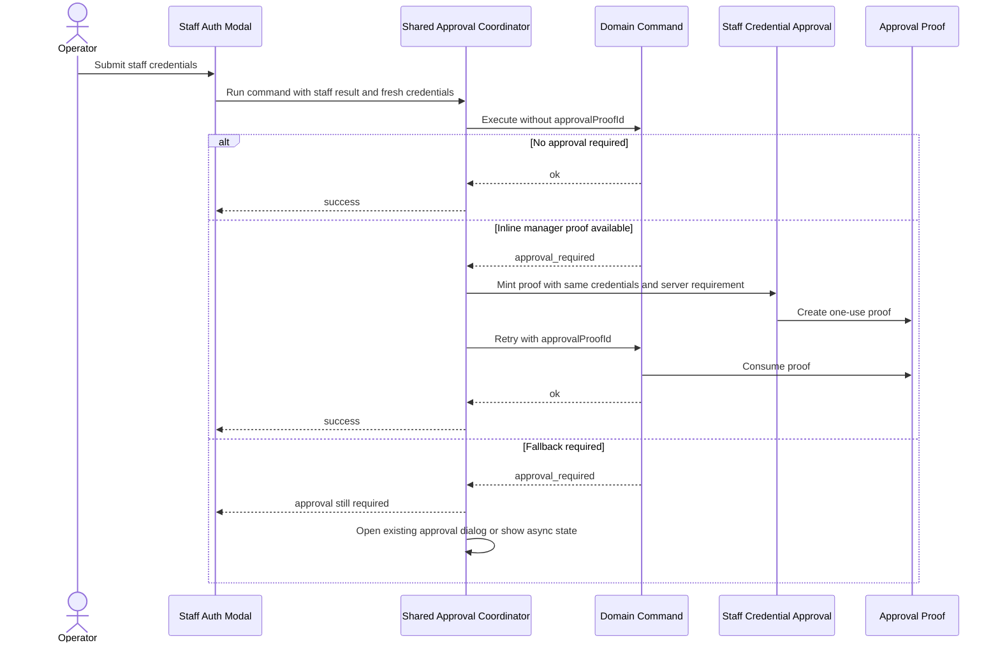

# feat: Add manager approval fast path

## Summary

Add a shared one-modal manager approval fast path on top of the first-class command approval foundation. Transaction payment-method correction, POS register closeout, and cash-controls register-session closeout should all run the command first, let the server return the approval requirement, and then use the same fresh staff credential submission to mint an inline manager proof and retry when the returned requirement supports `inline_manager_proof`.

---

## Problem Frame

The approval foundation now gives Athena the right boundary: domain commands decide whether an action requires approval, return a shared `approval_required` result, and consume server-validated approval proofs on retry. The remaining UX gap is that workflows with an initial staff-auth modal can still ask a manager to authenticate twice: once to begin the action, and again in `CommandApprovalDialog` after the command returns `approval_required`.

The register-session detail page already demonstrates the desired one-modal experience, but its fast path is screen-local. This work moves that behavior into the shared operations approval path so all three target workflows use the same pattern without leaking approval policy into screens.

---

## Requirements

- R1. A manager who begins an eligible workflow can complete inline approval in the same staff-auth modal submission when the command returns an `approval_required` result that includes `inline_manager_proof`.
- R2. The command response remains the source of truth for approval action, subject, required role, reason, resolution modes, requester binding, and async request state.
- R3. The client must not trust `staffProfileId` as approval proof. It may use the authenticated staff role only to decide whether to attempt a same-submission proof mint; the server still validates the credential and proof.
- R4. Cashiers and non-manager staff keep the existing approval-required fallback path instead of silently bypassing approval or receiving a fake manager path.
- R5. Transaction payment-method correction, POS register closeout, and register-session detail closeout all consume the shared fast-path coordinator.
- R6. Register-session detail closeout loses its bespoke manager variance fast-path logic while preserving the current one-modal behavior.
- R7. Proof minting must use the fresh credentials submitted in the current modal only; do not store reusable PIN hashes or introduce cross-action credential reuse.
- R8. Approved retries still call the same command with `approvalProofId`; audit events, one-use proof consumption, and register-session workflow traces remain server-owned.
- R9. Failed proof minting or failed approved retry leaves the workflow state intact with actionable operator feedback.
- R10. Existing async approval behavior remains available for requirements that include or require `async_request`.

---

## Scope Boundaries

- Do not change approval thresholds, action keys, proof lifetime, one-use semantics, or manager role definitions.
- Do not build a generic approval policy registry or async command-resume engine.
- Do not migrate unrelated approval workflows beyond the three target workflows.
- Do not redesign the staff-authentication dialog beyond the minimum callback shape needed to expose fresh credentials to the shared coordinator.
- Do not replace `CommandApprovalDialog`; it remains the fallback when same-submission inline approval is unavailable or inappropriate.

---

## Context & Research

### Current Foundation

- `packages/athena-webapp/shared/approvalPolicy.ts` defines `ApprovalRequirement`, resolution modes, subject identity, role, and operator copy.
- `packages/athena-webapp/shared/commandResult.ts` defines the shared `approval_required` result.
- `packages/athena-webapp/convex/operations/approvalProofs.ts` creates and consumes one-use proof records bound to store, action, subject, required role, requester, and expiry.
- `packages/athena-webapp/convex/operations/staffCredentials.ts` authenticates staff credentials and mints approval proofs.
- `packages/athena-webapp/src/components/operations/useApprovedCommand.tsx` already renders `CommandApprovalDialog`, creates a proof, and retries the command after `approval_required`.

### Target Workflows

- `packages/athena-webapp/src/components/pos/transactions/TransactionView.tsx` authenticates staff before payment correction, then may open a second approval dialog.
- `packages/athena-webapp/src/lib/pos/presentation/register/useRegisterViewModel.ts` uses the shared approval runner for closeout, but a manager closeout with variance still goes through a second approval dialog.
- `packages/athena-webapp/src/components/cash-controls/RegisterSessionView.tsx` already has a one-modal manager variance closeout path, but it hand-checks manager/variance state locally before submitting.

### Learnings Applied

- `docs/solutions/logic-errors/athena-command-approval-policy-boundary-2026-05-01.md` establishes that approval UI is presentation only and approved retries must go back through the command.
- `docs/plans/2026-05-02-001-refactor-first-class-command-approval-plan.md` established the shared command approval foundation this work builds on.
- `docs/solutions/logic-errors/athena-pos-ledger-safe-corrections-2026-04-30.md` keeps transaction payment corrections narrow: same amount, one payment, one allocation, no ledger total mutation.

---

## Key Decisions

- **Server-first fast path:** Run the command before minting an approval proof. Only attempt same-submission proof minting after the server returns an approval requirement that supports `inline_manager_proof`.
- **Shared operations coordinator:** Add the fast-path behavior to the shared approval operations layer instead of duplicating manager/variance logic in each workflow.
- **Fresh credential scope:** Pass the same modal submission credentials directly into the coordinator for one immediate proof attempt and retry. Do not persist them.
- **Fallback stays intact:** When the authenticated staff member is not a manager, the proof mint fails, the requirement does not support inline proof, or the retry fails, preserve the existing approval dialog / async review behavior and form state.
- **Observability stays server-owned:** Client changes should not invent workflow traces. Register closeout traces and approval audit events remain emitted by the existing Convex command/proof rails.

---

## High-Level Technical Design

---

## Implementation Units

- U1. **Add shared manager approval fast-path coordinator**

**Goal:** Extend the operations approval layer so a caller with fresh staff credentials can run an approval-aware command, resolve a returned inline manager requirement with those same credentials, and retry through the same command.

**Requirements:** R1, R2, R3, R4, R7, R9, R10

**Files:**
- Modify: `packages/athena-webapp/src/components/operations/useApprovedCommand.tsx`
- Modify or create: `packages/athena-webapp/src/components/operations/useApprovedCommand.test.tsx`
- Modify if needed: `packages/athena-webapp/src/components/operations/StaffAuthenticationDialog.tsx`
- Modify if needed: `packages/athena-webapp/src/components/operations/StaffAuthenticationDialog.test.tsx`

**Approach:**
- Add a method or helper on `useApprovedCommand` that accepts a command executor, fresh `username` / `pinHash`, requester staff profile id, and a caller-supplied `canAttemptInlineManagerProof` boolean from the just-authenticated staff result.
- If the initial command returns `approval_required` and the requirement supports `inline_manager_proof`, call the existing `onAuthenticateForApproval` adapter with the server-returned requirement and same credentials.
- On proof success, retry the same executor with `approvalProofId`.
- On cashier/non-manager staff, unsupported resolution mode, async-only requirement, proof auth failure, or retry failure, preserve current `useApprovedCommand` fallback behavior and error propagation.

**Test scenarios:**
- No-approval command succeeds without proof minting.
- Manager-initiated approval-required command mints proof and retries without rendering the approval dialog.
- Cashier-initiated approval-required command returns/presents the existing approval-required fallback.
- Failed proof minting does not retry and surfaces the credential error.
- Approved retry failure leaves the pending workflow recoverable.

---

- U2. **Migrate transaction payment-method correction**

**Goal:** Make the transaction payment update workflow use the shared one-modal fast path when a manager begins the correction.

**Requirements:** R1, R2, R3, R4, R5, R7, R8, R9

**Dependencies:** U1

**Files:**
- Modify: `packages/athena-webapp/src/components/pos/transactions/TransactionView.tsx`
- Modify: `packages/athena-webapp/src/components/pos/transactions/TransactionView.test.tsx`
- Verify: `packages/athena-webapp/convex/pos/application/correctTransactionPaymentMethod.test.ts`

**Approach:**
- Keep the existing staff authentication entry point for payment corrections.
- Pass the fresh credentials and authenticated staff identity into the shared fast-path coordinator.
- Remove per-screen second-step assumptions from the payment update path while preserving the `CommandApprovalDialog` fallback for cashier or async approval paths.

**Test scenarios:**
- Manager updates payment method in one modal submission and no second approval dialog appears.
- Cashier-initiated update still reaches approval-required fallback.
- Unsupported payment correction cases remain blocked by the server.
- Failed approved retry keeps the correction modal state.

---

- U3. **Migrate POS register closeout**

**Goal:** Make closeout from the POS register page use the shared fast path when the active operator is a manager and variance approval is required.

**Requirements:** R1, R2, R3, R4, R5, R8, R9, R10

**Dependencies:** U1

**Files:**
- Modify: `packages/athena-webapp/src/lib/pos/presentation/register/useRegisterViewModel.ts`
- Modify: `packages/athena-webapp/src/lib/pos/presentation/register/useRegisterViewModel.test.ts`
- Modify if needed: `packages/athena-webapp/src/components/pos/register/POSRegisterView.tsx`
- Modify if needed: `packages/athena-webapp/src/components/pos/register/POSRegisterView.test.tsx`
- Verify: `packages/athena-webapp/convex/cashControls/closeouts.test.ts`

**Approach:**
- Keep notes-required validation as a local ergonomics check.
- Submit closeout through the shared coordinator with current staff credentials when the closeout modal has them available.
- Preserve async approval request behavior and closeout-blocked UI for cashier or review-required paths.

**Test scenarios:**
- Manager closes a variance session through one closeout modal flow.
- Cashier variance closeout creates/presents review-required state without inline bypass.
- No-variance closeout does not mint an approval proof.
- Failed proof or retry preserves counted cash and notes.

---

- U4. **Converge register-session detail closeout on the shared path**

**Goal:** Remove the bespoke manager variance fast path from `RegisterSessionView` and preserve the same one-modal behavior through the shared coordinator.

**Requirements:** R1, R2, R3, R5, R6, R7, R8, R9

**Dependencies:** U1

**Files:**
- Modify: `packages/athena-webapp/src/components/cash-controls/RegisterSessionView.tsx`
- Modify: `packages/athena-webapp/src/components/cash-controls/RegisterSessionView.test.tsx`
- Modify: `packages/athena-webapp/src/components/cash-controls/RegisterSessionView.auth.test.tsx`
- Verify: `packages/athena-webapp/convex/cashControls/closeouts.test.ts`

**Approach:**
- Stop hand-checking manager + variance before submit.
- Let submit receive `approval_required`, then have the shared coordinator decide whether the same credential submission can mint an inline proof.
- Keep existing success/error copy and register-session trace behavior.

**Test scenarios:**
- Current manager variance one-modal behavior still passes.
- Manager no-variance closeout does not mint a proof.
- Cashier variance closeout falls back to review-required behavior.
- Proof mint or approved retry failure keeps form state.

---

- U5. **Refresh docs, graph, and validation**

**Goal:** Keep repository sensors and implementation knowledge current after approval fast-path migration.

**Requirements:** R5, R8, R10

**Dependencies:** U1, U2, U3, U4

**Files:**
- Modify or create: `docs/solutions/logic-errors/athena-command-approval-manager-fast-path-2026-05-02.md`
- Regenerate: `graphify-out/*`
- Regenerate only if signatures drift: `packages/athena-webapp/convex/_generated/api.d.ts`

**Approach:**
- Document the server-first one-modal approval pattern as a reusable solution.
- Run graph rebuild after code changes.
- Run targeted approval/POS/cash-controls tests before broad repo validation.

**Expected sensors:**
- `bun run --filter '@athena/webapp' test -- src/components/operations/useApprovedCommand.test.tsx src/components/pos/transactions/TransactionView.test.tsx src/lib/pos/presentation/register/useRegisterViewModel.test.ts src/components/cash-controls/RegisterSessionView.test.tsx src/components/cash-controls/RegisterSessionView.auth.test.tsx`
- `bun run --filter '@athena/webapp' test -- convex/cashControls/closeouts.test.ts convex/pos/application/correctTransactionPaymentMethod.test.ts convex/operations/staffCredentials.test.ts convex/operations/approvalProofs.test.ts`
- `bun run audit:convex`
- `bun run graphify:rebuild`
- `bun run typecheck`
- `bun run build`
- `bun run pre-push:review`

---

## Ticket Breakdown

- Ticket 1: Add shared manager approval fast-path coordinator.
- Ticket 2: Migrate transaction payment-method correction to the shared fast path.
- Ticket 3: Migrate POS register closeout to the shared fast path.
- Ticket 4: Converge register-session detail closeout on the shared fast path.
- Ticket 5: Refresh approval fast-path docs, graph, and validation.

This is a coordinated integration batch. Ticket 1 is the shared dependency; tickets 2, 3, and 4 can be implemented in parallel once the coordinator contract is stable; ticket 5 closes the batch after behavior is migrated.
