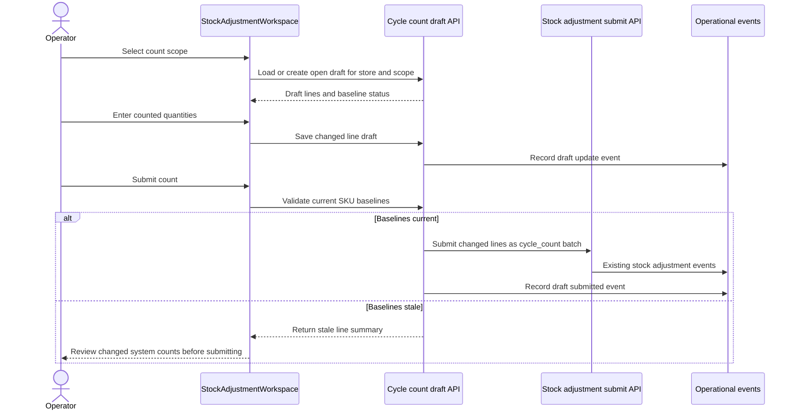

# feat: Persist cycle count drafts

## Summary

Persist in-progress cycle counts as store-scoped stock-ops drafts so an operator can leave the stock adjustment workspace, return later, and continue from the same counted quantities without silently losing work. The existing stock-adjustment batch submit path remains the inventory mutation and approval boundary.

## Problem Frame

The cycle count workflow currently stores counted quantities in local React state inside `StockAdjustmentWorkspaceContent`. That state is initialized from `listInventorySnapshot`, reset whenever the inventory snapshot changes, and discarded when the operator navigates away from the operations workspace. This makes the workspace fragile for real cycle counts, where operators may inspect products, switch workspaces, or pause before submission.

The repo already has the right durable rails for the final operation: `submitStockAdjustmentBatch` normalizes line items, applies inventory movements, creates approval requests when needed, records operational events, and writes operational work items for review. The gap is earlier in the lifecycle: the operator's working count needs to survive before it becomes a stock adjustment batch.

## Requirements

- R1. Preserve cycle count inputs across route changes, workspace remounts, inventory snapshot refetches, and browser refreshes.
- R2. Reuse the active draft for the selected store and count scope instead of creating duplicate open drafts for the same operator workflow.
- R3. Keep URL state focused on navigation context: selected scope, active SKU, page, search query, and filters. Counted quantities must not live in the URL.
- R4. Submit only changed valid count lines through the existing `submitStockAdjustmentBatch` path so inventory movements, approvals, work items, and operational events remain server-owned.
- R5. Detect stale draft baselines when the current SKU inventory no longer matches the system quantity captured when the count started.
- R6. Give the operator clear draft state: saved changes, changed row count, stale baseline warnings, and an explicit discard action.
- R7. Keep manual stock adjustments out of this draft workflow unless a later plan intentionally broadens the model.
- R8. Prevent cross-store and cross-organization draft access or mutation.

## Scope Boundaries

- Do not change stock adjustment approval thresholds, inventory movement rules, or the approval queue flow.
- Do not persist manual stock adjustment deltas in this work.
- Do not introduce offline-first local storage as the source of truth.
- Do not redesign the stock adjustment workspace beyond the draft lifecycle controls needed to make cycle counts durable.
- Do not create workflow traces unless a later implementation finds an existing stock-ops trace lifecycle to extend. Use operational events for durable audit.

## Context & Research

### Existing Stock-ops Flow

- `packages/athena-webapp/convex/stockOps/adjustments.ts` owns inventory snapshot loading and stock adjustment submission.
- `submitStockAdjustmentBatchWithCtx` already enforces authentication, role checks, duplicate SKU prevention, store ownership, idempotent `submissionKey` handling, approval thresholds, inventory movement recording, operational work item creation, and operational event recording.
- `StockAdjustmentWorkspaceContent` builds `cycleCounts` from `inventoryItems` and resets those counts in a `useEffect` tied to the inventory snapshot. That is the immediate discard point.
- `OperationsQueueView` already sits at the data boundary for stock adjustments and can pass Convex query/mutation results into the workspace.

### Existing Durable Patterns

- `stockAdjustmentBatch` captures submitted line items with `systemQuantity`, `countedQuantity`, and `quantityDelta`.
- `operationalEvent` is the existing audit rail for stock-adjustment applied, approval requested, approved, rejected, and cancelled events.
- `inventoryMovement` is recorded only when inventory actually changes; drafts should not write movements.
- `approvalRequest` and `operationalWorkItem` should remain downstream of submission, not draft editing.

### Learnings Applied

- `docs/solutions/logic-errors/athena-pos-ledger-safe-corrections-2026-04-30.md` reinforces keeping inventory-affecting mutations on explicit domain-command rails instead of allowing UI edits to imply inventory changes.
- `docs/product-copy-tone.md` applies to draft and stale-state copy: keep operator-facing language calm, concrete, and operational.

## Key Decisions

- **Drafts are durable Convex records, not URL or component state.** The URL remains useful for navigation, but counted quantities need store-scoped persistence and server-side ownership checks.
- **One open draft per store/scope/workflow owner.** The first implementation should avoid duplicate active drafts for the same store and count scope. If the repo already has a staff profile in the workflow context at implementation time, owner identity can be staff-scoped; otherwise start with the authenticated Athena user and store/scope identity.
- **Capture baselines per line.** Each draft line stores the system count and available count observed when the operator first edits or starts the draft. Submission compares those baselines against current SKU state before applying the existing batch path.
- **Submit through existing stock adjustment batches.** Draft submission should convert valid changed lines into the existing `submitStockAdjustmentBatch` command shape. The command remains the only surface that writes inventory movements or approval requests.
- **Operational events audit draft lifecycle.** Draft created, updated, discarded, and submitted events should use `operationalEvent` with subject type `cycle_count_draft`; final inventory impact remains audited by the stock adjustment batch and inventory movement records.

## High-Level Technical Design

## Implementation Units

- U1. **Add cycle count draft schema and indexes**

**Goal:** Introduce durable storage for one open cycle-count draft and its line-level counted quantities.

**Requirements:** R1, R2, R5, R8

**Files:**
- Modify: `packages/athena-webapp/convex/schema.ts`
- Create: `packages/athena-webapp/convex/schemas/stockOps/cycleCountDraft.ts`
- Modify: `packages/athena-webapp/convex/schemas/stockOps/index.ts`
- Add or modify tests: `packages/athena-webapp/convex/operations/operationsQueryIndexes.test.ts`

**Approach:**
- Add a `cycleCountDraft` table with store, organization, scope key, status, owner identity, timestamps, optional notes, submission linkage, stale status, and summary counts.
- Add a `cycleCountDraftLine` table with draft id, product SKU id, baseline inventory count, baseline available count, current counted quantity, dirty state, timestamps, and optional stale status.
- Index drafts by store/status/scope and draft lines by draft id and draft id/product SKU id.
- Keep schema names stock-ops-specific so the workflow can grow without overloading submitted `stockAdjustmentBatch` records.

**Test scenarios:**
- Index tests include the new draft and line lookup paths.
- Schema allows open/submitted/discarded states without requiring a stock adjustment batch before submission.
- Line records can represent unchanged, changed, and stale-baseline states.

- U2. **Add Convex draft query and mutations**

**Goal:** Provide server-owned load, save, discard, and submit operations for cycle-count drafts.

**Requirements:** R1, R2, R4, R5, R6, R8

**Dependencies:** U1

**Files:**
- Create or modify: `packages/athena-webapp/convex/stockOps/cycleCountDrafts.ts`
- Modify if sharing helpers: `packages/athena-webapp/convex/stockOps/adjustments.ts`
- Add tests: `packages/athena-webapp/convex/stockOps/cycleCountDrafts.test.ts`

**Approach:**
- Add `getOrCreateCycleCountDraft` for a store and scope key, with authentication and organization role checks matching stock adjustment permissions.
- Add a save-line mutation that validates SKU/store ownership, captures baseline counts when creating a line, updates counted quantity, and updates draft summaries.
- Add a discard mutation that marks the draft discarded and records an operational event.
- Add a submit mutation that compares stored baselines with current SKU state, returns stale line detail when any changed line is stale, and otherwise delegates to the existing stock adjustment submit path with `adjustmentType: "cycle_count"`.
- Keep idempotency explicit for submit, using a submission key that survives retries for the draft.

**Test scenarios:**
- Loading a scope reuses the existing open draft instead of inserting a duplicate.
- Saving a count line persists the counted quantity and baseline counts for the right store.
- Cross-store SKU mutation is rejected.
- Discard marks the draft inactive without touching inventory.
- Submit with current baselines creates or returns a stock adjustment batch through the existing path.
- Submit with stale baselines returns a user-facing stale result and does not create a stock adjustment batch.
- Operational events are recorded for created, updated, discarded, and submitted lifecycle transitions.

- U3. **Wire OperationsQueueView to draft data**

**Goal:** Move the stock adjustment workspace data boundary from local-only draft state to Convex-backed draft state.

**Requirements:** R1, R2, R3, R6

**Dependencies:** U2

**Files:**
- Modify: `packages/athena-webapp/src/components/operations/OperationsQueueView.tsx`
- Modify or create tests: `packages/athena-webapp/src/components/operations/OperationsQueueView.test.tsx`
- Verify route integration: `packages/athena-webapp/src/routes/_authed/$orgUrlSlug/store/$storeUrlSlug/operations/stock-adjustments.tsx`

**Approach:**
- Load the active cycle-count draft for the selected store and scope when the workspace is in cycle-count mode.
- Pass draft lines, draft status, save/discard/submit handlers, and save pending state into `StockAdjustmentWorkspaceContent`.
- Preserve existing URL search state handling for scope, SKU, page, query, and filters.
- Avoid loading or saving draft state for manual adjustment mode.

**Test scenarios:**
- Selecting a scope requests the matching draft without clearing URL navigation state.
- Switching to manual mode does not load or mutate cycle-count draft records.
- A route remount with the same scope rehydrates from the draft props rather than initial inventory counts.

- U4. **Hydrate and save cycle-count inputs in the workspace**

**Goal:** Make the visible count inputs reflect persisted draft lines and save operator edits without resetting pagination or active SKU state.

**Requirements:** R1, R3, R6

**Dependencies:** U3

**Files:**
- Modify: `packages/athena-webapp/src/components/operations/StockAdjustmentWorkspace.tsx`
- Modify: `packages/athena-webapp/src/components/operations/StockAdjustmentWorkspace.test.tsx`

**Approach:**
- Replace the cycle-count-only local `cycleCounts` source with hydrated draft line values layered over the inventory snapshot.
- Save edits on a deliberate low-noise boundary such as blur or debounced change; keep local input responsiveness while the mutation is in flight.
- Do not reset table pagination, selected SKU, or active filters when a save completes.
- Keep reset-to-system-count behavior, but persist the reset so the draft no longer reports that line as changed.

**Test scenarios:**
- A saved draft line appears after remount instead of resetting to the current system count.
- Editing a count saves the line and leaves pagination and selected SKU unchanged.
- Resetting an edited count persists the cleared draft line state.
- Draft hydration does not affect manual stock adjustment mode.

- U5. **Surface draft lifecycle and stale baseline states**

**Goal:** Orient the operator around what has been saved, what needs attention, and what can be discarded before final submission.

**Requirements:** R5, R6

**Dependencies:** U2, U4

**Files:**
- Modify: `packages/athena-webapp/src/components/operations/StockAdjustmentWorkspace.tsx`
- Modify: `packages/athena-webapp/src/components/operations/StockAdjustmentWorkspace.test.tsx`
- Review copy against: `docs/product-copy-tone.md`

**Approach:**
- Add restrained draft status copy near the batch summary: saved state, changed row count, last saved timestamp when available, and a discard action.
- When the server reports stale baseline lines, show a blocking review state that names affected SKUs and current counts without submitting.
- Keep draft status secondary to the inventory-state header so the first read remains the state of store inventory.

**Test scenarios:**
- Draft save state and changed row count render when the draft has changes.
- Discard asks for a deliberate action and then clears draft changes from the UI.
- Stale baseline submission renders the stale warning and does not show a success/applied state.
- Operator copy stays product-facing and does not expose raw backend messages.

- U6. **Refresh repo docs and solution learning after implementation**

**Goal:** Keep the repo honest that cycle-count work is now durable and document the pattern for future operational drafts.

**Requirements:** R1, R6

**Dependencies:** U1, U2, U3, U4, U5

**Files:**
- Create: `docs/solutions/logic-errors/athena-cycle-count-drafts-2026-05-04.md`
- Modify if applicable: `docs/product-copy-tone.md`
- Regenerate: `graphify-out/GRAPH_REPORT.md`
- Regenerate: `graphify-out/graph.json`
- Regenerate: `graphify-out/wiki/index.md`

**Approach:**
- Capture the bug pattern: local workspace state is not a durable draft for operator workflows.
- Name the reusable design: URL owns navigation, Convex draft owns work-in-progress inputs, stock adjustment batch owns inventory mutation.
- Rebuild graphify after code changes so generated repo knowledge matches the new schema/API.

**Test scenarios:**
- Solution note points to the durable draft boundary and the existing submit boundary.
- `bun run graphify:rebuild` completes and regenerated graph outputs are included with the integration change.

## Validation Plan

- `bun run --cwd packages/athena-webapp test convex/stockOps/cycleCountDrafts.test.ts`
- `bun run --cwd packages/athena-webapp test src/components/operations/StockAdjustmentWorkspace.test.tsx`
- `bun run --cwd packages/athena-webapp test src/components/operations/OperationsQueueView.test.tsx`
- `bun run --cwd packages/athena-webapp test convex/operations/operationsQueryIndexes.test.ts`
- `bun run --cwd packages/athena-webapp typecheck`
- `bun run graphify:rebuild`

## Dependencies & Sequencing

1. U1 must land before any Convex draft API or UI wiring.
2. U2 should land with backend tests before UI starts depending on draft contracts.
3. U3 and U4 can be developed together after U2, but U4 should preserve the existing URL-state behavior already covered by workspace tests.
4. U5 depends on U2's stale-result contract and U4's hydration behavior.
5. U6 should land with the final integration branch so generated graph artifacts churn once.

## Risks & Mitigations

- **Duplicate active drafts:** Use a store/status/scope/owner lookup and return the existing open draft before inserting.
- **Silent stale counts:** Store baseline counts and block submit when current SKU counts differ from the changed draft lines.
- **Autosave noise:** Save on blur or debounce, and report pending/saved status without replacing the operator's local input while they type.
- **Cross-store mutation:** Every draft query and mutation validates the active store, organization membership, and SKU store ownership.
- **Generated artifact churn:** Keep implementation tickets atomic but plan a single integration PR for schema/API/UI work because graphify output will be regenerated.

## Deferred Follow-Up Work

- Manual stock adjustment drafts.
- Staff-profile-specific ownership if the first implementation uses Athena user identity because staff context is not available at the route boundary.
- Multi-operator collaborative count review.
- Expiration or cleanup automation for abandoned old drafts.
