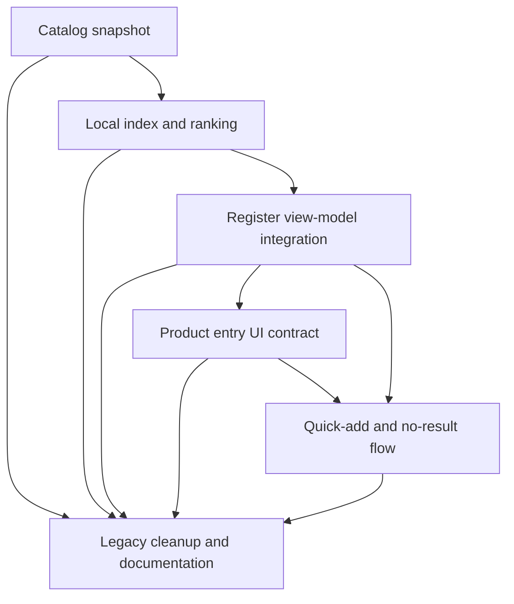
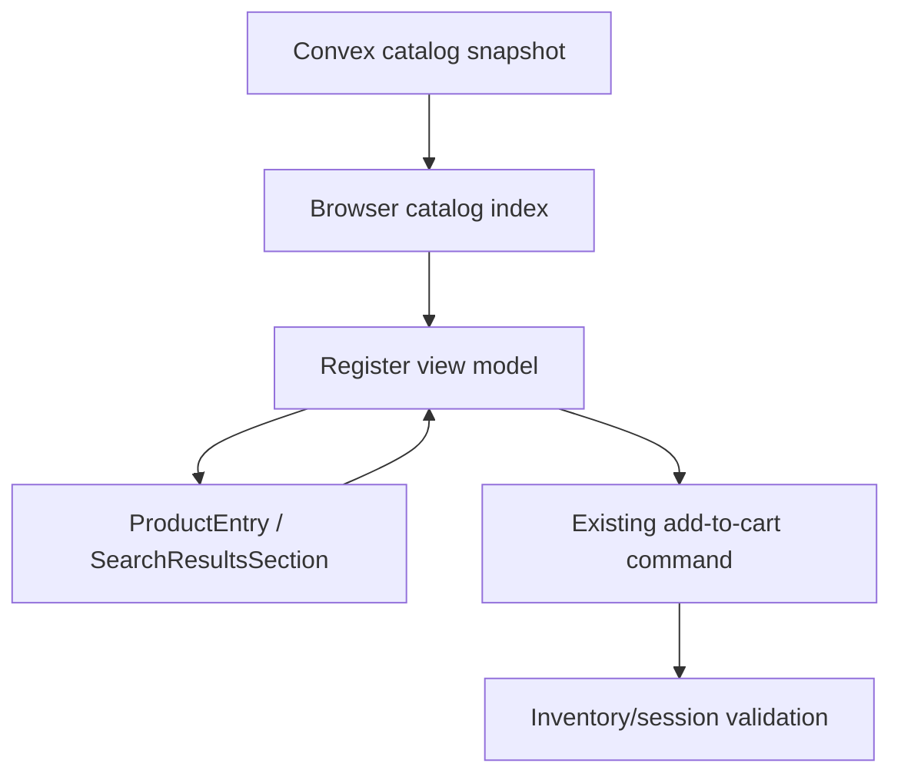

# Refactor POS Register Catalog Search

## Summary

Rebuild active POS register product search around a compact store catalog snapshot and browser-local index. Exact identifiers resolve synchronously, human text search ranks local results, and the existing add-to-cart command remains the authoritative inventory/session validation boundary.

## Problem Frame

The POS register product search path is a heavy-traffic workflow, but its current implementation pays avoidable latency on every lookup. The active register splits search across generic product search, barcode lookup, and product-id lookup, then layers debounce and auto-add timers on top of server round trips. That shape is especially expensive for barcode scans and exact SKU lookups, where the operator expects the register to resolve the product immediately.

Backward compatibility with the current active-register search internals is not a constraint. The target foundation is a single fast search pipeline for the POS register: load a compact catalog snapshot for the active store, build a browser-local index, resolve exact identifiers synchronously, and keep the add-to-cart command as the server-side source of truth for inventory, session, drawer, and authorization validation.

## Scope

In scope:

- Active POS register product lookup in `packages/athena-webapp/src/components/pos/register/POSRegisterView.tsx`.
- Product entry behavior in `packages/athena-webapp/src/components/pos/ProductEntry.tsx` and `packages/athena-webapp/src/components/pos/SearchResultsSection.tsx`.
- Register view-model search and scanner behavior in `packages/athena-webapp/src/lib/pos/presentation/register/useRegisterViewModel.ts`.
- Compact POS catalog read model exposed through `packages/athena-webapp/convex/pos/public/catalog.ts`.
- Local search intent parsing, exact lookup, ranking, and tests.
- Quick-add/no-result behavior after local search settles.

Out of scope:

- Storefront search and catalog-management search.
- External search services.
- Reworking the final add-to-cart command, transaction completion, or inventory mutation model.
- Expense-register search parity, except where shared hooks need to remain intact for existing expense behavior.

## Requirements

- R1. Product search in the active POS register uses one search state instead of competing generic, barcode, and product-id query paths.
- R2. Exact identifiers, including barcode, SKU, product SKU id, and product URL input, resolve before human text search.
- R3. Barcode scans and Enter on an exact single in-stock match add the item without waiting for the current debounce and auto-add delay chain.
- R4. Human text search returns ranked local results without a server request for each keystroke.
- R5. Out-of-stock or ambiguous exact matches surface clear results and do not auto-add.
- R6. Quick-add/no-result affordances continue to work, but they are driven by stable local search state rather than a delayed server query.
- R7. The add-to-cart command remains authoritative for durable state, including inventory availability, register session, drawer/staff gates, and trace behavior.
- R8. Tests characterize the old high-latency path before replacement where useful, then lock the new exact-match and text-search behavior.

## Current Code Findings

- `packages/athena-webapp/src/components/pos/ProductEntry.tsx` debounces `productSearchQuery` with `POS_SEARCH_DEBOUNCE_MS` and calls `usePOSProductSearch`.
- `packages/athena-webapp/src/lib/pos/presentation/register/useRegisterViewModel.ts` extracts barcode/product ids, debounces the extracted value, calls `usePOSProductIdSearch` and `usePOSBarcodeSearch`, then schedules auto-add through `POS_AUTO_ADD_DELAY_MS`.
- `packages/athena-webapp/src/hooks/useProductSearchResults.ts` merges product-id, barcode, and generic search results after the work has already been requested.
- `packages/athena-webapp/convex/pos/infrastructure/repositories/catalogRepository.ts` has exact indexed barcode and SKU lookups, but `listMatchingStoreSkus` scans all store SKUs and fetches product records while filtering in application code.
- `packages/athena-webapp/convex/schema.ts` already has `productSku` indexes for `by_storeId_barcode` and `by_storeId_sku`; the missing foundation is a compact register-oriented read model and a local index, not another per-keystroke query.

## Technical Direction

Build a POS register catalog snapshot query that returns compact SKU rows for the active store. The browser builds a register-local index from those rows:

- `barcode -> catalog row`
- `sku -> catalog row`
- `productSkuId -> catalog row`
- `productId -> catalog rows`
- tokenized searchable text for name, SKU, barcode, category, color, size, length, and short descriptors

The register view-model owns a single search result state:

```ts
type RegisterCatalogSearchState =
  | { intent: "empty"; results: [] }
  | { intent: "exact"; results: RegisterCatalogRow[]; exactMatch: RegisterCatalogRow | null }
  | { intent: "text"; results: RegisterCatalogRow[] }
  | { intent: "loading"; results: [] };
```

This shape is directional, not a required implementation signature. The important decision is that exact identifier handling and text search share one state contract before UI rendering and add behavior.

## Dependency Graph



## Implementation Units

### U1. **Add a Compact Register Catalog Snapshot**

**Outcome:** The POS register can subscribe to one compact store catalog payload instead of asking Convex to search on every input change.

**Requirements:** R1, R2, R4, R5.

**Dependencies:** None.

**Files:**

- `packages/athena-webapp/convex/pos/application/queries/listRegisterCatalog.ts`
- `packages/athena-webapp/convex/pos/public/catalog.ts`
- `packages/athena-webapp/src/lib/pos/application/dto.ts`
- `packages/athena-webapp/src/lib/pos/application/ports.ts`
- `packages/athena-webapp/src/lib/pos/infrastructure/convex/catalogGateway.ts`

**Tests:**

- Add `packages/athena-webapp/convex/pos/application/queries/listRegisterCatalog.test.ts`.
- Cover store scoping, compact field shape, SKU/barcode/product identity fields, inventory availability fields, and exclusion of other stores.
- Cover out-of-stock rows remaining visible so the UI can explain why an exact match cannot be added.

**Execution posture:** test-first.

**Observability / audit:** None -- this is a read-only query.

**Verification:** The snapshot query returns a store-scoped catalog payload that is compact, complete enough for register search, and safe for out-of-stock exact-match explanation.

### U2. **Build the Browser-Local Catalog Index**

**Outcome:** Search intent classification, exact matching, and ranked human text search become deterministic pure functions that are easy to test.

**Requirements:** R1, R2, R4, R5.

**Dependencies:** U1.

**Files:**

- `packages/athena-webapp/src/lib/pos/presentation/register/catalogSearch.ts`
- `packages/athena-webapp/src/lib/pos/presentation/register/useRegisterCatalogIndex.ts`

**Tests:**

- Add `packages/athena-webapp/src/lib/pos/presentation/register/catalogSearch.test.ts`.
- Cover barcode exact match, SKU exact match, product URL/product-id extraction, product id with multiple variants, human text token ranking, case/punctuation normalization, no-results, and out-of-stock exact matches.

**Execution posture:** test-first.

**Observability / audit:** None -- pure client-side classification and ranking.

**Verification:** Local search can answer identifier and text queries from the snapshot without invoking a Convex search query.

### U3. **Replace Active Register Lookup in the View Model**

**Outcome:** `useRegisterViewModel` uses the catalog index as the single search source for active POS product lookup and removes the active-register dependency on `usePOSProductSearch`, `usePOSBarcodeSearch`, and `usePOSProductIdSearch`.

**Requirements:** R1, R2, R3, R5, R7, R8.

**Dependencies:** U1, U2.

**Files:**

- `packages/athena-webapp/src/lib/pos/presentation/register/useRegisterViewModel.ts`
- `packages/athena-webapp/src/lib/pos/presentation/register/useRegisterViewModel.test.ts`
- `packages/athena-webapp/src/lib/pos/constants.ts`

**Tests:**

- Characterize the current double-submit or delayed-submit behavior before replacing it when that protects against regressions.
- Cover barcode scan exact match adding once without `POS_SEARCH_DEBOUNCE_MS + POS_AUTO_ADD_DELAY_MS`.
- Cover Enter on an exact in-stock identifier adding once.
- Cover out-of-stock exact match surfacing a result without calling add.
- Cover multiple variants for one product id showing options instead of auto-adding.
- Cover existing drawer, staff, and session gates still preventing add through the existing command path.

**Execution posture:** characterization-first for the current input/submit behavior, then test-first for the replacement.

**Observability / audit:** Reuse existing POS add-item command/session trace behavior. The ticket changes when the existing mutation is called, not the durable mutation contract.

**Verification:** Scanner and Enter flows add exactly once through the existing add command, while ambiguous or unavailable matches remain visible and non-mutating.

### U4. **Simplify Product Entry and Search Results UI Contract**

**Outcome:** `ProductEntry` and `SearchResultsSection` consume the view-model search state directly instead of running their own generic product search query and merging competing result sources.

**Requirements:** R1, R4, R5.

**Dependencies:** U2, U3.

**Files:**

- `packages/athena-webapp/src/components/pos/ProductEntry.tsx`
- `packages/athena-webapp/src/components/pos/SearchResultsSection.tsx`
- `packages/athena-webapp/src/components/pos/SearchResultsSection.test.tsx`
- `packages/athena-webapp/src/components/pos/register/POSRegisterView.tsx`
- `packages/athena-webapp/src/components/pos/register/POSRegisterView.test.tsx`

**Tests:**

- Cover loading/ready/no-results display from the local catalog state.
- Cover exact-match result rendering and text-search result rendering.
- Cover Cmd/Ctrl+K focus behavior still targeting product search.
- Cover disabled product search state continuity when the register cannot accept search.

**Execution posture:** test-first.

**Observability / audit:** None -- presentation-only behavior around a state contract.

**Verification:** The register UI renders one coherent search state and no longer starts a separate generic product search from `ProductEntry`.

### U5. **Re-anchor Quick-Add and No-Result Behavior on Local Search**

**Outcome:** Quick-add remains available for unresolved product input, but no-results and quick-add prompts are based on local search readiness rather than delayed server-search completion.

**Requirements:** R6, R7.

**Dependencies:** U2, U3, U4.

**Files:**

- `packages/athena-webapp/src/components/pos/ProductEntry.tsx`
- `packages/athena-webapp/src/components/pos/SearchResultsSection.tsx`
- `packages/athena-webapp/convex/pos/application/commands/quickAddCatalogItem.ts`
- `packages/athena-webapp/convex/pos/application/commands/quickAddCatalogItem.test.ts`

**Tests:**

- Cover no-results prompt after the local catalog is ready and the query has no matches.
- Cover quick-add creating a product/SKU through the existing command path.
- Cover duplicate barcode prevention still coming from the existing backend command.
- Cover quick-add success making the new SKU discoverable through the refreshed catalog snapshot.

**Execution posture:** test-first.

**Observability / audit:** Reuse existing quick-add command behavior. If the current quick-add command lacks an audit or trace rail for product/SKU creation, capture that as a compounding follow-up rather than inventing one inside this search refactor.

**Verification:** No-results and quick-add behavior remains operator-usable after local search replaces server-search loading state.

### U6. **Retire the Old Active-Register Search Path and Document the New Standing**

**Outcome:** Active POS register code no longer pays for unused search hooks, and the repo documents the local-index register-search foundation.

**Requirements:** R1, R4, R8.

**Dependencies:** U1, U2, U3, U4, U5.

**Files:**

- `packages/athena-webapp/src/hooks/usePOSProducts.ts`
- `packages/athena-webapp/src/lib/pos/infrastructure/convex/catalogGateway.ts`
- `packages/athena-webapp/src/lib/pos/presentation/expense/useExpenseRegisterViewModel.ts`
- `docs/solutions/`

**Tests:**

- Keep or adjust expense-register tests if expense still uses legacy hooks.
- Add a focused regression that active `POSRegisterView` does not call generic per-keystroke POS search for product lookup.
- Run graph rebuild after code changes so `graphify-out/` reflects the new dependency shape.

**Execution posture:** sensor-only for documentation and generated artifacts; test-first for any behavior-bearing cleanup.

**Observability / audit:** None -- cleanup and documentation do not mutate durable state.

**Verification:** Active POS register tests prove per-keystroke search hooks are not used for register lookup, while non-register consumers either keep their old hooks or receive explicit follow-up scope.

## System-Wide Impact



- Frontend state moves from query-driven search to snapshot-driven search. The implementation must handle catalog-not-ready state explicitly.
- Backend search load should drop for active registers because typing no longer calls the generic search query.
- Inventory correctness stays server-side because adding still goes through the existing POS session command.
- Expense-register search should not be silently rewritten unless the shared hook cleanup requires it; if it still uses old hooks, preserve its tests.

## Risks and Mitigations

| Risk | Mitigation |
|---|---|
| Catalog snapshot is too large for some stores | Keep the snapshot compact, cap nonessential fields, and measure before adding more data. |
| Local availability is stale | Treat local availability as display and preflight only; existing add command remains authoritative. |
| Scanner events add duplicates | Add in-flight and query identity tests around exact-match add behavior. |
| Product id maps to multiple variants | Show variants instead of auto-adding. |
| Quick-add prompt appears too aggressively | Gate no-results on catalog readiness and stable local search state. |
| Expense workflow still depends on old hooks | Preserve old hooks for non-register surfaces until a separate parity refactor is planned. |

## Alternative Approaches Considered

| Approach | Decision | Rationale |
|---|---|---|
| Tune debounce and auto-add timers | Rejected | It reduces some delay but preserves the competing query architecture and server round trips on typing. |
| Add more Convex indexes for text search | Rejected for this pass | Exact lookup already has useful indexes, while human text search still needs ranking and UI-state coherence in the register. |
| Use an external search service | Rejected | The register needs low-latency store-local lookup and server-side add validation, not a new operational dependency. |
| Build a register-local catalog index | Chosen | It removes per-keystroke server search from the hot path while preserving the server command as the source of truth. |

## Success Metrics

- Exact barcode/SKU/product-id lookup resolves from the local index without waiting for `POS_SEARCH_DEBOUNCE_MS`.
- Barcode scan and Enter on an exact in-stock match call the add command once.
- Human text search does not invoke generic POS product search on each keystroke in the active register.
- No-results and quick-add affordances are based on catalog readiness and stable local search state.
- Existing POS add-item validation remains the only durable inventory/session mutation boundary.

## Expected Sensors

- `bun run --filter '@athena/webapp' test packages/athena-webapp/src/lib/pos/presentation/register/catalogSearch.test.ts`
- `bun run --filter '@athena/webapp' test packages/athena-webapp/src/lib/pos/presentation/register/useRegisterViewModel.test.ts`
- `bun run --filter '@athena/webapp' test packages/athena-webapp/src/components/pos/SearchResultsSection.test.tsx`
- `bun run --filter '@athena/webapp' test packages/athena-webapp/src/components/pos/register/POSRegisterView.test.tsx`
- `bun run --filter '@athena/webapp' test packages/athena-webapp/convex/pos/application/queries/listRegisterCatalog.test.ts`
- `bun run --filter '@athena/webapp' typecheck`
- `bun run graphify:rebuild`
- `bun run pre-push:review`

## Integration Strategy

Units 1 and 2 can start in parallel. Unit 3 should wait for the snapshot and local index contracts. Units 4 and 5 should land after the view-model search state is stable. Unit 6 should be the final cleanup and documentation pass.

Because several units will touch POS register surfaces and generated graph artifacts, the Linear tickets should stay separate but can land through one coordinated integration PR after parallel implementation work.

## Assumptions

- The active POS register is the primary optimization target; expense-register parity is intentionally deferred unless shared code makes it unavoidable.
- It is acceptable to remove or bypass old active-register search behavior instead of preserving hook-level compatibility.
- The store catalog is small enough today for a compact snapshot approach, and the implementation will preserve an escape hatch to paginate or narrow the snapshot if measurement proves otherwise.
- External organizational context was not requested, so this plan is grounded in repo code, existing POS learnings, and the current browser workflow.
