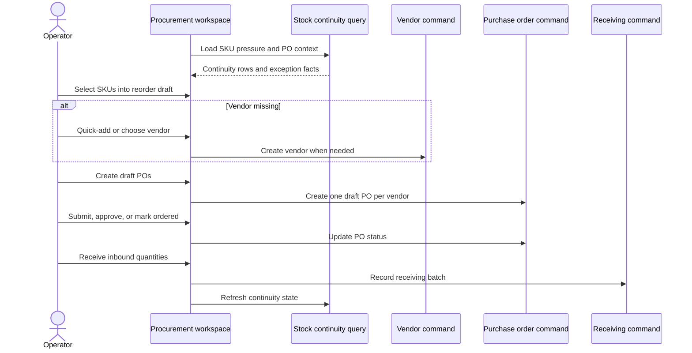

# Build Procurement Stock Continuity Workspace

## Summary

Turn procurement into a SKU-pressure-first stock continuity workspace. The implementation should let operators move from exposed SKU pressure to vendor-backed draft POs, advance purchase orders through their lifecycle, monitor inbound cover, receive stock, and see automatically generated exceptions without leaving the procurement context.

## Problem Frame

The current procurement workspace is a planning and visibility surface. It lists replenishment recommendations, active vendors, and purchase orders, and the backend already has purchase-order, vendor, replenishment, and receiving primitives. The gap is that the workspace does not yet act like a daily command surface: operators cannot select SKU pressure into reorder drafts, resolve missing vendors inline, create draft POs from pressure, advance POs in context, or see derived stock-continuity exceptions.

The source requirements define the product shape as a SKU-pressure-first daily stock continuity workspace (see origin: `docs/brainstorms/2026-05-05-procurement-stock-continuity-workspace-requirements.md`). Purchase orders are the execution artifact; SKU pressure remains the primary lens.

## Scope

In scope:

- Derived stock-continuity read model for SKU pressure, planned action, inbound cover, and v1 exceptions.
- Vendor-required reorder draft UI in the procurement workspace.
- Inline minimal vendor quick-add from procurement.
- Draft PO creation grouped by vendor.
- PO lifecycle actions from procurement: submit, approve, mark ordered, cancel.
- Receiving entry for ordered and partially received POs.
- Frontend workspace states, action handling, and tests for the daily operating rhythm.
- Backend command-result normalization for expected procurement failures.

Out of scope:

- Full vendor administration.
- Preferred vendor per SKU.
- Vendor catalog, pricing, lead-time automation, reliability scoring, and payment terms.
- Damaged-receipt and wrong-SKU receiving workflows beyond keeping the model open for later exception expansion.
- Generic product, catalog, or SKU administration.
- Agent-run browser visual validation; the user will validate visually during iteration.

## Requirements Traceability

- R1-R5: Stock-continuity read model and workspace modes are covered by U1 and U5.
- R6-R12: Pressure-to-PO reorder drafting, vendor requirements, quick-add, vendor grouping, and planned-not-covered semantics are covered by U2, U3, and U5.
- R13-R16: PO lifecycle and receiving behavior are covered by U3, U4, and U5.
- R17-R21: Automatic exception generation and exception actions are covered by U1, U4, and U5.
- R22-R25: Daily operating rhythm, auditability, detail history, and tone are covered by U5 and U6.

## Current Findings

- `packages/athena-webapp/convex/stockOps/replenishment.ts` currently derives `reorder_now`, `awaiting_receipt`, and `availability_constrained` from product SKU stock and ordered/partially received purchase-order lines.
- `packages/athena-webapp/convex/stockOps/purchaseOrders.ts` already supports PO creation and valid status transitions: draft, submitted, approved, ordered, partially received, received, and cancelled.
- `packages/athena-webapp/convex/stockOps/vendors.ts` already supports active vendor listing and vendor creation with store-scoped duplicate-name protection.
- `packages/athena-webapp/convex/stockOps/receiving.ts` already records receiving batches, increments SKU inventory/availability, records inventory movements, and updates PO status.
- `packages/athena-webapp/src/components/procurement/ProcurementView.tsx` currently reads recommendations, purchase orders, and active vendors, but does not invoke create/update vendor, purchase-order, or receiving mutations.
- `packages/athena-webapp/src/components/procurement/ReceivingView.tsx` is a focused receiving form, but it is not yet integrated into the procurement workspace's PO lifecycle.
- `docs/solutions/performance/athena-pos-cart-latency-foundation-2026-05-05.md` means stock pressure should account for ledger-backed POS holds where applicable instead of assuming `quantityAvailable` alone tells the whole availability story.
- `docs/solutions/logic-errors/athena-cycle-count-drafts-2026-05-04.md` reinforces an ownership pattern useful here: drafts own work in progress; final domain commands own inventory or PO mutations.
- `docs/product-copy-tone.md` applies to blocked states, action confirmations, and exception copy.

## Key Decisions

- **Extend `replenishment` into a stock-continuity read model.** The current recommendation query is the right starting point because it already combines SKU pressure and inbound cover. Expand it rather than creating a separate competing read model.
- **Keep reorder draft state browser-local in v1.** Reorder drafts are a short review tray before PO creation, unlike cycle-count drafts that represent durable physical-count work. The durable object starts when the PO is created.
- **Use existing PO and vendor commands, but normalize expected errors.** `createPurchaseOrder`, `updatePurchaseOrderStatus`, and `createVendor` already exist. The workspace needs command-result-style handling so expected validation and precondition failures do not leak raw backend wording.
- **Treat planned and inbound as different read-model categories.** Draft/submitted/approved lines are planned action. Ordered/partially received lines are inbound cover.
- **Use one integrated procurement workspace rather than separate admin routes for v1.** The requirements optimize for daily rhythm from SKU pressure; splitting creation, lifecycle, and receiving into separate pages would weaken the core workflow.
- **Defer persistent vendor preferences.** Assigning a vendor in the reorder draft should apply to the PO being created, not create an always-use-this-vendor rule.

## High-Level Technical Design

## Implementation Units

### U1. Expand Stock-Continuity Read Model

**Outcome:** Procurement receives one store-scoped read model that ranks SKU pressure, planned PO action, inbound cover, and v1 exception states.

**Requirements:** R1, R2, R3, R4, R5, R12, R14, R17, R18, R19, R22.

**Files:**

- `packages/athena-webapp/convex/stockOps/replenishment.ts`
- `packages/athena-webapp/convex/stockOps/replenishment.test.ts`
- `packages/athena-webapp/convex/stockOps/purchaseOrders.ts`
- `packages/athena-webapp/convex/stockOps/vendors.ts`

**Approach:**

- Replace the narrow recommendation status model with a broader stock-continuity row shape that still preserves the current recommendations' useful fields.
- Include planned PO context from draft/submitted/approved purchase orders separately from inbound cover from ordered/partially received purchase orders.
- Add derived v1 exception states: vendor missing, stale planned action, late inbound, short receipt, and cancelled cover.
- Keep the derivation deterministic when multiple states apply. Planning recommendation: exception states outrank ordinary planned/inbound states; exposed and vendor missing outrank resolved; resolved only applies when pressure is cleared.
- Keep thresholds such as low-stock target, late inbound, and stale planned action explicit constants until a later settings surface exists.
- Include enough related PO-line context for the UI to show planned and inbound facts without issuing per-row queries.

**Test scenarios:**

- Low inventory with no planned or inbound PO returns exposed/reorder action.
- Draft/submitted/approved PO lines produce planned action but do not reduce inbound cover.
- Ordered/partially received PO lines produce inbound cover and can move the SKU to covered or partially covered.
- Ordered PO past ETA with remaining quantity produces late inbound.
- Partially received PO with a remaining pressure gap produces short receipt or partially covered according to the final derivation rules.
- Cancelled PO with remaining SKU pressure produces cancelled cover when no replacement planned/inbound action exists.
- Rows sort with needs-action and exceptions ahead of covered/resolved rows.
- Cross-store data never appears in the returned continuity rows.

**Execution posture:** test-first for derivation rules.

### U2. Harden Vendor And Purchase-Order Commands For Workspace Use

**Outcome:** Procurement actions return operator-safe command results for expected vendor and PO failures, while preserving existing server-owned validation.

**Requirements:** R8, R9, R10, R11, R12, R13, R20, R25.

**Dependencies:** U1.

**Files:**

- `packages/athena-webapp/convex/stockOps/vendors.ts`
- `packages/athena-webapp/convex/stockOps/purchaseOrders.ts`
- `packages/athena-webapp/convex/stockOps/vendors.test.ts`
- `packages/athena-webapp/convex/stockOps/purchaseOrders.test.ts`
- `packages/athena-webapp/convex/lib/commandResultValidators.ts`
- `packages/athena-webapp/shared/commandResult.ts`

**Approach:**

- Add command-result wrappers around vendor creation, purchase-order creation, and purchase-order status updates.
- Preserve the existing mutation behavior where other callers rely on it, or migrate the procurement UI to the command-result variants without breaking current tests.
- Map expected failures into product-facing categories: missing store/vendor/SKU, duplicate vendor, invalid quantity or unit cost, invalid status transition, and already-terminal PO.
- Keep full-admin store access as the server boundary for the first implementation. If approval-sensitive role distinctions are needed, add them as a later command-approval enhancement rather than silently weakening access.
- Keep PO creation grouped by vendor in the UI, not in a broad backend bulk command, unless implementation finds backend grouping materially reduces duplication or integrity risk.

**Test scenarios:**

- Creating a duplicate vendor returns a user-error command result instead of leaking raw text to the browser.
- Creating a PO with no line items, invalid quantities, missing vendor, or cross-store SKU returns expected user errors.
- Updating a PO through an invalid transition returns an expected user error.
- Valid status updates still stamp lifecycle timestamps and update linked operational work item status.
- Command-result wrappers preserve operational events for successful vendor and PO actions.

**Execution posture:** test-first for command-result behavior.

### U3. Build Reorder Draft And Draft-PO Creation UI

**Outcome:** Operators can select SKU pressure rows into a reorder draft, assign vendors per line, quick-add vendors, adjust quantities, and create draft POs grouped by vendor.

**Requirements:** R1, R2, R6, R7, R8, R9, R10, R11, R12, R22, R25.

**Dependencies:** U1, U2.

**Files:**

- `packages/athena-webapp/src/components/procurement/ProcurementView.tsx`
- `packages/athena-webapp/src/components/procurement/ProcurementView.test.tsx`
- Create if useful: `packages/athena-webapp/src/components/procurement/ReorderDraftPanel.tsx`
- Create if useful: `packages/athena-webapp/src/components/procurement/VendorQuickAddDialog.tsx`

**Approach:**

- Add selection controls to actionable SKU pressure rows.
- Maintain a local reorder draft keyed by SKU id with quantity, vendor id, and row context.
- Use active vendors from `listVendors` as the per-line vendor selector source.
- Add minimal inline vendor quick-add from the draft panel. Required first fields should be vendor name plus optional contact details already supported by the backend.
- Group draft lines by selected vendor at create time and call PO creation once per vendor group.
- After successful PO creation, clear created draft lines and let the continuity query refresh show planned action.
- Keep draft/submitted/approved language as planned action, not inbound.

**Test scenarios:**

- Selecting an exposed SKU adds it to the reorder draft with suggested quantity.
- Adjusting draft quantity changes the PO payload.
- Create action is disabled or blocked until every draft line has a vendor.
- Choosing an existing vendor enables draft PO creation.
- Quick-adding a vendor makes it selectable for the draft line.
- Lines for two vendors create two draft POs.
- Successful draft PO creation clears created draft lines and shows a planned-action state after data refresh.
- Expected command errors render calm operator-facing feedback.

**Execution posture:** test-first around draft state and command payloads.

### U4. Add PO Lifecycle And Receiving Actions In Context

**Outcome:** Operators can advance POs and receive ordered/partially received POs from the procurement workspace without leaving the SKU pressure context.

**Requirements:** R13, R14, R15, R16, R20, R21, R22, R23, R25.

**Dependencies:** U1, U2.

**Files:**

- `packages/athena-webapp/src/components/procurement/ProcurementView.tsx`
- `packages/athena-webapp/src/components/procurement/ProcurementView.test.tsx`
- `packages/athena-webapp/src/components/procurement/ReceivingView.tsx`
- `packages/athena-webapp/src/components/procurement/ReceivingView.test.tsx`
- Create if useful: `packages/athena-webapp/src/components/procurement/PurchaseOrderLifecyclePanel.tsx`

**Approach:**

- Add an in-context PO panel or row expansion that shows related planned/inbound purchase orders for the selected SKU or workspace mode.
- Render only valid next actions based on the PO status transition model.
- Route status updates through the command-result wrapper from U2.
- Integrate `ReceivingView` for ordered and partially received POs, backed by `getPurchaseOrder` when line items are needed.
- Keep receiving quantity-confirming; do not add one-click complete shortcuts.
- After lifecycle or receiving actions, rely on refreshed continuity rows to move states between planned, inbound, resolved, and exception.

**Test scenarios:**

- Draft PO shows submit and cancel actions.
- Submitted PO shows approve and cancel actions.
- Approved PO shows mark ordered and cancel actions.
- Ordered/partially received PO shows receiving action.
- Received/cancelled terminal POs do not show invalid lifecycle actions.
- Marking ordered moves a related SKU from planned to inbound after data refresh.
- Recording partial receiving leaves remaining pressure visible.
- Expected receiving and lifecycle user errors use command feedback rather than raw thrown messages.

**Execution posture:** test-first for action availability and command handling.

### U5. Rebuild Procurement Workspace Around Daily Operating Modes

**Outcome:** The procurement view presents the SKU-pressure-first operating model with needs-action default, secondary modes, summary rail, reorder draft, exceptions, and SKU detail context.

**Requirements:** R1, R2, R3, R4, R5, R17, R18, R19, R20, R21, R22, R23, R24, R25.

**Dependencies:** U1, U3, U4.

**Files:**

- `packages/athena-webapp/src/components/procurement/ProcurementView.tsx`
- `packages/athena-webapp/src/components/procurement/ProcurementView.test.tsx`
- Create if useful: `packages/athena-webapp/src/components/procurement/StockContinuityRow.tsx`
- Create if useful: `packages/athena-webapp/src/components/procurement/SkuContinuityDrawer.tsx`

**Approach:**

- Rework the existing tabs into the requirements' operating modes: Needs action, Planned, Inbound, Exceptions, Resolved.
- Keep the left column independently scrollable and the right rail focused on operating summary plus reorder draft.
- Show each SKU row's operational state, source facts, planned PO context, inbound cover, exception facts, and next action.
- Add a detail drawer or panel for continuity history and related PO context; keep history secondary to the daily queue.
- Preserve the app's current design system language and the recent procurement visual refresh.
- Use product copy tone guidance for empty states, blocked states, errors, and action confirmations.

**Test scenarios:**

- Default view shows needs-action rows and excludes purely resolved rows.
- Planned, Inbound, Exceptions, and Resolved modes filter by derived continuity state.
- Summary rail counts exposed, planned, inbound, exception, and resolved work consistently with visible rows.
- Exception rows explain source facts such as late inbound, stale planned action, or vendor missing.
- SKU detail opens with stock facts and related PO context without changing row selection unexpectedly.
- Loading, sign-in, no-permission, no-store, and empty states remain covered.
- Text labels use operational terms rather than backend enum names.

**Execution posture:** test-first for state grouping and no-regression auth states.

### U6. Generated Artifacts, Documentation, And Validation

**Outcome:** Generated artifacts, graphify output, and repo documentation reflect the new procurement foundation.

**Requirements:** R23, R24, R25.

**Dependencies:** U1, U2, U3, U4, U5.

**Files:**

- `packages/athena-webapp/convex/_generated/api.d.ts`
- `packages/athena-webapp/convex/_generated/dataModel.d.ts`
- `packages/athena-webapp/docs/agent/architecture.md`
- `packages/athena-webapp/docs/agent/test-index.md`
- `docs/solutions/logic-errors/athena-procurement-stock-continuity-2026-05-05.md`
- `graphify-out/GRAPH_REPORT.md`
- `graphify-out/graph.json`
- `graphify-out/wiki/index.md`

**Approach:**

- Regenerate Convex artifacts if command signatures or schema types change.
- Update Athena agent docs only if new files or workflow boundaries become part of the durable architecture.
- Add a solution learning that captures the stock-continuity ownership model: SKU pressure read model owns decision state, reorder draft owns short-lived UI selection, PO/receiving commands own durable mutations, inventory movements own stock facts.
- Run graphify after code changes.

**Test scenarios:**

- Generated artifacts are clean after Convex/API changes.
- Agent docs mention the procurement workspace's SKU-pressure-first boundary if the implementation changes architecture guidance.
- Graphify rebuild is clean.

**Execution posture:** sensor and docs pass after feature units land.

## Integration Strategy

This should land as one coordinated feature branch because the read model, command wrappers, and UI workflow are tightly coupled. The implementation can still be worked in slices:

- Backend read-model slice: U1.
- Backend command slice: U2.
- Draft PO UI slice: U3.
- Lifecycle and receiving slice: U4.
- Workspace shell and state polish: U5.
- Generated docs and validation: U6.

Avoid splitting into separate PRs unless the first PR is explicitly a backend-only foundation that keeps the existing procurement UI compatible.

## Linear Tracking

- U1: [V26-482 Procurement continuity: Expand SKU pressure read model](https://linear.app/v26-labs/issue/V26-482/procurement-continuity-expand-sku-pressure-read-model)
- U2: [V26-483 Procurement continuity: Harden vendor and PO commands](https://linear.app/v26-labs/issue/V26-483/procurement-continuity-harden-vendor-and-po-commands)
- U3: [V26-484 Procurement continuity: Build reorder draft and draft PO creation UI](https://linear.app/v26-labs/issue/V26-484/procurement-continuity-build-reorder-draft-and-draft-po-creation-ui)
- U4: [V26-485 Procurement continuity: Add PO lifecycle and receiving actions](https://linear.app/v26-labs/issue/V26-485/procurement-continuity-add-po-lifecycle-and-receiving-actions)
- U5: [V26-486 Procurement continuity: Rebuild workspace daily operating modes](https://linear.app/v26-labs/issue/V26-486/procurement-continuity-rebuild-workspace-daily-operating-modes)
- U6: [V26-487 Procurement continuity: Refresh generated artifacts and docs](https://linear.app/v26-labs/issue/V26-487/procurement-continuity-refresh-generated-artifacts-and-docs)

## Validation Plan

- Focused Convex tests:
  - `bun run --filter '@athena/webapp' test -- convex/stockOps/replenishment.test.ts`
  - `bun run --filter '@athena/webapp' test -- convex/stockOps/vendors.test.ts`
  - `bun run --filter '@athena/webapp' test -- convex/stockOps/purchaseOrders.test.ts`
  - `bun run --filter '@athena/webapp' test -- convex/stockOps/receiving.test.ts`
- Focused frontend tests:
  - `bun run --filter '@athena/webapp' test -- src/components/procurement/ProcurementView.test.tsx`
  - `bun run --filter '@athena/webapp' test -- src/components/procurement/ReceivingView.test.tsx`
- Type and generated checks:
  - `bunx tsc --noEmit -p packages/athena-webapp/tsconfig.json`
  - `bun run pre-commit:generated-artifacts`
- Repo validation:
  - `bun run graphify:rebuild`
  - `bun run pr:athena`

## Risk Register

- **State derivation ambiguity:** Multiple states can apply to one SKU. Mitigate with explicit derivation order tests before UI work.
- **Command contract churn:** Existing mutations may be used by current tests or future callers. Mitigate by adding wrappers rather than breaking old call shapes unless migration is deliberate.
- **UI scope creep:** Full vendor admin and advanced receiving exceptions are attractive adjacent work. Keep v1 to quick-add, assignment, lifecycle actions, receiving, and the initial exception set.
- **Availability semantics:** POS holds and reserved stock are evolving. Keep the read model bounded to current available facts and document any remaining reserved-stock assumptions.
- **Permission semantics:** PO approval may later need manager approval policy. Keep server full-admin gating for v1 and isolate any future approval policy expansion.

## Outstanding Planning Notes

- Define the exact stale planned action threshold during U1 implementation, then lock it in tests.
- Define the exact late inbound threshold during U1 implementation, likely based on `expectedAt` being before the current day.
- Decide during U5 whether SKU detail is a drawer or inline expansion based on existing app primitives and table density.

## Next Steps

-> /ce-work for implementation
