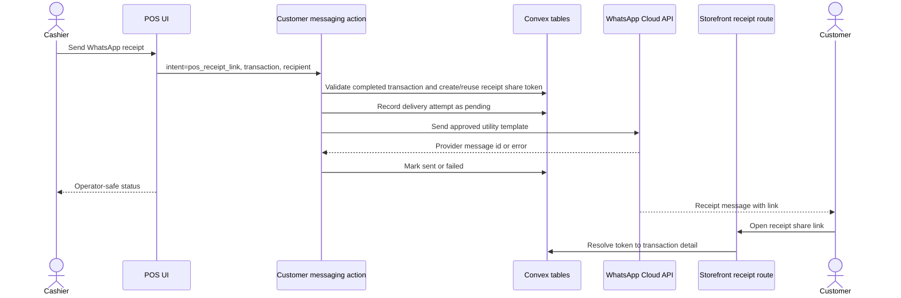

# Implement POS WhatsApp Receipt Messaging

## Summary

Add receipt-only WhatsApp Business sending through a small customer messaging foundation. The implementation should mint customer-safe receipt links, send approved WhatsApp utility-template messages through Meta Cloud API, persist delivery attempts and webhook statuses, and expose manual send/resend controls in the POS completion and transaction detail surfaces.

---

## Problem Frame

Athena already records completed POS transactions and has a storefront receipt route, but operators cannot deliver a receipt link to a customer through WhatsApp from the POS workflow. The origin requirements define a receipt-only first release that must still leave a reusable intent/channel/template/delivery foundation for later customer communications (see origin: `docs/brainstorms/2026-05-06-pos-whatsapp-receipt-messaging-requirements.md`).

---

## Requirements

- R1. Send POS transaction receipt links through WhatsApp Business for completed POS transactions.
- R2. Prefill the best available customer phone number and allow one-time recipient override.
- R3. Use one-time recipient numbers only for the delivery attempt unless the operator separately updates the customer record.
- R4. Expose sending from sale-complete state and completed transaction detail.
- R5. Keep v1 manual and operator-initiated.
- R6. Show operator-safe send feedback without raw provider/backend wording.
- R7. Use customer-safe receipt sharing rather than the raw transaction id as the durable public receipt access contract.
- R8. Persist enough delivery history to answer what was sent, to whom, by whom, and with what status.
- R9. Record delivery attempts and show meaningful provider status when available.
- R10. Make failed delivery visible enough to retry or correct the recipient.
- R11. Distinguish delayed/unknown provider status from confirmed failure.
- R12. Do not silently create, merge, or update customer profile data from a one-time receipt number.
- R13. Do not let receipt-specific permission become permission for marketing, support, reminders, or other future message types.
- R14. Organize customer messaging by explicit message intent, with POS receipt link as the first supported intent.
- R15. Define allowed channels, recipient rules, template needs, send trigger, and consent/operator-action policy per future intent.
- R16. Reuse common delivery tracking while keeping intent-specific product and policy boundaries.
- R17. Keep marketing and broad customer outreach separate from transactional receipt messaging.
- R18. Treat WhatsApp receipt messages as transactional utility messages, not marketing.
- R19. Expect provider-approved WhatsApp message templates where WhatsApp policy requires them.

**Origin actors:** A1 Cashier, A2 Store operator or manager, A3 Customer, A4 Athena, A5 WhatsApp Business provider.
**Origin flows:** F1 Send receipt immediately after sale completion, F2 Send or resend from transaction detail, F3 Use a one-time recipient number, F4 Extend messaging with a future non-receipt use case.
**Origin acceptance examples:** AE1 through AE7 from `docs/brainstorms/2026-05-06-pos-whatsapp-receipt-messaging-requirements.md`.

---

## Scope Boundaries

- Automatic receipt sending is out of scope for the first release.
- Stored customer WhatsApp receipt preferences are deferred.
- SMS, email, and multi-channel fallback are out of scope for the first release.
- Two-way WhatsApp inbox, support handoff, and agent conversation management are out of scope.
- Marketing broadcasts, promotions, and campaign messaging are out of scope.
- Customer profile merge, dedupe, and broad preference-center work are out of scope.
- PDF receipt generation and receipt attachments are out of scope; v1 sends a link.
- Customer-profile mutation from a one-time receipt number is out of scope.

### Deferred to Follow-Up Work

- Broader customer communication intents: implement only the policy hooks and delivery model needed so future order, service, reminder, and payment-link intents can be added cleanly.
- WhatsApp BSP evaluation: revisit a provider such as Twilio, Infobip, or Bird if Athena needs shared inbox tooling, fallback SMS, template operations, or multi-location onboarding.
- Receipt delivery analytics: keep v1 operational, not a reporting dashboard.

---

## Context & Research

### Relevant Code and Patterns

- `packages/storefront-webapp/src/routes/shop/receipt/$transactionId/index.tsx` renders the current customer-facing POS receipt using the transaction id route.
- `packages/storefront-webapp/src/api/posTransaction.ts` fetches receipt data through the customer-channel HTTP API.
- `packages/athena-webapp/convex/http/domains/customerChannel/routes/posTransaction.ts` exposes the public receipt transaction detail endpoint.
- `packages/athena-webapp/convex/pos/application/queries/getTransactions.ts` already resolves profile-backed customer contact details and transaction detail data.
- `packages/athena-webapp/convex/pos/public/transactions.ts` owns the public Convex query/mutation facade for POS transactions and command-result conventions.
- `packages/athena-webapp/convex/schema.ts` and `packages/athena-webapp/convex/schemas/**` are the schema/index pattern for new persistent operational tables.
- `packages/athena-webapp/convex/mtn/client.ts` is the best local pattern for an external provider client with injectable `fetch`.
- `packages/athena-webapp/convex/services/paystackService.ts` and `packages/athena-webapp/convex/http.ts` show payment/provider HTTP integration and webhook routing patterns.
- `packages/athena-webapp/src/components/pos/OrderSummary.tsx` owns the POS sale-complete receipt action area and print receipt behavior.
- `packages/athena-webapp/src/lib/pos/presentation/register/useRegisterViewModel.ts` stores completed transaction state after checkout; it currently keeps the transaction number but should also carry the transaction id for receipt sending.
- `packages/athena-webapp/src/components/pos/transactions/TransactionView.tsx` already shows `View receipt`, customer contact details, correction history, and completed transaction summary.

### Institutional Learnings

- `docs/solutions/logic-errors/athena-pos-customer-profile-attribution-compatibility-2026-04-25.md`: `customerProfile` is the canonical identity, while sale-only customer info must not create low-quality reusable records. This directly supports one-time receipt number handling.
- `docs/solutions/logic-errors/athena-command-approval-policy-boundary-2026-05-01.md`: command boundaries should own reusable policy rather than screen-specific auth decisions. Receipt messaging should use an intent policy boundary even though v1 does not require manager approval.
- `docs/product-copy-tone.md`: operator-facing errors and state labels should be calm, clear, restrained, and should normalize provider/backend wording before it reaches the UI.

### External References

- [Meta WhatsApp Cloud API send messages](https://developers.facebook.com/docs/whatsapp/cloud-api/guides/send-messages/): use Cloud API message sending behind the provider client.
- [Meta WhatsApp message templates](https://developers.facebook.com/docs/whatsapp/business-management-api/message-templates/): expect an approved receipt utility template for business-initiated receipt sends.
- [WhatsApp Business Platform pricing](https://whatsappbusiness.com/products/platform-pricing/): pricing is per delivered message, with marketing, utility, authentication, and service categories; utility messages are appropriate for user-triggered transactional receipts.
- [Meta WhatsApp Cloud API webhooks](https://developers.facebook.com/docs/whatsapp/cloud-api/webhooks/components/): webhook status callbacks should update delivery attempts when available.

---

## High-Level Technical Design

This illustrates the intended approach and is directional guidance for review, not implementation specification. The implementing agent should treat it as context, not code to reproduce.

---

## Key Technical Decisions

- **Use Meta Cloud API directly for v1:** The confirmed scope does not need BSP inbox tooling, fallback SMS, or managed template workflows. Wrap Meta behind a provider client so a BSP can replace it later if the product expands.
- **Create two small persistent concepts:** A receipt share token secures customer-facing access; a customer message delivery record tracks intent/channel/template/recipient/provider status. Do not store receipt delivery as free-form operational events only, because operators need status updates and retry state.
- **Store only the delivery recipient needed for audit:** Persist the one-time number on the delivery attempt, clearly marked as one-time, without patching `customerProfile` or transaction customer info.
- **Keep send orchestration in a Convex action:** Sending requires external network access, so the action should load transaction/link context, persist attempt state through internal mutations, call the provider client, then persist provider outcome.
- **Use a tokenized receipt route for WhatsApp:** Keep the current transaction-id receipt route working for internal links while the WhatsApp message uses the new share-token route.
- **Treat webhook status as eventual:** Operator UI should show pending/sent/failed immediately and upgrade to delivered/read when webhooks arrive. Unknown provider delay is not failure.
- **Add intent policy now, not a notification platform:** Define `pos_receipt_link` with allowed channel, manual trigger, utility-template category, and recipient-source rules; defer UI/preferences for future intents.

---

## Open Questions

### Resolved During Planning

- **Provider path:** Start with Meta WhatsApp Cloud API directly, behind a provider boundary.
- **Public receipt access:** Add a customer-safe share token route; do not use raw transaction id as the durable public WhatsApp link.
- **Delivery status model:** Use v1 statuses `pending`, `sent`, `delivered`, `read`, `failed`, and `unknown`, with raw provider details retained only as metadata.
- **Messaging foundation size:** Add intent policy and delivery records only; defer inboxes, campaigns, preferences, fallback channels, and schedulers.

### Deferred to Implementation

- **Exact template name and variable names:** Use environment/config values because the approved WhatsApp template may be created outside this PR.
- **Token expiration duration:** Choose a conservative default during implementation and keep it configurable if existing config patterns support it cleanly.
- **Webhook verification details:** Implement according to the final Meta app configuration available in environment variables.

---

## Implementation Units

- U1. **Add Messaging And Receipt Share Persistence**
  - **Goal:** Add the minimal backend data model for receipt share tokens, message delivery attempts, status transitions, and intent policy.
  - **Requirements:** R7, R8, R9, R11, R12, R14, R15, R16, R17.
  - **Dependencies:** None.
  - **Files:**
    - `packages/athena-webapp/convex/schema.ts`
    - Create `packages/athena-webapp/convex/schemas/customerMessaging/index.ts`
    - Create `packages/athena-webapp/convex/schemas/customerMessaging/receiptShareToken.ts`
    - Create `packages/athena-webapp/convex/schemas/customerMessaging/customerMessageDelivery.ts`
    - Create `packages/athena-webapp/convex/customerMessaging/domain.ts`
    - Create `packages/athena-webapp/convex/customerMessaging/policy.ts`
    - Create `packages/athena-webapp/convex/customerMessaging/repository.ts`
    - Create `packages/athena-webapp/convex/customerMessaging/repository.test.ts`
  - **Approach:** Add `receiptShareToken` for tokenized receipt access and `customerMessageDelivery` for delivery attempts. Index receipt tokens by token hash and transaction, and index deliveries by store/subject and provider message id. Keep the domain model intent-first with `pos_receipt_link` as the first intent and `whatsapp_business` as the first channel.
  - **Patterns to follow:** Existing schema modules under `packages/athena-webapp/convex/schemas/operations`; operational indexes in `packages/athena-webapp/convex/schema.ts`; command-result/domain separation in POS transaction code.
  - **Test scenarios:**
    - Creating a receipt share token returns a token that can be resolved to the correct completed transaction context by hash.
    - Reusing a share token for the same transaction does not create duplicate active links when reuse is requested.
    - Expired or revoked tokens do not resolve.
    - Creating a delivery attempt records recipient source as customer profile, sale-only customer info, or one-time override without mutating customer profile data.
    - Provider message id can be attached to a pending delivery and later used to locate the delivery.
    - Invalid intent/channel combinations are rejected by policy.
  - **Verification:** Schema compiles, repository tests cover token lifecycle and delivery attempt state, and generated Convex artifacts are refreshed.

- U2. **Add Customer-Safe Receipt API And Storefront Route**
  - **Goal:** Let customers open a receipt through a share token instead of the raw transaction id.
  - **Requirements:** R1, R7, R11.
  - **Dependencies:** U1.
  - **Files:**
    - `packages/athena-webapp/convex/http/domains/customerChannel/routes/posTransaction.ts`
    - `packages/athena-webapp/convex/pos/public/transactions.ts`
    - `packages/athena-webapp/convex/pos/application/queries/getTransactions.ts`
    - Create or modify tests near `packages/athena-webapp/convex/pos/public/transactions.test.ts`
    - `packages/storefront-webapp/src/api/posTransaction.ts`
    - Create `packages/storefront-webapp/src/routes/shop/receipt/s/$token/index.tsx`
    - `packages/storefront-webapp/src/routeTree.gen.ts`
    - Create or modify receipt route tests under `packages/storefront-webapp/src/routes/shop/receipt`
  - **Approach:** Add a public receipt-detail query that resolves a token to transaction detail and returns the same receipt shape the existing route uses. Keep `/shop/receipt/$transactionId` working, but make WhatsApp-generated links point to `/shop/receipt/s/$token`. Ensure missing, expired, revoked, or mismatched tokens return the same customer-safe not-found experience as current receipt misses.
  - **Patterns to follow:** Existing storefront receipt route and `getPosTransaction` API contract; customer-channel Hono route style; transaction detail mapping in `getTransactionById`.
  - **Test scenarios:**
    - Covers AE4. A valid token loads the receipt without requiring a storefront account.
    - Invalid, expired, or revoked token returns not found and does not expose whether a transaction exists.
    - Token route renders the same receipt totals, items, payment, and store contact data as the transaction-id route.
    - Transaction-id route still works for existing internal `View receipt` behavior until UI migrates.
  - **Verification:** Storefront route compiles, token API returns the current receipt DTO shape, and route generation is refreshed.

- U3. **Implement WhatsApp Provider Client And Configuration**
  - **Goal:** Add a tested Meta WhatsApp Cloud API client behind a narrow provider interface.
  - **Requirements:** R1, R6, R18, R19.
  - **Dependencies:** U1.
  - **Files:**
    - Create `packages/athena-webapp/convex/customerMessaging/whatsappClient.ts`
    - Create `packages/athena-webapp/convex/customerMessaging/whatsappConfig.ts`
    - Create `packages/athena-webapp/convex/customerMessaging/whatsappClient.test.ts`
    - Update environment documentation if present: `.env.example`, `packages/athena-webapp/README.md`, or the repo's current env reference file
  - **Approach:** Use `WHATSAPP_ACCESS_TOKEN`, `WHATSAPP_PHONE_NUMBER_ID`, `WHATSAPP_RECEIPT_TEMPLATE_NAME`, `WHATSAPP_TEMPLATE_LANGUAGE`, and webhook verification env vars. Build a client that sends a template message with receipt variables and maps provider responses/errors into Athena delivery outcomes. Accept a `fetchImpl` in tests as in the MTN client.
  - **Patterns to follow:** `packages/athena-webapp/convex/mtn/client.ts` for injectable external clients; `packages/athena-webapp/convex/services/paystackService.ts` for provider headers and error mapping.
  - **Test scenarios:**
    - Client sends the expected Meta Cloud API request for a receipt template message.
    - Successful provider response returns the provider message id.
    - Provider validation, auth, rate, and generic failures map to non-raw application errors.
    - Missing required environment config fails before attempting a provider request.
    - Template variables include store name, transaction number, and tokenized receipt link.
  - **Verification:** Provider client is unit-tested without real network calls and no secret values are hardcoded.

- U4. **Add Send Receipt Command And Webhook Status Updates**
  - **Goal:** Orchestrate manual receipt sends and update delivery status from WhatsApp webhooks.
  - **Requirements:** R1, R2, R3, R5, R6, R8, R9, R10, R11, R12, R18, R19.
  - **Dependencies:** U1, U2, U3.
  - **Files:**
    - Create `packages/athena-webapp/convex/customerMessaging/actions.ts`
    - Create `packages/athena-webapp/convex/customerMessaging/internal.ts`
    - Create `packages/athena-webapp/convex/customerMessaging/public.ts`
    - Create `packages/athena-webapp/convex/customerMessaging/actions.test.ts`
    - Create `packages/athena-webapp/convex/customerMessaging/webhooks.test.ts`
    - `packages/athena-webapp/convex/http.ts`
    - Create `packages/athena-webapp/convex/http/domains/customerMessaging/routes/whatsapp.ts`
  - **Approach:** Add a public action for `sendPosReceiptLink` that validates the transaction is completed, resolves recipient source, creates/reuses a receipt share token, records a pending delivery attempt, calls the WhatsApp client, and marks sent or failed. Add webhook routes to verify Meta webhook setup and update delivery status by provider message id. Preserve one-time numbers on the attempt only.
  - **Patterns to follow:** Hono webhook routing in `packages/athena-webapp/convex/http.ts`; command-result validators from `packages/athena-webapp/convex/lib/commandResultValidators.ts`; existing `runCommand` UI contract.
  - **Test scenarios:**
    - Covers AE1. Sending with a profile phone creates a pending attempt, sends to that phone, stores provider message id, and returns an operator-safe success result.
    - Covers AE2. Sending with a one-time override stores the one-time number on the attempt and does not patch `customerProfile` or transaction customer info.
    - Sending is rejected for missing transaction, non-completed transaction, missing recipient, invalid phone, or unsupported intent/channel.
    - Provider failure marks the attempt failed and returns operator-safe feedback.
    - Provider timeout or unknown response leaves the attempt in an unknown or retryable state rather than delivered.
    - Webhook verification succeeds only with the configured verify token.
    - Webhook status payloads update `sent`, `delivered`, `read`, and `failed` states by provider message id.
    - Duplicate webhook delivery is idempotent.
  - **Verification:** Backend action tests cover success, validation, one-time recipient isolation, provider failure, and webhook status transitions.

- U5. **Expose Delivery History In Transaction Queries**
  - **Goal:** Make recent receipt delivery attempts available to POS UI surfaces.
  - **Requirements:** R8, R9, R10, R11.
  - **Dependencies:** U1, U4.
  - **Files:**
    - `packages/athena-webapp/convex/pos/application/queries/getTransactions.ts`
    - `packages/athena-webapp/convex/pos/public/transactions.ts`
    - `packages/athena-webapp/convex/pos/application/getTransactions.test.ts`
    - `packages/athena-webapp/convex/pos/public/transactions.test.ts`
  - **Approach:** Extend transaction detail with receipt delivery summaries for subject type `pos_transaction` and intent `pos_receipt_link`. Include latest status, recipient source, masked recipient display, sent/updated timestamps, actor display when available, and retry eligibility. Avoid returning raw provider payloads to the browser.
  - **Patterns to follow:** Correction history loading and staff-name enrichment in `getTransactionById`; transaction detail validators in `pos/public/transactions.ts`.
  - **Test scenarios:**
    - Transaction detail returns no delivery history when none exists.
    - Latest delivery attempts are returned in reverse chronological order.
    - One-time recipient attempts are marked as one-time without exposing unrelated customer profile mutation.
    - Failed attempts include retry-appropriate display state.
    - Raw provider error payloads are omitted from the public transaction DTO.
  - **Verification:** Transaction detail tests prove UI receives enough delivery state without exposing provider internals.

- U6. **Add POS Send/Resend UI**
  - **Goal:** Add manual send/resend controls to the sale-complete state and completed transaction detail.
  - **Requirements:** R1, R2, R3, R4, R5, R6, R8, R9, R10, R11, R12.
  - **Dependencies:** U4, U5.
  - **Files:**
    - `packages/athena-webapp/src/lib/pos/presentation/register/registerUiState.ts`
    - `packages/athena-webapp/src/lib/pos/presentation/register/useRegisterViewModel.ts`
    - `packages/athena-webapp/src/lib/pos/presentation/register/useRegisterViewModel.test.ts`
    - `packages/athena-webapp/src/components/pos/OrderSummary.tsx`
    - `packages/athena-webapp/src/components/pos/OrderSummary.test.tsx`
    - `packages/athena-webapp/src/components/pos/register/RegisterCheckoutPanel.tsx`
    - `packages/athena-webapp/src/components/pos/transactions/TransactionView.tsx`
    - `packages/athena-webapp/src/components/pos/transactions/TransactionView.test.tsx`
    - Create if useful: `packages/athena-webapp/src/components/pos/receipt/WhatsAppReceiptDialog.tsx`
    - Create if useful: `packages/athena-webapp/src/components/pos/receipt/WhatsAppReceiptDeliveryHistory.tsx`
  - **Approach:** Preserve the existing print receipt flow and add a WhatsApp receipt action beside it. Carry `transactionId` into completed checkout state after `completeTransaction` succeeds. The dialog should prefill profile/sale phone when present, allow one-time override, show the one-time-number boundary clearly, call the send action manually, and render status feedback. Transaction detail should show delivery history and allow resend/corrected recipient.
  - **Patterns to follow:** `OrderSummary` completed state visual language; `TransactionView` action card and correction workflows; `runCommand` and `presentOperatorError` behavior; product copy tone guidance.
  - **Test scenarios:**
    - Covers AE1. Completed sale with customer phone pre-fills the WhatsApp send dialog and does not send until confirmation.
    - Completed sale without phone lets the cashier enter a one-time number.
    - Covers AE2. One-time number send does not call any customer update mutation.
    - Send success shows operator-safe confirmation and updates local/latest state.
    - Send failure shows retryable operator-safe feedback.
    - Covers AE3. Transaction detail shows prior attempts and supports resend with corrected recipient.
    - Unknown/pending status renders distinctly from failed status.
    - Existing print receipt and new sale actions still work.
  - **Verification:** Component tests cover completed-sale and transaction-detail behavior; UI follows existing POS design system without adding a broad messaging management surface.

- U7. **Finalize Integration, Configuration, And Validation**
  - **Goal:** Refresh generated artifacts, document runtime configuration, and run the repo validation expected for a cross-surface feature.
  - **Requirements:** R6, R18, R19 and overall success criteria.
  - **Dependencies:** U1, U2, U3, U4, U5, U6.
  - **Files:**
    - `packages/athena-webapp/convex/_generated/api.d.ts`
    - `packages/athena-webapp/convex/_generated/dataModel.d.ts`
    - `packages/storefront-webapp/src/routeTree.gen.ts`
    - Relevant env/config docs discovered during implementation
    - `graphify-out/**` after `bun run graphify:rebuild`
  - **Approach:** Run Convex/codegen and route generation through the repo's normal scripts. Document WhatsApp env vars, template expectations, and webhook callback setup in the existing configuration docs. Run graphify rebuild after code modifications per repo instructions.
  - **Patterns to follow:** Existing generated-artifact handling and repo harness conventions.
  - **Test scenarios:** Test expectation: none for docs/generated artifacts beyond the validations produced by earlier units.
  - **Verification:** Targeted unit/component tests pass, typecheck passes for affected packages, generated artifacts are committed, and graphify is rebuilt.

---

## Risk Analysis & Mitigation

- **WhatsApp policy drift:** Keep provider behavior isolated behind configuration and a tested client; confirm template/category requirements during implementation before enabling real sends.
- **Customer data pollution:** Treat one-time recipient as delivery-attempt data only and add tests proving customer profile records are not patched.
- **Receipt link exposure:** Use tokenized access and safe not-found behavior; do not send raw transaction ids through WhatsApp.
- **Provider webhook uncertainty:** Treat webhook status as eventual and idempotent; UI must distinguish unknown/pending from failed.
- **Scope creep into messaging platform:** Implement only `pos_receipt_link` intent, one channel, manual sending, delivery history, and policy hooks needed for future extension.
- **Frontend surface crowding:** Keep WhatsApp actions adjacent to existing receipt actions; avoid adding a standalone messaging dashboard in v1.

---

## Operational / Rollout Notes

- Configure WhatsApp Cloud API credentials and template values per environment before enabling real sends.
- The receipt template should be approved as a utility template and include store name, transaction number, and receipt link variables.
- Webhook callback URL and verify token must be configured in the Meta app before delivery/read/failed updates will appear.
- Consider launching with a feature flag or environment guard if production credentials are not ready at merge time.

---

## Documentation Plan

- Update the repo's env/config docs with WhatsApp credential, template, and webhook variables.
- Document the one-time-recipient rule so future customer messaging work does not treat receipt sends as profile updates or marketing consent.
- If implementation creates a reusable customer messaging module, add a short module note explaining `pos_receipt_link` as the first intent and the boundaries for future intents.

---

## Verification Plan

- Backend: targeted Convex tests for token lifecycle, delivery attempt persistence, send action behavior, provider client mapping, transaction detail delivery summaries, and webhook status updates.
- Frontend: component tests for `OrderSummary` sale-complete send flow and `TransactionView` resend/history flow.
- Storefront: route/API tests for tokenized receipt access and safe not-found behavior.
- Integration: typecheck affected webapps, regenerate Convex/storefront route artifacts, run relevant POS/storefront test suites, and run `bun run graphify:rebuild` after code changes.

---

## Sources & References

- Origin requirements: `docs/brainstorms/2026-05-06-pos-whatsapp-receipt-messaging-requirements.md`
- Customer identity learning: `docs/solutions/logic-errors/athena-pos-customer-profile-attribution-compatibility-2026-04-25.md`
- Product copy guidance: `docs/product-copy-tone.md`
- Meta Cloud API send messages: https://developers.facebook.com/docs/whatsapp/cloud-api/guides/send-messages/
- Meta message templates: https://developers.facebook.com/docs/whatsapp/business-management-api/message-templates/
- WhatsApp Business Platform pricing/categories: https://whatsappbusiness.com/products/platform-pricing/
- Meta Cloud API webhooks: https://developers.facebook.com/docs/whatsapp/cloud-api/webhooks/components/
