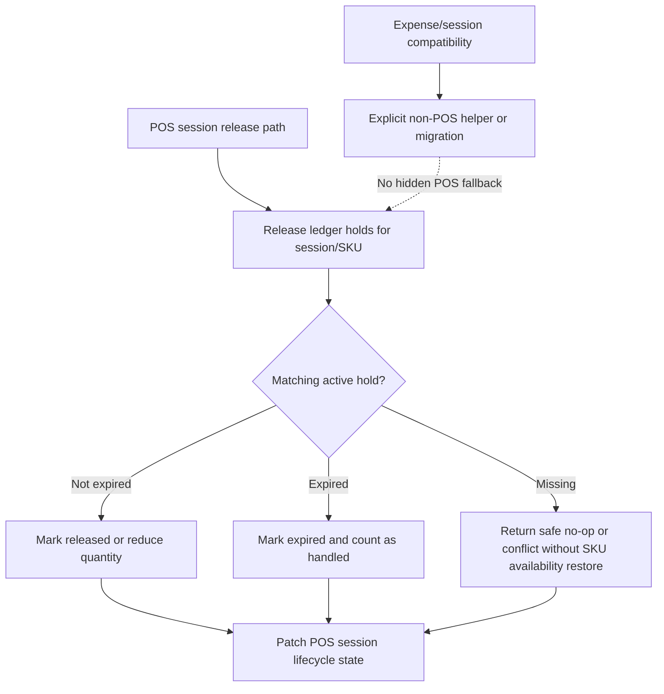

# Fix POS Legacy Hold Release

## Summary

Remove POS from the legacy quantity-patch hold path so expired POS ledger holds cannot add availability back to `productSku.quantityAvailable`. The work keeps POS session holds ledger-only, moves any remaining non-POS compatibility behind explicit boundaries, and adds regression coverage for cron expiry, manual session expiry, void, clear-cart, and completion.

---

## Problem Frame

The POS cart latency migration moved sale-session holds to `inventoryHold` rows, but the shared release helper still carries a legacy fallback that increments `productSku.quantityAvailable` when it cannot release the requested quantity from active ledger rows. When the POS expiry cron processes an already-expired ledger hold, that fallback can add stock availability that was never subtracted, making available quantity exceed on-hand quantity.

---

## Assumptions

*This plan was authored without synchronous user confirmation. The items below are agent inferences that fill gaps in the input and should be reviewed during implementation and PR review.*

- "Get off the legacy behavior" means POS sale-session commands should no longer support or call tuple-style quantity-patch hold APIs.
- Existing expense-session quantity-patch behavior should not be silently broken in the POS fix; it should either get an explicit non-POS compatibility helper or be migrated in a separately testable unit.
- Existing active POS sessions without ledger holds should fail safely by context: expiry/void/clear/remove terminalizes or deletes session state without SKU availability restoration, while completion must reject missing required ledger holds before decrementing stock.

---

## Requirements

- R1. Expiring an active or held POS session with ledger holds must never increase `productSku.quantityAvailable`.
- R2. POS release, void, clear-cart, manual expire, cron expire, and cashier-recovery expire paths must release or expire ledger hold rows idempotently.
- R3. POS command integration must stop exposing tuple-style legacy quantity-patch hold acquire/adjust/release calls.
- R4. POS session schema and completion behavior must not preserve a `legacyQuantityPatch` mode as a valid POS path.
- R5. Any still-required non-POS quantity-patch behavior must be explicit and tested outside the POS ledger helper.
- R6. Repo docs and sensors must record that POS cart holds are ledger-only and that release helpers must not restore SKU availability for POS holds.

---

## Scope Boundaries

- This plan does not redesign storefront checkout reservations; storefront quantity-patch reservations remain outside this POS-focused fix.
- This plan does not add a data backfill for historical POS sessions unless implementation discovers current production data that cannot fail safely.
- This plan does not change POS UI behavior except where tests need to observe existing command outcomes.

### Deferred to Follow-Up Work

- Full expense-session ledger migration: only do it here if the explicit non-POS compatibility isolation proves unsafe or harder than the migration itself.
- Storefront reservation ledger migration: keep separate because storefront checkout already owns distinct reservation/session semantics.

---

## Context & Research

### Relevant Code and Patterns

- `packages/athena-webapp/convex/inventory/helpers/inventoryHolds.ts` is the shared POS inventory hold ledger helper. It currently marks expired active holds as expired, then falls through to `restoreLegacyQuantityPatchHold` when requested release quantity remains.
- `packages/athena-webapp/convex/inventory/posSessions.ts` powers cron release, manual operations expiry, void, and clear-cart release paths through `releaseInventoryHoldsBatch`.
- `packages/athena-webapp/convex/pos/infrastructure/integrations/inventoryHoldGateway.ts` still exposes tuple-style legacy acquire/adjust/release calls and has tests asserting direct `quantityAvailable` patches.
- `packages/athena-webapp/convex/schemas/pos/posSession.ts` still allows `inventoryHoldMode: "legacyQuantityPatch" | "ledger"`.
- `packages/athena-webapp/convex/inventory/expenseSessions.ts` still calls `releaseInventoryHoldsBatch(ctx.db, releaseItems)` with the array-form compatibility signature.
- `packages/athena-webapp/docs/agent` routes Convex and POS changes through focused tests, `audit:convex`, `lint:convex:changed`, typecheck/build, graphify rebuild, and harness review before delivery.

### Institutional Learnings

- `docs/solutions/performance/athena-pos-cart-latency-foundation-2026-05-05.md` says POS cart holds should be represented as `inventoryHold` rows, not `productSku.quantityAvailable` patches, and completion should decrement SKU inventory exactly once.
- `docs/solutions/logic-errors/athena-pos-register-local-catalog-search-2026-05-04.md` warns not to put volatile availability back into full-store POS catalog snapshots.
- Prior POS hardening guidance treats command-boundary inventory and session lifecycle invariants as production-hardening work that needs concrete regression tests, not a prose-only spec.

### External References

- None. The issue is repo-local Convex/POS state semantics with strong local patterns.

---

## Key Technical Decisions

- Make POS release ledger-only: release helpers used by POS should mark matching active ledger holds `released` or `expired` and should not restore `productSku.quantityAvailable`.
- Remove tuple-style POS gateway compatibility: keeping both tuple and object call shapes makes it easy for future POS code to re-enter the quantity-patch path.
- Treat expense compatibility as explicit non-POS behavior: if expense sessions still require quantity-patch release during this batch, give them a clearly named helper rather than keeping array overload behavior in the POS ledger helper.
- Define missing-ledger behavior by command context: expiry, void, clear-cart, and remove-item should complete their session/item cleanup without SKU availability restoration; completion should reject the sale when required ledger holds are missing or expired; helper-level missing-hold release should be an availability-preserving no-op.

---

## Open Questions

### Resolved During Planning

- Should POS preserve the legacy availability restore fallback? No. It directly causes the reported over-availability bug and contradicts the ledger migration.
- Should this be one coordinated PR? Yes. Multiple units touch the same helper, tests, docs, graphify output, and possibly generated Convex artifacts.

### Deferred to Implementation

- Whether expense sessions can migrate to the ledger helper in this same batch: decide after characterization tests show the current expense quantity-patch lifecycle clearly enough. U1 must preserve the existing array-form expense release path until U3 replaces it with an explicit non-POS helper or migration.
- Whether old POS sessions with `inventoryHoldMode` missing need a one-time repair: decide from implementation-time data/model evidence; do not add speculative migration work without proof.

---

## High-Level Technical Design

> *This illustrates the intended approach and is directional guidance for review, not implementation specification. The implementing agent should treat it as context, not code to reproduce.*

---

## Implementation Units

- U1. **Characterize And Remove POS Release Restore**

**Goal:** Prove the current over-availability failure, then remove the POS path that restores `quantityAvailable` when a ledger release sees expired or missing holds.

**Requirements:** R1, R2.

**Dependencies:** None.

**Files:**
- Modify: `packages/athena-webapp/convex/inventory/helpers/inventoryHolds.ts`
- Modify: `packages/athena-webapp/convex/inventory/helpers/inventoryHolds.test.ts`
- Modify: `packages/athena-webapp/convex/inventory/posSessions.trace.test.ts`
- Modify: `packages/athena-webapp/convex/inventory/posSessions.ts`

**Approach:**
- Add characterization coverage showing the current expired-ledger-hold release would patch availability upward.
- Change POS ledger release semantics so expired matching holds are considered handled for the requested release quantity and missing ledger rows never trigger an availability restore.
- Preserve the current expense array-form release behavior while U1 lands; remove or rename that compatibility only in U3 after expense tests are in place.
- Add at least one test that exercises the real helper behavior from a POS expiry-shaped scenario, not only a mocked `releaseInventoryHoldsBatch` call.

**Execution note:** Characterization-first for the current failure, then test-first for the corrected invariant.

**Patterns to follow:**
- `packages/athena-webapp/convex/inventory/helpers/inventoryHolds.test.ts` existing in-memory DB harness.
- `packages/athena-webapp/convex/inventory/posSessions.trace.test.ts` existing session lifecycle coverage, but avoid relying only on mocked helper assertions for the inventory invariant.

**Test scenarios:**
- Happy path: releasing a non-expired active ledger hold marks it released and leaves `productSku.quantityAvailable` unchanged.
- Edge case: releasing an expired active ledger hold marks it expired and leaves `productSku.quantityAvailable` unchanged even when item quantity is requested.
- Edge case: replaying POS expiry after holds were already released or expired is idempotent and does not patch `productSku`.
- Integration: `releasePosSessionItems` for an expired held POS session with an expired ledger hold marks the session expired and does not make availability exceed inventory count.
- Integration: `expireSessionFromOperations` manual expiry releases/terminalizes ledger holds without SKU availability restoration.
- Integration: `voidSession` releases/terminalizes ledger holds without SKU availability restoration and preserves audit-session items as currently designed.
- Integration: `releaseSessionInventoryHoldsAndDeleteItems` clear-cart cleanup releases/terminalizes ledger holds without SKU availability restoration.
- Integration: remove-item release deletes the line item without SKU availability restoration when no active matching ledger hold remains.
- Integration: cashier-recovery expiry through `expireAllSessionsForStaff` releases active/held session holds without SKU availability restore.

**Verification:**
- POS expiry and helper tests prove `quantityAvailable` is unchanged during release/expiry and only session/hold statuses change.

---

- U2. **Remove POS Gateway Legacy Quantity-Patch API**

**Goal:** Remove tuple-style acquire/adjust/release compatibility from the POS inventory gateway so POS command code can only use object-shaped ledger hold calls.

**Requirements:** R3, R4.

**Dependencies:** U1.

**Files:**
- Modify: `packages/athena-webapp/convex/pos/infrastructure/integrations/inventoryHoldGateway.ts`
- Modify: `packages/athena-webapp/convex/pos/infrastructure/integrations/inventoryHoldGateway.test.ts`
- Modify: `packages/athena-webapp/convex/pos/application/commands/sessionCommands.ts`
- Modify: `packages/athena-webapp/convex/pos/application/sessionCommands.test.ts`
- Modify: `packages/athena-webapp/convex/schemas/pos/posSession.ts`
- Modify: `packages/athena-webapp/convex/pos/application/commands/completeTransaction.ts`
- Modify: `packages/athena-webapp/convex/pos/application/completeTransaction.test.ts`

**Approach:**
- Collapse gateway signatures to the ledger object form only.
- Replace tests that assert tuple quantity-patch behavior with tests that assert tuple behavior is not part of the public POS integration contract.
- Remove `legacyQuantityPatch` from the POS session schema and make completion validate ledger holds according to the current POS invariant rather than preserving a legacy mode branch.

**Execution note:** Test-first for contract removal; TypeScript failures should guide callsite cleanup.

**Patterns to follow:**
- `packages/athena-webapp/convex/pos/application/commands/sessionCommands.ts` already creates new POS sessions with `inventoryHoldMode: "ledger"`.
- `packages/athena-webapp/convex/pos/application/commands/completeTransaction.ts` already contains ledger-specific hold validation and consumption.

**Test scenarios:**
- Happy path: add/update/remove cart commands still acquire, adjust, and release ledger holds through object-shaped gateway calls.
- Error path: completion with missing or expired ledger holds fails safely instead of decrementing inventory from an unheld cart.
- Edge case: sessions with no explicit legacy mode are handled by the new ledger-only policy without SKU availability restoration.
- Contract: TypeScript/test coverage no longer contains POS tuple acquire/adjust/release usage.

**Verification:**
- POS gateway and command tests pass without tuple compatibility helpers or `legacyQuantityPatch` schema support.

---

- U3. **Isolate Or Migrate Expense Quantity-Patch Compatibility**

**Goal:** Remove the array-form quantity-patch branch from the shared POS ledger helper without breaking expense-session release behavior accidentally.

**Requirements:** R5.

**Dependencies:** U1.

**Files:**
- Modify: `packages/athena-webapp/convex/inventory/helpers/inventoryHolds.ts`
- Modify: `packages/athena-webapp/convex/inventory/helpers/inventoryHolds.test.ts`
- Modify: `packages/athena-webapp/convex/inventory/expenseSessions.ts`
- Modify: `packages/athena-webapp/convex/inventory/expenseSessions.test.ts`
- Optional modify: `packages/athena-webapp/convex/inventory/expenseTransactions.ts`

**Approach:**
- Characterize current expense session release expectations before changing shared helper signatures.
- Either move quantity-patch release into an explicitly named expense/local helper or migrate expense sessions to ledger-backed holds if the test surface shows the migration is smaller and safer.
- Ensure the shared POS ledger helper no longer has overloaded behavior where array input means direct SKU availability restoration.

**Execution note:** Characterization-first because expense session hold semantics are still legacy and should not be changed accidentally.

**Patterns to follow:**
- `packages/athena-webapp/convex/inventory/expenseSessions.test.ts` existing expense lifecycle command-result style.
- `packages/athena-webapp/convex/inventory/expenseTransactions.ts` current assumption that expense hold acquisition already reduced availability before completion.

**Test scenarios:**
- Happy path: voiding an expense session releases its held quantities according to the explicit expense behavior.
- Integration: `releaseExpenseSessionItems` for expired sessions keeps current expense inventory accounting correct.
- Edge case: expense release no longer reaches the POS ledger helper through an overloaded array signature.
- Regression: POS helper tests fail if array-form quantity patch is reintroduced.

**Verification:**
- Expense session tests document either preserved explicit compatibility or the migrated ledger behavior, and POS helper code has no hidden quantity-patch overload.

---

- U4. **Refresh Sensors And Durable Learning**

**Goal:** Keep repo docs, graphify output, and plan/ticket links honest after changing the POS hold contract.

**Requirements:** R6.

**Dependencies:** U1, U2, U3.

**Files:**
- Modify: `docs/solutions/performance/athena-pos-cart-latency-foundation-2026-05-05.md`
- Modify: `docs/solutions/logic-errors/athena-pos-register-local-catalog-search-2026-05-04.md`
- Modify: `docs/plans/2026-05-06-002-fix-pos-legacy-hold-release-plan.md`
- Generated modify: `graphify-out/*`
- Generated modify when needed: `packages/athena-webapp/convex/_generated/*`
- Generated modify when needed: `packages/athena-webapp/docs/agent/*`

**Approach:**
- Update solution docs to state POS ledger release must not restore SKU availability and to record the specific expired-hold failure mode.
- Keep the regression tests from U1/U2 as the primary sensor for the invariant; add a lightweight static guard only if implementation leaves a high-risk direct call path such as tuple gateway usage or array-form POS release signatures.
- Refresh graphify after code changes.
- Run generated-artifact repair if Convex API or harness docs drift.

**Execution note:** Sensor-only.

**Patterns to follow:**
- Existing solution-doc frontmatter and prevention sections.
- Repo rule that code modifications require `bun run graphify:rebuild`.

**Test scenarios:**
- Test expectation: none -- documentation and generated-artifact refresh only.

**Verification:**
- Documentation reflects the new invariant and generated artifacts are either unchanged or refreshed through repo-owned commands.

---

## System-Wide Impact

- **Interaction graph:** POS cron expiry, operations expiry, void, clear-cart, remove-item, and completion all depend on the same hold helper contract.
- **Error propagation:** Missing ledger holds should fail safe or no-op according to command context; no path should compensate by inflating SKU availability.
- **Missing-hold context rules:** Expiry, void, clear-cart, and remove-item cleanup should not block on missing ledger holds; completion should block because it would otherwise create a sale without a valid hold.
- **State lifecycle risks:** The risky lifecycle is active ledger hold -> expired by time -> session expiry cron. That transition must mark the hold terminal without SKU availability restore.
- **API surface parity:** POS infrastructure gateway, shared inventory helper, schema mode, and tests must agree that POS is ledger-only.
- **Integration coverage:** Helper-level tests alone are not enough; at least one session-expiry-shaped test must prove the bug cannot re-enter through `posSessions.ts`.
- **Unchanged invariants:** Storefront checkout reservation behavior and broad SKU stock operations remain outside the POS ledger release contract.

---

## Risks & Dependencies

| Risk | Mitigation |
|------|------------|
| Expense sessions rely on shared array-form release behavior | Characterize expense behavior first, then isolate or migrate it explicitly under U3 |
| Old POS sessions without ledger rows exist in production | Prefer fail-safe/no-op behavior over SKU availability restore; only add migration if implementation evidence shows it is necessary |
| Tests keep mocking the helper and miss integration behavior | Add at least one inventory invariant test that exercises real helper semantics |
| Generated artifacts drift across multiple tickets | Execute as a coordinated batch and regenerate shared artifacts once before PR |

---

## Documentation / Operational Notes

- This is a coordinated Linear batch that should land through one integration PR because helper, tests, docs, graphify, and potential Convex generated artifacts overlap.
- The PR should call out that POS sale-session holds are now ledger-only and that expense compatibility was handled explicitly.
- If implementation discovers live-data repair is needed, create a follow-up Linear issue unless the repair is essential to make this fix safe.

---

## Sources & References

- Related plan: `docs/plans/2026-05-05-001-refactor-pos-cart-latency-foundation-plan.md`
- Related solution: `docs/solutions/performance/athena-pos-cart-latency-foundation-2026-05-05.md`
- Related solution: `docs/solutions/logic-errors/athena-pos-register-local-catalog-search-2026-05-04.md`
- Related Linear issue: `V26-471`
