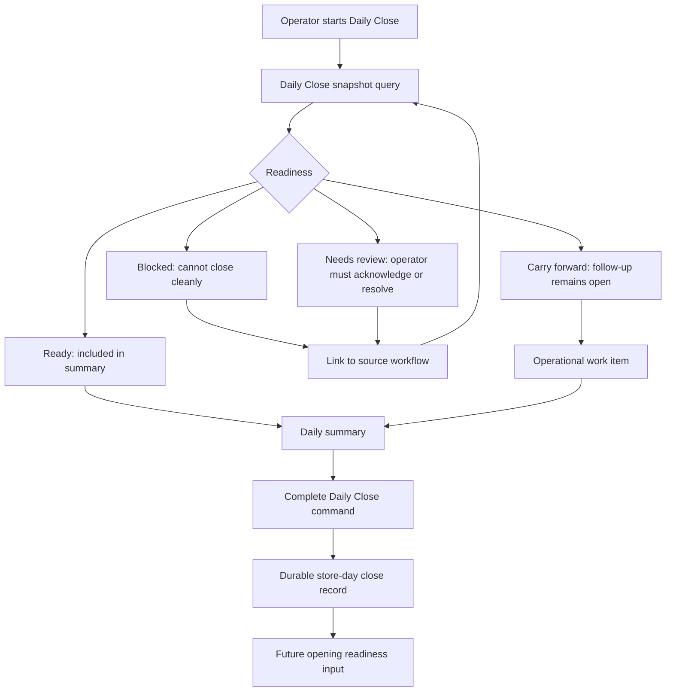

# feat: Build Daily Operations Lifecycle foundation

## Summary

Build Athena's Daily Operations Lifecycle foundation with Daily Close as the first implementation slice. The plan introduces a store-day close layer that composes existing operational records, classifies close readiness, preserves carry-forward follow-ups for future opening, and presents a business-readable Daily Close experience without turning Cash Controls into the whole product surface.

---

## Problem Frame

Athena already captures the facts that matter to an in-store day: register sessions, POS transactions, payment allocations, expense transactions, approval requests, operational events, and open operational work. Those facts live in separate workflow surfaces, so an operator can still leave the day without one clear answer to whether the business record is ready to trust.

Cash Controls is the closest existing precedent, but it is intentionally drawer/session scoped. Daily Close needs to sit above it as a store-day lifecycle surface: it should treat open or closing drawers, unresolved approvals, held POS sessions, exceptions, and follow-up work as inputs to one close-readiness record.

---

## Requirements Traceability

Origin: `docs/brainstorms/2026-05-07-daily-operations-lifecycle-requirements.md`

- R1-R3: Model the broader Daily Operations Lifecycle while implementing Daily Close first at store-day scope.
- R4-R6: Classify close readiness into blockers, review items, carry-forward items, and ready items; prevent blocked days from appearing cleanly closed.
- R7-R9: Produce a business-readable summary focused on operational trust before analytics depth.
- R10-R12: Preserve carry-forward state that a later opening workflow can consume.
- AE1-AE4: Cover blocked register closeout, reviewed exceptions, completed summary review, and future opening handoff.

---

## Scope Boundaries

- Do not implement the full opening workflow in this plan. Only the carry-forward contract needed by future opening is included.
- Do not rebuild Cash Controls. Daily Close should compose cash-control state and link back to drawer/session detail.
- Do not build forecasting, trend analytics, or BI-style reporting.
- Do not add payroll, timeclock, or staff scheduling behavior.
- Do not attempt full inventory reconciliation beyond close-relevant unresolved items or follow-ups.
- Do not bury carry-forward work in a summary blob; future opening needs queryable follow-up state.

---

## Context & Research

### Relevant Code and Patterns

- `packages/athena-webapp/convex/cashControls/deposits.ts` already builds the Cash Controls dashboard snapshot with open sessions, pending closeouts, recent deposits, unresolved variances, register-session staff names, and terminal names.
- `packages/athena-webapp/convex/cashControls/closeouts.ts` owns register-session closeout, variance review, approval behavior, reopening, opening-float correction, operational events, and register-session traces.
- `packages/athena-webapp/convex/operations/registerSessions.ts` owns register-session lifecycle and cash math.
- `packages/athena-webapp/convex/operations/operationalEvents.ts` is the durable audit/timeline rail for register sessions, approvals, payments, inventory, POS transactions, and work items.
- `packages/athena-webapp/convex/operations/operationalWorkItems.ts` is the existing open-work and carry-forward rail.
- `packages/athena-webapp/convex/operations/approvalRequests.ts` and `packages/athena-webapp/src/components/operations/useApprovedCommand.tsx` define the command-boundary approval pattern.
- `packages/athena-webapp/convex/pos/application/queries/getTransactions.ts` and `packages/athena-webapp/convex/inventory/expenseTransactions.ts` are likely sources for daily sales and expense summary inputs.
- `packages/athena-webapp/src/components/cash-controls/CashControlsDashboard.tsx` and `packages/athena-webapp/src/components/cash-controls/RegisterSessionView.tsx` show the existing Cash Controls presentation language and money-display patterns.
- `packages/athena-webapp/src/components/operations/OperationsQueueView.tsx` shows the existing open-work and approvals workspace patterns.
- Routes under `packages/athena-webapp/src/routes/_authed/$orgUrlSlug/store/$storeUrlSlug/operations/` are the natural home for a Daily Operations route group.

### Institutional Learnings

- `docs/solutions/logic-errors/athena-pos-drawer-invariants-at-command-boundaries-2026-04-24.md`: UI gates are ergonomics; POS and drawer invariants belong at command boundaries. Daily Close should trust server-owned close state.
- `docs/solutions/logic-errors/athena-command-approval-policy-boundary-2026-05-01.md`: approval policy belongs at the command boundary and should use the shared `approval_required` / proof retry model.
- `docs/solutions/logic-errors/athena-command-approval-manager-fast-path-2026-05-02.md`: same-submission manager approval is available, but still server-first and proof-bound.
- `docs/solutions/logic-errors/athena-money-inputs-minor-units-2026-04-23.md`: money values must parse display input, persist minor units, and render with the shared display helpers.
- `docs/solutions/logic-errors/athena-pos-ledger-safe-corrections-2026-04-30.md`: corrections should preserve ledger facts through audit/correction rails, not silent rewrites.

### External References

- None. The work is internal to Athena's existing Convex, TanStack Router, command-result, approval, operations, POS, and cash-control patterns.

---

## Key Technical Decisions

- **Create a Daily Operations layer instead of overloading Cash Controls:** Cash Controls remains drawer/session scoped. Daily Close composes it alongside POS sessions, transactions, expenses, approvals, and open work.
- **Represent completed Daily Close durably:** A closed store day needs a stable review artifact, not just a live query. The durable record should keep summary facts, close status, actor, timestamps, and links to underlying subjects.
- **Use queryable carry-forward work:** Carry-forward items should be represented through `operationalWorkItem` or a closely related daily-close follow-up shape so future opening can query them directly.
- **Classify readiness server-side:** Blocked, needs-review, carry-forward, and ready classifications should be built by Convex code, not inferred only in React.
- **Start with conservative close blockers:** Unfinished drawer closeouts, open POS-usable register sessions, pending closeout approvals, and unresolved active/held POS sessions should be blockers or required review in the first slice. Less-critical exceptions can be review or carry-forward.
- **Keep approval behavior domain-owned:** Daily Close may surface approval blockers, but register variance approval, correction approval, and stock approval continue through existing command-boundary approval workflows.
- **Use existing operational events for audit context:** Daily Close should link to relevant events and records; it should not duplicate every timeline detail into a new reporting table.

---

## Open Questions

### Resolved During Planning

- **Should Daily Close be part of Cash Controls?** No. Cash Controls is an input and linked detail surface; Daily Close is store-day scoped.
- **Should the first implementation include opening?** No. The first slice preserves carry-forward information for future opening, but opening behavior remains deferred.
- **Should Daily Close be a live dashboard only?** No. The close completion and daily summary need a durable record so owners can review the closed day later.

### Deferred to Implementation

- Exact table and field names for the durable store-day close record should follow schema conventions during implementation.
- Exact first-slice expense summary details should be based on available indexes and current expense transaction shape.
- Exact route name should be chosen with nearby operations routes during implementation, with a bias toward `operations/daily-close` or a Daily Operations group.

---

## High-Level Technical Design

> This illustrates the intended approach and is directional guidance for review, not implementation specification. The implementing agent should treat it as context, not code to reproduce.

---

## Implementation Units

- U1. **Add Daily Close domain model and schema**

**Goal:** Introduce a durable store-day close record and any needed follow-up linkage without implementing opening.

**Requirements:** R1, R2, R3, R6, R7, R10, R12

**Dependencies:** None

**Files:**
- Modify: `packages/athena-webapp/convex/schema.ts`
- Create: `packages/athena-webapp/convex/schemas/operations/dailyClose.ts`
- Create: `packages/athena-webapp/convex/operations/dailyClose.ts`
- Test: `packages/athena-webapp/convex/operations/dailyClose.test.ts`
- Test: `packages/athena-webapp/convex/operations/operationsQueryIndexes.test.ts`

**Approach:**
- Add a durable store-day close record keyed by organization, store, operating date or day boundary, and status.
- Store completion metadata, summary snapshot facts, readiness counts, close actor, notes, and links to source subjects rather than duplicating full operational timelines.
- Add indexes that support finding the current or most recent close record for a store and listing closed days.
- Keep carry-forward follow-ups queryable through `operationalWorkItem` or a direct link from the close record to created work items.

**Execution note:** Characterize expected day-boundary behavior before wiring UI. The first version can use the same store-day boundary consistently across query and mutation, even if later work adds richer store timezone policy.

**Patterns to follow:**
- `packages/athena-webapp/convex/schemas/operations/operationalWorkItem.ts`
- `packages/athena-webapp/convex/operations/operationalWorkItems.ts`
- `packages/athena-webapp/convex/schemas/operations/registerSession.ts`

**Test scenarios:**
- Happy path: creates one close record for a store day and returns it by store/day lookup.
- Edge case: duplicate close creation for the same store day returns or updates the existing record according to chosen idempotency semantics.
- Edge case: a close record can link to carry-forward work items without embedding their full mutable state.
- Error path: close creation rejects missing store or mismatched organization context.
- Index coverage: schema exposes store/day and store/status indexes needed by Daily Close views.

**Verification:**
- `bun run --filter '@athena/webapp' test -- convex/operations/dailyClose.test.ts convex/operations/operationsQueryIndexes.test.ts`

---

- U2. **Build Daily Close readiness snapshot query**

**Goal:** Return a server-owned Daily Close snapshot that classifies store-day activity into blockers, review items, carry-forward items, ready items, and summary totals.

**Requirements:** R3, R4, R5, R6, R8, R9

**Dependencies:** U1

**Files:**
- Modify: `packages/athena-webapp/convex/operations/dailyClose.ts`
- Modify: `packages/athena-webapp/convex/cashControls/deposits.ts`
- Modify: `packages/athena-webapp/convex/operations/operationalWorkItems.ts`
- Modify: `packages/athena-webapp/convex/pos/application/queries/getTransactions.ts`
- Modify: `packages/athena-webapp/convex/inventory/expenseTransactions.ts`
- Test: `packages/athena-webapp/convex/operations/dailyClose.test.ts`
- Test: `packages/athena-webapp/convex/cashControls/deposits.test.ts`

**Approach:**
- Compose existing lower-level records into a Daily Close read model instead of duplicating cash-control logic.
- Classify first-slice blockers conservatively: open or active register sessions, closing register sessions awaiting closeout, pending variance approvals, and unresolved active/held POS sessions.
- Classify review items such as variances, voids, corrections, and noteworthy operational events when they are not hard blockers.
- Include carry-forward items from open operational work and any Daily Close-created follow-ups.
- Include store-day totals for sales, payment methods, expenses, expected cash, deposited cash, unresolved variance amount, and staff/register attribution where available.
- Avoid adding broad unbounded collects; add or reuse date/range indexes where the current tables cannot support store-day queries safely.

**Execution note:** Keep first-slice policy explicit in tests. If a category cannot be queried safely without new indexes, add the index in the same unit or defer the category with a visible follow-up note, not hidden in UI.

**Patterns to follow:**
- `packages/athena-webapp/convex/cashControls/deposits.ts`
- `packages/athena-webapp/convex/cashControls/closeouts.ts`
- `packages/athena-webapp/convex/operations/operationalWorkItems.ts`
- `packages/athena-webapp/convex/pos/application/queries/getTransactions.ts`

**Test scenarios:**
- Happy path: a store day with no blockers returns ready status and summary totals.
- Blocker: an open register session appears as a hard blocker with a linkable register-session subject.
- Blocker: a closing register session awaiting closeout appears as a hard blocker or required closeout item.
- Blocker: a pending variance approval appears as not cleanly closable.
- Review: voided or corrected POS activity appears as review context without blocking when policy allows.
- Carry-forward: open operational work items appear in the carry-forward bucket.
- Summary: totals include sales, cash exposure, deposits, variance totals, and staff/register attribution where available.
- Error path: mismatched store or missing store returns safe query behavior without leaking unrelated records.

**Verification:**
- `bun run --filter '@athena/webapp' test -- convex/operations/dailyClose.test.ts convex/cashControls/deposits.test.ts`

---

- U3. **Add Daily Close completion command**

**Goal:** Let an operator complete the store-day close only when the server-owned readiness policy allows it, preserving summary and carry-forward state.

**Requirements:** R4, R5, R6, R7, R8, R10

**Dependencies:** U1, U2

**Files:**
- Modify: `packages/athena-webapp/convex/operations/dailyClose.ts`
- Modify: `packages/athena-webapp/convex/operations/operationalEvents.ts`
- Modify: `packages/athena-webapp/convex/operations/operationalWorkItems.ts`
- Test: `packages/athena-webapp/convex/operations/dailyClose.test.ts`

**Approach:**
- Add a command-result mutation to complete Daily Close with actor identity, notes, reviewed item IDs, and carry-forward decisions.
- Recompute or validate readiness at command time so stale clients cannot close a blocked day.
- Persist the final summary snapshot and close status on the durable close record.
- Create or link carry-forward operational work items for allowed unresolved follow-ups.
- Record an operational event for Daily Close completion and, where relevant, carry-forward creation.
- Keep approval-sensitive underlying actions in their existing command paths; Daily Close should link to them rather than approve them directly.

**Execution note:** Implement mutation tests before UI. The command is the trust boundary for “closed cleanly.”

**Patterns to follow:**
- `packages/athena-webapp/shared/commandResult.ts`
- `packages/athena-webapp/convex/cashControls/closeouts.ts`
- `packages/athena-webapp/convex/operations/operationalEvents.ts`
- `packages/athena-webapp/convex/operations/operationalWorkItems.ts`

**Test scenarios:**
- Happy path: ready day completes and persists summary, actor, timestamp, and status.
- Happy path: allowed carry-forward creates or links open work items and records them in the close summary.
- Edge case: retrying completion with the same close record is idempotent or returns a safe already-closed result.
- Error path: completion fails when a new open register session appears after the snapshot was loaded.
- Error path: completion fails when a pending closeout approval remains unresolved.
- Audit: completion records an operational event with store-day close subject context.

**Verification:**
- `bun run --filter '@athena/webapp' test -- convex/operations/dailyClose.test.ts`

---

- U4. **Create Daily Close UI surface**

**Goal:** Add an operator-facing Daily Close page that presents readiness buckets, links to source workflows, and completes the close through the server command.

**Requirements:** R1, R2, R3, R4, R5, R6, R7, R8, R9

**Dependencies:** U2, U3

**Files:**
- Create: `packages/athena-webapp/src/components/operations/DailyCloseView.tsx`
- Create: `packages/athena-webapp/src/components/operations/DailyCloseView.test.tsx`
- Create: `packages/athena-webapp/src/routes/_authed/$orgUrlSlug/store/$storeUrlSlug/operations/daily-close.tsx`
- Modify: `packages/athena-webapp/src/components/app-sidebar.tsx`
- Modify: `packages/athena-webapp/src/components/operations/OperationsQueueView.tsx`
- Test: `packages/athena-webapp/src/components/operations/DailyCloseView.test.tsx`

**Approach:**
- Reuse `View`, `PageLevelHeader`, `PageWorkspace`, admin protection patterns, skeletons, and existing operations workspace visual language.
- Present sections for Blocked, Needs Review, Carry Forward, Ready, and Summary.
- Link blockers and review items back to their source surfaces: Cash Controls register session detail, approvals, POS transaction detail, POS sessions operations, or open-work views.
- Use disabled completion state while blockers remain and command-result feedback when completion fails.
- Keep copy calm and operational per `docs/product-copy-tone.md`.
- Avoid dashboard-heavy BI composition; the page should answer “can the day be trusted?” first.

**Execution note:** Build content component tests first with mocked snapshots, then wire Convex hooks and route.

**Patterns to follow:**
- `packages/athena-webapp/src/components/cash-controls/CashControlsDashboard.tsx`
- `packages/athena-webapp/src/components/cash-controls/RegisterSessionView.tsx`
- `packages/athena-webapp/src/components/operations/OperationsQueueView.tsx`
- `packages/athena-webapp/src/components/common/PageLevelHeader.tsx`
- `docs/product-copy-tone.md`

**Test scenarios:**
- Loading: page renders a skeleton matching final layout geometry.
- Empty/ready: ready day shows completion affordance and summary totals.
- Blocked: open drawer blocker disables close and links to the relevant register-session detail.
- Review: reviewed exception stays visible in the summary context.
- Carry-forward: selected follow-up appears in the carry-forward section and is included in completion args.
- Error path: command-result user error renders inline without raw backend wording.
- Permission: signed-out or insufficient-admin states follow existing protected operations patterns.

**Verification:**
- `bun run --filter '@athena/webapp' test -- src/components/operations/DailyCloseView.test.tsx`

---

- U5. **Surface completed Daily Close summary and future opening handoff**

**Goal:** Make a completed close reviewable later and expose carry-forward state in a way future opening can consume.

**Requirements:** R7, R8, R9, R10, R11, R12

**Dependencies:** U1, U2, U3, U4

**Files:**
- Modify: `packages/athena-webapp/convex/operations/dailyClose.ts`
- Modify: `packages/athena-webapp/src/components/operations/DailyCloseView.tsx`
- Modify: `packages/athena-webapp/src/components/operations/OperationsQueueView.tsx`
- Test: `packages/athena-webapp/convex/operations/dailyClose.test.ts`
- Test: `packages/athena-webapp/src/components/operations/DailyCloseView.test.tsx`
- Test: `packages/athena-webapp/src/components/operations/OperationsQueueView.test.tsx`

**Approach:**
- Add query support for the most recent completed Daily Close and current carry-forward items.
- Render completed summary state with totals, exceptions, reviewed items, unresolved follow-ups, and attribution.
- Add a small operations/open-work touchpoint showing Daily Close carry-forward items without implementing opening.
- Keep the handoff contract narrow: opening can later ask for prior close status and open carry-forward work without needing every close detail.

**Execution note:** Treat this as the bridge between closing-first and foundational lifecycle. Avoid building opening screens here.

**Patterns to follow:**
- `packages/athena-webapp/convex/operations/operationalWorkItems.ts`
- `packages/athena-webapp/src/components/operations/OperationsQueueView.tsx`
- `packages/athena-webapp/src/components/cash-controls/RegisterSessionsView.tsx`

**Test scenarios:**
- Happy path: completed Daily Close summary remains visible after reload.
- Happy path: carry-forward work item appears in the operations queue/open-work surface.
- Edge case: completed close with no carry-forward items shows a clean close state.
- Edge case: later open work remains queryable without mutating the completed close summary.
- Handoff: prior close status and carry-forward count are available from one query for future opening.

**Verification:**
- `bun run --filter '@athena/webapp' test -- convex/operations/dailyClose.test.ts src/components/operations/DailyCloseView.test.tsx src/components/operations/OperationsQueueView.test.tsx`

---

## Sequencing

1. U1 establishes the durable model and indexes.
2. U2 builds the server-owned readiness and summary query.
3. U3 adds the trusted completion command and carry-forward writes.
4. U4 creates the operator-facing Daily Close page.
5. U5 makes completed close summaries and carry-forward state visible for future opening.

This sequence keeps the trust boundary server-first before adding UI and keeps opening deferred while preserving the future handoff.

---

## Validation Plan

Focused validation during implementation:

- `bun run --filter '@athena/webapp' test -- convex/operations/dailyClose.test.ts`
- `bun run --filter '@athena/webapp' test -- convex/operations/operationsQueryIndexes.test.ts`
- `bun run --filter '@athena/webapp' test -- convex/cashControls/deposits.test.ts`
- `bun run --filter '@athena/webapp' test -- src/components/operations/DailyCloseView.test.tsx`
- `bun run --filter '@athena/webapp' test -- src/components/operations/OperationsQueueView.test.tsx`

Final validation before merge:

- `bun run --filter '@athena/webapp' audit:convex`
- `bunx tsc --noEmit -p packages/athena-webapp/tsconfig.json`
- `bun run --filter '@athena/webapp' build`
- `bun run graphify:rebuild`
- `git diff --check`

Browser validation:

- Start the Athena webapp locally.
- Visit the Daily Close route for a store with clean data, blocked data, and carry-forward data.
- Verify the page is usable on desktop and mobile widths.
- Verify links route back to Cash Controls, approvals, POS transaction detail, POS sessions, and open work as appropriate.

---

## Risks

- **Store-day boundary ambiguity:** Existing “today” behavior may not equal the eventual operating-day policy. Keep the first boundary explicit and consistently applied, then make timezone/store-hours richer later if needed.
- **Query scale:** Cash Controls has some broad store-scoped collection patterns. Daily Close should add date/range indexes where needed instead of expanding unbounded queries.
- **Policy drift:** If blockers are classified in React, stale clients can present an untrustworthy clean close. Keep readiness and completion checks server-owned.
- **Opening coupling:** If carry-forward state is stored only inside a close summary blob, opening will have to parse historical summaries. Keep carry-forward queryable.
- **Scope creep:** Daily Close can easily absorb BI, inventory reconciliation, and scheduling. Keep first-slice scope to operational trust and close readiness.

---

## Follow-Up Work

- Build the Opening workflow on top of prior close status and carry-forward work.
- Add richer operating-day configuration, including store timezone and scheduled hours, if needed after the first slice.
- Expand summary categories after the first close workflow proves the readiness model.
- Add deeper inventory/service/procurement close checks once each domain has a clear close-relevant policy.
