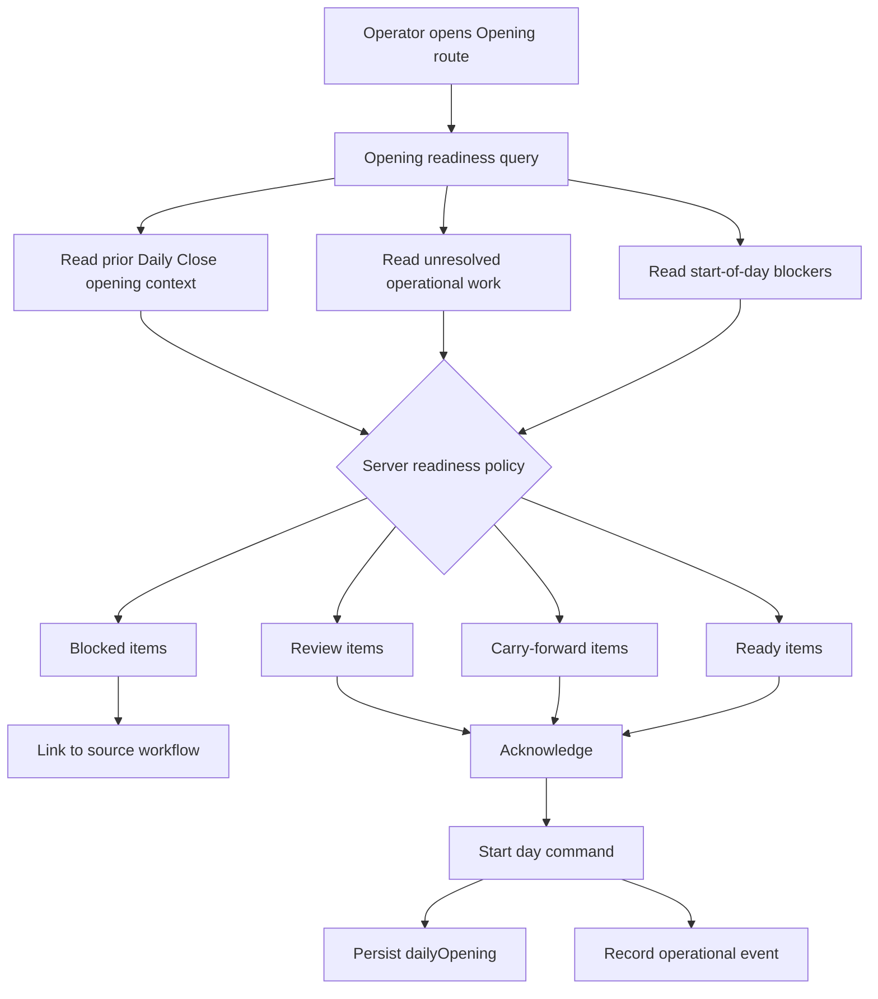

# feat: Build Opening MVP Store Readiness Gate

## Summary

Build Athena's Opening MVP as a store-day readiness gate that consumes the prior completed Daily Close, carries forward unresolved operational work, classifies start-of-day blockers and review items server-side, records operator acknowledgement/start-day, and exposes an operator-facing Operations route.

Opening is the morning counterpart to Daily Close. It confirms whether the store can begin the operating day, but it must not open POS drawers, create register sessions, correct opening floats, or replace Cash Controls.

---

## Problem Frame

Daily Close now creates the durable end-of-day record Athena needs: readiness state, summary facts, source subjects, reviewed items, carry-forward work items, and completion metadata. The next operational gap is the beginning of the next store day.

Without Opening, operators can enter POS or other workflows without one clear server-owned answer to: "Is the store ready to start today?" Carry-forward work may be visible in queues, but it is not framed as a start-of-day handoff. Opening needs to turn yesterday's Daily Close into today's readiness gate while keeping drawer/session actions in POS and Cash Controls.

---

## Requirements Traceability

Origin: `docs/brainstorms/2026-05-08-opening-mvp-store-readiness-gate-requirements.md`

- R1-R3: Opening is the start-of-day step in the Daily Operations Lifecycle, store-day scoped, and consumes prior Daily Close.
- R4-R6: Opening classifies readiness as ready, needs attention, or blocked, and explains readiness issues in operational language.
- R7-R9: Opening surfaces carry-forward work, allows acknowledgement without hiding unresolved status, and preserves traceability.
- R10-R12: Opening records actor/time/outcome and makes the store trading-readiness status explicit.
- R13-R15: Opening must link to POS/Cash Controls where needed but cannot duplicate drawer, cash, register-session, or closeout sources of truth.
- AE1-AE6: Cover clean prior close, carry-forward acknowledgement, incomplete prior close, drawer workflow separation, actor attribution, and missing prior close behavior.

---

## Scope Boundaries

- Do not open drawers, create `registerSession` records, or set opening float.
- Do not duplicate Cash Controls dashboards or register closeout workflows.
- Do not approve variance reviews, payment corrections, stock adjustments, or other domain approvals from Opening.
- Do not build a full Daily Operations dashboard; this plan adds the Opening MVP route and durable start-day record.
- Do not add scheduling, staffing, timeclock, payroll, forecasting, or BI reporting.
- Do not hide blockers in React-only state; server-side readiness owns the policy.

### Deferred to Follow-Up Work

- Add a unified Daily Operations dashboard that shows Opening, active day, and Daily Close state together.
- Add richer store timezone/day-boundary configuration if operating-day policy expands beyond the current local range pattern.
- Add manager approval policy for exceptional start-day override if the business wants blocked-day override workflows.
- Add reporting that compares prior close carry-forward items against opening acknowledgement and same-day resolution.
- Add notifications or task assignments for carry-forward items that remain open after Opening.

---

## Context & Research

### Existing Daily Close Foundation

- `packages/athena-webapp/convex/operations/dailyClose.ts` already builds Daily Close snapshots, persists completed close records, records operational events, and exposes `getDailyCloseOpeningContextWithCtx`.
- `packages/athena-webapp/convex/schemas/operations/dailyClose.ts` stores `readiness`, `summary`, `sourceSubjects`, `carryForwardWorkItemIds`, reviewed keys, notes, and completion metadata.
- `packages/athena-webapp/convex/schema.ts` already defines `dailyClose` indexes for store/date, store/status, current state, and store/status/date access.
- `packages/athena-webapp/src/components/operations/DailyCloseView.tsx` shows the current operations page structure, protected admin states, bucketed readiness UI, command-result handling, and route-link conventions.
- `packages/athena-webapp/src/routes/_authed/$orgUrlSlug/store/$storeUrlSlug/operations/daily-close.tsx` is the route pattern to mirror.

### Related Operational Rails

- `packages/athena-webapp/convex/operations/operationalWorkItems.ts` is the carry-forward/open-work rail.
- `packages/athena-webapp/convex/schemas/operations/operationalWorkItem.ts` already stores work-item type, status, priority, assignment, metadata, and timestamps.
- `packages/athena-webapp/convex/operations/operationalEvents.ts` is the audit/timeline rail for lifecycle events.
- `packages/athena-webapp/convex/cashControls/closeouts.ts` and `packages/athena-webapp/convex/operations/registerSessions.ts` own drawer and register-session lifecycle.
- `packages/athena-webapp/convex/pos/application/openDrawer.ts` owns POS drawer opening behavior and must remain separate.
- `packages/athena-webapp/src/components/operations/OperationsQueueView.tsx` provides open-work and approvals presentation patterns.
- `packages/athena-webapp/src/components/app-sidebar.tsx` already links Operations subroutes including Daily Close.

### Institutional Learnings

- `docs/solutions/logic-errors/athena-daily-close-store-day-boundary-2026-05-07.md`: Opening should read prior completed Daily Close and unresolved carry-forward work rather than rebuilding yesterday from live state.
- `docs/solutions/logic-errors/athena-pos-drawer-invariants-at-command-boundaries-2026-04-24.md`: UI gates are ergonomic only; drawer/POS invariants belong to command boundaries.
- `docs/solutions/logic-errors/athena-command-approval-policy-boundary-2026-05-01.md`: if Opening later needs approval, return `approval_required` from the command and consume a bound proof server-side.

---

## Key Technical Decisions

- **Create a dedicated Opening domain surface:** Add `dailyOpening` persistence and `dailyOpening.ts` operations rather than extending `dailyClose` into a two-way lifecycle object.
- **Reuse Daily Close's handoff contract:** Opening should call or share helpers with `getDailyCloseOpeningContextWithCtx` for prior close and carry-forward work.
- **Keep readiness server-owned:** React renders buckets returned by Convex; it does not decide whether the store can start.
- **Persist the acknowledgement:** Store-day start must be durable and idempotent for a store/date, not a transient checkbox.
- **Scope links, not actions:** Opening links to Cash Controls, approvals, open work, and Daily Close details. It does not perform those workflows.
- **Use operational events for audit:** Record a daily-opening lifecycle event with acknowledgement metadata through `operationalEvents`.
- **Match Daily Close UI language:** Use the same page-level operations rhythm, protected admin states, bucketed work presentation, and command-result handling.

---

## Open Questions

### Resolved During Planning

- **Should Opening open POS drawers?** No. Drawer opening stays in POS/Cash Controls.
- **Should Opening duplicate Cash Controls?** No. It should link to drawer/session detail when a blocker belongs there.
- **Should Opening infer readiness in the browser?** No. The Convex query and mutation own readiness policy.
- **Should Opening recompute the prior day from raw facts?** No. It should consume completed Daily Close and carry-forward work, then add only start-of-day checks required for readiness.

### Deferred to Implementation

- Exact table name can be `dailyOpening` unless schema conventions suggest a better lifecycle name.
- Exact route slug should be chosen during implementation, with a bias toward `operations/opening`.
- Whether a missing prior Daily Close is always a blocker or only a blocker when prior-day activity/carry-forward exists should be finalized in tests.
- Whether start-day acknowledgement needs manager approval can remain a future policy unless current product rules require it.

---

## High-Level Technical Design

> This illustrates the intended approach and is directional guidance for review, not implementation specification. The implementing agent should treat it as context, not code to reproduce.

---

## Implementation Units

- U1. **Add Daily Opening schema and indexes**

**Goal:** Persist one start-day acknowledgement per store operating date.

**Requirements:** R1, R2, R10, R11, R12

**Dependencies:** None

**Files:**
- Modify: `packages/athena-webapp/convex/schema.ts`
- Create: `packages/athena-webapp/convex/schemas/operations/dailyOpening.ts`
- Modify: `packages/athena-webapp/convex/schemas/operations/index.ts`
- Test: `packages/athena-webapp/convex/operations/dailyOpening.test.ts`
- Test: `packages/athena-webapp/convex/operations/operationsQueryIndexes.test.ts`

**Approach:**
- Add a `dailyOpening` table keyed by `storeId`, `organizationId`, `operatingDate`, and status.
- Store `priorDailyCloseId`, readiness counts/status, source subjects, carry-forward work item IDs, reviewed item keys, optional notes, actor IDs, `startedAt`, `createdAt`, and `updatedAt`.
- Add indexes for store/date, store/status, and store/status/date.
- Keep the persisted record focused on opening outcome and traceability, not duplicated Daily Close summary blobs.

**Test scenarios:**
- Happy path: creates one opening record for a store/date.
- Edge case: duplicate start-day command is idempotent or returns an already-started result.
- Edge case: opening can link to prior Daily Close and carry-forward work items.
- Error path: opening creation rejects missing store or mismatched organization context.
- Index coverage: schema exposes store/date and store/status/date access patterns.

**Verification:**
- `bun run --filter '@athena/webapp' test -- convex/operations/dailyOpening.test.ts convex/operations/operationsQueryIndexes.test.ts`

---

- U2. **Build Opening readiness snapshot query**

**Goal:** Return a server-classified Opening snapshot for the selected store day.

**Requirements:** R3, R4, R5, R6, R7, R9, R12, R14, R15

**Dependencies:** U1

**Files:**
- Create: `packages/athena-webapp/convex/operations/dailyOpening.ts`
- Modify: `packages/athena-webapp/convex/operations/dailyClose.ts`
- Modify: `packages/athena-webapp/convex/operations/operationalWorkItems.ts`
- Test: `packages/athena-webapp/convex/operations/dailyOpening.test.ts`

**Approach:**
- Reuse `getDailyCloseOpeningContextWithCtx` for prior completed close and carry-forward items.
- Classify blockers such as unresolved prior-close handoff, prior-day register/session blockers that still require Cash Controls action, pending approval blockers, and invalid operating date/range.
- Classify review items such as prior close notes, prior exceptions, zero-activity close context, and carry-forward work that can be acknowledged.
- Classify ready items such as prior completed close found, no hard blockers, and required handoff reviewed.
- Include source subjects and link descriptors to Daily Close, Cash Controls, approvals, and open work.
- Keep first-slice missing-prior-close behavior explicit in tests instead of leaving it implicit in UI copy.

**Test scenarios:**
- Happy path: ready store day with completed prior close and no carry-forward returns `ready`.
- Carry-forward: prior close with carry-forward work returns review/carry-forward items that require acknowledgement.
- Blocker: missing or blocked prior close returns `blocked` when unresolved prior-day activity exists.
- Blocker: pending closeout approval links to `operations/approvals` and blocks start.
- Preservation: prior carry-forward work remains queryable and does not get hidden in summary blobs.
- Error path: invalid operating date returns a safe blocker.

**Verification:**
- `bun run --filter '@athena/webapp' test -- convex/operations/dailyOpening.test.ts`

---

- U3. **Add start-day acknowledgement command**

**Goal:** Persist Opening only when command-time readiness permits it.

**Requirements:** R5, R8, R9, R10, R11, R12, R13, R15

**Dependencies:** U1, U2

**Files:**
- Modify: `packages/athena-webapp/convex/operations/dailyOpening.ts`
- Modify: `packages/athena-webapp/convex/operations/operationalEvents.ts`
- Test: `packages/athena-webapp/convex/operations/dailyOpening.test.ts`

**Approach:**
- Add a command-result mutation such as `startStoreDay`.
- Recompute readiness inside the mutation so stale clients cannot start a blocked day.
- Require acknowledged review/carry-forward keys for non-blocking handoff items.
- Persist the `dailyOpening` record with final readiness and source subjects.
- Record a daily-opening operational event.
- Return `user_error` for blockers, missing acknowledgements, store/org mismatch, or invalid date/range.
- Do not call drawer-opening, register-session, or cash-control mutations.

**Test scenarios:**
- Happy path: ready day starts and persists actor, timestamp, readiness, and source subjects.
- Carry-forward: day starts only after required item keys are acknowledged.
- Error path: blocked day returns `user_error` and writes no opening record.
- Error path: stale client fails when a new blocker appears after snapshot load.
- Idempotency: retry returns the existing opening record without duplicate operational events.
- Boundary: start-day command does not call or mutate POS drawer/register-session state.

**Verification:**
- `bun run --filter '@athena/webapp' test -- convex/operations/dailyOpening.test.ts`

---

- U4. **Build operator-facing Opening route and view**

**Goal:** Give operators a clear start-of-day gate under Operations.

**Requirements:** R1, R2, R4, R6, R7, R8, R12, R13, R14

**Dependencies:** U2, U3

**Files:**
- Create: `packages/athena-webapp/src/components/operations/DailyOpeningView.tsx`
- Create: `packages/athena-webapp/src/components/operations/DailyOpeningView.test.tsx`
- Create: `packages/athena-webapp/src/routes/_authed/$orgUrlSlug/store/$storeUrlSlug/operations/opening.tsx`
- Modify: `packages/athena-webapp/src/components/app-sidebar.tsx`

**Approach:**
- Mirror Daily Close's protected admin page pattern, page-level header, bucketed readiness layout, summary rail, skeletons, and inline command error handling.
- Render blockers as linkable source actions, not local fixes.
- Render review/carry-forward acknowledgement controls before enabling Start Day.
- Show an already-started state when `dailyOpening` exists.
- Keep copy operational and restrained per `docs/product-copy-tone.md`.

**Test scenarios:**
- Loading: page renders a skeleton matching final layout geometry.
- Permission: signed-out and protected-admin states match existing operations surfaces.
- Ready: ready state enables Start Day and shows the prior close handoff.
- Blocked: blocked state disables Start Day and renders source links.
- Carry-forward: carry-forward state requires acknowledgement before command submission.
- Completed: already-started state shows started actor/time and does not offer duplicate start.
- Safety: the route subscribes only after protected admin readiness is established.

**Verification:**
- `bun run --filter '@athena/webapp' test -- src/components/operations/DailyOpeningView.test.tsx`

---

- U5. **Wire route generation, generated clients, and harness coverage**

**Goal:** Ensure new route and Convex operations are discoverable and covered.

**Requirements:** R1, R10, R11, R12

**Dependencies:** U1, U2, U3, U4

**Files:**
- Regenerate: `packages/athena-webapp/src/routeTree.gen.ts`
- Refresh if needed: `packages/athena-webapp/convex/_generated/api.d.ts`
- Modify: `scripts/harness-app-registry.ts`
- Regenerate: `packages/athena-webapp/docs/agent/validation-map.json`
- Regenerate: `packages/athena-webapp/docs/agent/validation-guide.md`

**Approach:**
- Let route and Convex generated files be produced by repo tools.
- Add validation-map coverage for the new operation files, route, and component tests.
- Include the focused daily-opening tests in the mapped validation set.

**Test scenarios:**
- Harness review sees the new route, component, Convex operation, and schema files as covered.
- Browser import boundary remains clean; React code imports shared/browser-safe modules only.
- Generated route and Convex API artifacts match the new files.

**Verification:**
- `bun run harness:review`
- `bun run --filter '@athena/webapp' audit:convex`

---

## Sequencing

1. U1 adds schema/indexes and tests for `dailyOpening`.
2. U2 builds the server readiness snapshot from prior Daily Close and carry-forward work.
3. U3 adds the start-day command and operational event recording.
4. U4 builds the Opening route/view using Daily Close UI patterns.
5. U5 wires sidebar, generated artifacts, and harness validation coverage.

This sequence keeps the trust boundary server-first before adding UI and preserves the explicit separation from POS and Cash Controls.

---

## Validation Plan

Focused validation during implementation:

- `bun run --filter '@athena/webapp' test -- convex/operations/dailyOpening.test.ts convex/operations/dailyClose.test.ts convex/operations/operationsQueryIndexes.test.ts`
- `bun run --filter '@athena/webapp' test -- src/components/operations/DailyOpeningView.test.tsx src/components/operations/DailyCloseView.test.tsx src/components/operations/OperationsQueueView.test.tsx`

Final validation before merge:

- `bun run --filter '@athena/webapp' audit:convex`
- `bun run --filter '@athena/webapp' lint:convex:changed`
- `bunx tsc --noEmit -p packages/athena-webapp/tsconfig.json`
- `bun run --filter '@athena/webapp' build`
- `bun run harness:review`
- `bun run graphify:rebuild`
- `git diff --check`

Browser validation:

- Start the Athena webapp locally.
- Visit the Opening route for clean, carry-forward, blocked, and already-started states.
- Verify the page is usable on desktop and mobile widths.
- Verify links route back to Cash Controls, approvals, Daily Close, and open work as appropriate.
- Verify no Opening path collects opening float or opens a drawer.

---

## Risks

- **Scope creep into drawer opening:** Prevent by keeping POS/register-session mutations out of `dailyOpening.ts`.
- **Policy drift from Daily Close:** Share helper shapes where possible and test the handoff contract directly.
- **False blockers from missing prior close:** Tests must define when missing close is a blocker versus a clean first-day/no-activity case.
- **Unbounded Convex reads:** Add indexes when new readiness sources are introduced.
- **UI-only acknowledgement:** Command-time readiness and acknowledgement validation must be authoritative.
- **Generated artifact drift:** Route and Convex generated files need the repo-approved refresh path, not manual edits.

---

## Follow-Up Work

- Build the Active Day Operations surface on top of Opening state, live operational work, and Daily Close readiness.
- Add richer store timezone/day-boundary configuration if operating-day policy expands beyond the current local range pattern.
- Add manager approval policy for exceptional start-day override if the business wants blocked-day override workflows.
- Add reporting that compares prior close carry-forward items against opening acknowledgement and same-day resolution.
- Add notifications or task assignments for carry-forward items that remain open after Opening.
