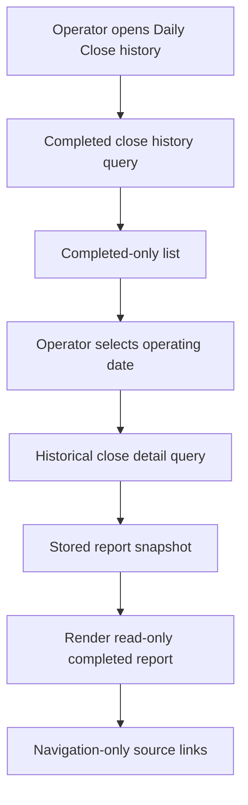

# feat: Add Historical Daily Close Records

## Summary

Add a read-only Operations history surface for completed End-of-Day Reviews. Operators can browse completed Daily Close records, open a historical report after the store has moved to a later operating day, and follow source evidence links without starting recovery or mutation workflows from history.

The implementation should preserve the completed report as a historical artifact. It should not rebuild old reports from current live state in a way that changes the meaning of the closed store-day record.

---

## Problem Frame

Daily Close already creates a durable store-day close record when End-of-Day Review completes. The active Daily Close workspace can show a completed report immediately after close, but there is no dedicated place to retrieve prior completed reports once operators move into a later store day.

The missing capability is retrieval, not recovery. V1 should make completed reports accessible as historical records while excluding incomplete, missed, blocked, active, draft, and recoverable days.

---

## Requirements Traceability

Origin: `docs/brainstorms/2026-05-09-historical-daily-close-records-requirements.md`

- R1-R5: Provide a completed-only Daily Close history list with useful scan signals and an empty state.
- R6-R10: Let operators open a completed close report in historical read-only mode with close metadata and report content.
- R11-R14: Keep history non-mutating; source links are navigation only, and Opening Handoff recovery behavior remains separate.
- AE1-AE6: Cover completed records, omitted missing days, read-only detail, navigation-only evidence links, empty history, and preserved historical meaning.

---

## Scope Boundaries

- Do not show incomplete, missed, blocked, active, draft, or recoverable store days in V1.
- Do not add start, resume, complete, acknowledge, recover, reopen, edit, repair, or correction actions to history.
- Do not implement missed-prior-close recovery from Opening Handoff.
- Do not add trend analytics, forecasting, reconciliation exports, or a generic audit-log explorer.
- Do not replace Daily Close, Daily Opening, Cash Controls, approvals, POS, or operations queue ownership.
- Do not rely on live recomputation as the source of truth for historical report meaning.

---

## Context & Research

### Existing Daily Close Foundation

- `packages/athena-webapp/convex/operations/dailyClose.ts` builds the live Daily Close snapshot, completes the close, persists a `dailyClose` record, marks the current close, and records operational events.
- `packages/athena-webapp/convex/schemas/operations/dailyClose.ts` currently stores status, readiness, summary, source subjects, carry-forward work item ids, reviewed keys, notes, and completion metadata.
- `packages/athena-webapp/convex/schema.ts` already has `dailyClose.by_storeId_status_operatingDate`, which fits completed-history listing by store.
- `packages/athena-webapp/src/components/operations/DailyCloseView.tsx` contains the existing report presentation, bucketed item rendering, source-link behavior, completed-close rail, money display helpers, and protected admin page states.
- `packages/athena-webapp/src/routes/_authed/$orgUrlSlug/store/$storeUrlSlug/operations/daily-close.tsx` is the active route pattern to mirror for a history route.
- `packages/athena-webapp/src/components/app-sidebar.tsx` already links Operations subroutes and should expose the history surface when the route lands.

### Important Constraint

The current persisted `dailyClose` record does not store the full bucketed report item content shown in the active review workspace. It stores summary, source subjects, carry-forward work item ids, reviewed keys, notes, and completion metadata. Since the requirements call for historical reports to preserve completed meaning, implementation should persist a close report snapshot at completion time before building the historical detail experience.

No backward-compatibility behavior is required for older completed records that lack the new snapshot. This plan defines the going-forward behavior for completed Daily Close records after the feature lands.

### Institutional Learnings

- `docs/solutions/logic-errors/athena-daily-close-store-day-boundary-2026-05-07.md`: Daily Close is a durable store-day boundary; do not treat it as a UI-only checklist or Cash Controls detail view.
- `docs/solutions/logic-errors/athena-operational-review-list-pagination-and-money-display-2026-05-08.md`: operational review lists should stay scannable, use stable page state where useful, and render stored money values with minor-unit-aware helpers.
- `docs/solutions/logic-errors/athena-daily-operations-aggregate-read-model-2026-05-08.md`: Operations overview surfaces should aggregate and link to source workflows without owning their commands.
- `docs/solutions/logic-errors/athena-operations-workspace-links-and-inventory-availability-2026-05-08.md`: summary links should preserve origin context and carry meaningful navigation context into destination workflows.

---

## Key Technical Decisions

- **Persist a historical report snapshot on completion:** The completed close record should retain the report content needed by history instead of depending on current live data to recreate past meaning.
- **Completed-only list:** History queries should use completed `dailyClose` records only and should not synthesize missing days.
- **Read-only detail:** Historical detail can reuse presentation helpers from Daily Close, but completion controls, acknowledgement controls, and editable notes must not appear.
- **Navigation-only evidence links:** Source links may carry origin context to owning workflows, but no command runs from the history surface.
- **Snapshot-backed history only:** Historical detail should rely on the persisted completed-report snapshot going forward, with no special legacy fallback requirement.
- **No new audit events for reads:** This feature adds read-only retrieval. Existing `daily_close_completed` events remain the audit trail for the close itself.

---

## Open Questions

### Resolved During Planning

- **Should V1 include incomplete days?** No. Completed Daily Close records only.
- **Should history be actionable?** No. History is read-only and links out for evidence only.
- **Should history handle Opening Handoff missing-prior-close recovery?** No. Opening behavior stays separate.
- **Should historical detail live-recompute from current source workflows?** No. It should use stored completed report content wherever available.

### Deferred to Implementation

- Exact route slug should be chosen during implementation, with a bias toward `operations/daily-close-history` or `operations/end-of-day-history`.
- Exact first-page size should follow the existing list-pagination pattern and available query shape.
- Exact empty/error copy for unavailable report snapshots should be finalized in UI tests only if implementation needs a defensive unavailable state.

---

## High-Level Technical Design

> This illustrates the intended approach and is directional guidance for review, not implementation specification. The implementing agent should treat it as context, not code to reproduce.

---

## Implementation Units

- U1. **Persist completed Daily Close report snapshots**

**Goal:** Ensure newly completed Daily Close records preserve enough report content for future read-only historical review.

**Requirements:** R6, R7, R8, R9, R13

**Dependencies:** None

**Files:**
- Modify: `packages/athena-webapp/convex/schemas/operations/dailyClose.ts`
- Modify: `packages/athena-webapp/convex/schema.ts`
- Modify: `packages/athena-webapp/convex/operations/dailyClose.ts`
- Test: `packages/athena-webapp/convex/operations/dailyClose.test.ts`
- Test: `packages/athena-webapp/convex/operations/operationsQueryIndexes.test.ts`

**Approach:**
- Extend the completed close record with a report snapshot shape that captures the closed report sections needed by history: close metadata, readiness, summary, reviewed exceptions, carry-forward context, ready evidence, and source subjects.
- Build the snapshot from the command-time Daily Close snapshot immediately before completion persists.
- Keep the snapshot focused on operator-readable historical report content; avoid embedding mutable source records wholesale.
- Preserve current completion behavior, approval requirements, carry-forward work creation, and operational events.
- Treat the snapshot as required going forward for historical detail records.

**Execution posture:** test-first

**Observability posture:** None -- this unit extends the existing completed close record but does not add a new workflow mutation beyond the existing Daily Close completion command and its `daily_close_completed` event.

**Test scenarios:**
- Happy path: completing Daily Close stores report snapshot content alongside summary and completion metadata.
- Preservation: historical snapshot item content is retained on the completed record and does not depend on later source mutations.
- Regression: completion still requires approval proof and still records existing `daily_close_completed` operational event.
- Index coverage: existing completed-record indexes still support the planned history queries.

**Verification:**
- `bun run --filter '@athena/webapp' test -- convex/operations/dailyClose.test.ts convex/operations/operationsQueryIndexes.test.ts`

---

- U2. **Add completed Daily Close history query contract**

**Goal:** Provide server-owned read models for completed close history list and historical close detail.

**Requirements:** R1, R2, R3, R4, R5, R6, R8, R9, R13, R14

**Dependencies:** U1

**Files:**
- Modify: `packages/athena-webapp/convex/operations/dailyClose.ts`
- Test: `packages/athena-webapp/convex/operations/dailyClose.test.ts`

**Approach:**
- Add a completed-only history list query scoped to store.
- Return records ordered newest first using the existing store/status/date index.
- Include list-card fields that let operators identify a report without opening every record: operating date, completion time, closer when available, readiness counts, core totals, variance, expenses, and carry-forward count where stored.
- Add a historical detail query that returns the stored report snapshot for completed records.
- Do not synthesize incomplete days or return active/open close records.
- Keep source links as data for navigation, not command descriptors.

**Execution posture:** test-first

**Observability posture:** None -- read-only queries do not mutate durable state and the existing close completion audit event remains the authoritative lifecycle record.

**Test scenarios:**
- Happy path: list query returns completed records newest first with summary fields.
- Filter path: open/incomplete daily close rows are excluded.
- Empty path: no completed records returns an empty list, not a recovery state.
- Detail path: completed record with report snapshot returns read-only report content.
- Ownership path: store-scoped query does not return completed records from another store.

**Verification:**
- `bun run --filter '@athena/webapp' test -- convex/operations/dailyClose.test.ts`

---

- U3. **Build read-only Daily Close history UI**

**Goal:** Add the operator-facing history list and historical detail experience under Operations.

**Requirements:** R1, R2, R3, R4, R5, R6, R7, R8, R9, R10, R11, R12, R14

**Dependencies:** U1, U2

**Files:**
- Create: `packages/athena-webapp/src/components/operations/DailyCloseHistoryView.tsx`
- Modify: `packages/athena-webapp/src/components/operations/DailyCloseView.tsx`
- Modify: `packages/athena-webapp/src/components/app-sidebar.tsx`
- Create: `packages/athena-webapp/src/routes/_authed/$orgUrlSlug/store/$storeUrlSlug/operations/daily-close-history.tsx`
- Modify: `packages/athena-webapp/src/routeTree.gen.ts`
- Test: `packages/athena-webapp/src/components/operations/DailyCloseHistoryView.test.tsx`
- Test: `packages/athena-webapp/src/components/operations/DailyCloseView.test.tsx`
- Test: `packages/athena-webapp/src/routeTree.browser-boundary.test.ts`

**Approach:**
- Add a history route under the existing Operations/Daily Close area.
- Use the shared Operations page rhythm: `View`, `PageLevelHeader`, `PageWorkspace`, protected admin states, empty state, and existing money display helpers.
- Render a completed-only list with scan-friendly summary fields and pagination or a bounded recent list.
- Render historical detail in read-only mode, reusing Daily Close report presentation helpers where practical.
- Remove or hide all completion controls, acknowledgement controls, editable notes, and command messages in historical detail.
- Preserve source links with origin context so navigation can return to history.
- Add sidebar or Daily Close workspace affordance so operators can find history after a new day starts.

**Execution posture:** test-first

**Observability posture:** None -- this is read-only UI and navigation over existing historical records.

**Test scenarios:**
- Happy path: completed records render in history with operating date and summary fields.
- Detail path: selecting a completed record renders read-only historical report content and close metadata.
- Exclusion path: incomplete/open rows from mocked query data are not displayed.
- Empty path: no completed records renders the approved empty state.
- Boundary path: historical detail does not render completion button, carry-forward checkboxes, editable notes, or command approval controls.
- Navigation path: source links preserve origin context and route to owning workflows.
- Access path: protected admin loading, signed-out, and no-permission states match existing Operations behavior.

**Verification:**
- `bun run --filter '@athena/webapp' test -- src/components/operations/DailyCloseHistoryView.test.tsx src/components/operations/DailyCloseView.test.tsx src/routeTree.browser-boundary.test.ts`

---

- U4. **Refresh operations harness and durable docs**

**Goal:** Keep Athena's repo sensors and durable knowledge aligned with the new historical Daily Close capability.

**Requirements:** Supports all requirements through validation and discoverability

**Dependencies:** U1, U2, U3

**Files:**
- Modify: `scripts/harness-app-registry.ts`
- Modify: `scripts/harness-app-registry.test.ts`
- Modify: `scripts/harness-audit.test.ts`
- Create: `docs/solutions/logic-errors/athena-daily-close-history-snapshots-2026-05-09.md`
- Generated after code changes: `graphify-out/GRAPH_REPORT.md`, `graphify-out/graph.json`, `graphify-out/wiki/index.md`

**Approach:**
- Add the new history route/component/query coverage to the existing Daily store operations lifecycle harness entry.
- Update harness tests so focused validation knows about the history route, component, and expected test file.
- Capture a solution note about preserving completed close report snapshots instead of recomputing history from live state.
- Rebuild Graphify after code changes as required by repo instructions.

**Execution posture:** sensor-only

**Observability posture:** None -- this unit updates validation and durable documentation only.

**Test scenarios:**
- Harness registry includes the historical Daily Close route/component/query tests in Daily store operations lifecycle validation.
- Harness audit recognizes the new route/component as covered.
- Graphify artifacts rebuild cleanly after code modifications.

**Verification:**
- `bun run harness:audit`
- `bun run harness:test`
- `bun run graphify:rebuild`
- `bun run graphify:check`
- `bun run pr:athena`

---

## Cross-Unit Validation

- Focused backend: `bun run --filter '@athena/webapp' test -- convex/operations/dailyClose.test.ts convex/operations/operationsQueryIndexes.test.ts`
- Focused frontend: `bun run --filter '@athena/webapp' test -- src/components/operations/DailyCloseHistoryView.test.tsx src/components/operations/DailyCloseView.test.tsx src/routeTree.browser-boundary.test.ts`
- Daily operations harness subset: `bun run --filter '@athena/webapp' test -- convex/operations/dailyOperations.test.ts convex/operations/dailyOpening.test.ts convex/operations/dailyClose.test.ts convex/operations/operationsQueryIndexes.test.ts src/components/operations/DailyOperationsView.test.tsx src/components/operations/DailyOpeningView.test.tsx src/components/operations/DailyCloseView.test.tsx src/components/operations/DailyCloseHistoryView.test.tsx`
- Changed-code sensors: `bun run --filter '@athena/webapp' audit:convex`, `bun run --filter '@athena/webapp' lint:convex:changed`, `bun run --filter '@athena/webapp' lint:frontend:changed`, `bunx tsc --noEmit -p packages/athena-webapp/tsconfig.json`
- Full PR gate: `bun run pr:athena`

---

## Dependency Map

- U1 must land before U2 and U3 because history detail needs stored report content.
- U2 must land before U3 because the UI needs list/detail query contracts.
- U4 should land with or after the implementation units because it records the final validation surface.

The code units touch shared generated artifacts and route output, so execution can keep Linear tickets separate while using a single integration PR after the implementation batch to regenerate route tree and Graphify once.
