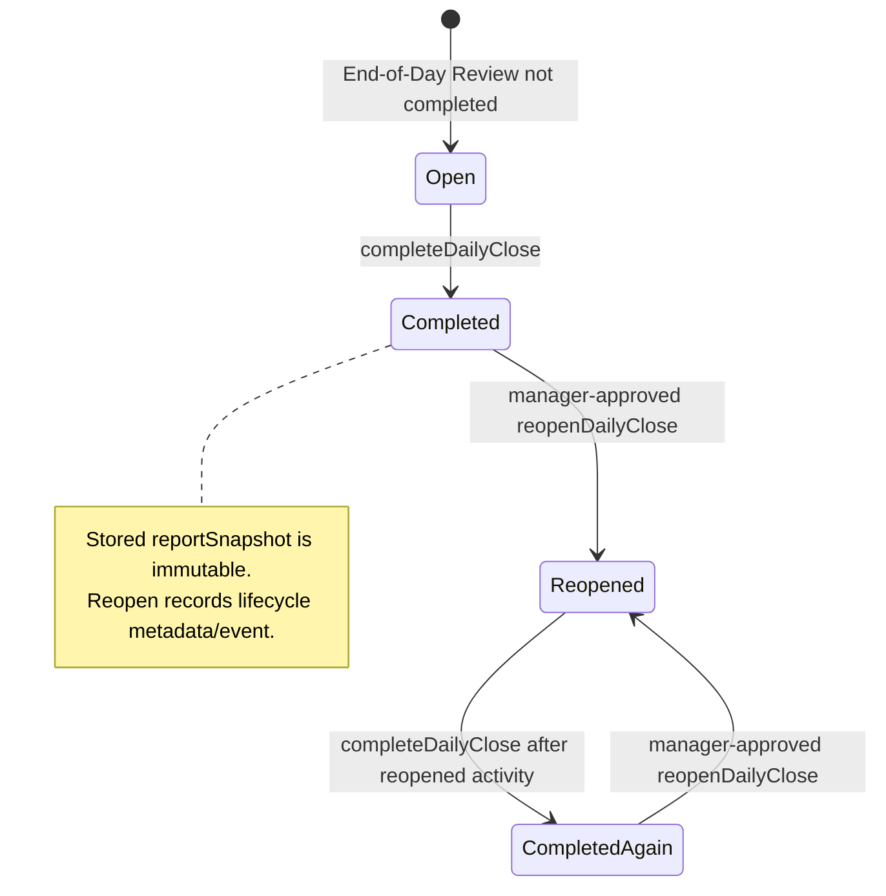
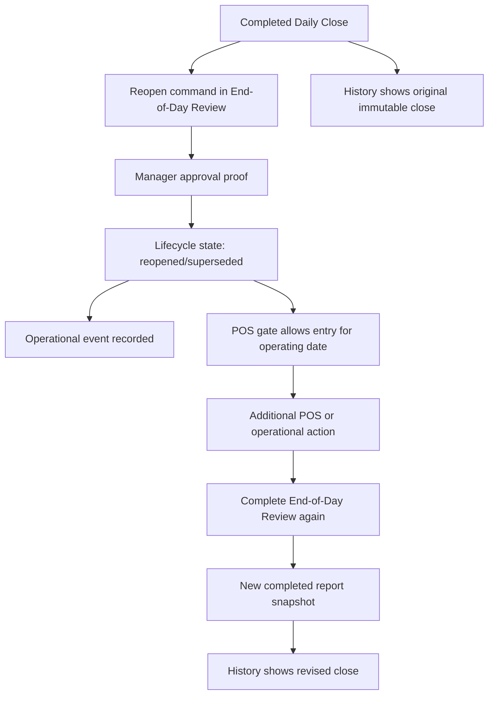

# feat: Add Daily Close reopen lifecycle

## Summary

Add an explicit, manager-approved reopen lifecycle for completed End-of-Day Reviews. The completed Daily Close report snapshot remains immutable audit evidence; reopening records a new lifecycle event, restores POS access for the operating date, and allows a later revised close to produce a new completed snapshot.

---

## Problem Frame

Daily Close now persists the store-day report that operators and owners use as the trustworthy record of what was reviewed at close time. When a closed operating day needs additional action, Athena needs a way to reopen work without rewriting that completed report or letting POS ignore the closed-day boundary.

---

## Requirements

- R1. Completed Daily Close report snapshots must remain immutable after completion.
- R2. Reopening a completed operating day must be a manager-approved command at the operations layer.
- R3. Reopening must record who reopened the day, when, why, and which completed close was reopened.
- R4. Reopened activity must not mutate the original completed close snapshot; any later close must create or persist a distinct revised close record/snapshot.
- R5. POS entry must follow the active store-day lifecycle state: closed days are blocked, reopened days are allowed if Opening Handoff is started.
- R6. Daily Operations, End-of-Day Review, and Daily Close History must show reopened/superseded close state clearly without turning history into an edit surface.
- R7. The reopen lifecycle must preserve existing Daily Opening, carry-forward, approval, and operational event boundaries.

**Origin actors:** A1 Operator, A2 Owner or manager, A3 Staff member, A4 Athena
**Origin flows:** F1 Daily close readiness review, F2 Exception review and carry-forward, F3 Close completion and daily summary, F4 Future opening handoff
**Origin acceptance examples:** AE1, AE2, AE3, AE4

---

## Scope Boundaries

- Do not edit or delete `dailyClose.reportSnapshot` for a completed close.
- Do not implement a historical report editor.
- Do not reopen from POS; POS only consumes the store-day lifecycle gate.
- Do not close or resolve carry-forward work automatically during reopen.
- Do not replace Cash Controls closeout reopen behavior; register-session reopen remains drawer/session scoped.
- Do not add a generic audit-log explorer or analytics report.

### Deferred to Follow-Up Work

- Rich diffing between the original completed close and the revised close can follow after the core lifecycle exists.
- Notifications for reopened days can follow once the operational event shape is proven.

---

## Context & Research

### Relevant Code and Patterns

- `packages/athena-webapp/convex/operations/dailyClose.ts` owns `buildDailyCloseSnapshotWithCtx`, `completeDailyCloseWithCtx`, stored report snapshot normalization, history queries, `isCurrent`, and completion operational events.
- `packages/athena-webapp/convex/schemas/operations/dailyClose.ts` stores `status`, `isCurrent`, completion metadata, `reportSnapshot`, carry-forward IDs, reviewed keys, and summary data.
- `packages/athena-webapp/convex/operations/dailyOpening.ts` starts the store day by re-reading server readiness, persisting `dailyOpening`, and recording an operational event.
- `packages/athena-webapp/convex/operations/approvalActions.ts` centralizes approval action identities, including Daily Close completion and register-session reopen.
- `packages/athena-webapp/src/components/operations/DailyCloseView.tsx` is the End-of-Day Review workspace and command surface for completion.
- `packages/athena-webapp/src/components/operations/DailyCloseHistoryView.tsx` lists completed close records and renders stored snapshots read-only.
- `packages/athena-webapp/src/components/operations/DailyOperationsView.tsx` presents current and historical store-day lifecycle state.
- `packages/athena-webapp/src/components/pos/register/POSRegisterOpeningGuard.tsx` gates POS entry using Opening Handoff and End-of-Day Review state.

### Institutional Learnings

- `docs/solutions/logic-errors/athena-daily-close-store-day-boundary-2026-05-07.md`: Daily Close is store-day scoped, revalidates command-time readiness, requires manager approval, and preserves completed summaries.
- `docs/solutions/logic-errors/athena-daily-close-history-snapshots-2026-05-09.md`: completed Daily Close history must serve stored report snapshots rather than recomputing historical reports from live state.
- `docs/solutions/logic-errors/athena-store-ops-workspace-state-boundaries-2026-05-09.md`: terminal store operations states are presentation boundaries; completed views should not let stale live blockers drive primary UI.
- `docs/solutions/logic-errors/athena-daily-opening-readiness-gate-2026-05-08.md`: Opening is a store-day acknowledgement record and should not mutate drawers, register sessions, or carry-forward work.

### External References

- None. The work extends Athena's existing Convex, command-result, approval, operational event, Daily Close, Daily Opening, and POS gate patterns.

---

## Key Technical Decisions

- **Snapshot immutability:** Treat `dailyClose.reportSnapshot` as frozen audit payload once the close is completed. Reopen state may be represented by lifecycle fields or related records, but not by editing the stored report content.
- **Reopen is a new lifecycle transition:** Add a manager-approved reopen command that records an operational event and advances the active lifecycle state for the operating date.
- **Prefer explicit lifecycle state over absence checks:** POS and operations surfaces should ask whether the current close is actively completed, reopened, or superseded rather than treating any completed close for the date as a hard block forever.
- **Revised close creates a new audit point:** After reopen and additional action, completing End-of-Day Review again should produce a new completed snapshot. The original completed snapshot remains available in history as superseded/reopened evidence.
- **Operations owns reopen:** The End-of-Day Review workspace owns the reopen command. POS, history, and Daily Operations consume the resulting state.

---

## Open Questions

### Resolved During Planning

- **Should reopening mutate the recorded close?** No. The completed report snapshot remains immutable.
- **Should POS be allowed to reopen a day implicitly?** No. POS only respects the lifecycle state written by End-of-Day Review.
- **Should register-session closeout reopen be reused?** No. That command is drawer/session scoped; this plan adds store-day reopen.

### Deferred to Implementation

- Exact schema shape can be either additional lifecycle fields on `dailyClose` or a small related reopen record. The implementation should choose the smaller shape that preserves immutable snapshots and query simplicity.
- Exact labels for reopened and superseded close records should be finalized with existing operator copy patterns.
- Whether a second completion updates `isCurrent` on the original close or creates a new current close row should be finalized in backend tests before UI work.

---

## High-Level Technical Design

> *This illustrates the intended approach and is directional guidance for review, not implementation specification. The implementing agent should treat it as context, not code to reproduce.*

---

## Implementation Units

- U1. **Model immutable reopen lifecycle**

**Goal:** Add the durable backend state needed to represent reopened/superseded Daily Close records without editing completed report snapshots.

**Requirements:** R1, R3, R4, R7

**Dependencies:** None

**Files:**
- Modify: `packages/athena-webapp/convex/schemas/operations/dailyClose.ts`
- Modify: `packages/athena-webapp/convex/schema.ts`
- Modify: `packages/athena-webapp/convex/operations/dailyClose.ts`
- Test: `packages/athena-webapp/convex/operations/dailyClose.test.ts`
- Test: `packages/athena-webapp/convex/operations/operationsQueryIndexes.test.ts`

**Approach:**
- Extend the Daily Close lifecycle so a completed close can be marked reopened or superseded while its `reportSnapshot` stays unchanged.
- Preserve store/date/current lookup semantics for the active close state.
- Make the active close state queryable without scanning all completed historical records.
- Ensure historical completed records remain listable and distinguishable from the active reopened state.

**Execution note:** Characterization-first. Capture current behavior where a completed close with `reportSnapshot` is served as completed before changing lifecycle semantics.

**Patterns to follow:**
- `packages/athena-webapp/convex/operations/dailyClose.ts`
- `packages/athena-webapp/convex/operations/operationsQueryIndexes.test.ts`
- `docs/solutions/logic-errors/athena-daily-close-history-snapshots-2026-05-09.md`

**Test scenarios:**
- Happy path: a completed close keeps the exact stored `reportSnapshot` after it is marked reopened or superseded.
- Happy path: active close lookup returns a reopened lifecycle state for the operating date instead of treating the old completed snapshot as the only current state.
- Edge case: a store with multiple completed closes for one operating date identifies the current/revised close deterministically.
- Error path: lifecycle state cannot be changed for a close belonging to another store.
- Index coverage: schema exposes any new lookup needed for current active lifecycle state.

**Verification:**
- Daily Close backend tests prove immutable snapshot behavior, active-state lookup, and index coverage.

---

- U2. **Add manager-approved reopen command**

**Goal:** Add the command boundary that reopens a completed End-of-Day Review with manager approval, reason capture, idempotency, and operational audit.

**Requirements:** R2, R3, R4, R7

**Dependencies:** U1

**Files:**
- Modify: `packages/athena-webapp/convex/operations/approvalActions.ts`
- Modify: `packages/athena-webapp/convex/operations/dailyClose.ts`
- Modify: `packages/athena-webapp/shared/commandResult.ts` if existing result typing needs extension
- Test: `packages/athena-webapp/convex/operations/dailyClose.test.ts`
- Test: `packages/athena-webapp/convex/operations/approvalRequests.test.ts` if approval subject coverage changes

**Approach:**
- Add a `dailyCloseReopen` approval action identity.
- Add a `reopenDailyClose` command that validates store ownership, operating date, completed-close state, manager approval proof, and a required reason/note.
- Consume approval proof server-side and record `daily_close_reopened` as an operational event with close id, operating date, approved manager staff profile, reason, and prior completion metadata.
- Make repeated reopen attempts idempotent when the day is already reopened, while rejecting attempts for missing, open, or unrelated close records.

**Execution note:** Test-first for the new command behavior.

**Patterns to follow:**
- `completeDailyCloseWithCtx` in `packages/athena-webapp/convex/operations/dailyClose.ts`
- `startStoreDayWithCtx` in `packages/athena-webapp/convex/operations/dailyOpening.ts`
- `consumeCommandApprovalProofWithCtx` in `packages/athena-webapp/convex/operations/approvalActions.ts`

**Test scenarios:**
- Happy path: completed close plus valid manager approval proof reopens the day, records lifecycle metadata, and emits an operational event.
- Approval path: missing proof returns `approval_required` with a Daily Close reopen subject.
- Error path: invalid proof or insufficient manager role fails without changing close state.
- Error path: reopening an open, missing, or other-store close returns a user error without side effects.
- Idempotency: repeating reopen after success returns already-reopened state without duplicating audit events.
- Audit path: operational event metadata includes close id, operating date, reason, actor, and approval proof id.

**Verification:**
- Backend command tests prove approval enforcement, idempotency, immutable snapshot preservation, and audit event creation.

---

- U3. **Update store-day read models and POS gate**

**Goal:** Teach Daily Close, Daily Operations, Daily Opening context, and POS entry to consume the reopened lifecycle state correctly.

**Requirements:** R4, R5, R6, R7

**Dependencies:** U1, U2

**Files:**
- Modify: `packages/athena-webapp/convex/operations/dailyClose.ts`
- Modify: `packages/athena-webapp/convex/operations/dailyOperations.ts`
- Modify: `packages/athena-webapp/convex/operations/dailyOpening.ts`
- Modify: `packages/athena-webapp/src/components/pos/register/POSRegisterOpeningGuard.tsx`
- Test: `packages/athena-webapp/convex/operations/dailyClose.test.ts`
- Test: `packages/athena-webapp/convex/operations/dailyOperations.test.ts`
- Test: `packages/athena-webapp/convex/operations/dailyOpening.test.ts`
- Test: `packages/athena-webapp/src/components/pos/register/POSRegisterOpeningGuard.test.tsx`

**Approach:**
- Return a clear reopened lifecycle state from `getDailyCloseSnapshot` for the active operating date.
- Keep completed/superseded stored snapshots available for history, but do not use superseded completion alone to block POS.
- Update Daily Operations lifecycle cards and timeline inputs so reopened days communicate that End-of-Day Review was reopened and needs a revised close.
- Ensure Opening Handoff does not treat a reopened prior close as an ordinary clean prior close unless the active lifecycle has completed again.
- Update the POS gate so `completed` blocks entry, `reopened` allows entry when Opening Handoff has started, and loading states wait for both opening and close snapshots.

**Execution note:** Characterization-first around current completed-close snapshot behavior and POS closed-day gating.

**Patterns to follow:**
- `packages/athena-webapp/src/components/pos/register/POSRegisterOpeningGuard.tsx`
- `packages/athena-webapp/convex/operations/dailyOperations.ts`
- `docs/solutions/logic-errors/athena-store-ops-workspace-state-boundaries-2026-05-09.md`

**Test scenarios:**
- Happy path: completed active close still blocks POS entry.
- Happy path: reopened active close allows POS entry after Opening Handoff is started.
- Edge case: superseded historical close does not block POS when a reopened active state exists.
- Integration: Daily Operations shows the reopened day as requiring revised End-of-Day Review rather than as cleanly completed.
- Opening context: next-day Opening does not treat a reopened prior close as clean unless a revised close completed.
- Loading: POS gate waits for both opening and close state before rendering or redirecting.

**Verification:**
- Backend and component tests prove lifecycle state is consumed consistently across operations and POS.

---

- U4. **Add End-of-Day Review reopen UI**

**Goal:** Expose the reopen action from End-of-Day Review with approval, reason capture, clear operator copy, and no history mutation affordance.

**Requirements:** R2, R3, R5, R6

**Dependencies:** U2, U3

**Files:**
- Modify: `packages/athena-webapp/src/components/operations/DailyCloseView.tsx`
- Modify: `packages/athena-webapp/src/components/operations/DailyCloseView.test.tsx`
- Modify: `packages/athena-webapp/src/components/operations/DailyCloseHistoryView.tsx`
- Modify: `packages/athena-webapp/src/components/operations/DailyCloseHistoryView.test.tsx`

**Approach:**
- Add a reopen action only on the active/current End-of-Day Review surface when the active lifecycle is completed.
- Use the existing `useApprovedCommand` / `CommandApprovalDialog` path for manager approval.
- Require a concise reopen reason before calling the command.
- After successful reopen, show the reopened status and guide the operator to take needed POS or operations action before completing End-of-Day Review again.
- Keep Daily Close History read-only. It may show reopened/superseded status and audit metadata, but it must not offer reopen actions.

**Execution note:** Test-first for the action visibility and command-result paths.

**Patterns to follow:**
- `packages/athena-webapp/src/components/operations/DailyCloseView.tsx`
- `packages/athena-webapp/src/components/operations/DailyOpeningView.tsx`
- `packages/athena-webapp/src/components/operations/CommandApprovalDialog.tsx`
- `docs/product-copy-tone.md`

**Test scenarios:**
- Happy path: completed current End-of-Day Review shows a reopen action that requires reason and manager approval.
- Approval path: `approval_required` opens the shared manager approval dialog and retries with proof.
- Success path: successful reopen updates the surface to reopened state and removes completed-day POS-blocking copy.
- Error path: backend user errors are shown with normalized operator-facing copy.
- Boundary: historical Daily Close detail remains read-only and does not show the reopen action.
- Accessibility: reopen reason and approval controls have accessible labels and disabled states.

**Verification:**
- Component tests prove action visibility, approval flow, reason requirement, and read-only history boundaries.

---

- U5. **Refresh lifecycle docs and sensors**

**Goal:** Keep repo guidance, generated graph artifacts, and reusable learnings aligned with the new reopened Daily Close behavior.

**Requirements:** R1, R6, R7

**Dependencies:** U1, U2, U3, U4

**Files:**
- Modify: `docs/solutions/logic-errors/athena-daily-close-store-day-boundary-2026-05-07.md`
- Modify: `docs/solutions/logic-errors/athena-daily-close-history-snapshots-2026-05-09.md`
- Modify: `docs/solutions/logic-errors/athena-store-ops-workspace-state-boundaries-2026-05-09.md`
- Modify: `graphify-out/GRAPH_REPORT.md`
- Modify: `graphify-out/graph.json`
- Modify: `graphify-out/wiki/index.md`

**Approach:**
- Document the immutable-close plus reopen-lifecycle pattern after implementation proves the final shape.
- Update solution docs so future agents do not treat `reportSnapshot` mutation as an acceptable reopen shortcut.
- Rebuild Graphify once after the integrated code changes land.

**Execution note:** Sensor-only after feature behavior is implemented and validated.

**Patterns to follow:**
- Existing `docs/solutions/logic-errors/athena-daily-close-*.md` entries.
- Repo AGENTS guidance for `bun run graphify:rebuild`.

**Test scenarios:**
- Test expectation: none -- documentation and generated artifacts only. Behavior is covered in U1-U4.

**Verification:**
- Graphify artifacts are regenerated and solution docs describe immutable snapshots, reopen lifecycle, and read-only history boundaries.

---

## System-Wide Impact

- **Interaction graph:** End-of-Day Review gains a reopen command; POSRegisterOpeningGuard, Daily Operations, Daily Opening, and Daily Close History consume the new lifecycle state.
- **Error propagation:** Reopen follows command-result conventions: `approval_required`, user errors for invalid state/ownership, and normalized UI copy.
- **State lifecycle risks:** The main risk is accidentally editing or hiding the original completed snapshot. Tests must assert snapshot payload preservation and historical visibility.
- **API surface parity:** Convex generated API updates are expected for the new reopen mutation and any changed snapshot status union.
- **Integration coverage:** Backend command tests plus component tests are needed; UI-only gating is insufficient because the command mutates durable lifecycle state.
- **Unchanged invariants:** Cash Controls register-session reopen remains drawer/session scoped. Daily Opening remains a start-day acknowledgement and does not reopen closes. Daily Close History remains read-only.

---

## Risks & Dependencies

| Risk | Mitigation |
|------|------------|
| Reopen accidentally rewrites historical close evidence | Assert `reportSnapshot` immutability in backend tests and keep history served from stored snapshots |
| POS gate allows sales on a truly closed day | Keep closed vs reopened status explicit and test POS gate states |
| Reopen becomes a hidden approval bypass | Require `approval_required` and consume manager proof server-side |
| Multiple close records for one operating date become ambiguous | Define current/revised state lookup semantics in U1 before UI work |
| History becomes an editing workspace | Keep reopen action only on active End-of-Day Review and test history read-only boundaries |

---

## Documentation / Operational Notes

- Reopen should be visible in operational events so owners can audit why the business record changed after close.
- The final implementation should update solution docs after the actual schema/command shape is known.
- Multiple tickets will touch `graphify-out/*`; execution should regenerate Graphify once on the integration branch rather than in every parallel ticket PR.

---

## Sources & References

- **Origin document:** [docs/brainstorms/2026-05-07-daily-operations-lifecycle-requirements.md](../brainstorms/2026-05-07-daily-operations-lifecycle-requirements.md)
- Related requirements: [docs/brainstorms/2026-05-09-historical-daily-close-records-requirements.md](../brainstorms/2026-05-09-historical-daily-close-records-requirements.md)
- Related plan: [docs/plans/2026-05-07-001-feat-daily-operations-lifecycle-plan.md](2026-05-07-001-feat-daily-operations-lifecycle-plan.md)
- Related plan: [docs/plans/2026-05-08-001-feat-opening-mvp-store-readiness-gate-plan.md](2026-05-08-001-feat-opening-mvp-store-readiness-gate-plan.md)
- Related code: `packages/athena-webapp/convex/operations/dailyClose.ts`
- Related code: `packages/athena-webapp/convex/operations/dailyOpening.ts`
- Related code: `packages/athena-webapp/src/components/operations/DailyCloseView.tsx`
- Related code: `packages/athena-webapp/src/components/pos/register/POSRegisterOpeningGuard.tsx`
