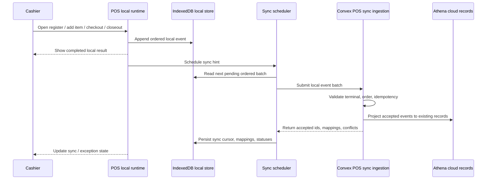
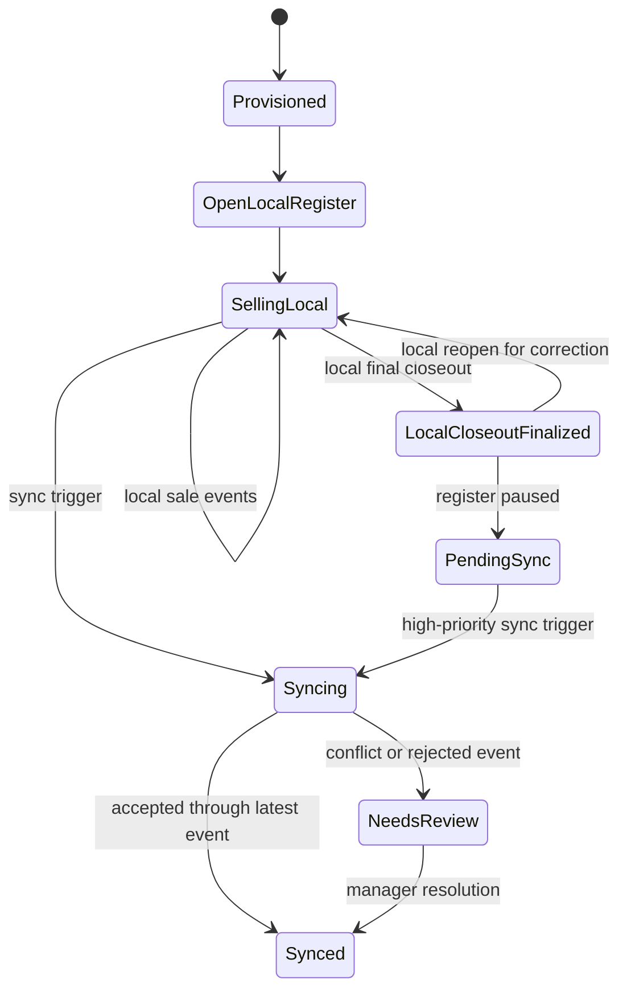

# feat: Add POS local-first register runtime

## Summary

Introduce a POS-only local runtime beneath Athena's existing POS application and gateway layer. Provisioned terminals will write register activity to durable browser storage first, sync ordered event batches into Convex through a dedicated ingestion boundary, and project accepted local history into the existing register-session, POS-session, transaction, inventory, payment-allocation, and workflow-trace rails.

---

## Problem Frame

The requirements document defines the product goal: POS must keep selling for already-provisioned businesses when the connection is unreliable. The implementation needs to make that local-first promise without turning every Athena workspace offline-first or bypassing the existing POS and cash-control domain boundaries.

---

## Requirements

- R1. Offline-first POS must be available only for terminals provisioned online into an existing claimed Athena business and store.
- R2. Terminal provisioning must give POS enough local state to boot and sell without depending on live backend subscriptions at runtime.
- R3. POS must be the only Athena workflow with the default offline-first operating contract in this release.
- R4. Non-POS workspaces may show unavailable, stale, or read-only states while offline rather than adopting POS's local-first behavior.
- R5. Offline POS access must honor the terminal, staff, store, and permission context known at the last successful provisioning or sync.
- R6. POS must load from local state first every time, even when a network connection exists.
- R7. POS must support local staff authentication suitable for register operation after provisioning.
- R8. POS must support local daily/register opening, cart building, catalog search, checkout, receipt generation, void/refund actions where permitted, cash movement recording, and closeout.
- R9. POS must record each register action durably before presenting it as completed to the cashier.
- R10. POS must make sync state visible without framing offline operation as a broken or degraded mode.
- R11. POS must preserve local register session identity before any cloud register-session id exists for that session.
- R12. POS must preserve local POS session and transaction identity before any cloud transaction id exists.
- R13. Local receipt numbers must remain permanent and searchable after cloud sync.
- R14. Offline checkout must support all configured POS payment methods, including cash, card, mobile money, and mixed payments.
- R15. Each offline payment must preserve the same payment method, amount, timestamp, and staff context expected by the existing POS checkout flow.
- R16. Cash payments must be treated as locally collected when the cashier records them.
- R17. Non-cash payment methods must not introduce new cashier confirmation states solely because the terminal is offline.
- R18. Payment reconciliation must preserve the existing POS payment model unless a later requirements document explicitly changes payment-provider behavior.
- R19. POS must allow final local closeout while unsynced POS events exist.
- R20. Final local closeout must pause additional sales on the local register session unless the session is reopened through the existing permitted correction path.
- R21. After final local closeout, POS must support reopening the same local register session where the current register workflow allows it, and must record that reopen as part of the local timeline before new sales continue.
- R22. A locally closed register session must retain the complete local timeline required for cloud cash-controls reconciliation.
- R23. Athena cloud must treat locally closed but unsynced register sessions as pending reconciliation until the full event history is accepted.
- R24. POS sync must upload local register events in a stable order that preserves the cashier's register timeline.
- R25. Sync must be idempotent so retrying after network loss does not duplicate sales, payments, receipts, cash movements, or closeouts.
- R26. Athena must map local register sessions, POS sessions, transactions, payments, receipts, and closeouts to cloud records after sync.
- R27. Synced POS facts must feed Athena cash-controls, inventory, transaction history, payment allocation, and workflow trace surfaces.
- R28. Inventory conflicts must be surfaced as manager review work rather than silently changing the cashier's completed sale.
- R29. Payment record conflicts must be surfaced as manager review work with enough context to resolve them.
- R30. Permission drift between the terminal's last synced state and current cloud policy must be surfaced for review without rewriting already-recorded local history.
- R31. Cashiers must be able to tell whether the terminal is synced, syncing, offline, or has reconciliation exceptions.
- R32. Cashiers must be able to continue normal checkout flows without waiting on sync when POS has local authority to act.
- R33. Manager-facing reconciliation must separate normal pending sync from conflicts that require human action.

R4 is retained from the origin requirements as a scope boundary. This plan must not design or implement offline state handling for non-POS surfaces.

**Origin actors:** A1 Cashier, A2 Store manager, A3 Athena POS terminal, A4 Athena cloud
**Origin flows:** F1 Provision a POS terminal for offline use, F2 Operate the register while offline, F3 Complete checkout with any payment method offline, F4 Finalize a local closeout before sync, F5 Sync and reconcile local POS history
**Origin acceptance examples:** AE1-AE10

---

## Scope Boundaries

- Offline-first behavior for inventory management, procurement, analytics, staff management, admin, and cash-controls review remains out of scope.
- Offline state UI, stale/read-only modes, or unavailable states for non-POS surfaces are fully deferred. This plan should not modify those screens for offline behavior.
- Brand-new business creation with no prior online claim remains out of scope.
- Cross-device peer-to-peer sync while all devices are offline remains out of scope.
- Real-time multi-terminal stock coordination while offline remains out of scope.
- Payment-provider-specific offline authorization remains out of scope unless a later requirements document changes the POS payment model.
- Automatic conflict resolution for inventory or payment exceptions remains out of scope; this plan creates manager-visible exception handling.
- Marketing, loyalty, and customer communication changes are out of scope unless an implementation detail is strictly required to preserve receipt continuity.

### Deferred to Follow-Up Work

- Service worker background sync: Browser support is uneven, so the first implementation should not depend on it as the primary sync guarantee. This does not defer the separate need for POS app-shell/offline-readiness after online provisioning.
- Rich reconciliation workbench: This plan creates the backend exception records and minimal POS/cash-control visibility; a fuller manager queue can follow once conflict volume and shape are proven.
- Multi-terminal offline stock coordination: Start with local snapshots and manager exceptions instead of trying to coordinate disconnected terminals.

---

## Context & Research

### Relevant Code and Patterns

- POS browser layering already exists under `packages/athena-webapp/src/lib/pos/{domain,application,infrastructure,presentation}`. Extend this split rather than making component-level offline state.
- `packages/athena-webapp/src/lib/pos/infrastructure/convex/commandGateway.ts` is the current server command gateway for start session, add item, hold session, open drawer, and complete transaction.
- `packages/athena-webapp/src/lib/pos/infrastructure/convex/registerGateway.ts`, `sessionGateway.ts`, and `catalogGateway.ts` are the current browser-to-Convex readers.
- `packages/athena-webapp/src/lib/pos/presentation/register/useRegisterViewModel.ts` is the active POS orchestration surface and should consume a local-first gateway rather than learning local persistence details directly.
- `packages/athena-webapp/convex/pos/application/commands/sessionCommands.ts`, `completeTransaction.ts`, and `register.ts` are the Convex command-side behavior to reuse during sync projection where possible.
- `packages/athena-webapp/convex/operations/registerSessions.ts` owns register-session open, cash adjustment, closeout, reopen, and cash-control ledger behavior.
- `packages/athena-webapp/convex/pos/application/queries/listRegisterCatalog.ts` and the local index files under `src/lib/pos/presentation/register` provide the compact catalog snapshot and browser-local lookup foundation.
- `packages/athena-webapp/convex/operations/paymentAllocations.ts` and `convex/pos/infrastructure/integrations/paymentAllocationService.ts` are the payment ledger rails to preserve.
- `packages/athena-webapp/convex/workflowTraces/adapters/posSession.ts`, `registerSession.ts`, and related trace tests are the observability rails that synced local events must feed.

### Institutional Learnings

- `docs/solutions/performance/athena-pos-cart-latency-foundation-2026-05-05.md` says active POS is a hot path, catalog search should stay stable/local, and durable command boundaries remain the truth for inventory/session conflicts.
- `docs/solutions/performance/athena-expense-register-local-index-parity-2026-05-08.md` reinforces the local catalog index pattern and warns against reintroducing older server-search timing into register entry.
- Existing POS drawer/register work established that `registerSessionId` is the bridge between POS transactions, drawer state, and cash-controls reporting.

### External References

- [MDN IndexedDB API](https://developer.mozilla.org/en-US/docs/Web/API/IndexedDB_API): IndexedDB supports significant structured client-side storage, indexes, and transactions, making it the right browser primitive for the local POS store.
- [MDN Background Synchronization API](https://developer.mozilla.org/en-US/docs/Web/API/Background_Synchronization_API): Background Sync can defer work to a service worker when connectivity returns, but MDN marks it limited availability, so it should not be the primary v1 sync guarantee.
- [Convex Optimistic Updates](https://docs.convex.dev/client/react/optimistic-updates): Convex optimistic updates are temporary local query changes that roll back after mutation completion; they are useful for responsiveness but not sufficient as durable offline POS storage.

---

## Key Technical Decisions

- IndexedDB-backed POS store: Use browser transactional structured storage for local register state, catalog seed, and event outbox. Avoid `localStorage` for the core POS ledger because it is not appropriate for structured transactional data.
- Event-log sync model: Store local POS actions as ordered events and sync them through a dedicated ingestion boundary instead of replaying existing Convex mutations from the browser.
- Foreground scheduler first: Trigger sync from app/POS route entry, browser online events, visibility regain, manual retry, post-event debounce, and high-priority closeout attempts. Service worker background sync is a later enhancement.
- Offline app shell separately from sync: Make provisioned POS able to reopen from locally available app/runtime assets, but keep service worker Background Sync out of the core v1 sync guarantee.
- Local-first gateway selection: Add local POS infrastructure that satisfies the existing application ports where possible, keeping `useRegisterViewModel` focused on orchestration and UI state.
- Server projection over mutation replay: The Convex sync handler should validate the terminal, dedupe events, preserve order, and project accepted local history into existing domain records using shared helpers where practical.
- Strict per-register-session ordering: Start with simple, defensible ordering. Later events wait if an earlier event is missing or blocked.
- Closeout as a checkpoint: Local closeout pauses local selling and sync applies closeout only after prior local events are accepted or converted into reconciliation exceptions. If the register is reopened through the existing correction flow, the local reopen event must sync in order before later sales.
- Reconciliation over rollback: Completed local customer interactions stay visible; inventory, payment record, or permission conflicts become manager-visible review work.
- Preserve payment semantics: Offline checkout records the same payment method/amount/staff data as current POS and does not add new confirmation states.

---

## Open Questions

### Resolved During Planning

- Sync triggers: Sync should run on POS route entry/app boot, browser online events, visibility regain, manual retry, after local POS events with debounce when online, foreground interval with backoff while POS is open, and high-priority after final local closeout.
- Background Sync dependency: Do not make service worker Background Sync required for v1 because browser support is not broad enough for the field guarantee.
- Payment confirmations: Preserve the current payment flow and do not add provider/operator confirmation state in this work.
- Sync shape: Use a dedicated server ingestion boundary rather than client replay of live Convex mutations.

### Deferred to Implementation

- Exact IndexedDB wrapper choice: Implementation can use raw IndexedDB or a small wrapper if added deliberately; the durable requirement is transactional structured storage with tests around migrations and outbox ordering.
- Exact local event payload names: Choose stable names while implementing, but keep them product-aligned and covered by sync contract tests.
- Exact conflict record shape: Define while editing Convex schema and manager visibility, but it must distinguish pending sync from conflicts that require action.
- Exact receipt number format: Decide while integrating with existing receipt/transaction display, but preserve a terminal-scoped local receipt number after cloud sync.
- Exact app-shell cache implementation: Decide during implementation whether this should be a minimal POS-only service worker/runtime cache or an existing Vite/PWA plugin pattern, but validate that a provisioned terminal can reopen POS without a live network.

---

## Output Structure

    packages/athena-webapp/src/lib/pos/infrastructure/local/
      posLocalStore.ts
      posLocalStore.test.ts
      localGateway.ts
      localGateway.test.ts
      syncScheduler.ts
      syncScheduler.test.ts
      syncStatus.ts
      syncStatus.test.ts
      offlineReadiness.ts
      offlineReadiness.test.ts
    packages/athena-webapp/convex/pos/application/sync/
      ingestLocalEvents.ts
      ingestLocalEvents.test.ts
      projectLocalEvents.ts
      projectLocalEvents.test.ts
    packages/athena-webapp/convex/pos/public/sync.ts

The tree is directional. The implementing agent may adjust filenames if existing module boundaries make a smaller or clearer split obvious.

---

## High-Level Technical Design

> *This illustrates the intended approach and is directional guidance for review, not implementation specification. The implementing agent should treat it as context, not code to reproduce.*

---

## Implementation Units

- U1. **Define the local POS event and storage foundation**

**Goal:** Create the browser-side durable storage layer for provisioned terminal state, catalog snapshots, local register/session state, ordered POS events, sync cursors, and cloud id mappings.

**Requirements:** R1, R2, R5, R6, R9, R11, R12, R13, R24, R25

**Dependencies:** None

**Files:**
- Create: `packages/athena-webapp/src/lib/pos/infrastructure/local/posLocalStore.ts`
- Create: `packages/athena-webapp/src/lib/pos/infrastructure/local/posLocalStore.test.ts`
- Create: `packages/athena-webapp/src/lib/pos/infrastructure/local/syncStatus.ts`
- Create: `packages/athena-webapp/src/lib/pos/infrastructure/local/syncStatus.test.ts`
- Modify if needed: `packages/athena-webapp/src/lib/pos/application/dto.ts`
- Modify if needed: `packages/athena-webapp/src/lib/pos/application/ports.ts`

**Approach:**
- Model local ids separately from Convex ids for register sessions, POS sessions, transactions, and receipt numbers.
- Store events as append-only records with terminal/store/register-session scope, monotonically ordered sequence, staff attribution, event type, payload, and sync status.
- Store local-to-cloud mappings after sync so later events can reference either local ids or accepted cloud ids.
- Keep a current local read model for fast POS boot, but treat the event log as the durable source evidence.
- Include a schema-version mechanism so future local store migrations can be deliberate.

**Execution note:** Start with storage and ordering tests before wiring any UI path to local state.

**Patterns to follow:**
- Existing POS DTO/port split in `packages/athena-webapp/src/lib/pos/application`.
- Existing terminal fingerprint storage in `packages/athena-webapp/src/lib/pos/infrastructure/terminal/fingerprint.ts` for browser capability checks, but do not use `localStorage` for the POS event ledger.

**Test scenarios:**
- Happy path: a provisioned terminal seed is written, then read back before any network call.
- Happy path: local register, POS session, cart item, payment, receipt, and closeout events append with stable sequence order.
- Edge case: a failed write does not advance the local sequence cursor.
- Edge case: an existing local-to-cloud mapping can be read when appending a later event for the same local entity.
- Error path: opening a store with an unsupported schema version returns an explicit local-store failure state rather than corrupting data.
- Integration: writing an event updates the derived local sync status from synced to pending.

**Verification:**
- Unit tests prove local persistence, ordering, id mapping, and sync-status derivation without a Convex connection.

---

- U2. **Capture online provisioning into the local POS seed**

**Goal:** Persist the store, terminal, staff, permissions, register configuration, catalog snapshot, price/tax context, and inventory snapshot needed for local POS boot after a successful online provisioning/sync.

**Requirements:** R1, R2, R3, R5, R6, R7

**Dependencies:** U1

**Files:**
- Create: `packages/athena-webapp/src/lib/pos/infrastructure/local/localGateway.ts`
- Create: `packages/athena-webapp/src/lib/pos/infrastructure/local/localGateway.test.ts`
- Modify: `packages/athena-webapp/src/lib/pos/infrastructure/convex/registerGateway.ts`
- Modify: `packages/athena-webapp/src/lib/pos/infrastructure/convex/catalogGateway.ts`
- Modify: `packages/athena-webapp/src/lib/pos/presentation/register/useRegisterViewModel.ts`
- Test: `packages/athena-webapp/src/lib/pos/presentation/register/useRegisterViewModel.test.ts`

**Approach:**
- On successful online POS bootstrap/catalog reads, refresh the local seed used for later local-first boot.
- Persist the compact register catalog snapshot and bounded availability snapshot separately so search stays local and availability can be marked as last-known.
- Cache staff roster/auth material only to the extent needed for POS register operation, respecting the existing `staffProfile` and `staffCredential` boundary. Do not store plaintext PINs or reusable server credentials; prefer verifier-only, scoped, locally invalidatable material.
- Keep all non-POS workspace behavior unchanged.

**Patterns to follow:**
- Local catalog index pattern in `packages/athena-webapp/src/lib/pos/presentation/register/useRegisterCatalogIndex.ts`.
- Staff identity guidance in `packages/athena-webapp/docs/agent/architecture.md`.

**Test scenarios:**
- Covers AE1. Given a terminal seed exists locally, POS can produce a register-ready local bootstrap state with Convex queries unavailable.
- Happy path: a fresh online catalog snapshot replaces the previous local catalog seed.
- Edge case: missing staff credential state prevents local register operation while preserving the local store.
- Error path: local seed refresh failure surfaces an offline-readiness warning without breaking the current online POS session.

**Verification:**
- POS view-model tests show local-first boot from persisted seed and no dependency on live Convex subscriptions for initial register readiness.

---

- U3. **Implement local-first POS command gateway**

**Goal:** Add a local command path for register open, session start/resume, cart changes, checkout, receipt number creation, cash movement recording, local final closeout, and permitted register reopen, while preserving current payment semantics.

**Requirements:** R6, R8, R9, R10, R11, R12, R13, R14, R15, R16, R17, R18, R19, R20, R21, R22, R32

**Dependencies:** U1, U2

**Files:**
- Modify: `packages/athena-webapp/src/lib/pos/infrastructure/local/localGateway.ts`
- Modify: `packages/athena-webapp/src/lib/pos/application/ports.ts`
- Modify: `packages/athena-webapp/src/lib/pos/application/useCases/startSession.ts`
- Modify: `packages/athena-webapp/src/lib/pos/application/useCases/addItem.ts`
- Modify: `packages/athena-webapp/src/lib/pos/application/useCases/completeTransaction.ts`
- Modify: `packages/athena-webapp/src/lib/pos/application/useCases/openDrawer.ts`
- Modify if needed: `packages/athena-webapp/src/lib/pos/domain/session.ts`
- Modify if needed: `packages/athena-webapp/src/lib/pos/domain/payments.ts`
- Test: `packages/athena-webapp/src/lib/pos/infrastructure/local/localGateway.test.ts`
- Test: `packages/athena-webapp/src/lib/pos/domain/session.test.ts`
- Test: `packages/athena-webapp/src/lib/pos/domain/cart.test.ts`

**Approach:**
- Implement local command handlers behind the same application concepts used by the Convex gateway.
- Append local events before returning successful command outcomes to the UI.
- Generate terminal-scoped local receipt numbers at completion and preserve them through later cloud mapping.
- Use the existing payment method/amount model; do not add provider/operator confirmation concepts.
- Pause a local register session after final closeout. Allow later selling on that same local register session only after the existing permitted reopen-for-correction action appends a local reopen event.
- Keep local inventory checks based on last-known availability, but route later conflicts to sync reconciliation instead of blocking completed local sales.

**Patterns to follow:**
- Existing `PosCommandGateway` in `packages/athena-webapp/src/lib/pos/application/ports.ts`.
- Existing payment calculations in `packages/athena-webapp/src/lib/pos/domain/payments.ts`.
- Existing register-session closeout and reopen rules in `packages/athena-webapp/convex/operations/registerSessions.ts`.

**Test scenarios:**
- Covers AE3. Given connection loss during checkout, local add-item and completion append events before the UI shows success.
- Covers AE4. Given mobile money is selected offline, the normal POS payment payload is persisted without an extra confirmation state.
- Covers AE5. Given cash is selected offline, drawer expected-cash state reflects the cash payment and change behavior.
- Covers AE6. Given unsynced sales exist, local closeout pauses the register session; later sale attempts are blocked until the existing permitted reopen action records a local reopen event.
- Covers AE10. Given offline checkout completes, the local receipt number is stored on the local transaction and remains available for sync mapping.
- Edge case: two rapid quantity changes produce ordered events and a coherent local cart read model.
- Error path: attempting to append a sale after local closeout and before a permitted reopen returns a register-closed local command error.

**Verification:**
- Local command tests prove durable-first behavior, payment-model preservation, receipt continuity, closeout pause semantics, and reopen event ordering.

---

- U4. **Wire the POS register UI to the local-first runtime and sync status**

**Goal:** Make the active POS register boot from local state by default, show sync state clearly, and keep checkout flows usable without waiting on sync.

**Requirements:** R3, R6, R7, R8, R10, R19, R20, R21, R31, R32

**Dependencies:** U1, U2, U3

**Files:**
- Modify: `packages/athena-webapp/src/lib/pos/presentation/register/useRegisterViewModel.ts`
- Modify: `packages/athena-webapp/src/lib/pos/presentation/register/registerUiState.ts`
- Modify: `packages/athena-webapp/src/components/pos/register/POSRegisterView.tsx`
- Modify: `packages/athena-webapp/src/components/pos/register/RegisterActionBar.tsx`
- Modify: `packages/athena-webapp/src/components/pos/register/RegisterDrawerGate.tsx`
- Test: `packages/athena-webapp/src/lib/pos/presentation/register/useRegisterViewModel.test.ts`
- Test: `packages/athena-webapp/src/components/pos/register/POSRegisterView.test.tsx`
- Test: `packages/athena-webapp/src/components/pos/register/RegisterDrawerGate.test.tsx`

**Approach:**
- Let the view model consume local-first readers and commands for POS while continuing to refresh from Convex when available.
- Add UI state for synced, syncing, offline/pending, locally closed pending sync, and needs review.
- Keep operator-facing copy calm and operational, following `docs/product-copy-tone.md`.
- Preserve existing closeout and reopen controls, but make locally closed pending-sync distinct from cloud-settled closeout.
- Do not change routed non-POS workspaces for offline behavior in this plan.

**Patterns to follow:**
- Existing drawer gate and closeout-blocked UI in `RegisterDrawerGate.tsx`.
- Existing safe command/error presentation in `useRegisterViewModel.ts`.
- Existing design system guidance in `packages/athena-webapp/docs/agent/design.md` if UI changes become material.

**Test scenarios:**
- Covers AE1. POS renders usable register controls from local state while Convex register queries are unavailable.
- Covers AE3. Completing a local sale shows pending-sync status rather than a failed network outcome.
- Covers AE6. A locally closed register shows closed/pending-sync state and does not expose sale controls until the permitted reopen action succeeds.
- Happy path: manual retry action schedules sync without changing local sale state.
- Edge case: browser reports online while sync fails; POS remains usable and shows pending sync.
- Error path: local-store unavailable state blocks offline claims and gives the operator a durable error region.

**Verification:**
- Component and view-model tests show POS local-first rendering, sync-status transitions, manual retry, local closeout UI behavior, and permitted reopen behavior.

---

- U5. **Build the sync scheduler and trigger model**

**Goal:** Centralize sync triggering, batching, ordering, retry/backoff, and concurrency control for local POS events.

**Requirements:** R9, R10, R19, R20, R23, R24, R25, R31, R32

**Dependencies:** U1, U3, U4

**Files:**
- Create: `packages/athena-webapp/src/lib/pos/infrastructure/local/syncScheduler.ts`
- Create: `packages/athena-webapp/src/lib/pos/infrastructure/local/syncScheduler.test.ts`
- Modify: `packages/athena-webapp/src/lib/pos/presentation/register/useRegisterViewModel.ts`
- Modify: `packages/athena-webapp/src/lib/pos/infrastructure/convex/commandGateway.ts`
- Test: `packages/athena-webapp/src/lib/pos/presentation/register/useRegisterViewModel.test.ts`

**Approach:**
- Use one scheduler that collapses all sync hints into a single queue.
- Trigger sync on POS route/view-model entry, browser `online`, document visibility regain, manual retry, after local event append when online with debounce, foreground interval while POS is open with pending events, and high-priority after local final closeout.
- Prevent concurrent sync runs for the same terminal/register-session queue.
- Sync oldest pending events first and require complete ordered batches for a local register session.
- Use exponential backoff for network/server failures, resetting backoff on new local events, manual retry, app/POS boot, online, or visibility events.
- Keep checkout and local closeout independent from sync completion.

**Patterns to follow:**
- Existing React effect/ref patterns in `useRegisterViewModel.ts`.
- Existing `runCommand` normalization for network command outcomes.

**Test scenarios:**
- Happy path: POS route entry with pending events schedules a sync attempt.
- Happy path: appending a local checkout event while online debounces and then schedules sync.
- Happy path: final local closeout schedules high-priority sync without waiting for the next interval.
- Edge case: repeated triggers while sync is running mark another pass needed but do not start concurrent uploads.
- Edge case: visibility regain after sleep schedules sync for pending events.
- Error path: network failure increases backoff and leaves events pending.
- Error path: manual retry bypasses the current backoff delay.

**Verification:**
- Scheduler tests prove trigger collapse, no duplicate concurrent runs, ordering, backoff reset rules, and high-priority closeout behavior.

---

- U6. **Add Convex sync ingestion, idempotency, and mapping records**

**Goal:** Create the server-side POS sync boundary that accepts ordered local event batches, validates terminal/store/staff context, dedupes accepted events, records local-to-cloud mappings, and returns sync outcomes.

**Requirements:** R1, R5, R11, R12, R13, R23, R24, R25, R26, R30, R33

**Dependencies:** U1, U3, U5

**Files:**
- Modify: `packages/athena-webapp/convex/schema.ts`
- Create: `packages/athena-webapp/convex/schemas/pos/posLocalSyncEvent.ts`
- Create: `packages/athena-webapp/convex/schemas/pos/posLocalSyncMapping.ts`
- Create: `packages/athena-webapp/convex/pos/application/sync/ingestLocalEvents.ts`
- Create: `packages/athena-webapp/convex/pos/application/sync/ingestLocalEvents.test.ts`
- Create: `packages/athena-webapp/convex/pos/public/sync.ts`
- Modify: `packages/athena-webapp/convex/_generated/api.d.ts` only via Convex artifact refresh when needed

**Approach:**
- Add durable server records for accepted local events and local-to-cloud identity mappings.
- Validate that submitted terminal, store, and staff references still belong together before accepting events.
- Enforce strict sequence ordering per terminal/local register session.
- Make idempotency explicit: repeated accepted events return previous mappings/outcomes and do not re-project domain writes.
- Return accepted event ids, rejected/conflicted event ids, mappings, sync cursor, and manager-review references where applicable.
- Keep the public sync function thin; put reusable ingestion logic under application sync modules.

**Execution note:** Add server ingestion tests before projecting events into domain records.

**Patterns to follow:**
- Convex public-thin/internal-helper guidance in `packages/athena-webapp/docs/agent/architecture.md`.
- Command-result validation patterns under `shared/commandResult.ts` and `convex/lib/commandResultValidators.ts`.
- Existing POS public namespaces under `packages/athena-webapp/convex/pos/public`.

**Test scenarios:**
- Covers AE7. Retrying the same accepted batch returns the same accepted status and does not duplicate cloud writes.
- Happy path: an ordered batch for one local register session is accepted and stores sync event records.
- Edge case: event 25 without accepted event 24 is rejected or held as out-of-order.
- Error path: terminal/store mismatch rejects the batch without applying domain writes.
- Error path: staff no longer belongs to the store records a permission conflict without rewriting accepted local history.
- Integration: accepted events return local-to-cloud mapping rows for local register/session/transaction ids.

**Verification:**
- Convex tests prove identity validation, idempotency, ordering, mapping persistence, and safe rejection behavior.

---

- U7. **Project accepted local events into existing POS, cash-control, inventory, payment, and trace rails**

**Goal:** Convert accepted local events into Athena cloud records using existing domain helpers and command services where practical.

**Requirements:** R11, R12, R13, R16, R19, R20, R21, R22, R23, R26, R27, R28, R29, R30

**Dependencies:** U6

**Files:**
- Create: `packages/athena-webapp/convex/pos/application/sync/projectLocalEvents.ts`
- Create: `packages/athena-webapp/convex/pos/application/sync/projectLocalEvents.test.ts`
- Modify: `packages/athena-webapp/convex/pos/application/commands/sessionCommands.ts`
- Modify: `packages/athena-webapp/convex/pos/application/commands/completeTransaction.ts`
- Modify: `packages/athena-webapp/convex/operations/registerSessions.ts`
- Modify: `packages/athena-webapp/convex/pos/infrastructure/integrations/paymentAllocationService.ts`
- Modify if needed: `packages/athena-webapp/convex/inventory/helpers/inventoryHolds.ts`
- Test: `packages/athena-webapp/convex/pos/application/sessionCommands.test.ts`
- Test: `packages/athena-webapp/convex/pos/application/completeTransaction.test.ts`
- Test: `packages/athena-webapp/convex/operations/registerSessions.trace.test.ts`
- Test: `packages/athena-webapp/convex/cashControls/registerSessionTraceLifecycle.test.ts`

**Approach:**
- Project local drawer open into `registerSession` while preserving local identity mapping.
- Project local POS session/cart history into `posSession` and `posSessionItem` records when useful for existing reporting and transaction links.
- Project local checkout into `posTransaction` and `posTransactionItem`, preserving local receipt number as searchable transaction context.
- Record payment allocations using the existing in-store payment allocation helper and current payment semantics.
- Apply cash deltas through existing register-session transaction logic so expected cash remains aligned with cash controls.
- Apply inventory changes once at the sale boundary; when stock truth conflicts with local sale history, create a reconciliation exception instead of silently rewriting the sale.
- Apply closeout after prior events have been accepted or converted into reviewable exceptions, then mark cloud cash-control state as pending review if conflicts exist.
- Apply local reopen events through the existing closed-register reopen path before projecting any later sale events for that same local register session.
- Record POS and register-session workflow trace milestones through existing trace adapters.

**Patterns to follow:**
- `recordRegisterSessionSale` and `recordRetailSalePaymentAllocations` for sales.
- `buildClosedRegisterSessionPatch` and closeout trace lifecycle for closeout.
- POS inventory hold guidance in `docs/solutions/performance/athena-pos-cart-latency-foundation-2026-05-05.md`.

**Test scenarios:**
- Covers AE7. Offline sale and closeout sync projects one transaction, one payment-allocation set, one register-session cash update, and one closeout without duplicates.
- Covers AE8. Oversold inventory creates a manager review exception while preserving the completed transaction.
- Covers AE9. Malformed payment record creates a payment reconciliation exception without hiding the sale.
- Covers AE10. Local receipt number remains searchable after projection.
- Happy path: cash sale updates expected cash and payment allocations using existing payment method data.
- Edge case: local closeout event after a missing earlier event is not projected early.
- Edge case: local reopen after closeout projects before later sale events for the same local register session.
- Error path: attempting to project a sale after local closeout and before a reopen event for the same local register session is rejected as local history corruption.
- Integration: workflow traces include business-readable transaction/register milestones for synced local events.

**Verification:**
- Convex integration tests prove accepted local history lands in the same cloud records used by POS, cash controls, inventory, payment allocation, and workflow trace views.

---

- U8. **Surface pending sync and reconciliation in POS and cash controls**

**Goal:** Make pending sync distinct from conflicts requiring action, with minimal manager-facing visibility for inventory, payment, and permission exceptions.

**Requirements:** R10, R23, R28, R29, R30, R31, R33

**Dependencies:** U6, U7

**Files:**
- Modify: `packages/athena-webapp/convex/schema.ts`
- Create: `packages/athena-webapp/convex/schemas/pos/posSyncReconciliationItem.ts`
- Create: `packages/athena-webapp/convex/pos/application/sync/reconciliation.test.ts`
- Modify: `packages/athena-webapp/convex/cashControls/registerSessions.test.ts`
- Modify: `packages/athena-webapp/src/lib/pos/infrastructure/local/syncStatus.ts`
- Modify: `packages/athena-webapp/src/lib/pos/presentation/register/registerUiState.ts`
- Modify: `packages/athena-webapp/src/lib/pos/presentation/register/useRegisterViewModel.ts`
- Modify: `packages/athena-webapp/src/components/pos/register/POSRegisterView.tsx`
- Modify: `packages/athena-webapp/src/components/cash-controls/CashControlsDashboard.tsx`
- Modify: `packages/athena-webapp/src/components/cash-controls/RegisterSessionView.tsx`
- Test: `packages/athena-webapp/src/components/pos/register/POSRegisterView.test.tsx`
- Test: `packages/athena-webapp/src/components/cash-controls/CashControlsDashboard.test.tsx`
- Test: `packages/athena-webapp/src/components/cash-controls/RegisterSessionView.test.tsx`

**Approach:**
- Add a small reconciliation record for sync-created conflicts with type, affected local/cloud subject, status, and manager-readable summary.
- In POS, show synced/syncing/pending/needs-review states without blocking local checkout unless the local register is closed and has not been reopened.
- In cash controls, show locally closed but unsynced sessions as pending reconciliation and conflict-bearing sessions as needing review.
- Keep the manager view minimal; do not build full automatic resolution in this plan.

**Patterns to follow:**
- Cash-controls dashboard and register-session detail patterns in `CashControlsDashboard.tsx` and `RegisterSessionView.tsx`.
- Operator-facing copy guidance in `docs/product-copy-tone.md`.

**Test scenarios:**
- Covers AE6. Locally closed pending-sync register is visible as not cloud-settled.
- Covers AE8. Inventory conflict appears as manager review work, separate from normal pending sync.
- Covers AE9. Payment record conflict appears as manager review work.
- Happy path: synced register session no longer shows pending sync.
- Edge case: sync is pending but no conflict exists, so manager UI does not label it as a problem.
- Error path: unknown reconciliation type falls back to safe generic operator copy.

**Verification:**
- UI and Convex tests prove pending sync and needs-review states are distinct in POS and cash-controls surfaces.

---

- U9. **Make the provisioned POS app shell offline-ready**

**Goal:** Ensure a provisioned terminal can reopen the POS runtime from local browser assets without relying on a live network fetch for the application shell.

**Requirements:** R1, R2, R3, R6, R10

**Dependencies:** U1, U2, U4

**Files:**
- Create: `packages/athena-webapp/src/lib/pos/infrastructure/local/offlineReadiness.ts`
- Create: `packages/athena-webapp/src/lib/pos/infrastructure/local/offlineReadiness.test.ts`
- Modify if needed: `packages/athena-webapp/src/main.tsx`
- Modify if needed: `packages/athena-webapp/index.html`
- Modify if needed: `packages/athena-webapp/vite.config.ts`
- Test if added: `packages/athena-webapp/src/lib/pos/infrastructure/local/offlineReadiness.test.ts`

**Approach:**
- Treat app-shell availability as separate from event sync. POS needs local runtime assets to boot; sync still runs through the foreground scheduler.
- Add the smallest offline-readiness mechanism that lets already-provisioned terminals reopen POS when network is unavailable.
- Limit the offline shell contract to POS routes and provisioned terminal state; do not introduce offline state handling for other Athena workspaces.
- Surface a clear POS offline-readiness state after provisioning so operators know whether the terminal is ready for field use.
- Keep Background Sync optional; if a service worker is used, its v1 job is app-shell/runtime availability, not primary outbox delivery.

**Patterns to follow:**
- POS-only scope boundary from this plan.
- Product copy guidance in `docs/product-copy-tone.md` for offline-readiness messages.

**Test scenarios:**
- Covers AE1. Given a terminal is provisioned and offline-ready, reopening POS with network unavailable loads the local runtime and register seed.
- Happy path: successful online provisioning marks POS app shell and local seed as ready.
- Edge case: app shell is available but local POS seed is missing, so POS reports provisioning required instead of presenting a blank register.
- Error path: offline-readiness setup fails and surfaces an actionable POS readiness warning while online POS remains usable.

**Verification:**
- Browser-facing or integration tests prove the provisioned POS shell can load without live backend availability.

---

- U10. **Refresh validation, harness coverage, and operational documentation**

**Goal:** Ensure the new POS local-first path is covered by focused unit tests, Convex integration tests, browser-facing tests, harness metadata, and implementation docs.

**Requirements:** R3, R4, R24, R25, R27, R31, R33

**Dependencies:** U1, U2, U3, U4, U5, U6, U7, U8, U9

**Files:**
- Modify: `packages/athena-webapp/docs/agent/testing.md`
- Modify if needed: `scripts/harness-app-registry.ts`
- Regenerate if needed: `packages/athena-webapp/docs/agent/validation-map.json`
- Regenerate if needed: `packages/athena-webapp/docs/agent/validation-guide.md`
- Create: `docs/solutions/architecture/athena-pos-local-first-sync-2026-05-13.md`

**Approach:**
- Add validation-map coverage for new local POS infrastructure and sync ingestion files.
- Document the local-first POS sync pattern so future POS work does not accidentally reintroduce live-server dependencies.
- Include browser/POS behavior validation if implementation changes routed POS runtime behavior enough to require a harness scenario.
- Run graphify rebuild after code changes per repo instruction.

**Patterns to follow:**
- Existing harness guidance in `packages/athena-webapp/docs/agent/testing.md`.
- Existing solution note shape under `docs/solutions/performance`.

**Test scenarios:**
- Test expectation: none for documentation-only edits; behavior is covered by units U1-U8. Harness metadata should be validated by the harness commands.

**Verification:**
- Harness review has coverage for touched files, generated docs are in sync if changed, and the solution note records the sync pattern for future agents.

---

## System-Wide Impact

- **Interaction graph:** POS register view model, local storage, sync scheduler, Convex sync ingestion, existing POS commands, register sessions, inventory holds/movements, payment allocations, cash controls, and workflow traces all participate.
- **Error propagation:** Local command failures should surface through existing operator-safe presentation. Sync failures update local sync status and reconciliation records rather than throwing raw backend text into the POS UI.
- **State lifecycle risks:** Local event order, duplicate submission, local closeout/reopen ordering, partial sync, schema migration, and local-to-cloud id mapping are the highest-risk lifecycle concerns.
- **API surface parity:** Existing online POS commands remain available; sync ingestion is an additional POS boundary for local events, not a replacement for normal online command calls outside the local-first runtime.
- **Integration coverage:** Unit tests alone are insufficient. The plan needs Convex integration tests for projection into transactions/register sessions/payment allocations and browser tests for local-first POS boot/status behavior.
- **Unchanged invariants:** Payment semantics stay method/amount/staff based; `registerSessionId` remains the POS-to-cash-controls bridge after cloud mapping; non-POS Athena workspaces are not changed by this plan.

---

## Risks & Dependencies

| Risk | Mitigation |
|------|------------|
| Local storage loss or browser eviction could lose unsynced register history. | Use IndexedDB, surface local storage health/offline-readiness state, and keep sync opportunistic whenever connectivity exists. |
| Event projection could duplicate sales after retry. | Add server idempotency records and tests for repeated accepted batches. |
| Closeout or reopen could be applied out of order relative to sale events. | Enforce strict per-register-session ordering and treat closeout/reopen as timeline checkpoints. |
| Existing command helpers may assume live Convex ids and reject delayed local evidence. | Add a dedicated sync projection layer that reuses helpers selectively rather than replaying browser mutations. |
| Inventory oversells are unavoidable across disconnected terminals. | Preserve completed sales and create manager reconciliation items. |
| Offline POS could accidentally expand into other workspaces. | Keep local runtime under POS infrastructure and do not edit non-POS screens for offline behavior in this plan. |
| Local staff/permission cache can drift from cloud policy. | Validate on sync and create permission reconciliation exceptions without rewriting local history. |
| Local staff auth cache could expose sensitive credential material. | Store only scoped verifier material needed for local POS, never plaintext PINs or reusable server credentials. |
| POS may persist event data but fail to reopen offline if runtime assets are not locally available. | Add POS app-shell/offline-readiness validation separately from sync scheduling. |
| Sync status copy could make normal offline operation feel broken. | Follow product-copy guidance and separate pending sync from needs-review. |

---

## Documentation / Operational Notes

- Update package testing docs and validation maps when new POS local/sync files are added.
- Add a durable solution note after implementation describing why POS uses an event-log sync boundary instead of replaying Convex mutations.
- Any code implementation must run `bun run graphify:rebuild` after modifying code files, per repo instructions.
- If Convex schema or public functions change, refresh generated Convex artifacts with the repo-documented `bunx convex dev --once` workflow when credentials are available.

---

## Alternative Approaches Considered

- Replay existing Convex mutations from the browser after reconnect: rejected because current mutations assume live server ids and immediate validation, which would scatter idempotency and delayed-evidence handling across many commands.
- Service worker Background Sync as the primary engine: rejected for v1 because browser support is limited; it remains a follow-up enhancement.
- Rely on ordinary browser HTTP cache for offline boot: rejected as the only guarantee because field terminals need an explicit POS offline-readiness signal after provisioning.
- Convex optimistic updates as the offline model: rejected because optimistic updates are temporary UI responsiveness tools, not durable offline storage.
- Online-only closeout: rejected by the origin requirements because operators must be able to end the day offline.

---

## Sources & References

- **Origin document:** [docs/brainstorms/2026-05-13-pos-local-first-register-requirements.md](../brainstorms/2026-05-13-pos-local-first-register-requirements.md)
- Related code: `packages/athena-webapp/src/lib/pos/presentation/register/useRegisterViewModel.ts`
- Related code: `packages/athena-webapp/src/lib/pos/infrastructure/convex/commandGateway.ts`
- Related code: `packages/athena-webapp/src/lib/pos/infrastructure/convex/catalogGateway.ts`
- Related code: `packages/athena-webapp/convex/pos/application/commands/sessionCommands.ts`
- Related code: `packages/athena-webapp/convex/pos/application/commands/completeTransaction.ts`
- Related code: `packages/athena-webapp/convex/operations/registerSessions.ts`
- Related code: `packages/athena-webapp/convex/operations/paymentAllocations.ts`
- Related learning: [docs/solutions/performance/athena-pos-cart-latency-foundation-2026-05-05.md](../solutions/performance/athena-pos-cart-latency-foundation-2026-05-05.md)
- Related learning: [docs/solutions/performance/athena-expense-register-local-index-parity-2026-05-08.md](../solutions/performance/athena-expense-register-local-index-parity-2026-05-08.md)
- External docs: [MDN IndexedDB API](https://developer.mozilla.org/en-US/docs/Web/API/IndexedDB_API)
- External docs: [MDN Background Synchronization API](https://developer.mozilla.org/en-US/docs/Web/API/Background_Synchronization_API)
- External docs: [Convex Optimistic Updates](https://docs.convex.dev/client/react/optimistic-updates)
