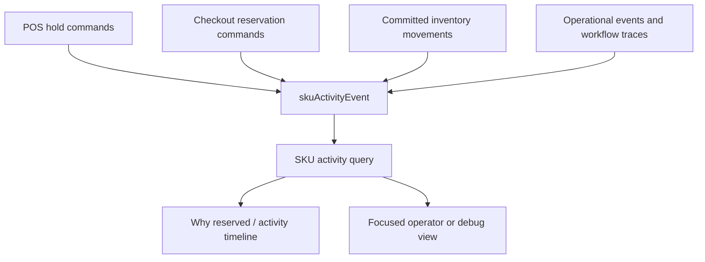
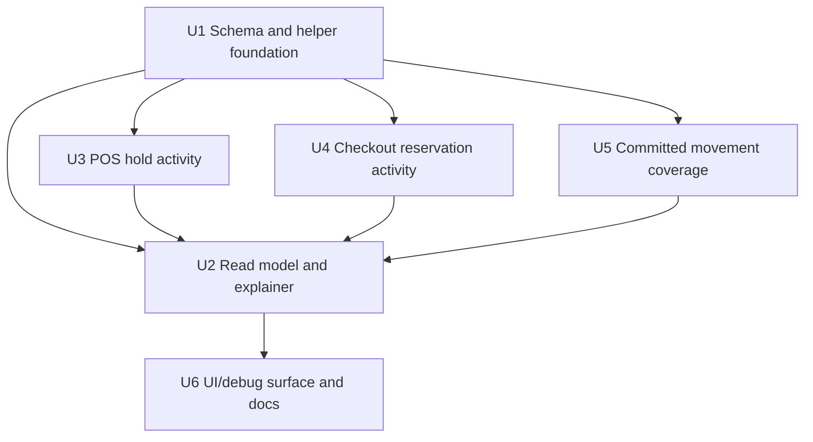
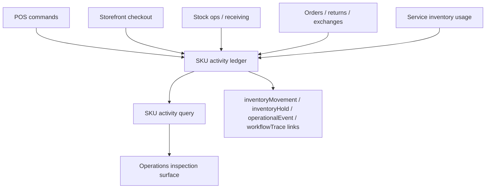

# feat: Add definitive SKU activity tracing

## Summary

Add a source-aware SKU activity ledger and query surface so Athena can explain current and historical SKU state from backend records. The implementation should preserve `inventoryMovement` as the committed stock-movement ledger, add durable reservation/activity evidence for transient holds, and expose one timeline that answers questions like "why is this SKU reserved?" without ad hoc production spelunking.

---

## Problem Frame

Production inspection of SKU `KK38-X3C-MQE` found a partial trace: one POS session added, adjusted, removed, and released a POS hold, but the current `inventoryCount` and `quantityAvailable` gap had no definitive source record. Athena already has good domain records in pockets, but SKU activity is not reconstructable from one source-aware trail.

---

## Requirements

- R1. A store-scoped SKU timeline must explain reservation, release, consumption, sale, receiving, adjustment, return, exchange, service usage, and repair activity for a `productSku`.
- R2. Active reservation explanations must identify the reservation source, quantity, status, originating workflow/session/order, actor context when available, and whether the reservation is active, released, consumed, or expired.
- R3. POS ledger holds must remain `inventoryHold`-backed and must not return to patching `productSku.quantityAvailable` during cart editing.
- R4. Storefront checkout reservations must become traceable without double-subtracting availability in existing read models.
- R5. Committed stock changes must continue to use or link to `inventoryMovement` so inventory movement remains the stock-delta ledger.
- R6. The timeline must be idempotent under retry, cron cleanup, sync replay, or repeated command execution.
- R7. Existing POS workflow traces and operational events should be linked when they already exist, not replaced by a generic trace system.
- R8. The first release must include a read-only backend query/debug surface that can answer the production SKU question shape directly.
- R9. Tests must prove each activity-producing command path writes activity evidence and that the read model can explain active and historical reservations.

---

## Scope Boundaries

- Do not correct `KK38-X3C-MQE` stock counts in this plan. This plan creates the instrumentation needed to explain and safely repair such gaps later.
- Do not rebuild POS, storefront checkout, stock adjustment, receiving, return/exchange, or service workflows beyond the activity instrumentation needed at their existing mutation boundaries.
- Do not make workflow traces the universal SKU ledger. Workflow traces stay workflow-scoped; SKU activity links to them when useful.
- Do not require every legacy historical SKU change to become perfectly reconstructable. Backfill should mark inferred events explicitly.
- Do not add broad UI redesign. A focused activity viewer/debug panel is in scope only to make the ledger usable.

### Deferred to Follow-Up Work

- Historical production reconciliation for existing availability gaps: create a separate repair/backfill run after the ledger is deployed and validated.
- Rich analytics over SKU activity volume, staff trends, or demand forecasting.
- Moving storefront checkout reservations fully onto the POS-style hold ledger. This plan can make checkout reservations traceable without changing checkout's current availability semantics.

---

## Context & Research

### Relevant Code and Patterns

- `packages/athena-webapp/convex/operations/inventoryMovements.ts` already records committed stock movements with `storeId`, `productSkuId`, `sourceType`, `sourceId`, `quantityDelta`, `reasonCode`, and actor/context references.
- `packages/athena-webapp/convex/inventory/helpers/inventoryHolds.ts` owns POS ledger hold acquire, adjust, release, expire, and consume behavior. Keep this as the POS reservation source of truth.
- `packages/athena-webapp/convex/storeFront/checkoutSession.ts` currently reserves checkout stock by inserting `checkoutSessionItem` rows and patching `productSku.quantityAvailable`; expiry releases by patching availability back and deleting checkout rows.
- `packages/athena-webapp/convex/stockOps/adjustments.ts` already distinguishes POS reserved quantity from checkout reserved quantity in the stock adjustment snapshot.
- `packages/athena-webapp/convex/workflowTraces/core.ts` and `workflowTraces/public.ts` provide workflow-scoped trace lookups and events. Use links to traces rather than broadening trace identity around SKUs.
- `packages/athena-webapp/convex/operations/operationalEvents.ts` provides subject-scoped operational events and idempotent insertion patterns for business audit history.
- `packages/athena-webapp/convex/stockOps/receiving.ts`, `stockOps/adjustments.ts`, `storeFront/onlineOrder.ts`, and `serviceOps/serviceCases.ts` already record inventory movements for several committed stock changes.
- `packages/athena-webapp/convex/pos/application/commands/completeTransaction.ts` patches SKU inventory on POS completion but does not currently record an `inventoryMovement` row for POS sales.

### Institutional Learnings

- `docs/solutions/performance/athena-pos-cart-latency-foundation-2026-05-05.md` establishes that POS cart holds should be ledger rows and must not mutate the full SKU catalog read model.
- `docs/solutions/logic-errors/athena-stock-adjustments-checkout-reservations-2026-05-08.md` establishes that Athena has two active reservation systems and source labels must distinguish checkout reservations from POS reservations.
- Prior approval and operation plans establish the observability rule: use operational events broadly, and add workflow trace milestones only for domains that already own a trace lifecycle.

### External References

- External research skipped. This is an internal Convex/domain-ledger design where existing Athena patterns are more authoritative than generic event-sourcing guidance.

---

## Key Technical Decisions

| Decision | Rationale |
| --- | --- |
| Add a `skuActivityEvent` ledger instead of overloading `inventoryMovement` | Reservations and releases are activity facts, but they are not always committed stock deltas. Keeping `inventoryMovement` focused on non-zero stock movement preserves its current semantics while allowing the SKU timeline to include transient reservation state. |
| Link activity events to source records | The answer should point to a POS session, checkout session, order, inventory hold, movement, transaction, operational event, or workflow trace rather than storing ungrounded prose. |
| Record activity at mutation boundaries | Activity evidence must be written in the same command path that changes reservation or inventory state, so future production questions do not depend on reconstructing intent from secondary effects. |
| Make checkout traceable before changing checkout reservation mechanics | Checkout currently reserves by patching `quantityAvailable`; tracing that behavior is lower risk than changing checkout to `inventoryHold` semantics in the same release. |
| Treat backfilled events as inferred | Historical rows can explain likely causes, but must not pretend to have the same evidentiary strength as events recorded at mutation time. |

---

## Open Questions

### Resolved During Planning

- Should SKU activity replace workflow traces? No. Workflow traces stay workflow-scoped; SKU activity is a SKU-scoped audit/read model that links to workflow traces where available.
- Should POS holds continue using `inventoryHold`? Yes. The existing POS cart latency foundation depends on ledger holds not mutating full SKU catalog rows.
- Should checkout reservations be represented as `inventoryHold` in this plan? No. The first release should trace checkout's current reservation model and avoid changing checkout availability semantics at the same time.

### Deferred to Implementation

- Exact activity type names and metadata keys: choose during implementation to match local naming conventions in `operationalEvents`, `workflowTraces`, and stock ops tests.
- Whether the first UI entry point lives on product detail, stock adjustment rows, or an operations debug route: choose the least invasive placement after inspecting current route ergonomics.
- Backfill cutoff and production repair script shape: define after the ledger schema and read model prove the active-path contract.

---

## High-Level Technical Design

> *This illustrates the intended approach and is directional guidance for review, not implementation specification. The implementing agent should treat it as context, not code to reproduce.*

The ledger records SKU-scoped facts with links back to the source records. The read model joins those source records into a timeline and computes current reservation explanations from active reservation activity plus live source state.

---

## Implementation Units

- U1. **Create the SKU activity ledger foundation**

**Goal:** Add the durable persistence and helper layer for SKU activity events.

**Requirements:** R1, R2, R5, R6, R7

**Dependencies:** None

**Files:**
- Create: `packages/athena-webapp/convex/schemas/operations/skuActivityEvent.ts`
- Create: `packages/athena-webapp/convex/operations/skuActivity.ts`
- Modify: `packages/athena-webapp/convex/schemas/operations/index.ts`
- Modify: `packages/athena-webapp/convex/schema.ts`
- Test: `packages/athena-webapp/convex/operations/skuActivity.test.ts`
- Test: `packages/athena-webapp/convex/operations/operationsQueryIndexes.test.ts`

**Approach:**
- Define a store-scoped, SKU-scoped event table with activity type, occurred time, source type/id, optional source line id, quantity fields, status, actor/customer/register/order/session references, optional `inventoryMovementId`, optional `inventoryHoldId`, optional `workflowTraceId`, optional `operationalEventId`, and metadata.
- Add indexes for `storeId + productSkuId + occurredAt`, `storeId + sourceType + sourceId`, and an idempotency key shape that lets command retries avoid duplicate activity.
- Provide helper functions for building and recording events with source-scoped dedupe similar to `recordInventoryMovementWithCtx` and `recordOperationalEventWithCtx`.
- Keep the helper internal/server-only; browser code should consume a query/view model, not write activity directly.

**Execution note:** Implement helper behavior test-first because this is the root persistence contract.

**Patterns to follow:**
- `packages/athena-webapp/convex/operations/inventoryMovements.ts`
- `packages/athena-webapp/convex/operations/operationalEvents.ts`
- `packages/athena-webapp/convex/operations/operationsQueryIndexes.test.ts`

**Test scenarios:**
- Happy path: recording a POS reservation event for a SKU creates one event with store, SKU, source, quantity, status, and occurred time.
- Happy path: recording an event with the same idempotency identity returns the existing event instead of inserting a duplicate.
- Edge case: recording a committed movement event can link an existing `inventoryMovementId` without changing the movement row.
- Error path: missing `productSkuId`, missing source identity, or zero-impact event without explicit status context fails helper validation.
- Integration: schema index tests prove the new table has SKU timeline, source lookup, and idempotency-safe indexes.

**Verification:**
- The new table and helper can represent reservation, release, consumption, and committed movement facts without changing existing inventory movement semantics.

---

- U2. **Add the SKU activity read model and reservation explainer**

**Goal:** Expose one backend query that returns a SKU timeline and a current "why reserved" explanation.

**Requirements:** R1, R2, R4, R5, R8, R9

**Dependencies:** U1

**Files:**
- Modify: `packages/athena-webapp/convex/operations/skuActivity.ts`
- Modify if needed: `packages/athena-webapp/convex/inventory/productSku.ts`
- Test: `packages/athena-webapp/convex/operations/skuActivity.test.ts`

**Approach:**
- Add a store-scoped query that can resolve by `productSkuId` and, where useful for debugging, by SKU string within a store.
- Return SKU identity, durable stock fields, summarized reservation state, activity rows sorted by event time, and source labels for POS session, checkout session, order, stock adjustment, receiving, service usage, or repair.
- Compute current reservation explanations from active activity events and live source records. Released, consumed, expired, and inferred historical events remain in the timeline but must not count as active reservations.
- Include diagnostic warnings when durable stock fields disagree with explainable active reservations, because that is the exact production gap this plan is closing.

**Patterns to follow:**
- `packages/athena-webapp/convex/stockOps/adjustments.ts`
- `packages/athena-webapp/convex/workflowTraces/public.ts`
- `packages/athena-webapp/convex/operations/inventoryMovements.ts`

**Test scenarios:**
- Happy path: a SKU with one active POS reservation returns `reservedQuantity = 1`, source `posSession`, the hold/session link, and a timeline row.
- Happy path: a SKU with one active checkout reservation returns source `checkout`, checkout session details, and does not subtract checkout availability twice.
- Edge case: a released or expired event appears in history but does not count toward current reserved quantity.
- Edge case: a SKU with `inventoryCount` and `quantityAvailable` gap but no active reservation returns a diagnostic warning instead of inventing a cause.
- Error path: querying a SKU outside the requested store returns a safe not-found or access-safe empty result.
- Integration: mixed POS, checkout, receiving, adjustment, and sale events sort into one stable timeline with linked source labels.

**Verification:**
- The query can answer the `KK38-X3C-MQE` question shape: current stock fields, active reservations if any, historical POS hold/release evidence, and a warning when the remaining gap is unexplained.

---

- U3. **Instrument POS reservation lifecycle events**

**Goal:** Record SKU activity for POS hold acquire, adjust, release, expire, consume, void, and completion paths.

**Requirements:** R1, R2, R3, R5, R6, R7, R9

**Dependencies:** U1

**Files:**
- Modify: `packages/athena-webapp/convex/inventory/helpers/inventoryHolds.ts`
- Modify: `packages/athena-webapp/convex/pos/application/commands/sessionCommands.ts`
- Modify: `packages/athena-webapp/convex/pos/application/commands/completeTransaction.ts`
- Modify if needed: `packages/athena-webapp/convex/inventory/posSessions.ts`
- Test: `packages/athena-webapp/convex/inventory/helpers/inventoryHolds.test.ts`
- Test: `packages/athena-webapp/convex/pos/application/sessionCommands.test.ts`
- Test: `packages/athena-webapp/convex/pos/application/completeTransaction.test.ts`
- Test: `packages/athena-webapp/convex/inventory/posSessions.trace.test.ts`

**Approach:**
- Record activity when `inventoryHold` rows are inserted, quantity-adjusted, released, expired, and consumed.
- Link events to the `inventoryHold`, `posSession`, staff profile, register session, terminal, and workflow trace id when available.
- For quantity adjustments, represent the net reservation change and preserve before/after context in metadata so the timeline explains how a cart quantity moved.
- Keep POS inventory semantics unchanged: cart editing writes hold rows, and sale completion remains the only POS sale boundary that decrements SKU availability/count.

**Execution note:** Characterize the current POS hold release/expiry behavior first, then add activity assertions so the instrumentation cannot reintroduce the legacy availability-restore bug.

**Patterns to follow:**
- `packages/athena-webapp/convex/inventory/helpers/inventoryHolds.ts`
- `packages/athena-webapp/convex/pos/application/commands/posSessionTracing.ts`
- `docs/solutions/performance/athena-pos-cart-latency-foundation-2026-05-05.md`

**Test scenarios:**
- Happy path: adding a POS cart item records a reservation-acquired activity event and leaves `productSku.quantityAvailable` unchanged.
- Happy path: updating quantity `1 -> 3` records a net reservation increase and links to the same POS session.
- Happy path: removing an item records a release event and marks the hold released.
- Happy path: completing a ledger-backed POS sale records reservation consumption and committed sale movement activity.
- Edge case: expiring an already-expired ledger hold records expired activity and does not restore SKU availability.
- Error path: inventory-unavailable failures do not record activity because no reservation state changed.
- Integration: voiding or expiring a session releases/expunges active reservations and emits activity rows that match the released holds summary.

**Verification:**
- POS activity can explain both active holds and historical held/released/expired/consumed states without changing POS availability math.

---

- U4. **Instrument storefront checkout reservation lifecycle events**

**Goal:** Make checkout reservations and releases traceable while preserving current checkout availability semantics.

**Requirements:** R1, R2, R4, R6, R8, R9

**Dependencies:** U1

**Files:**
- Modify: `packages/athena-webapp/convex/storeFront/checkoutSession.ts`
- Modify if needed: `packages/athena-webapp/convex/storeFront/helpers/onlineOrder.ts`
- Test: `packages/athena-webapp/convex/storeFront/checkoutSession.test.ts`
- Test: `packages/athena-webapp/convex/storeFront/orderOperations.test.ts`
- Test: `packages/athena-webapp/convex/storeFront/helperOrchestration.test.ts`

**Approach:**
- Record activity when checkout creates session items and decrements `productSku.quantityAvailable`.
- Record net reservation adjustments when an existing active checkout session changes quantities or removes stale items.
- Record release activity before checkout expiry deletes session items, so the evidence survives cleanup.
- Link checkout reservation events to checkout session, checkout session item, store front user or guest, order if one exists, and customer profile if available.
- Avoid using `inventoryHold` for checkout in this release; the activity ledger should describe checkout's current model rather than changing it.

**Execution note:** Add characterization around checkout create/update/release before changing instrumentation, because checkout deletes expired rows and currently loses evidence.

**Patterns to follow:**
- `packages/athena-webapp/convex/storeFront/checkoutSession.ts`
- `packages/athena-webapp/convex/stockOps/adjustments.ts`
- `docs/solutions/logic-errors/athena-stock-adjustments-checkout-reservations-2026-05-08.md`

**Test scenarios:**
- Happy path: creating checkout for one SKU records checkout reservation activity and patches `quantityAvailable` once.
- Happy path: updating an existing checkout item from `1 -> 3` records only the net new reserved quantity.
- Happy path: checkout expiry records release activity before deleting session items and restores availability.
- Edge case: completed checkout session does not appear as an active reservation after order creation.
- Error path: unavailable or invisible SKU checkout failure records no reservation activity.
- Integration: stock ops snapshot and SKU activity query agree on checkout reserved quantity for active sessions.

**Verification:**
- An active checkout reservation can be explained even though checkout still reserves through `quantityAvailable`, and expired checkout cleanup no longer erases all evidence.

---

- U5. **Link committed stock mutations into SKU activity**

**Goal:** Ensure committed inventory changes appear in the SKU activity timeline with movement links.

**Requirements:** R1, R5, R6, R8, R9

**Dependencies:** U1

**Files:**
- Modify: `packages/athena-webapp/convex/operations/inventoryMovements.ts`
- Modify: `packages/athena-webapp/convex/pos/application/commands/completeTransaction.ts`
- Modify if needed: `packages/athena-webapp/convex/stockOps/receiving.ts`
- Modify if needed: `packages/athena-webapp/convex/stockOps/adjustments.ts`
- Modify if needed: `packages/athena-webapp/convex/storeFront/onlineOrder.ts`
- Modify if needed: `packages/athena-webapp/convex/storeFront/helpers/orderOperations.ts`
- Modify if needed: `packages/athena-webapp/convex/serviceOps/serviceCases.ts`
- Test: `packages/athena-webapp/convex/operations/inventoryMovements.test.ts`
- Test: `packages/athena-webapp/convex/pos/application/completeTransaction.test.ts`
- Test: `packages/athena-webapp/convex/stockOps/receiving.test.ts`
- Test: `packages/athena-webapp/convex/stockOps/adjustments.test.ts`
- Test: `packages/athena-webapp/convex/storeFront/onlineOrder.test.ts`
- Test: `packages/athena-webapp/convex/serviceOps/serviceCases.test.ts`

**Approach:**
- Extend the inventory movement helper or its callers so committed movement creation also records a linked SKU activity event.
- Add missing POS sale inventory movement coverage where POS completion currently patches SKU counts without recording an `inventoryMovement`.
- Preserve source-scoped dedupe so replayed order operations, stock adjustments, receiving submissions, service usage, and POS completion do not duplicate activity.
- Keep the activity event linked to the inventory movement instead of duplicating the movement ledger's authority.

**Patterns to follow:**
- `packages/athena-webapp/convex/operations/inventoryMovements.ts`
- `packages/athena-webapp/convex/stockOps/receiving.ts`
- `packages/athena-webapp/convex/stockOps/adjustments.ts`
- `packages/athena-webapp/convex/storeFront/helpers/orderOperations.ts`

**Test scenarios:**
- Happy path: receiving stock records an inventory movement and a linked SKU activity receipt event.
- Happy path: stock adjustment records an inventory movement and a linked adjustment/cycle-count activity event.
- Happy path: POS completion records inventory movement and sale activity for each sold SKU.
- Happy path: online order fulfillment, return, exchange, and service inventory usage surface as activity rows when their movement rows are recorded.
- Edge case: replaying the same source operation returns existing movement/activity rows.
- Error path: a command that fails before SKU mutation records neither movement nor activity.
- Integration: a timeline containing receiving, POS sale, checkout reservation, and stock adjustment can reconcile expected on-hand and available explanations.

**Verification:**
- All committed SKU count changes reachable from current command paths have an activity event linked to their authoritative movement or source record.

---

- U6. **Expose a focused SKU activity inspection surface and documentation**

**Goal:** Make the new traceability usable by operators and agents without requiring raw Convex data spelunking.

**Requirements:** R1, R2, R8, R9

**Dependencies:** U2, U3, U4, U5

**Files:**
- Modify if chosen: `packages/athena-webapp/src/components/operations/StockAdjustmentWorkspace.tsx`
- Create if chosen: `packages/athena-webapp/src/components/operations/SkuActivityTimeline.tsx`
- Modify if chosen: `packages/athena-webapp/src/routes/_authed/$orgUrlSlug/store/$storeUrlSlug/operations/*`
- Modify: `packages/athena-webapp/docs/agent/code-map.md`
- Modify: `packages/athena-webapp/docs/agent/testing.md`
- Create: `docs/solutions/logic-errors/athena-sku-activity-traceability-2026-05-13.md`
- Test: `packages/athena-webapp/src/components/operations/SkuActivityTimeline.test.tsx`
- Test if route added: `packages/athena-webapp/src/routes/_authed/$orgUrlSlug/store/$storeUrlSlug/operations/*.test.tsx`

**Approach:**
- Add a small timeline/explainer surface that renders current reservation summary, diagnostic warnings, and source-linked activity rows.
- Keep operator-facing copy calm and operational: explain "Reserved by checkout", "Reserved by POS session", "Released", "Consumed by sale", or "Unexplained availability gap" without raw backend jargon.
- Make the backend query independently usable by agents and support workflows even if the UI placement is minimal.
- Update package docs and a solution note so future inventory/reservation work knows to write SKU activity evidence at mutation boundaries.

**Patterns to follow:**
- `packages/athena-webapp/src/components/operations/StockAdjustmentWorkspace.tsx`
- `packages/athena-webapp/src/components/traces/WorkflowTraceView.tsx`
- `docs/product-copy-tone.md`

**Test scenarios:**
- Happy path: a SKU with active POS reservation renders source, quantity, status, and linked session label.
- Happy path: a SKU with active checkout reservation renders checkout source separately from POS source.
- Edge case: no activity renders an empty timeline with current SKU stock fields.
- Edge case: unexplained availability gap renders a diagnostic warning and does not claim a reservation source.
- Error path: query failure renders safe inline failure copy rather than raw backend text.
- Integration: selecting a stock adjustment row or direct route loads the SKU activity query and displays the same summary produced by backend tests.

**Verification:**
- A support/operator can inspect a SKU and understand why it is reserved, whether the source is POS, checkout, or unexplained, and what historical activity led there.

---

## System-Wide Impact

- **Interaction graph:** POS cart/session commands, checkout session mutations, stock ops adjustments/receiving, online order operations, service inventory usage, `inventoryMovement`, `inventoryHold`, workflow traces, operational events, and a new read-only activity query participate.
- **Error propagation:** Activity writes should fail closed when they are part of the same mutation that changed SKU state; losing evidence while changing stock would recreate the current gap. Best-effort behavior is acceptable only when linking to non-authoritative display metadata.
- **State lifecycle risks:** Checkout expiry deletes source rows today, so release activity must be written before deletion. POS expiry/release paths must not restore availability for ledger holds.
- **API surface parity:** Backend query should be usable by both UI and agent/debug workflows. UI can be minimal, but the query contract should be stable.
- **Integration coverage:** Unit tests must be joined by integration-shaped tests that prove command path + activity write + timeline query behavior together.
- **Unchanged invariants:** `inventoryMovement` remains the committed stock movement ledger. `inventoryHold` remains the POS reservation ledger. Workflow traces remain workflow scoped. Existing stock ops availability math must not double-subtract checkout reservations.

---

## Risks & Dependencies

| Risk | Mitigation |
| --- | --- |
| Activity writes duplicate under retry or cron replay | Use source-scoped idempotency keys and tests for replayed command paths. |
| Checkout instrumentation changes availability semantics accidentally | Characterize current checkout create/update/expiry behavior before adding activity writes; do not move checkout to `inventoryHold` in this release. |
| POS instrumentation reintroduces old over-availability bug | Keep POS hold release tests around expired ledger holds and assert no `quantityAvailable` restore occurs. |
| Timeline claims certainty for historical inferred data | Use explicit inferred/backfilled activity statuses and diagnostic warnings for unexplained gaps. |
| New ledger becomes write-heavy on POS hot path | Keep event payload compact, index by source/SKU, and avoid full-catalog invalidation fields. |
| UI turns into a broad operations redesign | Keep UI to a focused timeline/explainer and defer richer analytics or workbench features. |

---

## Documentation / Operational Notes

- Add a solution note capturing the rule: every SKU-affecting mutation must record source-aware SKU activity, with `inventoryMovement` linked for committed deltas and activity events used for transient reservations.
- Update `packages/athena-webapp/docs/agent/testing.md` with the focused validation slice for SKU activity changes.
- After implementation modifies Convex code, run `bun run graphify:rebuild` before handoff per repo instructions.
- Production rollout should include a read-only spot check against `KK38-X3C-MQE` after deploy: the query should show historical POS released activity and an unexplained availability diagnostic until a separate repair is performed.

---

## Success Metrics

- A SKU activity query for any store SKU returns a current reservation summary, timeline, linked source records, and diagnostics.
- POS and checkout reservation paths produce activity events for acquire/adjust/release/expire/consume behavior.
- POS sale completion and other committed stock changes produce linked inventory movement and SKU activity rows.
- The query can distinguish "reserved by POS", "reserved by checkout", "not currently reserved", and "availability gap unexplained by active reservations".

---

## Alternative Approaches Considered

- Use only `inventoryMovement`: Rejected because transient reservations and releases are not committed stock deltas, and `inventoryMovement` intentionally rejects zero-delta movement.
- Use only workflow traces: Rejected because traces are workflow-scoped and not every SKU-affecting path has or should gain a workflow trace lifecycle.
- Convert checkout to `inventoryHold` immediately: Deferred because it changes checkout availability semantics and increases migration risk. Trace the current model first.
- Only add a diagnostic query over existing tables: Rejected because deleted checkout rows and missing POS sale movements would keep losing evidence after cleanup.

---

## Sources & References

- Related code: `packages/athena-webapp/convex/operations/inventoryMovements.ts`
- Related code: `packages/athena-webapp/convex/inventory/helpers/inventoryHolds.ts`
- Related code: `packages/athena-webapp/convex/storeFront/checkoutSession.ts`
- Related code: `packages/athena-webapp/convex/stockOps/adjustments.ts`
- Related code: `packages/athena-webapp/convex/workflowTraces/core.ts`
- Related code: `packages/athena-webapp/convex/operations/operationalEvents.ts`
- Related learning: `docs/solutions/performance/athena-pos-cart-latency-foundation-2026-05-05.md`
- Related learning: `docs/solutions/logic-errors/athena-stock-adjustments-checkout-reservations-2026-05-08.md`
