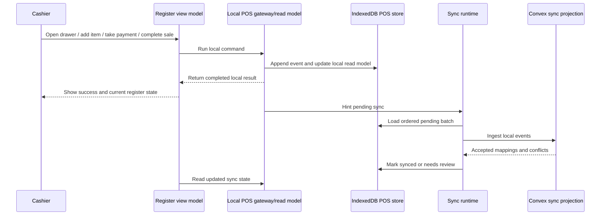
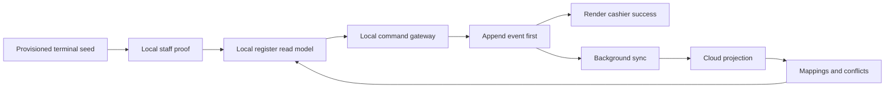

# feat: Make POS register always local-first

## Summary

Invert the landed POS offline runtime from online-primary fallback to local-first by default. The register should append local events and render from local POS state before cloud work, whether the browser is online or offline, while the existing sync ingestion/projection path turns local history into Athena cloud records in the background.

---

## Problem Frame

The first POS local-first landing added the local store, sync scheduler, server ingestion, projection, and reconciliation rails, but the active register flow still prefers Convex commands when connectivity exists and only falls back to pending local events on unavailable/unknown failures. That means normal online operation is not yet the product requirement from the origin document: POS must load and act from local state first every time, even when a network connection exists.

This plan narrows the follow-up to the POS register flow. It preserves the existing POS-only offline scope, server projection model, payment semantics, drawer invariants, and manager reconciliation posture from the origin requirements.

---

## Requirements

- R1. POS register commands must append durable local events before presenting success to the cashier, regardless of `navigator.onLine` or current Convex reachability.
- R2. The active register, active sale, cart, checkout, closeout, and sync-status UI must render from local POS state first.
- R3. Cloud sync must become background projection of local history, not the path that makes a cashier action complete.
- R4. Online Convex reads may refresh local seed/read models, but must not be required for the cashier to open a drawer, build a cart, take payment, complete a sale, close out, or reopen a local register session after provisioning.
- R5. Existing server ingestion/projection must remain the cloud acceptance boundary for local events, idempotency, local-to-cloud mappings, conflicts, cash controls, transactions, payment allocations, inventory, and traces.
- R6. Local staff authority must support register operation after a terminal has already been provisioned and authenticated online.
- R7. Catalog search and availability must use the latest local snapshot first, with online refresh treated as opportunistic.
- R8. Payment behavior must preserve the current POS payment model and all configured POS payment methods without adding offline-only confirmation states.
- R9. Local closeout must pause selling for the local register session until a permitted local reopen event is recorded.
- R10. Pending sync, syncing, synced, locally closed, and needs-review states must stay visible without framing local operation as broken.
- R11. The implementation must not expand offline-first behavior into non-POS Athena workspaces.

**Origin actors:** A1 Cashier, A2 Store manager, A3 Athena POS terminal, A4 Athena cloud
**Origin flows:** F1 Provision a POS terminal for offline use, F2 Operate the register while offline, F3 Complete checkout with any payment method offline, F4 Finalize a local closeout before sync, F5 Sync and reconcile local POS history
**Origin acceptance examples:** AE1-AE10

---

## Scope Boundaries

- Non-POS offline behavior remains out of scope. Analytics, procurement, staff management, admin, and cash-control review may continue to depend on online Convex state.
- New business creation and first-time terminal provisioning while offline remain out of scope.
- Peer-to-peer sync between disconnected terminals remains out of scope.
- Real-time offline stock coordination across terminals remains out of scope. Local availability remains last-known and conflicts reconcile after sync.
- Payment-provider-specific offline authorization remains out of scope; this plan records the cashier's tender selection using the current POS model.
- Rich manager reconciliation workbench remains a follow-up; this plan preserves and surfaces the existing sync conflict records.
- Visual validation is explicitly left to the user for this planning run.

### Deferred to Follow-Up Work

- Full PWA/service-worker shell hardening beyond what is needed for the register to reload from local state.
- Local-first support for POS expense sessions unless implementation reveals a shared primitive that can be adopted without widening scope.
- New receipt-delivery or customer messaging behavior beyond preserving local receipt identity.

---

## Context & Research

### Relevant Code and Patterns

- `packages/athena-webapp/src/lib/pos/presentation/register/useRegisterViewModel.ts` currently owns register orchestration and contains the online-first fallback seams: synced best-effort local event writes, pending fallback writes, local-only session state, and sync status aggregation.
- `packages/athena-webapp/src/lib/pos/application/ports.ts` defines the current POS command gateway boundary. The local-first command path should satisfy or extend this boundary rather than embedding persistence rules in components.
- `packages/athena-webapp/src/lib/pos/infrastructure/convex/commandGateway.ts` remains useful as the online command adapter, but should no longer be the primary cashier action path.
- `packages/athena-webapp/src/lib/pos/infrastructure/local/posLocalStore.ts` already stores provisioned terminal seed, ordered events, mappings, and sync status.
- `packages/athena-webapp/src/lib/pos/infrastructure/local/syncContract.ts` already maps syncable local events into upload payloads, but local cart/state events need to become first-class enough to rebuild the local register state.
- `packages/athena-webapp/src/lib/pos/infrastructure/local/usePosLocalSyncRuntime.ts` already runs the foreground sync scheduler and calls `api.pos.public.sync.ingestLocalEvents`.
- `packages/athena-webapp/convex/pos/application/sync/ingestLocalEvents.ts` and `projectLocalEvents.ts` already provide ordered, idempotent sync projection into cloud records.
- `packages/athena-webapp/src/lib/pos/infrastructure/convex/catalogGateway.ts` and `packages/athena-webapp/src/lib/pos/presentation/register/catalogSearch.ts` provide the existing compact catalog snapshot and local search foundation.
- `packages/athena-webapp/src/components/pos/CashierAuthDialog.tsx` still authenticates staff through Convex and returns `posLocalStaffProof`; local re-authentication after reload is the largest remaining boot gap.

### Institutional Learnings

- `docs/solutions/architecture/athena-pos-local-first-sync-2026-05-13.md` says POS local-first should use event logs, distinct local ids, strict ordering, idempotent projection, and reconciliation rather than mutation replay.
- `docs/solutions/performance/athena-pos-cart-latency-foundation-2026-05-05.md` says the active register is a production hot path and cart changes should avoid full-catalog reactivity.
- `docs/solutions/logic-errors/athena-pos-drawer-invariants-at-command-boundaries-2026-04-24.md` says drawer invariants must remain command-boundary rules, not just UI gates.
- The prior POS architecture memory keeps `registerSessionId` as the bridge between sales, drawer state, and cash controls; the local-first path must preserve that relationship through local ids and mappings.

### External References

- No new external research is needed for this follow-up. The architecture, IndexedDB choice, and sync projection posture were established by the prior plan and landed code; this plan is a repo-local inversion of the command/read boundary.

---

## Key Technical Decisions

- Local command gateway becomes primary: register open, start sale, cart edits, payment capture, transaction completion, closeout, and reopen should all go through local append/read-model logic first.
- Convex command gateway becomes projection support, not cashier-path dependency: successful online state may refresh local snapshots, but cashier completion must not wait for Convex mutation success.
- Local read model is explicit: do not keep scattering `localOperableRegisterSession`, `localOperablePosSession`, and optimistic cart maps through the view model as the source of truth. Build a focused local register read model from the local store/events.
- Keep sync event projection mostly intact: the server ingestion path already solves order, idempotency, mappings, conflicts, and cloud projection; this work should extend its event coverage only where required by local-first cart/read-model reconstruction.
- Store staff proof locally with expiry and scope: use the existing server-issued `posLocalStaffProof` as the basis for local register authority, while keeping expired/missing proof states explicit.
- Catalog snapshot refresh is opportunistic: online catalog subscriptions should write the latest local snapshot, but register search should degrade to the last local snapshot instead of blocking on live reads.
- Closeout remains a local state transition: after local closeout, local selling is disabled until local reopen is recorded; sync later projects both in order.

---

## Open Questions

### Resolved During Planning

- Should online mode still use Convex commands first? No. The requirement is local-first regardless of active internet connection.
- Should the server sync boundary be replaced? No. It already matches the event-log architecture; the client command/read path is what needs inversion.
- Should visual validation be part of this plan handoff? No. The user asked to handle visual validation separately.

### Deferred to Implementation

- Exact local read-model storage shape: derive during implementation, but tests must prove reload from IndexedDB can reconstruct active register, active sale, cart, payments, closeout, and sync status.
- Exact local staff proof refresh cadence: decide while integrating with existing `posLocalStaffProof` expiry and staff-auth tests.
- Exact local receipt number format: keep terminal-scoped permanence and cloud searchability; final string shape can follow existing transaction display constraints.
- Whether the local store needs a migration from the just-landed schema version: determine after inspecting current IndexedDB schema assumptions during implementation.

---

## High-Level Technical Design

> *This illustrates the intended approach and is directional guidance for review, not implementation specification. The implementing agent should treat it as context, not code to reproduce.*

---

## Implementation Units

- U1. **Create the local register read model**

**Goal:** Give the POS register a durable local state source for active register session, active sale, cart, payments, closeout state, receipt identity, and sync state.

**Requirements:** R1, R2, R4, R9, R10

**Dependencies:** None

**Files:**
- Modify: `packages/athena-webapp/src/lib/pos/infrastructure/local/posLocalStore.ts`
- Create: `packages/athena-webapp/src/lib/pos/infrastructure/local/registerReadModel.ts`
- Create: `packages/athena-webapp/src/lib/pos/infrastructure/local/registerReadModel.test.ts`
- Modify: `packages/athena-webapp/src/lib/pos/infrastructure/local/syncStatus.ts`
- Modify: `packages/athena-webapp/src/lib/pos/infrastructure/local/syncStatus.test.ts`

**Approach:**
- Build a small read-model layer that can reconstruct register state from local seed plus ordered local events.
- Represent open, selling, locally closed, reopened, pending sync, synced, and needs-review states without relying on live Convex ids.
- Keep local ids stable and distinct from cloud ids; use mappings only as cloud-projection metadata.
- Make local cart and payment state replayable after reload rather than relying on transient optimistic maps.

**Execution note:** Implement test-first. Characterize the current local event store behavior before changing event payload assumptions.

**Patterns to follow:**
- `packages/athena-webapp/src/lib/pos/infrastructure/local/posLocalStore.test.ts`
- `packages/athena-webapp/src/lib/pos/infrastructure/local/syncContract.test.ts`

**Test scenarios:**
- Happy path: replaying register open, sale start, item add, payment add, sale completion, and closeout events produces the expected local register state.
- Happy path: a synced event with a cloud mapping still renders through the same local identity.
- Edge case: replay with a locally closed register blocks additional sale state until a reopen event appears.
- Edge case: a needs-review event keeps completed local sale history visible while surfacing review status.
- Error path: malformed or unsupported local event payload does not corrupt the whole read model and produces an explicit local-store/read-model error.
- Integration: after marking events synced, the read model still preserves receipt and transaction identity.

**Verification:**
- The register read model can reconstruct a usable active register and completed sale from local storage alone.

---

- U2. **Add the primary local POS command gateway**

**Goal:** Move register actions to a local-first command gateway that appends durable local events before returning success, independent of current network status.

**Requirements:** R1, R2, R3, R4, R8, R9

**Dependencies:** U1

**Files:**
- Modify: `packages/athena-webapp/src/lib/pos/application/ports.ts`
- Create: `packages/athena-webapp/src/lib/pos/infrastructure/local/localCommandGateway.ts`
- Create: `packages/athena-webapp/src/lib/pos/infrastructure/local/localCommandGateway.test.ts`
- Modify: `packages/athena-webapp/src/lib/pos/infrastructure/local/syncContract.ts`
- Modify: `packages/athena-webapp/src/lib/pos/infrastructure/local/syncContract.test.ts`

**Approach:**
- Provide local implementations for open drawer, start session, add/update/remove cart item, clear cart, record payments, complete transaction, closeout, and reopen.
- Return DTO-compatible results where the existing application use cases expect them, using local ids and local receipt numbers.
- Trigger sync hints after appends, but never wait for upload to report cashier success.
- Keep server-command adapters available for explicit online refresh or future compatibility, but out of the normal cashier command path.

**Execution note:** Start with failing tests that assert local commands do not call Convex and still return success when `navigator.onLine` is true.

**Patterns to follow:**
- `packages/athena-webapp/src/lib/pos/infrastructure/convex/commandGateway.ts`
- `packages/athena-webapp/src/lib/pos/application/useCases/*.ts`

**Test scenarios:**
- Covers AE3. Happy path: with an online browser, adding an item appends a local cart event and returns a successful local result without invoking a Convex mutation.
- Covers AE4/AE5. Happy path: completing a sale with cash, mobile money, and mixed payments appends a local completed-sale event with payment method, amount, timestamp, and staff context.
- Edge case: starting a sale without an open local register returns the existing drawer-closed operator path.
- Edge case: local receipt numbers remain stable across repeated reads of the completed transaction.
- Error path: if IndexedDB append fails, the command returns failure and the UI must not show sale success.
- Integration: local closeout appends after all prior local sale events and causes subsequent add-item commands to fail until reopen.

**Verification:**
- All core POS cashier commands can succeed from local storage first in both online and offline browser states.

---

- U3. **Wire the register view model to local state first**

**Goal:** Replace online-primary orchestration in the active POS register with local read-model and local command gateway consumption.

**Requirements:** R1, R2, R3, R4, R10, R11

**Dependencies:** U1, U2

**Files:**
- Modify: `packages/athena-webapp/src/lib/pos/presentation/register/useRegisterViewModel.ts`
- Modify: `packages/athena-webapp/src/lib/pos/presentation/register/useRegisterViewModel.test.ts`
- Modify if needed: `packages/athena-webapp/src/lib/pos/presentation/register/registerUiState.ts`
- Modify if needed: `packages/athena-webapp/src/components/pos/register/POSRegisterView.tsx`
- Modify if needed: `packages/athena-webapp/src/components/pos/register/POSRegisterView.test.tsx`

**Approach:**
- Remove the "try Convex then append synced local event / fallback pending local event" structure from the cashier path.
- Replace `localOperableRegisterSession`, `localOperablePosSession`, optimistic cart maps, and synced best-effort local writes with the local read-model state.
- Keep Convex register/session/catalog reads as refresh inputs, not as requirements for cashier operation.
- Preserve existing operator copy and error normalization when local prerequisites are missing.

**Execution note:** Add characterization tests for the current online-first behavior first, then flip the assertions to local-first.

**Patterns to follow:**
- Existing view-model tests around local fallback and sync presentation in `useRegisterViewModel.test.ts`.
- Current product-entry/search behavior in `packages/athena-webapp/src/components/pos/ProductEntry.tsx`.

**Test scenarios:**
- Covers AE1. Happy path: after provisioned seed and local staff proof exist, the register can open from local state with no Convex register state.
- Covers AE3. Happy path: an online browser completing a sale uses the local command gateway first and surfaces pending sync rather than waiting for Convex completion.
- Edge case: when local seed is missing, the register shows provisioning/setup guidance instead of starting a local sale.
- Edge case: when local read model is locally closed, product entry and checkout controls are disabled until reopen.
- Error path: local append failure produces an operator-safe error and does not leave optimistic cart/payment UI behind.
- Integration: background sync changing an event to needs-review updates the register sync badge without deleting the completed local sale.

**Verification:**
- The view model no longer requires Convex command success for normal register operation and all prior drawer/payment/session invariants remain represented.

---

- U4. **Persist and refresh local staff and terminal authority**

**Goal:** Make already-provisioned terminals capable of local register authentication and staff authority checks after reload or temporary network loss.

**Requirements:** R4, R6, R8, R10

**Dependencies:** U1

**Files:**
- Modify: `packages/athena-webapp/convex/operations/staffCredentials.ts`
- Modify: `packages/athena-webapp/convex/operations/staffCredentials.test.ts`
- Modify: `packages/athena-webapp/src/components/pos/CashierAuthDialog.tsx`
- Modify: `packages/athena-webapp/src/components/pos/CashierAuthDialog.test.tsx`
- Modify: `packages/athena-webapp/src/lib/pos/infrastructure/local/posLocalStore.ts`
- Modify: `packages/athena-webapp/src/lib/pos/infrastructure/local/posLocalStore.test.ts`
- Create: `packages/athena-webapp/src/lib/pos/infrastructure/local/localStaffAuthority.ts`
- Create: `packages/athena-webapp/src/lib/pos/infrastructure/local/localStaffAuthority.test.ts`

**Approach:**
- Persist the server-issued terminal/staff proof material locally with expiry, store scope, terminal scope, and role scope.
- Allow local register sign-in when proof material is still valid and scoped to cashier/manager POS operation.
- Refresh local proof material opportunistically when online authentication succeeds.
- Keep expired, missing, revoked, or scope-mismatched proof states explicit so sync can later surface permission drift instead of silently rewriting local history.

**Execution note:** Treat this as auth-sensitive and test-first. Do not store raw PINs.

**Patterns to follow:**
- `packages/athena-webapp/convex/operations/staffCredentials.ts`
- `packages/athena-webapp/convex/pos/application/sync/staffProof.ts`
- `packages/athena-webapp/convex/pos/application/sync/projectLocalEvents.ts`

**Test scenarios:**
- Happy path: online staff auth writes a local proof that can later authorize POS register operation without a live mutation.
- Edge case: expired proof blocks local sign-in and prompts reconnect/authentication.
- Edge case: manager-only local action requires a manager-scoped proof.
- Error path: local proof with wrong terminal or store scope is rejected locally.
- Integration: sync projection with permission drift creates a needs-review conflict while preserving the locally completed sale.

**Verification:**
- A provisioned, recently authenticated terminal can reload and sign into POS locally without using Convex, while expired or invalid proofs fail closed.

---

- U5. **Make catalog and availability local-first**

**Goal:** Ensure product search, exact lookup, and sale item payloads use the latest local catalog snapshot first while online catalog data refreshes the snapshot opportunistically.

**Requirements:** R4, R7, R8

**Dependencies:** U1, U3

**Files:**
- Modify: `packages/athena-webapp/src/lib/pos/infrastructure/convex/catalogGateway.ts`
- Create: `packages/athena-webapp/src/lib/pos/infrastructure/local/localCatalogSnapshot.ts`
- Create: `packages/athena-webapp/src/lib/pos/infrastructure/local/localCatalogSnapshot.test.ts`
- Modify: `packages/athena-webapp/src/lib/pos/presentation/register/useRegisterCatalogIndex.ts`
- Modify: `packages/athena-webapp/src/lib/pos/presentation/register/catalogSearch.test.ts`
- Modify: `packages/athena-webapp/src/lib/pos/presentation/register/useRegisterViewModel.test.ts`

**Approach:**
- Store compact register catalog rows and last-known availability in the local POS store or a sibling local snapshot store.
- Hydrate register search from local rows first, then refresh from Convex rows when they arrive.
- Preserve the bounded availability pattern; do not reintroduce full-catalog volatile reactivity.
- Include enough catalog item data in local completed-sale events to preserve customer receipt and cloud projection even if catalog metadata changes before sync.

**Patterns to follow:**
- `docs/solutions/logic-errors/athena-pos-register-local-catalog-search-2026-05-04.md`
- `docs/solutions/performance/athena-pos-cart-latency-foundation-2026-05-05.md`
- `packages/athena-webapp/src/lib/pos/presentation/register/catalogSearch.ts`

**Test scenarios:**
- Covers AE1/AE3. Happy path: register search returns local catalog matches with no live Convex catalog result.
- Happy path: online catalog rows refresh the local snapshot without disrupting the active query.
- Edge case: last-known availability of zero prevents auto-add but keeps exact match visible.
- Edge case: stale local price is preserved in completed-sale payload and later sync creates catalog reconciliation if needed.
- Error path: missing local catalog snapshot blocks item add with operator-safe copy rather than a raw backend/network error.
- Integration: exact barcode scan uses the local index and local command gateway in the same flow.

**Verification:**
- Product lookup and sale completion can run from local snapshot data, with online refresh treated as non-blocking.

---

- U6. **Keep sync projection aligned with richer local events**

**Goal:** Ensure background sync can accept the always-local event timeline, project cloud records idempotently, and return mappings/conflicts that update the local read model.

**Requirements:** R3, R5, R8, R9, R10

**Dependencies:** U1, U2, U4, U5

**Files:**
- Modify: `packages/athena-webapp/src/lib/pos/infrastructure/local/syncContract.ts`
- Modify: `packages/athena-webapp/src/lib/pos/infrastructure/local/syncContract.test.ts`
- Modify: `packages/athena-webapp/src/lib/pos/infrastructure/local/usePosLocalSyncRuntime.ts`
- Modify: `packages/athena-webapp/src/lib/pos/infrastructure/local/usePosLocalSyncRuntime.test.ts`
- Modify: `packages/athena-webapp/convex/pos/public/sync.ts`
- Modify: `packages/athena-webapp/convex/pos/public/sync.test.ts`
- Modify: `packages/athena-webapp/convex/pos/application/sync/ingestLocalEvents.ts`
- Modify: `packages/athena-webapp/convex/pos/application/sync/ingestLocalEvents.test.ts`
- Modify: `packages/athena-webapp/convex/pos/application/sync/projectLocalEvents.ts`
- Modify: `packages/athena-webapp/convex/pos/application/sync/projectLocalEvents.test.ts`

**Approach:**
- Keep syncable upload events focused on business checkpoints: register opened, sale completed, register closed, register reopened, and any cash movement needed by current POS flow.
- Use non-uploaded local cart/payment events to build completed-sale payloads and local read model, not necessarily as independent cloud records.
- Return accepted mappings and conflicts in a way the local store can persist and the register can render.
- Ensure retrying the same local event after partial sync returns stable accepted/conflict outcomes.

**Execution note:** Characterization-first around current sync ingestion before changing event coverage.

**Patterns to follow:**
- `packages/athena-webapp/convex/pos/application/sync/projectLocalEvents.test.ts`
- `packages/athena-webapp/convex/pos/infrastructure/repositories/localSyncRepository.ts`

**Test scenarios:**
- Covers AE7. Happy path: ordered local register open, sale, closeout sync twice without duplicate register sessions, sales, payment allocations, inventory movements, or traces.
- Covers AE8. Edge case: oversold local inventory preserves completed sale and creates inventory reconciliation.
- Covers AE9. Edge case: malformed or conflicting payment payload creates payment reconciliation while preserving the sale record when possible.
- Error path: out-of-order event is held and later accepted after the missing earlier event arrives.
- Error path: mismatched retry payload for the same local event id is rejected.
- Integration: returned mappings update local store state and later local events reference mapped cloud records where needed.

**Verification:**
- Existing sync behavior remains intact while richer always-local register flows project safely into cloud records.

---

- U7. **Add app-shell and reload readiness for provisioned POS**

**Goal:** Make the already-provisioned register recover from reload or temporary network loss using local seed, staff proof, catalog snapshot, and event/read-model state.

**Requirements:** R2, R4, R6, R10, R11

**Dependencies:** U1, U3, U4, U5

**Files:**
- Create: `packages/athena-webapp/src/lib/pos/infrastructure/local/offlineReadiness.ts`
- Create: `packages/athena-webapp/src/lib/pos/infrastructure/local/offlineReadiness.test.ts`
- Modify: `packages/athena-webapp/src/routes/_authed/$orgUrlSlug/store/$storeUrlSlug/pos/register.index.tsx`
- Modify if needed: `packages/athena-webapp/src/components/pos/register/POSRegisterOpeningGuard.tsx`
- Modify: `packages/athena-webapp/src/lib/pos/presentation/register/useRegisterViewModel.test.ts`
- Modify if needed: `packages/athena-webapp/vite.config.ts`

**Approach:**
- Add a POS-readiness check that distinguishes provisioned-ready, needs-online-provisioning, local-store-unavailable, proof-expired, catalog-missing, and schema-unsupported states.
- Ensure POS register route can choose the local bootstrap path before waiting for protected Convex query readiness.
- Keep service worker/PWA changes minimal and only include them if required to make the provisioned register reload locally.

**Patterns to follow:**
- Existing protected-query readiness patterns in Athena auth/session components.
- `packages/athena-webapp/src/lib/pos/infrastructure/local/usePosLocalSyncRuntime.ts`

**Test scenarios:**
- Covers AE1. Happy path: provisioned seed plus staff proof plus catalog snapshot reports POS-ready without a live backend.
- Edge case: IndexedDB unsupported reports local-store-unavailable and blocks local operation.
- Edge case: schema unsupported reports an upgrade/reconnect state rather than clearing local history.
- Error path: missing terminal seed routes to online provisioning/setup.
- Integration: route-level bootstrap does not wait for Convex register state before rendering local register state.

**Verification:**
- A provisioned local state can survive reload and reopen the register route without live Convex data.

---

- U8. **Update tests, docs, and validation coverage for the inverted boundary**

**Goal:** Lock in the always-local-first guarantee and make future online-first regressions visible.

**Requirements:** R1-R11

**Dependencies:** U1-U7

**Files:**
- Modify: `packages/athena-webapp/docs/agent/validation-map.json`
- Modify if needed: `packages/athena-webapp/docs/agent/test-index.md`
- Modify: `docs/solutions/architecture/athena-pos-local-first-sync-2026-05-13.md`
- Modify or create: `docs/solutions/architecture/athena-pos-always-local-first-register-2026-05-14.md`
- Modify if needed: `scripts/harness-app-registry.ts`
- Modify if needed: `scripts/harness-app-registry.test.ts`

**Approach:**
- Add or update validation-map entries for local command gateway, read model, staff proof, catalog snapshot, sync contract, and app-shell readiness tests.
- Document the prevention rule: POS cashier commands must not use Convex mutation success as the first durable write.
- Capture exact high-value test scenarios as harness-visible coverage where the repo expects generated docs.
- Run graphify after code changes during implementation because POS local/sync boundaries are code-bearing graph nodes.

**Patterns to follow:**
- Existing generated agent docs conventions under `packages/athena-webapp/docs/agent`.
- `docs/solutions/architecture/athena-pos-local-first-sync-2026-05-13.md`

**Test scenarios:**
- Integration: validation-map contains the new local-first test surfaces so changed-file validation can route implementers correctly.
- Error path: a source-count/harness assertion fails if new local POS infrastructure lacks registered test coverage.
- Regression: a lightweight source assertion can detect the cashier path directly invoking the Convex command gateway before local append.

**Verification:**
- The repo documents and enforces that POS register commands are local-first regardless of internet connectivity.

---

## System-Wide Impact

- **Interaction graph:** `useRegisterViewModel` stops treating Convex command gateway success as the normal completion path and instead consumes local command/read-model state plus background sync status.
- **Error propagation:** Local append failures become cashier-visible command failures. Cloud sync failures become pending/failed/needs-review state, not checkout failure after local success.
- **State lifecycle risks:** IndexedDB schema/versioning, local id mappings, proof expiry, and out-of-order sync all become load-bearing. Tests must cover reload and retry behavior.
- **API surface parity:** Existing POS command DTOs should stay compatible where practical, but local ids may require explicit type narrowing or local DTO fields.
- **Integration coverage:** Unit tests alone are not enough; the plan needs cross-layer coverage for local command -> read model -> sync upload -> Convex projection -> mapping/conflict return.
- **Unchanged invariants:** Drawer binding, payment semantics, register closeout/reopen policy, POS-only offline scope, and cloud reconciliation ownership remain unchanged.

---

## Risks & Dependencies

| Risk | Mitigation |
|------|------------|
| Local store corruption blocks the register | Add schema-version handling, explicit unsupported-state UI, and tests for failed writes before cashier success. |
| Staff proof storage becomes a security hole | Store scoped proof tokens, not raw PINs; enforce expiry and terminal/store/role scope; validate again during sync. |
| Online data refresh overwrites active local sale state | Keep refresh as seed/snapshot input only; local event/read-model history remains the active source. |
| Local catalog is stale | Preserve completed sale and route price/inventory drift to reconciliation instead of rewriting receipt history. |
| Sync projection duplicates cloud records | Keep local event ids, strict sequence, local-to-cloud mappings, and retry equality checks in server ingestion. |
| View-model refactor becomes too broad | Introduce local read model and gateway first, then replace online-first branches in focused passes with characterization tests. |

---

## Documentation / Operational Notes

- Update the local-first architecture solution after implementation to say the register is now local-first even while online.
- Keep the older implementation plan as history; this follow-up plan supersedes its client-side command/read-model assumptions.
- During execution, visual validation is user-owned, but implementation should still include automated behavioral tests and repo validation.

---

## Sources & References

- **Origin document:** [docs/brainstorms/2026-05-13-pos-local-first-register-requirements.md](../brainstorms/2026-05-13-pos-local-first-register-requirements.md)
- Prior plan: [docs/plans/2026-05-13-001-feat-pos-local-first-register-plan.md](./2026-05-13-001-feat-pos-local-first-register-plan.md)
- Related solution: [docs/solutions/architecture/athena-pos-local-first-sync-2026-05-13.md](../solutions/architecture/athena-pos-local-first-sync-2026-05-13.md)
- Related solution: [docs/solutions/performance/athena-pos-cart-latency-foundation-2026-05-05.md](../solutions/performance/athena-pos-cart-latency-foundation-2026-05-05.md)
- Related solution: [docs/solutions/logic-errors/athena-pos-drawer-invariants-at-command-boundaries-2026-04-24.md](../solutions/logic-errors/athena-pos-drawer-invariants-at-command-boundaries-2026-04-24.md)
