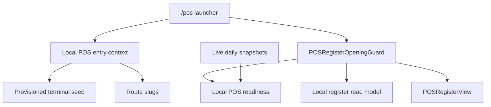

# feat: Make POS entry and readiness local-first

## Summary

Make the path from `/pos` into `/pos/register` use the landed POS local-first runtime instead of waiting on live Convex reads. A provisioned terminal should be able to launch POS from the route, resolve store and terminal authority from local state, and pass the register readiness gate when its local store-day state allows selling.

---

## Problem Frame

The landed POS local-first work gives the cashier path durable local events, a local command gateway, a local register read model, and background sync. The remaining gap is before those pieces can help: `/pos` currently blanks behind live analytics/store reads, and `POSRegisterOpeningGuard` waits on live daily-opening and daily-close snapshots before rendering the register.

This plan complements `docs/plans/2026-05-14-001-feat-pos-always-local-first-flow-plan.md`; it does not re-plan the already-landed command-gateway inversion. It focuses on entry, local context, and readiness gates.

---

## Requirements

- R1. A provisioned POS terminal must be able to render the POS entry action from `/pos` without live Convex analytics, summary, organization, or store reads.
- R2. `/pos` must treat POS as the offline-first launcher while allowing non-POS cards, analytics, and admin summaries to remain unavailable or stale when offline.
- R3. `/pos/register` must evaluate POS readiness from local terminal/store-day state when live daily-opening or daily-close snapshots are unavailable.
- R4. Online daily-opening, daily-close, store, organization, and terminal reads may refresh local POS context and readiness state, but they must not be required for entry after provisioning.
- R5. If no provisioned local POS seed exists, offline entry must fail closed with operator-safe setup guidance instead of a blank route.
- R6. Local readiness must preserve the business distinction between store-day state and register/drawer state; it must not bypass completed daily close or local closeout constraints.
- R7. Existing local command gateway, local register read model, local sync runtime, local terminal seed, and sync projection behavior must be reused as the foundation.
- R8. The plan must not expand offline-first behavior into non-POS Athena workspaces.
- R9. Tests and harness coverage must make the route-entry gap visible so future POS local-first work cannot regress into live-read gating.

**Origin actors:** A1 Cashier, A2 Store manager, A3 Athena POS terminal, A4 Athena cloud
**Origin flows:** F1 Provision a POS terminal for offline use, F2 Operate the register while offline, F4 Finalize a local closeout before sync, F5 Sync and reconcile local POS history
**Origin acceptance examples:** AE1, AE2, AE3, AE6, AE7

---

## Scope Boundaries

- New business creation or first-time terminal provisioning while offline remains out of scope.
- Full offline app-shell or service-worker asset caching is out of scope unless implementation reveals a tiny route-readiness hook is required. This plan assumes the app code is already loaded.
- Offline support for analytics, procurement, cash-controls review, expense sessions, admin settings, and product lookup remains out of scope.
- Payment semantics, receipt messaging, sync ingestion/projection, reconciliation records, and command-gateway behavior are out of scope except where entry/readiness needs to consume their landed state.
- Visual redesign of the POS landing page is out of scope; any UI work should stay restrained and operational.

### Deferred to Follow-Up Work

- A dedicated PWA/offline-app-shell plan if field validation shows operators need cold browser reloads with no cached app assets.
- Richer manager-facing stale-state review for daily opening and daily close history.
- Offline-first expense-session entry unless the implementation can reuse a helper without changing expense behavior.

---

## Context & Research

### Relevant Code and Patterns

- `packages/athena-webapp/src/components/pos/PointOfSaleView.tsx` currently queries store analytics and today's POS summary, then returns `null` unless active store, analytics, and organization data are present.
- `packages/athena-webapp/src/components/pos/PointOfSaleView.test.tsx` has focused landing-page tests and should gain offline launcher coverage.
- `packages/athena-webapp/src/components/pos/register/POSRegisterOpeningGuard.tsx` currently waits for live daily-opening and daily-close snapshots before rendering the register.
- `packages/athena-webapp/src/components/pos/register/POSRegisterOpeningGuard.test.tsx` currently locks in the live-snapshot wait behavior; it should be updated to prove local readiness is accepted.
- `packages/athena-webapp/src/hooks/useGetActiveStore.ts` is online-shaped and returns state populated by Convex reads/actions; POS entry should not depend solely on it.
- `packages/athena-webapp/src/hooks/useGetTerminal.ts` already falls back to `readProvisionedTerminalSeed` when Convex terminal lookup is unavailable.
- `packages/athena-webapp/src/lib/pos/infrastructure/local/posLocalStore.ts` stores the provisioned terminal seed and local events. The current seed carries store and terminal identity, but not route slugs.
- `packages/athena-webapp/src/lib/pos/infrastructure/local/localRegisterReader.ts` and `registerReadModel.ts` already project local register state from stored events and the provisioned seed.
- `packages/athena-webapp/src/lib/pos/infrastructure/local/usePosLocalSyncRuntime.ts` reads local events and sync status through the provisioned seed.

### Institutional Learnings

- `docs/solutions/architecture/athena-pos-local-first-sync-2026-05-13.md` says POS local-first uses event logs, distinct local ids, strict ordering, idempotent projection, and reconciliation.
- `docs/solutions/architecture/athena-pos-always-local-first-register-2026-05-14.md` says browser connectivity can trigger sync but must not decide whether cashier work is recorded locally first.
- `docs/solutions/logic-errors/athena-daily-opening-readiness-gate-2026-05-08.md` keeps daily opening as a store-day acknowledgement, not another register-session workflow.
- `docs/solutions/logic-errors/athena-daily-close-store-day-boundary-2026-05-07.md` treats daily close reopening as a store-day lifecycle mutation, so local POS readiness must not silently ignore a completed store day.

### External References

- No new external research is needed. This is a repo-local integration of already-selected POS local storage, route, and readiness patterns.

---

## Key Technical Decisions

- Treat the landed local POS runtime as foundation: this plan consumes `posLocalStore`, terminal seed fallback, local register projection, local command gateway, and sync status rather than re-planning them.
- Separate navigation identity from POS authority: route params can provide org/store slugs for links, while the provisioned terminal seed provides local store and terminal authority for POS behavior.
- Add a POS-local entry/readiness helper instead of placing IndexedDB reads in route components. Route components should consume a small, testable local context/readiness API.
- Let online snapshots refresh local readiness opportunistically. Live daily-opening and daily-close results should write or update the local POS readiness seed, then the guard should render from the combined local-first result.
- Fail closed when local authority is absent or stale in a way that would change business state. A missing provisioned seed, mismatched store, locally closed day, or unsupported local schema should render operator-safe guidance.
- Keep `/pos` a launcher. Analytics, summaries, and admin cards may show stale/unavailable states, but they should not control whether the cashier can choose POS.

---

## Open Questions

### Resolved During Planning

- Has the local command-gateway inversion landed? Yes. Treat it as existing foundation and do not duplicate it in this plan.
- Should this update the previous always-local plan in place? No. The previous plan targets register command/read inversion; this plan targets the remaining entry and readiness gap.
- Should non-POS cards on `/pos` become offline-capable? No. POS is the only offline-first workflow in this release.

### Deferred to Implementation

- Exact local readiness record shape: choose while integrating with `posLocalStore`, but it must carry enough store-day state to distinguish started, not started, completed, reopened, and unknown.
- Whether readiness should be stored as explicit seed metadata or derived entirely from local events plus last live snapshots: decide after inspecting the smallest durable representation during implementation.
- Exact copy for setup-required and stale-readiness states: follow `docs/product-copy-tone.md` and keep messages calm, clear, and operational.
- Whether `useGetActiveStore` should gain a POS-specific fallback or whether POS entry should use a separate helper: decide by preserving non-POS hook behavior and avoiding broad route churn.

---

## High-Level Technical Design

> *This illustrates the intended approach and is directional guidance for review, not implementation specification. The implementing agent should treat it as context, not code to reproduce.*

```mermaid
flowchart TB
    Route["/pos route params"] --> Launcher["POS launcher context"]
    Seed["Provisioned terminal seed"] --> Launcher
    LiveStore["Live org/store reads"] --> Launcher
    Launcher --> PosCard["Render POS entry"]
    Launcher --> OptionalCards["Render or degrade non-POS cards"]

    PosCard --> Guard["/pos/register guard"]
    LocalReady["Local POS readiness"] --> Guard
    LocalRegister["Local register read model"] --> Guard
    LiveSnapshots["Daily opening/close snapshots"] --> Refresh["Refresh local readiness"]
    Refresh --> LocalReady
    Guard --> Register["Render register"]
    Guard --> Setup["Setup or blocked guidance"]
```

| Mode | `/pos` behavior | `/pos/register` behavior |
| --- | --- | --- |
| Online with live data | Render full landing and refresh local context | Use fresh snapshots and update local readiness |
| Offline with provisioned seed and open local day | Render POS launcher without analytics blocking | Allow register entry from local readiness |
| Offline without provisioned seed | Show setup-required POS guidance | Block register entry with setup-required guidance |
| Local day closed or closeout blocking sales | POS launcher remains visible | Block sales until permitted reopen/readiness change |

---

## Implementation Units

- U1. **Add POS local entry context**

**Goal:** Provide a small local-first context API for POS entry that can resolve route slugs, store id, terminal seed, terminal identity, and local availability without live Convex reads.

**Requirements:** R1, R4, R5, R7

**Dependencies:** None

**Files:**
- Create: `packages/athena-webapp/src/lib/pos/infrastructure/local/localPosEntryContext.ts`
- Create: `packages/athena-webapp/src/lib/pos/infrastructure/local/localPosEntryContext.test.ts`
- Modify if needed: `packages/athena-webapp/src/lib/pos/infrastructure/local/posLocalStore.ts`
- Modify if needed: `packages/athena-webapp/src/lib/pos/infrastructure/local/posLocalStore.test.ts`
- Modify if needed: `packages/athena-webapp/src/hooks/useGetTerminal.ts`
- Modify if needed: `packages/athena-webapp/src/hooks/useGetTerminal.test.ts`

**Approach:**
- Read the provisioned terminal seed from the local POS store and validate it against the current route/store context when that context is known.
- Keep route params responsible for navigation slugs and the seed responsible for POS store/terminal authority.
- Return explicit states such as ready, missing seed, mismatched store, unsupported local schema, and loading local store.
- Avoid broad changes to `useGetActiveStore` unless implementation proves a small POS-specific fallback there is cleaner than a dedicated POS context helper.

**Execution note:** Start with tests for unavailable Convex state and a valid local terminal seed before changing route consumers.

**Patterns to follow:**
- `packages/athena-webapp/src/hooks/useGetTerminal.ts`
- `packages/athena-webapp/src/lib/pos/infrastructure/local/terminalScope.ts`
- `packages/athena-webapp/src/lib/pos/infrastructure/local/localRegisterReader.ts`

**Test scenarios:**
- Happy path: route params plus a matching provisioned seed produce a POS-ready entry context without live store or organization data.
- Happy path: live store/organization data enriches context when present without changing the local authority source.
- Edge case: seed for another store is rejected and returns setup-required state.
- Edge case: no seed returns missing-seed state rather than throwing or hanging.
- Error path: unsupported local-store schema produces a blocked local context with operator-safe error data.

**Verification:**
- POS route consumers can derive a register link and local store/terminal authority without Convex resolving first.

---

- U2. **Make `/pos` a local-first launcher**

**Goal:** Ensure the POS landing page renders the POS entry action when local POS context is available, even if analytics, today summary, active organization, or active store queries are unavailable.

**Requirements:** R1, R2, R5, R8

**Dependencies:** U1

**Files:**
- Modify: `packages/athena-webapp/src/components/pos/PointOfSaleView.tsx`
- Modify: `packages/athena-webapp/src/components/pos/PointOfSaleView.test.tsx`
- Modify if needed: `packages/athena-webapp/src/components/common/PageLevelHeader.tsx`
- Modify if needed: `packages/athena-webapp/src/components/states/not-found/NotFoundView.tsx`

**Approach:**
- Remove analytics and today-summary data from the render gate.
- Render the POS card using route params and local entry context when active store/org objects are unavailable.
- Degrade non-POS cards, admin-only cards, and summary widgets independently. They may hide, show placeholders, or show unavailable copy, but they must not suppress the POS launcher.
- Keep copy operational and avoid raw backend/network wording.

**Patterns to follow:**
- Existing `PointOfSaleView.test.tsx` route-link tests.
- `docs/product-copy-tone.md` for setup and unavailable-state wording.

**Test scenarios:**
- Covers AE1. Happy path: with no analytics/summary results but a valid local POS context, `/pos` renders a POS link to `/pos/register`.
- Covers AE2. Happy path: non-POS cards or summaries are hidden/degraded while POS remains selectable.
- Edge case: active organization/store are available but analytics is undefined; the page still renders POS and summary placeholders.
- Error path: no active store/org and no valid local seed renders setup guidance rather than a blank page.
- Integration: the POS link uses route params for slugs while preserving origin search behavior where relevant.

**Verification:**
- `/pos` no longer returns `null` solely because live analytics or summary queries are unresolved.

---

- U3. **Persist and read local POS readiness**

**Goal:** Give POS a local store-day readiness source that can represent started, not-started, closed, reopened, unknown, and stale states without live daily-operation snapshots.

**Requirements:** R3, R4, R5, R6, R7

**Dependencies:** U1

**Files:**
- Create: `packages/athena-webapp/src/lib/pos/infrastructure/local/localPosReadiness.ts`
- Create: `packages/athena-webapp/src/lib/pos/infrastructure/local/localPosReadiness.test.ts`
- Modify: `packages/athena-webapp/src/lib/pos/infrastructure/local/posLocalStore.ts`
- Modify: `packages/athena-webapp/src/lib/pos/infrastructure/local/posLocalStore.test.ts`
- Modify if needed: `packages/athena-webapp/src/lib/pos/infrastructure/local/registerReadModel.ts`
- Modify if needed: `packages/athena-webapp/src/lib/pos/infrastructure/local/registerReadModel.test.ts`

**Approach:**
- Store the last known POS-relevant daily-opening and daily-close posture in POS local infrastructure, scoped by store and operating date.
- Preserve local register closeout and reopen state from the local register read model as a separate input to readiness.
- Treat unknown readiness as blocked unless a local register state already proves a currently open/reopened selling context.
- Keep stale-readiness handling explicit so implementation does not silently sell through a closed store day.

**Execution note:** Add characterization coverage for current guard behavior before replacing the live-snapshot wait with local-first readiness.

**Patterns to follow:**
- `packages/athena-webapp/src/lib/pos/infrastructure/local/registerReadModel.ts`
- `packages/athena-webapp/src/components/pos/register/POSRegisterOpeningGuard.tsx`
- `docs/solutions/logic-errors/athena-daily-close-store-day-boundary-2026-05-07.md`

**Test scenarios:**
- Happy path: a started local store day allows POS register entry when live snapshots are unavailable.
- Edge case: a completed local day blocks selling unless the local readiness says the day was reopened.
- Edge case: local register closeout pending sync blocks new selling until local reopen is recorded.
- Error path: no readiness seed and no projected local register state returns setup/online-required guidance, not a blank screen.
- Integration: live started/open snapshots refresh local readiness for the current operating date.
- Integration: live completed close snapshots refresh local readiness so later offline entry blocks sales.

**Verification:**
- POS readiness can be evaluated from local state and refreshed from live daily-operation snapshots.

---

- U4. **Make `POSRegisterOpeningGuard` local-first**

**Goal:** Replace the current live-snapshot render gate with a local-first readiness decision that still honors daily opening, daily close, local closeout, and setup-required states.

**Requirements:** R3, R4, R5, R6, R9

**Dependencies:** U1, U3

**Files:**
- Modify: `packages/athena-webapp/src/components/pos/register/POSRegisterOpeningGuard.tsx`
- Modify: `packages/athena-webapp/src/components/pos/register/POSRegisterOpeningGuard.test.tsx`
- Modify if needed: `packages/athena-webapp/src/components/pos/register/POSRegisterView.tsx`
- Modify if needed: `packages/athena-webapp/src/components/pos/register/POSRegisterView.test.tsx`

**Approach:**
- Let live snapshots load opportunistically and update local readiness, but do not return `null` while they are undefined when local readiness can make a decision.
- Render register children when local readiness says the store day is started/reopened and no local register-closeout state blocks selling.
- Render existing blocked states for not-started and closed-day cases, updating copy where needed for local/offline clarity.
- Add a setup-required blocked state for missing or mismatched local terminal seed when offline local authority cannot be established.

**Patterns to follow:**
- Existing `StoreDayNotStartedState` and `StoreDayClosedState` components.
- `packages/athena-webapp/src/components/pos/register/POSRegisterView.test.tsx` setup-required and drawer-gate states.

**Test scenarios:**
- Covers AE1. Happy path: live opening and close snapshots are undefined, local readiness is started, and the register workspace renders.
- Covers AE6. Edge case: local readiness is closed and not reopened, so register children do not render.
- Edge case: live close snapshot says completed while local readiness is older and open; the guard blocks and refreshes local readiness.
- Error path: no local seed renders setup-required guidance.
- Error path: local readiness read fails with an unsupported schema and renders safe blocked guidance.
- Integration: when online snapshots arrive after local render, the guard updates if the current store day is now blocked.

**Verification:**
- The guard no longer requires live Convex snapshots to render a locally authorized register.

---

- U5. **Update validation coverage and planning docs**

**Goal:** Make the new POS entry/readiness contract visible in tests, harness metadata, and durable local-first learnings.

**Requirements:** R8, R9

**Dependencies:** U2, U3, U4

**Files:**
- Modify: `packages/athena-webapp/docs/agent/testing.md`
- Modify: `packages/athena-webapp/docs/agent/validation-map.json`
- Modify if needed: `scripts/harness-app-registry.ts`
- Create: `docs/solutions/architecture/athena-pos-local-first-entry-readiness-2026-05-14.md`
- Test: `packages/athena-webapp/src/components/pos/PointOfSaleView.test.tsx`
- Test: `packages/athena-webapp/src/components/pos/register/POSRegisterOpeningGuard.test.tsx`
- Test: `packages/athena-webapp/src/lib/pos/infrastructure/local/localPosEntryContext.test.ts`
- Test: `packages/athena-webapp/src/lib/pos/infrastructure/local/localPosReadiness.test.ts`

**Approach:**
- Add validation-map coverage for any new POS local entry/readiness files.
- Update the POS local sync/register validation guidance so route-entry and readiness changes run the focused POS local/register tests.
- Add a compact solution note describing the difference between POS launcher entry, store-day readiness, register/drawer state, and cashier local commands.
- Keep graphify current after code changes during implementation.

**Patterns to follow:**
- Existing POS local-first solution notes under `docs/solutions/architecture/`.
- `packages/athena-webapp/docs/agent/testing.md` POS local sync/register validation slice.

**Test scenarios:**
- Test expectation: none for docs-only assertions beyond generated harness consistency. Behavioral scenarios are covered by the test files listed above.

**Verification:**
- Harness metadata routes future touched POS entry/readiness files to the focused POS local/register validation surface.

---

## System-Wide Impact

- **Interaction graph:** `/pos` route rendering, route params, active store/org hooks, local terminal seed, local POS readiness, daily-opening/daily-close snapshots, local register read model, and register shell rendering all interact in the entry path.
- **Error propagation:** Missing seed, mismatched store, unsupported schema, and unavailable live snapshots should become operator-safe blocked/degraded states rather than blank screens or raw errors.
- **State lifecycle risks:** Stale local daily-close state is the main risk. Live snapshots must refresh local readiness when online, and stale local readiness must fail closed when it cannot safely prove selling is allowed.
- **API surface parity:** This should not change Convex public APIs unless a small readiness refresh helper is required. POS browser code should remain the consumer of local readiness.
- **Integration coverage:** Component tests must prove `/pos` launcher and `/pos/register` guard behavior when Convex reads are undefined.
- **Unchanged invariants:** POS cashier commands remain local-first through the landed local command gateway. Sync remains reconciliation/projection. Non-POS Athena surfaces remain online-only or stale/read-only while offline.

---

## Risks & Dependencies

| Risk | Mitigation |
| --- | --- |
| Local readiness lets a cashier sell after the store day was closed online. | Refresh local readiness from live snapshots whenever available and fail closed for stale/unknown closed-day states. |
| Route params and terminal seed disagree about store identity. | Validate seed/store scope explicitly and render setup-required guidance on mismatch. |
| POS landing becomes a general offline dashboard. | Keep `/pos` as a launcher and degrade non-POS cards instead of making them offline-capable. |
| New helper duplicates register read-model logic. | Keep entry context focused on route/seed authority and readiness focused on store-day gating; use register read model only for register/drawer state. |
| Harness misses the new route-entry contract. | Add validation-map coverage and focused tests for POS landing and opening guard. |

---

## Documentation / Operational Notes

- Add a durable solution note after implementation so future agents understand that POS offline entry is separate from local cashier commands.
- Product copy for blocked or setup-required states must follow `docs/product-copy-tone.md`.
- Implementation should run the POS local/register focused validation slice and regenerate graphify after code changes.

---

## Sources & References

- **Origin document:** [docs/brainstorms/2026-05-13-pos-local-first-register-requirements.md](../brainstorms/2026-05-13-pos-local-first-register-requirements.md)
- Related plan: [docs/plans/2026-05-14-001-feat-pos-always-local-first-flow-plan.md](2026-05-14-001-feat-pos-always-local-first-flow-plan.md)
- Related code: `packages/athena-webapp/src/components/pos/PointOfSaleView.tsx`
- Related code: `packages/athena-webapp/src/components/pos/register/POSRegisterOpeningGuard.tsx`
- Related code: `packages/athena-webapp/src/hooks/useGetActiveStore.ts`
- Related code: `packages/athena-webapp/src/hooks/useGetTerminal.ts`
- Related code: `packages/athena-webapp/src/lib/pos/infrastructure/local/posLocalStore.ts`
- Related code: `packages/athena-webapp/src/lib/pos/infrastructure/local/localRegisterReader.ts`
- Related solution: [docs/solutions/architecture/athena-pos-local-first-sync-2026-05-13.md](../solutions/architecture/athena-pos-local-first-sync-2026-05-13.md)
- Related solution: [docs/solutions/architecture/athena-pos-always-local-first-register-2026-05-14.md](../solutions/architecture/athena-pos-always-local-first-register-2026-05-14.md)
