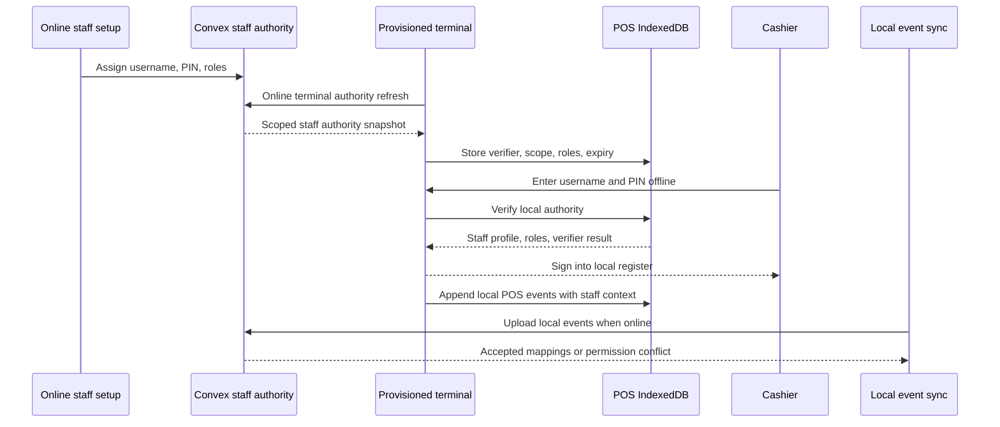
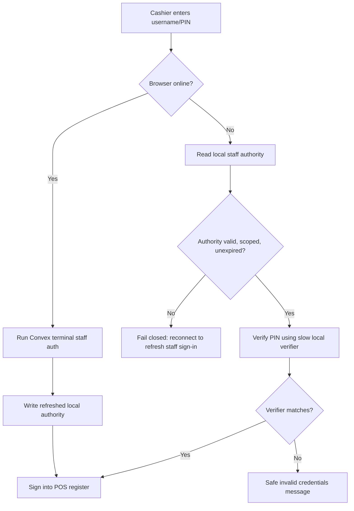

# feat: Add POS local staff authority

## Summary

Add a POS-only local staff authority layer so registered staff can sign into an already-provisioned terminal without a live Convex connection. Online staff registration and terminal sync will produce terminal-scoped verifier material in IndexedDB; offline cashier sign-in will verify username and PIN locally, then sync will later validate permission drift without deleting completed local register work.

---

## Problem Frame

POS now has local boot/readiness work, but staff authentication still depends on `api.operations.staffCredentials.authenticateStaffCredentialForTerminal`. When the browser has no connection, the register can render but a valid staff PIN cannot be verified, leaving POS short of the origin requirement that a provisioned terminal can authenticate staff locally (see origin: `docs/brainstorms/2026-05-13-pos-local-first-register-requirements.md`).

---

## Requirements

- R1. A provisioned POS terminal must be able to authenticate registered, active POS staff locally while offline.
- R2. Local staff authentication must be scoped to the terminal, store, organization, credential, staff profile, active POS roles, credential version, and expiry known at the last successful online authority sync.
- R3. Local staff authentication must not store plaintext PINs, reusable server credentials, or unscoped bearer tokens as login proof.
- R4. Staff credential assignment/reset must create distributable offline verifier metadata because Convex cannot derive a slow verifier later from the existing stored `pinHash`.
- R5. Successful online staff authentication and terminal authority refresh must write or replace the local authority snapshot needed for later offline sign-in.
- R6. Expired, missing, revoked, suspended, inactive, store-mismatched, terminal-mismatched, and role-mismatched local authority states must fail closed with operator-safe copy.
- R7. Offline cashier sign-in must establish POS operator identity and roles for local register events without granting global Athena access, manager elevation, or command approval proof.
- R8. Sync projection must revalidate local staff authority and route permission drift to reconciliation without silently rewriting already-recorded local register history.
- R9. The implementation must remain POS-only and must not expand offline authentication to non-POS workspaces.

**Origin actors:** A1 Cashier, A2 Store manager, A3 Athena POS terminal, A4 Athena cloud
**Origin flows:** F1 Provision a POS terminal for offline use, F2 Operate the register while offline, F5 Sync and reconcile local POS history
**Origin acceptance examples:** AE1, AE2, AE3, AE7

---

## Scope Boundaries

- Offline first-time staff creation, credential assignment, and PIN reset remain out of scope. Those operations require online Athena staff management.
- Non-POS offline login for analytics, procurement, staff management, admin, or cash-control review remains out of scope.
- Local cashier sign-in is not manager elevation and is not command approval. Protected commands must continue to enforce their own proof or policy boundary.
- Offline local authority is not permanent trust. It is a bounded cache that expires and is revalidated during sync.
- Payment-provider-specific offline authorization remains out of scope; this plan only establishes staff identity/role authority for POS register operation.
- Full PWA/service-worker shell hardening remains out of scope except where tests need to prove the existing POS page can consume local authority after reload.

### Deferred to Follow-Up Work

- A richer manager reconciliation workbench for permission-drift conflicts beyond the existing local sync conflict surface.
- Hardware-backed keychain/TPM storage if Athena later needs stronger protection than browser IndexedDB can provide.
- Offline command approval proofs for manager-only actions. This plan preserves the current command-boundary approval model and does not make local cashier auth a proof.

---

## Context & Research

### Relevant Code and Patterns

- `packages/athena-webapp/src/components/pos/CashierAuthDialog.tsx` is the cashier sign-in entry point and currently calls the Convex terminal authentication mutation.
- `packages/athena-webapp/src/components/staff-auth/StaffAuthenticationDialog.tsx` owns username/PIN collection, hashing, loading state, and toast presentation.
- `packages/athena-webapp/convex/operations/staffCredentials.ts` authenticates credentials by store username, PIN hash, staff status, active roles, terminal status, and active-session constraints, then mints `posLocalStaffProof`.
- `packages/athena-webapp/convex/schemas/operations/staffCredential.ts`, `staffProfile.ts`, and `staffRoleAssignment.ts` are the source-of-truth staff authority records that local snapshots must derive from.
- `packages/athena-webapp/convex/schemas/pos/posLocalStaffProof.ts` stores server-side sync proof state. It is event authority, not sufficient as local login proof.
- `packages/athena-webapp/src/lib/pos/infrastructure/local/posLocalStore.ts` is the existing IndexedDB-backed POS local store for terminal seed, events, mappings, and readiness-style local records.
- `packages/athena-webapp/convex/pos/application/sync/staffProof.ts` and `projectLocalEvents.ts` already validate production local staff proofs during sync projection.
- `packages/athena-webapp/src/lib/security/pinHash.ts` uses deterministic SHA-256 with a fixed salt. That may remain for current online compatibility but should not become the long-term offline verifier format.

### Institutional Learnings

- `docs/solutions/architecture/athena-pos-local-first-sync-2026-05-13.md` says POS local-first should use a durable local event log, strict ordering, idempotent projection, and reconciliation rather than mutation replay.
- `docs/solutions/logic-errors/athena-terminal-manager-elevation-command-boundary-2026-05-10.md` says terminal manager elevation is surface access, not command approval, and must not blur command-proof boundaries.
- `docs/solutions/logic-errors/athena-command-approval-policy-boundary-2026-05-01.md` says protected actions must enforce approval at the command boundary, not by trusting browser-supplied staff state.
- `docs/product-copy-tone.md` requires restrained, operational copy and normalized backend wording before errors reach the operator.

### External References

- OWASP Password Storage Cheat Sheet recommends modern password hashing with salts and work factors, and explicitly discourages fast hashes for password storage.
- NIST SP 800-63B treats PINs as memorized secrets and recommends salted, suitable password hashing schemes for verifier storage.

---

## Key Technical Decisions

- Separate local login authority from `posLocalStaffProof`: `posLocalStaffProof` remains a scoped event/sync proof. Local sign-in needs verifier material that can answer whether the entered username and PIN match an active registered staff credential.
- Store only scoped verifier material: the local snapshot stores username, staff identity, roles, store/terminal scope, expiry, credential version, and a slow salted verifier, never plaintext PINs.
- Prefer a new local authority module over embedding IndexedDB reads inside `CashierAuthDialog`: auth-sensitive matching, expiry, role filtering, and diagnostics belong in a testable local infrastructure module.
- Refresh local authority online at two points: after successful terminal staff authentication and during terminal authority sync/provisioning refresh. This supports both first-time staff setup and later credential/role changes.
- Fail closed offline when authority is stale: expired or missing local authority prompts reconnect instead of falling back to Convex or trusting previous UI state.
- Keep local cashier auth POS-scoped: it sets the current POS staff profile/roles for local register events, but it does not authenticate the Athena account globally and does not satisfy manager approval proofs.
- Reconcile permission drift server-side: sync accepts the existence of locally completed customer interactions but records a permission conflict when cloud staff state says the local action should no longer have been authorized.

---

## Open Questions

### Resolved During Planning

- Should `posLocalStaffProof` be reused as login proof? No. It is a bearer token suitable for event/sync validation, not proof that the current person knows a PIN.
- Should local staff auth apply outside POS? No. The origin scope is POS-only offline operation.
- Should local cashier auth satisfy command approval? No. Command approval remains action-bound and server-validated.
- Should the offline verifier use the current fast SHA-256 `pinHash` directly? No for the long-term local verifier. A slow salted verifier is required for the new local authority cache.

### Deferred to Implementation

- Exact verifier algorithm parameters: choose concrete Web Crypto-compatible PBKDF2 parameters during implementation, balancing low-end POS device performance with offline attack resistance.
- Exact local authority TTL: derive from operational expectations and existing `POS_LOCAL_STAFF_PROOF_TTL_MS`, then encode explicitly in tests.
- Whether to add a Convex staff-authority query or include local authority in the existing terminal/provisioning response: decide while integrating with current terminal provisioning and staff-management mutation surfaces.
- Final shape of permission-drift conflict payloads: align with the existing `posLocalSyncConflict` schema and projection code during implementation.

---

## Output Structure

    packages/athena-webapp/src/lib/pos/infrastructure/local/
      localStaffAuthority.ts
      localStaffAuthority.test.ts
      posLocalStore.ts
      posLocalStore.test.ts

The new file names are a planning target. The implementer may split small shared crypto helpers if tests show that doing so keeps the boundary clearer.

---

## High-Level Technical Design

> *This illustrates the intended approach and is directional guidance for review, not implementation specification. The implementing agent should treat it as context, not code to reproduce.*

---

## Implementation Units

- U1. **Model local staff authority in the POS local store**

**Goal:** Add durable IndexedDB storage for terminal-scoped staff authority records without mixing them into the POS event ledger.

**Requirements:** R1, R2, R3, R4, R5, R6, R9

**Dependencies:** None

**Files:**
- Modify: `packages/athena-webapp/src/lib/pos/infrastructure/local/posLocalStore.ts`
- Modify: `packages/athena-webapp/src/lib/pos/infrastructure/local/posLocalStore.test.ts`
- Create: `packages/athena-webapp/src/lib/pos/infrastructure/local/localStaffAuthority.ts`
- Create: `packages/athena-webapp/src/lib/pos/infrastructure/local/localStaffAuthority.test.ts`

**Approach:**
- Add a new local object store or equivalent store abstraction for POS staff authority records keyed by store, terminal, and normalized username.
- Store staff profile identity, display name, credential identity, credential version/update timestamp, active role list, verifier metadata, issued time, expiry, and status.
- Keep authority records separate from local event records so pruning/refreshing authority cannot mutate already-recorded POS history.
- Provide local helpers for write, bulk replace for a terminal, read-by-username, prune expired records, and validate scope.

**Execution note:** Implement test-first because this is auth-sensitive persistence.

**Patterns to follow:**
- `packages/athena-webapp/src/lib/pos/infrastructure/local/posLocalStore.ts`
- `packages/athena-webapp/src/lib/pos/infrastructure/local/posLocalStore.test.ts`

**Test scenarios:**
- Happy path: writing authority records for two staff members on the same terminal can read each by normalized username.
- Happy path: replacing a terminal authority snapshot removes staff records no longer present in the refreshed snapshot while preserving unrelated terminal/store records.
- Edge case: a record scoped to another store or terminal is not returned for the current POS terminal.
- Edge case: expired records are pruned and no longer authenticate.
- Error path: unsupported local store schema version returns an explicit local-store failure rather than throwing into the UI.
- Integration: authority writes do not modify existing local POS events, mappings, readiness, or terminal seed records.

**Verification:**
- The local store can persist, refresh, scope-check, and expire staff authority records without affecting the event ledger.

---

- U2. **Introduce a slow local PIN verifier**

**Goal:** Create verifier generation and verification utilities suitable for local offline staff sign-in, without relying on plaintext PINs or the current fast SHA-256 online compatibility hash as the local cache format.

**Requirements:** R1, R2, R3, R4, R6

**Dependencies:** U1

**Files:**
- Modify: `packages/athena-webapp/src/lib/pos/infrastructure/local/localStaffAuthority.ts`
- Modify: `packages/athena-webapp/src/lib/pos/infrastructure/local/localStaffAuthority.test.ts`
- Modify if needed: `packages/athena-webapp/src/lib/security/pinHash.ts`
- Test if modified: `packages/athena-webapp/src/lib/security/pinHash.test.ts`

**Approach:**
- Add Web Crypto-compatible verifier generation for local authority records using a per-record random salt, explicit algorithm name, iteration/work factor metadata, and encoded verifier hash.
- Keep the current `hashPin` behavior available for existing online mutation compatibility unless the implementation deliberately migrates both online and local paths together.
- Verify entered PINs by recomputing the local verifier and comparing against the stored value.
- Return structured outcomes for match, mismatch, unsupported algorithm, expired authority, and invalid scope.

**Execution note:** Treat verifier comparison and failure classification as security-sensitive; tests should assert that no raw PIN is persisted.

**Patterns to follow:**
- `packages/athena-webapp/src/lib/security/pinHash.ts`
- `packages/athena-webapp/convex/pos/application/sync/staffProof.ts`

**Test scenarios:**
- Happy path: a verifier generated from a PIN validates the same PIN and rejects a different PIN.
- Happy path: generated records use unique salts for the same PIN.
- Edge case: unsupported verifier algorithm returns a reconnect/refresh-required result.
- Edge case: malformed verifier metadata fails closed without attempting online fallback while offline.
- Error path: unavailable `crypto.subtle` returns a safe local-auth-unavailable result.
- Security assertion: serialized local authority contains no plaintext PIN and no current online `pinHash` field unless implementation explicitly documents a migration bridge.

**Verification:**
- Local verifier utilities can authenticate entered PINs offline while preserving a clear migration boundary from existing online PIN hashing.

---

- U3. **Export online staff authority snapshots from Convex**

**Goal:** Make Convex produce scoped local authority records when staff credentials are assigned, refreshed, or authenticated from a provisioned terminal.

**Requirements:** R1, R2, R3, R4, R5, R6, R8

**Dependencies:** U1, U2

**Files:**
- Modify: `packages/athena-webapp/convex/operations/staffCredentials.ts`
- Modify: `packages/athena-webapp/convex/operations/staffCredentials.test.ts`
- Modify: `packages/athena-webapp/convex/schemas/operations/staffCredential.ts`
- Modify: `packages/athena-webapp/src/components/staff/StaffManagement.tsx`
- Modify: `packages/athena-webapp/src/components/staff/StaffManagement.test.tsx`
- Modify if needed: `packages/athena-webapp/convex/operations/staffProfiles.ts`
- Modify if needed: `packages/athena-webapp/convex/operations/staffProfiles.test.ts`
- Modify if needed: `packages/athena-webapp/convex/pos/public/terminals.ts`
- Test if modified: `packages/athena-webapp/convex/pos/public/terminals.test.ts`

**Approach:**
- Add a server-owned projection that returns only POS-authorized, active staff authority for a terminal's store.
- Include credential status, staff profile status, active roles, display name, credential id/version, issued/expiry metadata, and verifier material suitable for local storage.
- Extend credential assignment/reset so the client can generate and submit offline verifier metadata at the same time it submits the online-compatible PIN hash.
- Treat legacy active credentials without offline verifier metadata as online-only until the staff member's PIN is reset or the staff member successfully authenticates online on the terminal and refreshes their own local authority.
- Exclude suspended/revoked credentials, inactive staff profiles, credentials without PINs, and staff with no POS cashier/manager authority.
- Reuse existing staff-role derivation and terminal ownership checks rather than creating a parallel authorization rule.
- Ensure successful `authenticateStaffCredentialForTerminal` can return or trigger a refreshed local authority record for the authenticated staff member.

**Execution note:** Start with Convex tests that characterize current staff credential status and role filtering before adding the local authority projection.

**Patterns to follow:**
- `packages/athena-webapp/convex/operations/staffCredentials.ts`
- `packages/athena-webapp/convex/operations/staffProfiles.ts`
- `packages/athena-webapp/convex/operations/staffRoles.ts`

**Test scenarios:**
- Happy path: an active cashier credential for the terminal's store appears in the authority snapshot with cashier role and verifier metadata.
- Happy path: creating or resetting a staff PIN stores offline verifier metadata alongside the existing credential record.
- Happy path: an active manager credential appears with manager role and can later support manager-scoped POS checks.
- Edge case: pending, suspended, revoked, or no-PIN credentials are omitted.
- Edge case: active legacy credential without offline verifier metadata is omitted from bulk terminal authority refresh and marked refresh-required.
- Edge case: inactive staff profiles and staff from another store are omitted.
- Edge case: terminal from another store cannot request this store's authority snapshot.
- Error path: duplicate active credentials for one username remain a server error and are not serialized locally.
- Integration: online terminal staff authentication returns enough data for the client to refresh that staff member's local authority.

**Verification:**
- Convex exposes only scoped, active, POS-authorized staff authority needed by a provisioned terminal.

---

- U4. **Refresh terminal-local staff authority in the client**

**Goal:** Write local staff authority records to IndexedDB after successful online authentication and during terminal readiness/provisioning refresh.

**Requirements:** R1, R2, R5, R6, R9

**Dependencies:** U1, U2, U3

**Files:**
- Modify: `packages/athena-webapp/src/components/pos/CashierAuthDialog.tsx`
- Modify: `packages/athena-webapp/src/components/pos/CashierAuthDialog.test.tsx`
- Modify if needed: `packages/athena-webapp/src/lib/pos/application/registerAndProvisionPosTerminal.ts`
- Modify if needed: `packages/athena-webapp/src/components/pos/settings/POSSettingsView.tsx`
- Test if modified: `packages/athena-webapp/src/components/pos/settings/POSSettingsView.test.tsx`
- Modify if needed: `packages/athena-webapp/src/lib/pos/infrastructure/local/localPosEntryContext.ts`
- Test if modified: `packages/athena-webapp/src/lib/pos/infrastructure/local/localPosEntryContext.test.ts`

**Approach:**
- On successful online cashier authentication, persist refreshed local authority for that staff member and terminal before treating the local cache as ready for later offline use.
- During terminal provisioning or readiness refresh, replace the terminal staff authority snapshot from the server-provided list.
- When online cashier authentication has the raw entered PIN available but server-side verifier metadata is absent for that credential, generate a terminal-local authority record for the authenticated staff member and mark bulk offline authority incomplete until the credential is reset or upgraded.
- Surface local authority refresh failures as diagnostics/debug state without blocking a currently successful online authentication unless the write failure means offline readiness cannot be claimed.
- Keep debug output focused on readiness states such as `authority: ready | missing | expired | refresh_failed`, not raw verifier data.

**Patterns to follow:**
- `packages/athena-webapp/src/components/pos/CashierAuthDialog.tsx`
- `packages/athena-webapp/src/lib/pos/infrastructure/local/localPosEntryContext.ts`
- `packages/athena-webapp/src/components/pos/settings/POSSettingsView.tsx`

**Test scenarios:**
- Happy path: successful online cashier auth writes a local authority record for the authenticated staff member.
- Happy path: terminal provisioning refresh replaces local staff authority for the terminal.
- Edge case: authority refresh for one terminal does not overwrite records for another terminal.
- Error path: IndexedDB write failure logs/surfaces offline-readiness failure without leaking verifier data.
- Error path: successful online auth still signs in the cashier even if optional authority cache refresh fails, but POS does not report offline staff readiness.
- Integration: after refresh and simulated reload, local store contains the authority needed for offline sign-in.

**Verification:**
- A terminal that has been online can persist the exact staff authority needed for later offline POS authentication.

---

- U5. **Authenticate cashier sign-in from local authority while offline**

**Goal:** Update the POS cashier sign-in flow so offline browsers verify staff credentials locally instead of waiting on Convex or only failing fast.

**Requirements:** R1, R2, R3, R6, R7, R9

**Dependencies:** U1, U2, U4

**Files:**
- Modify: `packages/athena-webapp/src/components/pos/CashierAuthDialog.tsx`
- Modify: `packages/athena-webapp/src/components/pos/CashierAuthDialog.test.tsx`
- Modify: `packages/athena-webapp/src/lib/pos/presentation/register/useRegisterViewModel.ts`
- Modify: `packages/athena-webapp/src/lib/pos/presentation/register/useRegisterViewModel.test.ts`
- Modify if needed: `packages/athena-webapp/src/lib/pos/presentation/register/registerUiState.ts`

**Approach:**
- Branch cashier authentication by capability, not optimism: online path uses Convex and refreshes authority; offline path uses local authority only when terminal seed, store scope, terminal scope, unexpired authority, and verifier support are present.
- Return the same `StaffAuthenticationResult` shape expected by the register view model, with local-source metadata where useful for sync/debug.
- Use local active roles to set cashier/manager POS capabilities, while leaving manager elevation and command approval untouched.
- Replace the current offline fail-fast guard with local verification. Keep fail-fast behavior only for missing/expired/unsupported authority states.

**Execution note:** Add regression coverage for the current spinner/offline fail-fast behavior before changing it to successful local verification.

**Patterns to follow:**
- `packages/athena-webapp/src/components/staff-auth/StaffAuthenticationDialog.tsx`
- `packages/athena-webapp/src/components/pos/CashierAuthDialog.test.tsx`
- `packages/athena-webapp/src/lib/pos/presentation/register/useRegisterViewModel.test.ts`

**Test scenarios:**
- Covers AE1. Happy path: with `navigator.onLine === false` and valid local authority, entering username and PIN signs the cashier into POS without calling Convex.
- Happy path: local manager authority signs in with manager role for POS register capabilities.
- Edge case: missing local authority prompts reconnect/refresh copy and clears the PIN.
- Edge case: expired local authority prompts reconnect/refresh copy and clears the PIN.
- Edge case: wrong PIN produces the normalized invalid-credentials copy and does not call Convex.
- Edge case: local authority for another terminal or store is rejected.
- Error path: unsupported verifier metadata returns a reconnect/refresh-required result.
- Integration: after local offline sign-in, adding a cart item appends a local event with the staffProfileId and local staff authority context expected by sync.

**Verification:**
- Offline cashier sign-in succeeds only with valid scoped local authority and never waits on a live Convex mutation.

---

- U6. **Revalidate local staff authority during sync projection**

**Goal:** Ensure cloud sync validates locally authenticated staff events against current or historically acceptable staff authority and records permission drift as reconciliation work.

**Requirements:** R2, R6, R7, R8

**Dependencies:** U3, U5

**Files:**
- Modify: `packages/athena-webapp/convex/pos/application/sync/ingestLocalEvents.ts`
- Modify: `packages/athena-webapp/convex/pos/application/sync/projectLocalEvents.ts`
- Modify: `packages/athena-webapp/convex/pos/application/sync/ingestLocalEvents.test.ts`
- Modify: `packages/athena-webapp/convex/pos/application/sync/projectLocalEvents.test.ts`
- Modify if needed: `packages/athena-webapp/convex/pos/infrastructure/repositories/localSyncRepository.ts`

**Approach:**
- Extend the sync payload or existing staff-proof evidence so Convex can tell whether an event came from locally verified staff authority and which credential/version/authority expiry was used.
- Validate event staffProfileId, storeId, terminalId, credential status, staff status, and required role against server state.
- Preserve completed local events but create a permission-drift conflict when the cloud rejects the authority context.
- Keep projection idempotent so retrying the same permission-drift event does not duplicate conflicts or side effects.

**Execution note:** Use integration-style Convex tests because this unit crosses client evidence, sync ingestion, projection, conflicts, and existing POS records.

**Patterns to follow:**
- `packages/athena-webapp/convex/pos/application/sync/ingestLocalEvents.test.ts`
- `packages/athena-webapp/convex/pos/application/sync/projectLocalEvents.test.ts`
- `packages/athena-webapp/convex/pos/application/sync/staffProof.ts`

**Test scenarios:**
- Covers AE7. Happy path: a locally authenticated cashier sale syncs once and projects with staff attribution.
- Happy path: retrying the same accepted local staff event is idempotent.
- Edge case: staff was revoked after offline sale; sync preserves the sale and creates one permission conflict.
- Edge case: cashier role was removed before sync; manager reconciliation is created without deleting local receipt/transaction context.
- Error path: event missing required staff authority evidence becomes needs-review rather than projecting as trusted staff action.
- Integration: permission conflict appears in the existing local sync conflict/query surface consumed by POS sync status.

**Verification:**
- Cloud projection can distinguish valid local staff authority from permission drift and preserves local register history either way.

---

- U7. **Expose operator-safe readiness and diagnostics**

**Goal:** Make local staff authority state visible enough for operators and developers to understand why offline sign-in is available or blocked, without leaking credential material.

**Requirements:** R6, R7, R9

**Dependencies:** U4, U5, U6

**Files:**
- Modify: `packages/athena-webapp/src/lib/pos/presentation/register/registerUiState.ts`
- Modify: `packages/athena-webapp/src/lib/pos/presentation/register/useRegisterViewModel.ts`
- Modify: `packages/athena-webapp/src/lib/pos/presentation/register/useRegisterViewModel.test.ts`
- Modify: `packages/athena-webapp/src/components/pos/register/POSRegisterView.tsx`
- Modify: `packages/athena-webapp/src/components/pos/register/POSRegisterView.test.tsx`
- Modify if needed: `docs/product-copy-tone.md`

**Approach:**
- Add POS-local debug/readiness state for staff authority: ready, missing, expired, refresh failed, unsupported verifier, scope mismatch.
- Show operator copy only when action is blocked. Keep debug details in the existing local debug strip or development diagnostics, not as noisy primary UI.
- Normalize backend/local authority failure messages through existing operator-message patterns.
- Ensure no verifier, token, PIN hash, salt, or raw credential identifier is rendered in UI or logs beyond safe ids already used for diagnostics.

**Patterns to follow:**
- `packages/athena-webapp/src/components/pos/register/POSRegisterView.tsx`
- `packages/athena-webapp/src/lib/errors/operatorMessages.ts`
- `docs/product-copy-tone.md`

**Test scenarios:**
- Happy path: local staff authority ready state is reflected in view-model debug output while the cashier auth dialog is open.
- Edge case: expired authority renders reconnect/refresh copy rather than raw expiry or backend terms.
- Edge case: missing authority does not render as generic app failure; it tells the operator local sign-in needs refresh.
- Error path: refresh failure logs safe context and does not include verifier fields.
- Integration: permission-drift conflict from sync changes sync status to needs-review without signing the cashier out mid-sale.

**Verification:**
- Operators receive clear sign-in readiness feedback and developers get enough safe diagnostics to debug local authority issues.

---

## System-Wide Impact

- **Interaction graph:** Staff management and terminal provisioning feed local staff authority; cashier auth consumes it; register view-model uses resulting staff identity; local command gateway records staff context; sync projection revalidates authority.
- **Error propagation:** Local authority failures should return normalized command-style user errors so `StaffAuthenticationDialog` can clear PIN/loading state and show safe copy.
- **State lifecycle risks:** Authority refresh must not mutate local event history, and authority expiry must not invalidate already-recorded local events. Sync handles drift after the fact.
- **API surface parity:** Online cashier auth, terminal provisioning/refresh, local auth, and sync payloads need matching authority fields and version semantics.
- **Integration coverage:** Unit tests alone are not enough. Convex sync tests must prove permission drift handling, and React tests must prove offline sign-in does not call Convex or hang.
- **Unchanged invariants:** POS remains the only offline-first workspace. Command approval proofs remain server-minted, action-bound, and one-use. Manager elevation remains separate from cashier sign-in.

---

## Risks & Dependencies

| Risk | Mitigation |
|------|------------|
| IndexedDB compromise exposes offline verifier material. | Store only scoped, expiring, salted slow verifiers; no raw PINs, no global account tokens, no unscoped authority. |
| Staff credential revocation happens while the terminal is offline. | Fail expired authority locally and create permission-drift reconciliation during sync for actions recorded before refresh. |
| Local cashier auth is mistaken for manager approval. | Preserve command-bound approval proofs and test that local cashier/manager roles do not satisfy approval proof consumption. |
| Low-end terminals struggle with verifier work factor. | Choose Web Crypto parameters during implementation and test enough performance envelope to avoid blocking POS entry. |
| Online and local PIN verifier formats drift. | Keep current online compatibility path explicit and isolate the local verifier in `localStaffAuthority.ts` with migration metadata. |
| Authority refresh becomes too broad and includes non-POS staff. | Server projection filters to active POS-authorized roles and terminal store scope. |

---

## Documentation / Operational Notes

- Update POS terminal provisioning/readiness documentation to explain that offline staff sign-in requires a recent authority sync.
- Add a durable `docs/solutions/` note after implementation describing the distinction between local login authority, `posLocalStaffProof`, manager elevation, and command approval proofs.
- Add validation-map coverage for new local authority modules and sync permission-drift tests if the repo validation map requires explicit entries.
- Existing debug copy added during offline POS investigation should be revisited so staff authority readiness appears as a clear POS-local diagnostic.

---

## Alternative Approaches Considered

- Reuse `posLocalStaffProof` for offline login: rejected because it is a bearer token and does not prove the current person knows the assigned PIN.
- Store the existing `pinHash` locally as the verifier: rejected as the long-term design because it is a fast deterministic hash with fixed salt and is weak if local storage is copied.
- Always require reconnect for staff sign-in: rejected because it fails the origin requirement for locally authenticated POS operation after provisioning.
- Make local manager sign-in satisfy command approvals: rejected because it violates the command-boundary approval model and would widen the blast radius of local browser authority.

---

## Success Metrics

- A provisioned terminal with a fresh staff authority snapshot can reload offline and sign in a cashier without calling Convex.
- Invalid PIN, missing authority, expired authority, and scope mismatch all fail quickly with safe operator copy and no spinner hang.
- Local POS events created after offline staff sign-in include enough staff context for sync projection and reconciliation.
- Sync preserves completed local register history while surfacing permission drift as manager-review work.

---

## Sources & References

- **Origin document:** [docs/brainstorms/2026-05-13-pos-local-first-register-requirements.md](../brainstorms/2026-05-13-pos-local-first-register-requirements.md)
- Related plan: [docs/plans/2026-05-14-001-feat-pos-always-local-first-flow-plan.md](2026-05-14-001-feat-pos-always-local-first-flow-plan.md)
- Related plan: [docs/plans/2026-05-14-002-feat-pos-offline-entry-readiness-plan.md](2026-05-14-002-feat-pos-offline-entry-readiness-plan.md)
- Related solution: [docs/solutions/architecture/athena-pos-local-first-sync-2026-05-13.md](../solutions/architecture/athena-pos-local-first-sync-2026-05-13.md)
- Related solution: [docs/solutions/logic-errors/athena-terminal-manager-elevation-command-boundary-2026-05-10.md](../solutions/logic-errors/athena-terminal-manager-elevation-command-boundary-2026-05-10.md)
- Related solution: [docs/solutions/logic-errors/athena-command-approval-policy-boundary-2026-05-01.md](../solutions/logic-errors/athena-command-approval-policy-boundary-2026-05-01.md)
- Related code: `packages/athena-webapp/src/components/pos/CashierAuthDialog.tsx`
- Related code: `packages/athena-webapp/convex/operations/staffCredentials.ts`
- Related code: `packages/athena-webapp/src/lib/pos/infrastructure/local/posLocalStore.ts`
- External reference: [OWASP Password Storage Cheat Sheet](https://cheatsheetseries.owasp.org/cheatsheets/Password_Storage_Cheat_Sheet.html)
- External reference: [NIST SP 800-63B](https://pages.nist.gov/800-63-4/sp800-63b.html)
