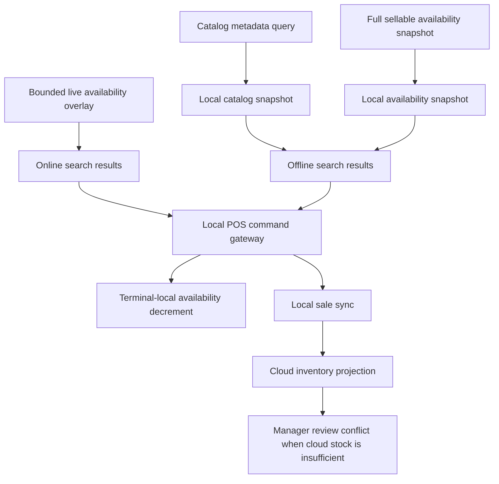
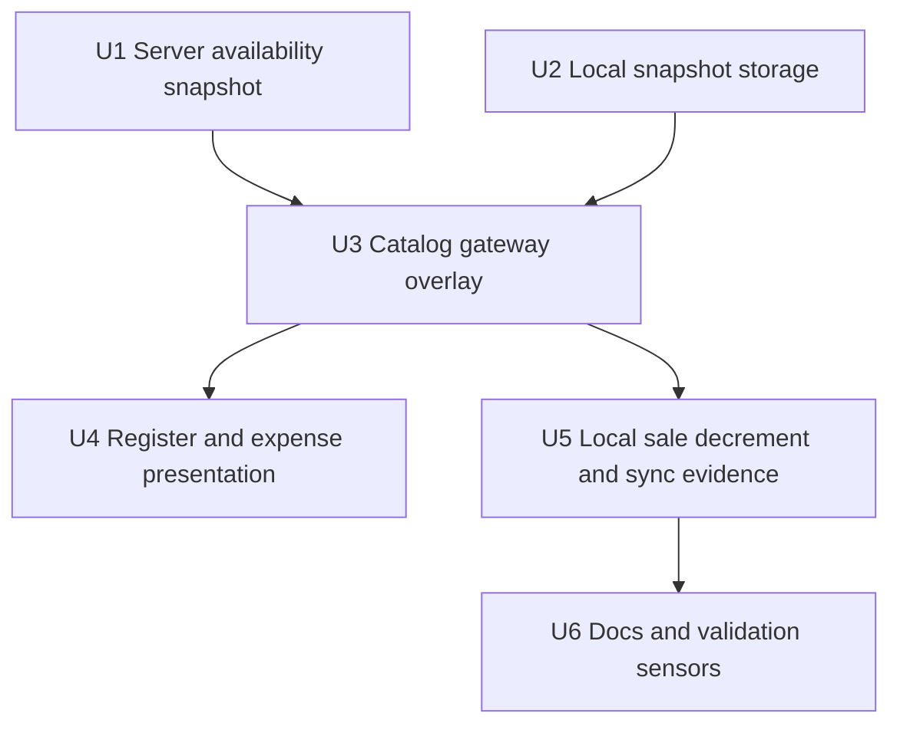

# feat: Add POS offline inventory snapshot

## Summary

Add a first-class POS inventory availability snapshot beside the existing local catalog metadata snapshot. Online POS keeps the bounded live availability overlay for hot-path accuracy, while offline POS joins local catalog rows with the last refreshed hold-aware availability snapshot and records local sale evidence for later inventory reconciliation.

---

## Problem Frame

POS catalog lookup now has a durable local metadata snapshot, but availability still depends on a bounded live Convex query for the currently displayed SKUs. That leaves offline search with product rows whose availability is unknown or stale by accident, which pushes the UI toward fabricated stock. The foundational fix is to make inventory readiness explicit: provisioned POS terminals should cache a store-scoped snapshot of sellable SKU availability, use it when offline, locally decrement it during terminal-local selling, and let sync preserve completed sales while routing oversell conflicts to manager review.

---

## Requirements

- R1. POS must persist a store-scoped availability snapshot for every sellable SKU included in the register catalog snapshot.
- R2. The availability snapshot must represent hold-aware sellable availability, not raw `productSku.quantityAvailable`.
- R3. Online register search must continue using bounded live availability for displayed or exact-match SKUs so cart edits do not invalidate a full-catalog subscription.
- R4. Offline register search must overlay local catalog metadata with the local availability snapshot instead of fabricating availability.
- R5. If the local availability snapshot is missing for the requested store, POS must expose an offline readiness gap rather than silently marking products available.
- R6. Local POS cart and checkout activity must decrement terminal-local availability so one terminal cannot repeatedly sell the same last-known unit during a disconnected session.
- R7. Completed local sales must remain preserved during sync, with inventory conflicts routed to manager review when cloud stock cannot satisfy the sale.
- R8. The work must keep POS as the only offline-first Athena workflow in this release.

**Origin actors:** A1 Cashier, A2 Store manager, A3 Athena POS terminal, A4 Athena cloud
**Origin flows:** F1 Provision a POS terminal for offline use, F2 Operate the register while offline, F3 Complete checkout with any payment method offline, F5 Sync and reconcile local POS history
**Origin acceptance examples:** AE1, AE3, AE7, AE8

---

## Scope Boundaries

- Do not move volatile availability fields back into the full register catalog metadata rows.
- Do not create real-time stock coordination across disconnected terminals.
- Do not expand offline-first behavior to inventory management, procurement, analytics, staff management, admin, or cash-controls review.
- Do not add payment-provider offline authorization behavior.
- Do not automatically resolve oversells; reconciliation remains manager review work.
- Do not reintroduce fake offline availability such as defaulting missing rows to `quantityAvailable: 1`.
- Do not make expense sessions offline-first; expense is touched only where it already shares product-entry search and availability presentation helpers.

### Deferred to Follow-Up Work

- Richer manager-facing inventory reconciliation workbench beyond the existing conflict records.
- Cold app-shell/PWA asset caching if field validation shows terminals need to reload the entire web app without cached assets.
- Offline inventory adjustment or procurement workflows.

---

## Context & Research

### Relevant Code and Patterns

- `packages/athena-webapp/convex/pos/application/queries/listRegisterCatalog.ts` already splits stable catalog metadata from bounded availability and computes availability through `validateInventoryAvailability`.
- `packages/athena-webapp/convex/pos/public/catalog.ts` exposes `listRegisterCatalogSnapshot` and `listRegisterCatalogAvailability`; the latter is intentionally bounded by `REGISTER_CATALOG_AVAILABILITY_LIMIT`.
- `packages/athena-webapp/src/lib/pos/infrastructure/convex/catalogGateway.ts` now reads/writes the local catalog metadata snapshot while keeping availability live-only.
- `packages/athena-webapp/src/lib/pos/infrastructure/local/posLocalStore.ts` has the IndexedDB object store and schema-version path needed for POS local snapshots.
- `packages/athena-webapp/src/lib/pos/presentation/register/useRegisterViewModel.ts` and `packages/athena-webapp/src/lib/pos/presentation/expense/useExpenseRegisterViewModel.ts` both build local catalog search results and overlay availability through `useConvexRegisterCatalogAvailability`.
- `packages/athena-webapp/src/lib/pos/infrastructure/local/localCommandGateway.ts` and `registerReadModel.ts` are the local-first command/read-model seams where terminal-local availability should be decremented.
- `packages/athena-webapp/convex/pos/application/sync/projectLocalEvents.ts` already preserves offline sales and creates inventory conflicts when cloud availability cannot cover the synced sale.

### Institutional Learnings

- `docs/solutions/performance/athena-pos-cart-latency-foundation-2026-05-05.md` warns not to put cart-mutated availability back into the full-store catalog snapshot; volatile availability belongs behind bounded reads or local POS state.
- `docs/solutions/architecture/athena-pos-local-first-sync-2026-05-13.md` says local selling uses last-known SKU availability and sync preserves completed sales while routing stock conflicts to manager review.
- `docs/solutions/performance/athena-expense-register-local-index-parity-2026-05-08.md` says expense product entry shares POS local catalog search and bounded availability overlay, so shared gateway changes must preserve parity.

### External References

- No external research is needed. This plan extends existing Athena POS local-first, IndexedDB, Convex query, and reconciliation patterns.

---

## Key Technical Decisions

| Decision | Rationale |
| --- | --- |
| Keep metadata and availability as separate snapshots | Preserves the hot-path split that prevents cart edits from invalidating full-catalog search metadata. |
| Snapshot hold-aware sellable availability | Operators need the same availability concept the POS command boundary uses, not raw durable stock. |
| Add a full-store availability refresh path separate from bounded live overlay | Online search remains fast and precise, while offline readiness has complete local coverage. |
| Treat missing local availability as not offline-ready | Avoids fabricating inventory and makes provisioning/sync gaps visible. |
| Decrement a terminal-local availability overlay during local selling | Prevents repeat sale of the same last-known units on one terminal while accepting cross-terminal oversell risk. |
| Keep sync reconciliation as the final truth | Offline sales are customer-facing facts; cloud conflicts become manager review instead of receipt rewrites. |

---

## Open Questions

### Resolved During Planning

- Should availability be folded back into the register catalog metadata rows? No. That would fight the established full-catalog reactivity fix.
- Should offline rows become selectable when no availability snapshot exists? No. Missing snapshot is an offline readiness problem, not proof of stock.
- Should the full-store availability snapshot replace bounded live online availability? No. It supports offline mode; bounded live reads remain the online overlay for visible/exact rows.
- Should cross-terminal offline oversells be prevented locally? No. Disconnected terminals cannot coordinate reliably; sync reconciliation owns that conflict.

### Deferred to Implementation

- Exact freshness threshold for warning or blocking on stale availability: choose while integrating with existing POS readiness copy and available timestamp data.
- Exact local event payload field names for last-known availability evidence: choose while extending existing sync contract types.
- Whether snapshot refresh happens in the existing catalog gateway hook or a small dedicated readiness hook: choose the smallest shape that avoids extra full-catalog reactivity in the active search path.

---

## High-Level Technical Design

> *This illustrates the intended approach and is directional guidance for review, not implementation specification. The implementing agent should treat it as context, not code to reproduce.*

| Mode | Availability source | Product selectability |
| --- | --- | --- |
| Online with live overlay | Bounded live availability for displayed/exact SKUs | Live quantity controls selection |
| Offline with full snapshot | Local snapshot plus terminal-local decrements | Last-known local quantity controls selection |
| Offline missing snapshot | No trusted local availability source | Products remain search-visible but not addable; readiness gap is shown |
| Sync after oversell | Cloud projection validates current stock and holds | Completed sale is preserved; conflict is routed to review |

---

## Implementation Units

- U1. **Add a full-store register availability snapshot query**

**Goal:** Provide a server read model that returns hold-aware sellable availability for every SKU in the register catalog scope without changing the existing bounded availability query.

**Requirements:** R1, R2, R3

**Dependencies:** None

**Files:**
- Modify: `packages/athena-webapp/convex/pos/application/queries/listRegisterCatalog.ts`
- Modify: `packages/athena-webapp/convex/pos/application/queries/listRegisterCatalog.test.ts`
- Modify: `packages/athena-webapp/convex/pos/public/catalog.ts`
- Modify: `packages/athena-webapp/src/lib/pos/application/dto.ts`
- Modify: `packages/athena-webapp/src/lib/pos/application/ports.ts`

**Approach:**
- Add a separate full-store availability snapshot query that iterates the same sellable SKU scope as `listRegisterCatalog`.
- Reuse `validateInventoryAvailability` so each row reflects sellable quantity after active holds.
- Keep `listRegisterCatalogAvailability` bounded and unchanged for online visible/exact overlay behavior.
- Keep the full snapshot as a refresh/readiness operation rather than an active search subscription; if implementation hits Convex query limits for large stores, split refresh into cursor-bounded pages while preserving complete-snapshot semantics locally.
- Include snapshot metadata such as store id and refreshed time in the client DTO if needed for local readiness and stale-state decisions.

**Patterns to follow:**
- `packages/athena-webapp/convex/pos/application/queries/listRegisterCatalog.ts`
- `packages/athena-webapp/convex/pos/application/queries/listRegisterCatalog.test.ts`
- `docs/solutions/performance/athena-pos-cart-latency-foundation-2026-05-05.md`

**Test scenarios:**
- Happy path: full snapshot returns all sellable SKUs for a store with hold-aware `quantityAvailable`.
- Edge case: archived products and zero-price SKUs are excluded the same way catalog metadata excludes them.
- Edge case: active inventory holds reduce the snapshot quantity while raw durable SKU stock remains higher.
- Error path: SKUs from another store are not returned.
- Integration: existing bounded availability query still caps requested IDs and is not replaced by the full snapshot path.

**Verification:**
- Server tests prove the new snapshot has catalog-scope parity while preserving the existing bounded query contract.

---

- U2. **Persist local register availability snapshots**

**Goal:** Extend POS local storage with a complete availability snapshot keyed by store, schema version, and refresh time.

**Requirements:** R1, R4, R5

**Dependencies:** U1

**Files:**
- Modify: `packages/athena-webapp/src/lib/pos/infrastructure/local/posLocalStore.ts`
- Modify: `packages/athena-webapp/src/lib/pos/infrastructure/local/posLocalStore.test.ts`
- Create: `packages/athena-webapp/src/lib/pos/infrastructure/local/registerAvailabilitySnapshot.ts`
- Create: `packages/athena-webapp/src/lib/pos/infrastructure/local/registerAvailabilitySnapshot.test.ts`

**Approach:**
- Store the availability snapshot separately from the catalog metadata snapshot, even if both live in the same IndexedDB object store family.
- Write full snapshots atomically so partial refreshes do not masquerade as complete offline readiness.
- Read by store id and return explicit missing, stale, unsupported-schema, and ready states for gateway/readiness consumers.
- Keep schema migration deliberate by bumping the POS local schema only if the existing object-store layout cannot support the new record safely.

**Patterns to follow:**
- Existing `writeRegisterCatalogSnapshot` and `readRegisterCatalogSnapshot` behavior in `posLocalStore.ts`.
- Existing memory adapter tests in `posLocalStore.test.ts`.

**Test scenarios:**
- Happy path: writing a full availability snapshot and reading it back returns all rows with `refreshedAt`, `storeId`, and schema version intact.
- Happy path: replacing an older snapshot for the same store is atomic and does not merge stale rows from the older snapshot.
- Edge case: reading a missing snapshot returns a ready-to-handle missing state rather than an empty ready snapshot.
- Edge case: a snapshot for store A is not returned for store B.
- Error path: unsupported schema returns an explicit local-store failure.

**Verification:**
- Local store tests prove complete-snapshot semantics and avoid the reverted partial row-cache behavior.

---

- U3. **Add local availability refresh and gateway overlay**

**Goal:** Teach the catalog gateway to refresh the full availability snapshot online and to use it as the offline availability source.

**Requirements:** R3, R4, R5

**Dependencies:** U1, U2

**Files:**
- Modify: `packages/athena-webapp/src/lib/pos/infrastructure/convex/catalogGateway.ts`
- Modify: `packages/athena-webapp/src/lib/pos/infrastructure/convex/catalogGateway.test.tsx`
- Modify: `packages/athena-webapp/src/lib/pos/application/ports.ts`
- Modify if needed: `packages/athena-webapp/src/lib/pos/presentation/register/catalogSearchPresentation.ts`

**Approach:**
- Add a gateway hook or helper that refreshes the full availability snapshot when online/live data is available.
- Keep `useConvexRegisterCatalogAvailability` as the bounded live overlay for visible/exact search rows.
- When live bounded rows are unavailable, read the full local availability snapshot and filter it to requested SKU ids.
- Return an explicit unavailable/readiness state when local availability is missing instead of creating fake selectable rows.
- Keep hook dependencies stable so search result rerenders do not trigger unnecessary refresh loops.

**Patterns to follow:**
- Existing local catalog snapshot read/write in `catalogGateway.ts`.
- Existing `catalogGateway.test.tsx` coverage for local catalog fallback.

**Test scenarios:**
- Happy path: online full snapshot refresh writes local availability without changing bounded live availability results.
- Happy path: offline requested SKU ids are resolved from the full local snapshot.
- Edge case: offline missing snapshot returns no trusted availability and exposes the readiness gap to presentation code.
- Edge case: cached zero availability remains zero and unselectable offline.
- Error path: local store read failure does not fabricate availability; it returns an unavailable state.
- Integration: live bounded rows win over local snapshot rows while online data is available.

**Verification:**
- Gateway tests prove online bounded behavior, offline full-snapshot behavior, and missing-snapshot behavior are distinct.

---

- U4. **Render offline availability readiness in register and expense product entry**

**Goal:** Ensure shared product-entry surfaces show catalog results offline but only allow selection when trusted local availability exists and is positive.

**Requirements:** R4, R5, R8

**Dependencies:** U3

**Files:**
- Modify: `packages/athena-webapp/src/lib/pos/presentation/register/useRegisterViewModel.ts`
- Modify: `packages/athena-webapp/src/lib/pos/presentation/register/useRegisterViewModel.test.ts`
- Modify: `packages/athena-webapp/src/lib/pos/presentation/expense/useExpenseRegisterViewModel.ts`
- Modify: `packages/athena-webapp/src/lib/pos/presentation/expense/useExpenseRegisterViewModel.test.ts`
- Modify if needed: `packages/athena-webapp/src/components/pos/ProductEntry.tsx`
- Modify if needed: `packages/athena-webapp/src/lib/pos/presentation/register/catalogSearchPresentation.ts`

**Approach:**
- Keep local catalog search results visible even when availability is missing.
- For POS register selling, block auto-add and product selection when availability is unknown because the snapshot is missing or unreadable.
- Preserve exact-match behavior: a single exact match only auto-adds when trusted availability is present and positive.
- Keep expense entry parity only for the shared search/presentation behavior that this gateway already affects; do not make expense sessions local-first or add POS drawer/session gates.
- Use restrained operator copy for readiness gaps and avoid raw network/backend wording.

**Patterns to follow:**
- Existing exact-match tests in `useRegisterViewModel.test.ts`.
- Expense parity guidance in `docs/solutions/performance/athena-expense-register-local-index-parity-2026-05-08.md`.
- `docs/product-copy-tone.md`.

**Test scenarios:**
- Covers AE1/AE3. Happy path: offline register search with local catalog and local availability snapshot shows positive-quantity products as selectable.
- Happy path: offline exact barcode/SKU match with positive trusted quantity auto-adds once.
- Edge case: offline result with local zero quantity remains visible but unselectable.
- Edge case: offline catalog result with missing availability snapshot remains visible but does not auto-add or allow sale selection.
- Error path: local availability read failure produces readiness copy instead of a crash or fake stock.
- Integration: expense product entry still mirrors shared search availability presentation without adding POS drawer/session gates.

**Verification:**
- View-model tests prove the UI no longer depends on fabricated offline availability and that expense parity remains intact.

---

- U5. **Apply terminal-local availability decrements and sync evidence**

**Goal:** Make local POS selling consume the terminal's last-known availability during a disconnected session and include enough sale evidence for cloud reconciliation context.

**Requirements:** R6, R7

**Dependencies:** U2, U3

**Files:**
- Modify: `packages/athena-webapp/src/lib/pos/infrastructure/local/localCommandGateway.ts`
- Modify: `packages/athena-webapp/src/lib/pos/infrastructure/local/localCommandGateway.test.ts`
- Modify: `packages/athena-webapp/src/lib/pos/infrastructure/local/registerReadModel.ts`
- Modify: `packages/athena-webapp/src/lib/pos/infrastructure/local/registerReadModel.test.ts`
- Modify: `packages/athena-webapp/src/lib/pos/infrastructure/local/syncContract.ts`
- Modify: `packages/athena-webapp/src/lib/pos/infrastructure/local/syncContract.test.ts`
- Modify: `packages/athena-webapp/convex/pos/application/sync/ingestLocalEvents.ts`
- Modify: `packages/athena-webapp/convex/pos/application/sync/ingestLocalEvents.test.ts`
- Modify: `packages/athena-webapp/convex/pos/application/sync/projectLocalEvents.ts`
- Modify: `packages/athena-webapp/convex/pos/application/sync/projectLocalEvents.test.ts`

**Approach:**
- Before local add/quantity increase, check the terminal-local availability value for the SKU.
- Decrement local availability when local cart quantity reserves or completes a sale, and restore it only for local cart removal/clear before completion.
- Preserve completed-sale history even if later local availability would become negative due to earlier bugs or stale snapshots; sync projection owns cloud conflict creation.
- Include last-known local availability context in the sync payload or conflict details where it helps manager review, without making cloud projection trust the terminal snapshot over cloud state.
- Keep cloud projection tests focused on preserving completed sales and producing inventory conflicts when current cloud availability is insufficient.

**Patterns to follow:**
- `packages/athena-webapp/src/lib/pos/infrastructure/local/localCommandGateway.test.ts`
- `packages/athena-webapp/src/lib/pos/infrastructure/local/syncContract.test.ts`
- `packages/athena-webapp/convex/pos/application/sync/projectLocalEvents.test.ts`

**Test scenarios:**
- Happy path: adding one unit offline decrements terminal-local availability for that SKU.
- Happy path: clearing an uncompleted local cart restores the terminal-local availability.
- Edge case: attempting to add beyond terminal-local availability returns an inventory-unavailable command result.
- Edge case: completing a sale preserves local availability consumption after cart state clears.
- Error path: missing availability snapshot blocks add-item rather than creating a local sale with fake quantity.
- Integration: sync payload carries sale items and optional last-known availability evidence while cloud projection still validates against current cloud stock.
- Covers AE8. Integration: if cloud availability is insufficient at sync time, the completed local sale remains visible and an inventory conflict is created.

**Verification:**
- Local command/read-model tests prove one terminal cannot repeatedly sell the same last-known unit, and sync tests prove cloud reconciliation remains authoritative.

---

- U6. **Document the offline inventory snapshot contract**

**Goal:** Capture the new invariant so future work does not regress to fabricated offline availability or full-catalog reactive availability.

**Requirements:** R1, R2, R3, R4, R5, R7, R8

**Dependencies:** U1, U2, U3, U4, U5

**Files:**
- Create: `docs/solutions/architecture/athena-pos-offline-inventory-snapshot-2026-05-15.md`
- Modify if needed: `docs/solutions/performance/athena-pos-cart-latency-foundation-2026-05-05.md`
- Modify if needed: `docs/solutions/architecture/athena-pos-local-first-sync-2026-05-13.md`
- Modify if needed: `graphify-out/GRAPH_REPORT.md`
- Modify if needed: `graphify-out/graph.json`
- Modify if needed: `graphify-out/wiki/index.md`

**Approach:**
- Document the distinction between catalog metadata, bounded live availability, full local availability snapshot, terminal-local decrements, and cloud reconciliation.
- Explicitly call out the anti-patterns: fake offline `quantityAvailable`, partial looked-up-row caches, and moving volatile availability back into metadata rows.
- Refresh graphify after implementation changes, following repo instructions.

**Patterns to follow:**
- Existing `docs/solutions/architecture/athena-pos-local-first-sync-2026-05-13.md` structure.
- Existing graphify workflow in `AGENTS.md`.

**Test scenarios:**
- Test expectation: none -- documentation and graph artifacts have no feature behavior, but implementation units above carry behavioral coverage.

**Verification:**
- The solution note explains the invariant clearly enough for future agents and reviewers to reject ad hoc offline availability patches.

---

## System-Wide Impact

- **Interaction graph:** Convex catalog queries feed local snapshot storage; catalog gateway joins live bounded rows or local snapshots; POS/expense product entry consumes shared presentation helpers; local command gateway decrements terminal-local availability; sync projection reconciles against cloud inventory.
- **Error propagation:** Missing or unreadable availability snapshots should surface as offline readiness gaps and unselectable product results, not as crashes or fake available stock.
- **State lifecycle risks:** Full snapshots must replace atomically; terminal-local decrements must distinguish uncompleted cart holds from completed sales; sync must never overwrite customer-facing completed sale history.
- **API surface parity:** POS register and expense product entry both consume shared catalog availability presentation, but only POS local command gateway mutates terminal-local availability.
- **Integration coverage:** Tests must cover server hold-aware snapshot generation, IndexedDB persistence, gateway offline filtering, view-model selectability, local command decrement/restore, and sync conflict preservation.
- **Unchanged invariants:** Bounded live availability remains the online search overlay; POS remains the only offline-first workflow; cloud projection remains the source of manager reconciliation.

---

## Risks & Dependencies

| Risk | Mitigation |
|------|------------|
| Full snapshot query becomes expensive for large stores | Keep it off the active search hot path, refresh opportunistically, and preserve bounded visible-SKU reads for online UI updates. |
| Stale local availability causes cross-terminal oversells | Accept this as the offline product tradeoff and preserve completed sales with manager reconciliation conflicts. |
| Missing snapshot blocks offline selling after product catalog is present | Treat this as correct offline readiness behavior; surface setup/sync guidance instead of fabricating inventory. |
| Local decrement semantics drift from cloud hold semantics | Test add, clear, complete, and sync projection paths together and document the local snapshot contract. |
| Expense entry accidentally inherits POS session behavior | Keep mutation behavior outside expense; share only search/availability presentation. |

---

## Documentation / Operational Notes

- Update `docs/solutions/` with the final invariant after implementation.
- Run graphify after code changes, per `AGENTS.md`.
- During rollout, stores should refresh POS while online after major catalog/inventory changes so terminals have both metadata and availability snapshots before going offline.

---

## Sources & References

- **Origin document:** [docs/brainstorms/2026-05-13-pos-local-first-register-requirements.md](../brainstorms/2026-05-13-pos-local-first-register-requirements.md)
- Related plan: [docs/plans/2026-05-13-001-feat-pos-local-first-register-plan.md](2026-05-13-001-feat-pos-local-first-register-plan.md)
- Related plan: [docs/plans/2026-05-14-001-feat-pos-always-local-first-flow-plan.md](2026-05-14-001-feat-pos-always-local-first-flow-plan.md)
- Related plan: [docs/plans/2026-05-14-002-feat-pos-offline-entry-readiness-plan.md](2026-05-14-002-feat-pos-offline-entry-readiness-plan.md)
- Related solution: [docs/solutions/performance/athena-pos-cart-latency-foundation-2026-05-05.md](../solutions/performance/athena-pos-cart-latency-foundation-2026-05-05.md)
- Related solution: [docs/solutions/architecture/athena-pos-local-first-sync-2026-05-13.md](../solutions/architecture/athena-pos-local-first-sync-2026-05-13.md)
- Related solution: [docs/solutions/performance/athena-expense-register-local-index-parity-2026-05-08.md](../solutions/performance/athena-expense-register-local-index-parity-2026-05-08.md)
