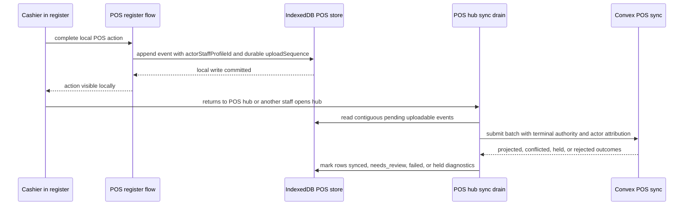

# fix: Rebuild POS hub offline sync drain

## Summary

Rebuild POS local sync around terminal-owned hub draining instead of cashier-owned register-flow upload. Offline POS events should keep their cashier attribution, but upload authorization should come from the provisioned terminal and the POS hub's current online authority. The hub should eagerly drain syncable local history when a stable connection is available, without requiring the original cashier who created the offline events to sign in again.

## Problem Frame

The current runtime made staff proof presence part of the upload sequence calculation. `packages/athena-webapp/src/lib/pos/infrastructure/local/syncContract.ts` filters upload candidates through `isSyncablePosLocalEvent`, which requires `staffProofToken`, then computes the outgoing sequence from the remaining currently syncable events. That means local order is not durable: when one cashier's transient proof is missing, their events disappear from the upload sequence and later staff events can occupy earlier sequence numbers.

The backend in `packages/athena-webapp/convex/pos/application/sync/ingestLocalEvents.ts` correctly expects the next event to be exactly `acceptedThroughSequence + 1`. Once the browser has uploaded later local history with shifted sequence numbers, earlier events are held as out of order and retrying cannot repair the sequence gap. This violates the origin requirement that POS sync upload local register events in a stable order that preserves the cashier register timeline.

## Requirements Trace

- R24. Upload local register events in stable order that preserves the cashier timeline.
- R25. Retry sync idempotently without duplicating sales, payments, receipts, closeouts, or clears.
- R26 and R27. Keep mapping local register sessions, POS sessions, transactions, payments, receipts, inventory, cash controls, and traces into cloud records.
- R30. Surface permission drift for review without rewriting local history.
- R31 and R33. Keep sync state visible and distinguish normal pending sync from reconciliation exceptions.
- User constraint. Backward compatibility is not required for existing broken local/backend event rows.
- User constraint. The upload should happen on the POS hub, not inside the POS register flow.
- User constraint. Store operations must not depend on the original offline cashier returning to sign in.

## Scope Boundaries

- Do not build a generic product-wide offline sync platform. This remains POS-only.
- Do not require service worker background sync for v1. Foreground hub entry, reconnect, visibility, retry, and timer triggers are enough.
- Do not repair already-stranded local events as part of this plan. Test data can be cleared while the model changes.
- Do not remove cashier attribution from events. The actor still matters for receipt, audit, cash-control, and trace records.
- Do not add offline-only payment confirmation states.
- Do not move visual validation into this planning work.

## Key Decisions

1. Assign durable upload sequence at local event write time.

   `posLocalStore` should persist an upload sequence or upload cursor metadata for every uploadable event when the event is appended. Sequence cannot be recomputed from whichever events happen to have proof at upload time. Local-only events such as `session.started`, `cart.item_added`, and `session.payments_updated` can remain local precursors, but uploadable events need immutable register-session upload order.

2. Separate actor attribution from upload authority.

   The event should retain `staffProfileId` as the cashier/actor. The sync envelope should separately carry hub or terminal submission evidence, for example `submittedByStaffProfileId`, terminal sync secret, and any server-verifiable proof needed to permit the terminal to submit. Projection can still validate the original actor's current or last-known POS role and create permission conflicts when needed, but lack of the original cashier's transient proof must not block upload forever.

3. Move automatic draining to the POS hub.

   `/pos` should own the foreground sync drain for provisioned terminals. The register flow can append local events and refresh local read models, but it should not run the upload scheduler. Leaving the register or signing out should not strand uploadable POS history.

4. Keep backend ordering strict, but make the browser contract stable.

   `ingestLocalEvents` should continue enforcing contiguous per-terminal, per-local-register-session sequences. The fix is to send stable sequence numbers from local storage and stop sending shifted batches. Server held events should become real evidence of missing local history, not a symptom of browser-side proof filtering.

5. Permission drift becomes reconciliation, not upload eligibility.

   If an offline event was locally authorized at the time it was recorded but later fails cloud permission checks, project it into `conflicted` or review state with the existing reconciliation rails. Do not make upload eligibility depend on reacquiring that staff member's proof.

6. The status label remains simple.

   Cashier-facing header labels should stay to `pending sync` and `synced`. Counts, cursor state, last failure, scheduler state, and batch details belong in the support diagnostics panel or hub status surface, not in the compact header label.

## High-Level Flow

## Implementation Units

### U1. Persist durable upload order in the local store

**Goal:** Make upload sequence a stored fact rather than a sync-time derivation.

**Files**

- Modify: `packages/athena-webapp/src/lib/pos/infrastructure/local/posLocalStore.ts`
- Modify: `packages/athena-webapp/src/lib/pos/infrastructure/local/posLocalStore.test.ts`
- Modify: `packages/athena-webapp/src/lib/pos/infrastructure/local/syncStatus.ts`
- Modify: `packages/athena-webapp/src/lib/pos/infrastructure/local/syncStatus.test.ts`

**Plan**

- Bump `POS_LOCAL_STORE_SCHEMA_VERSION`.
- Add upload metadata to `PosLocalEventRecord.sync`, such as `uploadSequence`, `uploadable`, and optional `uploadBlockedReason`.
- Allocate upload sequence transactionally when `appendEvent` writes an uploadable event type. Use per `localRegisterSessionId` ordering, because the server cursor is per local register session.
- Leave non-uploadable precursor events out of backend sequence, but keep their local event sequence for read-model reconstruction and precursor marking.
- Mark `session.started` as local-only by design so it cannot become a stranded upload blocker.

**Tests**

- `packages/athena-webapp/src/lib/pos/infrastructure/local/posLocalStore.test.ts`: appending `register.opened`, `transaction.completed`, `cart.cleared`, `register.closeout_started`, and `register.reopened` assigns immutable upload sequence per register session.
- `packages/athena-webapp/src/lib/pos/infrastructure/local/posLocalStore.test.ts`: appending `session.started`, cart item, and payment updates does not consume upload sequence.
- `packages/athena-webapp/src/lib/pos/infrastructure/local/posLocalStore.test.ts`: multi-staff events in one local register session retain upload sequence even when staff proof data is absent or later attached.
- `packages/athena-webapp/src/lib/pos/infrastructure/local/syncStatus.test.ts`: status progress uses uploadable sync rows for pending/synced state and ignores local-only rows.

### U2. Redesign the upload contract around actor and submitter separation

**Goal:** Stop using cashier proof as both event authorship and upload eligibility.

**Files**

- Modify: `packages/athena-webapp/shared/posLocalSyncContract.ts`
- Modify: `packages/athena-webapp/src/lib/pos/infrastructure/local/syncContract.ts`
- Modify: `packages/athena-webapp/src/lib/pos/infrastructure/local/syncContract.test.ts`
- Modify: `packages/athena-webapp/src/lib/pos/infrastructure/local/localCommandGateway.ts`
- Modify: `packages/athena-webapp/src/lib/pos/infrastructure/local/localCommandGateway.test.ts`

**Plan**

- Rename the cashier field in the shared upload contract conceptually to actor staff identity, while keeping a migration-free implementation name if that is simpler during execution.
- Add a separate sync submission authority field or batch-level context for terminal/hub authorization.
- Change `isSyncablePosLocalEvent` into an upload-eligibility check based on event type, local register session, durable upload sequence, terminal/store scope, and sync status. It must not require `staffProofToken`.
- Keep optional actor proof or local-authorization evidence if useful for permission drift diagnostics, but do not let it affect upload sequence or candidate selection.
- Remove or demote `attachStaffProofTokenToPendingEvents` from the core upload path. If retained, it should only enrich diagnostics/projection, never unlock sequence.
- Ensure `cart.cleared` with no prior sale activity remains local-only/synced, while a real clear after local sale activity gets a durable upload sequence and can be drained from the hub.

**Tests**

- `packages/athena-webapp/src/lib/pos/infrastructure/local/syncContract.test.ts`: missing original cashier proof does not remove an uploadable event from sequence.
- `packages/athena-webapp/src/lib/pos/infrastructure/local/syncContract.test.ts`: later staff events do not shift into earlier sequence positions when an earlier staff event lacks proof.
- `packages/athena-webapp/src/lib/pos/infrastructure/local/syncContract.test.ts`: uploaded events use stored `uploadSequence`, not the count of currently syncable events.
- `packages/athena-webapp/src/lib/pos/infrastructure/local/localCommandGateway.test.ts`: `session.started` stays local-only, and `cart.cleared` only uploads when it represents real sale activity.

### U3. Move the scheduler runtime to the POS hub

**Goal:** Make `/pos` the automatic drain point for pending local POS history.

**Files**

- Modify: `packages/athena-webapp/src/components/pos/PointOfSaleView.tsx`
- Modify: `packages/athena-webapp/src/components/pos/PointOfSaleView.test.tsx`
- Modify: `packages/athena-webapp/src/lib/pos/infrastructure/local/usePosLocalSyncRuntime.ts`
- Modify: `packages/athena-webapp/src/lib/pos/infrastructure/local/usePosLocalSyncRuntime.test.ts`
- Modify: `packages/athena-webapp/src/lib/pos/presentation/register/useRegisterViewModel.ts`
- Modify: `packages/athena-webapp/src/lib/pos/presentation/register/useRegisterViewModel.test.ts`
- Modify: `packages/athena-webapp/src/components/pos/register/POSRegisterView.tsx`
- Modify: `packages/athena-webapp/src/components/pos/register/POSRegisterView.test.tsx`

**Plan**

- Split the runtime hook into read-only status and upload-drain concerns, or add an explicit mode such as `drainEnabled`.
- Call the drain-enabled runtime from `PointOfSaleView` when a provisioned terminal seed is available.
- Call status-only runtime from the register route so the header/debug panel can display local state without uploading from the register flow.
- Trigger immediate hub drain on route entry, online event, visibility regain, manual retry, and foreground interval when pending uploadable rows exist.
- Keep register event appends as local wakeups for status refresh, but not upload.
- Keep the header label compact: `pending sync` or `synced`. Put counts and scheduler internals in diagnostics.

**Tests**

- `packages/athena-webapp/src/components/pos/PointOfSaleView.test.tsx`: opening `/pos` with a provisioned terminal starts a drain attempt for pending uploadable events.
- `packages/athena-webapp/src/lib/pos/infrastructure/local/usePosLocalSyncRuntime.test.ts`: `drainEnabled: false` reads status but does not call `ingestLocalEvents`.
- `packages/athena-webapp/src/lib/pos/infrastructure/local/usePosLocalSyncRuntime.test.ts`: `drainEnabled: true` uploads immediately when online and pending rows exist.
- `packages/athena-webapp/src/lib/pos/presentation/register/useRegisterViewModel.test.ts`: register route no longer uploads pending events on sign-in, append, or route entry.
- `packages/athena-webapp/src/components/pos/register/POSRegisterView.test.tsx`: compact sync label does not include counts.

### U4. Update backend ingestion and projection for terminal-submitted actor events

**Goal:** Let the terminal/hub submit historical cashier events while preserving actor attribution and review conflicts.

**Files**

- Modify: `packages/athena-webapp/convex/pos/public/sync.ts`
- Modify: `packages/athena-webapp/convex/pos/public/sync.test.ts`
- Modify: `packages/athena-webapp/convex/pos/application/sync/ingestLocalEvents.ts`
- Modify: `packages/athena-webapp/convex/pos/application/sync/ingestLocalEvents.test.ts`
- Modify: `packages/athena-webapp/convex/pos/application/sync/projectLocalEvents.ts`
- Modify: `packages/athena-webapp/convex/pos/application/sync/projectLocalEvents.test.ts`
- Modify: `packages/athena-webapp/convex/pos/application/sync/types.ts`
- Modify: `packages/athena-webapp/convex/pos/infrastructure/repositories/localSyncRepository.ts`

**Plan**

- Treat terminal provisioning and sync secret validation as the upload authority for the batch.
- Store both actor staff identity and submitter evidence on sync event records where useful.
- Change permission validation so lack of original actor proof produces a projection conflict only when cloud policy requires review. It should not reject or hold the event before sequence acceptance.
- Keep manager-only actions, especially `register_reopened`, strict. If actor authority cannot be validated, accept the event into sync history and mark it conflicted/reviewable rather than advancing hidden state incorrectly.
- Preserve existing idempotency: retries of the same local event must match the originally accepted payload.
- Continue returning mappings/conflicts so the local store can mark rows synced or needs review.

**Tests**

- `packages/athena-webapp/convex/pos/application/sync/ingestLocalEvents.test.ts`: a batch with stable sequences from different actor staff profiles accepts in order under one terminal authority.
- `packages/athena-webapp/convex/pos/application/sync/ingestLocalEvents.test.ts`: retrying accepted terminal-submitted actor events is idempotent.
- `packages/athena-webapp/convex/pos/application/sync/ingestLocalEvents.test.ts`: true missing earlier upload sequence still returns `held` with out-of-order evidence.
- `packages/athena-webapp/convex/pos/application/sync/projectLocalEvents.test.ts`: cashier attribution on sale, payment, receipt, cash-control, and trace projection remains the actor staff profile.
- `packages/athena-webapp/convex/pos/application/sync/projectLocalEvents.test.ts`: permission drift becomes a conflict/review record without losing the completed sale timeline.

### U5. Improve hub and diagnostics visibility

**Goal:** Make support inspection explain what the drain is doing without putting unstable counts in the compact label.

**Files**

- Modify: `packages/athena-webapp/src/components/pos/PointOfSaleView.tsx`
- Modify: `packages/athena-webapp/src/components/pos/PointOfSaleView.test.tsx`
- Modify: `packages/athena-webapp/src/components/pos/register/POSRegisterView.tsx`
- Modify: `packages/athena-webapp/src/components/pos/register/POSRegisterView.test.tsx`
- Modify: `packages/athena-webapp/src/lib/pos/infrastructure/local/usePosLocalSyncRuntime.ts`
- Modify: `packages/athena-webapp/src/lib/pos/infrastructure/local/usePosLocalSyncRuntime.test.ts`
- Modify: `packages/athena-webapp/src/lib/pos/presentation/syncStatusPresentation.ts`
- Modify: `packages/athena-webapp/src/lib/pos/presentation/syncStatusPresentation.test.ts`

**Plan**

- Extend debug state with pending uploadable count, local-only pending count, next upload sequence, oldest pending event type, batch state, last attempted batch size, last accepted sequence, held count, review count, and last successful sync time.
- Show whether the current surface is `hub drain enabled` or `register status only`.
- Keep raw support fields in diagnostics, but normalize compact operator copy.
- Ensure the synced label appears when every uploadable event is synced and only local-only rows remain.

**Tests**

- `packages/athena-webapp/src/lib/pos/infrastructure/local/usePosLocalSyncRuntime.test.ts`: debug state reports eligible upload rows separately from local-only rows.
- `packages/athena-webapp/src/lib/pos/presentation/syncStatusPresentation.test.ts`: compact labels are exactly `pending sync` and `synced`.
- `packages/athena-webapp/src/components/pos/register/POSRegisterView.test.tsx`: diagnostics shows hub/register mode and last failure without changing compact header label.
- `packages/athena-webapp/src/components/pos/PointOfSaleView.test.tsx`: POS hub exposes drain status for pending local history.

### U6. Add end-to-end regression coverage for the observed failure

**Goal:** Lock the specific multi-staff offline sequence bug so it cannot return.

**Files**

- Modify: `packages/athena-webapp/src/lib/pos/infrastructure/local/syncContract.test.ts`
- Modify: `packages/athena-webapp/src/lib/pos/infrastructure/local/usePosLocalSyncRuntime.test.ts`
- Modify: `packages/athena-webapp/convex/pos/application/sync/ingestLocalEvents.test.ts`
- Modify: `packages/athena-webapp/convex/pos/public/sync.test.ts`
- Update validation metadata if this repo's validation map requires new/changed test routing.

**Test Scenarios**

- Staff A starts offline local POS work, leaves, Staff B completes a transaction offline, then hub drains when online without Staff A signing in.
- Staff A creates uploadable sequence 1, Staff B creates uploadable sequence 2, Staff A returns later; backend accepts sequence 1 then 2 rather than seeing sequence drift.
- A no-item session start followed by exit creates no upload-blocking `session.started` record.
- A real `cart.cleared` event created after sale activity is uploadable and drains from hub immediately when online.
- Register route status can show pending sync, but `ingestLocalEvents` is not called until `/pos` hub owns the drain.

## Data and Compatibility

Backward compatibility is intentionally not part of this fix. Because the stored local event shape and upload contract should change, the implementation may bump the local IndexedDB schema and require clearing local POS events in development/test environments. For production rollout, choose one explicit path during implementation: either preserve old rows as local-only review evidence or fail closed with operator-safe setup copy. Do not silently mix old computed-sequence events with the new durable sequence model.

Backend test data in `posLocalSyncEvent` and its cursor table may also need clearing in non-production environments while validating the new contract. The implementation should document the exact table names after confirming the schema fields in `packages/athena-webapp/convex/schema.ts`.

## Risks and Mitigations

- Risk: terminal-level upload authority could look like it weakens staff accountability. Mitigation: store actor staff identity separately and keep it as the source for cashier attribution, receipts, audit, cash-control, and workflow trace records.
- Risk: permission drift could project invalid manager-only actions. Mitigation: accept the event into ordered sync history, but project manager-only or unverified authority cases into conflict/review state rather than applying privileged side effects.
- Risk: moving upload to `/pos` delays sync if the operator never visits the hub. Mitigation: the requested product boundary is hub upload; keep manual retry and visible hub status, and consider app-shell or background follow-up later if operations show hub visits are insufficient.
- Risk: status labels can hide meaningful failures. Mitigation: keep compact labels stable, but make diagnostics richer and manager-facing review states explicit.

## Validation Plan

- Run focused Vitest coverage for local store, sync contract, scheduler/runtime, register view model, POS register view, and POS hub view.
- Run Convex sync ingestion and projection tests for actor/submitter separation and sequence idempotency.
- Run the repo's changed-file validation path for `packages/athena-webapp`.
- After implementation changes code files, run `bun run graphify:rebuild` per repo guidance.

## Sources

- Origin requirements: `docs/brainstorms/2026-05-13-pos-local-first-register-requirements.md`
- Prior plan: `docs/plans/2026-05-13-001-feat-pos-local-first-register-plan.md`
- Prior plan: `docs/plans/2026-05-14-001-feat-pos-always-local-first-flow-plan.md`
- Learning: `docs/solutions/architecture/athena-pos-local-first-sync-2026-05-13.md`
- Learning: `docs/solutions/architecture/athena-pos-local-staff-authority-2026-05-14.md`
- Learning: `docs/solutions/architecture/athena-pos-local-first-entry-readiness-2026-05-14.md`
- Learning: `docs/solutions/architecture/athena-pos-local-first-runtime-feedback-2026-05-15.md`
