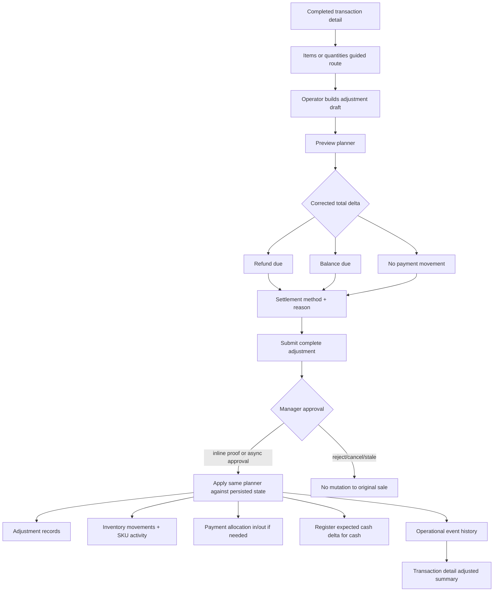

# feat: Add money-settled POS item adjustments

## Summary

Build a completed-transaction adjustment workflow for POS item and quantity corrections. The original sale remains immutable, while a linked adjustment records the corrected line state, inventory deltas, refund or collection settlement, one manager approval for the complete adjustment, and visible transaction history.

---

## Problem Frame

Completed POS transactions can now need item or quantity correction after the customer has left the active register flow. The current transaction update panel correctly avoids direct edits for items, totals, and discounts, but the business now needs a safe way to recover from wrong items or quantities while preserving drawer, inventory, payment, and audit truth.

---

## Requirements

- R1. Operators can start an item/quantity correction from a completed POS transaction detail page.
- R2. The original `posTransaction` and original `posTransactionItem` rows remain the historical sale record; the workflow records a linked adjustment instead of rewriting the completed sale as primary truth.
- R3. Operators can revise an adjustment draft freely before submission; manager approval is required once for the complete adjustment bundle, not once per line change.
- R4. The adjustment preview shows original total, corrected total, refund due, balance due, no-payment state, and per-SKU inventory deltas before approval.
- R5. Applying an approved adjustment records all effects atomically enough for Athena's current Convex command model: adjustment records, inventory movement, SKU activity, payment allocation, register expected-cash impact for cash movements, and operational event history.
- R6. A refund is required when the corrected total is lower, a collection is required when the corrected total is higher, and no payment movement is recorded when totals are equal.
- R7. Approval requests must have a concrete resolver path; rejected, cancelled, stale, mismatched, or already-applied approvals must leave the original transaction unchanged.
- R8. Transaction detail and operations queue UI use the existing command-result and command-approval presentation patterns, with calm operator-facing copy.
- R9. Reporting/read models can distinguish original sale totals from effective net totals after adjustments; existing reports must not silently change semantics without an explicit adjusted/net field.
- R10. Discounts, arbitrary total overrides, tax overrides, and original-receipt rewrites remain out of v1.

---

## Scope Boundaries

- Do not directly edit completed transaction line rows or transaction totals as the source of truth.
- Do not require manager approval for every line edit while the operator is constructing the adjustment.
- Do not support discount-only, tax-only, cashier-attribution, or arbitrary total corrections in this plan.
- Do not build a new approval system; use the existing command approval, approval proof, and approval request rails.
- Do not make the active POS register command path wait on this completed-transaction adjustment workflow.
- Do not make adjustment receipt generation block the ledger workflow unless implementation discovers an existing receipt path that is cheap to extend safely.

### Deferred to Follow-Up Work

- Adjustment receipt delivery: produce a customer-facing adjustment receipt linked to the original receipt after the core ledger path is proven.
- POS local-first adjustment sync: project completed-transaction adjustments through the local event log if product direction requires offline corrections from the transaction detail surface.
- Discount and amount/totals corrections: reuse the adjustment shell later with separate pricing and approval policy decisions.
- Daily-close adjusted/net reporting expansion beyond the minimum fields needed to avoid misleading transaction detail and cash-control displays.

---

## Context & Research

### Relevant Code and Patterns

- `packages/athena-webapp/convex/pos/application/corrections/correctionPolicy.ts` currently classifies item, quantity, total, discount, and inventory corrections as unsupported high-risk intents.
- `packages/athena-webapp/convex/pos/application/commands/correctTransaction.ts` implements completed transaction customer and same-amount payment-method corrections through command boundaries, approval requests, payment allocation updates, and operational events.
- `packages/athena-webapp/src/components/pos/transactions/TransactionView.tsx` already exposes guided routes for items/quantities, amounts/totals, and discounts, and renders transaction update history.
- `packages/athena-webapp/convex/pos/application/commands/completeTransaction.ts` shows the current completed-sale write path: transaction, transaction items, register-session sale math, payment allocations, SKU/product quantity changes, and inventory movement.
- `packages/athena-webapp/convex/operations/paymentAllocations.ts` records in/out payment movements and provides the shared ledger used by POS and cash controls.
- `packages/athena-webapp/convex/operations/approvalRequests.ts`, `packages/athena-webapp/convex/operations/approvalActions.ts`, and `packages/athena-webapp/src/components/operations/CommandApprovalDialog.tsx` are the existing approval path.
- `packages/athena-webapp/convex/storeFront/helpers/returnExchangeOperations.ts` and `packages/athena-webapp/convex/storeFront/onlineOrder.ts` provide an adjacent plan/apply pattern for return and exchange operations that compute refund versus balance due, inventory movement, payment allocation, and operational events.
- `packages/athena-webapp/docs/agent/architecture.md` requires approval-sensitive commands to return `approval_required`, consume server-side approval proof, and avoid trusting client-supplied staff identity as approval.
- `packages/athena-webapp/docs/agent/testing.md` identifies command approval, POS/register-session, cash-control, and Convex validation slices that apply to this work.

### Institutional Learnings

- `docs/solutions/logic-errors/athena-pos-ledger-safe-corrections-2026-04-30.md`: completed-sale financial and inventory facts should not be silently rewritten; supported corrections must use command-boundary workflows and operational events.
- `docs/solutions/logic-errors/athena-command-approval-policy-boundary-2026-05-01.md`: approval belongs at the command boundary; the UI presents returned requirements and retries the same protected command with a consumed proof.
- `docs/solutions/logic-errors/athena-command-approval-manager-fast-path-2026-05-02.md`: same-submission manager approval can avoid double authentication, but the command still owns the requirement.
- `docs/solutions/architecture/athena-pos-local-first-sync-2026-05-13.md`: POS local-first projection preserves completed sales and surfaces conflicts for review rather than rewriting receipt history.
- `docs/solutions/logic-errors/athena-sku-activity-traceability-2026-05-13.md`: every SKU-affecting mutation boundary should write source-aware activity evidence.

### External References

- None used. This plan follows existing Athena payment, approval, inventory, and POS correction patterns.

---

## Alternative Approaches Considered

- **Adjustment ledger workflow, selected:** Keep original sale immutable and record a linked adjustment with item, inventory, payment, approval, and audit effects. This best preserves operational truth and matches existing ledger-safe correction guidance.
- **Patch completed transaction rows directly:** Faster to explain in UI, but it weakens auditability and can make cash-control and inventory reports silently change historical facts.
- **Void and recreate:** Simple accounting story for full-sale mistakes, but too disruptive for partial corrections and creates noisy receipt/history behavior when only one line quantity was wrong.
- **Same-total item corrections only:** Lower risk, but rejected because the approved product direction requires collecting or refunding money in v1.

---

## Key Technical Decisions

- **Record adjustments as first-class POS records:** Add adjustment and adjustment-line records so original transaction rows remain historical fact while read models can expose effective net totals explicitly.
- **Require one approval for the complete adjustment:** Operators can add, remove, and revise line changes before submission. The approval subject is the full adjustment payload, including settlement direction and method; if the payload changes after approval request or proof, the old approval no longer matches.
- **Use command approval rather than UI-only manager checks:** The server command returns `approval_required`, binds approval to the transaction/adjustment subject, and applies only after matching proof or async approval resolution.
- **Preview and apply use the same planner:** The planning helper computes corrected lines, totals, inventory deltas, and settlement direction. Apply must recompute from persisted original state and approved payload to prevent stale previews from becoming mutations.
- **Payment settlement is a linked allocation:** Refunds use `direction: "out"`, collections use `direction: "in"`, and equal-total adjustments record no payment allocation. Cash movements update register expected cash and variance when applicable.
- **Reporting gets explicit net fields:** Transaction detail can show original total and adjusted net total, but existing reports should not silently reinterpret `posTransaction.total` unless the report is intentionally changed to an adjusted/net metric.
- **V1 allows one active adjustment at a time per transaction:** A transaction may not receive a second pending adjustment while one is awaiting approval. If implementation supports multiple applied adjustments, each new preview must compute from the latest effective adjusted state; otherwise v1 should block after one applied adjustment and route further changes to manager/admin review.
- **Added-item pricing uses a server-owned SKU price snapshot:** Existing lines use the original transaction item unit price. Added lines use the current server-side SKU price at preview/apply time unless implementation finds an existing historical price snapshot helper to reuse.
- **Start as cloud-applied completed-transaction workflow:** This route operates on already-synced completed transactions. Local-first/offline adjustment projection is deferred until there is a product requirement for offline corrections outside active sale flow.

---

## Open Questions

### Resolved During Planning

- **Should item/quantity corrections collect or refund money in v1?** Yes. The approved direction requires settlement for higher/lower corrected totals.
- **Should manager approval be required for each line adjustment?** No. One approval is required for the complete adjustment bundle at final submission/apply.
- **Should the original receipt be rewritten?** No for v1. The original receipt remains historical; an adjustment receipt is a follow-up unless existing receipt infrastructure makes a linked adjustment receipt cheap and safe.
- **Should original completed transaction totals be patched?** No. Read models may expose effective adjusted totals separately.

### Deferred to Implementation

- **Exact table and event names:** Choose final names during implementation to fit current schema naming, but preserve first-class adjustment records and transaction-linked operational events.
- **Whether applied adjustment status and approval request live on the same table or via status-only events:** Decide after checking the simplest index/query shape for transaction detail and operations queue.
- **How much adjusted/net reporting to include in daily close immediately:** Implement the minimum needed to avoid misleading transaction detail and cash-control views; broader reporting can follow.

---

## High-Level Technical Design

> *This illustrates the intended approach and is directional guidance for review, not implementation specification. The implementing agent should treat it as context, not code to reproduce.*

---

## Implementation Units

- U1. **Add POS adjustment schema and read helpers**

**Goal:** Create the persistent adjustment model and transaction-scoped read helpers needed for planning, approval, application, and transaction-detail display.

**Requirements:** R2, R4, R5, R7, R9

**Dependencies:** None

**Files:**
- Create: `packages/athena-webapp/convex/schemas/pos/posTransactionAdjustment.ts`
- Create: `packages/athena-webapp/convex/schemas/pos/posTransactionAdjustmentLine.ts`
- Modify: `packages/athena-webapp/convex/schemas/pos/index.ts`
- Modify: `packages/athena-webapp/convex/schema.ts`
- Modify: `packages/athena-webapp/convex/pos/infrastructure/repositories/transactionRepository.ts`
- Test: `packages/athena-webapp/convex/pos/application/transactionAdjustments.test.ts`

**Approach:**
- Model one parent adjustment per submitted correction bundle, linked to store, transaction, register session, requester, approval request/proof, settlement direction, settlement method, original total, corrected total, delta, reason, and status.
- Model adjustment lines as before/after or delta lines that reference original transaction items when applicable and product/SKU identity for added items.
- Add transaction-scoped indexes for detail queries and approval resolution, plus idempotency fields if implementation needs retry-safe apply semantics.
- Keep original transaction and item schemas intact except for optional read-model helpers if implementation proves they are necessary.

**Execution note:** Implement schema and repository behavior test-first because downstream units depend on exact persisted states.

**Patterns to follow:**
- `packages/athena-webapp/convex/schemas/pos/posTransaction.ts`
- `packages/athena-webapp/convex/schemas/pos/posTransactionItem.ts`
- `packages/athena-webapp/convex/schemas/operations/approvalRequest.ts`
- `packages/athena-webapp/convex/pos/infrastructure/repositories/transactionRepository.ts`

**Test scenarios:**
- Happy path: a pending adjustment and its lines can be created for a completed transaction and listed by transaction id.
- Happy path: an applied adjustment can be loaded with lines and approval metadata for transaction detail.
- Edge case: multiple adjustments on the same transaction are ordered by creation/application time without overwriting original sale rows.
- Error path: repository helpers reject or do not create adjustment records for a missing transaction.
- Integration: adjustment records can link to register session, approval request, payment allocation, and operational event ids without requiring cross-table rewrites.

**Verification:**
- The schema supports pending approval, applied, rejected, cancelled, and stale/mismatched states without changing original sale records.

---

- U2. **Build deterministic item-adjustment planner**

**Goal:** Compute corrected line state, totals, inventory deltas, and payment settlement requirements from an original completed transaction plus operator-selected item/quantity changes.

**Requirements:** R1, R3, R4, R6, R10

**Dependencies:** U1

**Files:**
- Create: `packages/athena-webapp/convex/pos/application/commands/transactionAdjustmentPlanner.ts`
- Modify: `packages/athena-webapp/convex/pos/application/corrections/correctionPolicy.ts`
- Test: `packages/athena-webapp/convex/pos/application/transactionAdjustmentPlanner.test.ts`
- Test: `packages/athena-webapp/convex/pos/application/corrections/correctionPolicy.test.ts`

**Approach:**
- Extend correction policy with an item/quantity adjustment intent classified as ledger-affecting and manager-approved, while leaving discounts and arbitrary totals unsupported.
- Normalize draft input into corrected line quantities by SKU and original transaction line reference where possible.
- Recompute corrected subtotal/total from stored transaction item prices for existing lines and server-owned SKU prices for newly added lines unless implementation finds an existing product-price snapshot rule that should be reused.
- Compute inventory deltas from original sold quantities to corrected quantities: positive restock for removed quantity, negative movement for added quantity.
- Compute settlement direction from corrected total minus the transaction's current effective total. V1 should either block a second applied adjustment or explicitly include prior applied adjustments in that effective state.
- Return browser-safe validation failures for empty adjustment, unchanged basket, invalid quantities, missing SKU, unavailable stock for additions, and unsupported discount/price mutation attempts.

**Execution note:** Keep the planner pure enough to test without Convex mutation side effects, then wrap repository reads around it.

**Patterns to follow:**
- `packages/athena-webapp/convex/pos/application/commands/completeTransaction.ts`
- `packages/athena-webapp/convex/storeFront/helpers/returnExchangeOperations.ts`
- `docs/solutions/logic-errors/athena-pos-ledger-safe-corrections-2026-04-30.md`

**Test scenarios:**
- Happy path: removing one quantity lowers corrected total, produces refund due, and returns a positive inventory delta.
- Happy path: adding a missed SKU raises corrected total, produces balance due, and returns a negative inventory delta.
- Happy path: swapping from one SKU to another returns both restock and issue deltas plus the net settlement amount.
- Happy path: changing quantities with equal net total returns no payment movement.
- Edge case: zero, negative, fractional, or non-finite quantities are rejected.
- Edge case: changing a previously adjusted transaction computes against the current effective line state if prior adjustments are supported in v1.
- Edge case: a second pending adjustment on the same transaction is rejected until the first is approved, rejected, or cancelled.
- Error path: additions that exceed available stock are rejected with safe copy.
- Error path: discount-only, manual price, tax, or arbitrary total mutation input is rejected as out of scope.

**Verification:**
- Preview and apply can call the same planner and receive identical totals/deltas for the same persisted transaction state and submitted payload.

---

- U3. **Add approval-backed adjustment commands**

**Goal:** Expose public command-result mutations that preview, request approval for, and apply a complete item/quantity adjustment bundle.

**Requirements:** R3, R5, R6, R7, R8

**Dependencies:** U1, U2

**Files:**
- Create: `packages/athena-webapp/convex/pos/application/commands/adjustTransactionItems.ts`
- Modify: `packages/athena-webapp/convex/pos/public/transactions.ts`
- Modify: `packages/athena-webapp/convex/pos/application/commands/correctTransaction.ts`
- Modify: `packages/athena-webapp/convex/operations/approvalActions.ts`
- Modify: `packages/athena-webapp/convex/operations/approvalRequests.ts`
- Test: `packages/athena-webapp/convex/pos/application/adjustTransactionItems.test.ts`
- Test: `packages/athena-webapp/convex/pos/public/transactions.test.ts`
- Test: `packages/athena-webapp/convex/operations/approvalRequests.test.ts`

**Approach:**
- Add a preview query or mutation that returns planner output without writing protected effects.
- Add a submit/apply mutation that validates staff identity, reason, settlement method when money moves, and current transaction status.
- On first submit without approval proof, create or return an approval requirement for the full adjustment bundle, including a payload fingerprint that binds line changes, settlement direction, settlement method, and amount.
- On retry with inline proof or async approval resolution, recompute the plan from persisted state and require the submitted payload fingerprint to match the approved adjustment.
- Reject stale approvals when transaction state, prior adjustments, settlement amount, or line payload no longer matches.
- Use one protected apply path for both inline manager approval and async approval resolution.

**Execution note:** Start with failing command-result tests that prove no side effects occur before approval is consumed.

**Patterns to follow:**
- Payment-method correction in `packages/athena-webapp/convex/pos/application/commands/correctTransaction.ts`
- Approval decision routing in `packages/athena-webapp/convex/operations/approvalRequests.ts`
- `docs/solutions/logic-errors/athena-command-approval-policy-boundary-2026-05-01.md`
- `docs/solutions/logic-errors/athena-command-approval-manager-fast-path-2026-05-02.md`

**Test scenarios:**
- Happy path: submit adjustment without proof returns `approval_required` and creates one pending request for the complete bundle.
- Happy path: retry with matching inline manager proof applies the complete adjustment once.
- Happy path: async approval resolution applies the same protected path as inline approval.
- Error path: changing lines or settlement method after approval causes fingerprint mismatch and no mutation.
- Error path: already decided, missing, wrong-store, wrong-transaction, or wrong-request-type approval requests are rejected.
- Error path: proof for another action, subject, store, role, requester, expired proof, or consumed proof is rejected.
- Integration: no adjustment records, inventory movements, payment allocations, or operational events are written before approval.

**Verification:**
- Manager approval is required exactly once per complete submitted adjustment and is bound to the full payload.

---

- U4. **Apply inventory, payment, drawer, and audit effects**

**Goal:** Implement the approved adjustment side effects that keep inventory, SKU activity, cash controls, payment allocations, and history consistent.

**Requirements:** R2, R5, R6, R7, R9

**Dependencies:** U1, U2, U3

**Files:**
- Modify: `packages/athena-webapp/convex/operations/inventoryMovements.ts`
- Modify: `packages/athena-webapp/convex/operations/skuActivity.ts`
- Modify: `packages/athena-webapp/convex/operations/paymentAllocations.ts`
- Modify: `packages/athena-webapp/convex/operations/registerSessions.ts`
- Modify: `packages/athena-webapp/convex/operations/operationalEvents.ts`
- Modify: `packages/athena-webapp/convex/pos/application/commands/adjustTransactionItems.ts`
- Test: `packages/athena-webapp/convex/pos/application/adjustTransactionItems.test.ts`
- Test: `packages/athena-webapp/convex/operations/paymentAllocations.test.ts`
- Test: `packages/athena-webapp/convex/operations/skuActivity.test.ts`
- Test: `packages/athena-webapp/convex/cashControls/registerSessions.test.ts`

**Approach:**
- For restocked quantities, increase SKU inventory fields consistently with existing return/restock semantics and record positive inventory movements.
- For added quantities, reduce SKU inventory fields consistently with sale/exchange semantics and record negative inventory movements.
- Record source-aware SKU activity for each changed SKU so support can explain adjustment-driven stock movement.
- Record a payment allocation with `direction: "out"` for refunds or `direction: "in"` for collections; link it to transaction, adjustment, register session, customer, actor, and notes/reason.
- For cash settlement, adjust register expected cash by collection/refund cash delta and recompute variance when counted cash exists.
- Record an operational event on the original transaction with concise summary metadata, including line deltas, settlement direction, amount, payment allocation id, inventory movement ids, approval request/proof ids, requester, and approver.
- Mark the adjustment applied only after all required effects are recorded; design idempotency so repeated approval resolution cannot duplicate allocations or movements.

**Execution note:** Add characterization around current sale, void, payment-allocation, and inventory-movement behavior before extending shared helpers if tests are missing.

**Patterns to follow:**
- Sale and void side effects in `packages/athena-webapp/convex/pos/application/commands/completeTransaction.ts`
- `recordPaymentAllocationWithCtx` idempotency in `packages/athena-webapp/convex/operations/paymentAllocations.ts`
- SKU activity source requirements in `docs/solutions/logic-errors/athena-sku-activity-traceability-2026-05-13.md`
- Online return/exchange effect application in `packages/athena-webapp/convex/storeFront/onlineOrder.ts`

**Test scenarios:**
- Happy path: lower corrected total records refund allocation, restocks SKU quantity, writes inventory movement, writes SKU activity, and marks adjustment applied.
- Happy path: higher corrected total records collection allocation, reduces SKU quantity, writes inventory movement, writes SKU activity, and marks adjustment applied.
- Happy path: equal corrected total writes inventory/audit effects but no payment allocation.
- Happy path: cash refund reduces register expected cash; cash collection increases register expected cash.
- Edge case: counted drawer variance is recomputed after expected-cash changes.
- Error path: closed/reconciled register sessions block immediate cash settlement or return a resolver-safe failure without partial writes.
- Error path: idempotent retry after an applied adjustment returns the existing applied outcome rather than duplicate allocations or movements.
- Integration: operational history links adjustment, payment allocation, inventory movement, transaction, register session, actor, and approval metadata.

**Verification:**
- Cash-control, payment, and inventory ledgers can be audited from the original transaction without mutating the original sale rows.

---

- U5. **Expose adjustment state in transaction read models**

**Goal:** Return adjustment summaries, adjusted/net totals, and adjustment history to transaction detail without changing original transaction total semantics.

**Requirements:** R2, R4, R8, R9

**Dependencies:** U1, U4

**Files:**
- Modify: `packages/athena-webapp/convex/pos/application/queries/getTransactions.ts`
- Modify: `packages/athena-webapp/convex/pos/public/transactions.ts`
- Modify: `packages/athena-webapp/src/components/pos/transactions/TransactionView.tsx`
- Test: `packages/athena-webapp/convex/pos/application/getTransactions.test.ts`
- Test: `packages/athena-webapp/src/components/pos/transactions/TransactionView.test.tsx`

**Approach:**
- Extend transaction detail query with adjustment summaries, adjusted line state, original total, total adjustments, effective net total, and settlement history.
- Keep existing `total`, `subtotal`, and item list fields as original sale facts unless explicitly adding new `adjusted` fields.
- Include pending adjustment/approval status when relevant so operators see whether a correction is awaiting approval.
- Merge operational events and adjustment records into a readable update-history section without duplicating the same event twice.

**Patterns to follow:**
- Current correction history loading in `packages/athena-webapp/convex/pos/application/queries/getTransactions.ts`
- Transaction summary display in `packages/athena-webapp/src/components/pos/transactions/TransactionView.tsx`
- Money display guidance in `packages/athena-webapp/docs/agent/architecture.md`

**Test scenarios:**
- Happy path: transaction detail with no adjustments renders original sale exactly as today.
- Happy path: applied refund adjustment renders original total, adjusted net total, refund amount, and update history.
- Happy path: pending approval adjustment renders pending status without changing effective net total.
- Edge case: multiple applied adjustments accumulate into explicit adjusted/net fields while preserving original totals.
- Error path: malformed or missing adjustment line references do not crash transaction detail; they render safe fallback copy.
- Integration: adjustment events appear in update history with actor/approver names when available.

**Verification:**
- Existing transaction-list/report consumers are not forced to reinterpret original totals by accident.

---

- U6. **Build the transaction detail adjustment workflow UI**

**Goal:** Turn the current `Items or quantities` guided route into a full operator workflow for building, previewing, approving, and applying a complete adjustment.

**Requirements:** R1, R3, R4, R6, R7, R8, R10

**Dependencies:** U2, U3, U5

**Files:**
- Modify: `packages/athena-webapp/src/components/pos/transactions/TransactionView.tsx`
- Modify: `packages/athena-webapp/src/components/operations/OperationsQueueView.tsx`
- Modify: `packages/athena-webapp/src/lib/errors/runCommand.ts`
- Modify: `packages/athena-webapp/src/lib/errors/presentCommandToast.ts`
- Test: `packages/athena-webapp/src/components/pos/transactions/TransactionView.test.tsx`
- Test: `packages/athena-webapp/src/components/operations/OperationsQueueView.test.tsx`
- Test: `packages/athena-webapp/src/components/operations/CommandApprovalDialog.test.tsx`

**Approach:**
- Replace the static guidance for `Items or quantities` with an adjustment workspace embedded in or adjacent to the transaction update panel.
- Show original lines, editable corrected quantities, add/SKU search for missed items, remove/swap affordances, and live preview.
- Require settlement method when refund or collection is due; hide payment controls when no money moves.
- Submit the complete adjustment through the shared command/approval runner so manager fast-path and async approval behavior stay consistent with existing workflows.
- In the operations queue, render item-adjustment approval cards with transaction number, line changes, refund/collection amount, settlement method, reason, requester, and clear approve/reject consequences.
- Keep copy operational: "Review item adjustment", "Refund due", "Balance due", "No payment movement", and avoid raw backend terminology.

**Execution note:** Implement UI with tests around state transitions before visual polish; browser validation should follow once the route is reachable.

**Patterns to follow:**
- Existing correction panel in `TransactionView.tsx`
- Approval presentation in `packages/athena-webapp/src/components/operations/useApprovedCommand.tsx`
- `packages/athena-webapp/src/components/operations/CommandApprovalDialog.tsx`
- `docs/product-copy-tone.md`

**Test scenarios:**
- Happy path: clicking `Items or quantities` opens the adjustment workflow instead of static guidance.
- Happy path: decreasing quantity shows refund due and requires refund method before submit.
- Happy path: increasing quantity shows balance due and requires collection method before submit.
- Happy path: equal-total swap shows no payment movement and allows final approval submission.
- Happy path: manager same-submission proof applies the adjustment through the shared approval runner.
- Error path: operator cannot submit unchanged basket, missing reason, invalid quantity, or missing settlement method.
- Error path: async approval required state leaves the transaction unchanged and shows pending review copy.
- Integration: operations queue approval card displays complete adjustment details and approving/rejecting routes through the resolver.

**Verification:**
- Operators can complete the approved v1 flow from transaction detail without direct database edits or bespoke approval UI.

---

- U7. **Harden reporting, validation, and browser coverage**

**Goal:** Ensure the new workflow is represented honestly in cash controls, transaction history, harness coverage, and browser validation.

**Requirements:** R5, R8, R9

**Dependencies:** U4, U5, U6

**Files:**
- Modify: `packages/athena-webapp/convex/operations/dailyClose.ts`
- Modify: `packages/athena-webapp/convex/operations/dailyOperations.ts`
- Modify: `packages/athena-webapp/docs/agent/testing.md`
- Modify: `packages/athena-webapp/docs/agent/validation-map.json` or the owning harness registry that generates it
- Test: `packages/athena-webapp/convex/operations/dailyClose.test.ts`
- Test: `packages/athena-webapp/convex/operations/dailyOperations.test.ts`
- Test: `packages/athena-webapp/src/components/cash-controls/RegisterSessionView.test.tsx`
- Test: `packages/athena-webapp/src/components/pos/transactions/TransactionView.test.tsx`

**Approach:**
- Audit daily operations, daily close, payment-method summaries, register-session views, and transaction detail for places where original totals versus adjusted/net totals must be explicit.
- Add only the reporting fields required to prevent misleading displays in v1; broader analytics can follow.
- Update harness metadata if new POS adjustment files are not covered by changed-file validation.
- Browser-verify the current transaction detail route and the approval/error states after implementation.
- Run graphify rebuild after code changes so repo graph navigation stays current.

**Patterns to follow:**
- `packages/athena-webapp/docs/agent/testing.md`
- `docs/solutions/logic-errors/athena-operational-review-list-pagination-and-money-display-2026-05-08.md`
- Cash-control display and amount formatting conventions in `packages/athena-webapp/docs/agent/architecture.md`

**Test scenarios:**
- Happy path: daily close can surface original transaction total and adjustment settlement without double-counting.
- Happy path: payment summaries account for adjustment allocations explicitly where adjusted/net values are shown.
- Edge case: transactions with no adjustments preserve existing reporting behavior.
- Error path: pending/rejected adjustments do not affect adjusted/net totals or closeout settlement.
- Integration: browser transaction detail route shows the adjustment workflow and applied history without overlapping or stale UI states.

**Verification:**
- The validation map or harness registry covers new POS adjustment files, and changed-file validation can select meaningful tests.

---

## System-Wide Impact

- **Interaction graph:** Transaction detail, POS command mutations, approval queue, payment allocation, register-session math, inventory movement, SKU activity, operational events, and daily operations/close read models are all affected.
- **Error propagation:** Expected failures must return `user_error` or `approval_required`; raw thrown backend errors should remain unexpected faults that collapse to generic browser copy.
- **State lifecycle risks:** Pending approval payloads can go stale if the transaction receives another adjustment or if SKU availability changes. Apply must recompute against persisted state and reject mismatches without partial writes.
- **API surface parity:** Public transaction commands, approval decision resolver, operations queue cards, and transaction detail queries all need the same adjustment vocabulary.
- **Integration coverage:** Unit tests alone will not prove the workflow; coverage must include command approval, payment allocation, inventory/SKU activity, register expected cash, operations queue resolution, and transaction detail rendering.
- **Unchanged invariants:** Original completed sale rows remain immutable historical facts; payment allocation remains the shared POS/cash-control money ledger; `registerSessionId` remains the bridge between POS transactions and drawer reporting.

---

## Risks & Dependencies

| Risk | Likelihood | Impact | Mitigation |
|------|------------|--------|------------|
| Adjustment apply partially writes inventory but fails payment or audit effects | Medium | High | Keep apply in one command boundary, validate before writes, write idempotent source ids, and mark applied only after required effects are recorded. |
| Approval payload drift lets a manager approve one basket while another basket is applied | Medium | High | Bind approval to a payload fingerprint and recompute/fingerprint before apply. |
| Reports silently change historical sales totals | Medium | High | Preserve original transaction fields and add explicit adjusted/net fields only where intended. |
| Cash refunds/collections during closing or reconciled register sessions corrupt drawer math | Medium | High | Block immediate cash settlement for closing/reconciled states or require a separate admin path; no partial apply. |
| Added-item adjustment oversells stock | Medium | Medium | Revalidate SKU availability at apply time and reject stale approvals when stock cannot satisfy additions. |
| UI becomes a second register/cart workflow | Low | Medium | Limit v1 to completed transaction adjustment, with no active session/cart mutation and no discount/price editing. |
| Local-first POS expectations are blurred | Low | Medium | Document v1 as cloud-applied completed-transaction workflow and defer offline adjustment projection explicitly. |

---

## Documentation / Operational Notes

- Update operator-facing copy to describe "item adjustment", "refund due", "balance due", and "adjusted total" consistently.
- Add a short docs/solutions note after implementation if the final pattern becomes the durable POS return/exchange/correction foundation.
- After modifying code, run `bun run graphify:rebuild` per repo instructions.
- Validation should include focused command approval tests, POS transaction command tests, payment allocation tests, SKU activity tests, cash-control/register-session tests, transaction UI tests, Convex audit/lint checks, typecheck/build, and browser verification of the transaction detail route.

---

## Sources & References

- Related plan: `docs/plans/2026-04-30-001-feat-pos-correction-workflows-plan.md`
- Related learning: `docs/solutions/logic-errors/athena-pos-ledger-safe-corrections-2026-04-30.md`
- Related learning: `docs/solutions/logic-errors/athena-command-approval-policy-boundary-2026-05-01.md`
- Related learning: `docs/solutions/logic-errors/athena-command-approval-manager-fast-path-2026-05-02.md`
- Related learning: `docs/solutions/architecture/athena-pos-local-first-sync-2026-05-13.md`
- Related learning: `docs/solutions/logic-errors/athena-sku-activity-traceability-2026-05-13.md`
- Relevant code: `packages/athena-webapp/convex/pos/application/commands/correctTransaction.ts`
- Relevant code: `packages/athena-webapp/convex/pos/application/commands/completeTransaction.ts`
- Relevant code: `packages/athena-webapp/convex/operations/paymentAllocations.ts`
- Relevant code: `packages/athena-webapp/convex/operations/approvalRequests.ts`
- Relevant code: `packages/athena-webapp/src/components/pos/transactions/TransactionView.tsx`
- Relevant code: `packages/athena-webapp/src/components/operations/OperationsQueueView.tsx`
