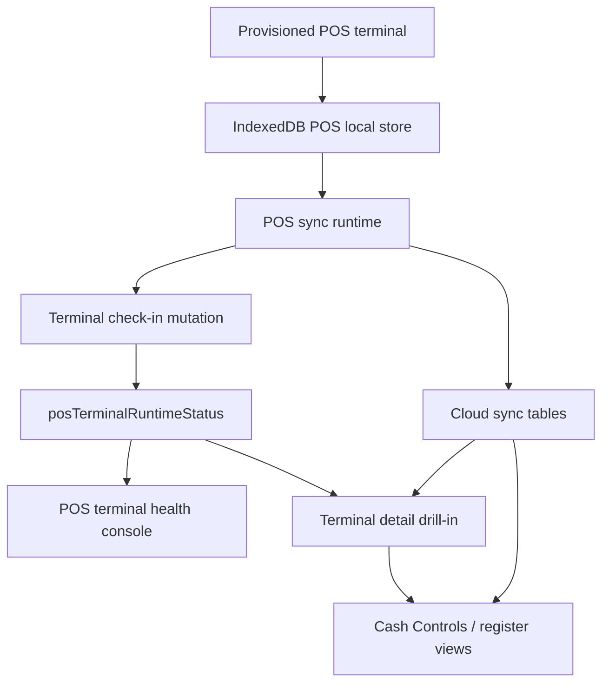
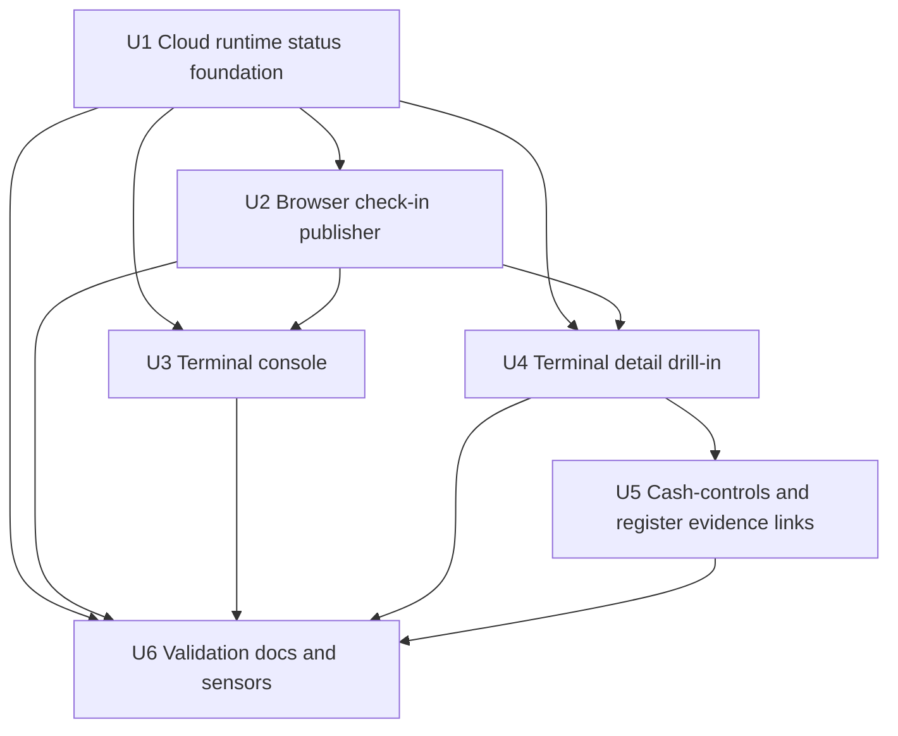
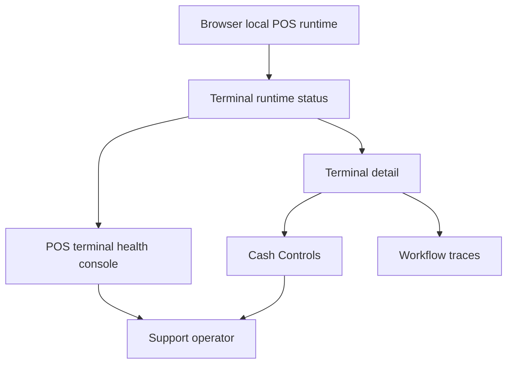

# feat: Add POS terminal health visibility

## Summary

Add a production support layer around the existing local-first POS runtime: terminals will publish safe runtime check-ins to Convex, support users will get a POS terminal operations console and detail drill-in, and cash-controls / register diagnostics will link local browser evidence to cloud sync evidence without changing cashier checkout semantics.

---

## Problem Frame

Athena POS now correctly treats the browser-local event log as the first durable register record, then syncs to Convex for reconciliation. That protects checkout, but it leaves production troubleshooting split across two places: the affected browser knows about pending IndexedDB events, scheduler state, staff authority readiness, and local snapshot age, while the cloud only sees terminal registration records, uploaded sync events, mappings, conflicts, register sessions, and cash-control summaries.

Support needs to answer terminal-scoped production questions without always being on the physical terminal: is this register alive, what is it trying to sync, what is blocked locally, what has reached Convex, and what needs manager review?

---

## Requirements

- R1. Preserve the local-first POS contract from the origin document: cashier success remains tied to local durable events, not cloud upload completion. Covers origin R6, R9, R24, AE3, AE7.
- R2. Publish a redacted, terminal-scoped runtime health signal to Convex so production support can see last-seen, app/runtime, local-store, sync, staff-authority, and snapshot readiness state for each terminal. Covers origin R10, R31, R33.
- R3. Keep sensitive local material out of cloud diagnostics: no PINs, verifier metadata, proof tokens, raw payment payloads, customer details, or full local event payloads.
- R4. Add a POS terminal operations console under the POS workspace that lists all store terminals and their current operational posture.
- R5. Add a terminal detail drill-in that joins the latest check-in with cloud-visible sync cursor, recent sync events, unresolved conflicts, active register session, recent transactions, and workflow trace links.
- R6. Preserve and improve the in-register support diagnostics panel so field support can inspect local-only evidence and copy a redacted diagnostic snapshot when the cloud never received a useful check-in.
- R7. Surface terminal-related sync and conflict evidence in cash-controls/register views without turning pending sync into a manager-review problem unless a conflict actually exists.
- R8. Add validation-map, tests, and documentation coverage for the new terminal visibility surface so future POS local/sync changes keep the support contract honest.

**Origin actors:** A1 Cashier, A2 Store manager, A3 Athena POS terminal, A4 Athena cloud.
**Origin flows:** F1 Provision a POS terminal for offline use, F2 Operate the register while offline, F5 Sync and reconcile local POS history.
**Origin acceptance examples:** AE3, AE7, AE8, AE9, AE10.

---

## Scope Boundaries

- This plan does not change cashier checkout, local event durability, sync ordering, idempotency, inventory reconciliation, payment semantics, or local closeout policy.
- This plan does not make non-POS Athena workspaces offline-first.
- This plan does not add automatic repair or automatic conflict resolution. It exposes evidence for support and manager review.
- This plan does not persist sensitive local authentication material, proof tokens, raw local event payloads, payment details, or customer contact details into terminal health snapshots.
- This plan does not require a terminal to be online before it can keep selling. Check-ins are opportunistic visibility, not an execution gate.
- This plan does not replace cash-controls reconciliation or workflow traces; it links to and summarizes those existing surfaces.

### Deferred to Follow-Up Work

- Fleet-level alerting and Slack/incident routing for stale terminals can follow after the support console establishes the right health signal.
- Export/download of full support bundles can follow after the redacted copy-diagnostics payload proves useful in field support.
- Cross-store or organization-wide terminal fleet dashboards can follow; this plan stays store-scoped.

---

## Context & Research

### Relevant Code and Patterns

- `packages/athena-webapp/convex/schemas/pos/posTerminal.ts` defines terminal registration identity, browser info, register number, status, and sync secret storage.
- `packages/athena-webapp/src/lib/pos/application/registerAndProvisionPosTerminal.ts` writes the provisioned terminal seed into the browser-local POS store after online registration.
- `packages/athena-webapp/src/lib/pos/infrastructure/local/posLocalStore.ts` owns local terminal seed, POS events, cloud mappings, store-day readiness, staff authority, catalog snapshot, and availability snapshot state.
- `packages/athena-webapp/src/lib/pos/infrastructure/local/usePosLocalSyncRuntime.ts` already derives runtime sync status and debug fields from local events, scheduler state, and upload results.
- `packages/athena-webapp/src/components/pos/register/POSRegisterView.tsx` already exposes support sync diagnostics through the register shell.
- `packages/athena-webapp/convex/pos/public/sync.ts`, `packages/athena-webapp/convex/pos/application/sync/ingestLocalEvents.ts`, and `packages/athena-webapp/convex/pos/application/sync/projectLocalEvents.ts` store and project cloud-visible local sync evidence.
- `packages/athena-webapp/convex/schema.ts` already indexes `posLocalSyncEvent`, `posLocalSyncCursor`, `posLocalSyncMapping`, and `posLocalSyncConflict` by store, terminal, register, event, and status.
- `packages/athena-webapp/convex/cashControls/deposits.ts` already maps unresolved `posLocalSyncConflict` records into cash-controls register-session summaries.
- `packages/athena-webapp/src/components/pos/settings/POSSettingsView.tsx` is the existing current-device setup entry point and should remain focused on terminal registration/configuration. It can link to terminal health, but it should not become the production troubleshooting command center.
- `packages/athena-webapp/src/components/pos/PointOfSaleView.tsx` already owns the POS hub tile model for operational destinations such as Active Sessions and Transactions; terminal health fits that hub better than Settings.

### Institutional Learnings

- `docs/solutions/architecture/athena-pos-local-first-sync-2026-05-13.md`: local POS events are the first durable register record; cloud sync is reconciliation.
- `docs/solutions/architecture/athena-pos-always-local-first-register-2026-05-14.md`: cashier commands must append local events before returning success, regardless of online state.
- `docs/solutions/architecture/athena-pos-local-first-runtime-feedback-2026-05-15.md`: diagnostics should mirror the local event log and keep support copy separate from cashier workflow copy.
- `docs/solutions/architecture/athena-pos-hub-owned-local-sync-drain-2026-05-18.md`: terminal-owned sync drain must preserve upload ordering, distinguish local event sequence from upload sequence, and keep actor staff identity separate from terminal submission authority.
- `docs/solutions/architecture/athena-pos-field-evidence-surfaces-2026-05-20.md`: field support evidence should stay attached to completed workflow facts and must not depend only on transient UI state.
- `docs/solutions/architecture/athena-pos-local-staff-authority-2026-05-14.md`: staff authority readiness belongs in POS diagnostics, but proof tokens and verifier material must stay protected.

### External References

- External research skipped. The relevant patterns are repo-specific and already established across POS local sync, terminal provisioning, cash-controls summaries, workflow traces, command-result handling, and Athena validation-map coverage.

---

## Key Technical Decisions

| Decision | Rationale |
|---|---|
| Add a cloud-side terminal runtime status record instead of overloading `posTerminal` | Registration identity changes slowly; runtime health changes often and should be timestamped, replaceable, and safe to expire independently. |
| Use check-ins as visibility only | A missed check-in must not block offline POS. The local event ledger remains the execution source of truth. |
| Store only summaries and safe identifiers | Support needs counts, timestamps, sequences, local ids, cloud ids, and status codes; it does not need raw event payloads, customer/payment details, PIN metadata, proof tokens, or local verifier material. |
| Keep the current browser-local support panel | Cloud visibility helps remote support, but local-only failures still require on-terminal evidence when a check-in cannot reach Convex. |
| Add terminal health as a POS operations/support surface | Troubleshooting terminals is operational visibility, not current-device configuration. Settings should stay focused on registration/setup and link out to the support console. |
| Link to existing reconciliation surfaces | Cash Controls and workflow traces already own business review. Terminal health should summarize and link, not create a second conflict-resolution queue. |
| Add validation-map coverage as part of the feature | Prior POS work has shown that local/sync regressions are easy to miss unless new boundaries are mapped into the harness. |

---

## Open Questions

### Resolved During Planning

- Should terminal check-ins block POS actions when missing or stale? No. Check-ins are opportunistic production visibility only.
- Should the cloud store full local diagnostic payloads? No. Persist summaries; use a redacted copy-diagnostics action for terminal-local evidence.
- Should unresolved POS sync conflicts move into a new terminal review queue? No. Keep manager review in Cash Controls / existing reconciliation surfaces and link to them from terminal health.
- Should current-device setup and fleet troubleshooting use separate routes? Yes. Keep current-device setup in POS Settings, and put fleet troubleshooting under a dedicated POS terminal health route.
- Should the terminal health route live under Operations instead of POS? Keep it under POS for now because the evidence is terminal/register specific and the POS hub already groups register operations. Link from Cash Controls and Operations surfaces where terminal evidence helps.

### Deferred to Implementation

- Exact retention policy for historical check-ins: choose a bounded retention strategy during implementation after reviewing table growth and Convex query needs.
- Exact route shape for terminal detail: choose the simplest TanStack route that fits existing POS route conventions and link generation.
- Whether check-in schema should include build SHA from runtime config: include if an existing app-version source is available; otherwise reserve the field and leave it optional.

---

## High-Level Technical Design

> *This illustrates the intended approach and is directional guidance for review, not implementation specification. The implementing agent should treat it as context, not code to reproduce.*

The important boundary is that `runtime -> checkin -> status` is a telemetry path, while `runtime -> sync` remains the reconciliation path. Terminal health can explain the POS runtime, but it must not become part of cashier command success.

---

## Implementation Units

- U1. **Cloud terminal runtime status foundation**

**Goal:** Add the server-side data model and public Convex boundaries that accept and expose redacted terminal runtime status.

**Requirements:** R2, R3, R5, R8.

**Dependencies:** None.

**Files:**
- Create: `packages/athena-webapp/convex/schemas/pos/posTerminalRuntimeStatus.ts`
- Modify: `packages/athena-webapp/convex/schemas/pos/index.ts`
- Modify: `packages/athena-webapp/convex/schema.ts`
- Modify: `packages/athena-webapp/convex/pos/public/terminals.ts`
- Modify: `packages/athena-webapp/convex/pos/application/queries/terminals.ts`
- Modify: `packages/athena-webapp/convex/pos/infrastructure/repositories/terminalRepository.ts`
- Test: `packages/athena-webapp/convex/pos/public/terminals.test.ts`
- Test: `packages/athena-webapp/convex/pos/application/terminals.test.ts`

**Approach:**
- Introduce a dedicated runtime status table keyed by store and terminal, with indexes for store terminal lookup and stale-terminal scanning.
- Store the latest health snapshot as a replaceable summary plus enough historical fields to reason about freshness: reported time, source, local schema version, local terminal seed status, online state, sync status, pending/uploadable/failed/review counts, oldest pending age, last trigger, last failure category/message, staff authority readiness, catalog and availability snapshot age, app/build metadata when available, and copied browser info when safe.
- Gate check-in writes through the same terminal authority expectations used by POS sync: authenticated account must have store access, terminal must be active, store-scoped, and bound to the submitted terminal identity.
- Redact at the server boundary too. Validators should not accept proof tokens, verifier details, raw event payload arrays, customer details, payment details, or arbitrary nested diagnostic dumps.
- Expose list/detail query helpers that join terminal registration metadata with latest runtime status, recent cloud sync cursor/event/conflict summaries, active register session, and recent transaction counts without forcing the browser UI to fan out through many separate queries.

**Patterns to follow:**
- `packages/athena-webapp/convex/pos/public/terminals.ts` for terminal auth and public return validators.
- `packages/athena-webapp/convex/pos/public/sync.ts` for command-result validators around POS local sync boundaries.
- `packages/athena-webapp/convex/cashControls/deposits.ts` for building support-facing summaries from sync conflicts.

**Test scenarios:**
- Happy path: active terminal with matching store and account submits a minimal runtime status -> latest status is persisted and list/detail queries return it with terminal registration metadata.
- Happy path: a later check-in for the same terminal replaces the latest summary -> list query shows the newer reported timestamp and status counts.
- Edge case: terminal has no check-in -> list query still returns the registered terminal with a clear stale/unknown health posture.
- Error path: check-in for a revoked/lost terminal or wrong store returns a safe authorization/precondition failure and does not write status.
- Error path: check-in payload with unsafe diagnostic fields is rejected by validation.
- Integration: unresolved `posLocalSyncConflict` records for the terminal appear in terminal detail summaries without requiring the register session mapping to exist.

**Verification:**
- Support queries can answer "what does the cloud know about this terminal right now?" from one server boundary.
- Raw local event, payment, customer, PIN, verifier, and proof material cannot be persisted through the runtime status mutation.

---

- U2. **Browser check-in publisher and redacted local diagnostic snapshot**

**Goal:** Have the POS browser runtime publish safe check-ins and provide a redacted local diagnostic snapshot for field support.

**Requirements:** R1, R2, R3, R6, R8.

**Dependencies:** U1.

**Files:**
- Create: `packages/athena-webapp/src/lib/pos/infrastructure/local/terminalRuntimeStatus.ts`
- Modify: `packages/athena-webapp/src/lib/pos/infrastructure/local/usePosLocalSyncRuntime.ts`
- Modify: `packages/athena-webapp/src/lib/pos/infrastructure/local/posLocalStore.ts`
- Modify: `packages/athena-webapp/src/lib/pos/infrastructure/local/localPosReadiness.ts`
- Modify: `packages/athena-webapp/src/lib/pos/infrastructure/convex/catalogGateway.ts`
- Modify: `packages/athena-webapp/src/components/pos/PointOfSaleView.tsx`
- Modify: `packages/athena-webapp/src/lib/pos/presentation/register/useRegisterViewModel.ts`
- Test: `packages/athena-webapp/src/lib/pos/infrastructure/local/terminalRuntimeStatus.test.ts`
- Test: `packages/athena-webapp/src/lib/pos/infrastructure/local/usePosLocalSyncRuntime.test.ts`
- Test: `packages/athena-webapp/src/lib/pos/infrastructure/local/posLocalStore.test.ts`
- Test: `packages/athena-webapp/src/components/pos/PointOfSaleView.test.tsx`
- Test: `packages/athena-webapp/src/lib/pos/presentation/register/useRegisterViewModel.test.ts`

**Approach:**
- Centralize runtime status construction so the register and POS hub use one redaction and summarization path.
- Source status from the existing local event summary, scheduler debug state, provisioned terminal seed, local staff authority readiness, local store schema version, store-day readiness, catalog snapshot, availability snapshot, and browser connectivity signal.
- Publish check-ins opportunistically on route entry, register entry, event append, sync completion/failure, online restore, visibility restore, and a bounded foreground interval.
- Keep check-ins best-effort. Failed check-in upload should update local diagnostics but must not block register use, sync upload, staff sign-in, sale completion, or closeout.
- Add a redacted copy-diagnostics payload behind the support diagnostics panel. It should include local identifiers, counts, timestamps, sequence numbers, status labels, and failure messages, but no raw event payloads or sensitive credentials.

**Patterns to follow:**
- `packages/athena-webapp/src/lib/pos/infrastructure/local/usePosLocalSyncRuntime.ts` for runtime status and scheduler debug ownership.
- `packages/athena-webapp/src/lib/pos/infrastructure/local/syncStatus.ts` for derived local sync summary.
- `packages/athena-webapp/src/components/pos/register/POSRegisterView.tsx` for support diagnostics presentation.

**Test scenarios:**
- Happy path: POS hub enters with a provisioned terminal seed and pending events -> runtime sends a check-in with pending/uploadable counts and does not require a cashier to be signed in.
- Happy path: sync marks events synced -> next check-in reports synced/zero pending counts and latest synced sequence.
- Edge case: local store has unsupported schema -> check-in reports local store unavailable without reading or uploading event payloads.
- Edge case: staff authority snapshot is missing or expired -> check-in reports staff authority readiness without exposing usernames, verifiers, or wrapped proofs.
- Error path: check-in mutation rejects or network fails -> POS runtime keeps operating and diagnostics show the check-in failure as support evidence.
- Integration: event append triggers a high-priority sync drain and check-in signal without making Convex upload part of cashier command success.
- Security: copied diagnostics payload does not contain `staffProofToken`, verifier metadata, payment arrays, customer details, or raw local event payloads.

**Verification:**
- A support user can ask an operator for a local diagnostic payload when cloud check-ins are stale.
- Runtime health publication remains non-blocking and redacted by construction.

---

- U3. **POS terminal health operations console**

**Goal:** Add a store-scoped POS terminal health console while keeping POS Settings focused on current-device setup.

**Requirements:** R4, R7, R8.

**Dependencies:** U1, U2.

**Files:**
- Create: `packages/athena-webapp/src/routes/_authed/$orgUrlSlug/store/$storeUrlSlug/pos/terminals.index.tsx`
- Create: `packages/athena-webapp/src/components/pos/terminals/POSTerminalHealthView.tsx`
- Create: `packages/athena-webapp/src/components/pos/terminals/POSTerminalHealthTable.tsx`
- Create: `packages/athena-webapp/src/components/pos/terminals/terminalHealthPresentation.ts`
- Modify: `packages/athena-webapp/src/components/pos/PointOfSaleView.tsx`
- Modify: `packages/athena-webapp/src/components/pos/settings/POSSettingsView.tsx`
- Test: `packages/athena-webapp/src/components/pos/terminals/POSTerminalHealthView.test.tsx`
- Test: `packages/athena-webapp/src/components/pos/terminals/terminalHealthPresentation.test.ts`
- Test: `packages/athena-webapp/src/components/pos/PointOfSaleView.test.tsx`
- Test: `packages/athena-webapp/src/components/pos/settings/POSSettingsView.test.tsx`

**Approach:**
- Keep POS Settings as the "this device" setup area.
- Add a dedicated POS hub destination for Terminal Health. The hub tile should sit beside Active Sessions and Transactions for admin/support users.
- Add a terminal roster in the new console, using compact operational rows: terminal/register label, status, last seen, sync posture, pending count, unresolved review count, staff authority readiness, catalog/availability snapshot age, active drawer/register session, and actions.
- Use clear operational labels rather than backend raw terms. Distinguish "Pending sync" from "Needs review", "Stale" from "Lost/revoked", and "Unknown" from "No check-in yet".
- Link each row to the terminal detail route from U4. Keep device setup/editing actions in POS Settings unless they are already safe list-level admin actions.
- Add a small link from POS Settings to Terminal Health for users who arrive from setup and need fleet troubleshooting, but do not embed the full health roster inside Settings.
- Treat stale check-in thresholds as presentation-level constants first, not cashier-blocking policy.

**Patterns to follow:**
- `packages/athena-webapp/src/components/pos/PointOfSaleView.tsx` for POS hub destinations.
- `packages/athena-webapp/src/components/cash-controls/CashControlsDashboard.tsx` for compact operational cards and sync badges.
- `packages/athena-webapp/src/lib/pos/presentation/syncStatusPresentation.ts` for pending/review/synced copy normalization.
- `docs/product-copy-tone.md` for restrained operator-facing language.

**Test scenarios:**
- Happy path: registered terminals with fresh check-ins render last seen, sync status, pending count, staff authority readiness, and snapshot age.
- Happy path: POS hub exposes Terminal Health for admin/support users alongside Active Sessions and Transactions.
- Happy path: current browser terminal still supports register/update setup in POS Settings without being blocked by the roster.
- Edge case: terminal without runtime status shows "No check-in yet" or equivalent setup-safe copy.
- Edge case: stale terminal check-in renders stale posture without marking the terminal lost/revoked automatically.
- Error path: terminal list query unavailable renders a durable inline error region in Terminal Health rather than raw thrown text.
- Integration: marking a terminal lost/revoked updates the roster status and does not expose the terminal sync secret.

**Verification:**
- A support/admin user can open Terminal Health from the POS hub and identify which terminal is stale, pending, or needs review without opening the register or Settings.

---

- U4. **Terminal detail drill-in with cloud sync evidence**

**Goal:** Add a terminal detail view that correlates latest check-in data with cloud-visible sync and business records.

**Requirements:** R5, R7, R8.

**Dependencies:** U1, U2.

**Files:**
- Create: `packages/athena-webapp/src/routes/_authed/$orgUrlSlug/store/$storeUrlSlug/pos/terminals/$terminalId.tsx`
- Create: `packages/athena-webapp/src/components/pos/terminals/POSTerminalDetailView.tsx`
- Create: `packages/athena-webapp/src/components/pos/terminals/TerminalSyncTimeline.tsx`
- Modify: `packages/athena-webapp/convex/pos/public/terminals.ts`
- Modify: `packages/athena-webapp/convex/pos/application/queries/terminals.ts`
- Modify: `packages/athena-webapp/convex/pos/infrastructure/repositories/terminalRepository.ts`
- Test: `packages/athena-webapp/src/components/pos/terminals/POSTerminalDetailView.test.tsx`
- Test: `packages/athena-webapp/convex/pos/public/terminals.test.ts`

**Approach:**
- Build a single terminal detail query that returns latest runtime status, terminal registration metadata, active/closing register session summary, latest sync cursor per local register session, recent sync event summaries, unresolved sync conflicts, recent local-to-cloud mappings, recent transactions, and workflow trace references.
- Keep detail sections compact: identity, health, sync timeline, conflicts/review, active drawer/session, recent transactions, and support notes.
- Link to Cash Controls register sessions, transaction detail, and workflow trace detail when cloud ids exist.
- Show "local-only / not yet in cloud" evidence when the latest check-in reports pending local ids or sequences that do not yet have corresponding cloud sync events.
- Avoid claiming that missing cloud data means no local activity exists. The detail should explicitly distinguish "not reported by terminal", "reported locally but not uploaded", and "uploaded and accepted/projected/conflicted".

**Patterns to follow:**
- `packages/athena-webapp/src/components/traces/WorkflowTraceView.tsx` for trace linking and status presentation.
- `packages/athena-webapp/src/components/pos/transactions/TransactionView.tsx` for transaction detail linking conventions.
- `packages/athena-webapp/convex/pos/infrastructure/repositories/localSyncRepository.ts` for sync event/mapping/conflict lookups.

**Test scenarios:**
- Happy path: terminal with latest check-in, accepted sync events, mappings, active register session, and transactions renders linked evidence in each section.
- Happy path: terminal with unresolved conflicts renders review summaries and links to the related register/cash-control surfaces when mappings exist.
- Edge case: check-in reports pending local upload sequence that has no cloud event yet -> detail renders "reported locally, not uploaded" posture.
- Edge case: cloud has sync events but latest check-in is stale -> detail keeps cloud evidence visible and marks local runtime freshness separately.
- Error path: non-admin or wrong-store access cannot read terminal detail.
- Integration: route params with a valid terminal id load the detail from the POS Terminal Health console without breaking current settings route behavior.

**Verification:**
- Support can move from a terminal row to a complete evidence page and distinguish local-only, uploaded, projected, conflicted, and stale states.

---

- U5. **Cash-controls and register evidence links**

**Goal:** Connect terminal health to existing operator surfaces without creating a second review workflow.

**Requirements:** R1, R5, R7.

**Dependencies:** U4.

**Files:**
- Modify: `packages/athena-webapp/convex/cashControls/deposits.ts`
- Modify: `packages/athena-webapp/src/components/cash-controls/CashControlsDashboard.tsx`
- Modify: `packages/athena-webapp/src/components/cash-controls/RegisterSessionView.tsx`
- Modify: `packages/athena-webapp/src/components/pos/register/POSRegisterView.tsx`
- Modify: `packages/athena-webapp/src/lib/pos/presentation/syncStatusPresentation.ts`
- Test: `packages/athena-webapp/src/components/cash-controls/CashControlsDashboard.test.tsx`
- Test: `packages/athena-webapp/src/components/cash-controls/RegisterSessionView.test.tsx`
- Test: `packages/athena-webapp/src/components/pos/register/POSRegisterView.test.tsx`
- Test: `packages/athena-webapp/src/lib/pos/presentation/syncStatusPresentation.test.ts`

**Approach:**
- Extend cash-controls register summaries with terminal runtime freshness and terminal detail links when the register session has a terminal id.
- Keep existing conflict mapping as the source of "Needs review". Pending sync and stale terminal status should be visible but should not inflate variance/review counts unless a real conflict exists.
- In register diagnostics, add cloud check-in status and the redacted copy-diagnostics action from U2 while keeping the support panel available during staff auth, local closeout, and sync gates.
- Normalize copy so cashiers see concise operational state and support sees diagnostic detail only in support surfaces.

**Patterns to follow:**
- `packages/athena-webapp/src/lib/pos/presentation/syncStatusPresentation.ts` for sync/review status normalization.
- `packages/athena-webapp/src/components/cash-controls/CashControlsDashboard.tsx` for register card badges.
- `packages/athena-webapp/src/components/pos/register/POSRegisterView.tsx` for support-only diagnostics.

**Test scenarios:**
- Happy path: cash-controls card for a register session with fresh terminal health shows a terminal link and non-intrusive sync posture.
- Happy path: unresolved sync conflict still renders "Needs review" and reconciliation item copy.
- Edge case: stale terminal with no conflict shows stale/pending evidence but does not enter the unresolved variance/review list only because of staleness.
- Edge case: register diagnostics panel opens while locally closed or staff-auth blocked and still shows local/cloud check-in evidence.
- Error path: copy-diagnostics unavailable falls back to visible support information without throwing.
- Integration: terminal detail links from cash-controls and register surfaces preserve store/org route params.

**Verification:**
- Cash Controls remains the manager review surface, while terminal health makes support context reachable from the register/session records operators already inspect.

---

- U6. **Validation coverage, harness map, and documentation**

**Goal:** Keep terminal visibility covered by repo validation and preserve the architectural learning for future POS local/sync work.

**Requirements:** R8.

**Dependencies:** U1, U2, U3, U4, U5.

**Files:**
- Modify: `scripts/harness-app-registry.ts`
- Modify: `packages/athena-webapp/docs/agent/testing.md`
- Modify: `packages/athena-webapp/docs/agent/validation-map.json` *(generated from registry)*
- Create: `docs/solutions/architecture/athena-pos-terminal-health-visibility-2026-05-20.md`
- Test: `scripts/harness-app-registry.test.ts`
- Test: `scripts/validate-plan-html.test.ts` *(only if plan HTML validation behavior needs adjustment during this planning/documentation work)*

**Approach:**
- Add or tighten validation-map coverage for new terminal runtime status schema, terminal public queries/mutations, browser check-in publisher, POS terminal health console, terminal detail route, cash-controls links, and register diagnostics.
- Document the support visibility contract: check-ins are telemetry, local events remain cashier authority, sensitive local auth/payment/customer material is not persisted, and cash-controls remains the business review queue.
- Include the focused validation slices in testing docs so implementers do not stop at isolated unit tests.
- Regenerate generated harness docs from the registry rather than editing generated artifacts directly.

**Patterns to follow:**
- Existing POS local sync coverage entries in `packages/athena-webapp/docs/agent/testing.md`.
- `docs/solutions/architecture/athena-pos-hub-owned-local-sync-drain-2026-05-18.md` prevention section for validation-map discipline.

**Test scenarios:**
- Happy path: harness registry maps the new terminal health files to POS local sync/register validation and UI validation slices.
- Edge case: generated validation map includes new terminal health files without dropping existing POS local/sync entries.
- Integration: package-focused tests plus `harness:review` select the expected validations when terminal health files are touched.
- Documentation: solution note states the visibility/execution boundary clearly enough that a future POS sync change does not treat check-ins as command authority.

**Verification:**
- Future changed-file validation catches server, browser, UI, and cash-controls regressions in terminal troubleshooting behavior.

---

## System-Wide Impact

- **Interaction graph:** POS hub/register runtime publishes non-blocking health; the POS Terminal Health console consumes store terminal health; terminal detail joins runtime status with sync events, conflicts, mappings, register sessions, transactions, and trace links; POS Settings links to health but remains current-device setup; cash-controls surfaces terminal context without owning terminal diagnostics.
- **Error propagation:** Check-in failures stay support-visible and do not escape as cashier workflow failures. Server authorization/precondition failures return command-result style safe copy.
- **State lifecycle risks:** Check-ins are latest-status telemetry and may be stale; local events remain authoritative for cashier work until uploaded. Retention and overwrite behavior must prevent unbounded growth.
- **API surface parity:** Terminal list/detail query surfaces must avoid leaking `syncSecretHash` just like existing terminal public queries.
- **Integration coverage:** Unit tests must be paired with server query/mutation tests and UI tests because the value is in cross-layer correlation.
- **Unchanged invariants:** POS commands remain local-first; sync ordering remains per local register session; staff proof tokens remain event-scoped sync evidence and must not be persisted in runtime status; cash-controls remains the manager review surface.

---

## Risks & Dependencies

| Risk | Mitigation |
|---|---|
| Check-ins accidentally become an execution dependency | Keep check-in calls best-effort, never branch cashier commands on check-in success, and test failed check-ins during normal register operation. |
| Sensitive local data leaks into cloud diagnostics | Define strict validators, central redaction helper, and tests that reject or omit proof tokens, verifier metadata, raw event payloads, payment data, and customer details. |
| Support misreads stale cloud data as proof that no local activity exists | UI copy must distinguish "not reported", "reported locally", "uploaded", "projected", and "conflicted". |
| Terminal console becomes a second reconciliation queue | Link to Cash Controls and workflow traces; keep conflict resolution ownership unchanged. |
| Runtime status table grows without bound | Store latest status separately or use bounded history retention; defer exact retention mechanics to implementation. |
| Validation-map coverage misses new surfaces | U6 explicitly updates registry metadata and generated docs as part of the feature. |

---

## Documentation / Operational Notes

- Update the POS solution docs to state the support visibility boundary: terminal health is telemetry, not POS command authority.
- Add support-facing language for stale terminal, pending sync, needs review, missing staff authority, missing catalog snapshot, and unsupported local store states.
- Include a short runbook-style note in the terminal detail view or documentation: when cloud status is stale, ask the operator to open support diagnostics and copy the redacted local payload.
- After code implementation, run graphify rebuild because code files will change.

---

## Success Metrics

- Support/admin can identify stale, pending, syncing, synced, and needs-review terminals from the POS Terminal Health console without opening the register.
- A terminal detail view can answer whether evidence is local-only, uploaded, projected, conflicted, or stale.
- Failed/stale check-ins do not block checkout or sync.
- No check-in or copied diagnostic payload contains proof tokens, verifier material, raw payment/customer data, or raw local event payloads.
- Cash Controls continues to separate pending sync from true manager-review conflicts.

---

## Sources & References

- **Origin document:** `docs/brainstorms/2026-05-13-pos-local-first-register-requirements.md`
- Related code: `packages/athena-webapp/convex/schemas/pos/posTerminal.ts`
- Related code: `packages/athena-webapp/src/lib/pos/infrastructure/local/posLocalStore.ts`
- Related code: `packages/athena-webapp/src/lib/pos/infrastructure/local/usePosLocalSyncRuntime.ts`
- Related code: `packages/athena-webapp/src/components/pos/register/POSRegisterView.tsx`
- Related code: `packages/athena-webapp/src/components/pos/settings/POSSettingsView.tsx`
- Related code: `packages/athena-webapp/convex/pos/public/sync.ts`
- Related code: `packages/athena-webapp/convex/pos/application/sync/ingestLocalEvents.ts`
- Related code: `packages/athena-webapp/convex/pos/application/sync/projectLocalEvents.ts`
- Related code: `packages/athena-webapp/convex/cashControls/deposits.ts`
- Institutional learning: `docs/solutions/architecture/athena-pos-local-first-sync-2026-05-13.md`
- Institutional learning: `docs/solutions/architecture/athena-pos-local-first-runtime-feedback-2026-05-15.md`
- Institutional learning: `docs/solutions/architecture/athena-pos-hub-owned-local-sync-drain-2026-05-18.md`
- Institutional learning: `docs/solutions/architecture/athena-pos-field-evidence-surfaces-2026-05-20.md`
