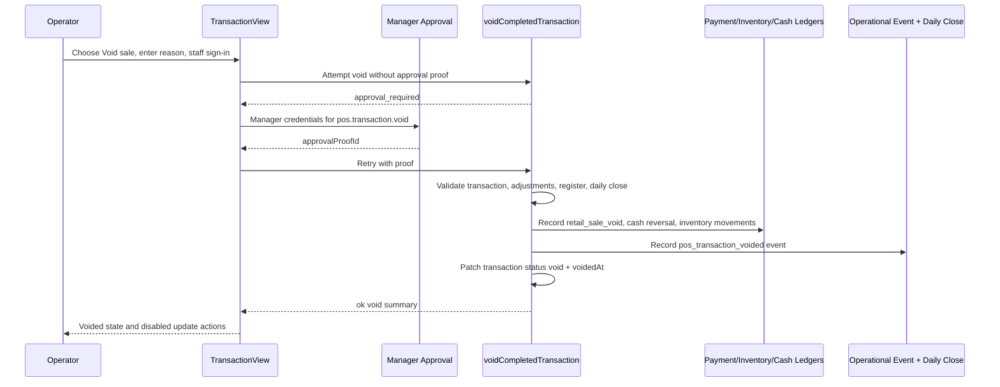

# feat: Add Completed Transaction Void Workflow

## Summary

Add a manager-approved workflow for voiding completed POS transactions from the transaction detail screen. The implementation should replace the current legacy direct void path with an audited reversal command that preserves the original sale, records the void through payment allocation, inventory movement, operational event, and daily-close review rails, and blocks unsafe mutation of completed operating days.

---

## Problem Frame

Athena already has a `voidTransaction` backend command, but it is not ready to expose to operators: it returns a legacy `{ success, error }` shape, skips the command approval rail, patches SKU quantities without inventory movement evidence, and does not record the void as an operational event. A completed sale void is a financial and inventory reversal, so it must follow the same command-boundary rigor as payment corrections and item adjustments.

---

## Requirements

- R1. Operators can void a completed POS transaction from transaction detail only after staff sign-in, a reason, and manager approval.
- R2. The original completed sale remains auditable; the void is represented as an explicit reversal rather than an invisible edit.
- R3. Voiding reverses payment reporting through `paymentAllocation` and cash drawer state through the existing register-session cash-control bridge.
- R4. Voiding restores inventory through committed `inventoryMovement` and SKU activity evidence, not direct SKU field mutation alone.
- R5. The command blocks unsafe states: missing transaction, already void/refunded transaction, pending/applied item adjustments, missing register identity, closed daily close, or cash drawer state that cannot accept a cash reversal.
- R6. Transaction detail, transaction history, daily operations, and daily close surfaces show voided status and review context with calm operator-facing copy.
- R7. Tests cover command results, approval proof handling, inventory/payment reversal, daily-close boundary behavior, and transaction-detail UI behavior.

---

## Scope Boundaries

- This plan does not implement partial refunds, exchanges, or post-close refund workflows. It handles full void of a completed POS transaction when the operating day/register state can safely accept the reversal.
- This plan does not integrate an external payment gateway refund API. Athena's current in-store POS payment model records operational payment allocations; gateway refunds remain future work if card/MoMo providers become first-class external integrations.
- This plan does not change original sale totals, original item rows, cashier attribution, transaction number generation, or receipt history. The original fact stays intact.
- This plan does not broaden staff permissions outside the existing manager approval model.

### Deferred to Follow-Up Work

- Partial return/refund workflow: separate plan covering item-level return quantities, refund destinations, and exchange/balance-due states.
- Post-daily-close refund workflow: separate plan for recording today-side refund movements against historical sales without mutating completed operating-day reports.
- Customer receipt/messaging updates for voided sales: separate UI/content pass if receipts need customer-facing void/refund communication.

---

## Context & Research

### Relevant Code and Patterns

- `packages/athena-webapp/convex/pos/application/commands/completeTransaction.ts` contains the legacy `voidTransaction` command and the existing `recordRegisterSessionVoid` bridge.
- `packages/athena-webapp/convex/pos/public/transactions.ts` exposes the legacy void mutation and the newer command-result patterns for customer, payment, and item correction commands.
- `packages/athena-webapp/convex/pos/application/commands/correctTransaction.ts` shows the manager-approval pattern for completed transaction payment-method correction.
- `packages/athena-webapp/convex/pos/application/commands/adjustTransactionItems.ts` shows approved completed-sale item adjustments, inventory movement creation, settlement payment allocation, and register-session cash validation.
- `packages/athena-webapp/convex/pos/infrastructure/integrations/paymentAllocationService.ts` already has `recordRetailVoidPaymentAllocations` using `allocationType: "retail_sale_void"`.
- `packages/athena-webapp/convex/operations/inventoryMovements.ts` provides idempotent source-scoped inventory movement recording and SKU activity linkage.
- `packages/athena-webapp/convex/operations/dailyClose.ts` already queries `status: "void"` POS transactions and turns them into `voided_sale` review items.
- `packages/athena-webapp/src/components/pos/transactions/TransactionView.tsx` already owns completed-transaction update workflows and uses `useApprovedCommand` for payment and item approvals.
- `packages/athena-webapp/docs/agent/architecture.md` requires command-result failures, domain-owned approval policy, server-enforced proof consumption, and safe operator-facing copy.
- `packages/athena-webapp/docs/agent/testing.md` defines the focused validation slices for command approval, completed transaction adjustment, POS/register/cash-control changes, and Convex changes.

### Institutional Learnings

- `docs/solutions/logic-errors/athena-pos-ledger-safe-corrections-2026-04-30.md`: completed transaction corrections must preserve original operational facts, record operational events, and avoid direct edits that hide the recovery action.
- `docs/solutions/logic-errors/athena-pos-register-review-and-adjusted-sale-projection-2026-05-21.md`: transaction detail and cash controls must project review/adjustment state explicitly instead of only storing events.
- `docs/solutions/logic-errors/athena-sku-activity-traceability-2026-05-13.md`: every SKU-affecting mutation needs source-aware inventory movement and SKU activity evidence.
- `docs/solutions/logic-errors/athena-pos-drawer-invariants-at-command-boundaries-2026-04-24.md`: UI gates are not enough; register/drawer invariants belong at command boundaries.

### External References

- [Shopify POS returns and refunds](https://help.shopify.com/en/manual/sell-in-person/shopify-pos/order-management/complete-refund-orders?locale=en): POS refund flows require permissions, reasons, payment-method limits, and explicit restock handling.
- [Stripe refund and cancel payments](https://docs.stripe.com/refunds?dashboard-or-api=api&locale=en-GB): completed payments are refunded after success, cancellation applies before completion/capture, refund totals are capped by the original payment, and refund state should be traceable.

---

## Key Technical Decisions

- Replace the exposed void path with a command-result workflow: this aligns voiding with existing correction commands and prevents raw backend errors from reaching the transaction detail UI.
- Require manager approval for completed-sale voids: a void reverses payment, inventory, and reporting state, so it belongs behind `approval_required` with an action/store/subject/role-bound proof.
- Preserve the original sale and record reversal facts: set the transaction to `status: "void"` only after payment allocations, inventory movements, register-session cash effects, approval evidence, and operational event recording succeed.
- Use existing ledgers instead of new void-specific tables: `paymentAllocation`, `inventoryMovement`, `skuActivity`, `operationalEvent`, and daily close review items already provide the audit surfaces this workflow needs.
- Block voids for transactions with item adjustments in the first implementation: applied or pending adjustments introduce an effective-sale projection that a simple full-sale void could reverse incorrectly.
- Block voids when the sale's store operating day is already completed: use the same store/day range semantics as daily operations and EOD Review rather than deriving the day from a naive calendar date. Reopening EOD is the existing workflow for revising a completed operating day; a future refund workflow can model same-day refund activity against historical sales without mutating closed reports.
- Keep UI entry inside `TransactionView`'s update surface: operators are already trained to correct completed transaction metadata and item adjustments there, and the page has staff sign-in and manager approval plumbing.

---

## Open Questions

### Resolved During Planning

- Should this be a direct transaction edit or audited reversal? Audited reversal, because completed sales are financial and inventory facts that must remain inspectable.
- Should the first version support historical post-close refunds? No. This plan blocks completed daily-close mutation and defers historical refund handling to a separate workflow.
- Should inventory restoration reuse item-adjustment logic? Reuse the ledger pattern and source-scoped movement helpers, but keep a distinct void source and reason code so SKU timelines can distinguish voids from item corrections.

### Deferred to Implementation

- Exact helper placement inside `completeTransaction.ts` versus a new `voidCompletedTransaction.ts` file: choose during implementation based on whether the file becomes too large, but keep the public mutation thin either way.
- Exact transaction query shape for detecting a completed daily close from `completedAt`: implementation should reuse `dailyClose` operating-day range helpers where possible, but may need a small internal query/helper if existing functions are not exported cleanly.
- Exact UI copy after visual fitting: product-copy tone is fixed, but final button/dialog text should be tuned in the browser.

---

## High-Level Technical Design

> *This illustrates the intended approach and is directional guidance for review, not implementation specification. The implementing agent should treat it as context, not code to reproduce.*

---

## Implementation Units

- U1. **Define the Completed-Sale Void Command Contract**

**Goal:** Introduce the command-result and manager-approval contract for voiding completed POS transactions, replacing the legacy public void mutation shape.

**Requirements:** R1, R2, R5, R7

**Dependencies:** None

**Files:**
- Modify: `packages/athena-webapp/convex/operations/approvalActions.ts`
- Modify: `packages/athena-webapp/convex/pos/public/transactions.ts`
- Modify: `packages/athena-webapp/convex/pos/application/commands/completeTransaction.ts`
- Test: `packages/athena-webapp/convex/pos/public/transactions.test.ts`
- Test: `packages/athena-webapp/convex/pos/application/completeTransaction.test.ts`
- Test: `packages/athena-webapp/convex/operations/staffCredentials.test.ts`

**Approach:**
- Add an approval action for completed transaction voids with subject type `pos_transaction` and required role `manager`.
- Change the public void mutation to return `commandResultValidator(...)` with `ok`, `user_error`, and `approval_required` behavior, mirroring payment-method correction and item adjustment.
- Require `actorStaffProfileId`, a non-empty reason, and an approval proof before mutation effects are applied.
- Keep compatibility exports from `convex/inventory/pos.ts`, but route callers to the new command contract.
- Map expected domain failures to `user_error` codes; reserve thrown errors for unexpected faults.

**Execution note:** Implement command behavior test-first because this replaces a legacy financial mutation contract.

**Patterns to follow:**
- `packages/athena-webapp/convex/pos/application/commands/correctTransaction.ts`
- `packages/athena-webapp/convex/pos/application/commands/adjustTransactionItems.ts`
- `packages/athena-webapp/convex/lib/commandResultValidators.ts`

**Test scenarios:**
- Happy path: first command attempt for a completed transaction with reason and staff identity returns `approval_required` and does not patch transaction, inventory, register, or payment allocation state.
- Happy path: retry with matching approval proof succeeds and returns transaction id, transaction number, voidedAt, payment allocation ids, inventory movement ids, and operational event id.
- Error path: missing staff identity returns `authentication_failed`.
- Error path: blank reason returns `validation_failed`.
- Error path: missing transaction returns `not_found`.
- Error path: transaction status other than `completed` returns `validation_failed` or `conflict` without side effects.
- Error path: mismatched, expired, or consumed approval proof fails safely and leaves transaction unchanged.
- Integration: public mutation validator accepts the void success payload and approval-required payload without browser-unsafe fields.

**Verification:**
- The public void mutation follows the same browser-safe command-result contract as existing completed-transaction correction mutations.

---

- U2. **Apply Audited Payment, Cash, and Inventory Reversal**

**Goal:** Make a successful void write all ledger evidence in one command boundary before marking the transaction void.

**Requirements:** R2, R3, R4, R5, R7

**Dependencies:** U1

**Files:**
- Modify: `packages/athena-webapp/convex/pos/application/commands/completeTransaction.ts`
- Modify: `packages/athena-webapp/convex/pos/infrastructure/integrations/paymentAllocationService.ts`
- Modify: `packages/athena-webapp/convex/pos/infrastructure/repositories/transactionRepository.ts`
- Test: `packages/athena-webapp/convex/pos/application/completeTransaction.test.ts`
- Test: `packages/athena-webapp/convex/operations/paymentAllocations.test.ts`
- Test: `packages/athena-webapp/convex/operations/inventoryMovements.test.ts`

**Approach:**
- Reuse `recordRetailVoidPaymentAllocations` for outbound payment ledger rows, but return inserted/allocation ids so the void command can include them in the result and operational event.
- Reuse `recordRegisterSessionVoid` for cash drawer reversal when the transaction has a register session, while enforcing terminal/register identity.
- Replace direct SKU quantity restoration with an inventory movement per transaction item using a void-specific movement type and reason code.
- Patch `productSku.inventoryCount` and `productSku.quantityAvailable` in the same command boundary as the inventory movement, following the item-adjustment restock pattern.
- Perform all validation before writes, then make the reversal idempotent enough that a retry after a partial client failure does not duplicate ledger rows if the transaction is already voided. If existing register-session helpers execute as a separate internal mutation, keep the implementation explicit about ordering, retry behavior, and whether the helper should be moved behind a command-owned shared function.

**Execution note:** Characterize current void side effects before replacing direct SKU restoration, then update expectations to the new ledger-backed behavior.

**Patterns to follow:**
- `packages/athena-webapp/convex/pos/application/commands/adjustTransactionItems.ts`
- `packages/athena-webapp/convex/operations/inventoryMovements.ts`
- `packages/athena-webapp/convex/pos/infrastructure/integrations/paymentAllocationService.ts`

**Test scenarios:**
- Happy path: cash transaction void records `retail_sale_void` payment allocations with `direction: "out"` and the original transaction as target.
- Happy path: cash transaction tied to an open/active register reduces expected cash by the original cash delta and updates variance when counted cash exists.
- Happy path: non-cash transaction records outbound payment allocation but does not change expected cash.
- Happy path: each transaction item restores SKU count and available quantity and records an inventory movement linked to the transaction and register session.
- Edge case: cash overpayment with `changeGiven` reverses only the net cash drawer effect.
- Error path: transaction with `registerSessionId` and no terminal id returns a safe user error before any ledger writes.
- Error path: SKU missing or belonging to another store fails before patching transaction status.
- Integration: SKU activity timeline can attribute the stock restoration to a committed inventory movement source.

**Verification:**
- A successful void has payment, cash, inventory, and SKU activity evidence; the transaction is not marked void without those reversal records.

---

- U3. **Enforce Daily Close and Adjustment Boundaries**

**Goal:** Prevent voids from corrupting adjusted sales or completed operating-day reports.

**Requirements:** R2, R5, R6, R7

**Dependencies:** U1, U2

**Files:**
- Modify: `packages/athena-webapp/convex/pos/application/commands/completeTransaction.ts`
- Modify: `packages/athena-webapp/convex/operations/dailyClose.ts`
- Modify: `packages/athena-webapp/convex/pos/infrastructure/repositories/transactionRepository.ts`
- Test: `packages/athena-webapp/convex/pos/application/completeTransaction.test.ts`
- Test: `packages/athena-webapp/convex/operations/dailyClose.test.ts`
- Test: `packages/athena-webapp/convex/operations/dailyOperations.test.ts`

**Approach:**
- Detect pending or applied `posTransactionAdjustment` records for the transaction and block void with guidance to resolve adjustment state first.
- Detect whether the transaction's `completedAt` falls inside a completed daily close snapshot for the store using the repo's operating-day range semantics, then block direct void with guidance to reopen EOD Review or use a future refund workflow.
- Preserve existing daily close behavior that lists `status: "void"` transactions as `voided_sale` review items for the open/current day.
- Keep original sales totals semantics intact: completed sales exclude voided transactions, while voided sales appear as review evidence.

**Patterns to follow:**
- `packages/athena-webapp/convex/operations/dailyClose.ts`
- `packages/athena-webapp/convex/pos/infrastructure/repositories/transactionRepository.ts`
- `docs/solutions/logic-errors/athena-pos-register-review-and-adjusted-sale-projection-2026-05-21.md`

**Test scenarios:**
- Happy path: transaction from the current uncompleted operating day can be voided and appears in daily close review as `voided_sale`.
- Error path: transaction in a completed daily close returns a safe user error before payment/inventory/register mutations.
- Edge case: transaction completed near a calendar-day boundary is classified by the store operating-day range, not by naive local/UTC date slicing.
- Error path: transaction with pending item adjustment approval cannot be voided.
- Error path: transaction with applied item adjustment cannot be voided in this first version.
- Integration: daily close summary excludes voided transactions from completed sales totals while preserving void review metadata.
- Integration: daily operations view data remains consistent for completed, adjusted, and voided transaction categories.

**Verification:**
- Voids cannot rewrite closed operating-day facts or adjusted-sale projections, and current-day voids remain manager-reviewable in EOD Review.

---

- U4. **Record Operational History and Transaction Read Model State**

**Goal:** Make void state visible and auditable in transaction detail, correction history, and downstream review surfaces.

**Requirements:** R2, R5, R6, R7

**Dependencies:** U1, U2, U3

**Files:**
- Modify: `packages/athena-webapp/convex/pos/application/commands/completeTransaction.ts`
- Modify: `packages/athena-webapp/convex/pos/application/queries/getTransactions.ts`
- Modify: `packages/athena-webapp/convex/schemas/pos/posTransaction.ts`
- Test: `packages/athena-webapp/convex/pos/application/getTransactions.test.ts`
- Test: `packages/athena-webapp/convex/pos/application/completeTransaction.test.ts`

**Approach:**
- Record an operational event such as completed-sale voided, linked to the original transaction subject, actor staff, approver staff, reason, payment allocation ids, inventory movement ids, and register session.
- Add or normalize read-model fields needed by UI: `voidedAt`, `voidReason` or safe reuse of notes, `voidedByStaffProfileId` if schema support is warranted, `voidApprovalRequestId`, and `voidOperationalEventId`.
- Ensure correction/update history includes void events in the same timeline area as existing transaction updates.
- Prefer explicit void metadata over overloading free-form notes when the schema change is small and improves reporting clarity.

**Patterns to follow:**
- `packages/athena-webapp/convex/operations/operationalEvents.ts`
- `packages/athena-webapp/convex/pos/application/commands/correctTransaction.ts`
- `packages/athena-webapp/convex/pos/application/queries/getTransactions.ts`

**Test scenarios:**
- Happy path: successful void records one operational event with transaction subject, actor, approver, reason, and ledger ids.
- Happy path: transaction detail query returns void status, void metadata, and void event in history.
- Edge case: legacy voided transactions with only `notes` and `voidedAt` still render without crashing.
- Error path: void event is not created when approval proof fails or validation blocks the command.
- Integration: transaction list/detail read models distinguish completed and voided transactions without recalculating original sale facts.

**Verification:**
- Operators and reviewers can inspect who voided the sale, who approved it, why it was voided, and which ledger records were created.

---

- U5. **Expose the Void Workflow in Transaction Detail**

**Goal:** Add a usable, safe UI for completed-sale voids on the transaction detail screen.

**Requirements:** R1, R5, R6, R7

**Dependencies:** U1, U3, U4

**Files:**
- Modify: `packages/athena-webapp/src/components/pos/transactions/TransactionView.tsx`
- Modify: `packages/athena-webapp/src/components/pos/transactions/TransactionView.test.tsx`
- Modify: `packages/athena-webapp/src/lib/errors/presentCommandToast.test.ts`
- Test: `packages/athena-webapp/src/components/pos/transactions/TransactionView.test.tsx`

**Approach:**
- Add a destructive "Void sale" option inside the existing transaction update panel for `status: "completed"` transactions.
- Require a reason before staff authentication and manager approval.
- Reuse `useApprovedCommand` and staff credential authentication flows already present in `TransactionView`.
- Render durable inline errors for validation failures such as completed EOD, adjusted sale, already voided, or missing register state.
- After success, close the update panel, show void status in the transaction header/summary, disable further update actions, and keep receipt printing behavior read-only.
- Keep copy restrained and operational per `docs/product-copy-tone.md`; avoid alarmist or backend-shaped wording.

**Patterns to follow:**
- Existing payment correction and item adjustment flows in `TransactionView.tsx`
- `packages/athena-webapp/src/components/operations/useApprovedCommand.tsx`
- `packages/athena-webapp/src/lib/errors/runCommand.ts`

**Test scenarios:**
- Happy path: operator opens Update, selects Void sale, enters reason, authenticates staff, receives manager approval prompt, and successful command renders a voided state.
- Happy path: manager requester can complete inline manager proof when allowed by the approval requirement.
- Error path: blank reason blocks submission before command call.
- Error path: command `user_error` renders inline safe copy and keeps the dialog open for correction.
- Error path: `approval_required` without inline mode queues or explains manager review according to the shared approval dialog behavior.
- Edge case: transaction already `void` shows void metadata and no update/void action.
- Integration: UI passes the approval proof and approval request id back to the same void command retry path.

**Verification:**
- The browser flow makes voiding discoverable but guarded, and the page clearly reflects the final void state without exposing raw backend text.

---

- U6. **Validation, Harness, and Documentation Alignment**

**Goal:** Keep repo validation and implementation documentation aligned with the new financial reversal path.

**Requirements:** R6, R7

**Dependencies:** U1, U2, U3, U4, U5

**Files:**
- Modify: `packages/athena-webapp/docs/agent/testing.md`
- Modify: `scripts/harness-app-registry.ts`
- Regenerate: `packages/athena-webapp/docs/agent/validation-map.json`
- Regenerate: `packages/athena-webapp/docs/agent/validation-guide.md`
- Regenerate: `graphify-out/`
- Test: `packages/athena-webapp/convex/pos/application/completeTransaction.test.ts`
- Test: `packages/athena-webapp/convex/pos/public/transactions.test.ts`
- Test: `packages/athena-webapp/src/components/pos/transactions/TransactionView.test.tsx`

**Approach:**
- Extend the focused validation guidance for completed transaction correction/adjustment to include completed transaction void.
- Update harness registry metadata so touched POS command and transaction UI surfaces map to the right regression slices.
- Regenerate generated docs and graphify after code changes during implementation.
- Ensure final implementation validates command approval, Convex audit/lint, TypeScript, build, and the relevant POS/cash-control/daily-close focused tests.

**Patterns to follow:**
- Existing testing guide sections for command approval and completed-transaction item adjustment.
- Repo harness generation flow documented in `packages/athena-webapp/docs/agent/testing.md`.

**Test scenarios:**
- Test expectation: none for documentation text itself, beyond harness validation proving generated docs and validation maps stay consistent.
- Integration: harness review includes touched POS transaction command/UI surfaces in mapped validation.

**Verification:**
- Future agents touching this flow get the right focused validation requirements from the repo harness.

---

## System-Wide Impact

- **Interaction graph:** The change crosses `TransactionView`, public Convex mutations, POS command services, approval proofs, payment allocations, register sessions, inventory movements, SKU activity, operational events, daily operations, and daily close.
- **Error propagation:** Expected failures must return `CommandResult` `user_error`; approval flows return `approval_required`; thrown errors remain unexpected faults handled by the route/generic error boundary.
- **State lifecycle risks:** The command must avoid partial reversal state. Validation should happen before side effects, ledger writes should be ordered before the transaction status patch, and any helper that runs outside the main mutation's atomic write set needs explicit idempotency or consolidation into the command-owned write path.
- **API surface parity:** `convex/inventory/pos.ts` re-exports the public mutation, generated Convex refs may need refresh, and frontend callers should use `runCommand`.
- **Integration coverage:** Unit tests must be paired with read-model and UI tests because ledger correctness alone does not prove operators can inspect the void.
- **Unchanged invariants:** Original sale rows, transaction number, receipt history, cashier attribution, and completed-sale item rows remain original audit facts; void is additive reversal evidence plus terminal status.

---

## Risks & Dependencies

| Risk | Mitigation |
|------|------------|
| Voiding a closed operating day corrupts completed EOD reports | Block direct void when the transaction belongs to a completed daily close; guide to reopen EOD or future refund workflow. |
| Inventory counts restore without audit trail | Use `recordInventoryMovementWithCtx` and SKU activity linkage for each restored SKU. |
| Payment allocation and register expected cash diverge | Reuse `recordRetailVoidPaymentAllocations` and `recordRegisterSessionVoid`, and test cash/non-cash/change-given cases. |
| Helper-level writes create partial reversal state | Validate all blockers before side effects, patch transaction status last, and make source-scoped payment/inventory/register writes idempotent or consolidate them into one command-owned write path. |
| Item-adjusted transactions are reversed incorrectly | Block pending/applied adjusted transactions in v1; plan a separate effective-sale void if needed later. |
| UI exposes a destructive action too casually | Keep it inside the existing update panel, require reason/staff/manager approval, use destructive styling and clear voided state. |
| Legacy voided transactions lack new metadata | Make read models tolerant of `status: "void"` with only `voidedAt` and `notes`. |

---

## Documentation / Operational Notes

- Update operator-facing copy according to `docs/product-copy-tone.md`.
- Update package testing guidance and harness registry if touched-file coverage changes.
- After implementation modifies code, run `bun run graphify:rebuild` before final handoff.
- If new public Convex exports or generated client refs are required, refresh artifacts through `bunx convex dev --once` from `packages/athena-webapp` when the workspace has Convex deployment credentials.

---

## Sources & References

- Related code: `packages/athena-webapp/convex/pos/application/commands/completeTransaction.ts`
- Related code: `packages/athena-webapp/convex/pos/public/transactions.ts`
- Related code: `packages/athena-webapp/convex/pos/application/commands/correctTransaction.ts`
- Related code: `packages/athena-webapp/convex/pos/application/commands/adjustTransactionItems.ts`
- Related code: `packages/athena-webapp/convex/operations/dailyClose.ts`
- Related code: `packages/athena-webapp/src/components/pos/transactions/TransactionView.tsx`
- Institutional learning: `docs/solutions/logic-errors/athena-pos-ledger-safe-corrections-2026-04-30.md`
- Institutional learning: `docs/solutions/logic-errors/athena-pos-register-review-and-adjusted-sale-projection-2026-05-21.md`
- Institutional learning: `docs/solutions/logic-errors/athena-sku-activity-traceability-2026-05-13.md`
- External docs: [Shopify POS returns and refunds](https://help.shopify.com/en/manual/sell-in-person/shopify-pos/order-management/complete-refund-orders?locale=en)
- External docs: [Stripe refund and cancel payments](https://docs.stripe.com/refunds?dashboard-or-api=api&locale=en-GB)
