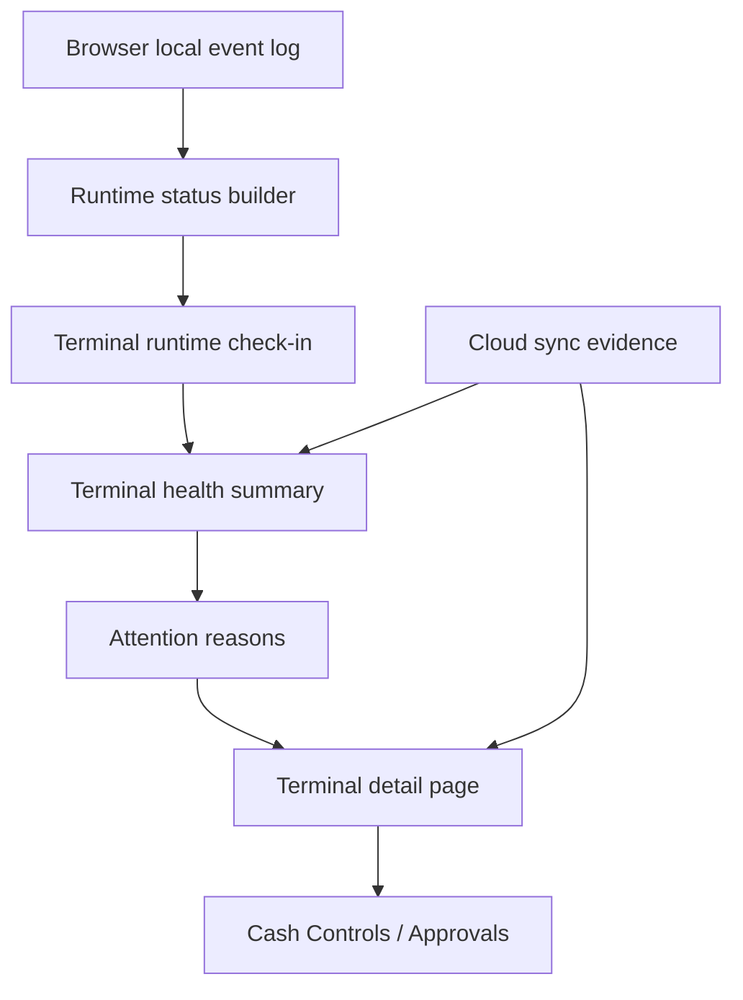

# fix: Close POS terminal review evidence gaps

## Summary

Align POS terminal health with the evidence operators can actually see: backend health summaries will return explicit attention reasons, the terminal detail page will explain local runtime review state beside cloud sync evidence, and the local sync runtime will stop leaving already-resolved review events stuck on the terminal.

---

## Problem Frame

Production terminal `M Supplies` showed a `Needs review` badge even though the terminal detail page said there were no unresolved conflicts. The backend check-in explains why: the latest terminal runtime status reported `sync.status: needs_review` and `reviewEventCount: 1`, while cloud evidence showed only projected events and one resolved permission conflict. The system is technically reading the local runtime counter, but the support surface presents cloud conflict evidence as if it were the whole reason.

---

## Requirements

- R1. Terminal health summaries must expose the reason a terminal is classified as `needs_attention`.
- R2. Terminal detail must make local runtime review state visible when it drives the `Needs review` label, even if cloud conflicts are clear.
- R3. Local sync review events that have been projected or resolved in cloud must be eligible to clear from the terminal's local review count on the next sync/runtime refresh.
- R4. Cash Controls and Operations review ownership must remain unchanged: terminal health explains support evidence, while manager review and register reconciliation stay in the existing register/approval flows.
- R5. Operator-facing copy must distinguish local runtime review, cloud held/rejected/conflicted events, resolved conflicts, pending sync, and stale telemetry without exposing raw local payloads or secrets.
- R6. Regression coverage must prove the production mismatch case: runtime review count is non-zero, cloud conflicts are resolved or absent, and the UI still explains why the terminal needs review.

---

## Scope Boundaries

- This plan does not change the POS local-first checkout contract.
- This plan does not add a new terminal-owned manager approval workflow.
- This plan does not auto-approve or auto-reject register closeout review work.
- This plan does not persist raw IndexedDB event payloads, staff proof tokens, sync secrets, PIN material, customer details, or payment details in terminal health.
- This plan does not redesign the terminal health console beyond the fields needed to explain the current health status.

### Deferred to Follow-Up Work

- Fleet-level alerting for terminals with unresolved local review counters can follow after the reason model is stable.
- Historical terminal-runtime trend charts are deferred; this plan keeps the latest-status model.
- Bulk terminal repair tooling is deferred until the local review clearing behavior is proven on the current recovery paths.

---

## Context & Research

### Relevant Code and Patterns

- `packages/athena-webapp/convex/pos/application/queries/terminals.ts` currently derives `needs_attention` when runtime sync status is `failed`, `needs_review`, `unavailable`, has failed/review counts, or when cloud evidence has conflicted/held/rejected events.
- `packages/athena-webapp/src/components/pos/terminals/terminalHealthPresentation.ts` independently classifies the public summary into labels. It prioritizes runtime `needs_review`, runtime `reviewEventCount`, and review evidence count before failed/pending/stale states.
- `packages/athena-webapp/src/components/pos/terminals/POSTerminalDetailView.tsx` renders cloud sync evidence, conflicts, and support notes, but does not show the runtime sync reason that can drive the `Needs review` badge.
- `packages/athena-webapp/src/lib/pos/infrastructure/local/terminalRuntimeStatus.ts` builds runtime `reviewEventCount` by counting local events whose sync status remains `needs_review`.
- `packages/athena-webapp/src/lib/pos/infrastructure/local/usePosLocalSyncRuntime.ts` marks returned review events as `needs_review` and marks projected events as synced; that boundary is the likely place to clear or reconcile local review state after server-side projection/recovery.
- `packages/athena-webapp/convex/pos/application/sync/projectLocalEvents.ts` and `packages/athena-webapp/convex/pos/application/sync/ingestLocalEvents.ts` own server-side sync projection, held/rejected/conflicted outcomes, and returned event statuses.
- `packages/athena-webapp/src/components/pos/register/POSRegisterView.tsx` already surfaces richer terminal-local diagnostics than the terminal detail page, including review count, oldest pending item, and upload sequence.

### Institutional Learnings

- `docs/solutions/architecture/athena-pos-terminal-health-visibility-2026-05-20.md` establishes terminal health as telemetry and support visibility, not the owner of manager review work.
- `docs/solutions/logic-errors/athena-pos-register-sync-closeout-review-recovery-2026-05-23.md` establishes that resolving review metadata without settling the source local sync event creates stale review states.
- `docs/solutions/logic-errors/athena-pos-register-sync-and-catalog-recovery-2026-05-26.md` establishes that POS and Cash Controls should share sync review state and avoid duplicate interpretations of closeout review.

### Production Evidence

- Terminal: `rs72p1j2hb64a133a0mfx3c9e17wn7gn`, display name `M Supplies`, register `1`.
- Latest runtime check-in reported `sync.status: needs_review`, `reviewEventCount: 1`, `nextPendingUploadSequence: 23`, and `oldestPendingEventAt: 2026-05-23T19:15:51.397Z`.
- Latest sampled cloud sync evidence showed 75 `projected` events, no held events, no rejected events, and one resolved permission conflict for the same register-close sequence.
- The visible page explained cloud evidence but not the runtime review counter, so the badge looked unsupported.

### External References

- External research skipped. The fix is specific to Athena's POS local sync model, Convex runtime status summaries, and existing terminal health UI.

---

## Key Technical Decisions

- Add explicit backend attention reasons rather than asking the frontend to rediscover why `health` is `needs_attention`: the query that computes health has the full runtime/cloud evidence set and can preserve reason precedence consistently.
- Keep the frontend classifier as presentation-only, or remove duplicated reason logic where practical: the UI should label and style the status, but it should render backend reasons as the support explanation.
- Treat local runtime review and cloud conflict evidence as separate evidence classes: a terminal can need review because its browser still has a local review item even when the cloud has no unresolved conflict.
- Clear stale local review state through the sync recovery path, not by hiding the badge: if a local event remains `needs_review`, the support page should say so until the runtime can safely mark it resolved/synced.
- Preserve terminal health as read-only support telemetry: any action that approves, rejects, or projects register activity remains in Cash Controls / Operations approval flows.

---

## Open Questions

### Resolved During Planning

- Why does the terminal show `Needs review`? The runtime status payload reports `sync.status: needs_review` and `reviewEventCount: 1`; cloud conflict evidence is not the cause in the current production snapshot.
- Should projected cloud events count as review evidence? No. They are evidence that the server accepted/projected events, not unresolved manager-review work.
- Should terminal detail hide the badge when cloud conflicts are resolved? No. The badge should remain if the terminal runtime still reports local review state, but the page must explain that source.

### Deferred to Implementation

- Exact local event clearing mechanism: implementation should inspect how `register_closed` review recovery returns accepted/projected event ids and choose the smallest safe way to mark the local source event synced after projection.
- Exact `attentionReasons` shape: implementation should keep it validator-safe and presentation-oriented, but final field names can follow local Convex DTO conventions.
- Whether a one-time production data repair is needed: implementation should first ship the lifecycle fix; only then decide whether affected terminals need a targeted manual sync retry or local refresh.

---

## High-Level Technical Design

> *This illustrates the intended approach and is directional guidance for review, not implementation specification. The implementing agent should treat it as context, not code to reproduce.*

The health summary should answer two different questions separately: "what state did the browser report?" and "what did the server observe in cloud sync evidence?" The terminal detail page then shows both instead of collapsing them into one conflicts panel.

---

## Implementation Units

- U1. **Backend attention reasons**

**Goal:** Return explicit, validator-safe reasons for terminal health classifications from the backend summary.

**Requirements:** R1, R2, R5, R6.

**Dependencies:** None.

**Files:**
- Modify: `packages/athena-webapp/convex/pos/application/queries/terminals.ts`
- Modify: `packages/athena-webapp/convex/pos/public/terminals.ts`
- Modify: `packages/athena-webapp/src/components/pos/terminals/terminalHealthTypes.ts`
- Test: `packages/athena-webapp/convex/pos/application/terminals.test.ts`
- Test: `packages/athena-webapp/convex/pos/public/terminals.test.ts`

**Approach:**
- Add an `attentionReasons` array to terminal health summaries with reason type, source, severity/tone, count/sequence/timestamp fields where safe, and concise operator-facing summary fields.
- Build reasons from the same inputs as `deriveTerminalHealth`: runtime sync status/counts, local store availability, browser online/freshness, and sync evidence counts.
- Preserve precedence: local runtime review reasons should explain `Needs review`; failed/unavailable reasons should explain sync/local-store issues; held/rejected/conflicted cloud evidence should explain cloud review.
- Keep existing `health` for compatibility while making `attentionReasons` the source for detailed explanation.

**Patterns to follow:**
- Existing public validator shaping in `packages/athena-webapp/convex/pos/public/terminals.ts`.
- Existing sync-evidence aggregation in `packages/athena-webapp/convex/pos/infrastructure/repositories/terminalRepository.ts`.

**Test scenarios:**
- Happy path: runtime `sync.status` is `needs_review` and `reviewEventCount` is `1`, cloud conflicts are clear -> summary health is `needs_attention` and includes one local runtime review reason.
- Happy path: cloud held/rejected/conflicted counts are non-zero while runtime is idle -> summary includes cloud evidence reasons.
- Edge case: runtime is stale/offline but no review counts exist -> summary does not create review reasons.
- Error path: unsafe runtime fields are absent from returned attention reasons.
- Integration: public query validator accepts the reason payload returned by the application query.

**Verification:**
- A backend caller can tell exactly why a terminal needs attention without reimplementing classifier logic.

---

- U2. **Terminal detail explanation**

**Goal:** Show local runtime review state and cloud evidence side by side so the `Needs review` badge is explainable on the terminal detail page.

**Requirements:** R2, R4, R5, R6.

**Dependencies:** U1.

**Files:**
- Modify: `packages/athena-webapp/src/components/pos/terminals/POSTerminalDetailView.tsx`
- Modify: `packages/athena-webapp/src/components/pos/terminals/terminalHealthPresentation.ts`
- Test: `packages/athena-webapp/src/components/pos/terminals/POSTerminalDetailView.test.tsx`
- Test: `packages/athena-webapp/src/components/pos/terminals/terminalHealthPresentation.test.ts`

**Approach:**
- Add a compact "Why this terminal needs attention" section near the status header or before cloud sync evidence.
- Render backend `attentionReasons` first. For local runtime review, include count, oldest event age, next upload sequence, last trigger, and a clear distinction that cloud conflicts may already be resolved.
- Keep "Cloud sync evidence" focused on server-observed event status, cursor, and latest event sample.
- Update empty conflict copy so "No unresolved terminal conflicts" no longer implies the terminal has no local review item.
- Use calm operational copy that points operators to existing review surfaces only when the reason is actionable there.

**Patterns to follow:**
- Existing detail panel structure in `POSTerminalDetailView.tsx`.
- Existing status label helpers in `terminalHealthPresentation.ts`.
- Product copy guidance in `docs/product-copy-tone.md`.

**Test scenarios:**
- Happy path: local runtime review reason exists and cloud conflicts are absent -> page renders "local review item" explanation and still shows cloud conflicts clear.
- Happy path: cloud held/rejected/conflicted reason exists -> page renders cloud review explanation with sequence/count context.
- Edge case: no attention reasons but health is `online` -> no reason panel is rendered.
- Edge case: older API response has no `attentionReasons` -> page falls back to current classifier and support notes without crashing.
- Error path: unsafe fields are not rendered even when runtime status contains browser info and sync counters.

**Verification:**
- The production mismatch state can be understood from the terminal detail page without opening the register debug strip.

---

- U3. **Local review lifecycle reconciliation**

**Goal:** Ensure local events no longer remain in `needs_review` after the server-side review/projection path has safely settled the source event.

**Requirements:** R3, R4, R6.

**Dependencies:** U1.

**Files:**
- Modify: `packages/athena-webapp/src/lib/pos/infrastructure/local/usePosLocalSyncRuntime.ts`
- Modify: `packages/athena-webapp/src/lib/pos/infrastructure/local/terminalRuntimeStatus.ts`
- Modify: `packages/athena-webapp/convex/pos/application/sync/projectLocalEvents.ts`
- Modify: `packages/athena-webapp/convex/pos/application/sync/ingestLocalEvents.ts`
- Test: `packages/athena-webapp/src/lib/pos/infrastructure/local/usePosLocalSyncRuntime.test.ts`
- Test: `packages/athena-webapp/src/lib/pos/infrastructure/local/terminalRuntimeStatus.test.ts`
- Test: `packages/athena-webapp/convex/pos/application/sync/projectLocalEvents.test.ts`
- Test: `packages/athena-webapp/convex/pos/application/sync/ingestLocalEvents.test.ts`

**Approach:**
- Characterize the current review-event lifecycle for a `register_closed` event that was previously marked review and later projected after manager proof.
- Ensure the server response gives the browser enough safe evidence to mark the source local event synced when projection is complete.
- Keep true rejected/conflicted events in `needs_review`; only clear review state for server-projected or intentionally settled events.
- Preserve local precursor handling for transaction/session events so clearing a reviewed closeout does not accidentally mark unrelated pending work synced.
- Update runtime status derivation so stale review counts come from current local event state, not debug leftovers.

**Execution note:** Start with characterization tests around the stale local review event before changing lifecycle behavior.

**Patterns to follow:**
- `collectServerSyncedLocalEventIds`, `collectServerReviewLocalEventIds`, and `collectAcceptedEventIdsWithLocalPrecursors` in `usePosLocalSyncRuntime.ts`.
- Register closeout projection recovery guidance in `docs/solutions/logic-errors/athena-pos-register-sync-closeout-review-recovery-2026-05-23.md`.

**Test scenarios:**
- Happy path: reviewed `register_closed` event is projected by the server -> returned sync result lets the browser mark the local source event synced and runtime `reviewEventCount` becomes `0`.
- Edge case: reviewed event is rejected -> local source event remains review/rejected and terminal continues to report an attention reason.
- Edge case: reviewed event belongs to another terminal/register scope -> current terminal does not clear it.
- Error path: mapping write fails after projection -> local event is not marked synced and runtime reports review/failure evidence.
- Integration: runtime status after a successful reviewed closeout projection no longer reports `sync.status: needs_review`.

**Verification:**
- A terminal with a resolved/projected closeout review stops carrying the stale local review counter after sync refresh.

---

- U4. **Terminal health parity across list, detail, and register diagnostics**

**Goal:** Keep terminal-health list rows, detail header badges, and POS register diagnostics aligned around the same status reasons.

**Requirements:** R1, R2, R5, R6.

**Dependencies:** U1, U2.

**Files:**
- Modify: `packages/athena-webapp/src/components/pos/terminals/POSTerminalHealthView.tsx`
- Modify: `packages/athena-webapp/src/components/pos/terminals/terminalHealthPresentation.ts`
- Modify: `packages/athena-webapp/src/components/pos/register/POSRegisterView.tsx`
- Test: `packages/athena-webapp/src/components/pos/terminals/POSTerminalHealthView.test.tsx`
- Test: `packages/athena-webapp/src/components/pos/terminals/terminalHealthPresentation.test.ts`
- Test: `packages/athena-webapp/src/components/pos/register/POSRegisterView.test.tsx`

**Approach:**
- Update terminal list rows to use the same attention reason summary as detail, so "Needs review" is not a dead-end label.
- Preserve the register debug strip's richer technical details, but align the top-level wording with the terminal-health reason model.
- Avoid making terminal health copy sound like manager review unless the reason is local review or cloud review evidence.
- Keep pending sync, failed sync, stale check-in, and local store issue visually distinct.

**Patterns to follow:**
- Existing terminal health row metrics in `POSTerminalHealthView.tsx`.
- Existing register diagnostics field grouping in `POSRegisterView.tsx`.

**Test scenarios:**
- Happy path: terminal list item with local runtime review reason shows a concise review explanation and links to detail.
- Happy path: register debug strip and terminal detail agree on review count and status label.
- Edge case: pending sync without review shows pending copy, not review copy.
- Edge case: stale check-in with prior review reason still indicates freshness so support can tell whether the reason may be outdated.

**Verification:**
- POS hub terminal health, terminal detail, and register diagnostics do not contradict each other for the same runtime status.

---

- U5. **Validation map and operational handoff**

**Goal:** Update validation and support notes so future POS sync changes preserve terminal reason visibility and local review clearing.

**Requirements:** R6.

**Dependencies:** U1, U2, U3, U4.

**Files:**
- Modify: `docs/solutions/architecture/athena-pos-terminal-health-visibility-2026-05-20.md`
- Create: `docs/solutions/logic-errors/athena-pos-terminal-review-reason-reconciliation-2026-05-26.md`
- Modify: `docs/solutions/logic-errors/athena-pos-register-sync-and-catalog-recovery-2026-05-26.md`
- Modify: `packages/athena-webapp/docs/validation-map.md` if this validation surface is listed there
- Test: `scripts/validation-map-check.test.ts` if the validation map has automated coverage for these surfaces

**Approach:**
- Document the production failure mode: runtime review counter was true, cloud conflicts were clear, and the UI only showed cloud evidence.
- Record the corrected boundary: terminal health must return reason evidence, and local sync recovery must clear projected review events.
- Ensure validation references cover backend reason generation, terminal detail explanation, runtime status derivation, and reviewed closeout projection.

**Patterns to follow:**
- Existing `docs/solutions/logic-errors/*` root-cause note structure.
- Existing validation-map conventions in the repo.

**Test scenarios:**
- Test expectation: none for the prose-only docs. If validation-map automation exists for changed entries, add or update the corresponding assertion.

**Verification:**
- Future implementers have a durable note for this exact terminal-health inconsistency and know which tests protect it.

---

## System-Wide Impact

- **Interaction graph:** POS local event log -> runtime status builder -> terminal runtime check-in -> terminal health summary -> terminal list/detail/register diagnostics. Cloud sync evidence and Cash Controls remain separate inputs that the terminal detail page summarizes.
- **Error propagation:** Runtime status failures should explain terminal support state without blocking POS sale commands. Sync projection failures still flow through existing local review/failed states.
- **State lifecycle risks:** The highest risk is clearing a true review event too early. U3 must only clear local review state when server-side projection or intentional settlement is confirmed.
- **API surface parity:** Public terminal health list/detail responses, frontend types, and presentation helpers must change together.
- **Integration coverage:** Unit tests alone are not enough; coverage must include a cross-layer mismatch case where local runtime review count exists but cloud conflicts are resolved or absent.
- **Unchanged invariants:** Terminal health remains telemetry; Cash Controls and Operations remain the manager-review action surfaces.

---

## Risks & Dependencies

| Risk | Mitigation |
|------|------------|
| Clearing local review state could hide real unresolved register activity. | Require server-projected or intentionally settled evidence before marking local events synced. Keep rejected/conflicted outcomes in review. |
| Duplicating reason logic between backend and frontend could drift again. | Make backend `attentionReasons` the explanation source; frontend presentation should style and render reasons, not recalculate them. |
| Operator copy could imply the terminal detail page can approve review work. | Keep copy support-oriented and route actions back to existing Cash Controls / Approvals surfaces. |
| Older frontend/backend deployments may temporarily disagree on the new field. | Treat missing `attentionReasons` as optional in frontend types and preserve fallback rendering during rollout. |
| Production terminals may already have stale local review events. | Ship lifecycle correction first, then decide whether a targeted retry/refresh or manual recovery is needed. |

---

## Documentation / Operational Notes

- After implementation, verify the same production terminal or a matching seeded state no longer shows unexplained `Needs review`.
- If the terminal still reports `reviewEventCount: 1` after the lifecycle fix, use the new reason panel to identify the local sequence and decide whether a targeted recovery command or local terminal refresh is required.
- If code files change during implementation, run `bun run graphify:rebuild` per repo guidance.

---

## Sources & References

- Related plan: `docs/plans/2026-05-20-001-feat-pos-terminal-health-visibility-plan.md`
- Related learning: `docs/solutions/architecture/athena-pos-terminal-health-visibility-2026-05-20.md`
- Related learning: `docs/solutions/logic-errors/athena-pos-register-sync-closeout-review-recovery-2026-05-23.md`
- Related learning: `docs/solutions/logic-errors/athena-pos-register-sync-and-catalog-recovery-2026-05-26.md`
- Related code: `packages/athena-webapp/convex/pos/application/queries/terminals.ts`
- Related code: `packages/athena-webapp/src/components/pos/terminals/POSTerminalDetailView.tsx`
- Related code: `packages/athena-webapp/src/lib/pos/infrastructure/local/usePosLocalSyncRuntime.ts`
- Related code: `packages/athena-webapp/src/lib/pos/infrastructure/local/terminalRuntimeStatus.ts`
