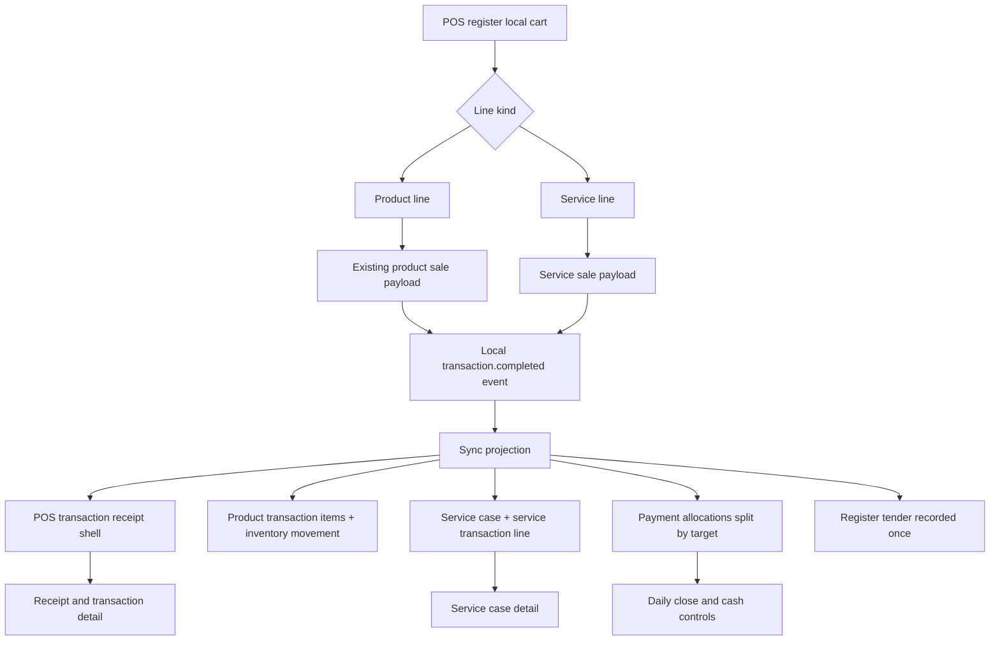
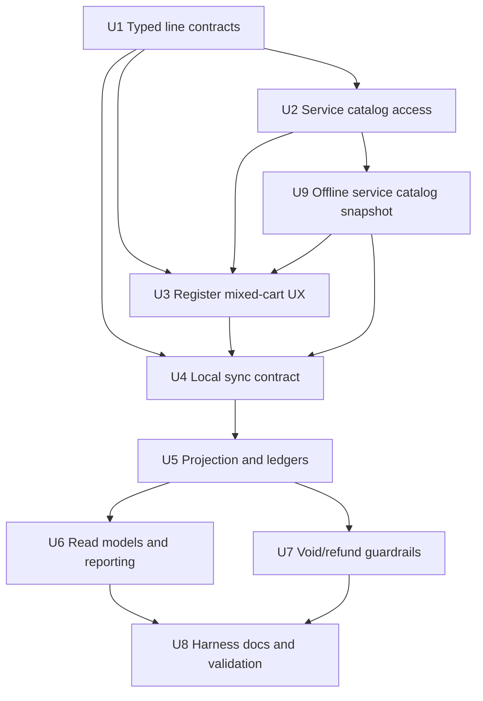
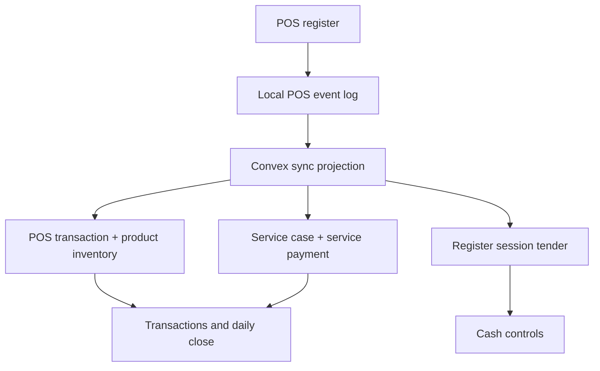

# feat: Add POS service mixed checkout

## Summary

Add a mixed POS checkout that lets a cashier sell service work and retail product add-ons in one local-first register flow. The checkout keeps services first-class through service cases and service payment allocations, keeps products on the existing retail sale and inventory path, and explicitly excludes internal service material usage from the register release.

---

## Problem Frame

Service work already has first-class infrastructure in Athena, but the active POS register can only build product-shaped sales. Operators need one cashier checkout for a service and customer-purchased product add-ons without turning services into fake SKUs or losing the service case, drawer, payment, receipt, and reporting boundaries that already exist.

---

## Requirements

- R1. The POS register can add service catalog entries to the active cart alongside existing SKU-backed product lines.
- R2. A service cart line must create or attach to a first-class `serviceCase`; services must not be represented as fake `productSku` rows.
- R3. Adding a service line requires customer attribution before checkout, because service cases require a customer profile.
- R4. The cashier records one payment flow for the full mixed checkout, while Athena records business value against the correct targets: retail value to the POS transaction and service value to service cases.
- R5. Drawer/register expected money is affected once by the tendered payment, not once per allocation target.
- R6. Retail product add-ons remain normal POS product lines and inventory movements. Internal service material usage remains outside the POS register flow.
- R7. POS completion remains local-first. Service checkout must be durable in the local register event before returning success and must sync/project through the existing local POS event pipeline.
- R8. Receipts, transaction detail, service case detail, and daily close/cash-control reporting can explain the mixed sale without silently changing existing retail totals.
- R9. Voids/refunds preserve the distinction between retail product reversal, service payment reversal, and service work/material state.
- R10. The UI follows the existing Athena POS/service design system, shared command-result handling, and calm operator-facing copy.
- R11. Active service catalog entries needed for POS checkout are available offline through the same local-first readiness posture as product SKU catalog data.

---

## Scope Boundaries

- Do not record internal service material usage from POS. That remains `serviceInventoryUsage` in Service Ops.
- Do not automatically consume product SKUs as service materials when a service is sold.
- Do not create appointment conversion or scheduling flows inside POS.
- Do not build bundles/packages with automatic retail or material line expansion.
- Do not make the active register fall back to an online-only Convex mutation path for service checkout.
- Do not rewrite existing product-only `posTransactionItem` rows into a mixed-purpose catch-all table.
- Do not change service catalog management semantics beyond exposing active service entries to POS.

### Deferred to Follow-Up Work

- Service material usage from POS: add a clearly separate "used for service" flow only after the mixed paid receipt is proven.
- Service packages and bundled products: add explicit package rules later instead of overloading v1 service lines.
- Appointment conversion from POS: allow scheduling and appointment linkage in a later service-ops iteration.
- Broader service refunds after work has started: keep v1 conservative and route advanced cases through service operations or manager review.

---

## Context & Research

### Relevant Code and Patterns

- `packages/athena-webapp/convex/schemas/serviceOps/serviceCatalog.ts` defines store-scoped service catalog entries with pricing model, base price, deposit rule, approval requirement, mode, and status.
- `packages/athena-webapp/convex/schemas/serviceOps/serviceCase.ts` defines first-class service cases with customer, work item, service catalog, service mode, status, payment status, totals, and balance due.
- `packages/athena-webapp/convex/serviceOps/serviceCases.ts` already creates service cases, line items, inventory usage, service payments, operational events, and service payment allocations.
- `packages/athena-webapp/convex/schemas/pos/posTransactionItem.ts` is strictly product/SKU-shaped, so service sales need a separate transaction service-line/link model rather than a fake SKU.
- `packages/athena-webapp/shared/posLocalSyncContract.ts`, `packages/athena-webapp/src/lib/pos/infrastructure/local/posLocalStore.ts`, and `packages/athena-webapp/convex/pos/application/sync/types.ts` currently define a product-only `sale_completed` local sync payload.
- `packages/athena-webapp/src/lib/pos/infrastructure/local/posLocalStore.ts` already stores local register catalog and availability snapshots for SKU-backed POS operation; service catalog needs a parallel local snapshot rather than live-query-only behavior.
- `packages/athena-webapp/src/lib/pos/infrastructure/local/localPosReadiness.ts` and related local readiness tests are the right place to add service catalog readiness signals for mixed service checkout.
- `packages/athena-webapp/src/lib/pos/presentation/register/useRegisterViewModel.ts` completes POS sales by appending a local `transaction.completed` event and then letting background sync project cloud records.
- `packages/athena-webapp/src/lib/pos/presentation/register/registerUiState.ts` and `packages/athena-webapp/src/components/pos/register/POSRegisterView.tsx` define the active register UI state boundary.
- `packages/athena-webapp/convex/pos/application/sync/projectLocalEvents.ts` validates sale product references, projects POS transactions, persists product items, decrements SKU inventory, records payment allocations, and reports conflicts.
- `packages/athena-webapp/src/components/services/ServiceCatalogView.tsx` and `packages/athena-webapp/src/components/services/ServiceCasesView.tsx` show service catalog/case UI conventions and command-result handling.
- `packages/athena-webapp/convex/schemas/operations/paymentAllocation.ts` is the shared payment ledger shape used by retail POS, service cases, cash controls, and daily operations.

### Institutional Learnings

- `docs/solutions/architecture/athena-pos-always-local-first-register-2026-05-14.md`: POS cashier commands must append local register events before returning success, regardless of browser online state.
- `docs/solutions/performance/athena-pos-cart-latency-foundation-2026-05-05.md`: POS cart operations should avoid full-catalog reactivity and SKU inventory should decrement once at sale completion, not during cart editing.
- `docs/solutions/logic-errors/athena-pos-drawer-invariants-at-command-boundaries-2026-04-24.md`: drawer/register invariants must live at command boundaries, not only in UI gates.
- `docs/solutions/architecture/athena-pos-local-first-sync-2026-05-13.md`: local POS history is projected into cloud records and conflicts are surfaced for review rather than rewriting the cashier timeline.

### External References

- None used. This plan follows existing Athena POS, service-ops, payment allocation, local-sync, and command-result patterns.

---

## Alternative Approaches Considered

- **Mixed paid receipt with first-class service cases, selected:** One cashier checkout can include service and retail add-ons. Services remain service cases, products remain POS product lines, and the ledger splits value by business target.
- **Service-as-product SKU:** Simple for cart UI, but rejected because it hides service status, balance, approvals, and customer/work-item semantics and risks polluting inventory/reporting.
- **Service payment only in POS, products attached later in Service Ops:** Lower POS complexity, but it does not satisfy the need to attach customer-purchased products to the same service transaction.
- **Full service materials plus retail add-ons in v1:** Highest functionality, but rejected for v1 because it mixes "sold to customer" with "used to perform service" and creates double-deduction, refund, and reporting risks.

---

## Key Technical Decisions

| Decision | Rationale |
| --- | --- |
| Use typed cart and transaction lines | Product and service lines have different identities, inventory effects, and ledger targets. A line kind avoids faking services as SKUs. |
| Persist service receipt lines separately from product `posTransactionItem` rows | Existing product item rows require product and SKU ids. A separate service transaction line preserves product invariants and makes mixed receipt reconstruction explicit. |
| Create or attach service cases during sale projection | The service case is the service system of record. POS should create/link the service case, not become the service lifecycle owner. |
| Require customer attribution for service checkout | Current service cases require `customerProfileId`; POS must collect or choose a customer before a service sale can complete. |
| Split payment allocations but count drawer tender once | Business reporting needs separate retail and service targets; cash controls need one register tender event for expected cash/card/mobile totals. |
| Use a mixed-checkout allocation planner | One tender may include multiple payment methods and multiple target types. A planner must split collected value across retail and service targets while preserving payment method totals and handling change once. |
| Treat service line amount as the amount being charged now | Fixed services can default to base price. Deposit rules can suggest or validate a minimum/default amount, but v1 should not introduce a separate deposit workflow inside POS; service case balance handles partial payment. |
| Keep internal service materials out of POS v1 | Material usage is operational consumption, not a customer sale line. Keeping it separate prevents double inventory deduction. |
| Add a local service catalog snapshot | Services in POS must be operable after provisioning and reload, just like product SKUs. Online service catalog reads should refresh local state opportunistically, not become a checkout dependency. |
| Extend local sync instead of adding an online-only path | POS local-first is now an invariant. Service checkout must append local events and project through background sync. |
| Block or review unsupported service pricing states | Fixed services can use base price directly. Starting-at services require an explicit POS-entered service amount. Quote-after-consultation services need an existing service case or explicit collected amount; otherwise POS should block checkout with operator-safe copy. |

---

## Open Questions

### Resolved During Planning

- **Should internal service material usage be included in v1?** No. V1 covers mixed paid receipt: service line plus retail product add-ons. Service materials remain in Service Ops.
- **Should services be represented as product SKUs?** No. Services remain first-class service cases and service-linked transaction lines.
- **Should one payment be recorded as one drawer action?** Yes. The cashier has one tender flow; ledger allocations split the value while drawer/cash-control effects happen once.
- **Should service checkout be local-first?** Yes. POS service checkout must not introduce an online-primary completion path.

### Deferred to Implementation

- **Exact service transaction line table name:** Use the repo's schema naming conventions, but keep service lines separate from `posTransactionItem`.
- **Whether POS-created service cases start as `intake` or `in_progress`:** Prefer the current service-case status rules; implementation should choose the least surprising status based on whether the service is same-day and fully paid.
- **How detailed mixed receipt printing is in v1:** The receipt must show service and product lines clearly, but final layout details can follow existing receipt component constraints.
- **How much daily close net-service reporting lands in the first PR:** Include enough to avoid misleading retail totals; broader service revenue dashboards can follow.
- **Exact service catalog snapshot storage shape:** Mirror the existing local product catalog snapshot posture, but derive the final object-store/versioning details while implementing against IndexedDB compatibility tests.

---

## High-Level Technical Design

> *This illustrates the intended approach and is directional guidance for review, not implementation specification. The implementing agent should treat it as context, not code to reproduce.*

---

## Implementation Units

- U1. **Define typed POS sale lines**

**Goal:** Introduce shared product/service sale-line contracts and completed service-line persistence without weakening product item invariants.

**Requirements:** R1, R2, R4, R6, R8

**Dependencies:** None

**Files:**
- Modify: `packages/athena-webapp/src/components/pos/types.ts`
- Modify: `packages/athena-webapp/src/lib/pos/domain/types.ts`
- Modify: `packages/athena-webapp/src/lib/pos/domain/cart.ts`
- Modify: `packages/athena-webapp/src/lib/pos/application/dto.ts`
- Modify: `packages/athena-webapp/src/lib/pos/presentation/register/registerUiState.ts`
- Create: `packages/athena-webapp/convex/schemas/pos/posTransactionServiceLine.ts`
- Modify: `packages/athena-webapp/convex/schemas/pos/index.ts`
- Modify: `packages/athena-webapp/convex/schema.ts`
- Test: `packages/athena-webapp/src/lib/pos/domain/cart.test.ts`
- Test: `packages/athena-webapp/convex/pos/application/completeTransaction.test.ts`

**Approach:**
- Add a `product` versus `service` line kind to the browser/domain cart shape. Product lines keep current SKU fields. Service lines carry service catalog id, optional service case id, service mode, display name, quantity, unit price, and pricing source.
- Keep the existing `posTransactionItem` schema product-only.
- Add a completed service-line persistence model linked to `posTransaction` and `serviceCase`, with copied display/price fields for receipt history.
- Keep total calculation line-kind aware while preserving product calculation behavior.

**Execution note:** Implement new line totals test-first before wiring UI so product-only checkout regressions are caught early.

**Patterns to follow:**
- `packages/athena-webapp/convex/schemas/pos/posTransactionItem.ts`
- `packages/athena-webapp/src/lib/pos/domain/cart.ts`
- `packages/athena-webapp/src/lib/pos/application/dto.ts`

**Test scenarios:**
- Happy path: a cart with one product line and one service line calculates subtotal, tax, and total from both line kinds.
- Happy path: a product-only cart produces the same totals and line shape as before.
- Edge case: a service line with quantity greater than one calculates total from unit price times quantity.
- Error path: service line creation rejects or normalizes missing display name, invalid quantity, or negative price before completion.
- Integration: completed transaction service lines can be linked to a POS transaction and service case without requiring product/SKU ids.

**Verification:**
- Product-only POS types remain compatible, and mixed-line totals can be represented end to end without fake SKUs.

---

- U2. **Expose active service catalog entries for POS**

**Goal:** Provide a POS-safe service catalog read model that can be searched from the register and can explain whether a service is checkout-ready.

**Requirements:** R1, R2, R3, R10

**Dependencies:** U1

**Files:**
- Modify: `packages/athena-webapp/convex/serviceOps/catalog.ts`
- Modify: `packages/athena-webapp/src/lib/pos/application/dto.ts`
- Modify: `packages/athena-webapp/src/lib/pos/infrastructure/convex/catalogGateway.ts`
- Modify: `packages/athena-webapp/src/lib/pos/presentation/register/catalogSearch.ts`
- Test: `packages/athena-webapp/convex/serviceOps/catalogAppointments.test.ts`
- Test: `packages/athena-webapp/src/lib/pos/presentation/register/catalogSearch.test.ts`
- Test: `packages/athena-webapp/src/lib/pos/infrastructure/convex/catalogGateway.test.tsx`

**Approach:**
- Add a store-scoped service catalog query or extend an existing query with a POS presentation mapper that returns active services only.
- Include service mode, pricing model, base price, deposit rule, manager approval flag, and a checkout readiness reason.
- Map deposit rules into POS guidance only: suggested amount, minimum/default amount, and readiness copy. Do not create a separate POS deposit lifecycle in this unit.
- Keep product catalog indexing separate from service search so SKU availability remains bounded and stable.
- Do not expose archived service catalog items to POS search.

**Patterns to follow:**
- `packages/athena-webapp/convex/serviceOps/catalog.ts`
- `packages/athena-webapp/src/lib/pos/presentation/register/catalogSearch.ts`
- `packages/athena-webapp/src/lib/pos/infrastructure/convex/catalogGateway.ts`

**Test scenarios:**
- Happy path: active fixed-price services appear in POS service search with base price and service mode.
- Happy path: active starting-at services appear with an explicit "amount required" checkout state.
- Happy path: a flat or percentage deposit service exposes a suggested/minimum checkout amount without changing service case payment semantics.
- Edge case: archived services are excluded from POS search.
- Edge case: quote-after-consultation services are marked not directly checkout-ready unless attached to an existing service case or given an explicit collected amount.
- Error path: missing store id or inaccessible store returns a safe empty/unavailable state rather than thrown backend text.

**Verification:**
- POS can search service entries independently from product SKU search and can tell the cashier why a service cannot be checked out yet.

---

- U3. **Add service lines to the register UI**

**Goal:** Let cashiers add, review, price, and remove service lines in the active POS register while preserving the existing product-entry flow.

**Requirements:** R1, R3, R6, R10

**Dependencies:** U1, U2, U9

**Files:**
- Modify: `packages/athena-webapp/src/lib/pos/presentation/register/useRegisterViewModel.ts`
- Modify: `packages/athena-webapp/src/lib/pos/presentation/register/registerUiState.ts`
- Modify: `packages/athena-webapp/src/components/pos/register/POSRegisterView.tsx`
- Modify: `packages/athena-webapp/src/components/pos/ProductEntry.tsx`
- Modify: `packages/athena-webapp/src/components/pos/SearchResultsSection.tsx`
- Modify: `packages/athena-webapp/src/components/pos/CartItems.tsx`
- Modify: `packages/athena-webapp/src/components/pos/register/RegisterCustomerAttribution.tsx`
- Test: `packages/athena-webapp/src/lib/pos/presentation/register/useRegisterViewModel.test.ts`
- Test: `packages/athena-webapp/src/components/pos/register/POSRegisterView.test.tsx`
- Test: `packages/athena-webapp/src/components/pos/ProductEntry.test.tsx`
- Create: `packages/athena-webapp/src/components/pos/CartItems.test.tsx`

**Approach:**
- Extend the register search surface with a clear product/service mode or segmented filter. Product search remains the default hot path; service search is explicit and does not degrade product auto-add behavior.
- Read service search from the local service catalog snapshot first, with online Convex data refreshing that snapshot opportunistically when available.
- Render service lines in the cart with service mode and price source instead of SKU/barcode metadata.
- Require customer attribution when the cart contains any service line. The checkout panel should block completion with inline operator-safe copy until a customer is selected/created.
- Allow service amount entry only where the service catalog pricing model requires cashier confirmation; fixed-price services should not invite arbitrary price edits in v1.
- Keep service material language out of POS copy to avoid confusing "sold add-on" with "used for service."

**Execution note:** Start with characterization coverage around existing product search/add behavior before adding service mode controls.

**Patterns to follow:**
- `packages/athena-webapp/src/components/pos/ProductEntry.tsx`
- `packages/athena-webapp/src/components/pos/SearchResultsSection.tsx`
- `packages/athena-webapp/src/components/pos/CartItems.tsx`
- `packages/athena-webapp/src/components/services/ServiceCatalogView.tsx`
- `docs/product-copy-tone.md`

**Test scenarios:**
- Happy path: cashier searches services, adds a fixed-price service line, adds a product line, and sees one combined checkout total.
- Happy path: cashier can search and add a service line from the last local service catalog snapshot while offline.
- Happy path: product search and barcode exact-match behavior still work when service search controls exist.
- Happy path: cashier can remove a service line without affecting product lines.
- Edge case: cart with service line and no customer blocks checkout and focuses/surfaces customer attribution.
- Edge case: starting-at service requires an entered amount before checkout can proceed.
- Error path: quote-after-consultation service without an existing service case or explicit collected amount cannot be added as a completed service sale.
- Integration: adding a service line updates checkout totals and payment-required state the same way product lines do.

**Verification:**
- The register UI supports mixed carts without changing the normal product-only cashier path.

---

- U4. **Extend local POS event and read-model contracts**

**Goal:** Make service lines durable in the local-first POS event timeline and uploadable through the local sync contract.

**Requirements:** R1, R4, R7, R8

**Dependencies:** U1, U3, U9

**Files:**
- Modify: `packages/athena-webapp/shared/posLocalSyncContract.ts`
- Modify: `packages/athena-webapp/src/lib/pos/infrastructure/local/posLocalStore.ts`
- Modify: `packages/athena-webapp/src/lib/pos/infrastructure/local/localCommandGateway.ts`
- Modify: `packages/athena-webapp/src/lib/pos/infrastructure/local/registerReadModel.ts`
- Modify: `packages/athena-webapp/src/lib/pos/infrastructure/local/syncContract.ts`
- Modify: `packages/athena-webapp/src/lib/pos/presentation/register/useRegisterViewModel.ts`
- Test: `packages/athena-webapp/src/lib/pos/infrastructure/local/posLocalStore.test.ts`
- Test: `packages/athena-webapp/src/lib/pos/infrastructure/local/localCommandGateway.test.ts`
- Test: `packages/athena-webapp/src/lib/pos/infrastructure/local/registerReadModel.test.ts`
- Test: `packages/athena-webapp/src/lib/pos/infrastructure/local/syncContract.test.ts`
- Test: `packages/athena-webapp/src/lib/pos/presentation/register/useRegisterViewModel.test.ts`

**Approach:**
- Add service-line payload support to local cart and completed-sale events while keeping product-line payload support stable.
- Project mixed active-sale state from local events after reload, including service lines, product lines, payments, customer, and totals.
- Ensure upload payloads include service line identity, price snapshot, optional existing service case id, customer profile id, and local service line ids for mapping/conflict review.
- Preserve enough service catalog snapshot metadata in local completed-sale payloads that projection can validate against cloud service catalog rows without depending on a live browser query.
- Bump local store schema version only if persisted IndexedDB object-store or event compatibility requires it.
- Preserve the rule that cashier success comes from local append success, not Convex mutation success.

**Execution note:** Implement local read-model and sync-contract tests before changing register completion behavior.

**Patterns to follow:**
- `packages/athena-webapp/src/lib/pos/infrastructure/local/registerReadModel.ts`
- `packages/athena-webapp/src/lib/pos/infrastructure/local/syncContract.ts`
- `packages/athena-webapp/shared/posLocalSyncContract.ts`

**Test scenarios:**
- Happy path: a mixed cart survives reload from local events with product and service lines intact.
- Happy path: completing a mixed checkout appends one local completed transaction event with product lines, service lines, payments, customer, and totals.
- Happy path: product-only local events still upload in the existing payload shape or compatible extension.
- Edge case: service line with existing service case id maps through local read model without creating duplicate display rows.
- Error path: malformed service-line payload creates a local read-model error and does not silently drop the rest of the sale.
- Integration: sync upload event includes service lines and remains ordered with register open, sale clear, closeout, and reopen events.

**Verification:**
- A service checkout can complete locally, reload locally, and prepare an upload payload without a live Convex mutation.

---

- U5. **Project mixed sales into POS, service, inventory, and payment ledgers**

**Goal:** Extend server-side local sync projection so mixed checkout creates one receipt shell, product sale effects, service case/payment effects, and one drawer tender effect.

**Requirements:** R2, R4, R5, R6, R7, R9

**Dependencies:** U1, U2, U4, U9

**Files:**
- Modify: `packages/athena-webapp/convex/pos/application/sync/types.ts`
- Modify: `packages/athena-webapp/convex/pos/application/sync/projectLocalEvents.ts`
- Modify: `packages/athena-webapp/convex/pos/infrastructure/repositories/localSyncRepository.ts`
- Modify: `packages/athena-webapp/convex/pos/infrastructure/repositories/transactionRepository.ts`
- Modify: `packages/athena-webapp/convex/serviceOps/serviceCases.ts`
- Modify: `packages/athena-webapp/convex/operations/paymentAllocations.ts`
- Modify: `packages/athena-webapp/convex/pos/infrastructure/integrations/paymentAllocationService.ts`
- Test: `packages/athena-webapp/convex/pos/application/sync/projectLocalEvents.test.ts`
- Test: `packages/athena-webapp/convex/pos/public/sync.test.ts`
- Test: `packages/athena-webapp/convex/serviceOps/serviceCases.test.ts`
- Test: `packages/athena-webapp/convex/operations/paymentAllocations.test.ts`
- Test: `packages/athena-webapp/convex/pos/application/completeTransaction.test.ts`

**Approach:**
- Parse and validate product and service line arrays from `sale_completed`.
- Continue projecting a `posTransaction` as the receipt-level transaction, but keep retail product rows in `posTransactionItem` and service rows in the new service-line table.
- Create or attach a service case for each service line. For new POS-created cases, create the operational work item and service case through service-ops helpers so service detail, operations queue, and operational events stay connected.
- Record service line items and service payment allocations against the service case. The service allocation amount should be the service portion of the tender, not the whole receipt total.
- Record retail payment allocation against the POS transaction for the product portion.
- Add a mixed-checkout allocation planner before writing payment allocations. The planner should preserve total collected per payment method, allocate value across retail and service target subtotals deterministically, and apply cash overpayment/change once at the receipt level.
- Record register-session tender movement once for the full payment collection so drawer expected totals match the cashier action.
- Validate service catalog/store/customer references and create local sync conflicts for permission, missing catalog, duplicate local ids, stale price, missing customer, or unsupported pricing state.
- Keep product inventory movement exactly on the existing product sale path; service lines must not call product SKU inventory movement unless they are product add-ons already represented as product lines.

**Execution note:** Use test-first projection coverage because this is the highest-risk financial/inventory boundary.

**Patterns to follow:**
- `packages/athena-webapp/convex/pos/application/sync/projectLocalEvents.ts`
- `packages/athena-webapp/convex/serviceOps/serviceCases.ts`
- `packages/athena-webapp/convex/pos/infrastructure/integrations/paymentAllocationService.ts`
- `packages/athena-webapp/convex/cashControls/paymentAllocationAttribution.ts`

**Test scenarios:**
- Happy path: mixed sale with one product and one fixed service projects one POS transaction, one product transaction item, one service transaction line, one service case, split payment allocations, and one register-session tender record.
- Happy path: mixed sale attached to an existing active service case records service payment and service transaction line without creating a duplicate service case.
- Happy path: product-only local sale still projects with unchanged product inventory and payment behavior.
- Edge case: service-only checkout projects a POS receipt shell and service allocation with no product inventory movement.
- Edge case: mixed sale paid with multiple methods preserves payment method totals while splitting retail and service allocation targets.
- Edge case: mixed sale with cash overpayment records change once and does not double-count change across split allocations.
- Error path: service line without customer profile creates a sync conflict and does not create an orphan service case.
- Error path: service catalog item outside the store creates a permission conflict.
- Error path: quote-after-consultation service without explicit collected amount or existing service case blocks projection with a reviewable conflict.
- Error path: service catalog row changed after offline checkout creates a reviewable price/status conflict instead of silently rewriting the local receipt.
- Integration: service case financial sync updates payment status and balance due after POS-projected payment allocation.
- Integration: local mapping records connect service line local ids to cloud service case/service transaction line ids for retry safety.

**Verification:**
- Mixed-sale projection preserves product inventory truth, service balance truth, payment allocation truth, and drawer truth in one idempotent projection path.

---

- U6. **Surface mixed receipts, details, and reports**

**Goal:** Make mixed service/product checkouts understandable in receipts, transaction detail, service case detail, daily close, and cash-control views.

**Requirements:** R4, R5, R8, R9, R10

**Dependencies:** U5

**Files:**
- Modify: `packages/athena-webapp/src/components/pos/OrderSummary.tsx`
- Modify: `packages/athena-webapp/src/components/pos/register/RegisterCheckoutPanel.tsx`
- Modify: `packages/athena-webapp/src/components/pos/receipt/PosReceiptShareControl.tsx`
- Modify: `packages/athena-webapp/src/components/pos/transactions/TransactionView.tsx`
- Modify: `packages/athena-webapp/src/components/pos/transactions/TransactionsView.tsx`
- Modify: `packages/athena-webapp/src/components/services/ServiceCasesView.tsx`
- Modify: `packages/athena-webapp/convex/pos/application/queries/getTransactions.ts`
- Modify: `packages/athena-webapp/convex/pos/public/transactions.ts`
- Modify: `packages/athena-webapp/convex/operations/dailyClose.ts`
- Modify: `packages/athena-webapp/convex/cashControls/registerSessions.ts`
- Test: `packages/athena-webapp/src/components/pos/OrderSummary.test.tsx`
- Test: `packages/athena-webapp/src/components/pos/register/RegisterCheckoutPanel.test.tsx`
- Test: `packages/athena-webapp/src/components/pos/receipt/PosReceiptShareControl.test.tsx`
- Test: `packages/athena-webapp/src/components/pos/transactions/TransactionView.test.tsx`
- Test: `packages/athena-webapp/src/components/pos/transactions/TransactionsView.test.tsx`
- Test: `packages/athena-webapp/src/components/services/ServiceCasesView.test.tsx`
- Test: `packages/athena-webapp/convex/pos/application/getTransactions.test.ts`
- Test: `packages/athena-webapp/convex/operations/dailyClose.test.ts`
- Test: `packages/athena-webapp/convex/cashControls/registerSessions.test.ts`

**Approach:**
- Receipts and order summaries should group product and service lines clearly while keeping one total and one payment list.
- Transaction detail should show linked service case(s), service line totals, retail product lines, and payment allocation split without making existing retail total fields ambiguous.
- Service case detail should show POS-originated payment/receipt context when a service line was sold through POS.
- Daily close and cash-control views should keep drawer collection totals tied to tender movements while exposing service-vs-retail allocation totals explicitly where needed.
- Use existing amount display utilities and command-result presentation patterns.

**Patterns to follow:**
- `packages/athena-webapp/src/components/pos/transactions/TransactionView.tsx`
- `packages/athena-webapp/src/components/services/ServiceCasesView.tsx`
- `packages/athena-webapp/convex/operations/dailyClose.ts`
- `packages/athena-webapp/src/lib/pos/displayAmounts.ts`

**Test scenarios:**
- Happy path: completed mixed transaction detail shows product lines, service lines, linked service case, total, and payment split.
- Happy path: service case detail shows a POS-collected service payment with receipt/transaction context.
- Happy path: product-only transaction detail remains unchanged except for compatible empty service-line state.
- Edge case: service-only receipt renders a clear service line group and no empty product section.
- Edge case: mixed transaction with multiple service lines links each service case or service line correctly.
- Error path: missing linked service case renders a recoverable "service case unavailable" state without breaking transaction detail.
- Integration: daily close/cash-control totals count tender once while service and retail allocation summaries are distinguishable.

**Verification:**
- Operators can answer what was sold, what service case was paid, and what the drawer collected from the transaction and service views.

---

- U7. **Add mixed-sale void and refund guardrails**

**Goal:** Prevent unsafe reversal behavior and define conservative v1 paths for mixed service/product transactions.

**Requirements:** R6, R8, R9

**Dependencies:** U5, U6

**Files:**
- Modify: `packages/athena-webapp/convex/pos/application/commands/completeTransaction.ts`
- Modify: `packages/athena-webapp/convex/pos/application/commands/correctTransaction.ts`
- Modify: `packages/athena-webapp/convex/serviceOps/serviceCases.ts`
- Modify: `packages/athena-webapp/src/components/pos/transactions/TransactionView.tsx`
- Modify: `packages/athena-webapp/src/components/operations/CommandApprovalDialog.tsx`
- Test: `packages/athena-webapp/convex/pos/application/completeTransaction.test.ts`
- Test: `packages/athena-webapp/convex/pos/application/correctTransactionPaymentMethod.test.ts`
- Test: `packages/athena-webapp/convex/serviceOps/serviceCases.test.ts`
- Test: `packages/athena-webapp/src/components/pos/transactions/TransactionView.test.tsx`
- Test: `packages/athena-webapp/src/components/operations/CommandApprovalDialog.test.tsx`

**Approach:**
- Product-only void behavior stays on the existing completed transaction void path.
- Mixed transaction void must either reverse both retail and service payment effects safely or block with clear guidance when service work has advanced beyond a reversible state.
- Service payment reversal should update service case balance and payment status through service-ops/payment-allocation helpers.
- Retail product reversal should continue restoring product inventory through the POS void path.
- Use manager approval where existing void/refund policy requires it and avoid client-only decisions.
- Do not attempt to reverse `serviceInventoryUsage` from POS because v1 POS does not create service material usage.

**Execution note:** Characterize current transaction void behavior before adding mixed-sale gates.

**Patterns to follow:**
- `packages/athena-webapp/convex/pos/application/commands/completeTransaction.ts`
- `packages/athena-webapp/convex/pos/application/commands/correctTransaction.ts`
- `packages/athena-webapp/convex/serviceOps/serviceCases.ts`
- `packages/athena-webapp/src/components/operations/CommandApprovalDialog.tsx`

**Test scenarios:**
- Happy path: voiding a reversible mixed sale reverses product inventory, retail payment allocation, service payment allocation, and drawer tender impact once.
- Happy path: voiding a product-only sale still follows the existing path.
- Edge case: service case already in progress or awaiting pickup blocks simple mixed-sale void and routes to service refund guidance.
- Error path: missing linked service case blocks service payment reversal rather than silently voiding only retail.
- Error path: drawer closed or mismatched still blocks register void paths through existing drawer validation.
- Integration: manager approval requirement is surfaced and consumed through the existing command approval flow.

**Verification:**
- Mixed-sale reversal cannot leave service balances, product inventory, payment allocations, or drawer expected cash in contradictory states.

---

- U8. **Update validation map, docs, and solution notes**

**Goal:** Preserve the new mixed checkout invariant in repo knowledge and ensure future validation covers POS/service cross-surface changes.

**Requirements:** R7, R8, R9, R10, R11

**Dependencies:** U6, U7, U9

**Files:**
- Create: `docs/solutions/architecture/athena-pos-service-mixed-checkout-2026-05-28.md`
- Modify: `packages/athena-webapp/docs/agent/testing.md`
- Modify: `scripts/harness-app-registry.ts`
- Test: `scripts/harness-app-registry.test.ts`
- Test: `scripts/harness-audit.test.ts`

**Approach:**
- Add a solution note documenting the split between retail add-ons and service material usage, the local-first requirement, the allocation split, and the one-drawer-tender rule.
- Include the offline service catalog snapshot invariant in the solution note and validation map so future POS service work does not regress to live-query-only service search.
- Extend validation-map ownership so touched POS/service/payment/reporting surfaces have focused tests and behavior scenarios where applicable.
- Keep generated harness docs generated from the registry rather than edited by hand.
- Run graphify rebuild after code changes during implementation per repo instruction.

**Patterns to follow:**
- `docs/solutions/architecture/athena-pos-always-local-first-register-2026-05-14.md`
- `docs/solutions/performance/athena-pos-cart-latency-foundation-2026-05-05.md`
- `packages/athena-webapp/docs/agent/testing.md`
- `scripts/harness-app-registry.ts`

**Test scenarios:**
- Happy path: harness registry maps mixed POS service checkout files to POS local sync, service ops, payment allocation, transaction detail, and cash-control validation slices.
- Happy path: harness registry maps local service catalog snapshot/readiness files to POS local-first validation slices.
- Error path: harness audit fails if new service/POS mixed-checkout surfaces are unmapped.
- Integration: solution note links the invariant to relevant plan and validation slices.

**Verification:**
- Future agents get explicit validation guidance for mixed POS/service checkout changes.

---

- U9. **Add offline service catalog snapshot readiness**

**Goal:** Make active service catalog entries available to the POS register while offline, matching the local-first posture already used for product SKU catalog data.

**Requirements:** R1, R7, R10, R11

**Dependencies:** U2

**Files:**
- Modify: `packages/athena-webapp/src/lib/pos/infrastructure/local/posLocalStore.ts`
- Modify: `packages/athena-webapp/src/lib/pos/infrastructure/local/localPosReadiness.ts`
- Modify: `packages/athena-webapp/src/lib/pos/infrastructure/local/localPosEntryContext.ts`
- Modify: `packages/athena-webapp/src/lib/pos/infrastructure/local/usePosLocalSyncRuntime.ts`
- Create: `packages/athena-webapp/src/lib/pos/infrastructure/local/registerServiceCatalogSnapshot.ts`
- Modify: `packages/athena-webapp/src/lib/pos/presentation/register/useRegisterViewModel.ts`
- Test: `packages/athena-webapp/src/lib/pos/infrastructure/local/posLocalStore.test.ts`
- Test: `packages/athena-webapp/src/lib/pos/infrastructure/local/localPosReadiness.test.ts`
- Test: `packages/athena-webapp/src/lib/pos/infrastructure/local/localPosEntryContext.test.ts`
- Test: `packages/athena-webapp/src/lib/pos/infrastructure/local/usePosLocalSyncRuntime.test.ts`
- Test: `packages/athena-webapp/src/lib/pos/infrastructure/local/registerServiceCatalogSnapshot.test.ts`
- Test: `packages/athena-webapp/src/lib/pos/presentation/register/useRegisterViewModel.test.ts`

**Approach:**
- Add a local service catalog snapshot alongside the existing local product catalog and availability snapshots. It should store active service rows needed for POS search and checkout readiness: service catalog id, name, service mode, pricing model, base price, deposit rule, approval requirement, status, and refreshed timestamp.
- Refresh the service catalog snapshot opportunistically from online Convex service catalog data whenever the terminal is provisioned and the store is known.
- Make POS service search read from the local snapshot first. If online data is present, it refreshes the local snapshot; it should not become the source required for checkout.
- Add readiness states that distinguish "service catalog ready", "service catalog missing", and "service catalog stale but usable" so the register can explain when service checkout is unavailable offline.
- Preserve schema-version behavior for local storage. If a new object store is required, bump the local store schema version and test older stores upgrade safely.

**Execution note:** Implement this characterization-first against existing product catalog local snapshot behavior, then extend the local store schema/readiness tests.

**Patterns to follow:**
- `packages/athena-webapp/src/lib/pos/infrastructure/local/posLocalStore.ts`
- `packages/athena-webapp/src/lib/pos/infrastructure/local/registerAvailabilitySnapshot.ts`
- `packages/athena-webapp/src/lib/pos/infrastructure/local/localPosReadiness.ts`
- `packages/athena-webapp/src/lib/pos/infrastructure/local/usePosLocalSyncRuntime.ts`

**Test scenarios:**
- Happy path: online service catalog rows refresh the local service catalog snapshot for the current store.
- Happy path: offline POS register search returns active services from the last local snapshot.
- Happy path: product catalog snapshot behavior remains unchanged after adding service catalog storage.
- Edge case: archived service catalog rows are not written into the POS-ready local snapshot.
- Edge case: missing service catalog snapshot marks service checkout unavailable while leaving product-only POS checkout available.
- Edge case: stale but present service catalog snapshot is usable offline and surfaces an age/status signal.
- Error path: unsupported local store schema produces the existing local-store-unavailable readiness path.
- Integration: a locally completed service checkout carries service price/catalog metadata from the local snapshot into the completed-sale event.

**Verification:**
- A provisioned register can search and add services after reload while offline, and product-only local-first readiness is unaffected.

---

## System-Wide Impact

- **Interaction graph:** POS register UI, local service catalog snapshot, local POS event storage, local sync upload, Convex sync projection, service ops, payment allocations, inventory movements, transaction/detail queries, receipt sharing, daily close, and cash controls all touch the same completed checkout.
- **Error propagation:** Browser actions should use command-result and local read-model errors with durable inline copy. Projection errors should become local sync conflicts instead of silently dropping service lines.
- **State lifecycle risks:** The highest-risk lifecycle is a locally completed mixed sale whose service case projection conflicts after the cashier has issued a receipt. Conflicts must preserve the local receipt timeline and create manager-reviewable sync state.
- **API surface parity:** Product-only sale payloads, product-only transaction queries, receipt rendering, and void paths must remain compatible.
- **Integration coverage:** Unit tests alone will not prove allocation/drawer/reporting correctness. Projection tests must assert service case, POS transaction, payment allocation, register session, inventory, and reporting effects together.
- **Unchanged invariants:** Product add-ons continue to use product SKU inventory and POS product transaction rows. Product SKU catalog data remains locally snapshotted. Service material usage continues to use Service Ops inventory usage. POS commands remain local-first.

---

## Risks & Dependencies

| Risk | Likelihood | Impact | Mitigation |
| --- | --- | --- | --- |
| Double-counting drawer tender when payment allocations split | Medium | High | Record register tender once for the full collection; split `paymentAllocation` targets separately and test cash overpayment/change cases. |
| Service line sync conflict after cashier completes local receipt | Medium | High | Preserve local timeline, create reviewable sync conflict, and keep receipt display tied to local transaction id until cloud mappings land. |
| Product add-on confused with service material usage | Medium | High | Use explicit line kinds and copy. Defer service material usage from POS and document the invariant. |
| Product-only POS performance regression | Low | High | Keep product search/index and availability paths separate from service search; characterize product add/search behavior before UI changes. |
| Service catalog unavailable while offline | Medium | High | Add a local service catalog snapshot and readiness states parallel to the product catalog snapshot. Product-only checkout remains available if service catalog is missing. |
| Existing transaction reports silently reinterpret totals | Medium | High | Add explicit service/retail allocation fields where reporting needs them instead of changing existing retail total semantics. |
| Void/refund path partially reverses mixed sale | Medium | High | Gate mixed-sale voids conservatively and test service payment reversal, product reversal, and drawer effects together. |
| Service pricing ambiguity at checkout | Medium | Medium | Fixed services use base price; starting-at/quote services require explicit amount or existing service case; unsupported states block with safe copy. |

---

## Success Metrics

- A cashier can complete a service plus product add-on checkout from POS and see one receipt total.
- The resulting service case shows the service payment and correct balance due.
- The resulting POS transaction shows retail product lines and linked service line context.
- Cash controls/daily close count the tender once while preserving retail/service allocation visibility.
- Product-only POS checkout behavior and tests remain green.
- Local-first mixed checkout survives reload and sync retry without losing service line context.
- A provisioned register can search and add active service catalog entries from local storage while offline.

---

## Documentation / Operational Notes

- Add a solution note that states the key invariants: "retail add-on" product lines are sold to the customer; "service material" usage is consumed by staff and remains out of POS v1; active service catalog rows must be snapshotted locally for offline POS service checkout.
- Update Athena webapp testing guidance and harness registry for mixed POS/service checkout surfaces.
- Implementation should regenerate Convex artifacts with `bunx convex dev --once` from `packages/athena-webapp` if public Convex functions or generated client references change.
- Implementation should run `bun run graphify:rebuild` after code changes, per repo instructions.

---

## Sources & References

- Related code: `packages/athena-webapp/convex/serviceOps/serviceCases.ts`
- Related code: `packages/athena-webapp/convex/serviceOps/catalog.ts`
- Related code: `packages/athena-webapp/shared/posLocalSyncContract.ts`
- Related code: `packages/athena-webapp/src/lib/pos/infrastructure/local/registerReadModel.ts`
- Related code: `packages/athena-webapp/src/lib/pos/infrastructure/local/posLocalStore.ts`
- Related code: `packages/athena-webapp/src/lib/pos/infrastructure/local/localPosReadiness.ts`
- Related code: `packages/athena-webapp/convex/pos/application/sync/projectLocalEvents.ts`
- Related code: `packages/athena-webapp/src/lib/pos/presentation/register/useRegisterViewModel.ts`
- Related solution: `docs/solutions/architecture/athena-pos-always-local-first-register-2026-05-14.md`
- Related solution: `docs/solutions/performance/athena-pos-cart-latency-foundation-2026-05-05.md`
- Related solution: `docs/solutions/logic-errors/athena-pos-drawer-invariants-at-command-boundaries-2026-04-24.md`
