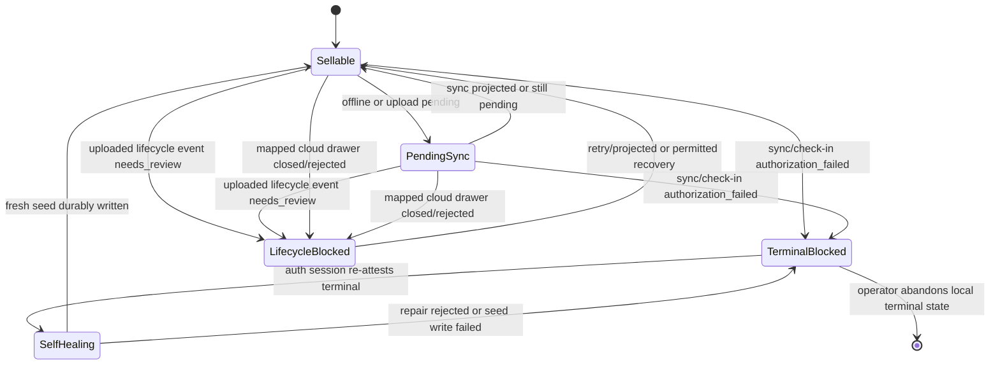
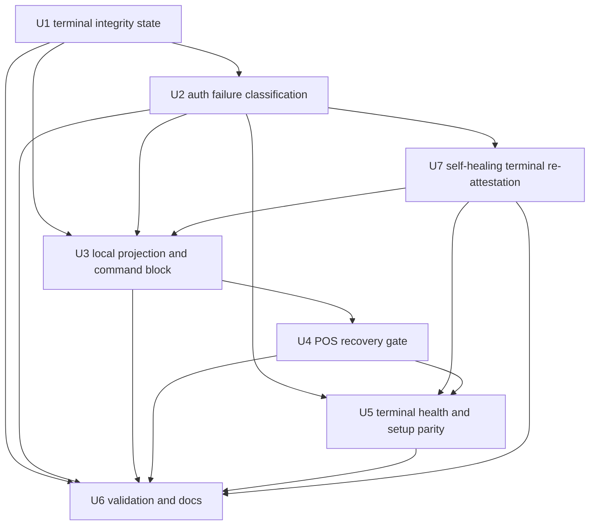
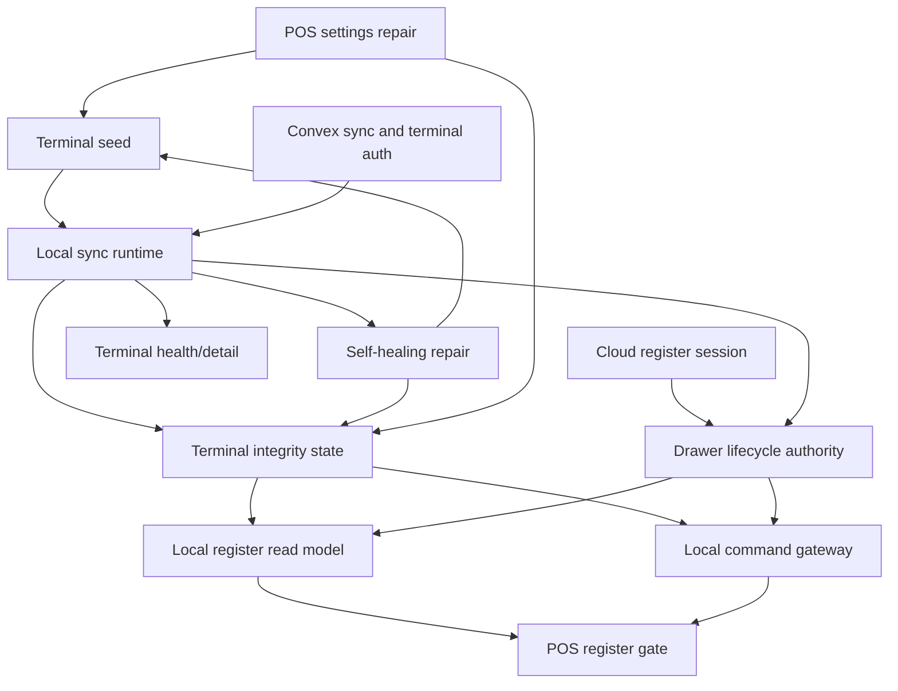

# fix: Block stale POS terminals from local sales

## Summary

Preserve Athena's POS local-first checkout contract while closing two stale-local-authority gaps found in browser IndexedDB state: ordinary offline or pending sync remains sellable, but a terminal that cloud explicitly rejects for sync/check-in authorization becomes locally sale-blocked while the browser attempts automatic re-attestation, and a local drawer whose mapped cloud register session is closed/rejected stops projecting as sellable. The implementation adds persistent terminal-integrity and drawer-lifecycle authority state, threads both through the local read model and command gateway, self-heals eligible sync-secret drift without deleting stranded local evidence, and falls back to an operator recovery gate only when repair cannot be trusted.

---

## Problem Frame

The Arc browser kept completing local-only POS sales from stale IndexedDB state even though Convex had no active register session for that Arc terminal and rejected the terminal's local sync token. The server behaved correctly by rejecting sync, but the browser treated that rejection like generic local review/pending sync and continued projecting a sellable drawer from local events.

A later Codex-browser investigation exposed a related but separate gap: the Codex terminal's cloud check-ins were succeeding, but IndexedDB still projected an open local drawer for a register session whose cloud register session had already closed. `localCommandGateway.openDrawer()` treated that local open drawer as idempotent success instead of appending a new open event or blocking, so there was no new drawer-open event for sync to upload and the register stayed locally sellable from stale drawer authority.

---

## Requirements

- R1. Keep POS local-first for provisioned terminals: normal offline and pending sync must not block checkout. Origin: R6, R9, R24, R32.
- R2. Treat sync upload or runtime check-in `authorization_failed` as a terminal integrity failure, not as ordinary pending sync or generic review.
- R3. Persist terminal-integrity failure locally so a reload or route re-entry cannot resume selling from the stale projection.
- R4. Make sale-start, cart mutation, payment update, service add, closeout reopen, drawer open, and transaction completion respect terminal-integrity blocks at command boundaries.
- R5. Make uploaded `needs_review` lifecycle events that affect drawer authority sale-blocking until retry, projection, or explicit operator recovery resolves them.
- R6. Attempt safe self-healing for eligible terminal sync-secret drift using the authenticated Athena session, terminal fingerprint, store scope, and existing terminal ownership before requiring operator intervention.
- R7. Show a calm POS recovery gate only when automatic repair is unavailable or fails, while preserving local event diagnostics for support.
- R8. Keep terminal health as support telemetry and Cash Controls as register reconciliation; do not introduce a new manager approval workflow in terminal setup.
- R9. Harden terminal re-provisioning so a cloud sync-secret rotation is not presented as successful unless the fresh local seed is durably written.
- R10. Add regression coverage for the stale Arc shape: local drawer/sale events exist, cloud authorization rejects sync/check-in, automatic repair is attempted, and checkout remains blocked unless repair succeeds without erasing local events.
- R11. Add regression coverage for the Codex-browser drawer lifecycle shape: the terminal check-in succeeds, local IndexedDB projects an open drawer, the mapped cloud `registerSession` is closed or the latest uploaded lifecycle event was rejected, and local open-drawer/start-sale/complete-sale paths remain blocked until a valid drawer authority is established.

**Origin actors:** A1 Cashier, A2 Store manager, A3 Athena POS terminal, A4 Athena cloud.
**Origin flows:** F1 Provision a POS terminal for offline use, F2 Operate the register while offline, F4 Finalize a local closeout before sync, F5 Sync and reconcile local POS history.
**Origin acceptance examples:** AE1, AE3, AE6, AE7, AE9.

---

## Scope Boundaries

- This plan does not change Athena's core local-first POS contract into cloud-confirm-before-sale.
- This plan does not automatically delete Arc IndexedDB data or stranded local sales.
- This plan does not add payment-provider-specific offline authorization behavior.
- This plan does not add cross-terminal offline coordination or real-time stock arbitration.
- This plan does not move manager reconciliation ownership out of Cash Controls / Operations.

### Deferred to Follow-Up Work

- One-off support tooling to export or repair stranded local IndexedDB events can follow after the sale-blocking invariant is in place.
- Fleet-wide alerting for terminal sync-secret drift can follow after terminal-integrity state is persisted and visible.
- Audit history for terminal sync-secret rotations can be planned separately if product support needs exact "who rotated this terminal" provenance.

---

## Context & Research

### Relevant Code and Patterns

- `packages/athena-webapp/src/lib/pos/infrastructure/local/posLocalStore.ts` owns IndexedDB stores, terminal seeds, events, mappings, readiness, staff authority, catalog, and availability snapshots.
- `packages/athena-webapp/src/lib/pos/infrastructure/local/usePosLocalSyncRuntime.ts` uploads local events, publishes runtime check-ins, records sync debug state, and already observes `authorization_failed` for check-in rejection.
- `packages/athena-webapp/src/lib/pos/infrastructure/local/terminalRuntimeStatus.ts` redacts local runtime evidence and exposes safe sync/readiness counters.
- `packages/athena-webapp/src/lib/pos/infrastructure/local/registerReadModel.ts` currently derives `canSell` from local drawer state and treats `register.reopened` as sellable without cloud confirmation or mapped cloud drawer lifecycle status.
- `packages/athena-webapp/src/lib/pos/infrastructure/local/localCommandGateway.ts` is the local-first command boundary for open drawer, start sale, cart/payment/service events, closeout, reopen, and completion; today `openDrawer` returns success for an existing local open drawer before checking whether mapped cloud drawer authority is still valid.
- `packages/athena-webapp/src/lib/pos/presentation/register/useRegisterViewModel.ts` composes terminal, local read model, drawer gate, sync runtime status, and cashier actions.
- `packages/athena-webapp/src/components/pos/register/POSRegisterView.tsx` renders the drawer gate, sync strip, local closeout pending workspace, and main register surface.
- `packages/athena-webapp/convex/pos/public/sync.ts` and `packages/athena-webapp/convex/pos/public/terminals.ts` reject stale terminal sync secrets with `authorization_failed`.
- `packages/athena-webapp/convex/pos/application/commands/terminals.ts` rotates the stored cloud sync secret when an existing fingerprint is re-provisioned.

### Institutional Learnings

- `docs/solutions/architecture/athena-pos-local-first-sync-2026-05-13.md` establishes the browser event log as the cashier-path durable record, with Convex projection as background reconciliation.
- `docs/solutions/architecture/athena-pos-always-local-first-register-2026-05-14.md` establishes that online state must not switch POS commands back to cloud-first behavior.
- `docs/solutions/logic-errors/athena-pos-drawer-invariants-at-command-boundaries-2026-04-24.md` establishes that drawer gates are ergonomics and invariants must live at command boundaries.
- `docs/solutions/architecture/athena-pos-terminal-health-visibility-2026-05-20.md` establishes terminal health as support telemetry, not manager reconciliation.
- `docs/solutions/logic-errors/athena-pos-terminal-review-reason-reconciliation-2026-05-26.md` establishes that local runtime review and cloud conflict evidence must stay distinct and safe to display.

### External References

- External research skipped. The issue is specific to Athena's POS IndexedDB event log, Convex terminal sync-secret contract, and existing local-first architecture.

---

## Key Technical Decisions

- Terminal auth rejection is a distinct local terminal-integrity state: This keeps normal offline/pending sync sellable while making explicit cloud rejection sale-blocking.
- Persist terminal-integrity state in POS local storage, not only in React debug state: Reloads and route entry must preserve the block.
- Block at local command boundaries as well as UI gates: A stale client or hidden control must not append new sale-affecting events after terminal integrity is broken.
- Treat uploaded lifecycle `needs_review` as drawer-authority-blocking when it affects register open, closeout, reopen, or completed sale state: Review/pending sync for ordinary sales can remain visible, but rejected lifecycle authority must not silently permit more sales.
- Treat mapped cloud drawer lifecycle as authority once a local drawer has a cloud `registerSession` mapping: If cloud reports that mapped drawer as closed, rejected, missing, or not current for this terminal/register, local projection must stop treating the stale open event as sellable.
- Self-healing is the first recovery path for eligible sync-secret drift: the browser may re-attest using normal Athena auth, fingerprint, store/register scope, and terminal ownership, but must not clear the block until the fresh local seed is durably stored.
- Operator intervention is the fallback path: revoked/lost terminals, ownership conflicts, register conflicts, missing access, persistent local storage failure, and ambiguous terminal identity remain blocked until a human repairs setup.
- Preserve local event evidence during recovery: Support needs diagnostics for stranded local events before any operator chooses to reset the terminal.

---

## Open Questions

### Resolved During Planning

- Should all pending sync block checkout? No. The product contract allows offline/pending local-first selling.
- Should `authorization_failed` be treated the same as `needs_review`? No. It means the terminal is no longer trusted by cloud and should stop appending sale-affecting local events.
- Is the Codex-browser drawer case the same as terminal auth failure? No. Terminal check-ins can succeed while drawer lifecycle authority is stale. It belongs to the lifecycle-authority block, not self-healing terminal re-attestation.
- Can this self-heal without operator intervention? Yes, when the signed-in user still has store access, the browser fingerprint maps to the same active terminal, the register assignment is unchanged, and IndexedDB can persist the returned seed. Otherwise it must stay blocked.
- Should terminal health own reconciliation? No. Terminal health explains support evidence; Cash Controls / Operations continue to own register review.

### Deferred to Implementation

- Exact local storage shape for terminal-integrity state: implementation should use the smallest compatible extension to `posLocalStore`, likely metadata under the existing local store boundary rather than a broad new persistence abstraction.
- Exact recovery copy and controls: implementation should follow `docs/product-copy-tone.md` and existing POS terminal setup copy after seeing the current view-model shape.
- Whether to add audit fields to terminal registration immediately: if implementation finds no safe timestamp/provenance path, keep it deferred rather than expanding this fix.

---

## High-Level Technical Design

> *This illustrates the intended approach and is directional guidance for review, not implementation specification. The implementing agent should treat it as context, not code to reproduce.*

The important split is between pending local-first work and explicit rejection. Offline, pending, and syncing states remain part of normal POS operation; rejected terminal authorization, unresolved lifecycle authority, or a mapped cloud drawer that is already closed/rejected blocks new sale-affecting commands. When the rejection is likely sync-secret drift, the browser can self-heal by re-attesting through authenticated terminal setup and writing a fresh local seed before resuming sales. When cloud drawer lifecycle contradicts local projection, recovery must establish a valid drawer authority before selling resumes.

---

## Implementation Units

- U1. **Persist terminal integrity and drawer authority state**

**Goal:** Add durable local representations of terminal integrity and drawer lifecycle authority so authorization failures and mapped cloud drawer contradictions survive reloads and can be consumed outside transient runtime debug state.

**Requirements:** R2, R3, R8, R10, R11.

**Dependencies:** None.

**Files:**
- Modify: `packages/athena-webapp/src/lib/pos/infrastructure/local/posLocalStore.ts`
- Modify: `packages/athena-webapp/src/lib/pos/infrastructure/local/terminalRuntimeStatus.ts`
- Test: `packages/athena-webapp/src/lib/pos/infrastructure/local/posLocalStore.test.ts`
- Test: `packages/athena-webapp/src/lib/pos/infrastructure/local/terminalRuntimeStatus.test.ts`

**Approach:**
- Represent terminal integrity as local metadata with statuses such as healthy, blocked for re-provision, or reset required.
- Represent drawer lifecycle authority as scoped local metadata tied to store, terminal, local register session, optional cloud register session mapping, and a safe blocked reason such as cloud closed, lifecycle rejected, or authority unknown.
- Store safe reason, observed timestamp, terminal/store/register identifiers, and last safe sync/check-in or drawer-authority context; do not store secrets, proof tokens, raw payloads, customer details, or payment details.
- Expose read/write helpers from the local store so the sync runtime, register reader, and view model can share one source of truth.
- Include terminal-integrity and drawer-authority status in safe runtime diagnostics so support copy can explain the block without exposing sensitive fields.

**Execution note:** Add characterization tests for current local-store terminal seed behavior before adding the integrity metadata path.

**Patterns to follow:**
- Terminal seed and metadata patterns in `posLocalStore.ts`.
- Redaction rules in `terminalRuntimeStatus.ts`.

**Test scenarios:**
- Happy path: writing a `requires_reprovision` integrity state persists it and reading it after a new store instance returns the same safe fields.
- Happy path: writing a drawer-authority block for a mapped cloud register session persists it and reading it after a new store instance returns the same safe fields.
- Happy path: clearing integrity state after re-provision removes the sale block without deleting local events.
- Edge case: integrity state for another store or terminal does not block the current scoped terminal.
- Edge case: drawer-authority state for another local/cloud register session does not block the current active drawer.
- Error path: local store write failure returns a user-safe store error.
- Error path: serialized runtime diagnostics do not contain sync secrets, staff proof tokens, PIN/verifier material, customer data, or payment details.

**Verification:**
- Terminal-integrity and drawer-authority state are available to local runtime and register code after route reload without reading React debug state.

---

- U2. **Classify sync and check-in authorization failures**

**Goal:** Convert cloud `authorization_failed` responses from local sync upload and runtime check-in into the persistent terminal-integrity block.

**Requirements:** R2, R3, R6, R10.

**Dependencies:** U1.

**Files:**
- Modify: `packages/athena-webapp/src/lib/pos/infrastructure/local/usePosLocalSyncRuntime.ts`
- Modify: `packages/athena-webapp/convex/pos/public/sync.ts`
- Modify: `packages/athena-webapp/convex/pos/public/terminals.ts`
- Test: `packages/athena-webapp/src/lib/pos/infrastructure/local/usePosLocalSyncRuntime.test.ts`
- Test: `packages/athena-webapp/convex/pos/public/sync.test.ts`
- Test: `packages/athena-webapp/convex/pos/public/terminals.test.ts`

**Approach:**
- Preserve the existing server-side terminal sync-secret checks; they are the correct trust boundary.
- When `ingestLocalEvents` returns `authorization_failed`, mark the terminal integrity state as requiring re-provision rather than marking the batch as ordinary review.
- When runtime check-in returns `authorization_failed`, mark the same terminal integrity state even if no upload batch was attempted.
- Keep network failure, unavailable server, stale telemetry, and ordinary rejected event payloads out of this terminal-auth bucket unless the server returned an auth failure.
- Ensure manual retry does not clear the block unless re-provision/reset updates the local seed or explicitly clears the terminal-integrity state.

**Patterns to follow:**
- Existing `checkInPublishReason` handling in `usePosLocalSyncRuntime.ts`.
- Existing `CommandResult` error codes in `shared/commandResult.ts` and public Convex terminal/sync mutations.

**Test scenarios:**
- Happy path: sync upload returns `authorization_failed` -> local terminal-integrity state becomes `requires_reprovision` and events remain preserved.
- Happy path: runtime check-in returns `authorization_failed` -> same integrity state is written even when there are no pending uploadable events.
- Happy path: eligible `authorization_failed` state schedules self-healing rather than immediately requiring a manual setup flow.
- Edge case: network exception during check-in -> runtime status is failed/unavailable but terminal integrity does not become blocked.
- Edge case: held/rejected local event payload -> event remains review/held but terminal integrity does not become blocked unless auth failed.
- Integration: manual retry while the stale seed remains unchanged reattempts safely but does not clear the block.

**Verification:**
- A stale sync token produces a persistent local terminal block instead of a generic needs-review state.

---

- U7. **Self-heal terminal re-attestation and seed persistence**

**Goal:** Automatically repair eligible sync-secret drift without operator intervention, while staying blocked when terminal identity, ownership, access, or local persistence cannot be trusted.

**Requirements:** R2, R3, R6, R7, R9, R10.

**Dependencies:** U1, U2.

**Files:**
- Modify: `packages/athena-webapp/src/lib/pos/application/registerAndProvisionPosTerminal.ts`
- Modify: `packages/athena-webapp/src/lib/pos/infrastructure/local/usePosLocalSyncRuntime.ts`
- Modify: `packages/athena-webapp/convex/pos/application/commands/terminals.ts`
- Modify: `packages/athena-webapp/convex/pos/public/terminals.ts`
- Modify: `packages/athena-webapp/src/components/pos/settings/POSSettingsView.tsx`
- Test: `packages/athena-webapp/src/lib/pos/application/registerAndProvisionPosTerminal.test.ts`
- Test: `packages/athena-webapp/src/lib/pos/infrastructure/local/usePosLocalSyncRuntime.test.ts`
- Test: `packages/athena-webapp/convex/pos/application/terminals.test.ts`
- Test: `packages/athena-webapp/convex/pos/public/terminals.test.ts`
- Test: `packages/athena-webapp/src/components/pos/settings/POSSettingsView.test.tsx`

**Approach:**
- Characterize the existing terminal registration behavior: an existing terminal found by fingerprint can rotate the cloud sync-secret hash and return the fresh token for local seed persistence.
- Add a repair path that can be invoked by the sync runtime when authorization fails and the browser is online with an authenticated Athena session.
- Allow automatic repair only when cloud confirms the same active terminal fingerprint, same store, same register assignment, same registered user or allowed ownership policy, and current store access.
- Write the fresh terminal seed locally before clearing the terminal-integrity block; if the seed write fails, keep the block and report repair failure.
- Preserve all existing local POS events and mappings during repair, then retry sync after the fresh seed is stored.
- Rate-limit or de-duplicate repair attempts so a bad terminal does not loop through endless cloud secret rotations.

**Execution note:** Start with a failing test where `ingestLocalEvents` returns `authorization_failed`, auto repair succeeds, the fresh seed is persisted, and the original local event uploads on retry.

**Patterns to follow:**
- Existing terminal provisioning contract in `registerAndProvisionPosTerminal.ts`.
- Existing `CommandResult` registration style in `convex/pos/public/terminals.ts` and `convex/pos/application/commands/terminals.ts`.

**Test scenarios:**
- Happy path: same active terminal fingerprint, same store/register, authenticated user still owns or can repair the terminal -> repair writes a fresh seed, clears the block, and retries sync.
- Happy path: cloud registration succeeds and local seed write succeeds -> terminal setup is considered repaired without manual operator action.
- Error path: cloud repair succeeds but local seed write fails -> terminal remains blocked and setup is not reported successful.
- Error path: terminal is revoked/lost, belongs to another user, register number conflicts, or store access is missing -> no self-heal; operator recovery gate remains.
- Edge case: repeated authorization failures after a repair attempt -> runtime does not spin indefinitely or keep rotating secrets.
- Integration: unsynced local sale events remain in IndexedDB throughout repair and are upload candidates after the fresh seed is persisted.

**Verification:**
- Eligible sync-secret drift repairs itself from the POS runtime; unsafe or ambiguous cases stay blocked and visible.

---

- U3. **Block local register projection and commands when terminal authority is broken**

**Goal:** Make the local read model and local command gateway enforce terminal-integrity and lifecycle-authority blocks so UI bypasses cannot append new sale-affecting events.

**Requirements:** R3, R4, R5, R10, R11.

**Dependencies:** U1, U2.

**Files:**
- Modify: `packages/athena-webapp/src/lib/pos/infrastructure/local/registerReadModel.ts`
- Modify: `packages/athena-webapp/src/lib/pos/infrastructure/local/localRegisterReader.ts`
- Modify: `packages/athena-webapp/src/lib/pos/infrastructure/local/localCommandGateway.ts`
- Modify: `packages/athena-webapp/src/lib/pos/infrastructure/local/syncStatus.ts`
- Test: `packages/athena-webapp/src/lib/pos/infrastructure/local/registerReadModel.test.ts`
- Test: `packages/athena-webapp/src/lib/pos/infrastructure/local/localCommandGateway.test.ts`
- Test: `packages/athena-webapp/src/lib/pos/infrastructure/local/syncStatus.test.ts`

**Approach:**
- Thread terminal-integrity state into the local register projection and derive an explicit sale-block reason alongside `canSell`.
- Thread mapped cloud register-session lifecycle into the local register projection. Once a local drawer has a cloud `registerSession` mapping, closed/rejected/missing/not-current cloud state overrides stale local open/reopen projection for sale authority.
- Keep `canSell` true for normal offline/pending sync, including uploadable events that have not been rejected by cloud.
- Set `canSell` false when terminal integrity requires re-provision/reset.
- Set `canSell` false when uploaded `needs_review` lifecycle events affect drawer authority, such as register open, register closeout, register reopen, or completed sale state for the active register timeline.
- Set `canSell` false when the active local drawer maps to a cloud `registerSession` that is closed or was rejected in lifecycle sync evidence, even if IndexedDB still contains an earlier open or reopen event.
- Require local command gateway methods that append sale-affecting events to check the block reason before writing. This includes start session, cart item/service append, payment update, cart clear, transaction completion, closeout, reopen, and drawer open where applicable.
- Make `openDrawer` respect the same drawer-authority block before returning idempotent success for an existing local open drawer. If cloud has closed/rejected the mapped drawer, `openDrawer` must either follow an explicit safe recovery path that creates a new valid local drawer authority or return a blocked `CommandResult`; it must not silently reuse the stale local drawer.
- Return operator-safe `CommandResult` messages instead of silent boolean failure for paths that currently return booleans, or at minimum centralize the blocked result before view-model presentation.

**Execution note:** Start with two characterization tests: the Arc-shaped local event log plus a terminal-integrity block, and the Codex-shaped local event log where terminal check-in succeeds but the mapped cloud register session is closed. Prove start/complete/cart/open-drawer commands reject while local events remain intact.

**Patterns to follow:**
- Drawer command-boundary invariant guidance in `docs/solutions/logic-errors/athena-pos-drawer-invariants-at-command-boundaries-2026-04-24.md`.
- Existing `CommandResult` style in local `openDrawer` and `startSession`.

**Test scenarios:**
- Happy path: terminal integrity healthy and upload pending -> local start sale and complete sale still append events.
- Happy path: terminal integrity requires re-provision -> start sale, add item, add service, payment update, complete sale, closeout, and reopen all reject without appending events.
- Edge case: stale block belongs to another terminal/store -> current terminal remains sellable.
- Edge case: uploaded `needs_review` `register.reopened` event exists for the active register -> `canSell` is false and later `session.started` does not reactivate selling.
- Edge case: active local drawer has a `cloudRegisterSessionId` mapping and Convex says that register session is `closed` -> `canSell` is false and `openDrawer` does not return the stale local drawer as success.
- Edge case: Codex-browser shape with successful runtime check-in, local open drawer from IndexedDB, no new `register.opened` sync row, and closed cloud drawer -> sale-start and transaction completion remain blocked until valid drawer authority is re-established.
- Edge case: uploaded `needs_review` ordinary completed sale exists for a past sale but the register lifecycle is healthy -> behavior follows the chosen lifecycle policy and is explicitly covered.
- Error path: local store read failure returns safe drawer/terminal gate state rather than appending events optimistically.

**Verification:**
- Stale terminal state cannot create new local sale events through either the UI path or direct local command gateway path.

---

- U4. **Add POS repair/recovery gate for stale terminals**

**Goal:** Give cashiers and managers a clear register-surface explanation while automatic repair is running, and a recovery route only when terminal integrity cannot self-heal.

**Requirements:** R2, R3, R4, R6, R7, R8, R10, R11.

**Dependencies:** U2, U3, U7.

**Files:**
- Modify: `packages/athena-webapp/src/lib/pos/presentation/register/useRegisterViewModel.ts`
- Modify: `packages/athena-webapp/src/components/pos/register/POSRegisterView.tsx`
- Modify: `packages/athena-webapp/src/lib/pos/presentation/syncStatusPresentation.ts`
- Test: `packages/athena-webapp/src/lib/pos/presentation/register/useRegisterViewModel.test.ts`
- Test: `packages/athena-webapp/src/components/pos/register/POSRegisterView.test.tsx`
- Test: `packages/athena-webapp/src/lib/pos/presentation/syncStatusPresentation.test.ts`

**Approach:**
- Extend the drawer/terminal gate model with terminal-integrity and drawer-lifecycle-authority modes distinct from missing drawer, closeout blocked, and locally closed pending sync.
- Disable product entry, service add, payment controls, checkout completion, closeout reopen, and drawer open actions while the terminal is blocked or repair is in progress.
- Show safe operational copy for three modes: automatic terminal repair in progress, manual setup recovery required, and drawer authority needs repair because cloud no longer considers the local drawer open.
- Keep sign out and navigation to setup/support available.
- Preserve existing sync status chip behavior for pending/offline states; only terminal integrity shows the stronger blocking gate.

**Patterns to follow:**
- Existing drawer gate modes in `useRegisterViewModel.ts` and `POSRegisterView.tsx`.
- Product copy guidance in `docs/product-copy-tone.md`.

**Test scenarios:**
- Happy path: terminal-integrity block exists and self-heal is running -> POS renders repair-in-progress gate instead of active register workspace and disables sale controls.
- Happy path: terminal-integrity block exists and self-heal is not eligible -> POS renders manual recovery gate with setup/support navigation.
- Happy path: mapped cloud drawer is closed while local IndexedDB still projects open -> POS renders a drawer authority recovery gate instead of active register workspace.
- Happy path: offline pending sync without auth failure -> POS remains usable and shows pending/offline sync status, not the terminal recovery gate.
- Edge case: route loads before terminal integrity read resolves -> UI does not briefly enable checkout from a known blocked terminal.
- Edge case: blocked terminal with active local cart -> cart evidence remains visible only where current UI safely supports it; completion remains disabled.
- Error path: command handler called while gate is active -> safe toast/inline error and no event append.

**Verification:**
- A cashier cannot complete a sale from the stale-terminal register surface, automatic repair state is visible, and manual setup recovery appears only when repair cannot proceed.

---

- U5. **Align terminal setup, health, and recovery evidence**

**Goal:** Keep terminal setup, POS register diagnostics, and terminal health consistent about stale terminal authorization and stale drawer lifecycle authority without moving reconciliation ownership.

**Requirements:** R6, R7, R8, R9, R10, R11.

**Dependencies:** U2, U4, U7.

**Files:**
- Modify: `packages/athena-webapp/src/components/pos/settings/POSSettingsView.tsx`
- Modify: `packages/athena-webapp/src/components/pos/terminals/POSTerminalDetailView.tsx`
- Modify: `packages/athena-webapp/src/components/pos/terminals/terminalHealthPresentation.ts`
- Modify: `packages/athena-webapp/convex/pos/application/queries/terminals.ts`
- Test: `packages/athena-webapp/src/components/pos/settings/POSSettingsView.test.tsx`
- Test: `packages/athena-webapp/src/components/pos/terminals/POSTerminalDetailView.test.tsx`
- Test: `packages/athena-webapp/src/components/pos/terminals/terminalHealthPresentation.test.ts`
- Test: `packages/athena-webapp/convex/pos/application/terminals.test.ts`

**Approach:**
- Surface terminal-integrity failure as automatic repair or setup repair, not as cash reconciliation work.
- Surface drawer-authority failure as register setup/recovery evidence, not as terminal sync-secret repair and not as cash variance reconciliation by itself.
- In POS Settings, make successful re-provision write the fresh local terminal seed and clear the terminal-integrity block.
- In Terminal Health/detail, explain stale terminal authorization as support evidence when the latest runtime status reports it, while continuing to hide secrets and raw payloads.
- Avoid adding approval or conflict-resolution actions to terminal health; link to existing setup or register evidence surfaces where useful.
- Keep older terminals without integrity metadata readable by falling back to existing status presentation.

**Patterns to follow:**
- Terminal health boundary in `docs/solutions/architecture/athena-pos-terminal-health-visibility-2026-05-20.md`.
- Terminal review reason separation in `docs/solutions/logic-errors/athena-pos-terminal-review-reason-reconciliation-2026-05-26.md`.

**Test scenarios:**
- Happy path: automatic repair succeeds -> register/terminal health no longer shows the stale-auth block and local sync can retry.
- Happy path: terminal re-provision succeeds -> local seed updates and terminal-integrity block clears.
- Happy path: drawer authority is repaired by establishing a valid open drawer -> register/terminal health no longer shows the stale drawer-authority block.
- Happy path: terminal detail receives runtime authorization-failure evidence -> renders setup-repair/support explanation without manager-review copy.
- Edge case: terminal health has stale telemetry but no auth failure -> stale/pending copy is shown instead of setup repair.
- Error path: re-provision returns `authorization_failed` or validation error -> local block remains and copy stays safe.
- Integration: public terminal summary/detail validators accept any added safe attention reason fields.

**Verification:**
- Setup, register, and support surfaces tell the same story: terminal-auth failures need terminal repair; mapped drawer lifecycle failures need valid drawer authority; neither should be mislabeled as a drawer variance by default.

---

- U6. **Validation, graph, and operator documentation**

**Goal:** Lock the invariant into tests, harness coverage, graphify output, and reusable solution docs so future POS local-first changes do not reintroduce stale-terminal selling.

**Requirements:** R1, R2, R3, R4, R5, R6, R7, R8, R9, R10, R11.

**Dependencies:** U1, U2, U3, U4, U5, U7.

**Files:**
- Modify: `scripts/harness-app-registry.ts`
- Modify: `packages/athena-webapp/docs/agent/validation-map.json`
- Modify: `packages/athena-webapp/docs/agent/validation-guide.md`
- Modify: `docs/solutions/architecture/athena-pos-local-first-sync-2026-05-13.md`
- Create: `docs/solutions/logic-errors/athena-pos-stale-terminal-sale-block-2026-05-29.md`
- Modify: `graphify-out/GRAPH_REPORT.md`
- Modify: `graphify-out/graph.json`
- Test: `scripts/harness-app-registry.test.ts`
- Test: `scripts/harness-audit.test.ts`

**Approach:**
- Add or tighten validation-map coverage for terminal-integrity state, local sync runtime auth failures, self-healing repair, cloud drawer lifecycle authority, register read-model sale blocking, local command gateway sale blocking, POS register recovery gate, POS Settings re-provision, and terminal health explanation.
- Document the invariant: local-first allows offline/pending; explicit terminal authorization failure pauses new sale-affecting local events while safe repair runs, and explicit cloud drawer lifecycle rejection/closure pauses selling until valid drawer authority is established.
- Regenerate harness docs rather than editing generated validation files by hand.
- Rebuild graphify after code changes during implementation so graph artifacts reflect the new terminal-integrity surfaces.

**Patterns to follow:**
- Existing validation guidance for POS local sync/register infrastructure in `packages/athena-webapp/docs/agent/testing.md`.
- Existing solution docs under `docs/solutions/architecture/` and `docs/solutions/logic-errors/`.

**Test scenarios:**
- Happy path: harness registry maps every touched terminal-integrity and POS register surface to focused tests.
- Happy path: validation coverage includes the self-healing repair success and repair-denied fallback paths.
- Happy path: validation coverage includes the Codex-browser shape where runtime check-in succeeds but local drawer projection is stale against a closed mapped cloud register session.
- Edge case: generated validation-map paths remain current after the new files are added.
- Integration: graphify rebuild captures the new local integrity state and command-gateway/read-model edges.

**Verification:**
- Future touched-file review requests the focused POS local sync/register test set when these surfaces change.

---

## System-Wide Impact

- **Interaction graph:** Terminal seed, local sync runtime, self-healing repair, terminal integrity metadata, drawer lifecycle authority, register read model, local command gateway, register UI, POS Settings, terminal health, cloud register sessions, and Convex sync/terminal auth all interact.
- **Error propagation:** `authorization_failed` must remain a safe `CommandResult` from Convex, become persistent terminal-integrity state in the browser, and render as setup repair rather than raw backend failure text.
- **State lifecycle risks:** Cloud can rotate terminal sync secrets while stale IndexedDB remains, and cloud can close/reject a mapped drawer while IndexedDB still projects it open. Blocks must survive reloads and clear only after automatic terminal repair, re-provision, valid drawer authority, or explicit reset.
- **Repair loop risks:** Automatic repair must be rate-limited/deduplicated and must stop on revoked/lost terminals, ownership conflicts, register conflicts, missing access, or repeated local persistence failure.
- **API surface parity:** Runtime status, sync status presentation, register view model, terminal health, and POS Settings must agree on blocked vs pending/offline semantics.
- **Integration coverage:** Tests must cross local store, sync runtime, projection/read model, command gateway, register UI, and terminal setup because the bug was caused by individually correct layers failing to share a blocking state.
- **Unchanged invariants:** POS remains local-first for normal offline operation; terminal health remains support telemetry; Cash Controls remains manager reconciliation.

---

## Risks & Dependencies

| Risk | Mitigation |
|------|------------|
| Blocking too aggressively breaks the local-first POS promise | Make only explicit cloud authorization failure, uploaded lifecycle-authority review, and mapped cloud drawer closure/rejection sale-blocking; keep offline/pending sellable. |
| Blocking only the UI leaves command bypasses | Enforce terminal-integrity state inside `localCommandGateway` and projection-derived `canSell`, not just `POSRegisterView`. |
| Stale local open drawer keeps bypassing cloud closeout | Treat mapped cloud register-session `closed`/rejected/missing authority as sale-blocking before `openDrawer` can return idempotent local success. |
| Self-healing hides a real security/access problem | Self-heal only when cloud verifies same active terminal fingerprint, same store/register scope, and allowed user/access policy. |
| Self-healing loops or rotates secrets repeatedly | Rate-limit and de-duplicate repair attempts; keep the terminal blocked after repeated failure. |
| Re-provision or self-healing clears useful evidence | Clear the integrity block and update the seed without deleting local event history by default. |
| Cloud repair succeeds but local seed write fails | Treat setup as failed/repair-needed and keep the terminal sale-blocked until seed persistence succeeds. |
| Existing stale terminals stay confusing in support tools | Surface safe terminal-integrity evidence in runtime status and terminal detail without exposing secrets or payloads. |
| Local storage schema changes strand older terminals | Add compatibility defaults and scoped reads so missing integrity metadata means unknown/healthy unless explicit auth failure is observed. |

---

## Documentation / Operational Notes

- Document the operational rule as: "offline and pending are allowed; rejected terminal authorization pauses selling while safe repair runs, and rejected or closed cloud drawer authority pauses selling until a valid drawer is established."
- Include support guidance for exporting or inspecting stranded local events before any manual local reset.
- Re-run graphify after implementation code changes, per repo AGENTS guidance.
- If generated Convex artifacts are required, use `bunx convex dev --once` from `packages/athena-webapp`, not `bunx convex codegen`.

---

## Sources & References

- **Origin document:** [docs/brainstorms/2026-05-13-pos-local-first-register-requirements.md](../brainstorms/2026-05-13-pos-local-first-register-requirements.md)
- Related plan: [docs/plans/2026-05-26-001-fix-pos-terminal-review-gap-plan.md](2026-05-26-001-fix-pos-terminal-review-gap-plan.md)
- Related code: `packages/athena-webapp/src/lib/pos/infrastructure/local/posLocalStore.ts`
- Related code: `packages/athena-webapp/src/lib/pos/infrastructure/local/usePosLocalSyncRuntime.ts`
- Related code: `packages/athena-webapp/src/lib/pos/infrastructure/local/registerReadModel.ts`
- Related code: `packages/athena-webapp/src/lib/pos/infrastructure/local/localCommandGateway.ts`
- Related code: `packages/athena-webapp/src/lib/pos/presentation/register/useRegisterViewModel.ts`
- Related code: `packages/athena-webapp/src/components/pos/register/POSRegisterView.tsx`
- Related code: `packages/athena-webapp/convex/pos/application/queries/getRegisterState.ts`
- Related data: `registerSession`, `posLocalSyncEvent`, `posLocalSyncCursor`, `posLocalSyncConflict`
- Related code: `packages/athena-webapp/src/lib/pos/application/registerAndProvisionPosTerminal.ts`
- Related code: `packages/athena-webapp/convex/pos/public/sync.ts`
- Related code: `packages/athena-webapp/convex/pos/public/terminals.ts`
- Related code: `packages/athena-webapp/convex/pos/application/commands/terminals.ts`
- Institutional learning: [docs/solutions/architecture/athena-pos-local-first-sync-2026-05-13.md](../solutions/architecture/athena-pos-local-first-sync-2026-05-13.md)
- Institutional learning: [docs/solutions/architecture/athena-pos-always-local-first-register-2026-05-14.md](../solutions/architecture/athena-pos-always-local-first-register-2026-05-14.md)
- Institutional learning: [docs/solutions/logic-errors/athena-pos-drawer-invariants-at-command-boundaries-2026-04-24.md](../solutions/logic-errors/athena-pos-drawer-invariants-at-command-boundaries-2026-04-24.md)
