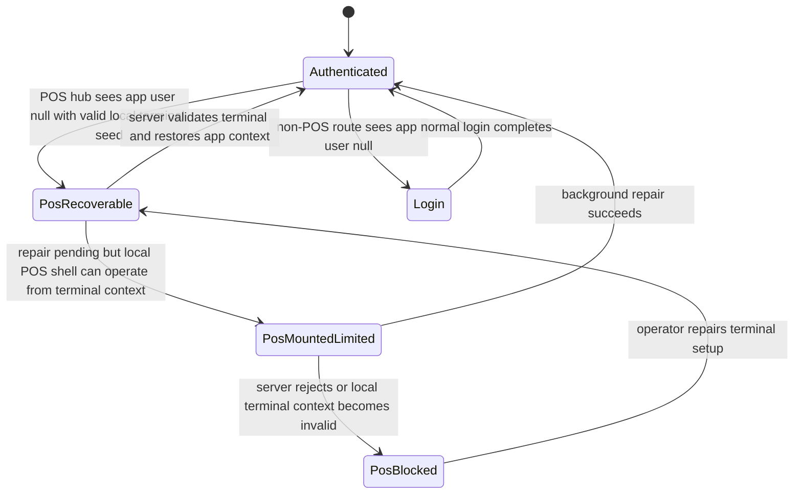
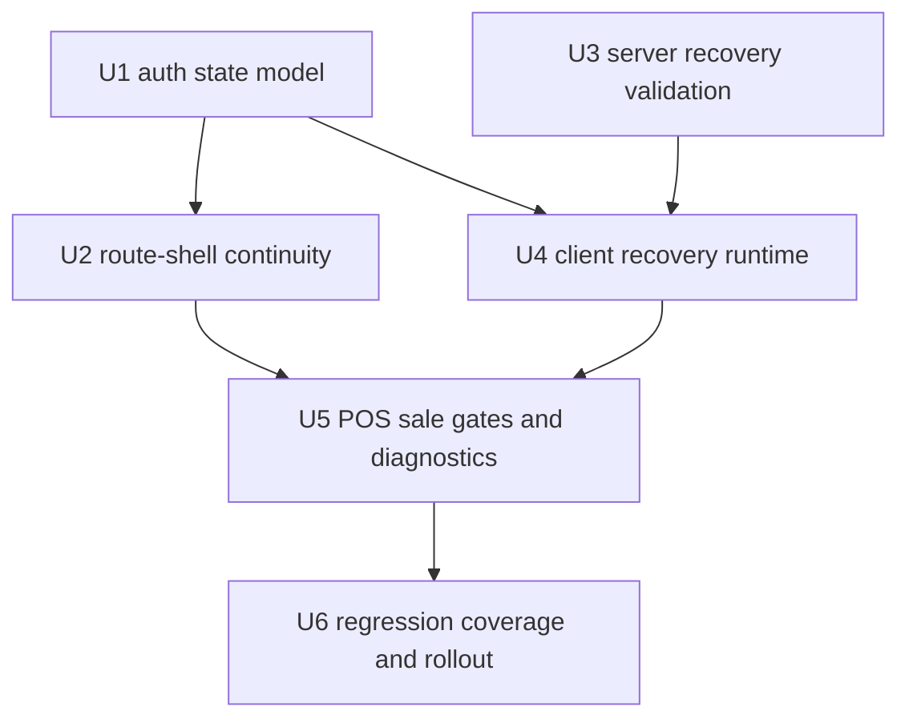
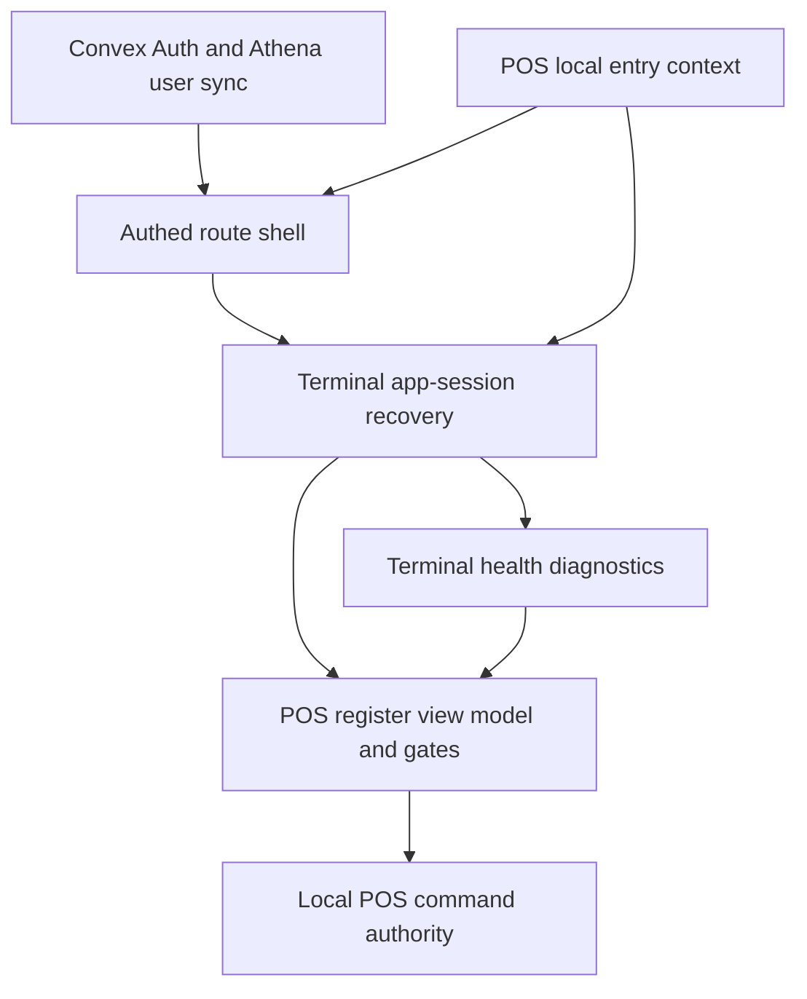

# feat: Keep POS hub app sessions recoverable

## Summary

Keep registered POS terminals operating when the app-level Athena login drifts into a recoverable signed-out state. The plan adds a POS-hub app-session continuity layer that validates the terminal server-side, restores or projects the `pos@wigclub.store` app context in the background, and keeps local-first sale authority tied to terminal integrity, drawer authority, and staff proof rather than a fragile browser login screen.

---

## Problem Frame

The current app shell treats the POS hub like every other authenticated route: when `useAuth()` resolves `user === null`, `packages/athena-webapp/src/routes/_authed.tsx` navigates to `/login`. That is acceptable for administrative surfaces, but it interrupts daily POS operations when a browser that already belongs to a provisioned POS terminal loses or fails to rehydrate its app login.

The repo already separates several authorities that matter here:

- App login identifies the Athena web app user and unlocks general app navigation.
- Terminal trust comes from provisioned local POS terminal state and server terminal records.
- Staff authority comes from terminal-scoped staff proof, not the app account.
- Sale authority depends on drawer lifecycle, terminal integrity, and local command invariants.

The state can happen when a Convex Auth session expires, the inactive session limit is reached, browser storage/cookies are cleared, the Convex token rehydrates after the route guard has already settled, the Athena user sync layer loses `logged_in_user_id`, or the app account is revoked/disabled. A static Athena deploy is a concrete trigger because `packages/athena-webapp/src/main.tsx` starts `createVersionChecker()`, and `packages/athena-webapp/src/utils/versionChecker.ts` polls the HTML entry point for changed asset scripts and calls `window.location.reload()` through the supplied callback. That deploy reload does not appear to intentionally clear auth or browser storage, but it does force the app through auth rehydration. The current route guard does not distinguish those cases from an intentional sign-out, so it sends a cashier to the generic login flow even when the local terminal context is otherwise recoverable.

---

## Requirements

- R1. POS hub routes must not redirect to `/login` for recoverable app-login drift when the browser has a valid local POS terminal seed for the same store.
- R2. Non-POS routes, including Operations, Cash Controls, Products, Services, Admin, and POS settings, must keep the existing login redirect behavior for `user === null`.
- R3. Recovery must validate terminal, store, app account, and account capability server-side before restoring or projecting the app context.
- R4. Recovery must not store reusable app credentials, staff PINs, staff verifier material, raw auth tokens, or one-time login codes in browser storage.
- R5. POS sale authority must continue to require terminal integrity, valid drawer lifecycle authority, local command invariants, and staff proof where staff authorization is required.
- R6. Recoverable states should keep the register mounted and attempt background repair with bounded retries and observable status.
- R7. Unrecoverable states must render a POS-specific operational gate instead of the generic login flow, with safe reasons and an explicit recovery path for cases such as missing terminal seed, store mismatch, revoked terminal, disabled app account, or server validation failure.
- R8. The terminal health diagnostics should expose app-session recovery status in support-safe terms without leaking secrets or staff/customer/payment data.
- R9. Tests must prove POS hub continuity, non-POS redirect parity, server validation failures, retry behavior, and sale-gate invariants.
- R10. If implementation falls back to a POS-scoped app-session assertion instead of a full Convex Auth session, that assertion must be short-lived, same-store, same-terminal, route-scoped to the POS hub, and abuse-resistant.
- R11. Static deploy reloads must be treated as auth rehydration events for the POS hub, not as intentional logout. Transient auth recovery after deploy must not clear local POS app-session continuity or navigate to `/login`.

---

## Scope Boundaries

- This plan is scoped to the protected POS hub route family under the `_authed` shell. POS register is a covered child route, not the full boundary.
- This plan does not make every Athena web route perpetually logged in.
- This plan does not change the global Convex Auth session duration policy as the primary fix.
- This plan does not store the `pos@wigclub.store` password, OTP code, magic link, session cookie, or reusable bearer token in local storage or IndexedDB.
- This plan does not weaken staff authorization, manager elevation, manager command approval, terminal-integrity checks, or drawer lifecycle authority.
- This plan does not move the POS event ledger into localStorage or replace the existing IndexedDB local-first POS record.
- This plan does not add visual validation work; the user explicitly reserved visual validation.

### Deferred to Follow-Up Work

- Extend the continuity model outside the POS hub, such as Operations, Daily Close, Cash Controls, or other store-day surfaces, only after the POS hub path is proven.
- Add fleet-level alerting or dashboards for repeated app-session recovery failures.
- Add an operator self-service reset flow for terminal app-session bindings if support needs more than diagnostics.
- Revisit global auth session durations only after the terminal-scoped path is working and measured.

---

## Context & Research

### Relevant Code and Patterns

- `packages/athena-webapp/convex/authConfig.ts` defines the current Athena Convex Auth session policy: long-lived sessions, inactive timeout, and shorter JWT duration. This reduces normal churn but still permits legitimate session loss.
- `packages/athena-webapp/convex/auth.ts` wires Convex Auth providers and Athena session/JWT config.
- `packages/athena-webapp/convex/app.ts` exposes `getCurrentUser`, which returns null when Convex has no authenticated user.
- `packages/athena-webapp/convex/inventory/auth.ts` contains `syncAuthenticatedAthenaUser`, the existing server path that maps a Convex identity to an Athena user and reports retryable authentication failures.
- `packages/athena-webapp/src/hooks/useAuth.ts` combines Convex Auth, auth token recovery, `api.app.getCurrentUser`, Athena user sync, and `LOGGED_IN_USER_ID_KEY`.
- `packages/athena-webapp/src/routes/_authed.tsx` owns the login redirect, the current POS offline loading exception, and the app shell that wraps `_authed` routes.
- `packages/athena-webapp/src/routes/login/_layout.tsx` already repairs an authenticated Convex session that is missing a local Athena user id after OTP handoff.
- `packages/athena-webapp/src/components/auth/Login/InputOTP.tsx` marks pending Athena auth sync and navigates back into the app after OTP success.
- `packages/athena-webapp/src/main.tsx` starts `createVersionChecker()` and reloads the app when a new static asset version is detected.
- `packages/athena-webapp/src/utils/versionChecker.ts` polls `/?_=...` every minute, detects changed asset script references, and invokes the reload callback.
- `scripts/deploy-vps.sh` builds the Athena static app with the production Convex URL by default; targeted local search found no non-test `Clear-Site-Data`, broad `localStorage.clear()`, or broad `sessionStorage.clear()` path in the app/deploy files.
- `packages/athena-webapp/src/lib/pos/infrastructure/local/localPosEntryContext.ts` resolves whether a POS route has live cloud context, local provisioned terminal seed context, missing seed, store mismatch, or unsupported local schema.
- `packages/athena-webapp/src/hooks/useGetTerminal.ts` reads stored terminal fingerprint and falls back to a local provisioned seed when cloud terminal query data is unavailable.
- `packages/athena-webapp/src/lib/pos/infrastructure/local/terminalRuntimeStatus.ts` and `packages/athena-webapp/src/lib/pos/infrastructure/local/usePosLocalSyncRuntime.ts` are the right support-telemetry boundary for safe terminal runtime status.
- `packages/athena-webapp/src/components/pos/register/POSRegisterOpeningGuard.tsx` and `packages/athena-webapp/src/components/pos/register/RegisterDrawerGate.tsx` are the existing POS operational gate surfaces.

### Institutional Learnings

- `docs/solutions/architecture/athena-pos-local-first-sync-2026-05-13.md` establishes the local POS event log as the cashier-path durable record and keeps Convex sync in the background.
- `docs/solutions/architecture/athena-pos-local-staff-authority-2026-05-14.md` establishes terminal-scoped staff proof as distinct from app login.
- `docs/solutions/logic-errors/athena-terminal-manager-elevation-command-boundary-2026-05-10.md` establishes that terminal access, manager elevation, and command approval must stay separate.
- `docs/solutions/architecture/athena-pos-terminal-health-visibility-2026-05-20.md` establishes terminal health as support telemetry rather than a manager reconciliation surface.
- `docs/product-copy-tone.md` governs any operator-facing recovery copy.

### External References

- Official Convex Auth documentation should be consulted during implementation for the exact supported way to restore a Convex Auth client session or issue a scoped replacement. This plan intentionally does not depend on undocumented client cookie or token manipulation.

---

## Key Technical Decisions

| Decision | Rationale |
|---|---|
| Use POS hub sales/runtime continuity, not global never-expiring login | The business requirement is POS hub continuity for register, session, transaction, expense, and terminal-health support workflows. Extending this to every web surface, including POS Settings and terminal configuration, would increase the blast radius and expose admin/operations screens to machine-session assumptions. |
| Validate recovery server-side from terminal identity and store scope | Local terminal seed proves this browser was provisioned, but revocation, store mismatch, disabled app account, and terminal reassignment must be checked by the server before app context is restored. |
| Keep sale authority outside the app-session layer | App login continuity should keep the app mounted, not authorize sales by itself. Terminal integrity, drawer authority, local command boundaries, and staff proof remain the sale gates. |
| Prefer background repair over a cashier-facing login redirect | A registered terminal should heal recoverable app-session drift without asking cashiers to handle the shared app account during a sale rush. |
| Fail closed into a POS operational gate for non-recoverable states | Missing seed, mismatched store, revoked terminal, disabled app account, and invalid terminal proof are not login UX problems. They need a setup/support gate with safe diagnostics. |
| Reuse the POS local-entry and terminal runtime boundaries | `localPosEntryContext.ts` already classifies local terminal readiness, and terminal health is already the support telemetry channel. A parallel greenfield auth subsystem would duplicate this context. |
| Keep exact Convex Auth session restoration as an implementation-time integration detail | The chosen product/security behavior is clear, but the exact mechanism must match supported Convex Auth APIs. If full Convex Auth reminting is not supported, the fallback is a POS-scoped terminal app-session projection for the POS hub only. |
| Treat any POS-scoped assertion as temporary proof, not a durable credential | If a fallback assertion is required, it should be short-lived, same-store, same-terminal, rate-limited at recovery, and unusable outside the POS hub route family. |
| Treat static deploy as forced reload, not logout | The existing version checker intentionally reloads after asset changes. POS continuity should survive the resulting auth rehydration window unless server validation proves the session, terminal, or app account is no longer trusted. |

---

## Open Questions

### Resolved During Planning

- Should this apply to the whole Athena app? No. The confirmed scope is the POS hub now, with other surfaces deferred.
- Should the solution make global app sessions infinite? No. It should provide terminal-scoped recovery for the POS hub and leave global web auth policy intact.
- Should cashiers enter shared app-account credentials during busy sales? No. Recoverable POS terminal sessions should repair in the background.
- Does app-session continuity replace staff proof? No. Staff authority remains terminal-scoped and command-specific.
- Is a static Athena deploy an intentional logout? No. It is a forced app reload caused by asset-version detection, so the POS hub should treat it as an auth rehydration trigger unless real revocation or sign-out evidence appears.

### Deferred to Implementation

- Exact Convex Auth restoration path: verify whether the supported implementation should remint a Convex Auth session, complete an existing recovery handshake, or keep a POS-scoped app-session projection for POS hub sales/runtime reads.
- Exact server module placement: prefer a small POS terminal app-session module, but choose the final Convex file location based on existing public/internal boundary conventions during implementation.
- Exact local metadata schema: use the smallest compatible extension to existing POS local storage and runtime-status patterns after reading current indexed stores and migration conventions.
- Exact rollout flag shape: choose an existing feature flag or environment pattern if one exists; otherwise scope by route and server-side capability without creating a broad flag framework.

---

## High-Level Technical Design

> *This illustrates the intended approach and is directional guidance for review, not implementation specification. The implementing agent should treat it as context, not code to reproduce.*

The app shell needs a route-scoped auth classification instead of a boolean `user === null -> login` decision. For the POS hub, a missing app user can be one of three states:

| State | Meaning | Route behavior | Sale behavior |
|---|---|---|---|
| Loading | Convex Auth, token recovery, or Athena user sync is still unresolved | Keep current loading behavior | No new authority granted |
| Recoverable POS terminal | App user is missing, but local POS entry context has a same-store provisioned terminal seed | Mount POS hub shell and start background recovery | Allowed only if existing POS local gates say sellable |
| Blocked POS terminal | Local terminal seed is missing, mismatched, revoked, invalid, or server recovery rejects | Show POS setup/support gate | Block sale-affecting commands |
| Signed out | Non-POS route or no recoverable POS terminal context | Redirect to `/login` | Not applicable |

---

## Implementation Units

- U1. **Model route-scoped POS hub app-session state**

**Goal:** Add a small state model that distinguishes normal signed-out app state from recoverable POS terminal app-session drift.

**Requirements:** R1, R2, R3, R6, R7, R11.

**Dependencies:** None.

**Files:**
- Modify: `packages/athena-webapp/src/hooks/useAuth.ts`
- Modify: `packages/athena-webapp/src/routes/_authed.tsx`
- Modify: `packages/athena-webapp/src/lib/constants.ts` if a new storage key is needed
- Test: `packages/athena-webapp/src/hooks/useAuth.test.tsx`
- Test: `packages/athena-webapp/src/routes/_authed.test.tsx`

**Approach:**
- Keep `useAuth()` responsible for current Convex/Athena auth loading and authenticated-user state.
- Add a POS-specific classification near the route guard, or a small helper used by the route guard, that combines route pathname, `useAuth()` state, browser online status, stored app user id, and local POS terminal readiness.
- Preserve the existing offline POS shell behavior while adding the online recoverable case. The key difference is that POS hub routes can remain mounted after `user === null` only when local POS terminal context is valid for the route store.
- Treat a deploy-induced reload as a common path into this state. Do not let a transient `user === null` during auth rehydration erase `logged_in_user_id` or force `/login` before the POS recovery classifier has evaluated terminal continuity.
- Do not make `useAuth()` return a fake full Athena user for all consumers. If a POS-scoped projected app context is required, keep it explicitly named and route-scoped.
- Keep non-POS routes on the current redirect path so Operations and Admin do not inherit terminal-session behavior.

**Execution note:** Start with route-guard tests that reproduce the current login redirect after `user === null` on POS hub paths with local terminal context.

**Patterns to follow:**
- Current loading recovery in `packages/athena-webapp/src/hooks/useAuth.ts`.
- Current POS offline shell exception in `packages/athena-webapp/src/routes/_authed.tsx`.
- Local entry classification in `packages/athena-webapp/src/lib/pos/infrastructure/local/localPosEntryContext.ts`.

**Test scenarios:**
- Happy path: POS hub route with `user === null` and same-store local terminal seed renders the POS shell and does not call `navigate({ to: "/login" })`.
- Happy path: POS register remains covered as a POS hub child route while Convex token recovery is loading.
- Edge case: router pathname is temporarily `/` but browser pathname is a POS hub path; the route guard still classifies the page as POS hub.
- Edge case: after an app reload, Convex Auth briefly reports no user while local terminal context is valid; POS hub remains mounted and recovery starts instead of clearing continuity state.
- Edge case: POS routes that are intentionally outside terminal continuity, if any, are explicitly tested rather than accidentally covered.
- Error path: Products, Operations, Cash Controls, and Admin routes with `user === null` still redirect to login.
- Error path: POS hub route with missing local terminal seed redirects or blocks according to the new POS blocked-state design, not the recoverable path.
- Integration: local `LOGGED_IN_USER_ID_KEY` removal does not erase recoverable terminal context or local POS event evidence.

**Verification:**
- POS hub has an explicit recoverable app-session state and non-POS redirect parity is unchanged.

---

- U2. **Render a POS hub continuity shell instead of generic login**

**Goal:** Keep the POS hub mounted during recoverable app-session drift without letting unrelated authenticated app chrome assume a full app user exists.

**Requirements:** R1, R2, R6, R7.

**Dependencies:** U1.

**Files:**
- Modify: `packages/athena-webapp/src/routes/_authed.tsx`
- Modify: `packages/athena-webapp/src/components/pos/PointOfSaleView.tsx` if route-level state needs to be passed into POS
- Modify: `packages/athena-webapp/src/components/pos/register/POSRegisterOpeningGuard.tsx`
- Modify: `packages/athena-webapp/src/components/pos/register/RegisterDrawerGate.tsx`
- Test: `packages/athena-webapp/src/routes/_authed.test.tsx`
- Test: `packages/athena-webapp/src/components/pos/PointOfSaleView.test.tsx`
- Test: `packages/athena-webapp/src/components/pos/register/POSRegisterOpeningGuard.test.tsx`

**Approach:**
- Add a shell mode such as authenticated, POS terminal recovering, POS terminal blocked, and signed out. The name can change during implementation, but the state boundary should remain explicit.
- In POS terminal recovering mode, render only POS hub routes and the app shell elements that are safe without a full app user. Avoid exposing menus or admin navigation whose permission checks assume an authenticated user.
- Show a small operational status in the register surface only if needed for support awareness. Avoid asking cashiers to sign into the shared app account.
- In POS terminal blocked mode, render the existing POS operational gate pattern with a safe reason and retry/repair affordance when recovery is possible.
- Keep existing fullscreen POS behavior intact.

**Patterns to follow:**
- App shell and fullscreen handling in `packages/athena-webapp/src/routes/_authed.tsx`.
- POS opening and drawer gates in `packages/athena-webapp/src/components/pos/register/POSRegisterOpeningGuard.tsx` and `packages/athena-webapp/src/components/pos/register/RegisterDrawerGate.tsx`.
- Product copy tone in `docs/product-copy-tone.md`.

**Test scenarios:**
- Happy path: recovering POS shell renders the POS hub outlet with no generic login navigation.
- Happy path: fullscreen register behavior remains active in recovering mode.
- Edge case: generic app header user menu is not shown with a fake or blank full app user in recovering mode.
- Error path: blocked POS terminal state renders a POS setup/support gate with a safe reason and the next recovery path when one exists.
- Error path: blocked POS terminal state does not expose raw backend errors, tokens, or stack traces.
- Integration: existing POS drawer/opening gates still render when the register child route is active inside the continuity shell.

**Verification:**
- A provisioned POS terminal remains in the POS hub during recoverable app-session drift, while non-POS app chrome does not grant extra access.

---

- U3. **Add server-side terminal app-session recovery validation**

**Goal:** Provide a server-validated recovery path that determines whether this browser terminal may restore or project the POS app account context for the current store's POS hub.

**Requirements:** R3, R4, R7, R8, R10.

**Dependencies:** U1.

**Files:**
- Create or modify: `packages/athena-webapp/convex/pos/public/terminalAppSessions.ts`
- Modify if better aligned with existing auth boundaries: `packages/athena-webapp/convex/inventory/auth.ts`
- Modify if terminal records need a small status field: `packages/athena-webapp/convex/schema.ts`
- Test: `packages/athena-webapp/convex/pos/public/terminalAppSessions.test.ts`
- Test if modified: `packages/athena-webapp/convex/inventory/auth.test.ts`

**Approach:**
- Accept only the minimum terminal recovery evidence required: store identity, terminal identity/fingerprint context, and a proof derived from the existing provisioned terminal seed or terminal sync-secret contract.
- Validate that the terminal is active, belongs to the requested store, has not been revoked or superseded, and is allowed to operate the POS hub.
- Validate that the configured POS app account for the store is active and has POS capability only for that store. Do not implicitly grant full admin or store-day operations access.
- Return a safe recovery result: recoverable, blocked with safe reason, or retryable transient failure.
- If Convex Auth supports a first-class session restoration path for this scenario, use that supported mechanism. If it does not, return a POS-scoped terminal app-session assertion consumed only by the POS hub route family and POS local runtime.
- If a POS-scoped assertion is used, make it short-lived and bind it to store, terminal, route intent, and recovery attempt. Do not persist it as a reusable local credential.
- Protect recovery validation from abuse with terminal proof checks, bounded retry behavior, and safe handling for repeated invalid attempts.
- Record support-safe audit/diagnostic events for recovery success, repeated retry, blocked terminal, disabled app account, and store mismatch.

**Patterns to follow:**
- Auth user sync in `packages/athena-webapp/convex/inventory/auth.ts`.
- Terminal command and sync-secret validation patterns in `packages/athena-webapp/convex/pos/application/commands/terminals.ts` and `packages/athena-webapp/convex/pos/public/terminals.ts`.
- Public POS sync validation in `packages/athena-webapp/convex/pos/public/sync.ts`.

**Test scenarios:**
- Happy path: active terminal, matching store, active POS app account, and valid terminal proof returns recoverable success.
- Happy path: recovery success records a support-safe status event without storing raw proof material.
- Edge case: repeated recovery for the same active terminal is idempotent and does not create duplicate account bindings.
- Error path: missing proof, wrong store, revoked terminal, disabled app account, or full-admin-only account returns blocked with a safe reason.
- Error path: malformed terminal identity returns blocked without revealing whether a specific app account exists.
- Error path: repeated invalid recovery attempts are throttled, rate-limited, or otherwise handled without leaking account or terminal existence.
- Error path: transient Convex/auth subsystem failure returns retryable rather than permanently blocking the terminal.
- Integration: recovery validation does not authorize Operations, Admin, or manager elevation surfaces.

**Verification:**
- The server, not local browser state alone, decides whether the POS terminal can recover app context.

---

- U4. **Add client recovery runtime with bounded retries**

**Goal:** Let the POS hub attempt app-session repair in the background and expose clear recovery state to the route shell and POS diagnostics.

**Requirements:** R1, R3, R4, R6, R7, R8, R10, R11.

**Dependencies:** U1, U3.

**Files:**
- Create: `packages/athena-webapp/src/lib/pos/infrastructure/terminal/usePosTerminalAppSessionRecovery.ts`
- Test: `packages/athena-webapp/src/lib/pos/infrastructure/terminal/usePosTerminalAppSessionRecovery.test.tsx`
- Modify: `packages/athena-webapp/src/lib/pos/infrastructure/local/localPosEntryContext.ts`
- Test: `packages/athena-webapp/src/lib/pos/infrastructure/local/localPosEntryContext.test.ts`
- Modify: `packages/athena-webapp/src/routes/_authed.tsx`
- Test: `packages/athena-webapp/src/routes/_authed.test.tsx`

**Approach:**
- Build the hook around existing local POS entry context and terminal fingerprint/seed access. It should not read or write app credentials.
- Start recovery only for POS hub routes, missing app user state, and local terminal readiness that is scoped to the route store.
- Include deploy reload as a first-class recovery cause in state naming or diagnostics when the app can infer it from startup/version-check context, while still functioning when no explicit cause is available.
- Use bounded retry/backoff for retryable server failures and stop retrying for explicit blocked reasons.
- Treat local storage, IndexedDB, or seed-read errors as blocked or retryable based on whether the terminal context can be trusted.
- Surface a compact state to the route shell: idle, recovering, recovered, blocked, retrying, or unavailable. Implementation may choose exact names.
- On successful full auth restoration, let `useAuth()` become the source of truth again. On POS-scoped assertion fallback, keep the assertion POS-hub-scoped and short-lived.
- Store any fallback assertion in the narrowest viable client lifetime, preferably memory or session-scoped state rather than durable local POS storage.

**Patterns to follow:**
- Existing auth handoff recovery in `packages/athena-webapp/src/routes/login/_layout.tsx`.
- Existing local POS entry readiness in `packages/athena-webapp/src/lib/pos/infrastructure/local/localPosEntryContext.ts`.
- Existing POS local sync runtime retry/status style in `packages/athena-webapp/src/lib/pos/infrastructure/local/usePosLocalSyncRuntime.ts`.

**Test scenarios:**
- Happy path: missing app user plus valid local terminal starts one recovery attempt and reports recovering state.
- Happy path: server recoverable success causes the route shell to stop showing recovery status once `useAuth()` or POS-scoped context is ready.
- Edge case: repeated renders do not start duplicate concurrent recovery attempts for the same terminal/store.
- Edge case: browser offline keeps the POS local shell mounted and marks recovery as waiting for network instead of redirecting.
- Edge case: deploy reload followed by delayed Convex Auth token rehydration keeps POS recovery in waiting/recovering state long enough for token or terminal validation to settle.
- Error path: server blocked reason stops retrying and returns the blocked state to the POS gate.
- Error path: retryable server failure uses bounded retry and does not spin a tight loop.
- Error path: local terminal seed read failure blocks recovery without deleting local POS events.
- Error path: stale or expired POS-scoped assertion cannot keep the app mounted after its validity window.
- Integration: sign-out action still clears normal app login state and does not accidentally retain a full app session on non-POS routes.

**Verification:**
- Recoverable terminals repair in the background or settle into a POS blocked state without sending cashiers to `/login`.

---

- U5. **Thread app-session recovery into POS gates and terminal diagnostics**

**Goal:** Make POS hub/register diagnostics explain app-session recovery status while preserving the existing sale-blocking invariants for terminal and drawer authority.

**Requirements:** R5, R7, R8, R9, R11.

**Dependencies:** U2, U4.

**Files:**
- Modify: `packages/athena-webapp/src/lib/pos/infrastructure/local/terminalRuntimeStatus.ts`
- Test: `packages/athena-webapp/src/lib/pos/infrastructure/local/terminalRuntimeStatus.test.ts`
- Modify: `packages/athena-webapp/src/lib/pos/infrastructure/local/usePosLocalSyncRuntime.ts`
- Test: `packages/athena-webapp/src/lib/pos/infrastructure/local/usePosLocalSyncRuntime.test.ts`
- Modify: `packages/athena-webapp/src/lib/pos/presentation/register/useRegisterViewModel.ts`
- Test: `packages/athena-webapp/src/lib/pos/presentation/register/useRegisterViewModel.test.ts`
- Modify: `packages/athena-webapp/src/lib/pos/presentation/register/registerUiState.ts`
- Modify: `packages/athena-webapp/src/components/pos/register/RegisterDrawerGate.tsx`
- Test: `packages/athena-webapp/src/components/pos/register/RegisterDrawerGate.test.tsx`

**Approach:**
- Add app-session recovery status to terminal runtime status using support-safe fields such as ready, recovering, waiting_for_network, blocked_terminal, blocked_app_account, or blocked_store_mismatch.
- Include a support-safe deploy reload or app reload recovery signal when available, so support can tell the difference between "app reloaded and auth is recovering" and "terminal setup is broken."
- Do not let app-session recovery status override terminal-integrity or drawer-authority blocks. If terminal setup is broken, the sale gate remains blocked even if app login recovers.
- Ensure `useRegisterViewModel.ts` can distinguish "register is mounted while app session is recovering" from "terminal cannot sell."
- Keep operator copy calm and operational. Avoid raw `authentication_failed` or backend exception text in the register UI.
- Make terminal health useful for support by showing why the app stayed mounted and what recovery tried, without showing secrets or staff/customer/payment data.

**Patterns to follow:**
- Runtime redaction in `packages/athena-webapp/src/lib/pos/infrastructure/local/terminalRuntimeStatus.ts`.
- Register view-model state shaping in `packages/athena-webapp/src/lib/pos/presentation/register/useRegisterViewModel.ts`.
- Product copy tone in `docs/product-copy-tone.md`.

**Test scenarios:**
- Happy path: app-session recovering status is included in terminal diagnostics while local sale gates remain governed by terminal/drawer/staff state.
- Happy path: recovered status clears recovery copy without clearing local POS events or sync evidence.
- Edge case: recovery status and terminal-integrity block are both present; terminal-integrity block wins for sale eligibility.
- Edge case: deploy reload recovery status is visible in diagnostics but does not create a sale authority path.
- Error path: blocked app account status renders an operational gate and keeps sale-affecting actions disabled.
- Error path: diagnostics redaction excludes terminal secrets, proof material, staff verifier data, customer data, and payment data.
- Integration: register view model exposes enough state for the UI to tell support what happened without introducing a new sale authority path.

**Verification:**
- App-session status is visible for support, but only POS terminal/drawer/staff authority determines whether sales can proceed.

---

- U6. **Add regression coverage and rollout guardrails**

**Goal:** Prove the POS hub path is resilient while preventing the new continuity behavior from spreading to unrelated routes.

**Requirements:** R1, R2, R3, R4, R5, R6, R7, R8, R9, R10, R11.

**Dependencies:** U1, U2, U3, U4, U5.

**Files:**
- Modify: `packages/athena-webapp/src/routes/_authed.test.tsx`
- Modify: `packages/athena-webapp/src/hooks/useAuth.test.tsx`
- Modify: `packages/athena-webapp/src/routes/login/_layout.test.tsx`
- Modify: `packages/athena-webapp/src/components/auth/Login/InputOTP.test.tsx`
- Create: `packages/athena-webapp/src/utils/versionChecker.test.ts` if implementation changes version-checker behavior or needs a deploy-reload characterization fixture
- Modify: `packages/athena-webapp/src/lib/pos/infrastructure/local/localPosEntryContext.test.ts`
- Modify: `packages/athena-webapp/src/lib/pos/presentation/register/useRegisterViewModel.test.ts`
- Create or modify: `packages/athena-webapp/src/lib/pos/infrastructure/terminal/usePosTerminalAppSessionRecovery.test.tsx`
- Create or modify: `packages/athena-webapp/convex/pos/public/terminalAppSessions.test.ts`

**Approach:**
- Cover the full path from route guard classification to recovery runtime state to POS gate behavior.
- Add negative tests proving non-POS route behavior did not change.
- Add security tests proving recovery never reads/writes reusable credentials and server blocked reasons are safe.
- Add rollout guardrails in code, not only configuration: route matching, store matching, and server terminal validation must all agree before continuity activates.
- Add a deploy reload scenario that simulates the current version-check callback causing app startup while Convex/Auth rehydrates. This should assert POS hub continuity and non-POS login behavior separately.
- If a feature flag already exists for POS rollout scope, use it. If not, prefer explicit route/server capability checks over inventing a new flag system.

**Patterns to follow:**
- Existing `_authed` route guard tests in `packages/athena-webapp/src/routes/_authed.test.tsx`.
- Existing login recovery tests in `packages/athena-webapp/src/routes/login/_layout.test.tsx`.
- Existing POS local runtime tests in `packages/athena-webapp/src/lib/pos/infrastructure/local/usePosLocalSyncRuntime.test.ts`.

**Test scenarios:**
- Happy path: POS hub remains mounted through app-user-null drift, recovery succeeds, and register child routes continue using local POS gates.
- Happy path: static deploy reload forces app startup, auth rehydrates transiently, and POS hub routes do not navigate to `/login`.
- Happy path: existing OTP login recovery behavior still navigates back into the app after authentication.
- Edge case: same browser on wrong store slug does not recover the POS app session.
- Edge case: browser offline preserves local POS shell but queues app-session repair until network returns.
- Error path: non-POS routes redirect to login when `user === null`.
- Error path: revoked terminal or disabled POS app account shows blocked terminal/app-account state and does not retry indefinitely.
- Error path: local terminal seed missing or unsupported schema blocks continuity and does not delete local events.
- Error path: expired or wrong-store fallback assertion is rejected and cannot authorize POS hub continuity.
- Integration: sale-start, drawer-open, cart mutation, payment update, and transaction-complete paths remain blocked when existing POS terminal/drawer/staff gates are blocked, regardless of app-session recovery state.

**Verification:**
- The new behavior is demonstrably scoped to the POS hub and cannot silently become a global auth bypass.

---

## System-Wide Impact

- **Interaction graph:** The route guard, `useAuth()`, POS local-entry context, terminal recovery runtime, register view model, and terminal health diagnostics all need to agree on recovery state naming and blocked reasons.
- **Error propagation:** Server recovery should return safe blocked/retryable reasons. The client should map them into POS operational states, not raw backend copy.
- **State lifecycle risks:** App auth, local terminal seed, local POS event evidence, POS terminal runtime status, and optional POS-scoped assertion must have clear lifetimes. Recovery must not delete local POS event evidence.
- **API surface parity:** Non-POS `_authed` routes remain on the current app-login contract. The POS hub becomes the only app-route exception.
- **Integration coverage:** Route guard tests alone are not enough; at least one integration-style test must prove route recovery state does not override POS sale command gates.
- **Unchanged invariants:** Staff proof, manager elevation, command approval, terminal integrity, drawer lifecycle authority, and local-first POS event logging remain separate from app-login continuity.

---

## Alternative Approaches Considered

| Approach | Decision |
|---|---|
| Increase or remove global auth expiration | Rejected as the primary fix. It reduces one failure mode but does not handle storage loss, auth sync gaps, revoked accounts, or route-level security boundaries. It also affects every Athena surface. |
| Store shared app-account credentials locally and silently log in | Rejected. It creates credential exposure and weakens revocation and auditability. |
| Keep redirecting cashiers to login but improve copy | Rejected. Better copy does not solve the operational interruption during busy sales. |
| Mount all app routes from terminal context | Rejected for now. It would blend POS terminal authority with operations/admin authority and expands scope beyond the confirmed POS hub path. |
| Chosen: terminal-scoped POS hub continuity | This keeps POS available for recoverable app-login drift while preserving server validation, revocation, and separate sale authority gates. |

---

## Risk Analysis & Mitigation

| Risk | Likelihood | Impact | Mitigation |
|---|---:|---:|---|
| Auth bypass expands beyond POS hub | Medium | High | Route-match continuity explicitly to POS hub routes and add negative tests for non-POS routes. |
| Local terminal seed is stale or stolen | Low/Medium | High | Server validates terminal status, store scope, revocation, and proof before recovery succeeds. |
| Recovery accidentally grants admin or operations access | Low | High | POS app account capability must be POS-only and route-scoped; non-POS routes keep login redirect. |
| Retry loop causes noisy load or battery/network churn | Medium | Medium | Use bounded retry/backoff and stop on blocked reasons. |
| Recovery endpoint can be probed for terminal or app-account existence | Medium | High | Require terminal proof, return safe reasons, record safe diagnostics, and throttle or rate-limit repeated invalid attempts. |
| Support cannot tell why the app stayed mounted or blocked | Medium | Medium | Add support-safe app-session recovery status to terminal health diagnostics. |
| Static deploy reload is mistaken for user logout | High | High | Treat reload as an auth rehydration event for POS hub, preserve terminal continuity while recovery settles, and require explicit sign-out or server rejection before blocking. |
| Cashier sees confusing auth/backend language | Medium | Medium | Follow `docs/product-copy-tone.md` and map backend reasons to operational copy. |
| Convex Auth does not support silent full session restoration | Medium | Medium | Keep implementation flexible: use supported Auth restoration if available; otherwise use a POS-scoped terminal app-session projection for POS hub sales/runtime behavior. |
| POS-scoped fallback assertion becomes a durable credential | Low/Medium | High | Keep assertions short-lived, store/terminal/route-scoped, and non-durable; reject stale or wrong-store assertions in tests. |
| App-session recovery masks real sale blockers | Medium | High | Keep recovery status separate from terminal-integrity, drawer-authority, and staff-proof gates; add integration tests that blockers still win. |

---

## Phased Delivery

### Phase 1 - Route-safe continuity

- Implement U1 and U2 to stop recoverable POS hub app-user-null states from redirecting to login.
- Include negative tests proving non-POS routes are unchanged.

### Phase 2 - Server-validated recovery

- Implement U3 and U4 so the route exception is backed by terminal/store/app-account validation and bounded repair attempts.
- Keep exact Convex Auth restoration mechanics behind the supported API decision.

### Phase 3 - POS diagnostics and gate integration

- Implement U5 and U6 so recovery status is visible, redacted, and proven not to override sale authority.
- Prepare the branch for user-led visual validation.

---

## Success Metrics

- POS hub on a provisioned Wigclub terminal does not navigate to `/login` for recoverable app-session drift.
- POS hub on a provisioned Wigclub terminal survives static deploy reload while Convex/Auth rehydrates.
- Non-POS routes still navigate to `/login` when the app user is null.
- Recovery succeeds without a cashier entering the shared POS app-account credentials when server validation passes.
- Revoked terminal, wrong store, missing seed, disabled app account, and unsupported local schema fail closed into POS operational gates.
- Existing terminal integrity, drawer authority, staff proof, and command-boundary tests remain meaningful and are not bypassed by app-session continuity.

---

## Documentation / Operational Notes

- Update support-facing terminal health language where app-session recovery state is displayed.
- Add a short operator/support note describing what to do for blocked app-session recovery reasons: missing seed, wrong store, revoked terminal, disabled app account, or repeated transient recovery failure.
- Mention static deploy reload as a normal recovery trigger in support-facing diagnostics or runbook copy, while keeping cashier-facing copy operational.
- Keep user-facing copy calm and operational. Prefer "This register needs terminal setup repair" or "App session recovery is waiting for network" over raw authentication terminology.
- The user will handle visual validation. Implementation should still preserve unit/integration verification and avoid starting visual browser-polish work unless separately requested.
- After code changes in a future `ce-work` pass, run `bun run graphify:rebuild` per `AGENTS.md`.

---

## Sources & References

- Repo graph guidance: `graphify-out/GRAPH_REPORT.md`
- Auth config: `packages/athena-webapp/convex/authConfig.ts`
- Convex auth wiring: `packages/athena-webapp/convex/auth.ts`
- Current user query: `packages/athena-webapp/convex/app.ts`
- Athena user sync: `packages/athena-webapp/convex/inventory/auth.ts`
- Auth hook: `packages/athena-webapp/src/hooks/useAuth.ts`
- Authed route guard: `packages/athena-webapp/src/routes/_authed.tsx`
- Login recovery: `packages/athena-webapp/src/routes/login/_layout.tsx`
- OTP handoff: `packages/athena-webapp/src/components/auth/Login/InputOTP.tsx`
- App version reload: `packages/athena-webapp/src/main.tsx`
- Version checker: `packages/athena-webapp/src/utils/versionChecker.ts`
- Static deploy script: `scripts/deploy-vps.sh`
- POS local entry: `packages/athena-webapp/src/lib/pos/infrastructure/local/localPosEntryContext.ts`
- Terminal lookup: `packages/athena-webapp/src/hooks/useGetTerminal.ts`
- Terminal runtime status: `packages/athena-webapp/src/lib/pos/infrastructure/local/terminalRuntimeStatus.ts`
- POS local-first learning: `docs/solutions/architecture/athena-pos-local-first-sync-2026-05-13.md`
- POS staff authority learning: `docs/solutions/architecture/athena-pos-local-staff-authority-2026-05-14.md`
- Manager elevation boundary learning: `docs/solutions/logic-errors/athena-terminal-manager-elevation-command-boundary-2026-05-10.md`
- Product copy tone: `docs/product-copy-tone.md`
- External implementation reference: `https://docs.convex.dev/auth/convex-auth`
