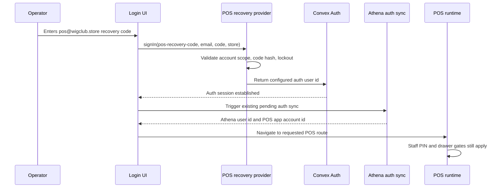
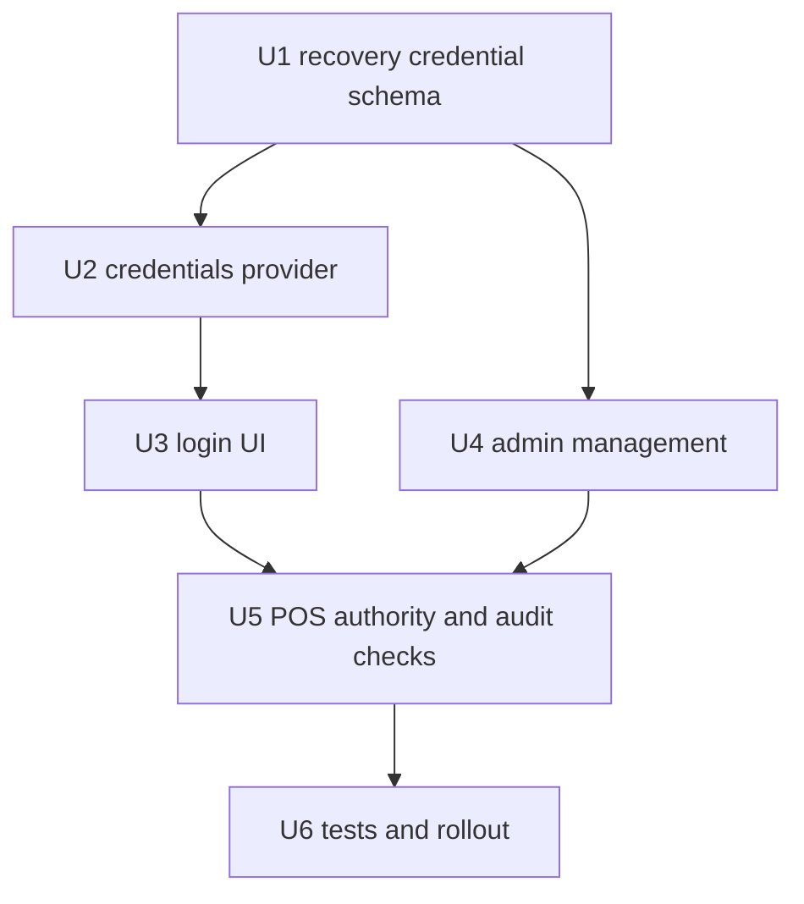

# feat: Add POS recovery-code login for field operators

## Summary

Add a tightly scoped recovery-code login path for the shared `pos@wigclub.store` POS app account. The goal is to let field operators sign in on a fresh browser when the normal OTP flow is blocked by lack of inbox access, without broadening access to admin accounts, weakening staff PIN checks, or storing raw credentials.

The recommended path is a static-until-rotated POS recovery code stored server-side as a hash, validated through a dedicated Convex Auth credentials provider, and managed by full admins. "Static" here means stable for field use until explicitly rotated, not hard-coded in source, not stored in client storage, and not exposed after creation.

## Problem Frame

The POS field account occasionally needs to sign in again. The current login path sends an OTP to the email address on the app account, but the operators using the POS do not have access to that inbox. That creates operational friction at exactly the point where the field team needs a low-friction recovery path.

Athena already separates app account identity from operational staff authority:

- `pos@wigclub.store` is the app account that lets the POS web app load in the field.
- Staff PIN and terminal-scoped staff credentials identify the cashier/operator for POS actions.
- Terminal trust, drawer lifecycle, and POS command checks still decide whether a sale can happen.

This plan should only solve app-account recovery for the specific POS account. It should not become a general bypass for arbitrary users, admins, or full-admin operations.

## Requirements

- R1. A fresh browser must be able to sign in as the `pos@wigclub.store` POS app account using a recovery code without email OTP access.
- R2. The recovery-code path must be restricted to the configured POS recovery account and must reject other account emails, admin accounts, and non-`pos_only` memberships.
- R3. A successful recovery-code login must create a normal authenticated app session and reuse the existing Athena auth-sync handoff.
- R4. Staff PINs must remain the cashier/operator identity layer after app-account login; recovery-code login must not authorize POS commands by itself.
- R5. Recovery codes must be stored server-side as hashes only, never committed in source, never stored in browser storage, and never written to operational logs.
- R6. Failed recovery attempts must be rate-limited, eventually locked, and logged in support-safe audit events.
- R7. Full admins must be able to create, rotate, lock, unlock, or revoke the POS recovery code, with plaintext shown only once when generated.
- R8. Operator-facing login errors must be generic and operational, without revealing whether the account, code, or lock state was the exact failure reason.
- R9. The flow must preserve existing OTP login behavior for all normal users.
- R10. Tests must cover the auth provider, recovery-code management, login UI, auth-sync handoff, lockout behavior, and POS staff-authority separation.
- R11. Recovery codes must be generated with enough entropy for shared-credential use; do not ask admins to invent memorable codes.

## Scope Boundaries

- This is scoped to the `pos@wigclub.store` POS app account for Wigclub.
- This does not replace normal OTP login for admins, operators with inbox access, or any non-POS account.
- This does not create a new staff identity model.
- This does not bypass staff PIN, manager approval, terminal integrity, drawer authority, or local-first POS command invariants.
- This does not add persistent shared passwords, plaintext recovery codes, OTP inbox polling, or reusable bearer tokens to the client.
- This does not implement a broad "trusted device" login flow for every registered terminal.

### Deferred to Follow-Up Work

- A generic multi-store recovery-code product for every POS-only app account.
- Per-terminal recovery codes or terminal-issued device credentials.
- Hardware security keys or passkeys for store devices.
- Fleet-level alerting for repeated failed recovery-code attempts.
- SMS or messaging-based delivery of one-time login codes.

## Context and Research

### Existing Auth Flow

- `packages/athena-webapp/convex/auth.ts` wires Convex Auth providers. Today it uses the Email OTP provider.
- `packages/athena-webapp/shared/auth.ts` defines `ATHENA_EMAIL_OTP_PROVIDER_ID`.
- `packages/athena-webapp/src/components/auth/Login/LoginForm.tsx` starts OTP sign-in.
- `packages/athena-webapp/src/components/auth/Login/InputOTP.tsx` marks `PENDING_ATHENA_AUTH_SYNC_KEY`, dispatches `ATHENA_PENDING_AUTH_SYNC_EVENT`, and navigates back into the app after OTP success.
- `packages/athena-webapp/src/routes/login/_layout.tsx` runs `api.inventory.auth.syncAuthenticatedAthenaUser`, stores `LOGGED_IN_USER_ID_KEY` and `POS_APP_ACCOUNT_ID_KEY`, and navigates after app-account sync.
- `packages/athena-webapp/src/lib/constants.ts` defines auth-sync and POS app-account local storage keys.

### Existing Staff and POS Authority Patterns

- `packages/athena-webapp/convex/operations/staffCredentials.ts` already has failure limits, lockout windows, and terminal-aware staff credential checks.
- Staff credentials are operational actor proof. They are not the same thing as Athena app login.
- `packages/athena-webapp/convex/pos/public/terminalAppSessions.ts` already demonstrates server-side POS app-account validation, route scoping, safe operational events, and secret-leakage tests for terminal-bound app-session recovery.
- `packages/athena-webapp/convex/operationalEvents.ts` is the right audit surface for support-safe recovery events.

### Convex Auth Provider Direction

Local package types show `@convex-dev/auth/providers/ConvexCredentials` supports custom credentials providers whose `authorize(credentials, ctx)` handler returns an auth `users` id, optionally with a session id. That makes a dedicated provider the right implementation direction because the recovery path can still create a real Convex Auth session and then reuse the existing Athena auth-sync route.

Implementation must verify the exact Convex Auth helper APIs for finding or linking the auth `users` row for `pos@wigclub.store`; the important boundary is that the provider returns a real auth user id and does not manually fake app state in local storage.

## Key Technical Decisions

| Decision | Rationale |
|---|---|
| Use a dedicated Convex Auth credentials provider | It keeps recovery login inside the supported auth system and lets the existing login sync path run normally after sign-in. |
| Restrict by configured email, store, and `pos_only` membership | The recovery code is operationally convenient but powerful, so the blast radius must be the POS app account only. |
| Store a hashed, DB-managed recovery code | This supports rotation and audit without committing a static secret or exposing raw code after creation. |
| Keep the recovery code stable until rotated | Field staff need a low-friction path that works during real operations. Short-lived codes would reintroduce the same availability problem as email OTP. |
| Require full-admin management for rotation and revocation | The code is a credential for a shared app account, so only full admins should create or rotate it. |
| Use generic failure copy and server-side lockout | The login page should not leak whether the code, account, membership, or lockout was the exact reason for failure. |
| Reuse existing Athena auth sync | Avoid a parallel app-login model; recovery-code success should look like OTP success after Convex Auth signs in. |
| Keep staff PIN separate | The POS app account loads the app. Staff proof still answers who performed the POS action. |
| Generate strong recovery codes server-side | A shared static code is only acceptable if it is high entropy, not a human-chosen PIN or short phrase. |

## Alternatives Considered

| Alternative | Benefits | Problems | Recommendation |
|---|---|---|---|
| Static-until-rotated recovery code | Fresh-browser capable, low friction, easy to explain, can be scoped and audited | Shared secret must be protected, rotated, and rate-limited | Recommended for v1 with tight guardrails |
| Longer Convex Auth sessions only | Minimal UI work | Does not help fresh browsers or cleared cookies; still depends on prior login | Not sufficient |
| Terminal-bound app-session recovery only | Strong device scope and already partly planned elsewhere | Does not work on a fresh browser before terminal context exists | Keep as separate continuity feature |
| Full-admin one-time code issued on demand | Stronger than a static code | Operators still need a remote admin at sign-in time | Useful later, not the lowest-friction path |
| Shared inbox or OTP forwarding | No code change | Operationally brittle and expands email access | Avoid |
| Staff PIN signs in the app account | Familiar to cashiers | Blurs staff identity with app login and turns staff PINs into app credentials | Avoid |
| Passkeys or hardware keys | Strong phishing resistance | Higher setup and field-support burden | Consider after v1 |

## High-Level Technical Design

## Implementation Units

### U1. Add POS recovery credential storage

**Goal:** Store the recovery credential as a server-side, rotatable, auditable record.

**Requirements:** R2, R5, R6, R7, R8.

**Dependencies:** None.

**Files:**

- Modify: `packages/athena-webapp/convex/schema.ts`
- Add: `packages/athena-webapp/convex/pos/public/posRecoveryCodes.ts` or `packages/athena-webapp/convex/auth/posRecoveryCodes.ts`
- Modify: `packages/athena-webapp/convex/operationalEvents.ts` if event typing needs extension
- Test: `packages/athena-webapp/convex/pos/public/posRecoveryCodes.test.ts`

**Approach:**

- Add a `posRecoveryCredential` table scoped to `organizationId`, `storeId`, and the POS Athena app account id.
- Store only `codeHash`, code salt or version metadata, status, failure count, `lockedUntil`, `lastUsedAt`, `rotatedAt`, and `rotatedByUserId`.
- Use the existing server-side hashing style closest to terminal sync-secret and staff verifier patterns. If implementation finds no suitable shared helper, add a small server helper that hashes with per-code salt and an environment-backed pepper.
- Generate recovery codes server-side with high entropy, such as a grouped random code that is readable over the phone but not guessable. Do not accept admin-supplied low-entropy codes in v1.
- Keep credential lockout behavior close to `staffCredentials.ts`: bounded failures, lock window, reset on success, and full-admin unlock. Treat global lockout as an explicit availability tradeoff and expose status in the admin surface.
- Write safe operational events for rotate, revoke, lock, failed attempt, and successful use. Do not include the raw code, code hash, or submitted email/code pair in event metadata.

**Test scenarios:**

- Creating or rotating a code returns plaintext only once and stores a hash.
- Old code fails after rotation.
- Failed attempts increment counters and eventually lock the credential.
- Successful login resets failure counters and updates `lastUsedAt`.
- Audit events contain safe metadata and do not include the raw code or hash.

### U2. Add a dedicated Convex Auth recovery provider

**Goal:** Let the recovery code establish a real Convex Auth session for the configured POS account.

**Requirements:** R1, R2, R3, R5, R6, R8, R9.

**Dependencies:** U1.

**Files:**

- Modify: `packages/athena-webapp/convex/auth.ts`
- Modify: `packages/athena-webapp/shared/auth.ts`
- Add: `packages/athena-webapp/convex/auth/PosRecoveryCode.ts`
- Test: `packages/athena-webapp/convex/auth/PosRecoveryCode.test.ts`

**Approach:**

- Add `ATHENA_POS_RECOVERY_CODE_PROVIDER_ID`, for example `"athena-pos-recovery-code"`.
- Register a `ConvexCredentials` provider next to the existing Email OTP provider.
- Provider input should include the email and recovery code. If the login route has store context, include org/store slug or id as a hint only. The provider must enforce the configured Wigclub POS account and store server-side; never trust client-provided scope as authority.
- Validate all of these before returning an auth user id:
  - Submitted email matches the configured POS recovery account, currently `pos@wigclub.store`.
  - The auth `users` row exists and links to the Athena user used by `syncAuthenticatedAthenaUser`.
  - The Athena user has an active organization membership for Wigclub.
  - The organization membership role is `pos_only`, not admin or full admin.
  - The recovery credential is active, not locked, and the submitted code matches the stored hash.
- Return a generic failure for every rejection path.
- On success, return the real Convex Auth user id so the client can reuse the existing `PENDING_ATHENA_AUTH_SYNC_KEY` and `syncAuthenticatedAthenaUser` flow.

**Implementation risk to resolve early:** Convex Auth credential providers return auth `users` ids, while Athena uses `athenaUser` records after sync. The implementing agent should first prove the `pos@wigclub.store` auth user exists and is linked by email to the correct Athena user. If it does not, add an explicit admin-only setup or migration step rather than creating a hidden ad hoc account during login.

**Test scenarios:**

- Correct code for the configured POS account signs in and triggers auth sync.
- Correct code for a non-POS account fails.
- Correct code for a POS email without `pos_only` membership fails.
- Wrong code fails with generic copy and increments failure count.
- Locked credential fails with generic copy and does not leak lock details.
- OTP provider behavior remains unchanged.

### U3. Add a recovery-code login UI

**Goal:** Give field staff a simple login path that works on a fresh browser while preserving OTP as the default flow.

**Requirements:** R1, R3, R8, R9.

**Dependencies:** U2.

**Files:**

- Modify: `packages/athena-webapp/src/components/auth/Login/LoginForm.tsx`
- Add: `packages/athena-webapp/src/components/auth/Login/PosRecoveryCodeForm.tsx`
- Modify: `packages/athena-webapp/src/components/auth/Login/InputOTP.tsx` if the auth-sync handoff should become a shared helper
- Modify: `packages/athena-webapp/src/routes/login/_layout.tsx` only if redirect handling needs POS route preservation
- Test: `packages/athena-webapp/src/components/auth/Login/LoginForm.test.tsx`
- Test: `packages/athena-webapp/src/components/auth/Login/PosRecoveryCodeForm.test.tsx`
- Test: `packages/athena-webapp/src/routes/login/_layout.test.tsx`

**Approach:**

- Keep OTP as the primary login flow.
- Add a secondary "Use POS recovery code" action. Product copy should stay calm and operational, following `docs/product-copy-tone.md`.
- The recovery form should be intentionally narrow: default the email to `pos@wigclub.store` or display it as the POS account being recovered, then ask for the recovery code.
- Call `signIn(ATHENA_POS_RECOVERY_CODE_PROVIDER_ID, { email, code, ...context })`.
- On success, run the same pending-auth-sync handoff as OTP success:
  - Set `PENDING_ATHENA_AUTH_SYNC_KEY`.
  - Dispatch `ATHENA_PENDING_AUTH_SYNC_EVENT`.
  - Navigate back into the app or preserved POS redirect target.
- On failure, show a generic message such as "That recovery code could not sign in the POS account." Avoid copy that distinguishes invalid, locked, missing, or wrong account states.

**Test scenarios:**

- OTP remains the default visible flow.
- Recovery option opens the recovery form without requiring email inbox access.
- Successful recovery sign-in sets pending auth sync and navigates through the same path as OTP.
- Failed recovery sign-in shows generic safe copy.
- Code is not persisted in local storage or query params.
- Fresh-browser flow can navigate to the POS route after sync.

### U4. Add full-admin recovery-code management

**Goal:** Let trusted administrators rotate and revoke the static recovery code without a deploy.

**Requirements:** R5, R6, R7.

**Dependencies:** U1.

**Files:**

- Modify: `packages/athena-webapp/src/components/pos/settings/POSSettingsView.tsx` or the existing admin/settings surface that owns POS account setup
- Add: `packages/athena-webapp/src/components/pos/settings/PosRecoveryCodeSettings.tsx`
- Add or modify Convex mutations in the U1 backend module
- Test: `packages/athena-webapp/src/components/pos/settings/POSSettingsView.test.tsx`
- Test: `packages/athena-webapp/convex/pos/public/posRecoveryCodes.test.ts`

**Approach:**

- Gate all management mutations with full-admin organization membership.
- Show current status only: active, locked, revoked, last used, last rotated, and who rotated it.
- Generate or rotate the code server-side and show plaintext exactly once in the mutation response. Do not add any "show current code" endpoint.
- Provide revoke and unlock actions. Unlock should clear lockout state but not reveal the code.
- Record operational events for every management action with the admin actor id.

**Test scenarios:**

- Full admin can rotate, revoke, and unlock.
- Non-full-admin users cannot manage recovery codes.
- Plaintext appears only in the rotate/create response.
- Status view never exposes code hash or plaintext.

### U5. Preserve POS authority boundaries and auditability

**Goal:** Ensure app-account recovery does not accidentally authorize POS actions or obscure actor identity.

**Requirements:** R4, R6, R8, R10.

**Dependencies:** U2, U3, U4.

**Files:**

- Verify: `packages/athena-webapp/convex/operations/staffCredentials.ts`
- Verify: `packages/athena-webapp/src/components/pos/CashierAuthDialog.tsx`
- Verify: `packages/athena-webapp/src/components/pos/register/RegisterDrawerGate.tsx`
- Verify: `packages/athena-webapp/src/lib/pos/presentation/register/useRegisterViewModel.ts`
- Test: `packages/athena-webapp/convex/operations/staffCredentials.test.ts`
- Test: `packages/athena-webapp/src/lib/pos/presentation/register/useRegisterViewModel.test.ts`
- Test: `packages/athena-webapp/src/components/pos/register/POSRegisterView.test.tsx`

**Approach:**

- Confirm no POS command path treats the recovered app account as staff proof.
- Confirm staff PIN prompts still appear after recovery where they appeared before.
- Confirm operational events for sale-affecting actions still use staff profile actor fields when staff proof is required.
- Add explicit regression coverage if any POS code path currently assumes a signed-in app account is enough to act.
- Keep recovery login audit separate from cashier action audit: the former answers "the POS app account was recovered"; the latter answers "this staff member performed this action."

**Test scenarios:**

- After recovery-code login, opening or selling still requires the existing drawer/staff gates.
- POS actions continue to attribute actor staff profile, not only `pos@wigclub.store`.
- Recovery audit events never stand in for transaction actor audit.

### U6. Validate, rollout, and document operations

**Goal:** Ship the feature with enough test coverage and operational guidance for field use.

**Requirements:** R1-R10.

**Dependencies:** U1, U2, U3, U4, U5.

**Files:**

- Modify or add tests listed in U1-U5.
- Modify: `docs/solutions/` if implementation reveals a reusable auth or POS recovery pattern.
- Rebuild: `graphify-out/graph.json` after code changes.

**Validation commands:**

- `bun run --filter '@athena/webapp' audit:convex`
- `bun run --filter '@athena/webapp' lint:convex:changed`
- `bun run --filter '@athena/webapp' lint:frontend:changed`
- `bunx tsc --noEmit -p packages/athena-webapp/tsconfig.json`
- `bun run --filter '@athena/webapp' build`
- `bun run graphify:rebuild`
- Targeted tests for new Convex auth/provider and recovery-code modules.
- Targeted tests for `LoginForm`, `PosRecoveryCodeForm`, `login/_layout`, POS settings, staff credentials, and POS register authority boundaries.

**Browser validation:**

- In a fresh browser profile, navigate to the Wigclub POS URL while signed out.
- Choose POS recovery code, sign in as `pos@wigclub.store`, and verify the existing auth-sync flow lands in the POS route.
- Verify staff PIN or drawer gates still appear before sale-affecting actions.
- Submit wrong codes until lockout and verify safe generic copy.
- Rotate the code as a full admin, then verify old code fails and new code succeeds.

## Security Notes

- Treat the recovery code as a shared credential with operational convenience, not as a low-risk token.
- Keep all validation server-side. Client-side hiding of the recovery form is only UX, not security.
- Avoid route or response behavior that leaks whether a submitted account exists.
- Do not include submitted code, code hash, salt, or pepper in logs, telemetry, local storage, query strings, or operational event metadata.
- Consider forcing code rotation after staff turnover or suspected exposure.
- Consider adding a short post-v1 metric: failed recovery attempts per day and lockout count.

### Threats and Mitigations

| Threat | Mitigation |
|---|---|
| Brute-force guessing | High-entropy generated code, server-side hash comparison, bounded attempts, generic failures. |
| Denial-of-service by repeated wrong attempts | Credential lockout telemetry, full-admin unlock, clear admin status, and rollout guidance for support. |
| Using the code for an admin account | Provider hard-checks configured email, store, and active `pos_only` membership before returning an auth user id. |
| Secret leakage through logs or browser storage | Never store raw code client-side; audit events and metadata exclude code, hash, salt, and pepper. |
| Staff accountability loss | Recovery login audit is separate from POS action audit; staff PIN remains the cashier/operator proof. |

## Rollout Plan

1. Implement backend storage and provider behind the configured `pos@wigclub.store` account.
2. Add full-admin setup/rotation UI and create the initial recovery code outside source control.
3. Add login UI and reuse existing auth-sync handoff.
4. Run targeted tests, Convex/frontend checks, typecheck, build, and graphify rebuild.
5. Browser-test a fresh profile using the local dev server.
6. Deploy after admin has a plan for securely sharing the initial code with field leads.
7. Rotate the code once after field staff confirm the flow and support copy are clear.

## Acceptance Criteria

- A fresh browser can sign in to Wigclub POS with the recovery code and no email OTP.
- The same recovery code cannot sign in another Athena account.
- A non-`pos_only` account cannot use the recovery-code provider.
- OTP login still works for normal users.
- Recovery code plaintext is visible only once when created or rotated.
- Wrong recovery attempts are rate-limited and locked.
- Login failure copy is generic and safe.
- Staff PIN and drawer authority still gate POS actions after recovery login.
- Audit events show recovery success/failure and admin rotation without exposing secrets.

## Final Sign-Off Needed

Before implementation, confirm these policy choices:

1. The v1 recovery account is exactly `pos@wigclub.store` for Wigclub.
2. The recovery code should remain valid until a full admin rotates or revokes it.
3. Full admins are the only users who can create, rotate, unlock, or revoke the code.
4. Failed attempts should lock the recovery code globally for the account after a small number of failures, similar to staff credential lockout, with full-admin unlock as the recovery path.
5. Staff PIN remains mandatory for cashier/operator identity and is not part of the app-account login flow.
