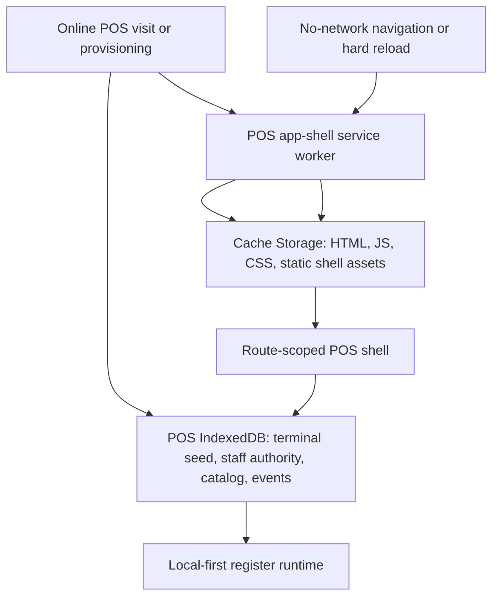
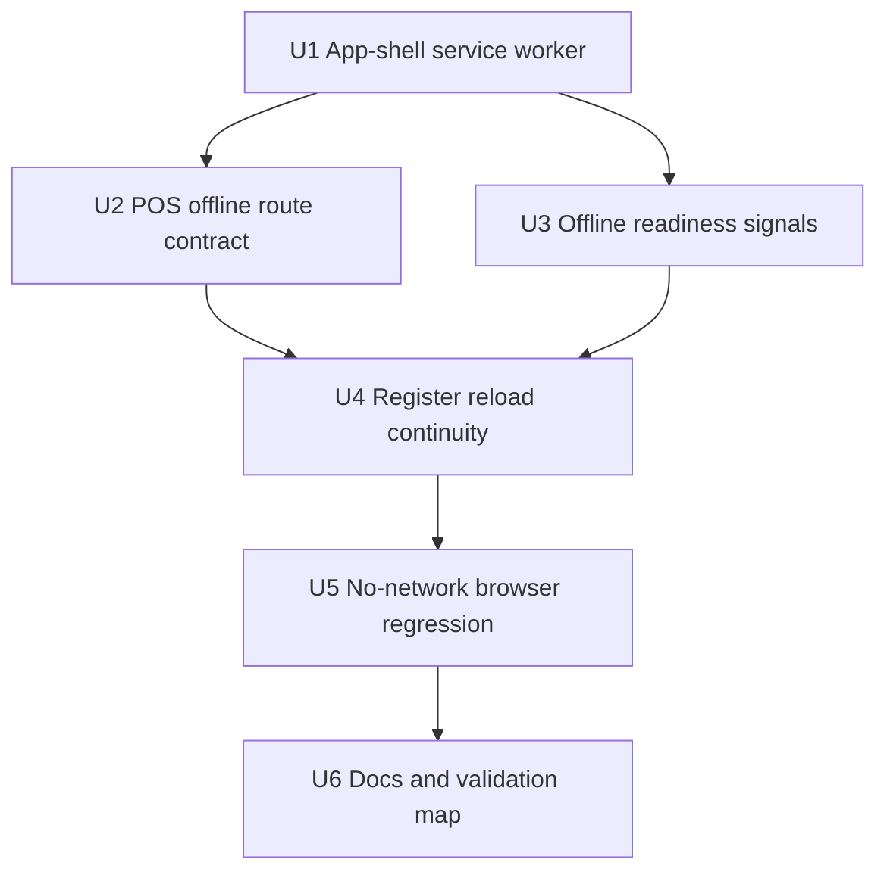
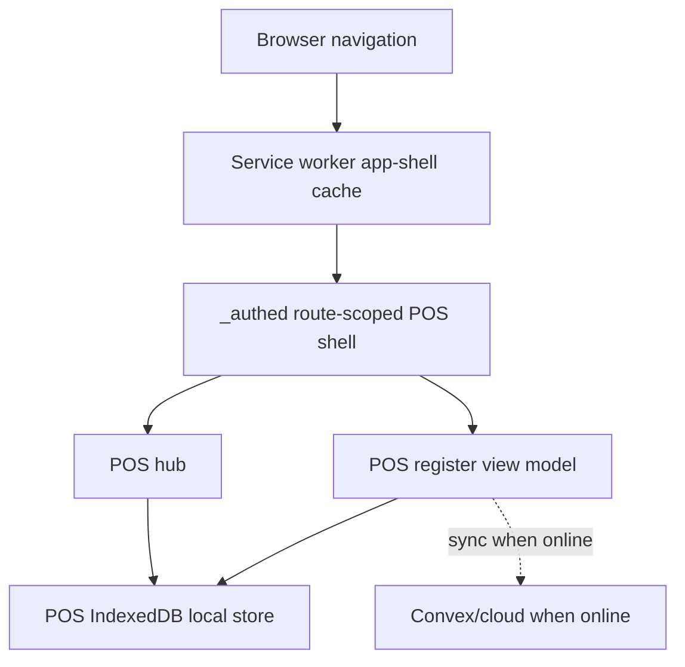

# feat: Make POS route accessible with no network

## Summary

This plan closes the remaining route-access gap in Athena's local-first POS work: an already-provisioned terminal should be able to open or hard reload the POS route after total network loss. The approach adds a focused POS app-shell service worker, keeps business data in the existing POS IndexedDB stores, tightens POS hub/register offline entry, and adds browser regression coverage for no-network reloads.

---

## Problem Frame

The current POS register runtime has substantial local-first infrastructure, but the browser still needs the web app shell to load before any of that local state can help. Without a service worker/app-shell cache, a hard reload or cold navigation to POS during a network outage can fail before React, local entry context, staff authority, catalog snapshots, or the register read model are reached.

---

## Requirements

- R1. A previously provisioned POS terminal can load the POS route with no active network after it has loaded POS online once, giving the browser a chance to install the service worker and cache the static app shell. Origin: R1, R2, R6, AE1.
- R2. `/pos` and `/pos/register` remain POS-local entry surfaces when live organization, store, auth, or daily-operation reads are unavailable. Origin: R2, R6, R8, AE1.
- R3. The offline app-shell cache stores only static shell assets and support metadata; POS business data remains in the existing IndexedDB local stores. Origin: R3, R4, R5.
- R4. Offline route continuity does not widen POS app-session recovery into generic Athena app access. Origin: R3, R4, R5, AE2.
- R5. The register continues to use local staff authority, local register readiness, catalog/availability snapshots, local command gateway, and sync status instead of introducing an online-primary fallback. Origin: R6, R7, R8, R9, R10, AE3.
- R6. Operators get explicit readiness/status signals when the app shell, terminal seed, staff authority, or catalog snapshots are not ready for offline use. Origin: R2, R7, R10, R31.
- R7. Browser-level validation proves an online-prepared terminal can hard reload POS with all network requests blocked and reach the local register/sign-in path. Origin: AE1, AE3.

**Origin actors:** A1 Cashier, A2 Store manager, A3 Athena POS terminal, A4 Athena cloud.
**Origin flows:** F1 Provision a POS terminal for offline use, F2 Operate the register while offline, F3 Complete checkout with any payment method offline, F5 Sync and reconcile local POS history.
**Origin acceptance examples:** AE1, AE2, AE3, AE4, AE5, AE7, AE10.

---

## Scope Boundaries

- This plan covers an already-provisioned terminal that has loaded POS online at least once after this feature is deployed, so the app shell can be installed and cached. Brand-new offline business creation, terminal provisioning, or first install without any prior online visit remains out of scope.
- POS remains the only offline-first Athena workflow. Procurement, analytics, products, services, admin, cash-controls review, and operations surfaces may remain unavailable, stale, or read-only while offline.
- Cache Storage is for app-shell assets only. Staff proofs, sync secrets, cart events, payments, receipts, catalog rows, and availability snapshots stay in the existing POS local store.
- Payment-provider-specific offline authorization behavior is unchanged.
- Peer-to-peer terminal sync and real-time multi-terminal stock coordination while offline remain out of scope.
- Visual validation is not part of this plan; browser verification should assert route accessibility and core readiness, not final visual polish.

### Deferred to Follow-Up Work

- Native install prompts, branded PWA icons, and install analytics can follow after route-level offline reliability is proven.
- Offline-friendly transaction history, expense reports, terminal health detail, and sessions list can follow as separate POS subroute work if operators need those surfaces during outages.

---

## Context & Research

### Relevant Code and Patterns

- `packages/athena-webapp/vite.config.ts` already code-splits the TanStack router output and vendor chunks, but has no service-worker/PWA plugin.
- `packages/athena-webapp/src/main.tsx` creates the React, Router, Convex Auth, and Query providers, but does not register a service worker.
- `packages/athena-webapp/src/routes/_authed.tsx` has a POS-only shell path for offline auth rehydration and route-scoped app-session recovery.
- `packages/athena-webapp/src/routes/_authed.test.tsx` already verifies POS shell behavior while Convex auth is reconnecting and route-scoped app-session recovery for POS routes.
- `packages/athena-webapp/src/components/pos/PointOfSaleView.tsx` can prewarm POS offline snapshots from local entry context, but several hub links still depend on live org/store params.
- `packages/athena-webapp/src/routes/_authed/$orgUrlSlug/store/$storeUrlSlug/pos/register.index.tsx` wraps the register in `POSRegisterOpeningGuard`.
- `packages/athena-webapp/src/components/pos/register/POSRegisterOpeningGuard.tsx` and `packages/athena-webapp/src/lib/pos/infrastructure/local/localPosReadiness.ts` keep store-day readiness local-first.
- `packages/athena-webapp/src/lib/pos/infrastructure/local/localPosEntryContext.ts`, `packages/athena-webapp/src/hooks/useGetTerminal.ts`, and `packages/athena-webapp/src/lib/pos/infrastructure/local/posLocalStore.ts` provide the local terminal seed and terminal fallback that route reloads must reach.
- `packages/athena-webapp/src/components/pos/CashierAuthDialog.tsx` already supports local staff authority when `navigator.onLine` is false.
- `packages/athena-webapp/src/lib/pos/infrastructure/convex/catalogGateway.ts` already persists and reads register catalog, service catalog, and availability snapshots from IndexedDB.

### Institutional Learnings

- `docs/solutions/architecture/athena-pos-local-first-sync-2026-05-13.md`: POS local events are the first durable cashier record; do not move the core ledger into `localStorage` or Cache Storage.
- `docs/solutions/architecture/athena-pos-always-local-first-register-2026-05-14.md`: cashier commands must append local register events before returning success, independent of browser online state.
- `docs/solutions/architecture/athena-pos-local-first-entry-readiness-2026-05-14.md`: POS entry should use route slugs plus the provisioned terminal seed; unresolved live reads should not suppress local POS entry.
- `docs/solutions/architecture/athena-pos-local-staff-authority-2026-05-14.md`: offline staff sign-in uses terminal-scoped verifiers and wrapped local staff proofs, not online PIN hashes.
- `docs/solutions/architecture/athena-pos-offline-inventory-snapshot-2026-05-15.md`: catalog metadata and availability snapshots stay separate, and missing availability remains an offline readiness gap.
- `docs/solutions/architecture/athena-pos-hub-app-session-continuity-2026-06-02.md`: POS app-session continuity is route scoped and must not become full app access.
- `docs/solutions/harness/athena-qa-smoke-live-navigation-readiness-2026-06-01.md`: browser smoke tests should assert meaningful DOM and network conditions rather than relying only on `networkidle`.

### External References

- MDN Service Worker API: service workers can intercept navigation and populate Cache Storage during install for offline use.
- MDN Using Service Workers: install/activate/fetch lifecycle and navigation preload are the standard browser model for offline app shells.
- Vite PWA documentation: `vite-plugin-pwa` can generate or inject a service worker and precache build output; `injectManifest` supports custom service-worker behavior when route-specific handling is needed.

---

## Key Technical Decisions

- Use a focused POS app-shell service worker rather than broad product offline caching: this satisfies POS route access while preserving the origin boundary that non-POS workspaces need not become offline-first.
- Prefer `injectManifest`-style service-worker control over a generic all-routes network strategy: POS needs route-specific navigation fallback, no API response caching, and a clear separation between static shell assets and business data.
- Cache generated HTML, JS, CSS, and static app assets needed to mount POS, but never cache Convex/API responses or POS business payloads in Cache Storage.
- Treat `/pos` and `/pos/register` as the minimum offline-access route contract: `/pos` gives a local entry surface, and `/pos/register` gives the cashier path. Other POS subroutes should render intentional offline-safe states or stay deferred.
- Keep POS route-scoped app-session recovery intact: offline shell access should mount POS continuity only for POS routes and must not enable generic Athena chrome or protected non-POS surfaces.
- Make offline readiness observable before outages: provisioning/settings and POS hub should show whether app shell cache, terminal seed, staff authority, catalog metadata, and availability snapshots are ready enough for offline selling.
- Validate with a browser hard-reload no-network scenario, not only unit tests: app-shell failures happen before unit-tested React code can run.

---

## Open Questions

### Resolved During Planning

- Should this plan cover only `/pos/register`? Resolution: no. `/pos/register` is the selling path, but `/pos` is the natural POS entry surface and already prewarms offline snapshots, so both routes are in scope.
- Should Cache Storage hold POS business data? Resolution: no. Cache Storage is limited to static app-shell assets; POS business data remains in IndexedDB local POS stores.
- Should expense POS be made offline-first in this plan? Resolution: no. The origin document scopes offline-first to POS register selling. Expense currently uses POS register UI but separate expense session infrastructure and is deferred unless later requirements make it offline-first.

### Deferred to Implementation

- Exact service-worker helper names and test harness utilities: implementation can choose names while preserving the route, cache, and verification contract.
- Exact route chunk precache list: implementation should use the Vite build manifest/service-worker precache manifest rather than hand-maintaining hashed asset names.
- Exact Playwright fixture setup for local POS seed data: implementation should use the existing local POS store and app-session test helpers where possible.

---

## High-Level Technical Design

> *This illustrates the intended approach and is directional guidance for review, not implementation specification. The implementing agent should treat it as context, not code to reproduce.*

---

## Implementation Units

- U1. **Add POS app-shell service worker infrastructure**

**Goal:** Add build-time and runtime support for a service worker that can serve the POS app shell during total network loss.

**Requirements:** R1, R3, R4, R7.

**Dependencies:** None.

**Files:**
- Modify: `packages/athena-webapp/package.json`
- Modify: `packages/athena-webapp/vite.config.ts`
- Modify: `packages/athena-webapp/src/main.tsx`
- Create: `packages/athena-webapp/src/offline/posAppShellServiceWorker.ts`
- Create: `packages/athena-webapp/src/offline/posAppShellRoutes.ts`
- Test: `packages/athena-webapp/src/offline/posAppShellRoutes.test.ts`

**Approach:**
- Add a Vite service-worker integration that precaches generated app-shell assets and supports a custom POS navigation fallback.
- Register the service worker from app startup without forcing a reload loop during offline operation.
- Keep route matching and cache policy helpers pure enough to unit test outside the service-worker runtime.
- Do not cache Convex endpoints, API responses, staff proofs, sync secrets, event payloads, payment data, or customer data.

**Patterns to follow:**
- `packages/athena-webapp/vite.config.ts` for existing build/plugin structure and code-splitting conventions.
- `packages/athena-webapp/src/main.tsx` for app startup integration.
- `docs/solutions/architecture/athena-pos-local-first-sync-2026-05-13.md` for keeping the POS event ledger out of Cache Storage.

**Test scenarios:**
- Happy path: POS route path plus same-origin navigation request is classified as an app-shell navigation eligible for cached fallback.
- Edge case: non-POS protected routes are not classified as POS app-shell fallbacks.
- Error path: Convex/API/fetch requests are excluded from app-shell cache handling even if they occur under a POS route.
- Integration: service-worker registration helper is invoked at app startup only in browser contexts that support service workers.

**Verification:**
- The built app emits/registers a service worker and has deterministic route policy coverage for POS navigations and excluded request types.

---

- U2. **Make POS hub and register route entry local-first under offline shell**

**Goal:** Ensure `/pos` and `/pos/register` render from route slugs and local terminal seed when live organization/store reads are absent.

**Requirements:** R1, R2, R4, R5. Origin flow: F2. Origin examples: AE1, AE2.

**Dependencies:** U1.

**Files:**
- Modify: `packages/athena-webapp/src/routes/_authed.tsx`
- Modify: `packages/athena-webapp/src/routes/_authed/$orgUrlSlug/store/$storeUrlSlug/pos/index.tsx`
- Modify: `packages/athena-webapp/src/components/pos/PointOfSaleView.tsx`
- Modify: `packages/athena-webapp/src/hooks/useGetActiveStore.ts`
- Test: `packages/athena-webapp/src/routes/_authed.test.tsx`
- Test: `packages/athena-webapp/src/components/pos/PointOfSaleView.test.tsx`
- Test: `packages/athena-webapp/src/hooks/useGetActiveStore.test.ts`

**Approach:**
- Preserve the existing POS-only `_authed` exception for route-scoped app-session recovery.
- Make POS hub link generation use `localEntryContext` for POS-critical links when live org/store values are unavailable.
- Keep non-POS links unavailable or read-only while offline rather than synthesizing full app access.
- Adjust active-store resolution so route-matched live data wins when available, while POS-local entry remains available through the terminal seed when live data is absent.

**Patterns to follow:**
- `packages/athena-webapp/src/lib/pos/infrastructure/local/localPosEntryContext.ts` for route slug plus seed authority.
- `docs/solutions/architecture/athena-pos-local-first-entry-readiness-2026-05-14.md` for not gating POS entry on live analytics/store summary reads.
- `docs/solutions/architecture/athena-pos-hub-app-session-continuity-2026-06-02.md` for keeping POS continuity route scoped.

**Test scenarios:**
- Happy path: `/pos` renders the POS tile and link to `/pos/register` from local entry context when live active store and organization are unavailable.
- Happy path: `/pos/register` mounts the POS shell without app sidebar/header when offline auth is still rehydrating.
- Edge case: non-POS hub links are absent, disabled, or explicitly unavailable when only local POS context exists.
- Error path: missing or mismatched terminal seed renders existing POS setup/mismatch copy instead of generic login or blank output.
- Integration: signed-out non-POS routes still redirect to login even when a POS terminal seed exists.

**Verification:**
- POS hub and register route tests prove local route entry without live org/store reads while non-POS route protections remain unchanged.

---

- U3. **Surface offline readiness for app shell and POS local prerequisites**

**Goal:** Make offline preparedness visible before an outage and actionable when a prerequisite is missing.

**Requirements:** R1, R3, R5, R6.

**Dependencies:** U1.

**Files:**
- Modify: `packages/athena-webapp/src/components/pos/PointOfSaleView.tsx`
- Modify: `packages/athena-webapp/src/components/pos/settings/POSSettingsView.tsx`
- Modify: `packages/athena-webapp/src/components/pos/terminals/POSTerminalHealthView.tsx`
- Modify: `packages/athena-webapp/src/lib/pos/infrastructure/local/terminalRuntimeStatus.ts`
- Create: `packages/athena-webapp/src/offline/posOfflineReadiness.ts`
- Test: `packages/athena-webapp/src/offline/posOfflineReadiness.test.ts`
- Test: `packages/athena-webapp/src/components/pos/PointOfSaleView.test.tsx`
- Test: `packages/athena-webapp/src/components/pos/settings/POSSettingsView.test.tsx`
- Test: `packages/athena-webapp/src/components/pos/terminals/POSTerminalHealthView.test.tsx`

**Approach:**
- Add a small readiness model that reports app-shell cache, terminal seed, staff authority, register catalog, service catalog, and availability snapshot posture.
- Reuse existing local-store reads where possible; do not invent a second readiness database.
- Show readiness as support/operator diagnostics, not as a new sale authority that bypasses existing register gates.
- Avoid raw backend or secret-bearing diagnostics in UI copy.

**Patterns to follow:**
- `packages/athena-webapp/src/lib/pos/infrastructure/local/terminalRuntimeStatus.ts` for support-safe runtime reporting.
- `packages/athena-webapp/src/components/pos/terminals/terminalHealthPresentation.ts` for summarized terminal health copy.
- `docs/product-copy-tone.md` for calm operator-facing copy.

**Test scenarios:**
- Happy path: all prerequisites present returns an offline-ready state with support-safe labels.
- Edge case: app shell ready but staff authority missing returns a readiness warning without claiming the terminal cannot ever sell online.
- Edge case: catalog metadata present but availability snapshot missing is reported as an offline inventory readiness gap.
- Error path: local store read failure returns local-store-unavailable copy without exposing raw IndexedDB/backend details.
- Integration: terminal health and POS settings display readiness state without exposing sync secrets, staff proof tokens, payment data, or customer data.

**Verification:**
- POS hub/settings/terminal health surfaces show offline readiness status that matches local store state and preserves security redaction.

---

- U4. **Harden register reload continuity around local staff and drawer state**

**Goal:** Ensure the register can recover its local selling path after a hard reload served from the offline app shell.

**Requirements:** R1, R2, R5, R6, R7. Origin flows: F2, F3. Origin examples: AE1, AE3, AE4, AE5, AE10.

**Dependencies:** U2, U3.

**Files:**
- Modify: `packages/athena-webapp/src/lib/pos/presentation/register/useRegisterViewModel.ts`
- Modify: `packages/athena-webapp/src/components/pos/CashierAuthDialog.tsx`
- Modify: `packages/athena-webapp/src/components/pos/register/POSRegisterOpeningGuard.tsx`
- Modify: `packages/athena-webapp/src/lib/pos/infrastructure/local/localPosReadiness.ts`
- Test: `packages/athena-webapp/src/lib/pos/presentation/register/useRegisterViewModel.test.ts`
- Test: `packages/athena-webapp/src/components/pos/CashierAuthDialog.test.tsx`
- Test: `packages/athena-webapp/src/components/pos/register/POSRegisterOpeningGuard.test.tsx`
- Test: `packages/athena-webapp/src/lib/pos/infrastructure/local/localPosReadiness.test.ts`

**Approach:**
- Characterize the current offline reload path first: local terminal seed, local staff authority, active/closed local drawer, local catalog, and pending sync state.
- Keep staff proof, drawer authority, terminal integrity, and local command preconditions separate from app-shell availability.
- Ensure local staff sign-in failure modes remain explicit when a terminal was not prepared for offline staff authority.
- Confirm locally completed sales and local receipt numbers remain available after reload through the existing local register read model.

**Execution note:** Add characterization coverage before changing register behavior; this area already has many local-first tests, and the risk is accidental widening of authority.

**Patterns to follow:**
- `packages/athena-webapp/src/lib/pos/infrastructure/local/localCommandGateway.ts` for local command invariants.
- `packages/athena-webapp/src/components/pos/CashierAuthDialog.tsx` for offline staff verifier/proof handling.
- `docs/solutions/architecture/athena-pos-local-staff-authority-2026-05-14.md` for proof boundaries.

**Test scenarios:**
- Happy path: after offline reload, a locally authorized cashier signs in and opens or resumes the local register path without Convex availability.
- Happy path: an existing local active drawer remains sellable when local readiness permits it.
- Edge case: locally closed drawer blocks selling until the existing reopen path records a local reopen event.
- Error path: missing local staff authority shows reconnect-required copy and does not attempt server authentication while offline.
- Error path: terminal integrity or drawer authority blocks remain blocks even though the app shell is available offline.
- Integration: completing a sale after offline reload appends local events and leaves sync status pending/offline, not failed due to network absence.

**Verification:**
- Register view-model tests prove offline app-shell reload reaches the same local-first command boundaries as ordinary offline operation.

---

- U5. **Add no-network browser regression coverage for POS route accessibility**

**Goal:** Prove the complete route delivery path works in a real browser: prepare online, block network, hard reload POS, and reach the local register/sign-in path.

**Requirements:** R1, R2, R4, R5, R7.

**Dependencies:** U1, U2, U4.

**Files:**
- Create: `packages/athena-webapp/src/tests/pos/offlineRouteAccess.spec.ts`
- Modify: `packages/athena-webapp/src/tests/pos/README.md`
- Modify: `packages/athena-webapp/src/tests/harness` or existing browser-test harness files as needed
- Test: `packages/athena-webapp/src/tests/pos/offlineRouteAccess.spec.ts`

**Approach:**
- Use a browser test because the failure mode occurs before React unit tests can execute.
- Seed or provision the local POS terminal state using existing helpers where possible.
- Visit POS online once so service worker installation and asset caching complete.
- Block network at the browser context level, hard reload `/pos/register`, and assert route mount plus local cashier sign-in/register gate readiness.
- Assert same-origin document/script/style requests are satisfied without server access; do not use `networkidle` as the sole readiness condition.

**Patterns to follow:**
- Existing POS local tests under `packages/athena-webapp/src/lib/pos/infrastructure/local/`.
- `docs/solutions/harness/athena-qa-smoke-live-navigation-readiness-2026-06-01.md` for DOM/response assertions over `networkidle`.

**Test scenarios:**
- Happy path: provisioned terminal loads POS register online, then hard reloads with network blocked and reaches the local sign-in/register shell.
- Edge case: direct offline navigation to `/pos` after preparation renders the POS hub with the register entry available from local context.
- Error path: offline reload without terminal seed renders POS setup-required copy instead of a blank page.
- Error path: blocked network does not cause the test to pass through stale live responses; the test observes blocked/absent server access after reload.
- Integration: non-POS protected route with network blocked does not gain POS continuity access.

**Verification:**
- Browser regression fails before this work and passes after app-shell caching, route contract, and reload continuity are in place.

---

- U6. **Document the POS offline route boundary and validation map**

**Goal:** Preserve the app-shell and POS-only offline boundary for future work and changed-file validation.

**Requirements:** R3, R4, R6, R7.

**Dependencies:** U5.

**Files:**
- Create: `docs/solutions/architecture/athena-pos-offline-route-access-2026-06-03.md`
- Modify: `packages/athena-webapp/src/tests/README.md`
- Modify: validation-map or harness registry files if this repo's changed-file validation requires them for new offline/service-worker/browser-test paths

**Approach:**
- Document the distinction between Cache Storage app-shell assets and IndexedDB POS business state.
- Capture the POS-only route contract and explicitly defer broader offline subroute/workspace behavior.
- Register the new test slice so future service-worker, route shell, local entry, and browser harness changes run relevant validation.

**Patterns to follow:**
- Existing `docs/solutions/architecture/athena-pos-*.md` notes.
- Existing test/harness summary docs under `packages/athena-webapp/src/tests/`.

**Test scenarios:**
- Test expectation: none -- this unit is documentation and validation-map maintenance. Its behavioral proof is covered by U1-U5 tests.

**Verification:**
- Future maintainers can identify the offline route boundary, the required regression tests, and why POS app-shell caching must not cache business data.

---

## System-Wide Impact

- **Interaction graph:** Browser navigation now passes through a service worker before React, `_authed`, POS hub, and POS register runtime. The service worker must be treated as an app-shell delivery layer, not an authorization or data layer.
- **Error propagation:** Offline navigation failures should produce cached POS shell or explicit POS setup/readiness copy. They should not surface raw network failures as sale outcomes.
- **State lifecycle risks:** Service-worker update lifecycle can strand stale chunks if old caches are not cleaned coherently. POS local store schema changes can still block local entry; the service worker should not hide unsupported local-store states.
- **API surface parity:** POS app-session recovery remains route scoped. Non-POS authenticated routes do not receive the POS offline continuity exception.
- **Integration coverage:** Unit tests cannot prove hard-reload offline delivery. Browser tests must cover service-worker installation, cache availability, network blocking, and route mount.
- **Unchanged invariants:** Local command gateway remains the cashier-path write boundary; local staff proofs remain separate from app shell access; sync/reconciliation still projects POS events into cloud records after reconnect.

---

## Risks & Dependencies

| Risk | Likelihood | Impact | Mitigation |
|------|------------|--------|------------|
| Service worker caches sensitive business/API data | Medium | High | Limit service worker to static app-shell assets and explicitly exclude Convex/API/fetch payloads from cache strategies. |
| Stale cached chunks break POS after deploy | Medium | High | Use build-manifest/precache-driven asset lists, cleanup outdated caches, and avoid forced reloads while offline. |
| Offline shell is mistaken for sale authority | Medium | High | Keep app-shell readiness separate from terminal integrity, drawer authority, staff proof, and local command preconditions. |
| POS route continuity leaks to non-POS routes | Low | High | Preserve `_authed` route matching tests for POS vs non-POS signed-out/offline behavior. |
| Browser no-network test becomes flaky | Medium | Medium | Assert DOM mount and request/response observations rather than relying on `networkidle`; seed local state deterministically. |
| Existing dirty receipt/print work complicates execution | Medium | Low | Execution should preserve unrelated current work and avoid reverting prior uncommitted changes. |

---

## Documentation / Operational Notes

- This work should include a solution note because it adds a new architectural boundary: service-worker app shell vs POS IndexedDB business state.
- Operators should be told that a terminal must be prepared online before no-network use; first-time install with no prior online visit remains unsupported.
- Support/terminal health should expose offline-readiness signals without leaking raw backend errors, staff proof tokens, sync secrets, payment details, or customer data.
- After implementation changes code, run `bun run graphify:rebuild` per repo guidance.

---

## Alternative Approaches Considered

- Custom hand-written service worker without Vite integration: maximizes control, but risks brittle manual asset lists for hashed route chunks.
- Generic PWA/offline-all-routes behavior: simpler configuration, but violates the POS-only offline scope and may cache or expose non-POS surfaces unintentionally.
- Register-only offline route access: smaller, but `/pos` is the natural POS launcher and already owns snapshot prewarming, so excluding it would leave a confusing offline entry gap.

---

## Sources & References

- **Origin document:** [docs/brainstorms/2026-05-13-pos-local-first-register-requirements.md](../brainstorms/2026-05-13-pos-local-first-register-requirements.md)
- Related learning: [docs/solutions/architecture/athena-pos-local-first-sync-2026-05-13.md](../solutions/architecture/athena-pos-local-first-sync-2026-05-13.md)
- Related learning: [docs/solutions/architecture/athena-pos-always-local-first-register-2026-05-14.md](../solutions/architecture/athena-pos-always-local-first-register-2026-05-14.md)
- Related learning: [docs/solutions/architecture/athena-pos-local-first-entry-readiness-2026-05-14.md](../solutions/architecture/athena-pos-local-first-entry-readiness-2026-05-14.md)
- Related learning: [docs/solutions/architecture/athena-pos-local-staff-authority-2026-05-14.md](../solutions/architecture/athena-pos-local-staff-authority-2026-05-14.md)
- Related learning: [docs/solutions/architecture/athena-pos-offline-inventory-snapshot-2026-05-15.md](../solutions/architecture/athena-pos-offline-inventory-snapshot-2026-05-15.md)
- Related learning: [docs/solutions/architecture/athena-pos-hub-app-session-continuity-2026-06-02.md](../solutions/architecture/athena-pos-hub-app-session-continuity-2026-06-02.md)
- Related learning: [docs/solutions/harness/athena-qa-smoke-live-navigation-readiness-2026-06-01.md](../solutions/harness/athena-qa-smoke-live-navigation-readiness-2026-06-01.md)
- Related code: `packages/athena-webapp/vite.config.ts`
- Related code: `packages/athena-webapp/src/main.tsx`
- Related code: `packages/athena-webapp/src/routes/_authed.tsx`
- Related code: `packages/athena-webapp/src/components/pos/PointOfSaleView.tsx`
- Related code: `packages/athena-webapp/src/lib/pos/infrastructure/local/posLocalStore.ts`
- External docs: [MDN Service Worker API](https://developer.mozilla.org/en-US/docs/Web/API/Service_Worker_API)
- External docs: [MDN Using Service Workers](https://developer.mozilla.org/en-US/docs/Web/API/Service_Worker_API/Using_Service_Workers)
- External docs: [Vite PWA Service Worker Precache](https://vite-pwa-org.netlify.app/guide/service-worker-precache)
