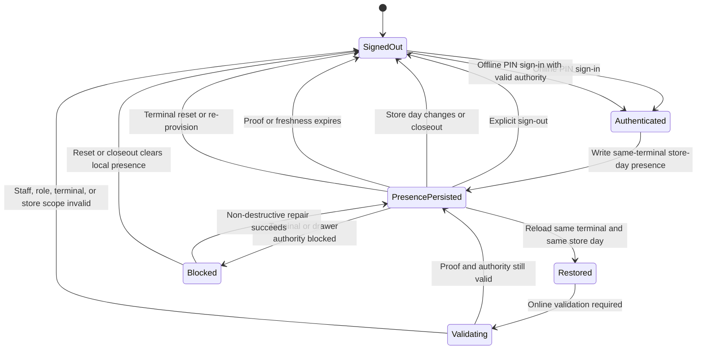
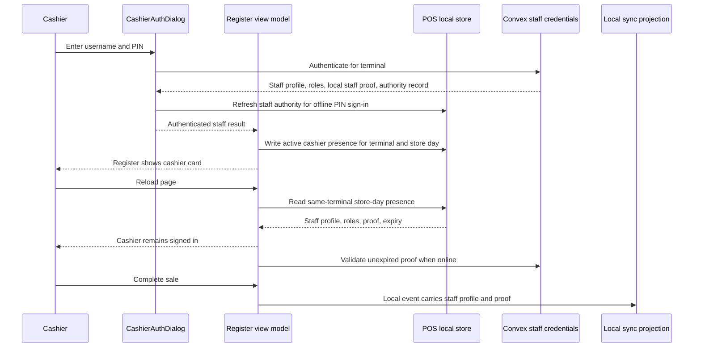

# feat: Add terminal-scoped cashier store-day presence

## Summary

Persist the currently signed-in POS cashier for the active terminal and store day so reloads do not force a new PIN sign-in. The persisted presence is a POS-only cashier session record, not a global Athena login: it is scoped to one provisioned terminal, one store, one operating date, and one staff identity; it clears on explicit sign-out or store-day/terminal reset lifecycle changes; and it never bypasses terminal repair, drawer authority, role revocation, manager approval, or sync review boundaries.

---

## Problem Frame

Operators want a cashier to remain signed in for the whole store day. Today the register can authenticate staff online, cache offline authority, and sign in offline by username/PIN, but the active cashier state in `useRegisterViewModel` is still primarily React state. A reload loses `staffProfileId`, `staffProofToken`, and cashier display state, so the terminal falls back to the sign-in gate even when the same cashier just authenticated on the same register.

The current offline authority layer also explains why operators can see "Offline staff sign-in needs a refresh. Reconnect, then try again.": the local staff-authority record may exist, but its wrapped local staff proof is missing, expired, unreadable, or not refreshed for the terminal. That state is valid as a local PIN sign-in failure, but it is not the right product behavior after an online cashier already signed in for the current store day. The active store-day cashier presence needs its own durable local session record.

### Feedback Evidence

The concrete operator workflow is: a cashier signs into a registered POS terminal, the app reloads during the store day, and the cashier must enter a PIN again even though they did not intentionally sign out or switch terminals. The intended behavior is same-cashier continuity on that terminal through routine reloads. The non-goal is cross-terminal staff roaming or shift/attendance tracking.

---

## Requirements

- R1. After a cashier or manager signs into the POS register on a terminal, a page reload on the same terminal should restore that cashier for the same store day without asking for another PIN.
- R2. Persistence must be terminal-scoped. It must restore only inside the POS register flow and must not follow the cashier to another terminal, browser profile, store, or organization.
- R3. Persistence must be store-day-scoped. It must clear or fail closed when the canonical operating date, store-day readiness, daily close, or local closeout state no longer matches the saved presence.
- R4. Explicit cashier sign-out, replacement sign-in, terminal sign-out, terminal reset, terminal re-provisioning, register closeout, and store-day close must clear the saved presence. Non-destructive terminal repair and ordinary drawer close may preserve cashier identity but must block sale-affecting commands until drawer/terminal authority is restored.
- R5. Online boot should rehydrate quickly from local presence, then validate the existing unexpired proof when the app can reach Convex. If validation is pending and the presence is outside a short freshness window, the cashier may be displayed but sale-affecting commands stay blocked until validation succeeds. Failed validation clears proof material and shows calm operational copy.
- R6. Offline boot may rehydrate only from a same-terminal, same-store-day, unexpired local presence record whose last validation is within the explicit offline freshness window. It must not mint, renew, or extend staff proof while offline.
- R7. Sale-affecting local events must continue to carry staff identity and a valid POS local staff proof. Drawer and terminal command-boundary gates remain mandatory.
- R8. Manager approval remains a separate command-boundary proof. A persisted cashier presence, even for a manager role, must not silently approve protected actions.
- R9. Existing offline staff-authority records remain the source for username/PIN offline sign-in. Active cashier presence is a separate record that represents who is already signed in.
- R10. The UI should show the restored cashier state without noisy "restored" or "terminal setup repaired" toasts. If restoration fails, the sign-in surface should explain the next action without raw backend wording.
- R11. Persisted POS local staff proof material must be wrapped or encrypted at rest. Tests must fail if raw bearer proof tokens are stored in local-store serialization, logs, diagnostics, or UI copy.
- R12. Sale-affecting command paths must check proof freshness at append time, not only at restore time. If proof expires mid-sale, preserve the draft and already-appended event evidence, block further sale-affecting commands, and require cashier re-authentication or online validation before continuing.

---

## Scope Boundaries

- This plan does not create cross-terminal cashier sessions.
- This plan does not keep a cashier signed in after explicit sign-out, register closeout, store-day close, terminal reset, terminal re-provisioning, or credential/role invalidation.
- This plan does not make POS a global offline-auth platform. It remains POS-only.
- This plan does not add payroll, shift scheduling, break tracking, or staff attendance.
- This plan does not change payment-provider behavior or cash-control reconciliation.
- This plan does not replace existing local staff authority. It adds active cashier presence beside it.
- Offline reload restore assumes the Athena POS app shell and relevant chunks are already available to the browser. Cold-load app-shell/service-worker guarantees remain follow-up work.

### Deferred to Follow-Up Work

- Hardware-backed local key storage or device-attestation hardening beyond browser-profile local storage.
- Fleet-level reporting for which cashier stayed signed in on each terminal.
- Rich manager handoff workflows, such as explicit shift transfer with manager approval.
- Service-worker cold-start guarantees if the browser has never loaded the Athena app assets before going offline.
- PIN-less proof renewal. This plan validates existing unexpired proof; renewal is a follow-up unless implementation proves the current proof TTL cannot cover a normal store day.
- Broader offline staff-authority autohealing. This plan writes active presence after successful sign-in; it does not redesign the offline authority refresh lifecycle.

---

## Context & Research

### Relevant Code and Patterns

- `packages/athena-webapp/src/lib/pos/presentation/register/useRegisterViewModel.ts` owns the active cashier React state through `staffProfileId`, `staffProofToken`, `localAuthenticatedStaff`, `cashierCard`, drawer gates, local sale commands, and sign-out behavior.
- `packages/athena-webapp/src/components/pos/CashierAuthDialog.tsx` authenticates staff online, refreshes terminal staff authority, writes local staff authority, verifies local PINs offline, unwraps PIN-protected local proofs, and returns `StaffAuthenticationResult`.
- `packages/athena-webapp/src/lib/pos/infrastructure/local/posLocalStore.ts` already stores POS terminal seed, readiness, terminal integrity, drawer authority, local events, catalog snapshots, availability snapshots, and local staff authority.
- `packages/athena-webapp/convex/operations/staffCredentials.ts` authenticates staff for a terminal and refreshes terminal staff-authority records with active roles, credential version, verifier metadata, and proof expiry.
- `packages/athena-webapp/convex/pos/application/sync/staffProof.ts` validates POS local staff proof during event sync projection.
- `packages/athena-webapp/src/lib/pos/infrastructure/local/usePosLocalSyncRuntime.ts` already handles foreground sync, runtime health, and terminal repair signals.
- `packages/athena-webapp/src/components/pos/register/POSRegisterView.tsx` renders the POS register shell, cashier card, drawer gate, product lookup trigger, and payment surface.

### Institutional Learnings

- `docs/solutions/architecture/athena-pos-local-first-sync-2026-05-13.md` says the browser event log is the first durable record for POS work, while Convex is the cloud projection boundary.
- `docs/plans/2026-05-14-003-feat-pos-local-staff-authority-plan.md` separates POS offline staff sign-in authority from global Athena login and manager command approval.
- `docs/plans/2026-05-29-001-fix-pos-stale-terminal-sale-block-plan.md` separates terminal trust from drawer lifecycle authority and requires sale-blocking at command boundaries, not only UI gates.
- `docs/product-copy-tone.md` requires restrained operator-facing copy and normalized backend wording.

### Current Failure Mode

The "Offline staff sign-in needs a refresh" state is entered when offline PIN sign-in finds a local authority record but cannot produce a usable local staff proof. Typical causes are:

- `wrappedPosLocalStaffProof` was never stored for that staff record.
- The wrapped proof cannot be unwrapped with the entered PIN.
- The local staff proof has expired.
- The authority record is stale for the terminal, store, role, credential version, or local verifier.
- The local store read fails or the schema cannot be parsed.

That behavior should remain for offline PIN sign-in. The gap is that a cashier who already completed a valid online sign-in should not need to go through the offline PIN path after a reload during the same store day.

---

## Key Technical Decisions

- Add a new local cashier presence record. Do not overload `PosLocalStaffAuthorityRecord`; that record answers "who may sign in offline with a PIN." The new record answers "who is currently signed in on this terminal for this store day."
- Store active POS staff proof only as a terminal-scoped, store-day session proof. It is valid for local POS event attribution and sync, not global Athena auth or manager command approval.
- Wrap or encrypt persisted POS local staff proof material. Raw proof tokens must not be stored in IndexedDB serialization, memory-store snapshots used in tests, diagnostics, logs, or UI copy.
- Minimum acceptable proof wrapping is a terminal-scoped, non-extractable Web Crypto key stored in IndexedDB and bound to the active provisioned terminal seed/fingerprint. The proof payload is AES-GCM encrypted with a fresh IV per write; export helpers, diagnostics, and tests must only see ciphertext and metadata.
- Expire presence at the earliest of store-day boundary, proof expiry, offline freshness expiry, terminal reset/re-provisioning, register closeout, store-day close, credential/role invalidation, or explicit sign-out.
- Check proof freshness at every sale-affecting append. Restore-time validity is not sufficient for sale start, cart mutation, payment update, service add, checkout completion, drawer open, or closeout/reopen actions.
- Treat persisted cashier presence as continuity evidence, not local authority. On reload, same-terminal presence can move the register into validation-pending sign-in guidance, but it must not restore cashier roles or sale-authorized proof from IndexedDB.
- Do not include PIN-less proof renewal in the MVP. If proof renewal is needed for a long store day, add a follow-up Convex mutation that requires an unexpired prior POS local staff proof plus current terminal, staff, credential, and role validation. Offline code cannot extend proof lifetime.
- Keep manager approval separate. The presence can show a manager as the active cashier, but protected manager actions still open their own proof flow.
- Make clearing explicit and conservative. Identity-clearing lifecycle transitions clear both React state and the local presence record; drawer/terminal repair states block commands without necessarily erasing cashier identity.

---

## Open Questions

### Resolved During Planning

- Should cashier persistence be terminal-scoped or user-scoped? Terminal-scoped.
- Should persistence survive reloads? Yes, within the same store day and terminal.
- Should persistence survive explicit sign-out? No.
- Should persistence allow a cashier to sell if terminal repair or drawer authority is blocked? No.
- Should active cashier presence replace offline staff authority? No. They are separate local records with different meanings.
- Should the register auto-start a sale on restore? No. The product lookup trigger remains the intentional start path.
- Should ordinary drawer close clear cashier identity? No. Drawer close blocks sellability but should not force a PIN prompt by itself. Register closeout, store-day close, explicit sign-out, terminal reset, and credential invalidation clear identity.
- Should non-destructive terminal repair clear cashier identity? No. It blocks sellability while repair is pending. Terminal reset or re-provisioning clears identity.
- Should the MVP renew POS local staff proof without PIN? No. It validates existing unexpired proof only. Renewal is a follow-up if TTL requires it.

### Deferred to Implementation

- Exact proof expiry and freshness values: choose explicit constants during implementation. The plan requires both a proof expiry and an offline freshness window; renewal remains follow-up unless TTL makes the MVP unusable.
- Exact wrapping helper names and storage location: the minimum wrapping invariant is fixed above, but implementation can choose the helper/module shape that best fits existing `localPinVerifier` and `posLocalStore` code.

---

## Store-Day Contract

- Canonical store-day identity is the POS local readiness operating date for the active store and terminal. If the register view model does not currently receive it, U0 must add a small adapter that exposes it before any presence write or restore.
- The operating date is store-scoped, not browser-local. It should use the same store timezone and daily-opening/daily-close semantics already used by POS readiness.
- Crossing midnight does not clear presence by itself if the store-day operating date has not changed. Completing daily close or register closeout does clear presence.
- Offline closeout-pending state blocks sale-affecting commands and clears active cashier presence when it represents the terminal/register day being closed.
- Missing, unreadable, mismatched, or closed store-day identity means no presence restore. The sign-in gate should wait until this check completes so the PIN dialog does not flicker during IndexedDB reads.

---

## Repair And Drawer Semantics

| Event or state | Cashier identity | Sale-affecting commands | Notes |
| --- | --- | --- | --- |
| Ordinary drawer close | Preserved | Blocked until drawer opens | Supports whole-store-day cashier continuity. |
| Drawer open for a new local register session | Preserved by default | Allowed only after proof freshness and drawer authority pass | UI must keep the cashier card and sign-out/switch affordance visible so operators can correct the active cashier. |
| Mapped cloud drawer closed/rejected | Cleared if it invalidates the active drawer/session authority | Blocked | Prevents stale IndexedDB drawer authority from resurrecting a cashier session. |
| Non-destructive terminal self-heal for same terminal seed/fingerprint | Preserved only after online proof validation | Blocked until repair and validation pass | Repair may keep identity, but cannot restore sale authorization by itself. |
| Terminal reset or re-provisioning | Cleared | Blocked until sign-in | Treat as new terminal authority. |
| Register closeout or store-day close | Cleared | Blocked until new store-day/register readiness | Store-day identity changed or closed. |
| Replacement cashier sign-in | Overwritten | Existing pending local events keep original staff attribution | New events use the replacement cashier proof. |

The presence record is not the drawer authority record. The implementation may include the current drawer/register-session id as metadata if it helps detect stale authority, but cashier presence remains terminal/store-day scoped. Event attribution is enforced at command append: each appended local event keeps the staff identity/proof that was active at the time of append.

---

## High-Level Technical Design





### Cashier Presence Record

The implementation should keep the record small and redacted. A target shape:

```ts
type PosLocalCashierPresenceRecord = {
  activeRoles: Array<"cashier" | "manager">;
  credentialId: string;
  credentialVersion: number;
  displayName: string | null;
  expiresAt: number;
  issuedAt: number;
  lastValidatedAt?: number;
  cashierPresenceId: string;
  operatingDate: string;
  organizationId: string;
  wrappedPosLocalStaffProof: {
    ciphertext: string;
    expiresAt: number;
    iv: string;
  };
  staffProfileId: string;
  status: "active" | "invalidated" | "expired";
  storeId: string;
  terminalId: string;
};
```

The final storage shape must wrap or encrypt POS local staff proof material before persistence. Tests must inspect the raw local-store serialization and fail if a `posLocalStaffProof.token` value or equivalent bearer material appears in plaintext. Invalidated or expired records must delete proof material; retaining redacted status metadata for diagnostics is acceptable.

---

## Implementation Units

### U0. Define and expose the POS store-day identity

**Goal:** Provide the canonical operating date and store-day readiness state that every cashier presence write and restore must use.

**Requirements:** R1, R3, R6, R10

**Dependencies:** None

**Files:**
- Modify if needed: `packages/athena-webapp/src/lib/pos/infrastructure/local/posLocalStore.ts`
- Modify if needed: `packages/athena-webapp/src/lib/pos/infrastructure/local/posLocalStore.test.ts`
- Modify: `packages/athena-webapp/src/lib/pos/presentation/register/useRegisterViewModel.ts`
- Modify: `packages/athena-webapp/src/lib/pos/presentation/register/useRegisterViewModel.test.ts`

**Approach:**
- Reuse the POS local readiness operating date as the canonical store-day identity for presence.
- Add a small adapter if `useRegisterViewModel` cannot already read the active operating date from local readiness.
- Return explicit states for ready, loading, missing readiness, closed store day, mismatched store, unreadable local store, and unsupported schema.
- Gate cashier-presence restore and sign-in dialog opening until this store-day check has completed.
- Treat daily close, register closeout, and closed local readiness as identity-clearing states. Treat midnight without operating-date change as same store day.

**Test scenarios:**
- Same operating date before close allows restore.
- Crossing midnight with unchanged operating date still allows restore.
- Completed daily close or register closeout prevents restore and clears presence.
- Missing/unreadable readiness does not flicker the sign-in dialog; it reaches a deterministic sign-in or blocked state.
- Store mismatch rejects the presence before any staff state is set.

**Verification:**
- The view model has a reliable operating date before it writes or restores active cashier presence.

### U1. Add cashier presence storage to the POS local store

**Goal:** Store and restore the active same-terminal cashier presence without mutating staff-authority records or local POS events.

**Requirements:** R1, R2, R3, R6, R9, R11, R12

**Dependencies:** U0

**Files:**
- Modify: `packages/athena-webapp/src/lib/pos/infrastructure/local/posLocalStore.ts`
- Modify: `packages/athena-webapp/src/lib/pos/infrastructure/local/posLocalStore.test.ts`

**Approach:**
- Add a local store record keyed by organization, store, terminal, and operating date.
- Provide helpers such as `writeCashierPresence`, `readCashierPresence`, `clearCashierPresence`, and `invalidateCashierPresenceForTerminal`.
- Validate scope, expiry, offline freshness, active roles, credential version, terminal id, store id, operating date, and wrapped proof shape before returning a sale-authorized record.
- Provide a command-boundary helper that resolves the current sale-authorized proof and fails closed when proof expiry/freshness has passed since restore.
- Keep the record separate from `staffAuthority`, `events`, and `drawerAuthority`.
- Redact the proof/token field from any diagnostic serialization.
- Bump the IndexedDB schema version, add the object-store/type union, update `onupgradeneeded`, update the in-memory adapter clone/replace helpers, and add migration coverage from the current schema.

**Test scenarios:**
- Same terminal, same store day restores cashier presence after a new store instance is created.
- Another terminal, store, organization, or operating date cannot read the record.
- Expired proof, expired offline freshness, or expired presence returns no usable cashier and deletes proof material.
- Clearing presence on sign-out leaves staff-authority records intact.
- Diagnostics do not include proof tokens, verifier material, credentials, PINs, or sync secrets.
- Opening an existing schema-7 database and writing cashier presence preserves existing events, mappings, readiness, drawer authority, and staff authority.
- Proof that expires after restore but before a command append fails the helper and deletes active proof material while retaining redacted status.

**Verification:**
- IndexedDB can persist active cashier presence across reload-like store reconstruction without changing local event history.

### U2. Write presence on successful cashier sign-in and clear it on identity-clearing transitions

**Goal:** Make successful cashier authentication create the active presence record and make sign-out/lifecycle changes remove it.

**Requirements:** R1, R3, R4, R7, R9, R10

**Dependencies:** U0, U1

**Files:**
- Modify: `packages/athena-webapp/src/lib/pos/presentation/register/useRegisterViewModel.ts`
- Modify: `packages/athena-webapp/src/lib/pos/presentation/register/useRegisterViewModel.test.ts`
- Modify if needed: `packages/athena-webapp/src/components/pos/CashierAuthDialog.tsx`
- Test if modified: `packages/athena-webapp/src/components/pos/CashierAuthDialog.test.tsx`

**Approach:**
- Extend `handleCashierAuthenticated` to write presence after online or offline sign-in returns a usable `posLocalStaffProof`.
- Wrap or encrypt the proof before persistence. Include active roles, display name, credential version when available, current terminal id, current store id, and current operating date.
- Update `handleCashierSignOut` to clear presence before or alongside clearing React state.
- Clear proof material and local presence on explicit sign-out, replacement sign-in, terminal sign-out, terminal reset, terminal re-provisioning, register closeout, store-day close, credential/role invalidation, or store-day mismatch.
- Preserve cashier identity through ordinary drawer close and same-terminal non-destructive repair, but keep sale-affecting commands blocked until drawer/terminal authority and proof validation are healthy.
- Clear presence when mapped cloud drawer authority is closed/rejected for the active local drawer, when a new terminal seed/fingerprint is written, or when repair replaces the register/session authority instead of self-healing it.
- Preserve the existing product lookup trigger behavior; do not auto-start a sale just because cashier presence was restored.

**Test scenarios:**
- Online sign-in writes cashier presence and still refreshes local staff authority.
- Offline PIN sign-in with a valid wrapped proof writes cashier presence for later reloads.
- Sign-out clears the record and reopens the sign-in gate.
- Replacement sign-in overwrites the previous cashier presence.
- Ordinary drawer close preserves cashier identity and blocks sale commands until drawer authority returns.
- Mapped cloud drawer closed/rejected clears presence for the active drawer/session and blocks sale commands.
- Register closeout clears presence.
- Non-destructive terminal repair preserves cashier identity and blocks sale commands.
- Terminal reset or re-provisioning clears presence but does not delete stranded local events.
- Replacement sign-in preserves existing pending local event attribution and uses the new cashier proof only for subsequent events.
- Completed sale and product lookup flows still use the current cashier proof.
- Persisted cashier presence alone is not a current cashier proof.

**Verification:**
- The active register cannot record local sale events from restored local presence alone; the cashier must sign in to supply current proof.

### U3. Rehydrate cashier presence during register boot

**Goal:** Resolve local presence before the sign-in gate opens, while preserving terminal and drawer gates and never restoring cashier authority from IndexedDB alone.

**Requirements:** R1, R2, R3, R5, R6, R7, R10

**Dependencies:** U0, U1

**Files:**
- Modify: `packages/athena-webapp/src/lib/pos/presentation/register/useRegisterViewModel.ts`
- Modify: `packages/athena-webapp/src/lib/pos/presentation/register/useRegisterViewModel.test.ts`
- Modify if needed: `packages/athena-webapp/src/lib/pos/presentation/register/registerUiState.ts`
- Test if modified: `packages/athena-webapp/src/lib/pos/presentation/register/registerUiState.test.ts`

**Approach:**
- Add `cashierPresenceRestoreStatus` or equivalent state with at least `pending`, `restored`, `missing`, and `failed`.
- Gate `authDialog.open` on restore completion, not only on `!staffProfileId`, so IndexedDB reads cannot flash the PIN dialog.
- During register bootstrap, once store id, terminal id, and operating date are known, read the active presence record.
- If the record is valid for the current scope, set validation-pending guidance and open sign-in. Do not set active cashier state, role state, or sale-authorized proof from persisted presence.
- If the record is invalid, expired, mismatched, or unreadable, clear it and show the sign-in gate with normal operational copy.
- Do not bypass `drawerGate`, terminal-integrity blocks, local closeout blocks, or active sale ownership checks.
- Avoid restore toasts. The cashier card is the acknowledgement.

**Test scenarios:**
- Reload with valid presence opens the sign-in dialog in validation-pending mode and does not grant cashier authority.
- Reload with no record does not flicker the sign-in dialog before restore status resolves.
- Reload with IndexedDB unavailable reaches one failed restore state and then sign-in guidance.
- Reload with expired presence clears it and opens sign-in.
- Reload with presence for a different terminal/store/day ignores and clears it for the current scope.
- Reload with terminal repair required shows terminal repair state even if cashier presence exists.
- Reload with drawer authority blocked still blocks sale-affecting commands.
- Validation-pending presence does not automatically start a sale.
- Proof expiring after restore but before payment/update/complete blocks the command, preserves the draft, and moves focus/copy to re-authentication.

**Verification:**
- A same-terminal reload reaches deterministic validation-pending guidance without losing drawer and terminal safety.

### U4. Add online validation for active presence

**Goal:** Keep restored cashier presence from becoming stale while avoiding PIN-less renewal or resurrection of expired staff proof.

**Requirements:** R3, R5, R6, R7, R8

**Dependencies:** U1, U3

**Files:**
- Modify: `packages/athena-webapp/convex/operations/staffCredentials.ts`
- Modify: `packages/athena-webapp/convex/operations/staffCredentials.test.ts`
- Modify: `packages/athena-webapp/src/lib/pos/presentation/register/useRegisterViewModel.ts`
- Modify: `packages/athena-webapp/src/lib/pos/presentation/register/useRegisterViewModel.test.ts`
- Modify if needed: `packages/athena-webapp/convex/pos/application/sync/staffProof.ts`
- Test if modified: `packages/athena-webapp/convex/pos/application/sync/staffProof.test.ts`

**Approach:**
- Add a Convex validation mutation, or a narrowly scoped callable wrapper around existing staff-proof validation, that accepts the current unexpired POS local staff proof, staff profile id, store id, terminal id, credential id/version, and operating date.
- Return explicit states: valid, expired, revoked credential, removed POS role, credential version changed, wrong terminal, wrong store, terminal blocked, and upstream unavailable.
- Reuse a shared `validatePosLocalStaffProofWithCtx` helper if the existing sync proof validator can be safely exposed without widening the command surface.
- Confirm the staff credential is active, the credential version still matches, required POS role is active, the terminal is still valid, and the store scope matches.
- Do not renew proof in this MVP. If validation succeeds, update `lastValidatedAt` and sale-authorized state without extending proof expiry.
- If validation is pending and `lastValidatedAt` is older than the configured online freshness window, display the cashier but block sale-affecting commands until validation succeeds.
- On validation failure, delete proof material, clear presence and local React cashier state, and use sign-in copy, not a noisy toast loop.
- Wire validation status into command-boundary checks so sale start, cart mutation, payment update, service add, checkout completion, drawer open, and closeout/reopen cannot append with expired or stale proof.

**Test scenarios:**
- Unexpired proof for the same terminal/staff/store validates and keeps cashier restored.
- Expired proof cannot be validated or renewed without PIN.
- Revoked credential, removed POS role, changed credential version, wrong terminal, or wrong store clears presence.
- Validation failure does not delete local sale events or staff-authority records.
- Online boot with stale `lastValidatedAt` shows the cashier card but blocks add-item/start-sale/complete-sale commands until validation succeeds.
- Offline proof expiry between sale start and checkout blocks further sale-affecting commands, preserves the draft, and requires sign-in/online validation before continuing.

**Verification:**
- Restored cashier sessions stay current online and fail closed when staff or terminal authority changes.

### U5. Update POS UI state, copy, and local diagnostics

**Goal:** Make restored cashier presence visible and calm without exposing implementation details or secrets.

**Requirements:** R5, R8, R10, R11

**Dependencies:** U2, U3, U4

**Files:**
- Modify: `packages/athena-webapp/src/components/pos/register/POSRegisterView.tsx`
- Modify: `packages/athena-webapp/src/components/pos/register/POSRegisterView.test.tsx`
- Modify if needed: `packages/athena-webapp/src/lib/pos/infrastructure/local/terminalRuntimeStatus.ts`
- Test if modified: `packages/athena-webapp/src/lib/pos/infrastructure/local/terminalRuntimeStatus.test.ts`
- Reference: `docs/product-copy-tone.md`

**Approach:**
- Use the existing cashier card/header affordance as the restored-state indicator.
- Keep sign-out visible and explicit. If there is an active cart, payment in progress, or unsynced local sale, preserve the existing "complete or clear this sale" guard before sign-out.
- Do not show a toast when presence restores, validates, or non-destructive repair completes in the background.
- If validation clears the cashier, show the sign-in gate and at most one restrained message.
- Add local-only safe diagnostics such as `cashierPresence: active | validation_pending | expired | invalidated | missing` without proof tokens or credential material. Do not add fleet-level cashier reporting in this plan.
- Support keyboard access to sign-in/sign-out, focus movement from failed restore to the sign-in form, and a polite screen-reader announcement when cashier identity is cleared.

**Operator copy table:**

| State | UI | Copy | Primary action |
| --- | --- | --- | --- |
| Restored and sale-authorized | Cashier card | No toast or banner | Continue selling |
| Restored, validation pending | Cashier card, sale controls disabled | "Checking cashier access before new sales." | Wait or reconnect |
| Expired presence | Sign-in gate | "Cashier sign-in expired. Sign in to continue." | Sign in |
| Offline freshness expired | Sign-in gate | "This terminal needs an online staff refresh before offline sign-in. Reconnect, then sign in once." | Reconnect |
| Role or credential invalid | Sign-in gate | "Cashier access changed. Sign in with an active cashier or manager." | Sign in |
| Wrong terminal/store/day | Sign-in gate | "This cashier sign-in is for another register or store day." | Sign in |
| Local store unreadable | Sign-in gate or setup guidance | "This register could not read cashier sign-in. Sign in again." | Sign in |
| Terminal repair pending | Repair gate, cashier may remain visible | "Terminal setup needs repair before new sales." | Repair setup |
| Drawer closed | Drawer gate, cashier remains visible | "Open the drawer before new sales." | Open drawer |
| Proof expired mid-sale | Sale remains visible, sale controls disabled | "Cashier sign-in expired. Sign in to continue this sale." | Sign in |
| Stale drawer authority rejected | Repair gate | "Drawer setup changed. Open a current drawer before selling." | Open drawer or repair |

**Test scenarios:**
- Restored cashier shows the normal cashier card and sign-out control.
- No restore or validation success toast renders.
- A failed validation produces one sign-in state, not repeated toasts.
- Terminal health/local diagnostics redact proof/token fields and do not expose fleet-level cashier reporting.
- Manager-only action still asks for manager approval proof even when a manager is the restored cashier.
- Sign-out is keyboard reachable and focus lands on the sign-in form when cashier identity clears.
- Proof-expired mid-sale copy appears once, preserves draft content, and does not produce repeated toasts.

**Verification:**
- Operators see who is signed in and what to do next, without noisy background status.

### U6. Add delivery validation and documentation

**Goal:** Lock in the behavior with targeted tests, local build checks, graph maintenance, and a solution note.

**Requirements:** R1-R12

**Dependencies:** U0-U5

**Files:**
- Modify or create: `docs/solutions/architecture/athena-terminal-scoped-cashier-presence-2026-06-04.md`
- Run after code changes: `bun run graphify:rebuild`

**Approach:**
- Add focused unit coverage for store-day identity, local store migration, wrapped proof serialization, view model restore state, auth dialog write path, proof validation, command-boundary proof freshness, UI copy, and diagnostics.
- Add a production-build browser validation scenario for warm offline reload: load `/pos/register`, sign in, verify cashier presence writes, block network, hard reload, and verify the cashier card restores without opening the PIN dialog. This validates presence restore when the app shell is already available; cold app-shell caching remains a follow-up.
- Run targeted tests first, then the repo's normal local gates for Athena webapp work.
- Add a solution note documenting the boundary between staff authority, cashier presence, drawer authority, and manager approval.

**Suggested verification commands:**
- `bun test packages/athena-webapp/src/lib/pos/infrastructure/local/posLocalStore.test.ts`
- `bun test packages/athena-webapp/src/lib/pos/presentation/register/useRegisterViewModel.test.ts`
- `bun test packages/athena-webapp/src/components/pos/CashierAuthDialog.test.tsx`
- `bun test packages/athena-webapp/src/components/pos/register/POSRegisterView.test.tsx`
- `bun test packages/athena-webapp/convex/operations/staffCredentials.test.ts`
- `bun run typecheck`
- Production-build Playwright warm-offline reload scenario for `/pos/register`
- `bun run graphify:rebuild`

**Verification:**
- Same-terminal reload persistence is proven as continuity evidence without weakening terminal, drawer, or staff-proof safety.

---

## Rollout Strategy

1. Expose store-day identity and add tests for missing/closed/mismatched readiness.
2. Land local storage, schema migration, proof wrapping, and redaction tests behind no UI behavior change.
3. Write presence on sign-in and clear on identity-clearing lifecycle transitions.
4. Enable boot rehydration with restore-pending state, strict scope, expiry, freshness checks, and validation-pending sign-in guidance.
5. Add online validation and quiet operator copy.
6. Run full local validation and rebuild graphify after code changes.

---

## Risks And Mitigations

- Risk: A stale cashier identity could misattribute a sale.
  - Mitigation: Scope presence to terminal, store, operating date, credential version, active role, proof expiry, and drawer/terminal authority.
- Risk: Proof persistence weakens the prior PIN-on-every-reload behavior.
  - Mitigation: Wrap or encrypt persisted proof, treat cashier presence as continuity evidence only, never restore authority from local proof fields, and clear proof material aggressively on lifecycle changes.
- Risk: Long store days outlive the existing proof TTL.
  - Mitigation: For the MVP, fail closed when proof expires. If TTL is too short for real store days, plan PIN-less renewal as a separate follow-up with explicit server validation.
- Risk: Online validation could create noisy UI.
  - Mitigation: Use quiet background validation and show only durable state changes, not success toasts.
- Risk: Drawer repair and cashier restore could conflict.
  - Mitigation: Restore cashier identity separately from sellability; drawer and terminal gates still decide whether commands can proceed.

---

## Success Criteria

- Reloading `/pos/register` on the same terminal and store day resolves persisted presence to validation-pending sign-in guidance without granting cashier authority from IndexedDB.
- The same persisted presence does not restore on another terminal, store, organization, or operating date.
- Explicit sign-out, register closeout, store-day close, terminal reset, terminal re-provisioning, and credential/role invalidation clear presence.
- Ordinary drawer close and non-destructive terminal repair preserve cashier continuity context but block sale-affecting commands until authority is restored through sign-in.
- Terminal repair, drawer authority, local closeout, and manager approval boundaries still block the same commands they block today.
- Offline PIN sign-in still fails closed when local staff proof truly needs refresh, and reload presence does not bypass that check.
- Proof expiry before checkout blocks further sale-affecting commands, preserves the draft, and requires re-authentication.
- Warm offline hard reload reaches validation-pending sign-in guidance when the app shell is already available.
- No success toasts are shown for background restore, validation, or non-destructive repair.
