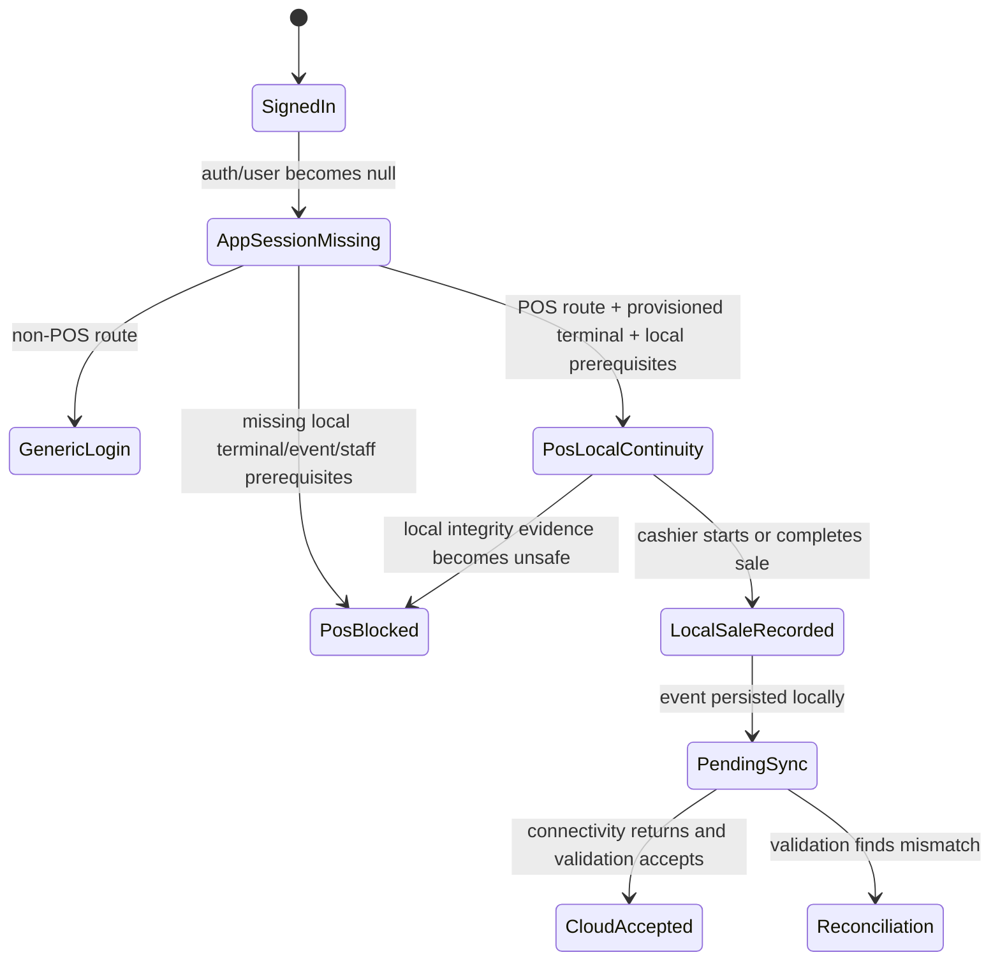
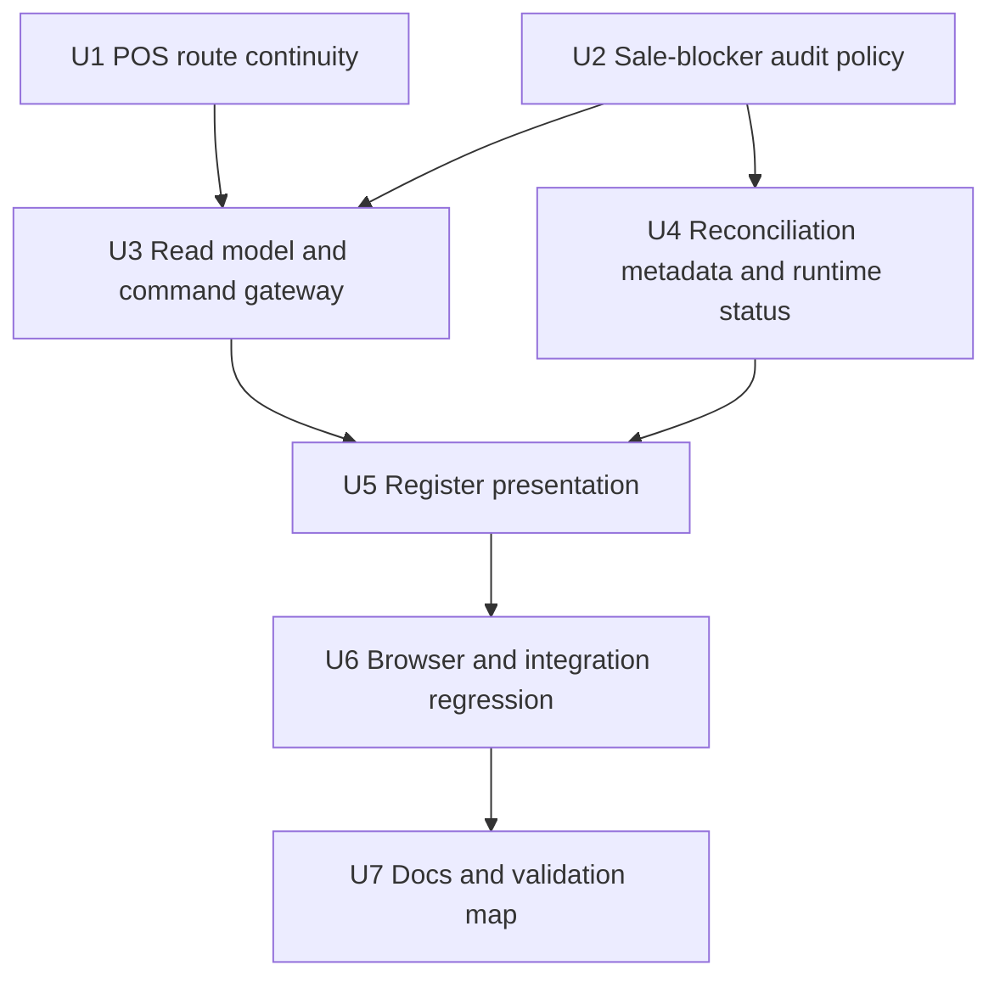

# feat: Keep provisioned POS terminals selling offline

## Summary

This plan extends Athena's route-scoped POS continuity into local sales continuity: a returning provisioned terminal with local sale authority can keep starting and completing sales when app-session validation is unavailable, including when Convex is totally unreachable. The implementation updates the POS route shell, audits sale blockers, converts cloud-validation uncertainty into reconciliation metadata, and verifies the full no-network register path.

---

## Problem Frame

The current POS route/app-session recovery work keeps the POS shell available during drift, but it can still pause the register while recovery is waiting for network. For field terminals, that leaves cashiers unable to fix a cloud-session problem during an outage even though the local POS state may be sufficient to record sales.

---

## Requirements

- R1. A returning provisioned POS terminal must not require fresh app sign-in to enter POS when the network is unavailable or Convex is totally unreachable. Origin: R1, F1, AE1.
- R2. Missing, stale, or unvalidated app-level session state during total network loss must not block POS route entry for a returning provisioned terminal. Origin: R2, F1, AE1.
- R3. Missing, stale, or unvalidated app-level session state during total network loss must not block starting a new local sale when local POS authority is otherwise sufficient. Origin: R3, F1, F3, AE2, AE4.
- R4. Missing, stale, or unvalidated app-level session state during total network loss must not block completing an active local cart, payment, or sale when local POS authority is otherwise sufficient. Origin: R4, F2, AE3.
- R5. POS continuity must stay scoped to POS register operation and must not become generic Athena app access. Origin: R5, AE1.
- R6. POS sale authority must continue to come from local terminal, staff, drawer/register, readiness, and command evidence, not app-session recovery alone. Origin: R6, R7, F1, AE2.
- R7. Cashier-facing checkout must proceed through the normal POS workflow when local sale authority is sufficient, without presenting review or reconciliation as a normal-flow task. Origin: R8, F1, F2.
- R8. Local sale actions must be durably recorded with enough terminal, staff, register, sale, payment, and timing context for later sync and review. Origin: R9, R10, AE3.
- R9. The implementation must audit all known sale-affecting blockers and classify each as local recording impossible, locally known unsafe, or cloud-validation uncertainty. Origin: R11, R12, R13, F3, AE4.
- R10. Cloud-validation uncertainty must default to local sale continuation plus internal reconciliation when local recording and local sale authority are available. Origin: R14, F3, AE4.
- R11. Retained hard blockers must be limited to local recording impossible or locally known unsafe states, with explicit product justification and operator-safe recovery paths. Origin: R15, R16, AE5.
- R12. App-session uncertainty must be captured as internal audit/reconciliation context on local history, not as a cashier workflow interruption. Origin: R17, AE6.
- R13. Reconnection must validate locally recorded sale history against app-session, terminal, drawer, staff, and sync authority rules. Origin: R18, F4, AE6, AE7.
- R14. Clean local sale history must sync into normal POS cloud records; unresolved mismatches must become manager/support review while preserving completed local history. Origin: R19, R20, R21, F4, AE6, AE7.

**Origin actors:** A1 Cashier, A2 Store manager or support operator, A3 Athena POS terminal, A4 Athena cloud.
**Origin flows:** F1 Continue selling after app-session loss while offline, F2 Complete active checkout during network loss, F3 Audit and convert field-unsafe sale blockers, F4 Reconcile after connectivity returns.
**Origin acceptance examples:** AE1, AE2, AE3, AE4, AE5, AE6, AE7.

---

## Scope Boundaries

- Fresh app login while offline remains out of scope.
- Fresh POS recovery-code verification while offline remains out of scope.
- First-time terminal provisioning while offline remains out of scope.
- Terminal repair while offline remains out of scope unless repair can be completed entirely from already trusted local state.
- Non-POS Athena routes must not inherit POS offline continuity.
- Offline manager approval for protected manager-only commands remains out of scope unless planned separately.
- Payment-provider-specific offline authorization behavior is unchanged; this plan preserves the current POS payment recording model.
- Exact local storage field shapes, sync payload fields, and review-surface UI details are implementation-time choices within the boundaries of this plan.

### Deferred to Follow-Up Work

- Broaden offline continuity to POS subroutes that are not required for register operation, such as expense reports, terminal detail management, or transaction history browsing.
- Add fleet-level reporting for stores that repeatedly produce app-session-unverified reconciliation items.
- Revisit any retained hard blocker after production evidence shows it still interrupts field sales unnecessarily.

---

## Context & Research

### Relevant Code and Patterns

- `packages/athena-webapp/src/routes/_authed.tsx` owns the current signed-out redirect, POS-only shell, app-session recovery pending shell, and non-POS route protection.
- `packages/athena-webapp/src/routes/_authed.test.tsx` already proves POS shell recovery and contains a current expectation that POS mutations pause while recovery is `waiting_for_network`; that expectation should become a regression target for the new product stance.
- `packages/athena-webapp/src/lib/pos/infrastructure/terminal/usePosTerminalAppSessionRecovery.ts` waits for network before validating app-session recovery and publishes `waiting_for_network`, `recoverable`, and `blocked` states.
- `packages/athena-webapp/src/lib/pos/infrastructure/terminal/posTerminalAppSessionRecoveryContext.tsx` projects recovery state into POS runtime diagnostics.
- `packages/athena-webapp/src/lib/pos/presentation/register/useRegisterViewModel.ts` consumes app-session recovery runtime input, local sync runtime, local read model, cashier presence, drawer gates, and command handlers that drive product/service entry and transaction completion.
- `packages/athena-webapp/src/components/pos/CashierAuthDialog.tsx` already supports offline staff authentication using terminal-scoped local staff authority.
- `packages/athena-webapp/src/lib/pos/infrastructure/local/registerReadModel.ts` computes `canSell` and current sale block reasons from active register state, terminal integrity, drawer authority, and uploaded lifecycle review events.
- `packages/athena-webapp/src/lib/pos/infrastructure/local/localCommandGateway.ts` gates sale-affecting local appends and currently hard-stops several authority/review states.
- `packages/athena-webapp/src/lib/pos/infrastructure/local/usePosLocalSyncRuntime.ts`, `syncScheduler.ts`, `syncContract.ts`, and `terminalRuntimeStatus.ts` own local event upload, review event marking, support-safe runtime diagnostics, and terminal check-ins.
- `packages/athena-webapp/src/offline/posAppShellRoutes.ts`, `registerPosAppShellServiceWorker.ts`, `posOfflineReadiness.ts`, and `src/tests/pos/offlineRouteAccess.spec.ts` provide the existing no-network route-access foundation and browser regression pattern.

### Institutional Learnings

- `docs/solutions/architecture/athena-pos-local-first-sync-2026-05-13.md`: POS local events are the first durable cashier record; preserve completed local sales and route conflicts to review.
- `docs/solutions/architecture/athena-pos-always-local-first-register-2026-05-14.md`: cashier commands must append local register events before returning success, regardless of browser online state.
- `docs/solutions/architecture/athena-pos-local-staff-authority-2026-05-14.md`: offline staff sign-in uses terminal-scoped local verifiers and wrapped proof tokens, not online PIN hashes.
- `docs/solutions/architecture/athena-pos-offline-route-access-2026-06-03.md`: app-shell route continuity is POS-scoped and must not imply terminal integrity, drawer authority, staff authority, or command permission.
- `docs/solutions/architecture/athena-pos-hub-app-session-continuity-2026-06-02.md`: app-session recovery keeps POS mounted but must not become sale authority or generic app access.
- `docs/solutions/logic-errors/athena-pos-stale-terminal-sale-block-2026-05-29.md`: terminal integrity and drawer authority are separate persisted sale-authority inputs and cannot be inferred only from the event log.
- `docs/product-copy-tone.md`: any operator-facing copy should stay calm, restrained, operational, and normalized away from raw backend wording.

### External References

- No external references are needed for planning. The change is constrained by Athena's existing POS local-first architecture and route-scoped app-session recovery; implementation should consult official Convex Auth documentation only if it changes supported auth-session mechanics.

---

## Key Technical Decisions

| Decision | Rationale |
|---|---|
| Keep the app-session layer route scoped | The origin explicitly rejects broad offline app access; `_authed` should continue to distinguish POS register operation from generic Athena authentication. |
| Treat `waiting_for_network` as POS-local continuation when local sale authority is sufficient | The current pause is the field failure. Network absence, including total Convex unreachability, should delay cloud validation and sync, not local sale recording. |
| Add a sale-blocker policy/audit boundary | The implementation needs one place to classify blockers as local impossibility, local unsafe evidence, or cloud uncertainty instead of scattering product decisions through route, view-model, read-model, and gateway code. |
| Preserve local terminal/drawer integrity as hard-block candidates | These states are locally known evidence that sale authority may be invalid. They can remain blockers only when the audit justifies them as locally unsafe rather than merely cloud-unverified. |
| Convert uploaded review and sync uncertainty into reconciliation where possible | A server-acknowledged review item should not automatically freeze unrelated future field sales if the local drawer/session can keep recording evidence for later review. |
| Keep cashier UI normal for expected offline selling | The user explicitly rejected normal-flow review warnings. Support and manager review surfaces should carry reconciliation details after the fact. |
| Do not bypass authenticated cloud sync boundaries | Local recording can proceed offline, but upload still needs a supported app-session recovery, POS-scoped validation path, or existing authenticated sync context before cloud mutation. |
| Verify with browser no-network and unit-level blocker coverage | This failure spans route shell, local register state, command appends, and sync diagnostics; unit tests alone will miss hard-reload and auth-rehydration failures. |

---

## Open Questions

### Resolved During Planning

- Should new sales be blocked while app-session recovery is waiting for network? No. They should proceed locally when local sale authority is sufficient.
- Should active cart/payment completion be supported in the same state? Yes. Both new-sale start and active-sale completion are in scope.
- Should operators see normal-flow review warnings for this state? No. Housekeeping should happen behind the scenes unless a locally known unsafe state exists.
- Should all current sale blockers be accepted as-is? No. The plan must audit them and justify any retained hard blocker.

### Deferred to Implementation

- Exact blocker-policy representation: implementation should choose the smallest helper/type shape that clarifies classification without over-abstracting the command gateway.
- Exact reconciliation metadata fields: implementation should extend local event/sync metadata only as much as needed to identify app-session-unverified or cloud-validation-uncertain local history.
- Exact retained hard-block list: the implementation audit must produce it from current code behavior and tests, then document it in code comments/tests or a solution note.
- Exact review target for unresolved mismatches: use existing terminal health, cash-control review, and POS sync review surfaces where possible before creating new review UI.

---

## High-Level Technical Design

> *This illustrates the intended approach and is directional guidance for review, not implementation specification. The implementing agent should treat it as context, not code to reproduce.*

The sale-blocker audit should classify each relevant state before it reaches the cashier path:

| Blocker class | Meaning | Cashier behavior | Examples to evaluate |
|---|---|---|---|
| Local recording impossible | The terminal cannot create durable local sale evidence | Hard block | No local event store, no terminal/store identity, unreadable local DB |
| Locally known unsafe | Local evidence says this terminal/drawer/session cannot safely append sale-affecting work | Hard block with recovery path | Terminal integrity repair, drawer authority block, closed local register without reopen |
| Cloud-validation uncertainty | The cloud cannot currently validate, or a prior upload needs review, but local recording remains possible | Continue sale locally and reconcile later | App-session waiting for network, sync review, stale live store/drawer state |

### Preliminary Sale-Blocker Audit Results

This is the planning-time audit of current sale-affecting blockers in the POS route shell, register read model, local command gateway, sync runtime, cashier/staff authority, catalog/availability path, and related solution notes. Implementation should verify the table with tests, but product sign-off should happen here so engineers are not making blocker policy ad hoc.

| Current blocker or stop condition | Current source | Intended classification | Sign-off disposition |
|---|---|---|---|
| App-session recovery is `waiting_for_network`, app user is missing on a POS route, or Convex is totally unreachable while a returning terminal has local POS prerequisites | `packages/athena-webapp/src/routes/_authed.tsx`, `packages/athena-webapp/src/lib/pos/infrastructure/terminal/usePosTerminalAppSessionRecovery.ts` | Cloud-validation uncertainty | Continue route entry, new sale start, active cart/payment updates, and completion locally. Tag local history for app-session-unverified reconciliation and defer cloud upload. |
| Missing POS app shell, missing local POS entry context, missing terminal seed, missing stored app account id, or unsupported local route scope after hard reload | `packages/athena-webapp/src/routes/_authed.tsx`, `packages/athena-webapp/src/offline/posOfflineReadiness.ts`, `docs/solutions/architecture/athena-pos-offline-route-access-2026-06-03.md` | Local recording impossible | Hard block with setup/reload guidance. The app cannot prove the terminal/store scope needed for local sale evidence. |
| Missing store id, terminal id, register session id for a sale event, sync secret, or writable local POS event store; unreadable IndexedDB or unsupported local schema | `packages/athena-webapp/src/lib/pos/infrastructure/local/posLocalStore.ts`, `packages/athena-webapp/src/lib/pos/infrastructure/local/localCommandGateway.ts`, `packages/athena-webapp/src/lib/pos/infrastructure/local/registerReadModel.ts` | Local recording impossible | Hard block until local storage/setup is repaired. Do not create sales that cannot be durably scoped and replayed. |
| No open/active local drawer/register session for the sale | `packages/athena-webapp/src/lib/pos/infrastructure/local/registerReadModel.ts`, `packages/athena-webapp/src/lib/pos/infrastructure/local/localCommandGateway.ts`, `packages/athena-webapp/src/lib/pos/presentation/register/useRegisterViewModel.ts` | Local recording impossible until a local drawer event exists | Block sale commands, but keep drawer open/recovery local-first. Opening or recovering the drawer must not depend on Convex when local setup is sufficient. |
| Register is locally closing/closed after closeout started | `packages/athena-webapp/src/lib/pos/infrastructure/local/registerReadModel.ts`, `packages/athena-webapp/src/lib/pos/infrastructure/local/localCommandGateway.ts`, `docs/solutions/architecture/athena-pos-local-first-sync-2026-05-13.md` | Locally known unsafe | Hard block new sales for that drawer until a permitted local reopen is recorded. Closeout/reopen evidence syncs later. |
| Terminal integrity state is not healthy, including sync/check-in `authorization_failed` with terminal authorization failure metadata | `packages/athena-webapp/src/lib/pos/infrastructure/local/usePosLocalSyncRuntime.ts`, `packages/athena-webapp/src/lib/pos/infrastructure/local/registerReadModel.ts`, `docs/solutions/logic-errors/athena-pos-stale-terminal-sale-block-2026-05-29.md` | Locally known unsafe | Hard block future sale-affecting writes until terminal repair/reprovision clears integrity state. Preserve already completed local history. |
| Drawer authority is blocked because the mapped cloud drawer is closed or a drawer lifecycle command was rejected for the current drawer | `packages/athena-webapp/src/lib/pos/presentation/register/useRegisterViewModel.ts`, `packages/athena-webapp/src/lib/pos/infrastructure/local/usePosLocalSyncRuntime.ts`, `packages/athena-webapp/src/lib/pos/infrastructure/local/localCommandGateway.ts` | Locally known unsafe for the affected drawer | Do not keep appending to that drawer. Allow a new/recovered local drawer session when the app can record distinct drawer evidence; otherwise hard block with drawer recovery. |
| Drawer authority is `authority_unknown`, mapping write failed, live cloud drawer/store state is stale, or prior upload review lacks explicit local-unsafe evidence | `packages/athena-webapp/src/lib/pos/infrastructure/local/usePosLocalSyncRuntime.ts`, `packages/athena-webapp/src/lib/pos/presentation/register/useRegisterViewModel.ts` | Cloud-validation uncertainty | Continue locally when terminal/drawer/staff/local store evidence is otherwise sufficient. Route the uncertainty to reconciliation instead of freezing unrelated future sales. |
| Uploaded `needs_review` event exists for register lifecycle or completed sale | `packages/athena-webapp/src/lib/pos/infrastructure/local/registerReadModel.ts`, `packages/athena-webapp/src/lib/pos/infrastructure/local/usePosLocalSyncRuntime.ts`, `docs/solutions/logic-errors/athena-pos-register-sync-closeout-review-recovery-2026-05-23.md` | Split by review reason | Hard block only when review proves the current drawer/session is locally unsafe. Ordinary sync/reconciliation review must not block future local sales. |
| Pending sync, failed sync retry, held batch, retryable sync authorization failure, browser offline, or Convex unavailable | `packages/athena-webapp/src/lib/pos/infrastructure/local/usePosLocalSyncRuntime.ts`, `packages/athena-webapp/src/lib/pos/infrastructure/local/syncScheduler.ts` | Cloud-validation uncertainty | Keep appending local sale evidence. Retry/defer upload and expose manager/support reconciliation after the fact. |
| No signed-in cashier, missing staff profile id, missing event-scoped staff proof for uploadable events, expired/revoked local authority, or staff presence scoped to the wrong store/terminal/date | `packages/athena-webapp/src/components/pos/CashierAuthDialog.tsx`, `packages/athena-webapp/src/lib/pos/presentation/register/useRegisterViewModel.ts`, `docs/solutions/architecture/athena-pos-local-staff-authority-2026-05-14.md` | Local recording impossible or locally known unsafe, depending on the missing evidence | Require local cashier sign-in or online staff refresh. If fresh local proof exists and only cloud validation is pending, treat that pending validation as cloud uncertainty and continue. |
| Product/service local identity or required payload fields are missing: SKU id, product id, service catalog id, local price, customer/amount required by service checkout, or payment details required to complete | `packages/athena-webapp/src/lib/pos/presentation/register/useRegisterViewModel.ts`, `packages/athena-webapp/src/components/pos/OrderSummary.tsx` | Local recording impossible | Hard block only until the cashier supplies the missing local sale data. This is not a cloud/network blocker. |
| Catalog availability is unknown, stale, or reports no trusted quantity remaining, but the app has local SKU identity and price needed to record the sale | `packages/athena-webapp/src/lib/pos/presentation/register/catalogSearchPresentation.ts`, `packages/athena-webapp/src/lib/pos/presentation/register/useRegisterViewModel.ts`, `docs/solutions/architecture/athena-pos-offline-inventory-snapshot-2026-05-15.md` | Inventory validation uncertainty | Target behavior: allow the sale locally and create inventory reconciliation if cloud stock later disagrees. Retain a hard block only when the app cannot identify the item/price locally. |
| Payment-provider-specific online authorization is unavailable | Current POS payment recording model and scope boundary | Outside this plan's authority | Preserve current POS payment recording behavior. Do not imply Athena can override an external payment terminal/provider that refuses offline authorization. |

---

## Implementation Units

- U1. **Allow POS route continuity while recovery waits for network**

**Goal:** Change the POS route shell so a returning provisioned terminal can mount the POS register while app-session recovery is waiting for network, without granting generic app access.

**Requirements:** R1, R2, R5, R6, R12.

**Dependencies:** None.

**Files:**
- Modify: `packages/athena-webapp/src/routes/_authed.tsx`
- Modify: `packages/athena-webapp/src/lib/pos/infrastructure/terminal/usePosTerminalAppSessionRecovery.ts`
- Modify: `packages/athena-webapp/src/lib/pos/infrastructure/terminal/posTerminalAppSessionRecoveryContext.tsx`
- Test: `packages/athena-webapp/src/routes/_authed.test.tsx`
- Test: `packages/athena-webapp/src/lib/pos/infrastructure/terminal/usePosTerminalAppSessionRecovery.test.ts`

**Approach:**
- Replace the current "pending recovery shell pauses POS mutations" behavior for `waiting_for_network` with POS-local continuity when the local entry context is ready and the terminal has a stored app account id.
- Preserve pending/blocked behavior for recovery states that do not have enough local POS context or where the server has already rejected the terminal/app account.
- Keep non-POS route redirect parity exactly as-is.
- Keep recovery runtime context available so the register/sync layers can tag local work and report support-safe diagnostics without using app-session recovery as sale authority.

**Execution note:** Add failing route-shell characterization for the current `waiting_for_network` pause before changing behavior.

**Patterns to follow:**
- Existing POS-only shell handling in `packages/athena-webapp/src/routes/_authed.tsx`.
- Route-scoped recovery boundary in `docs/solutions/architecture/athena-pos-hub-app-session-continuity-2026-06-02.md`.
- POS offline route access tests in `packages/athena-webapp/src/routes/_authed.test.tsx`.

**Test scenarios:**
- Covers AE1. Happy path: POS register route with ready local entry context and recovery `waiting_for_network` renders the POS outlet instead of the recovery waiting shell.
- Covers AE1. Happy path: POS hub route with app user missing and local terminal context does not navigate to `/login` while offline.
- Edge case: recovery `validating` or `retrying` while online can still show pending recovery if the implementation keeps cloud validation in-flight before local continuity is selected.
- Error path: recovery `blocked` still renders the POS blocked shell.
- Error path: missing seed, store mismatch, or unsupported local schema still blocks POS continuity.
- Integration: non-POS routes still redirect to `/login` when app user is null even if a POS terminal seed exists.

**Verification:**
- Route tests prove `waiting_for_network` no longer blocks POS register mounting for a trusted returning terminal and non-POS route behavior is unchanged.

---

- U2. **Create the POS sale-blocker audit policy**

**Goal:** Make sale-blocker classification explicit so implementation can convert cloud-validation uncertainty into reconciliation and retain only justified hard blockers.

**Requirements:** R3, R4, R6, R9, R10, R11.

**Dependencies:** None.

**Files:**
- Create: `packages/athena-webapp/src/lib/pos/infrastructure/local/saleBlockerPolicy.ts`
- Test: `packages/athena-webapp/src/lib/pos/infrastructure/local/saleBlockerPolicy.test.ts`
- Modify: `packages/athena-webapp/src/lib/pos/infrastructure/local/registerReadModel.ts`
- Modify: `packages/athena-webapp/src/lib/pos/infrastructure/local/localCommandGateway.ts`
- Test: `packages/athena-webapp/src/lib/pos/infrastructure/local/registerReadModel.test.ts`
- Test: `packages/athena-webapp/src/lib/pos/infrastructure/local/localCommandGateway.test.ts`

**Approach:**
- Introduce a small decision boundary that classifies sale-affecting stop conditions as local recording impossible, locally known unsafe, or cloud-validation uncertainty.
- Encode the preliminary audit results above, then verify them against the implementation. If code discovery finds another sale-affecting stop condition, classify it in the same table before adding or retaining a hard block.
- Use the policy from the read model and command gateway so UI and command acceptance agree on whether the cashier can proceed.
- Retain hard blockers only when they are locally unsafe or prevent durable local recording. Treat app-session waiting, sync review, stale cloud state, and unresolved live validation as reconciliation candidates when local recording remains possible.
- Make the retained hard-block list visible in tests so future additions cannot silently stop field sales.

**Patterns to follow:**
- Existing `canSell` and `saleBlockReason` logic in `packages/athena-webapp/src/lib/pos/infrastructure/local/registerReadModel.ts`.
- Existing command preconditions in `packages/athena-webapp/src/lib/pos/infrastructure/local/localCommandGateway.ts`.
- Stale-terminal prevention guidance in `docs/solutions/logic-errors/athena-pos-stale-terminal-sale-block-2026-05-29.md`.

**Test scenarios:**
- Covers AE4. Happy path: app-session `waiting_for_network` is classified as cloud-validation uncertainty, not a hard blocker.
- Covers AE4. Happy path: uploaded review, mapping uncertainty, pending sync, failed sync retry, and stale cloud validation that do not make local recording unsafe are classified as reconciliation, not sale stops.
- Covers AE5. Error path: missing local event destination is classified as local recording impossible.
- Covers AE5. Error path: terminal integrity requiring reprovision remains locally known unsafe unless the audit proves a narrower safe continuation case.
- Error path: drawer authority block remains locally known unsafe for the affected drawer, while a new/recovered drawer can proceed when distinct local evidence can be recorded.
- Edge case: unknown store-day live state, unknown catalog availability, or stale cloud inventory is not a hard blocker when the local sale payload can be recorded and reconciled.
- Integration: read-model classification and command-gateway classification return compatible decisions for the same event history.

**Verification:**
- A focused blocker policy test suite enumerates current sale blockers and the intended product classification for each one.

---

- U3. **Let local read model and command gateway continue sales under cloud uncertainty**

**Goal:** Apply the blocker policy to sale-affecting local commands so new sales and active sale completion proceed locally when only cloud validation is missing.

**Requirements:** R3, R4, R6, R7, R8, R10, R11.

**Dependencies:** U1, U2.

**Files:**
- Modify: `packages/athena-webapp/src/lib/pos/infrastructure/local/registerReadModel.ts`
- Modify: `packages/athena-webapp/src/lib/pos/infrastructure/local/localCommandGateway.ts`
- Modify: `packages/athena-webapp/src/lib/pos/presentation/register/useRegisterViewModel.ts`
- Test: `packages/athena-webapp/src/lib/pos/infrastructure/local/registerReadModel.test.ts`
- Test: `packages/athena-webapp/src/lib/pos/infrastructure/local/localCommandGateway.test.ts`
- Test: `packages/athena-webapp/src/lib/pos/presentation/register/useRegisterViewModel.test.ts`

**Approach:**
- Replace unconditional hard stops for cloud-validation uncertainty with a sellable local read-model state that still carries reconciliation metadata.
- Ensure `startSession`, cart item append, service line append, payment state append, transaction completion, closeout start, and permitted reopen use the same policy.
- Keep local command append as the first durable write before returning cashier success.
- Preserve current hard blockers for no local register/session identity, no staff authority, terminal integrity repair, unreadable local store, and any other policy-classified local impossibility or unsafe state.
- Make active cart/payment completion explicitly covered so it does not regress while new-sale start is being fixed.

**Execution note:** Implement command-gateway behavior test-first because these methods define the cashier-path write boundary.

**Patterns to follow:**
- Local-first command rule in `docs/solutions/architecture/athena-pos-always-local-first-register-2026-05-14.md`.
- Existing local append APIs in `packages/athena-webapp/src/lib/pos/infrastructure/local/localCommandGateway.ts`.
- Register view-model command handlers in `packages/athena-webapp/src/lib/pos/presentation/register/useRegisterViewModel.ts`.

**Test scenarios:**
- Covers AE2. Happy path: starting a new local sale succeeds while app-session recovery is waiting for network and local terminal/staff/drawer state is sufficient.
- Covers AE3. Happy path: appending payment and completing an active sale succeeds under the same app-session-unverified offline state.
- Happy path: normal pending offline sync remains sellable.
- Edge case: an uploaded review item on a completed prior sale creates reconciliation metadata without disabling product/service entry for a new sale when the drawer remains locally usable.
- Error path: command appends still fail when local event storage returns an error.
- Error path: command appends still fail when terminal identity, store identity, staff profile, or local register session id is missing.
- Error path: local closeout remains a hard stop until a permitted reopen event is recorded.
- Integration: view-model `productEntry.disabled` and `serviceEntry.disabled` align with the command gateway's sale-continuation decision.

**Verification:**
- Local read-model, command-gateway, and view-model tests prove both new-sale start and active-sale completion continue under cloud uncertainty while retained hard blockers still stop unsafe local appends.

---

- U4. **Carry app-session uncertainty into sync and reconciliation metadata**

**Goal:** Preserve enough internal evidence for cloud validation and review after connectivity returns without surfacing reconciliation as a cashier task.

**Requirements:** R8, R10, R12, R13, R14.

**Dependencies:** U2, U3.

**Files:**
- Modify: `packages/athena-webapp/src/lib/pos/infrastructure/local/posLocalStore.ts`
- Modify: `packages/athena-webapp/src/lib/pos/infrastructure/local/syncContract.ts`
- Modify: `packages/athena-webapp/src/lib/pos/infrastructure/local/syncScheduler.ts`
- Modify: `packages/athena-webapp/src/lib/pos/infrastructure/local/usePosLocalSyncRuntime.ts`
- Modify: `packages/athena-webapp/src/lib/pos/infrastructure/local/terminalRuntimeStatus.ts`
- Modify: `packages/athena-webapp/convex/pos/public/sync.ts`
- Modify: `packages/athena-webapp/convex/pos/public/terminals.ts`
- Test: `packages/athena-webapp/src/lib/pos/infrastructure/local/posLocalStore.test.ts`
- Test: `packages/athena-webapp/src/lib/pos/infrastructure/local/syncContract.test.ts`
- Test: `packages/athena-webapp/src/lib/pos/infrastructure/local/syncScheduler.test.ts`
- Test: `packages/athena-webapp/src/lib/pos/infrastructure/local/usePosLocalSyncRuntime.test.ts`
- Test: `packages/athena-webapp/src/lib/pos/infrastructure/local/terminalRuntimeStatus.test.ts`
- Test: `packages/athena-webapp/convex/pos/public/sync.test.ts`
- Test: `packages/athena-webapp/convex/pos/public/terminals.test.ts`

**Approach:**
- Add internal metadata to local events or sync batches that says the event was recorded while app-session validation was unavailable, without storing reusable credentials or exposing raw auth data.
- Keep metadata support-safe in terminal runtime diagnostics. Diagnostics can show that app-session validation was unavailable or recovered, but must not expose tokens, proof material, payment payloads, or customer data.
- On sync, allow the server to accept clean events once terminal, drawer, staff proof, and app-session conditions validate.
- When network returns but app-session recovery is still unresolved, keep local history durable and defer upload until a supported authenticated or POS-scoped validation path is available; do not introduce unauthenticated sync mutation access.
- When validation cannot accept cleanly, route the local history into existing review/reconciliation paths with enough local event identifiers, terminal/store/staff context, and sanitized reason categories.
- Keep idempotency and sequence ordering intact for events recorded in this state.

**Patterns to follow:**
- Sync review behavior in `packages/athena-webapp/src/lib/pos/infrastructure/local/syncScheduler.ts`.
- Support-safe runtime diagnostics in `packages/athena-webapp/src/lib/pos/infrastructure/local/terminalRuntimeStatus.ts`.
- Local review event sampling tests that redact payments and customer data.

**Test scenarios:**
- Covers AE6. Happy path: events recorded while app-session validation is unavailable sync cleanly after connectivity returns and validation succeeds.
- Covers AE7. Error path: server rejection for terminal, drawer, staff, or app-session mismatch marks events for review without deleting local history.
- Edge case: retrying the same app-session-unverified events remains idempotent and does not duplicate cloud records.
- Edge case: network returns before app-session recovery completes; sync remains deferred without losing local history or exposing unauthenticated upload access.
- Error path: runtime diagnostics redact raw recovery reasons, tokens, staff proof material, payment payloads, and customer data.
- Integration: terminal runtime check-in includes support-safe app-session/reconciliation posture alongside existing sync, terminal integrity, and drawer authority diagnostics.

**Verification:**
- Sync/runtime tests prove app-session-unverified local history is internally traceable, safely reportable, accepted when clean, and reviewable when mismatched.

---

- U5. **Keep cashier presentation normal while preserving support visibility**

**Goal:** Ensure the register UI does not present expected offline/app-session-unverified operation as a cashier-facing review problem, while support/manager surfaces still expose real reconciliation work.

**Requirements:** R7, R10, R11, R12, R14.

**Dependencies:** U3, U4.

**Files:**
- Modify: `packages/athena-webapp/src/components/pos/register/POSRegisterView.tsx`
- Modify: `packages/athena-webapp/src/components/pos/register/POSRegisterOpeningGuard.tsx`
- Modify: `packages/athena-webapp/src/components/pos/register/RegisterDrawerGate.tsx`
- Modify: `packages/athena-webapp/src/components/pos/terminals/POSTerminalHealthView.tsx`
- Modify: `packages/athena-webapp/src/components/pos/terminals/terminalHealthPresentation.ts`
- Modify: `packages/athena-webapp/src/offline/posOfflineReadiness.ts`
- Test: `packages/athena-webapp/src/components/pos/register/POSRegisterView.test.tsx`
- Test: `packages/athena-webapp/src/components/pos/register/POSRegisterOpeningGuard.test.tsx`
- Test: `packages/athena-webapp/src/components/pos/register/RegisterDrawerGate.test.tsx`
- Test: `packages/athena-webapp/src/components/pos/terminals/POSTerminalHealthView.test.tsx`
- Test: `packages/athena-webapp/src/components/pos/terminals/terminalHealthPresentation.test.ts`
- Test: `packages/athena-webapp/src/offline/posOfflineReadiness.test.ts`

**Approach:**
- Remove or narrow normal-flow "recovery waiting for network" and "review pending" copy from the cashier path when local sale authority is sufficient.
- Keep actual hard blockers visible with specific operator-safe recovery paths, such as reconnecting terminal setup, signing in a locally authorized cashier, reopening a locally closed drawer, or repairing terminal integrity.
- Keep terminal health and support diagnostics as the place to explain app-session recovery, local review records, and cloud reconciliation mismatches.
- Ensure manager/support review copy distinguishes pending sync, local-only review evidence, uploaded review events, and accepted reconciliation.

**Patterns to follow:**
- Existing POS sync review presentation in `packages/athena-webapp/src/components/pos/register/POSRegisterView.tsx`.
- Terminal health visibility guidance in `docs/solutions/architecture/athena-pos-terminal-health-visibility-2026-05-20.md`.
- Product copy guidance in `docs/product-copy-tone.md`.

**Test scenarios:**
- Covers AE2. Happy path: cashier can see and use product/service entry while app-session validation is unavailable and local authority is sufficient.
- Covers AE3. Happy path: active checkout completion does not display app-session recovery as a blocking warning.
- Edge case: support diagnostics still include app-session recovery/reconciliation status in redacted terms.
- Error path: retained hard blockers show operator-safe recovery copy.
- Error path: raw backend errors, tokens, staff proof, payment payloads, and customer data do not appear in cashier or support diagnostics.
- Integration: POS readiness remains diagnostic only and does not become a sale blocker by itself.

**Verification:**
- Component tests prove normal cashier flow remains quiet during expected offline continuation while retained hard blockers and support diagnostics remain visible where appropriate.

---

- U6. **Add no-network sales-continuity regression coverage**

**Goal:** Prove the whole browser path: provisioned terminal, no network and no reachable Convex backend, missing app session, local cashier sign-in, new sale start, active payment/completion, and later reconciliation visibility.

**Requirements:** R1, R2, R3, R4, R7, R8, R12, R14.

**Dependencies:** U1, U3, U4, U5.

**Files:**
- Modify: `packages/athena-webapp/src/tests/pos/offlineRouteAccess.spec.ts`
- Create: `packages/athena-webapp/src/tests/pos/offlineSalesContinuity.spec.ts`
- Modify: `packages/athena-webapp/playwright.config.ts` if scenario setup needs deterministic POS local fixtures
- Modify: `scripts/harness-app-registry.ts`
- Test: `packages/athena-webapp/src/tests/pos/offlineSalesContinuity.spec.ts`

**Approach:**
- Extend the existing Playwright no-network setup rather than inventing a new browser harness.
- Seed or prepare a provisioned terminal with local app shell, terminal seed, local staff authority, catalog/readiness snapshots, and a local register context.
- Simulate app-session loss or missing app user, block network so Convex queries/mutations are unreachable, hard reload into `/pos/register`, authenticate locally if needed, start a sale, add an item/service, record payment, and complete the sale.
- Include an active-cart variant where the outage/session-loss happens mid-flow before payment/completion.
- Verify local evidence exists after completion without depending on Convex reads, Convex mutations, or cloud sync.
- Re-enable network in a separate scenario only if the existing harness can do so deterministically; otherwise leave cloud reconciliation acceptance to unit/integration tests in U4.

**Patterns to follow:**
- Browser no-network regression in `packages/athena-webapp/src/tests/pos/offlineRouteAccess.spec.ts`.
- CI Convex env fallback note from recent offline-route work.
- Harness registry pattern in `scripts/harness-app-registry.ts`.

**Test scenarios:**
- Covers AE1. Browser hard reload with network blocked and Convex unreachable reaches the POS register rather than login or blank shell.
- Covers AE2. Browser no-network scenario starts a new sale and appends local sale evidence when app session is missing.
- Covers AE3. Browser no-network scenario completes an already active cart/payment flow after app-session loss.
- Error path: browser no-network scenario with missing terminal seed does not allow sale and shows the retained hard-block path.
- Integration: local sale evidence persists across reload after completion.

**Verification:**
- Browser regression proves the field case end to end, and harness registry maps changed POS offline/sales-continuity files to the focused scenario.

---

- U7. **Document the final blocker policy and validation map**

**Goal:** Preserve the new field-sales posture so future POS changes do not reintroduce cloud-validation sale stops.

**Requirements:** R9, R10, R11, R14.

**Dependencies:** U2, U3, U4, U6.

**Files:**
- Create: `docs/solutions/architecture/athena-pos-offline-sales-continuity-2026-06-04.md`
- Modify: `docs/solutions/architecture/athena-pos-hub-app-session-continuity-2026-06-02.md`
- Modify: `docs/solutions/logic-errors/athena-pos-stale-terminal-sale-block-2026-05-29.md`
- Modify: `scripts/harness-app-registry.ts`
- Test: `scripts/harness-app-registry.test.ts` if present, or the nearest harness registry test file discovered during implementation

**Approach:**
- Add a solution note that states the blocker taxonomy, retained hard-block policy, and reconciliation-over-interruption stance.
- Update existing app-session and stale-terminal notes so future work understands that app-session uncertainty is not sale authority and not a sale stop by itself.
- Update harness mapping so changes to the route shell, recovery runtime, blocker policy, local command gateway, read model, sync runtime, terminal diagnostics, or offline browser specs trigger the right focused tests.

**Patterns to follow:**
- Existing solution note shape in `docs/solutions/architecture/athena-pos-offline-route-access-2026-06-03.md`.
- Harness registry coverage mentioned in POS local-first and offline-route solution docs.

**Test scenarios:**
- Test expectation: focused harness registry coverage only if the repo has a test for `scripts/harness-app-registry.ts`; otherwise validate by static review and existing harness generation checks.

**Verification:**
- The final docs explain which blockers remain hard stops, which become reconciliation, and which tests protect the policy.

---

## System-Wide Impact

- **Interaction graph:** `_authed` route classification feeds POS recovery context, which feeds register view-model, local sync runtime, terminal health diagnostics, and browser no-network behavior.
- **Error propagation:** App-session/network failures should become support-safe reconciliation categories, while local impossibility/unsafe states continue to produce operator-safe hard-block copy.
- **State lifecycle risks:** App-session-unverified local events must remain durable across reload, sync retry, and review without storing reusable auth credentials or proof material in unsafe places.
- **API surface parity:** Local register read model, command gateway, view-model disabled states, and runtime diagnostics must agree on the same blocker classification.
- **Integration coverage:** Route unit tests, local command tests, sync/runtime tests, component tests, and Playwright no-network coverage are all needed; none alone proves the field case.
- **Unchanged invariants:** Non-POS routes still require normal app auth; fresh app login and POS recovery-code verification still require network; local staff authority remains separate from app-session recovery; terminal/drawer integrity remains separate from app login.

---

## Risks & Dependencies

| Risk | Mitigation |
|------|------------|
| Converting too many blockers could allow sales when local evidence already proves the terminal or drawer is unsafe. | Use the explicit blocker taxonomy and keep terminal integrity, missing local recording, and locally closed drawer states as retained hard-block candidates unless tests justify a narrower continuation path. |
| Keeping cashier UI quiet could hide real support work. | Keep reconciliation details in terminal health, sync diagnostics, and manager/support review surfaces while avoiding normal-flow cashier interruption. |
| App-session-unverified metadata could leak auth or staff proof material. | Store only safe categories and local event identifiers; test runtime diagnostics for redaction. |
| Browser no-network coverage could be brittle in CI. | Reuse the existing offline route access Playwright pattern and deterministic Convex env fallback; assert DOM/local evidence rather than `networkidle`. |
| Existing tests encode the old pause behavior. | Treat those tests as characterization and update them alongside new route/register tests rather than deleting coverage. |
| Sync may be blocked after reconnect if the app session is still missing. | Keep local sales durable and defer upload until supported app-session recovery or POS-scoped validation succeeds; do not add an unauthenticated sync bypass. |

---

## Documentation / Operational Notes

- Add a solution note after implementation because the blocker taxonomy is a reusable POS architecture decision.
- Update existing app-session continuity and stale-terminal notes to prevent future confusion between app login, sale authority, and reconciliation.
- Run graphify rebuild after code changes during implementation, per repo instructions.
- Keep operator-facing copy aligned with `docs/product-copy-tone.md`.

---

## Sources & References

- **Origin document:** [docs/brainstorms/2026-06-04-pos-offline-app-session-sales-continuity-requirements.md](../brainstorms/2026-06-04-pos-offline-app-session-sales-continuity-requirements.md)
- Related plan: [docs/plans/2026-06-02-001-feat-pos-register-terminal-app-session-plan.md](2026-06-02-001-feat-pos-register-terminal-app-session-plan.md)
- Related plan: [docs/plans/2026-06-03-002-feat-pos-offline-route-access-plan.md](2026-06-03-002-feat-pos-offline-route-access-plan.md)
- Related solution: [docs/solutions/architecture/athena-pos-local-first-sync-2026-05-13.md](../solutions/architecture/athena-pos-local-first-sync-2026-05-13.md)
- Related solution: [docs/solutions/architecture/athena-pos-always-local-first-register-2026-05-14.md](../solutions/architecture/athena-pos-always-local-first-register-2026-05-14.md)
- Related solution: [docs/solutions/architecture/athena-pos-local-staff-authority-2026-05-14.md](../solutions/architecture/athena-pos-local-staff-authority-2026-05-14.md)
- Related solution: [docs/solutions/architecture/athena-pos-offline-route-access-2026-06-03.md](../solutions/architecture/athena-pos-offline-route-access-2026-06-03.md)
- Related solution: [docs/solutions/architecture/athena-pos-hub-app-session-continuity-2026-06-02.md](../solutions/architecture/athena-pos-hub-app-session-continuity-2026-06-02.md)
- Related solution: [docs/solutions/logic-errors/athena-pos-stale-terminal-sale-block-2026-05-29.md](../solutions/logic-errors/athena-pos-stale-terminal-sale-block-2026-05-29.md)
