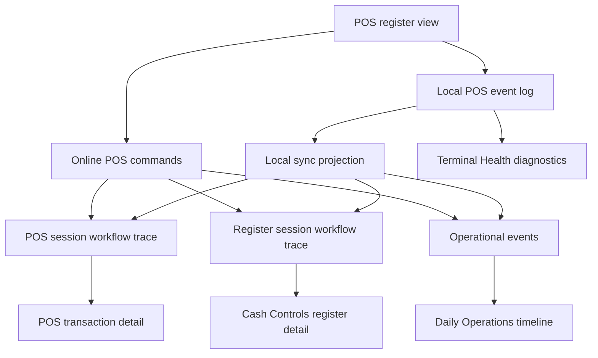
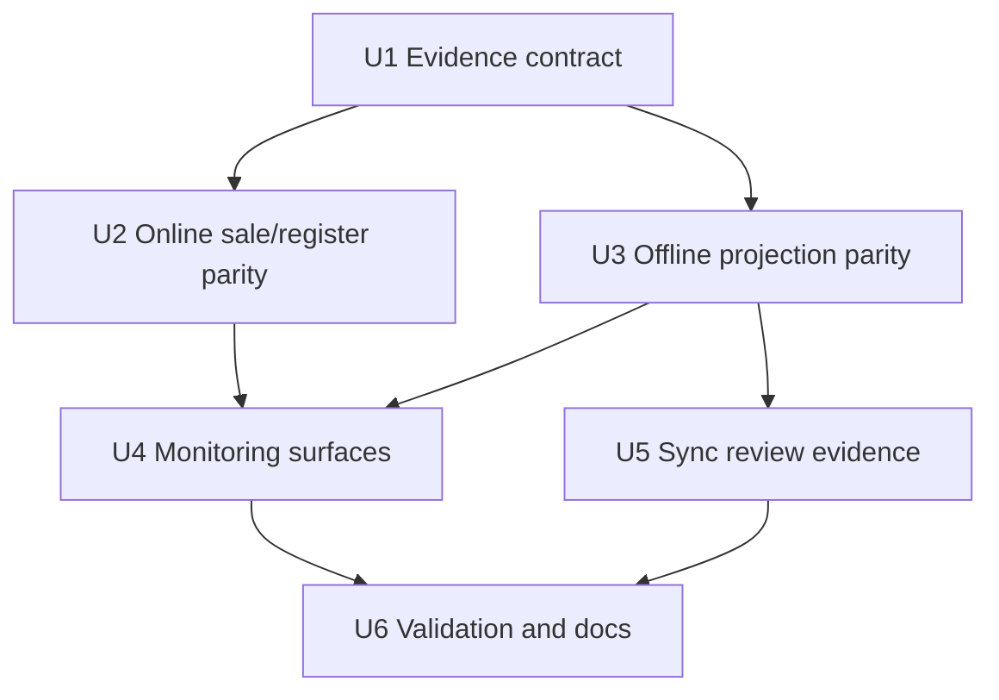
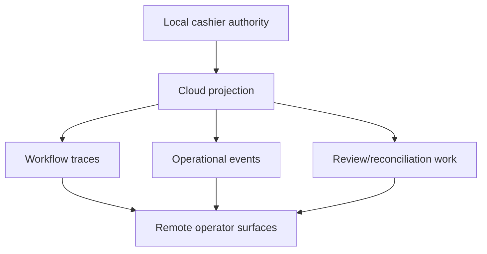

# feat: Make POS Flow Traces Remote-Monitorable

## Summary

This plan makes Athena POS evidence reliable enough for a remote operator to monitor store sales from cloud surfaces without needing access to the cashier browser. It strengthens the existing POS session traces, register session traces, operational events, and Daily Operations timeline so online and offline checkout leave comparable server-side evidence after sync.

---

## Problem Frame

POS is already local-first and can continue selling when cloud validation is unavailable, but the remote-monitoring story is uneven. Some online actions write rich workflow and operational evidence, some synced offline actions write only partial evidence, and the active register UI computes trace links that are not surfaced to operators.

Remote operators need to answer what happened, who did it, which register and cashier were involved, what sale was completed, how it was paid, what cash impact it had, and whether any synced local history still needs review.

---

## Assumptions

*This plan was authored from the user's approved design direction in this thread without a dedicated brainstorm document for POS remote-monitoring traces. The items below are explicit planning assumptions for review before implementation.*

- Daily Operations should remain a committed-milestone feed, not a raw cart mutation log.
- Full in-progress sale reconstruction belongs in POS session workflow traces and support views.
- Register session traces should represent drawer lifecycle and sale impact, including non-cash sale references, without pretending every sale is a cash movement.
- Offline projection should converge to the same operator-facing evidence family as online commands whenever cloud validation accepts the event.

---

## Requirements

- R1. Remote operators can monitor committed POS activity from cloud surfaces without inspecting IndexedDB or the local browser.
- R2. Online and synced offline sales produce comparable POS session trace, register session trace, and operational event evidence.
- R3. Register session traces distinguish sale total, cash delta, tender summary, and transaction identity so non-cash sales are not represented only as zero-value cash movements.
- R4. Synced offline register closeout and reopen/review outcomes produce operator-visible evidence equivalent to online cash-control actions.
- R5. Daily Operations surfaces committed sale, register open, register close, reopen, review, and sync-conflict milestones with direct links to relevant transaction, register, or trace surfaces.
- R6. POS register and Cash Controls surfaces expose available trace links for active sales, held sales, completed transactions, and register sessions.
- R7. The implementation preserves POS local-first operation: local events remain the cashier durability layer, and cloud evidence is produced by online commands or sync projection after server acceptance.
- R8. Tests cover the parity contract across online sale completion, offline sale projection, offline closeout projection, non-cash sale trace copy, timeline linking, and active trace-link rendering.

---

## Scope Boundaries

- This plan does not add a new monitoring product or dashboard outside existing Daily Operations, Cash Controls, POS transaction, POS register, terminal health, and workflow trace surfaces.
- This plan does not make non-POS Athena routes offline-first.
- This plan does not change the POS payment authorization model, payment-provider integrations, or offline payment confirmation policy.
- This plan does not trace every cashier keystroke or search query.
- This plan does not require every local-only cart event to upload as an independent sync event.
- This plan does not resolve every manager-review policy question for offline reopen. It ensures any retained review path is visible and traceable.

### Deferred to Follow-Up Work

- A dedicated remote live-operations dashboard: defer until Daily Operations and trace parity prove the right evidence shape.
- Cross-terminal real-time offline coordination: defer because POS local-first sync intentionally reconciles after connectivity returns.
- Historical backfill of workflow trace events for already-projected sales: defer unless operations needs legacy trace completeness.

---

## Context & Research

### Relevant Code and Patterns

- `packages/athena-webapp/convex/pos/application/commands/sessionCommands.ts` records online POS session lifecycle traces for item add/update/remove and session state transitions.
- `packages/athena-webapp/convex/pos/application/commands/posSessionTracing.ts` defines POS session trace stages and operator-readable trace event messages.
- `packages/athena-webapp/convex/operations/registerSessionTracing.ts` defines register session trace stages for drawer lifecycle, sale/void cash movements, deposits, closeout, approvals, and item adjustments.
- `packages/athena-webapp/convex/pos/application/commands/completeTransaction.ts` records online register-session sale impact before the final transaction evidence is fully threaded into the drawer trace.
- `packages/athena-webapp/convex/pos/application/sync/projectLocalEvents.ts` projects offline register open, sale completion, sale clear, register close, and register reopen events into cloud records and trace surfaces.
- `packages/athena-webapp/convex/pos/application/sync/types.ts` currently narrows sync projection trace input so offline register sale trace cannot carry transaction identity or tender detail.
- `packages/athena-webapp/convex/operations/dailyOperations.ts` reads `operationalEvent` rows and compensates for closeout records that have no operational event.
- `packages/athena-webapp/src/components/operations/DailyOperationsView.tsx` renders store-day timeline events and inline links.
- `packages/athena-webapp/src/lib/pos/presentation/register/useRegisterViewModel.ts` already computes `activeSessionTraceId`.
- `packages/athena-webapp/src/components/pos/SessionManager.tsx` does not render the active sale trace link, while `packages/athena-webapp/src/components/pos/session/HeldSessionsList.tsx` renders held sale trace links.
- `packages/athena-webapp/src/components/cash-controls/RegisterSessionView.tsx` exposes register support evidence and register trace links.

### Institutional Learnings

- `docs/solutions/architecture/athena-pos-local-first-sync-2026-05-13.md` says local events are the durable field POS record, then accepted events project into cash controls, inventory, transactions, payments, and workflow/audit surfaces.
- `docs/solutions/architecture/athena-pos-quick-add-operational-event-tracing-2026-05-30.md` reserves workflow traces for lifecycle domains that already own traces and keeps operational audit rows for operator-visible milestones.
- `docs/solutions/logic-errors/athena-offline-pos-sale-operations-timeline-links-2026-06-05.md` keeps offline sale timeline copy server-owned and links Daily Operations timeline events to projected POS transactions.
- `docs/solutions/logic-errors/athena-pos-register-sync-and-catalog-recovery-2026-05-26.md` warns against adding a second POS closeout status model outside the shared local-sync and cash-control sources.
- `docs/solutions/architecture/athena-pos-terminal-health-visibility-2026-05-20.md` keeps terminal health as support telemetry, not the primary source of needs-review copy.

### External References

- External research skipped. The repo has direct, current patterns for POS workflow traces, operational events, local sync projection, Daily Operations timeline links, and Cash Controls evidence.

---

## Key Technical Decisions

- Use existing evidence rails instead of creating a monitoring subsystem: POS session traces, register session traces, operational events, and existing views already model the required lifecycle boundaries.
- Keep Daily Operations milestone-oriented: show committed sales, register open/close/reopen, sync projection, and review states, while leaving in-progress cart detail to workflow traces and support surfaces.
- Normalize sale evidence at server boundaries: online commands and offline projection should call shared evidence builders or shared data-shaping helpers so copy, metadata, and links do not drift.
- Enrich register-session trace inputs: carry transaction id, transaction number, sale total, cash delta, payment methods, and payment count separately.
- Project offline closeout into an operational event: do not rely on Daily Operations to synthesize closeout rows when projection can write the same operator evidence as online closeout.
- Keep local-only cart events local unless they are needed for cloud trace reconstruction: the sync contract may continue folding line and payment details into `sale_completed`, but projection should use those details to produce a useful POS session trace.

---

## Open Questions

### Resolved During Planning

- Should Daily Operations include in-progress cart mutations? No. It should show committed business milestones and review states. Detailed in-progress reconstruction belongs in POS workflow/support traces.
- Should offline projection use a separate audit model? No. It should reuse existing workflow trace and operational event rails.
- Should trace parity require changing POS payment authorization? No. It only changes evidence and monitoring metadata.

### Deferred to Implementation

- Exact helper boundaries for shared sale/register evidence builders: defer until implementation because the smallest useful extraction depends on current test seams.
- Exact wording for non-cash register trace messages: defer to implementation with `docs/product-copy-tone.md` guidance and tests asserting the operational meaning.
- Whether offline reopen can auto-project in all cases: defer policy-sensitive cases to implementation, but every retained review outcome must produce visible operational evidence.

---

## High-Level Technical Design

> *This illustrates the intended approach and is directional guidance for review, not implementation specification. The implementing agent should treat it as context, not code to reproduce.*

Remote monitoring should read server evidence after online command completion or sync projection. Terminal Health can expose local backlog and conflict diagnostics, but it should not be the primary sales monitoring feed.

---

## Implementation Units

- U1. **Define POS Monitoring Evidence Contract**

**Goal:** Establish a shared server-side evidence shape for sale and register milestones so online commands and sync projection can emit comparable trace details and operational event metadata.

**Requirements:** R1, R2, R3, R5, R7

**Dependencies:** None

**Files:**
- Modify: `packages/athena-webapp/convex/operations/registerSessionTracing.ts`
- Modify: `packages/athena-webapp/convex/pos/application/commands/posSessionTracing.ts`
- Modify: `packages/athena-webapp/convex/pos/application/sync/types.ts`
- Modify: `packages/athena-webapp/convex/pos/application/sync/projectLocalEvents.ts`
- Test: `packages/athena-webapp/convex/operations/registerSessionTracing.test.ts`
- Test: `packages/athena-webapp/convex/pos/application/sync/projectLocalEvents.test.ts`

**Approach:**
- Extend register-session trace inputs to represent sale total, cash delta, tender summary, payment count, transaction id, transaction number, and sync origin as separate values.
- Keep current trace stages where possible. Prefer enriching `sale_recorded` before introducing new stages.
- Add a small shared evidence builder or value-shaping helper only if it prevents copy/metadata drift between online command and sync projection paths.
- Keep operational event metadata compact and linkable: local event id, transaction id/number, register session id, cashier/staff id, terminal/register identifiers, line count, total, payment method labels, cash delta, and sync origin.

**Execution note:** Implement test-first. Start with failing trace-builder and sync-projection tests that prove the desired evidence fields exist.

**Patterns to follow:**
- `packages/athena-webapp/convex/pos/application/sync/projectLocalEvents.ts` sale-projected message and metadata construction.
- `packages/athena-webapp/convex/operations/registerSessionTracing.ts` trace event `details` and `subjectRefs` construction.
- `packages/athena-webapp/convex/pos/application/commands/posSessionTracing.ts` POS session trace event builder.

**Test scenarios:**
- Happy path: register sale trace with a cash payment includes transaction identity, total, cash delta, payment method, payment count, and actor staff id.
- Happy path: register sale trace with card or mobile money includes transaction identity and total while cash delta remains zero or absent with non-cash copy.
- Edge case: malformed or unknown payment method labels are normalized for operator copy without surfacing raw backend enum noise.
- Integration: sync projection repository accepts enriched register trace input without losing existing opened/closed trace behavior.

**Verification:**
- Trace event details and subject refs can link a register-session sale event back to the POS transaction.
- Non-cash sale trace copy reads as a sale recorded on the drawer, not as an unexplained zero cash movement.

---

- U2. **Align Online Sale Completion Evidence**

**Goal:** Make online completed sales emit POS session trace, register session trace, and operational event evidence that remote operators can use consistently.

**Requirements:** R1, R2, R3, R5, R8

**Dependencies:** U1

**Files:**
- Modify: `packages/athena-webapp/convex/pos/application/commands/completeTransaction.ts`
- Modify: `packages/athena-webapp/convex/operations/registerSessions.ts`
- Modify: `packages/athena-webapp/convex/pos/application/commands/posSessionTracing.ts`
- Test: `packages/athena-webapp/convex/pos/application/completeTransaction.test.ts`
- Test: `packages/athena-webapp/convex/cashControls/registerSessions.test.ts`
- Test: `packages/athena-webapp/convex/operations/registerSessions.trace.test.ts`

**Approach:**
- Thread transaction id and transaction number into the online register-session sale trace after transaction creation.
- Preserve expected-cash updates for cash payments while adding trace evidence for non-cash completed sales.
- Ensure online completed sales either already create a suitable operational event or are routed through the shared evidence builder to create one with the same fields as offline projected sales.
- Keep void and adjustment behavior compatible with existing approval and cash settlement traces.

**Execution note:** Use characterization-first coverage around current online completion trace behavior, then update expectations for richer evidence.

**Patterns to follow:**
- `recordRegisterSessionSale` in `packages/athena-webapp/convex/pos/application/commands/completeTransaction.ts`.
- `recordRegisterSessionTransaction` in `packages/athena-webapp/convex/operations/registerSessions.ts`.
- Existing transaction void operational event in `packages/athena-webapp/convex/pos/application/commands/completeTransaction.ts`.

**Test scenarios:**
- Happy path: online cash sale completion records register expected cash and emits a register trace with transaction number and cash delta.
- Happy path: online card/mobile-money sale completion emits a register trace that names the transaction and tender without increasing expected cash.
- Happy path: online completed sale emits or preserves an operational event that Daily Operations can link to the transaction.
- Edge case: split tender sale records both payment count and distinct payment method labels.
- Error path: failed payment allocation or transaction creation does not leave orphan trace or operational event rows.

**Verification:**
- Online sales become monitorable from register trace and Daily Operations without requiring transaction-detail reconstruction.
- Existing cash-control invariants and idempotency behavior remain unchanged.

---

- U3. **Align Offline Sync Projection Evidence**

**Goal:** Make accepted offline history project into the same evidence family as online commands, including closeout and retained reopen review evidence.

**Requirements:** R2, R3, R4, R5, R7, R8

**Dependencies:** U1

**Files:**
- Modify: `packages/athena-webapp/convex/pos/application/sync/projectLocalEvents.ts`
- Modify: `packages/athena-webapp/convex/pos/application/sync/types.ts`
- Modify: `packages/athena-webapp/convex/pos/infrastructure/repositories/localSyncRepository.ts`
- Test: `packages/athena-webapp/convex/pos/application/sync/projectLocalEvents.test.ts`
- Test: `packages/athena-webapp/convex/pos/application/sync/ingestLocalEvents.test.ts`

**Approach:**
- Enrich offline `sale_completed` register trace calls with transaction id, transaction number, total, cash delta, tender summary, and sync origin.
- Reconstruct POS session trace details from `sale_completed` payload lines and payments enough to support remote support review after projection.
- Add an operational event for projected `register_closed` that mirrors online `register_session_closed` evidence.
- For `register_reopened`, either project a traceable reopen when policy permits or create an explicit operational review event when policy still requires manager review.
- Keep local event upload semantics stable. Do not make local-only cart events independently uploadable unless implementation proves the completed-sale payload is insufficient.

**Execution note:** Implement test-first from sync projection tests because the desired parity can be asserted without browser runtime.

**Patterns to follow:**
- `recordSaleProjectedEvent` and `recordSaleWorkflowEvidence` in `packages/athena-webapp/convex/pos/application/sync/projectLocalEvents.ts`.
- Online closeout operational event in `packages/athena-webapp/convex/cashControls/closeouts.ts`.
- Daily Operations closeout record compensation test in `packages/athena-webapp/convex/operations/dailyOperations.test.ts`.

**Test scenarios:**
- Happy path: projected offline cash sale creates POS session trace, register session trace, and operational event with matching transaction identifiers.
- Happy path: projected offline non-cash sale creates register trace evidence that names tender and transaction while cash delta stays zero.
- Happy path: projected zero-variance offline closeout creates a `register_session_closed` or equivalent operational event and register trace.
- Happy path: projected variance-approved closeout records counted cash, expected cash, variance, staff, and local event id in operational metadata.
- Edge case: duplicate sync retry returns idempotent mappings without duplicating operational events or trace events.
- Error path: closeout that still requires review creates a review-visible conflict/event without patching the register session.
- Integration: projected sale after accepted register open links sale, transaction, register session, POS session trace, and Daily Operations timeline.

**Verification:**
- Offline open, sale, closeout, and reopen/review outcomes are monitorable after sync from the same cloud surfaces as online work.
- Sync retries remain idempotent.

---

- U4. **Surface Remote Monitoring Links and Timeline Context**

**Goal:** Make the enriched evidence reachable from Daily Operations, Cash Controls, POS transaction detail, and the POS register controls.

**Requirements:** R1, R5, R6, R8

**Dependencies:** U2, U3

**Files:**
- Modify: `packages/athena-webapp/convex/operations/dailyOperations.ts`
- Modify: `packages/athena-webapp/src/components/operations/DailyOperationsView.tsx`
- Modify: `packages/athena-webapp/src/lib/pos/presentation/register/registerUiState.ts`
- Modify: `packages/athena-webapp/src/lib/pos/presentation/register/useRegisterViewModel.ts`
- Modify: `packages/athena-webapp/src/components/pos/SessionManager.tsx`
- Modify: `packages/athena-webapp/src/components/pos/session/HeldSessionsList.tsx`
- Modify: `packages/athena-webapp/src/components/cash-controls/RegisterSessionView.tsx`
- Test: `packages/athena-webapp/convex/operations/dailyOperations.test.ts`
- Test: `packages/athena-webapp/src/components/operations/DailyOperationsView.test.tsx`
- Test: `packages/athena-webapp/src/components/pos/SessionManager.test.tsx`
- Test: `packages/athena-webapp/src/lib/pos/presentation/register/useRegisterViewModel.test.ts`
- Test: `packages/athena-webapp/src/components/cash-controls/RegisterSessionView.test.tsx`

**Approach:**
- Extend Daily Operations read model links so sale, register, closeout, and review events can navigate to transaction, register session, or workflow trace surfaces.
- Render active sale trace link in `SessionManager` using `activeSessionTraceId`, matching the held-session trace link pattern without crowding checkout controls.
- Ensure Cash Controls register detail displays support trace context for projected offline closeout and projected/reviewed reopen outcomes.
- Keep operator copy calm and operational per `docs/product-copy-tone.md`.

**Execution note:** Use test-first React coverage for active trace link rendering and Daily Operations link selection.

**Patterns to follow:**
- Existing inline transaction/product timeline link rendering in `DailyOperationsView`.
- `WorkflowTraceRouteLink` usage in `HeldSessionsList` and Cash Controls.
- `RegisterSessionView` support evidence section.

**Test scenarios:**
- Happy path: Daily Operations sale event renders an inline transaction link and keeps readable sale/tender copy.
- Happy path: Daily Operations closeout event renders a register link and closeout summary.
- Happy path: POS register active session with `activeSessionTraceId` renders a trace link; active session without trace id omits it.
- Edge case: held sessions continue rendering trace links without duplicate links when active session also has a trace.
- Edge case: timeline event with transaction and register links uses the most relevant link for that event type.
- Integration: Cash Controls register detail exposes support trace link for a synced offline closeout register session.

**Verification:**
- A remote operator can click from Daily Operations into the relevant transaction, register, or trace without guessing identifiers.
- POS register trace links add support visibility without interrupting cashier flow.

---

- U5. **Make Review and Conflict Evidence Monitorable**

**Goal:** Ensure local sync conflicts and manager-review outcomes are visible as operational monitoring events instead of only local sync status badges.

**Requirements:** R1, R4, R5, R7, R8

**Dependencies:** U3

**Files:**
- Modify: `packages/athena-webapp/convex/pos/application/sync/projectLocalEvents.ts`
- Modify: `packages/athena-webapp/convex/cashControls/deposits.ts`
- Modify: `packages/athena-webapp/convex/cashControls/closeouts.ts`
- Modify: `packages/athena-webapp/src/lib/pos/presentation/syncStatusPresentation.ts`
- Test: `packages/athena-webapp/convex/pos/application/sync/projectLocalEvents.test.ts`
- Test: `packages/athena-webapp/convex/cashControls/deposits.test.ts`
- Test: `packages/athena-webapp/convex/cashControls/closeouts.test.ts`
- Test: `packages/athena-webapp/src/lib/pos/presentation/syncStatusPresentation.test.ts`

**Approach:**
- When projection cannot apply accepted local history without review, write or ensure an operational event that is visible to Daily Operations and Cash Controls.
- Preserve completed local sales and local closeout evidence while marking the review state.
- When reviewed synced closeout activity is applied, ensure the resulting operational event points back to the reviewed local event and register session.
- Keep sync-status presentation consistent with operational events, not as a competing source of truth.

**Execution note:** Start with tests around existing review paths so implementation does not accidentally hide or duplicate manager-review work.

**Patterns to follow:**
- `syncStatusPresentation.ts` review copy for register closeout variance.
- `deposits.ts` reviewed synced closeout application events.
- `closeouts.ts` approval/rejection operational events and trace stages.

**Test scenarios:**
- Happy path: local sync closeout variance conflict creates an operator-visible review event with counted cash, expected cash, variance, staff, and local event id.
- Happy path: reviewed synced closeout application emits one operational event and closes the review loop.
- Edge case: repeated sync conflict detection does not create duplicate review events.
- Error path: rejected closeout/reopen review preserves the local event evidence and marks the trace or operational event as requiring correction.
- Integration: Daily Operations attention/timeline surfaces can show the review state and link to Cash Controls.

**Verification:**
- Remote operators can see why synced local history needs review and where to resolve it.
- Review copy stays aligned between POS status, Cash Controls, and Daily Operations.

---

- U6. **Validation, Documentation, and Delivery Readiness**

**Goal:** Prove the cross-surface evidence contract and capture durable learning for future POS trace work.

**Requirements:** R8

**Dependencies:** U4, U5

**Files:**
- Create: `docs/solutions/logic-errors/athena-pos-remote-monitoring-trace-parity-2026-06-05.md`
- Modify: `docs/plans/2026-06-05-001-feat-pos-remote-monitoring-traces-plan.md`
- Modify: `docs/plans/2026-06-05-001-feat-pos-remote-monitoring-traces-plan.html`
- Test: `packages/athena-webapp/convex/pos/application/sync/projectLocalEvents.test.ts`
- Test: `packages/athena-webapp/convex/operations/dailyOperations.test.ts`
- Test: `packages/athena-webapp/convex/operations/registerSessions.trace.test.ts`
- Test: `packages/athena-webapp/src/components/operations/DailyOperationsView.test.tsx`
- Test: `packages/athena-webapp/src/components/pos/SessionManager.test.tsx`
- Test: `packages/athena-webapp/src/components/cash-controls/RegisterSessionView.test.tsx`

**Approach:**
- Add a solution note after implementation explaining the final evidence boundary and parity pattern.
- Keep the validation map current if this work introduces or changes registered POS local-sync or trace boundaries.
- Run graphify rebuild after code changes because AGENTS requires it for code modifications.
- Review generated Convex API artifacts if Convex function/type changes require regeneration.

**Execution note:** Sensor-only for docs, but feature tests from prior units must be green before this unit is complete.

**Patterns to follow:**
- Existing solution docs under `docs/solutions/architecture/` and `docs/solutions/logic-errors/`.
- Existing plan HTML artifacts in `docs/plans/`.

**Test scenarios:**
- Integration: focused Convex tests prove online/offline trace parity and Daily Operations timeline links.
- Integration: focused React tests prove remote-monitoring links render without breaking POS checkout controls.
- Regression: existing POS local-first tests still pass for local sale continuation, pending sync, and review presentation.

**Verification:**
- The implementation has a durable learning note, focused tests, and generated artifacts in the expected state.

---

## System-Wide Impact

- **Interaction graph:** POS register view writes local events, online POS commands write cloud state directly, local sync projection writes cloud state later, and both paths must converge through POS session traces, register session traces, and operational events.
- **Error propagation:** Trace and operational event writes should remain best-effort where existing patterns are best-effort, but missing primary business writes must still fail through existing command/projection behavior.
- **State lifecycle risks:** Duplicate sync retries can duplicate evidence unless idempotency keys, local event ids, or existing mappings guard trace/event creation.
- **API surface parity:** Sync projection repository types, online command helpers, and trace recorders must carry the same sale evidence shape.
- **Integration coverage:** Unit tests alone are insufficient. The plan needs projection tests, command tests, read-model tests, and component tests that cover cross-layer evidence flow.
- **Unchanged invariants:** Local events remain the first durable cashier record; POS does not block sales for remote monitoring; review/reconciliation preserves completed local history.

---

## Risks & Dependencies

| Risk | Mitigation |
|------|------------|
| Trace noise overwhelms Daily Operations | Keep Daily Operations limited to committed milestones and review states; leave cart mutation details in workflow traces. |
| Online and offline paths drift again | Centralize evidence shaping where practical and add parity tests for both paths. |
| Sync retries duplicate operational events | Use local event ids, mappings, or existing projection idempotency checks before writing event rows. |
| Non-cash register trace copy becomes misleading | Separate sale total from cash delta and assert non-cash copy in tests. |
| Review policy for offline reopen is broader than this plan | Keep policy-specific reopen auto-projection decisions deferred, but require every outcome to be operator-visible. |
| Convex generated API drift | Regenerate and inspect generated artifacts if function/type changes require it. |

---

## Documentation / Operational Notes

- Update `docs/solutions/` after implementation with the final trace parity boundary and validation lessons.
- Use `docs/product-copy-tone.md` for all operator-facing timeline and trace copy.
- Treat this as a POS operational-observability change, not a checkout behavior change.
- Production rollout should be safe for active checkout because it does not change local sale authority or payment semantics, but deploy validation should include POS register and Daily Operations smoke coverage.

---

## Alternative Approaches Considered

- Add a new remote monitoring dashboard first: rejected for this slice because evidence quality is the blocker. A dashboard would inherit the same gaps.
- Upload every local cart event independently: rejected for now because completed sale payloads already carry line/payment evidence and raw cart-event feeds would add sync noise.
- Keep closeout timeline synthesis only in Daily Operations: rejected because projection can write durable operational evidence at the server boundary, which avoids one-off read-model compensation.

---

## Success Metrics

- A remote operator can answer who opened a register, who completed each sale, which register and terminal were involved, what receipt/total/tender were used, and what cash impact the sale had.
- Online and offline accepted sales have comparable transaction, POS session trace, register session trace, and operational event evidence.
- Synced offline closeout and review outcomes appear in Daily Operations and Cash Controls without synthetic-only timeline logic.
- Active and held sale trace links are reachable from POS register controls when trace ids exist.

---

## Sources & References

- Related requirements: `docs/brainstorms/2026-06-04-pos-offline-app-session-sales-continuity-requirements.md`
- Related requirements: `docs/brainstorms/2026-05-13-pos-local-first-register-requirements.md`
- Related requirements: `docs/brainstorms/2026-05-07-daily-operations-lifecycle-requirements.md`
- Related solution: `docs/solutions/architecture/athena-pos-local-first-sync-2026-05-13.md`
- Related solution: `docs/solutions/architecture/athena-pos-quick-add-operational-event-tracing-2026-05-30.md`
- Related solution: `docs/solutions/logic-errors/athena-offline-pos-sale-operations-timeline-links-2026-06-05.md`
- Related code: `packages/athena-webapp/convex/pos/application/sync/projectLocalEvents.ts`
- Related code: `packages/athena-webapp/convex/operations/registerSessionTracing.ts`
- Related code: `packages/athena-webapp/convex/pos/application/commands/posSessionTracing.ts`
- Related code: `packages/athena-webapp/convex/operations/dailyOperations.ts`
