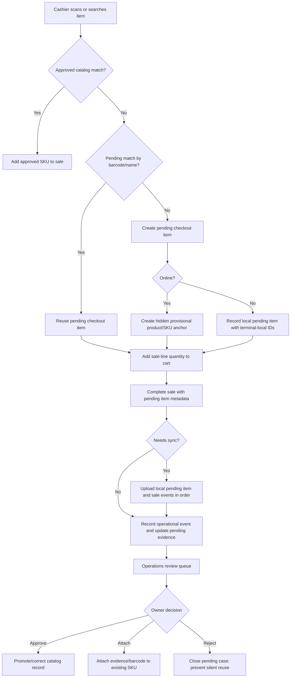

# feat: Add POS pending checkout items

## Summary

Add a low-friction POS recovery path for products that are not yet in the catalog: cashiers can add or reuse a pending checkout item for the current sale, online or offline, while Athena keeps permanent catalog truth behind owner review. The implementation should reuse quick-add UX and audit patterns, but route quantity, inventory, sync, and review semantics through a new pending-checkout boundary instead of treating cashier input as trusted stock.

---

## Problem Frame

Stores are still onboarding items into Athena, so cashiers sometimes meet real products at checkout that do not exist in the catalog. Blocking the sale is bad for operations, but allowing cashiers to create trusted catalog products and inventory is not acceptable to the business owner.

---

## Requirements

- R1. Cashiers can add a missing item to the current POS sale without manager approval in normal cases.
- R2. Cashiers can only enter the quantity being sold in the current transaction; cashier input must not create trusted available inventory.
- R3. A pending item can be reused in future sales before owner review, while remaining pending and hidden from the trusted catalog.
- R4. Reuse should accumulate review evidence across transactions: transactions, quantities sold, cashiers, prices, barcode/search terms, and first/last seen timestamps.
- R5. Manager approval is exception-based, not required for every pending item; hard stops should be rare and reserved for clearly unsafe states.
- R6. Owner/admin review can approve the item into catalog truth, attach it to an existing SKU, edit and approve, reject, or flag for follow-up.
- R7. Audit events must plainly answer who added or reused the pending item, what was sold, at what price, in what quantity, and on which sale/register context.
- R8. Cashier-facing copy must avoid saying that a product was added to the catalog when the item is only pending review.
- R9. Provisioned terminals must support adding or reusing pending checkout items while offline, preserving the sale locally and syncing pending review evidence when connectivity returns.
- R10. Offline pending checkout should keep the cashier flow normal; cloud uncertainty becomes review/sync context unless the state is locally unsafe.

---

## Scope Boundaries

- Do not replace the full product creation or stock/procurement workflows.
- Do not require manager approval for every missing item.
- Do not let pending checkout quantities become trusted inventory quantities.
- Do not expose pending checkout items in storefront or ordinary catalog browse surfaces before approval.
- Do not rework unrelated POS cart, payment, receipt, or drawer flows beyond the metadata and validation needed for pending items.

### Deferred to Follow-Up Work

- Advanced fraud scoring, cashier trust tiers, configurable thresholds UI, and automated owner notifications. The first release should capture enough metadata for those policies without building a separate risk engine.
- Bulk catalog import/onboarding improvements. Pending checkout review can create evidence for onboarding, but it is not the onboarding workflow itself.
- Real-time cross-terminal duplicate prevention while terminals are disconnected. Offline terminals should preserve sale evidence and reconcile duplicates through sync/review instead of trying to coordinate live.

---

## Context & Research

### Relevant Code and Patterns

- `packages/athena-webapp/convex/pos/application/commands/quickAddCatalogItem.ts` already centralizes POS quick-add creation, barcode attach, hidden quick-add products, generated SKUs, and operational events.
- `packages/athena-webapp/src/components/product/QuickAddProductDialog.tsx` and `packages/athena-webapp/src/components/pos/ProductEntry.tsx` provide the compact not-found recovery UI and scan/search entry points to reuse.
- `packages/athena-webapp/convex/schemas/operations/operationalWorkItem.ts` is the lightweight operational review work table; it fits pending catalog review better than treating every pending checkout item as an approval request.
- `packages/athena-webapp/convex/operations/operationalEvents.ts` is the durable audit rail and already supports transaction, register session, work item, approval request, actor, and metadata links.
- `packages/athena-webapp/src/components/operations/OperationsQueueView.tsx` already renders work queue and approval review rows with compact actions.
- `packages/athena-webapp/src/components/operations/DailyOperationsView.tsx` already surfaces operational-event timeline entries, including quick-add messages.
- `packages/athena-webapp/convex/pos/application/commands/completeTransaction.ts` and `packages/athena-webapp/convex/schemas/pos/posSessionItem.ts` / `posTransactionItem.ts` are the inventory and transaction boundaries that must distinguish pending sold quantity from trusted stock.

### Institutional Learnings

- `docs/solutions/architecture/athena-pos-quick-add-operational-event-tracing-2026-05-30.md` says POS quick-add catalog recovery must record server-side operational events that include actor and quantity details, with operator-readable messages.
- `docs/solutions/logic-errors/athena-pos-register-sync-and-catalog-recovery-2026-05-26.md` says unknown barcode recovery should offer existing-SKU linking before new product creation to reduce duplicate catalog risk.
- `docs/solutions/architecture/athena-pos-offline-sales-continuity-2026-06-04.md` and related POS continuity notes establish the product posture: sales should proceed where possible, and uncertainty should become review work instead of cashier blockers.
- `docs/solutions/architecture/athena-pos-local-first-sync-2026-05-13.md` establishes append-only local POS events, strict upload ordering, local-to-cloud mappings, and idempotent projection as the offline foundation.
- `docs/solutions/architecture/athena-pos-offline-inventory-snapshot-2026-05-15.md` separates local catalog metadata from availability; pending checkout should follow the same rule by not fabricating stock from cashier input.
- `docs/product-copy-tone.md` requires calm, restrained, operational copy and explicitly covers product-add failures and POS session messaging.

### External References

- None. Local POS, operations, audit, and review patterns are strong enough; no external research is needed.

---

## Key Technical Decisions

- Add a distinct pending checkout domain rather than overloading quick-add catalog creation: The trust boundary is different. Quick-add mutates catalog records; pending checkout records sale evidence and creates review work.
- Reuse quick-add UI components and scanner/search ergonomics: The cashier workflow is already familiar, and the new flow should feel like a variation of missing-item recovery rather than a new product-management task.
- Represent pending review as a structured POS record plus an `operationalWorkItem`: The pending item needs queryable reuse/review state, while the work item lets Operations Queue show it in existing review surfaces.
- Create hidden provisional product/SKU references only as POS compatibility anchors: Current session and transaction item schemas require product/SKU IDs. These provisional records should stay hidden and carry pending status; they are not trusted inventory.
- Treat quantity as sale-line quantity, not available stock: Pending SKUs should not gain `quantityAvailable` from cashier input. Completion logic should preserve transaction facts and skip trusted stock decrement for pending checkout items.
- Use operational events for the audit trail: Pending item created, reused, sale-linked, reviewed, approved, attached, rejected, and flagged outcomes should be visible in timelines and review evidence.
- Keep hard stops narrow: Block only clearly unsafe cases such as barcode collision with an approved SKU, reuse of a rejected pending item, or invalid sale data. Other risk signals should rank review priority rather than blocking checkout.
- Support offline creation through POS local events, not browser-only drafts: A terminal-local pending checkout item should have local IDs, local evidence, and an uploadable event that sync maps to cloud pending item/provisional SKU IDs.

---

## Open Questions

### Resolved During Planning

- Should manager approval be required every time? No. Normal pending item adds proceed without manager approval; review happens after the sale.
- Should cashier quantity become available inventory? No. Quantity means quantity sold in this transaction only.
- Should a future sale reuse an unreviewed pending item? Yes. Reuse should link to the same pending review case and strengthen owner review evidence.

### Deferred to Implementation

- Exact field names for pending flags on provisional products/SKUs: choose names that fit current schema conventions while keeping the trust boundary readable in tests.
- Whether the first implementation extends `QuickAddProductDialog` with a mode prop or extracts a smaller shared dialog primitive: decide while editing the component to minimize churn.
- Exact review action placement inside Operations Queue: use the current layout constraints and avoid broad redesign.
- Exact local event payload field names for pending checkout items: choose during implementation to match existing `cart.item_added`, `transaction.completed`, local mapping, and sync validator conventions.

---

## High-Level Technical Design

> *This illustrates the intended approach and is directional guidance for review, not implementation specification. The implementing agent should treat it as context, not code to reproduce.*

---

## Implementation Units

- U1. **Model pending checkout review state**

**Goal:** Add a structured pending checkout item domain that can represent one unresolved catalog review case across multiple sales.

**Requirements:** R2, R3, R4, R6, R7

**Dependencies:** None

**Files:**
- Create: `packages/athena-webapp/convex/schemas/pos/posPendingCheckoutItem.ts`
- Modify: `packages/athena-webapp/convex/schemas/pos/index.ts`
- Modify: `packages/athena-webapp/convex/schema.ts`
- Modify: `packages/athena-webapp/convex/schemas/inventory/product.ts`
- Modify: `packages/athena-webapp/convex/schemas/pos/posSessionItem.ts`
- Modify: `packages/athena-webapp/convex/schemas/pos/posTransactionItem.ts`
- Test: `packages/athena-webapp/convex/schemas/pos/posPendingCheckoutItem.test.ts`

**Approach:**
- Add a `posPendingCheckoutItem` table for review case state: store, organization, barcode/search/name normalization, display name, provisional product/SKU IDs, status, review outcome references, first/last seen timestamps, transaction count, total quantity sold, last unit price, and risk/review metadata.
- Add indexes for store/status, store/barcode/status, store/provisional SKU, and store/normalized name/status so POS lookup and owner review do not scan.
- Add optional pending checkout references to POS session and transaction item schemas so a sale line can prove it came from pending checkout recovery.
- Add optional catalog-review status fields on product/SKU records only as hidden compatibility flags. These fields should not become the primary review model.

**Execution note:** Implement schema coverage first so every downstream unit has stable IDs and metadata fields to target.

**Patterns to follow:**
- `packages/athena-webapp/convex/schemas/operations/operationalWorkItem.ts`
- `packages/athena-webapp/convex/schema.ts`
- Existing optional POS schema additions in `packages/athena-webapp/convex/schemas/pos/`

**Test scenarios:**
- Happy path: creating a pending item record shape accepts barcode, normalized name, provisional SKU, status `pending`, transaction counters, and review metadata.
- Edge case: a pending record can omit barcode but still requires a normalized name/search key for review and reuse.
- Edge case: schema accepts optional pending checkout IDs on session and transaction items without changing existing product/SKU requirements.
- Error path: invalid pending status or review outcome values are rejected by schema validation.

**Verification:**
- The schema supports one pending review case across many sale lines without requiring cashier-entered stock.

---

- U2. **Add pending checkout command and audit boundary**

**Goal:** Create or reuse pending checkout items from POS recovery and record operational evidence without promoting the item into trusted catalog state.

**Requirements:** R1, R2, R3, R4, R5, R7

**Dependencies:** U1

**Files:**
- Create: `packages/athena-webapp/convex/pos/application/commands/pendingCheckoutItem.ts`
- Create: `packages/athena-webapp/convex/pos/application/commands/pendingCheckoutItem.test.ts`
- Modify: `packages/athena-webapp/convex/pos/public/catalog.ts`
- Modify: `packages/athena-webapp/convex/operations/operationalEvents.ts`
- Modify: `packages/athena-webapp/convex/operations/operationalWorkItems.ts`

**Approach:**
- Add a POS command that takes store, actor, lookup/search context, item description, unit price, and quantity sold. It should validate sale-line inputs, then find an existing pending case by barcode first and normalized name second.
- If no pending case exists, create a hidden provisional product/SKU anchor with zero trusted inventory and a pending status marker, then create an open `operationalWorkItem` for owner review.
- If a pending case exists by exact barcode, reuse the same provisional SKU and update accumulated evidence rather than creating duplicate pending items. If the match is name-only, present it as a cashier-confirmed suggestion so distinct no-barcode products are not silently merged.
- Record operational events for create and reuse. Messages should name the actor, item, quantity sold, price, barcode/search context when available, and transaction/register context when known.
- Use hard stops only for unsafe cases: matching a rejected pending case, barcode collision with a different approved SKU, invalid quantity/price, or cross-store references.
- Require the same authenticated store-scoped POS operator context used by register commands before creating or reusing pending checkout items.

**Technical design:** Directionally, the command should return a catalog-result-like object for the POS cart plus pending metadata, not a trusted catalog result. Reuse the quick-add result shape enough for the UI to add a line, but include `pendingCheckoutItemId` and a pending status so downstream inventory logic can branch.

**Patterns to follow:**
- `packages/athena-webapp/convex/pos/application/commands/quickAddCatalogItem.ts`
- `packages/athena-webapp/convex/pos/application/commands/quickAddCatalogItem.test.ts`
- `packages/athena-webapp/convex/operations/operationalEvents.ts`
- `packages/athena-webapp/convex/operations/operationalWorkItems.ts`

**Test scenarios:**
- Happy path: unknown barcode creates one pending item, one hidden provisional product/SKU with zero trusted stock, one open work item, and one operational event.
- Happy path: scanning the same unknown barcode later reuses the existing pending item and SKU, increments transaction/evidence counters, and records a reuse event.
- Happy path: name-only pending item appears as a suggested reuse match when no barcode is present and is reused only after cashier selection.
- Edge case: quantity is truncated or rejected according to existing whole-number POS item rules, and never written as trusted `quantityAvailable`.
- Error path: barcode already attached to an approved SKU returns the approved match path or blocks duplicate pending creation.
- Error path: rejected pending item reuse requires manager review or returns a clear cashier-facing precondition failure.
- Integration: operational event metadata includes actor, store, pending item, provisional SKU, price, quantity sold, barcode/search term, and work item references.

**Verification:**
- Pending checkout creation/reuse produces reviewable evidence and hidden anchors without adding trusted stock.

---

- U3. **Reuse quick-add POS UX for pending checkout items**

**Goal:** Let cashiers add or reuse pending checkout items from the existing search-not-found flow with copy that preserves the review boundary.

**Requirements:** R1, R3, R5, R8

**Dependencies:** U2

**Files:**
- Modify: `packages/athena-webapp/src/components/product/QuickAddProductDialog.tsx`
- Modify: `packages/athena-webapp/src/components/product/QuickAddProductDialog.test.tsx`
- Modify: `packages/athena-webapp/src/components/pos/ProductEntry.tsx`
- Modify: `packages/athena-webapp/src/components/pos/ProductEntry.test.tsx`
- Modify: `packages/athena-webapp/src/components/pos/SearchResultsSection.tsx`
- Modify: `packages/athena-webapp/src/components/pos/SearchResultsSection.test.tsx`
- Modify: `packages/athena-webapp/src/components/pos/register/POSRegisterView.test.tsx`

**Approach:**
- Add a pending-checkout mode to the existing quick-add dialog or extract shared pieces so the cashier sees a compact sale-focused form: description/name, barcode when present, unit price, and quantity sold.
- Rename labels and success copy for POS cashier use. Avoid `Product added to catalog`; use copy that says the item was added to the sale and catalog review is pending.
- Show pending matches when barcode/name already exists in pending review. Exact barcode matches can be direct; name-only matches should be presented as suggestions that the cashier explicitly selects before entering this sale's quantity.
- Keep the flow available to normal cashiers under low-friction rules. Manager-gated quick-add catalog behavior can remain separate.
- Keep existing attach-to-approved-SKU recovery visible where it reduces duplicates, especially for barcode scans.

**Patterns to follow:**
- `packages/athena-webapp/src/components/product/QuickAddProductDialog.tsx`
- `packages/athena-webapp/src/components/pos/ProductEntry.tsx`
- `docs/product-copy-tone.md`

**Test scenarios:**
- Happy path: unknown scan opens the pending checkout dialog and submits item description, barcode, price, and quantity sold.
- Happy path: existing pending match appears separately from approved catalog matches and can be reused into the cart.
- Happy path: successful pending add clears active search, adds the item to the cart, and shows pending-review copy.
- Edge case: no-barcode item requires a usable description before submission and does not auto-merge with a name-similar pending item without cashier confirmation.
- Error path: invalid price or quantity keeps the dialog open with calm field-level guidance.
- Error path: rejected pending item or barcode collision surfaces a clear non-raw message and does not add the line.
- Regression: existing quick-add catalog and barcode-attach tests continue to pass for manager/admin flows.

**Verification:**
- Cashiers can complete the missing-item recovery path without entering product-management language or manager approval in normal cases.

---

- U4. **Preserve online sale facts without trusted inventory mutation**

**Goal:** Ensure online POS session, checkout, and transaction logic understand pending checkout sale lines and do not treat cashier quantity as available stock.

**Requirements:** R2, R3, R4, R7

**Dependencies:** U1, U2, U3

**Files:**
- Modify: `packages/athena-webapp/convex/pos/application/commands/sessionCommands.ts`
- Modify: `packages/athena-webapp/convex/pos/application/commands/completeTransaction.ts`
- Modify: `packages/athena-webapp/convex/pos/application/commands/completeTransaction.test.ts`
- Modify: `packages/athena-webapp/convex/pos/public/transactions.ts`
- Modify: `packages/athena-webapp/src/lib/pos/presentation/register/useRegisterViewModel.ts`
- Modify: `packages/athena-webapp/src/lib/pos/presentation/register/useRegisterViewModel.test.ts`

**Approach:**
- Carry `pendingCheckoutItemId` from POS cart/session items through transaction items and transaction query projections.
- Bypass trusted stock availability checks and trusted inventory decrement for lines tied to pending checkout items. The transaction line remains the source of quantity sold.
- Record sale-linked operational evidence after completion, including transaction ID and register/session context when available.
- Preserve normal item math, payment totals, receipt totals, and transaction history behavior.

**Technical design:** Directionally, pending checkout lines should be a narrow exception inside inventory validation/mutation, not a separate transaction type. They should still produce normal transaction items, totals, and receipts.

**Patterns to follow:**
- `packages/athena-webapp/convex/pos/application/commands/completeTransaction.ts`
- `packages/athena-webapp/src/lib/pos/infrastructure/local/syncContract.ts`
- Existing online transaction completion and inventory movement patterns in `packages/athena-webapp/convex/pos/application/commands/completeTransaction.ts`

**Test scenarios:**
- Happy path: completing a sale with a pending checkout line creates a transaction item with pending metadata and does not fail insufficient inventory when provisional stock is zero.
- Happy path: sale totals and payment completion include pending items exactly like approved items.
- Happy path: completing multiple sales against the same pending item updates aggregate evidence without duplicating review cases.
- Edge case: mixed cart with approved SKUs, services, and pending items preserves existing inventory behavior for approved SKUs only.
- Error path: pending item ID that does not belong to the store is rejected.
- Error path: pending item ID tied to an approved/rejected state is handled according to review status rather than silently selling stale data.

**Verification:**
- Pending checkout lines are normal sale facts but not trusted inventory facts.

---

- U7. **Support offline pending checkout creation and sync**

**Goal:** Let provisioned terminals create or reuse pending checkout items while offline, complete the sale locally, and sync pending review evidence when connectivity returns.

**Requirements:** R2, R3, R4, R7, R9, R10

**Dependencies:** U1, U2, U3, U4

**Files:**
- Modify: `packages/athena-webapp/src/lib/pos/infrastructure/local/posLocalStore.ts`
- Modify: `packages/athena-webapp/src/lib/pos/infrastructure/local/posLocalStore.test.ts`
- Modify: `packages/athena-webapp/src/lib/pos/infrastructure/local/localCommandGateway.ts`
- Modify: `packages/athena-webapp/src/lib/pos/infrastructure/local/localCommandGateway.test.ts`
- Modify: `packages/athena-webapp/src/lib/pos/infrastructure/local/registerReadModel.ts`
- Modify: `packages/athena-webapp/src/lib/pos/infrastructure/local/registerReadModel.test.ts`
- Modify: `packages/athena-webapp/src/lib/pos/infrastructure/local/syncContract.ts`
- Modify: `packages/athena-webapp/src/lib/pos/infrastructure/local/syncContract.test.ts`
- Modify: `packages/athena-webapp/src/lib/pos/infrastructure/local/usePosLocalSyncRuntime.ts`
- Modify: `packages/athena-webapp/src/lib/pos/infrastructure/local/usePosLocalSyncRuntime.test.ts`
- Modify: `packages/athena-webapp/convex/pos/application/sync/ingestLocalEvents.ts`
- Modify: `packages/athena-webapp/convex/pos/application/sync/ingestLocalEvents.test.ts`
- Modify: `packages/athena-webapp/convex/pos/application/sync/projectLocalEvents.ts`
- Modify: `packages/athena-webapp/convex/pos/application/sync/projectLocalEvents.test.ts`
- Test: `packages/athena-webapp/src/tests/pos/offlineSalesContinuity.spec.ts`

**Approach:**
- Add a local pending checkout item event shape for offline creation/reuse. The local event should carry terminal-local pending item, product, and SKU identifiers, item description, barcode/search context, unit price, quantity sold, cashier/staff context, and local transaction/cart references.
- Teach the local command gateway and register read model to add pending items to the cart and completed sale without needing live Convex IDs. The cashier should see normal sale continuation, not an offline review warning.
- Extend the sync contract so completed sale uploads can include pending checkout item definitions and references before transaction projection. Upload ordering should ensure the cloud can mint or reuse the pending item/provisional SKU before projecting transaction items.
- Extend ingest/project logic to map terminal-local pending item/product/SKU IDs to cloud IDs idempotently. Exact barcode cloud matches should reuse existing pending or approved records safely; name-only local matches should become suggested review evidence rather than automatic cloud merges.
- Preserve local sale facts even if cloud projection discovers duplicate, rejected, or conflicting pending evidence. Create review/conflict work rather than rewriting the completed local sale.
- Keep redacted offline metadata: no tokens, credentials, raw staff proofs, payment secrets, or reusable assertions in pending checkout sync metadata.

**Technical design:** Directionally, offline pending checkout should follow existing local-first POS event rules: local append first, upload in register-session order, normalize local IDs into cloud IDs, and project idempotently. It should not special-case browser storage outside the POS local ledger.

**Patterns to follow:**
- `packages/athena-webapp/src/lib/pos/infrastructure/local/posLocalStore.ts`
- `packages/athena-webapp/src/lib/pos/infrastructure/local/syncContract.ts`
- `packages/athena-webapp/convex/pos/application/sync/ingestLocalEvents.ts`
- `packages/athena-webapp/convex/pos/application/sync/projectLocalEvents.ts`
- `docs/solutions/architecture/athena-pos-local-first-sync-2026-05-13.md`
- `docs/solutions/architecture/athena-pos-offline-sales-continuity-2026-06-04.md`

**Test scenarios:**
- Happy path: offline unknown barcode creates a local pending checkout item, adds it to the cart, completes a sale, and keeps the register sellable.
- Happy path: sync uploads the local pending item before the completed sale, creates or reuses the cloud pending case, maps local IDs to cloud IDs, and projects transaction items with pending metadata.
- Happy path: two offline sales on the same terminal reuse the same local pending item and sync into one cloud pending review case with accumulated evidence.
- Edge case: a no-barcode offline pending item remains locally reusable by cashier selection but does not auto-merge into a cloud name-only match without review evidence.
- Edge case: app-session/cloud validation uncertainty keeps local pending checkout usable when local recording, drawer authority, staff authority, and terminal integrity are valid.
- Error path: sync finds the barcode now belongs to an approved SKU or rejected pending case; the completed sale remains preserved and a review/conflict item is created.
- Error path: malformed local pending checkout payload is rejected at ingest with validator-safe failure details and does not partially project transaction items.
- Security: offline metadata remains redacted and never stores raw auth assertions, staff proof secrets, OTPs, sync secrets, or payment payload secrets.
- Browser: no-network POS register can add a pending checkout item, complete the sale locally, and show normal pending-sync posture.

**Verification:**
- Offline pending checkout preserves sale continuity, creates syncable review evidence, and does not fabricate trusted inventory or leak sensitive metadata.

---

- U5. **Add owner review and resolution actions**

**Goal:** Surface pending checkout items in operations review with enough evidence for owner decisions and actions to resolve the catalog state.

**Requirements:** R4, R5, R6, R7

**Dependencies:** U1, U2, U4, U7

**Files:**
- Create: `packages/athena-webapp/convex/pos/application/commands/reviewPendingCheckoutItem.ts`
- Create: `packages/athena-webapp/convex/pos/application/commands/reviewPendingCheckoutItem.test.ts`
- Modify: `packages/athena-webapp/convex/operations/operationalWorkItems.ts`
- Modify: `packages/athena-webapp/src/components/operations/OperationsQueueView.tsx`
- Modify: `packages/athena-webapp/src/components/operations/OperationsQueueView.test.tsx`
- Modify: `packages/athena-webapp/src/components/operations/DailyOperationsView.tsx`
- Modify: `packages/athena-webapp/src/components/operations/DailyOperationsView.test.tsx`

**Approach:**
- Extend queue snapshots to include pending checkout work item summaries: item label, barcode, last price, total quantity sold, transaction count, first/last sold, cashiers, and suggested approved SKU matches.
- Add owner actions: approve as catalog item, attach to existing SKU, edit and approve, reject, and flag/follow-up. Actions should close or update the work item and pending record, and record operational events.
- Approval should promote/correct the provisional product/SKU into trusted catalog state without inventing extra stock. Inventory onboarding remains a separate workflow.
- Attach-to-existing should link review evidence/barcode to an approved SKU where safe and prevent future duplicate pending reuse.
- Reject should prevent silent cashier reuse; a future scan/name match should require review or a new explicit path rather than recreating the same pending item unnoticed.
- Require full-admin review context for resolution actions, matching existing Operations Queue approval-decision authority.

**Patterns to follow:**
- `packages/athena-webapp/src/components/operations/OperationsQueueView.tsx`
- `packages/athena-webapp/convex/operations/approvalRequests.ts`
- `packages/athena-webapp/convex/operations/operationalWorkItems.ts`
- `docs/solutions/logic-errors/athena-pos-register-sync-and-catalog-recovery-2026-05-26.md`

**Test scenarios:**
- Happy path: pending item appears in Operations Queue with barcode, price, quantity sold, transaction count, cashier, and transaction links.
- Happy path: approve resolves the pending item, closes the work item, updates provisional catalog status, and records a review event.
- Happy path: attach-to-existing resolves the pending item against an approved SKU and records barcode/evidence linkage.
- Happy path: reject closes the work item and prevents normal cashier reuse.
- Edge case: suggested matches prefer exact barcode match, then SKU/name similarity, without creating duplicate approved records.
- Error path: non-admin user cannot resolve pending checkout review actions.
- Integration: Daily Operations shows pending add/reuse/review events with readable messages and product/transaction links where available.

**Verification:**
- Owners get a compact review queue that turns cashier sale evidence into catalog decisions without blocking ordinary checkout.

---

- U6. **Harden policy, copy, and regression coverage**

**Goal:** Keep the release low-friction while making risk signals visible and preventing regressions in quick-add, catalog search, and POS transaction behavior.

**Requirements:** R1, R5, R8, R9, R10

**Dependencies:** U3, U4, U5, U7

**Files:**
- Modify: `packages/athena-webapp/src/components/pos/ProductEntry.test.tsx`
- Modify: `packages/athena-webapp/src/components/pos/register/POSRegisterView.test.tsx`
- Modify: `packages/athena-webapp/src/lib/pos/presentation/register/useRegisterViewModel.test.ts`
- Modify: `packages/athena-webapp/convex/pos/application/commands/pendingCheckoutItem.test.ts`
- Modify: `packages/athena-webapp/convex/pos/application/commands/reviewPendingCheckoutItem.test.ts`
- Modify: `packages/athena-webapp/src/lib/pos/infrastructure/local/saleBlockerPolicy.test.ts`
- Modify: `packages/athena-webapp/src/offline/posOfflineReadiness.test.ts`
- Modify: `packages/athena-webapp/src/tests/pos/offlineSalesContinuity.spec.ts`
- Modify: `docs/solutions/architecture/athena-pos-quick-add-operational-event-tracing-2026-05-30.md` or create a new `docs/solutions/architecture/*pending-checkout*` note after implementation

**Approach:**
- Add risk metadata and priority ranking without turning it into a blocking approval system: repeated reuse, price changes, no-barcode entries, high value, and repeated cashier activity should raise review priority.
- Keep hard stops narrow and test-backed.
- Audit sale blockers for offline pending checkout explicitly. Missing network and app-session validation waiting for network should not block if local recording, terminal integrity, staff authority, drawer authority, and local command invariants are valid.
- Normalize all cashier-facing messages through product copy tone. Avoid raw backend wording and avoid implying catalog approval.
- Add regression coverage proving manager-only quick-add catalog behavior still works separately from cashier pending checkout.
- Add a solution note after implementation because this crosses POS recovery, audit, catalog, operations review, and transaction boundaries.

**Patterns to follow:**
- `docs/product-copy-tone.md`
- `packages/athena-webapp/src/components/operations/OperationsQueueView.test.tsx`
- Existing quick-add and POS register tests

**Test scenarios:**
- Happy path: ordinary cashier can add a low-risk pending item without manager approval.
- Happy path: repeated pending reuse raises review evidence/priority but does not block checkout.
- Edge case: price changes across pending sales are visible in review metadata.
- Error path: only unsafe cases trigger hard stops, and copy explains the next action calmly.
- Regression: existing quick-add catalog flow still says catalog-specific copy only in the manager/admin quick-add path.
- Regression: approved catalog search and barcode attach behavior remain unchanged.
- Regression: no-network pending checkout keeps the register shell mounted, redacted, and sellable under the same readiness posture as existing offline sales continuity.

**Verification:**
- The feature remains easy for cashiers while giving owners better review evidence than raw audit logs alone.

---

## System-Wide Impact

- **Interaction graph:** POS search, quick-add dialog, product entry, session commands, transaction completion, POS local command gateway/store/read model, sync ingest/projection, operations queue, and daily operations all touch the feature boundary.
- **Error propagation:** Expected unsafe states should become user-facing precondition messages; unexpected failures should use existing POS generic fallbacks.
- **State lifecycle risks:** Pending item create/reuse must be idempotent by barcode/name to avoid duplicate review cases. Review resolution must prevent stale pending reuse.
- **API surface parity:** Cloud POS commands, transaction projections, and local sync payloads need matching pending metadata and local-to-cloud ID mapping for pending lines.
- **Integration coverage:** Unit tests alone are insufficient; command tests should prove work item/event creation and UI tests should prove cashier and owner flows render the right state.
- **Unchanged invariants:** Approved catalog search, manager/admin quick-add catalog creation, barcode attach to existing SKU, product visibility rules, drawer/payment requirements, and completed transaction totals must keep current behavior.

---

## Risks & Dependencies

| Risk | Mitigation |
|------|------------|
| Pending provisional SKUs leak into normal catalog/storefront surfaces | Keep product/SKU hidden with explicit pending status and add search/projection tests. |
| Inventory logic accidentally treats quantity sold as trusted stock | Add pending item metadata through session/transaction boundaries and test zero-stock pending sale completion. |
| Duplicate pending cases appear for the same item | Reuse exact barcode matches automatically; show name-only matches as cashier-confirmed suggestions; make duplicate and false-merge tests part of U2/U3. |
| Owner review becomes too noisy | Aggregate repeated sales into one review case and rank by risk/evidence instead of creating one work item per sale. |
| Hard stops become too restrictive | Encode hard-stop cases narrowly in tests and route other signals to priority/review metadata. |
| Offline local creation creates mapping complexity | Model pending checkout as append-only local POS events with terminal-local IDs, then map to cloud IDs idempotently during sync. |
| Offline sync discovers cloud conflicts after the customer has left | Preserve completed sale facts and create review/conflict work instead of rewriting receipt items or totals. |

---

## Documentation / Operational Notes

- Update or add a `docs/solutions/architecture/` note after implementation because this will be a reusable pattern: sale evidence first, catalog truth after review.
- Owner/admin help copy should explain that pending checkout items are review cases, not cashier-created inventory.
- Daily Operations should make pending item events visible enough for shift review without forcing cashiers to stop normal sales.
- Offline support should follow the existing POS validation map: local-first command/store/read-model/sync tests plus browser no-network coverage.

---

## Sources & References

- Repo navigation: `graphify-out/wiki/index.md`
- Product copy guide: `docs/product-copy-tone.md`
- Related solution: `docs/solutions/architecture/athena-pos-quick-add-operational-event-tracing-2026-05-30.md`
- Related solution: `docs/solutions/logic-errors/athena-pos-register-sync-and-catalog-recovery-2026-05-26.md`
- Related solution: `docs/solutions/architecture/athena-pos-offline-sales-continuity-2026-06-04.md`
- Related solution: `docs/solutions/architecture/athena-pos-local-first-sync-2026-05-13.md`
- Related solution: `docs/solutions/architecture/athena-pos-offline-inventory-snapshot-2026-05-15.md`
- Related code: `packages/athena-webapp/convex/pos/application/commands/quickAddCatalogItem.ts`
- Related code: `packages/athena-webapp/src/components/product/QuickAddProductDialog.tsx`
- Related code: `packages/athena-webapp/src/components/pos/ProductEntry.tsx`
- Related code: `packages/athena-webapp/convex/operations/operationalEvents.ts`
- Related code: `packages/athena-webapp/convex/operations/operationalWorkItems.ts`
- Related code: `packages/athena-webapp/src/components/operations/OperationsQueueView.tsx`
