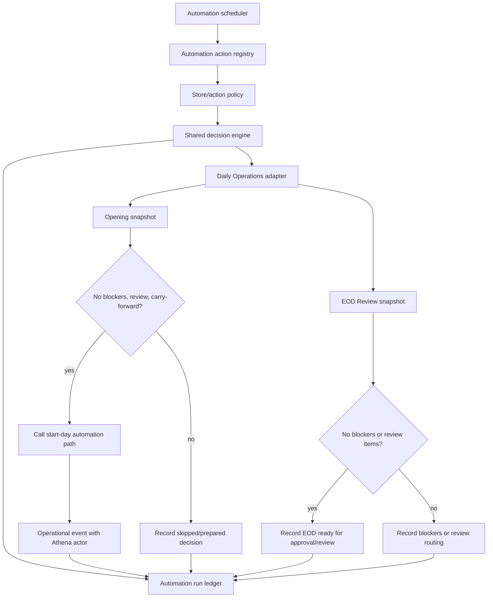

# feat: Add Athena Automation Foundation

## Summary

Add a guarded automation foundation that lets Athena act as a first-class operational actor across product workflows. Daily Operations is the first implementation built on top of that foundation: Athena can auto-start clean Opening Handoffs, prepare EOD Review when the day is ready for human review, and preserve the existing manager-approval boundary for EOD completion.

---

## Problem Frame

M Supplies production history shows a repeated pattern: Opening Handoff is usually a clean acknowledgement, while EOD Review often needs explicit review of cash variances or voided-sale evidence before completion. Athena already aggregates store-day state, but the system cannot yet perform safe low-risk lifecycle work itself or explain why it declined to act. The missing capability is not only a Daily Operations feature; it is a reusable automation foundation with actor identity, deterministic policy, idempotent execution, durable run history, and operator-facing audit evidence. Daily Operations should prove the foundation on a narrow, high-value workflow before other product areas build on it.

---

## Requirements

- R1. Athena must be representable as an actor on operational events and automation runs without pretending to be a staff profile. Origin: A4.
- R2. Automation must have reusable foundation primitives: actor identity, policy, deterministic decision evaluation, idempotency, run ledger, source subjects, outcome history, and operational event attribution.
- R3. Automation must be disabled or dry-run by default and store-scoped before any production action can mutate workflow state.
- R4. The first implementation must be a Daily Operations lifecycle adapter, not a one-off cron path embedded directly in Daily Operations code.
- R5. Clean Opening Handoff may be auto-started only when the server-owned Opening snapshot has no blockers, no review items, and no carry-forward acknowledgements required. Origin: R10, R11, R12, F4, AE4.
- R6. Opening automation must preserve the same durable `dailyOpening` record, source subjects, readiness snapshot, and operational timeline evidence as manual start-day acknowledgement. Origin: R1, R12.
- R7. EOD Review automation must not silently complete review-bearing or blocked days. It may prepare, summarize, and route the day for human approval/review. Origin: R4, R5, R6, F1, F2, AE1, AE2.
- R8. Clean EOD auto-completion must remain policy-disabled in this plan unless a later explicit policy enables manager-approved automation; current implementation should preserve `approval_required` semantics. Origin: R5, R6.
- R9. Every automation decision must be idempotent, explainable, and queryable by store/date/domain/action with inputs, outcome, policy version, and source subjects.
- R10. Operators and managers must be able to see what Athena did, what it skipped, and what needs human review without exposing raw backend wording. Origin: R7, R8, R9, AE3.

**Origin actors:** A1 Operator, A2 Owner or manager, A3 Staff member, A4 Athena.
**Origin flows:** F1 Daily close readiness review, F2 Exception review and carry-forward, F3 Close completion and daily summary, F4 Future opening handoff.
**Origin acceptance examples:** AE1 blocked close remains blocked, AE2 exceptions remain visible, AE3 completed summary preserves attribution, AE4 carry-forward informs opening.

---

## Scope Boundaries

- Do not complete EOD Review without satisfying the existing manager approval proof boundary.
- Do not auto-acknowledge cash variance, voided-sale, carry-forward, or unresolved operational review items.
- Do not create POS drawers, register sessions, opening floats, payments, inventory corrections, or approval proofs.
- Do not add AI/LLM judgement; automation uses deterministic snapshot policy only.
- Do not make automation global by default; store-scoped rollout controls are required before action mode.
- Do not embed reusable automation primitives only inside Daily Operations modules; Daily Operations should consume the foundation through a clear adapter/registration boundary.
- Do not replace Daily Operations, Opening Handoff, EOD Review, Cash Controls, approvals, or operations queue surfaces as the source of truth.

### Deferred to Follow-Up Work

- Auto-complete clean EOD Review after an explicit product decision on how Athena should satisfy manager-approval policy.
- Add additional automation consumers outside Daily Operations after the foundation and first adapter are validated.
- Trigger Opening automation from first terminal activity in addition to scheduled evaluation.
- Add notifications outside the Operations surface.
- Add trend-based automation recommendations beyond deterministic store-day lifecycle rules.

---

## Context & Research

### Relevant Code and Patterns

- `packages/athena-webapp/convex/operations/dailyOpening.ts` already builds the Opening snapshot, revalidates blockers/acknowledgements in `startStoreDayWithCtx`, persists `dailyOpening`, resolves human actors, and records `daily_opening_acknowledged` events.
- `packages/athena-webapp/convex/operations/dailyClose.ts` already builds the EOD Review snapshot, requires reviewed item keys, requires manager approval proof for `completeDailyCloseWithCtx`, persists `dailyClose`, and records `daily_close_completed`.
- `packages/athena-webapp/convex/operations/operationalEvents.ts` is the audit/timeline rail with subject-scoped dedupe and optional actor fields.
- `packages/athena-webapp/convex/schemas/operations/dailyOpening.ts` and `packages/athena-webapp/convex/schemas/operations/dailyClose.ts` contain the durable store-day lifecycle records automation should reuse; `dailyOpening` currently stores human actor fields and will need optional automation attribution for auto-started days.
- `packages/athena-webapp/convex/crons.ts` defines existing Convex cron jobs for low-frequency backend maintenance.
- `packages/athena-webapp/convex/operations/dailyOperations.ts` composes Daily Operations state and is the natural read-model surface for automation status.
- A new shared Convex automation module should own foundation concepts such as actor identity, policy mode, registered automation action definitions, idempotency keys, run records, and common persistence helpers. Daily Operations code should supply domain-specific snapshots and action handlers.
- `packages/athena-webapp/src/components/operations/DailyOperationsView.tsx`, `DailyOpeningView.tsx`, and `DailyCloseView.tsx` are the expected operator-facing surfaces for lifecycle state and calm operational copy.

### Institutional Learnings

- `docs/solutions/logic-errors/athena-daily-close-store-day-boundary-2026-05-07.md`: Daily Close is store-day scoped, command-time readiness must be re-read, manager approval is required for completion, and Opening should consume durable prior close/carry-forward state.
- `docs/solutions/logic-errors/athena-daily-operations-state-and-eod-review-2026-05-11.md`: Daily Operations UI state should come from backend snapshots, not route context or stale record labels.
- `docs/solutions/logic-errors/athena-store-ops-workspace-state-boundaries-2026-05-09.md`: completed/opened workflow states are presentation boundaries; stale blocker details should not drive the primary UI.
- `docs/solutions/architecture/athena-pos-quick-add-operational-event-tracing-2026-05-30.md`: operator-facing events should explicitly say who or what actor did the work and include the operational quantity/context that matters.

### External References

- None. The work extends existing Athena Convex, cron, command-result, Daily Operations, and operational event patterns.

---

## Key Technical Decisions

- **Build the foundation first:** Add reusable automation definitions, actor identity, policy, decision, idempotency, run-ledger, and attribution primitives before implementing Daily Operations actions.
- **Introduce automation identity explicitly:** Add `actorType`/automation metadata rather than using a fake `staffProfile` for Athena. This preserves human accountability while allowing system-originated events.
- **Register domain actions:** Daily Operations should register/evaluate specific actions such as `daily_operations.opening.auto_start` and `daily_operations.eod.prepare` against the shared automation foundation.
- **Record decisions before actions:** A durable automation run row should exist for dry-run, skipped, failed, prepared, and applied outcomes so operators can audit both action and inaction.
- **Keep policy deterministic and versioned:** Automation decisions come from snapshot counts, source subjects, existing policy flags, and a named policy version; there is no probabilistic judgement.
- **Action mode is store-scoped:** Automation policy is stored per store/domain/action. Defaults are disabled or dry-run, which keeps rollout reversible and prevents accidental global behavior.
- **Opening is the first mutation:** Clean Opening Handoff has the lowest risk because the existing command already blocks blocker/review/carry-forward states and production history shows it is usually a ready acknowledgement.
- **EOD starts as preparation:** EOD Review automation creates status/evidence and review routing. It does not complete the close while the current command requires manager approval proof.
- **Operator copy stays operational:** UI and event messages should say that Athena started Opening Handoff or prepared EOD Review, and why. Raw codes, policy internals, and backend errors stay in metadata.

---

## Open Questions

### Resolved During Planning

- **Should Athena be represented as a staff profile?** No. Use explicit automation actor metadata and keep human actor fields optional for human actions.
- **Should Opening auto-start when there are review or carry-forward items?** No. Auto-start only applies to clean snapshots. Review/carry-forward remains human acknowledgement.
- **Should EOD Review auto-complete now?** No. Current `completeDailyCloseWithCtx` requires manager approval proof; this plan preserves that boundary.
- **Should automation create drawer/register/payment/inventory records?** No. It only operates on store-day lifecycle records and audit/status evidence.
- **Should the automation layer live inside Daily Operations?** No. Daily Operations is the first consumer of reusable automation foundation primitives.

### Deferred to Implementation

- Exact naming for the automation foundation module, policy/run tables, and registered action ids should follow schema conventions during implementation.
- The first enabled store list can be seeded through data/config after the policy table exists; this plan does not hard-code M Supplies ids.
- Whether action-mode cron runs every 30 or 60 minutes can be tuned during implementation using the existing production cron cadence.

---

## High-Level Technical Design

> *This illustrates the intended approach and is directional guidance for review, not implementation specification. The implementing agent should treat it as context, not code to reproduce.*

---

## Implementation Units

- U1. **Add Automation Foundation Primitives**

**Goal:** Create reusable automation primitives before Daily Operations consumes them.

**Requirements:** R1, R2, R3, R9, R10

**Dependencies:** None

**Files:**
- Modify: `packages/athena-webapp/convex/schema.ts`
- Create: `packages/athena-webapp/convex/schemas/automation.ts`
- Create: `packages/athena-webapp/convex/automation/automationFoundation.ts`
- Create: `packages/athena-webapp/convex/automation/actionRegistry.ts`
- Create: `packages/athena-webapp/convex/automation/runLedger.ts`
- Modify: `packages/athena-webapp/convex/schemas/operations/operationalEvent.ts`
- Modify: `packages/athena-webapp/convex/operations/operationalEvents.ts`
- Test: `packages/athena-webapp/convex/automation/automationFoundation.test.ts`
- Test: `packages/athena-webapp/convex/operations/operationalEvents.test.ts`
- Test: `packages/athena-webapp/convex/operations/operationsQueryIndexes.test.ts`

**Approach:**
- Add a store-scoped automation policy table for domain/action, action mode, dry-run mode, pause state, policy version, and rollout notes.
- Add an automation action definition shape that names the domain, action, trigger type, allowed outcomes, mutation boundary, and source-subject requirements.
- Add an automation run table keyed by store, operating date, domain, action, idempotency key, outcome, policy version, source subjects, snapshot counts, event ids, and error metadata.
- Extend operational events with optional automation actor metadata such as actor type, automation run id, policy version, and decision reason.
- Keep existing `actorUserId` and `actorStaffProfileId` semantics unchanged for human actions.
- Add indexed access for store/date/domain/action and store/outcome so workflow surfaces can show recent decisions without broad scans.

**Execution note:** Implement schema, action-definition, run-ledger, and event characterization tests before wiring any workflow mutation.

**Patterns to follow:**
- `packages/athena-webapp/convex/operations/operationalEvents.ts`

**Test scenarios:**
- Happy path: recording an automation run stores store id, operating date, domain, action, outcome, policy version, source subjects, and snapshot counts.
- Happy path: an automation action definition can be registered for a domain without importing Daily Operations modules.
- Happy path: an operational event can be recorded with Athena actor metadata and no staff profile.
- Edge case: event dedupe treats automation metadata as part of the dedupe decision only where the caller supplies metadata dedupe keys.
- Edge case: human-authored operational events continue to accept only `actorUserId`/`actorStaffProfileId` without automation metadata.
- Error path: invalid automation domain, action, mode, or outcome fails schema validation in tests.
- Integration: query-index tests prove policy and run tables support store/date/domain/action lookups.

**Verification:**
- Automation foundation tests prove Athena can appear as a system actor while existing human actor behavior remains intact, independent of Daily Operations.

---

- U2. **Build Shared Automation Evaluation And Execution Boundary**

**Goal:** Evaluate registered automation actions through a shared deterministic policy path before domain handlers mutate workflow state.

**Requirements:** R2, R3, R4, R9

**Dependencies:** U1

**Files:**
- Modify: `packages/athena-webapp/convex/automation/automationFoundation.ts`
- Modify: `packages/athena-webapp/convex/automation/actionRegistry.ts`
- Modify: `packages/athena-webapp/convex/automation/runLedger.ts`
- Test: `packages/athena-webapp/convex/automation/automationFoundation.test.ts`

**Approach:**
- Add shared internal helpers that evaluate a store/date/domain/action against a registered action definition and current policy.
- Return a typed decision: disabled, dry-run, skipped, prepared, eligible, applied, or failed.
- Require domain adapters to supply source subjects, snapshot counts, mutation boundary, and idempotency key before an action can be applied.
- Persist dry-run, skipped, prepared, failed, and applied decisions before or with domain-side effects so the run ledger can explain both action and inaction.
- Include a policy version constant in decisions and run records so future policy changes are distinguishable from historical runs.

**Execution note:** Add pure decision tests first, then connect the decision result to persistence.

**Patterns to follow:**
- `packages/athena-webapp/convex/operations/operationalEvents.ts`
- `packages/athena-webapp/convex/crons.ts`

**Test scenarios:**
- Happy path: enabled action policy returns eligible when the adapter supplies a valid eligible decision.
- Happy path: dry-run policy records the decision without applying the domain handler.
- Edge case: disabled policy records skipped/disabled and does not call the domain handler.
- Edge case: duplicate idempotency key returns the prior run outcome without duplicate events or mutations.
- Error path: missing source subjects or invalid operating date returns skipped/failed without domain mutation.
- Integration: decision records include enough source subjects to navigate back to domain evidence.

**Verification:**
- The shared evaluator can be run in dry-run mode for production-like snapshots without creating domain records.

---

- U3. **Add Daily Operations Automation Adapter**

**Goal:** Make Daily Operations the first domain implementation on top of the shared automation foundation.

**Requirements:** R4, R5, R6, R7, R8, R9, R10

**Dependencies:** U1, U2

**Files:**
- Create: `packages/athena-webapp/convex/operations/dailyOperationsAutomation.ts`
- Modify: `packages/athena-webapp/convex/schemas/operations/dailyOpening.ts`
- Modify: `packages/athena-webapp/convex/operations/dailyOpening.ts`
- Modify: `packages/athena-webapp/convex/operations/dailyClose.ts`
- Modify: `packages/athena-webapp/convex/crons.ts`
- Test: `packages/athena-webapp/convex/operations/dailyOperationsAutomation.test.ts`
- Test: `packages/athena-webapp/convex/operations/dailyOpening.test.ts`
- Test: `packages/athena-webapp/convex/operations/dailyClose.test.ts`

**Approach:**
- Register Daily Operations actions with the shared foundation, including Opening auto-start and EOD preparation.
- Add an internal automation entry point that reuses `buildDailyOpeningSnapshotWithCtx` and the same command-time preconditions as `startStoreDayWithCtx`.
- Refactor actor resolution so automation can persist `dailyOpening` with Athena actor metadata without requiring a staff profile, while manual `startStoreDay` still requires valid human access.
- Record `daily_opening_auto_started` or equivalent event with Athena actor metadata, policy version, source subjects, readiness counts, and decision reason.
- Treat EOD as preparation-only in this plan: blocked days record blocker evidence, review days record review routing, and clean days record ready-for-manager-approval status without calling `completeDailyCloseWithCtx`.
- Add idempotency by store/date/domain/action so repeated cron evaluations do not duplicate openings or events.
- Wire the cron in dry-run-friendly cadence and action only for stores with action mode enabled for Opening.

**Execution note:** Characterize manual `startStoreDay` actor authorization and `completeDailyCloseWithCtx` approval behavior before adding the automation adapter paths.

**Patterns to follow:**
- `packages/athena-webapp/convex/operations/dailyOpening.ts`
- `packages/athena-webapp/convex/operations/dailyClose.ts`
- `packages/athena-webapp/convex/crons.ts`
- `packages/athena-webapp/convex/operations/operationalEvents.ts`

**Test scenarios:**
- Happy path: clean Opening automation inserts `dailyOpening`, records an Athena-authored event, and stores an applied automation run.
- Happy path: EOD snapshot with no blockers and no review items records prepared-ready, not complete.
- Edge case: a second run for the same store/date/domain/action returns idempotent applied/already-started state without duplicate records.
- Edge case: manual Opening still records human actor fields and does not require automation metadata.
- Error path: Opening with review or carry-forward items records skipped/requires-human outcome and does not insert `dailyOpening`.
- Error path: EOD with a cash variance records prepared-review with the variance source subject and does not write reviewed item keys.
- Error path: automation calling completion without proof still receives `approval_required`.
- Error path: disabled or dry-run policy records decision outcome but does not mutate `dailyOpening`.
- Integration: cron target calls the internal evaluator and respects store-scoped policy.

**Verification:**
- Daily Operations proves the shared automation foundation by auto-starting only clean Opening Handoffs and preparing, not completing, EOD Review.

---

- U4. **Surface Daily Operations Automation Status**

**Goal:** Show operators and managers what Athena did, skipped, or prepared for the selected store day.

**Requirements:** R9, R10

**Dependencies:** U1, U2, U3

**Files:**
- Modify: `packages/athena-webapp/convex/operations/dailyOperations.ts`
- Modify: `packages/athena-webapp/src/components/operations/DailyOperationsView.tsx`
- Modify: `packages/athena-webapp/src/components/operations/DailyOpeningView.tsx`
- Modify: `packages/athena-webapp/src/components/operations/DailyCloseView.tsx`
- Test: `packages/athena-webapp/convex/operations/dailyOperations.test.ts`
- Test: `packages/athena-webapp/src/components/operations/DailyOperationsView.test.tsx`
- Test: `packages/athena-webapp/src/components/operations/DailyOpeningView.test.tsx`
- Test: `packages/athena-webapp/src/components/operations/DailyCloseView.test.tsx`

**Approach:**
- Extend the Daily Operations snapshot with recent automation status for the selected operating date.
- Present compact automation state near the relevant lifecycle lane: Athena started Opening, Athena found review items, Athena prepared EOD Review, or Athena skipped because policy is dry-run/disabled.
- Keep copy calm and operational, following `docs/product-copy-tone.md`.
- Use source links from automation runs to route operators to Opening, EOD Review, Cash Controls, transactions, approvals, or open work.
- On completed/opened terminal states, respect the existing presentation boundary so old skipped decisions do not overshadow the current workflow state.

**Patterns to follow:**
- `packages/athena-webapp/src/components/operations/DailyOperationsView.tsx`
- `packages/athena-webapp/src/components/operations/DailyOpeningView.tsx`
- `packages/athena-webapp/src/components/operations/DailyCloseView.tsx`
- `docs/product-copy-tone.md`

**Test scenarios:**
- Happy path: Daily Operations shows Athena started Opening for a clean day.
- Happy path: EOD Review shows Athena prepared the day for manager review when no blockers remain.
- Edge case: disabled/dry-run decisions are visible to managers without claiming the task was completed.
- Edge case: completed Opening or EOD states suppress stale skipped/review details from primary status while preserving audit history.
- Error path: failed automation decision renders a restrained operational message and links to source workflow where available.
- Integration: UI links route to the source subjects encoded by backend automation status.

**Verification:**
- Operators can understand Athena's automation posture from Daily Operations without reading raw automation metadata or backend error codes.

---

- U5. **Document And Validate The Automation Boundary**

**Goal:** Keep repository guidance, generated graph artifacts, and reusable learnings aligned with the new foundation and first Daily Operations implementation.

**Requirements:** R1, R2, R3, R7, R8, R9, R10

**Dependencies:** U1, U2, U3, U4

**Files:**
- Create: `docs/solutions/architecture/athena-automation-foundation-2026-06-08.md`
- Modify: `graphify-out/graph.json`
- Test: `packages/athena-webapp/convex/operations/dailyOperationsAutomation.test.ts`
- Test: `packages/athena-webapp/convex/automation/automationFoundation.test.ts`

**Approach:**
- Add a solution note documenting Athena-as-actor, reusable automation foundation, action registration, run ledger, deterministic policy, Daily Operations adapter, Opening auto-start constraints, and EOD approval boundary.
- Rebuild graphify after code changes, per repo guidance.
- Include final validation that automation has no path to complete review-bearing EOD or create non-lifecycle operational records.

**Patterns to follow:**
- `docs/solutions/logic-errors/athena-daily-close-store-day-boundary-2026-05-07.md`
- `docs/solutions/architecture/athena-pos-quick-add-operational-event-tracing-2026-05-30.md`

**Test scenarios:**
- Test expectation: none for the documentation file itself; behavior is covered by U1-U5 tests.
- Integration: final automation test set proves Opening action mode, EOD preparation mode, dry-run mode, and disabled mode.
- Integration: foundation tests prove the automation primitives are not coupled to Daily Operations.

**Verification:**
- The solution note explains the safety boundary, and graphify artifacts reflect the new code paths.

---

## System-Wide Impact

- **Interaction graph:** Convex cron/scheduler, shared automation foundation, action registry, automation policy, run ledger, operational events, Daily Opening, Daily Close, Daily Operations snapshot, and Operations UI are affected.
- **Error propagation:** Automation should record failed/skipped outcomes as operational evidence while returning command-result style errors from internal helpers for testability.
- **State lifecycle risks:** Duplicate cron runs, dry-run/action toggles, existing manual records, and reopened/superseded EOD records require idempotent store/date/domain/action keys.
- **API surface parity:** Public manual mutations remain unchanged; new automation entry points should be internal unless explicitly needed for admin tooling.
- **Foundation coupling risk:** Shared automation modules must not import Daily Operations action code; Daily Operations should register/supply adapter handlers into the foundation.
- **Integration coverage:** Unit tests must prove cross-layer behavior from policy evaluation to lifecycle mutation/event/automation run visibility.
- **Unchanged invariants:** Cash Controls remains drawer/session scoped; manual Opening still requires human authorization; EOD completion still requires manager approval proof; Daily Close history remains read-only.

---

## Risks & Dependencies

| Risk | Mitigation |
|------|------------|
| Athena appears to impersonate a staff member | Use explicit automation actor metadata and keep human actor fields unchanged. |
| Foundation becomes a Daily Operations-only abstraction | Keep shared automation modules domain-neutral and add tests that action definitions/runs do not require Daily Operations imports. |
| Cron duplicates lifecycle records | Add idempotency keys and subject-scoped event dedupe for store/date/domain/action. |
| EOD automation weakens review discipline | Keep EOD in preparation mode and test that `completeDailyCloseWithCtx` still requires approval proof. |
| Dry-run noise confuses operators | Surface dry-run status only in restrained operations/admin contexts and keep current workflow state primary. |
| Store-day range drift causes wrong-day automation | Reuse existing operating-date range helpers and include selected range in automation run metadata. |
| Global rollout acts on stores unexpectedly | Default policies to disabled/dry-run and require store-scoped action enablement. |

---

## Documentation / Operational Notes

- Build and test the foundation before implementing the Daily Operations adapter.
- Start Daily Operations rollout in dry-run mode for M Supplies, then enable Opening action mode only after reviewing automation run outcomes.
- Keep EOD Review in preparation mode until a separate signoff explicitly defines how Athena can satisfy manager approval for clean days.
- Use operational timeline and automation run rows as the audit record for "what Athena did" and "why Athena skipped."
- Follow `docs/product-copy-tone.md` for user-facing automation copy.
- After implementation modifies code files, run `bun run graphify:rebuild` before final validation.

---

## Sources & References

- **Origin document:** [docs/brainstorms/2026-05-07-daily-operations-lifecycle-requirements.md](../brainstorms/2026-05-07-daily-operations-lifecycle-requirements.md)
- Related plan: [docs/plans/2026-05-08-001-feat-opening-mvp-store-readiness-gate-plan.md](2026-05-08-001-feat-opening-mvp-store-readiness-gate-plan.md)
- Related code: `packages/athena-webapp/convex/operations/dailyOpening.ts`
- Related code: `packages/athena-webapp/convex/operations/dailyClose.ts`
- Related code: `packages/athena-webapp/convex/operations/operationalEvents.ts`
- Related code: `packages/athena-webapp/convex/operations/dailyOperations.ts`
- Related code: `packages/athena-webapp/convex/crons.ts`
- Institutional learning: [docs/solutions/logic-errors/athena-daily-close-store-day-boundary-2026-05-07.md](../solutions/logic-errors/athena-daily-close-store-day-boundary-2026-05-07.md)
- Institutional learning: [docs/solutions/logic-errors/athena-daily-operations-state-and-eod-review-2026-05-11.md](../solutions/logic-errors/athena-daily-operations-state-and-eod-review-2026-05-11.md)
- Institutional learning: [docs/solutions/logic-errors/athena-store-ops-workspace-state-boundaries-2026-05-09.md](../solutions/logic-errors/athena-store-ops-workspace-state-boundaries-2026-05-09.md)
