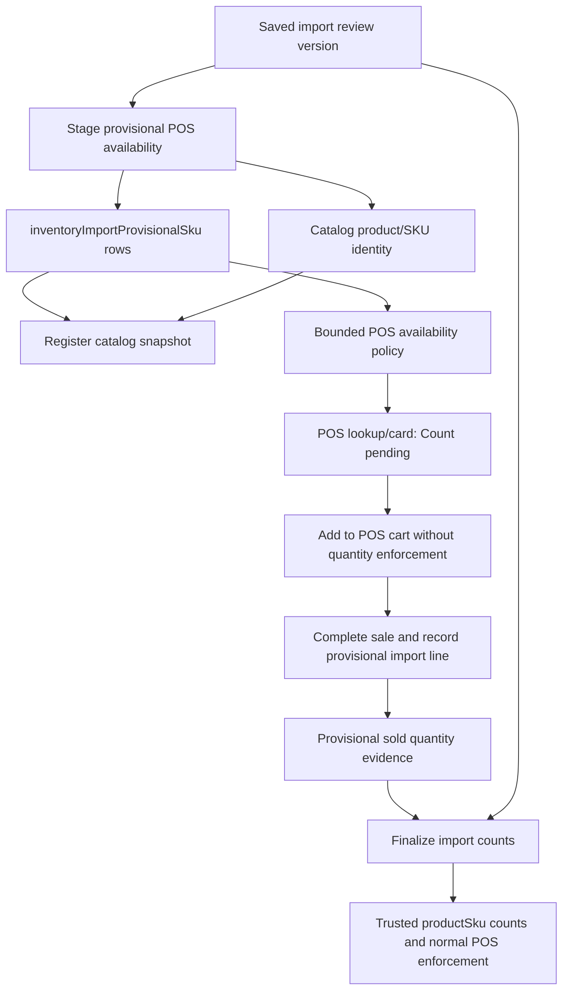

# feat: Add provisional import POS availability

## Summary

Make imported legacy inventory searchable and sellable in POS before trusted Athena counts are finalized. The plan adds a provisional import stock boundary beside normal catalog inventory: POS can sell matched/imported SKUs without enforcing available quantity, while Athena preserves imported counts and provisional sale evidence for final reconciliation.

---

## Problem Frame

The store needs the old-system inventory available at checkout while operators finish importing and validating true Athena counts. Cashiers can physically see the product in front of them, so blocking checkout on unfinalized or zero Athena quantity creates operational friction; at the same time, the imported quantities must not become trusted stock until the import is finalized.

---

## Requirements

- R1. Imported legacy products can be made available to POS lookup before final inventory counts are applied.
- R2. POS can add and sell active provisional-import SKUs regardless of `quantityAvailable` or active hold availability.
- R3. Provisional imported quantities remain separate from trusted `productSku.inventoryCount` and `productSku.quantityAvailable` until finalization.
- R4. POS sale lines against provisional imports preserve enough metadata to reconcile sold quantities during finalization.
- R5. Existing pending checkout items remain the fallback for products not present in Athena and not present in the provisional import.
- R6. Provisional import rows stay out of storefront and normal trusted catalog stock reporting until finalized.
- R7. Operators can see which import rows are already POS-available, finalize them into trusted stock, or close/reject provisional rows.
- R8. Offline/local-first POS behavior preserves completed sales and treats provisional-import stock uncertainty as review/reconciliation context, not receipt mutation.

---

## Scope Boundaries

- Do not inflate `productSku.quantityAvailable` with fake values such as `9999`.
- Do not replace pending checkout items; they remain the path for missing products not covered by the import.
- Do not make provisional import rows storefront-sellable before finalization.
- Do not redesign the full inventory import parser or review UI beyond the staging/finalization actions and status needed for this feature.
- Do not solve cross-terminal oversell prevention for provisional imports; the accepted behavior is sale continuity plus reconciliation.
- Do not change expense-session inventory enforcement unless shared POS helpers require a compatibility guard.

### Deferred to Follow-Up Work

- Fraud/risk scoring for unusually high provisional-import sale volume.
- Rich final count variance dashboards beyond the import review/finalization surface.
- Automated owner notifications when provisional import sales exceed the imported quantity.

---

## Context & Research

### Relevant Code and Patterns

- `packages/athena-webapp/convex/inventory/catalogImport.ts` owns inventory import review versions and the existing trusted import mutation.
- `packages/athena-webapp/src/components/operations/InventoryImportView.tsx` is the operator-facing review/finalization surface.
- `packages/athena-webapp/convex/pos/application/queries/listRegisterCatalog.ts` splits stable register catalog metadata from bounded availability overlays.
- `packages/athena-webapp/convex/pos/application/commands/sessionCommands.ts` already skips inventory holds for pending checkout sale lines after server-side pending-line validation.
- `packages/athena-webapp/convex/pos/application/commands/completeTransaction.ts` already skips trusted stock decrement for pending checkout items and records pending sale evidence instead.
- `packages/athena-webapp/src/lib/pos/infrastructure/convex/catalogGateway.ts` joins catalog rows and availability rows for online/local register search.
- `packages/athena-webapp/src/components/pos/ProductCard.tsx`, `packages/athena-webapp/src/components/pos/ProductLookup.tsx`, and `packages/athena-webapp/src/components/pos/types.ts` already support availability messages and optional quantity presentation.
- `packages/athena-webapp/convex/pos/application/sync/projectLocalEvents.ts` and `packages/athena-webapp/convex/pos/application/sync/ingestLocalEvents.ts` preserve local-first POS sale facts and route inventory uncertainty to review/conflict rails.

### Institutional Learnings

- `docs/solutions/architecture/athena-pos-pending-checkout-item-recovery-2026-06-06.md` says cashier continuity should not convert checkout quantities into trusted inventory, holds, or stock movements.
- `docs/solutions/logic-errors/athena-pos-register-local-catalog-search-2026-05-04.md` says register catalog metadata must stay stable and must not include volatile stock fields.
- `docs/solutions/performance/athena-pos-cart-latency-foundation-2026-05-05.md` says POS cart operations should use ledger holds and avoid invalidating full-store catalog subscriptions.
- `docs/solutions/architecture/athena-pos-offline-inventory-snapshot-2026-05-15.md` separates searchable catalog metadata, live availability, and local availability snapshots.
- `docs/solutions/architecture/athena-pos-local-first-sync-2026-05-13.md` says completed local sales are customer-facing facts; sync preserves them and creates reconciliation work when cloud stock conflicts.

### External References

- None. The repository has strong local patterns for Convex schemas, POS catalog read models, ledger holds, local sync, and inventory review.

---

## Key Technical Decisions

- **Use a provisional import table for imported stock truth:** Imported counts, row decisions, POS exposure status, sale evidence, and finalization status belong outside trusted `productSku.quantityAvailable` until the operator finalizes them.
- **Create or link normal catalog identity early, but keep stock untrusted:** POS search needs product/SKU/barcode/price identity. The provisional row owns stock trust and POS availability policy; the SKU remains hidden from storefront or ordinary trusted browse until finalized if it was created only for import staging.
- **Represent POS availability as a policy, not a fake count:** Active provisional import rows should project an availability policy such as "unbounded provisional import" so POS can add any sale quantity without pretending there are many units available.
- **Extend the existing pending-checkout bypass shape:** Session commands and completion already know how to skip holds/decrements for pending checkout lines after server-side validation. Provisional import lines should follow the same command-boundary posture with their own identifier and audit path.
- **Finalization reconciles provisional sales explicitly:** The final trusted count must account for sale evidence recorded while provisional mode was active. Operators should see imported quantity, provisional sold quantity, and the count that will become trusted.
- **Keep POS catalog metadata stable:** The full register catalog can include active provisional import identities, but volatile availability remains in bounded availability rows and policy flags.

---

## Open Questions

### Resolved During Planning

- Should imported inventory live in a provisional table? Yes. The table is the trust boundary for imported counts and sale evidence.
- Should POS enforce counts for provisional imports? No. The cashier can sell the item while counts are pending.
- Should pending checkout items be reused for every imported item? No. Imported rows have identifiers and prices; pending checkout remains the fallback for missing products.
- Should trusted SKU counts be inflated to make POS work? No. POS availability policy should bypass enforcement without corrupting inventory data.

### Deferred to Implementation

- Exact field names for availability policy/status should be chosen while editing DTO/schema validators so they align with existing naming.
- Exact finalization copy should be validated against the current import review UI once implementation starts.
- Whether the first release exposes a bulk "Make all review rows POS-available" action or only stages the current saved review version can be decided while fitting the existing review workflow.

---

## High-Level Technical Design

> *This illustrates the intended approach and is directional guidance for review, not implementation specification. The implementing agent should treat it as context, not code to reproduce.*

| State | POS searchable | POS count enforcement | Trusted inventory mutation | Storefront visible |
| --- | --- | --- | --- | --- |
| Review saved only | No | N/A | No | No |
| Provisional POS active | Yes | No | No, only sale evidence | No for import-created hidden identities |
| Finalized | Yes | Yes | Yes | Follows normal product visibility |
| Rejected/closed | No, unless linked to trusted SKU | Normal for trusted SKU only | No provisional mutation | No provisional exposure |

---

## Implementation Units

- U1. **Add provisional import inventory schema**

**Goal:** Introduce the persistent trust boundary for imported rows that are POS-sellable before final count finalization.

**Requirements:** R1, R3, R4, R6, R7

**Dependencies:** None

**Files:**
- Create: `packages/athena-webapp/convex/schemas/inventory/inventoryImportProvisionalSku.ts`
- Modify: `packages/athena-webapp/convex/schemas/inventory/index.ts`
- Modify: `packages/athena-webapp/convex/schema.ts`
- Modify: `packages/athena-webapp/convex/schemas/pos/posSessionItem.ts`
- Modify: `packages/athena-webapp/convex/schemas/pos/posTransactionItem.ts`
- Test: `packages/athena-webapp/convex/schemas/inventory/inventoryImportProvisionalSku.test.ts`

**Approach:**
- Add an `inventoryImportProvisionalSku` table keyed by store, import key/review version, row key, product SKU, and status.
- Store imported row metadata needed for review and reconciliation: imported name/SKU/barcode/price/category, imported quantity, selected row decision, linked product/SKU IDs, POS exposure timestamps, provisional sale totals, and finalization metadata.
- Add indexes for active rows by store/SKU, store/barcode, store/import key, and store/status.
- Add optional `inventoryImportProvisionalSkuId` to POS session and transaction items so provisional sale evidence survives receipts, sync, and finalization.

**Execution note:** Implement schema/test coverage first. This feature crosses POS, inventory, and sync boundaries, so stable IDs and status values should exist before command work begins.

**Patterns to follow:**
- `packages/athena-webapp/convex/schemas/inventory/inventoryImportReviewVersion.ts`
- `packages/athena-webapp/convex/schemas/pos/posPendingCheckoutItem.ts`
- `packages/athena-webapp/convex/schema.ts`

**Test scenarios:**
- Happy path: schema accepts an active provisional row linked to a review version, row key, product SKU, imported quantity, and POS exposure timestamp.
- Edge case: schema accepts a row with imported SKU but no barcode, while still preserving row key and normalized searchable metadata.
- Edge case: POS session and transaction item schemas accept an optional provisional import reference without requiring a pending checkout item.
- Error path: invalid provisional status or finalization state is rejected.

**Verification:**
- Provisional import rows can represent POS-active, finalized, rejected, and closed import states without changing trusted stock fields.

---

- U2. **Stage import review rows into provisional POS catalog identity**

**Goal:** Let an operator make a saved inventory import available in POS without applying trusted counts.

**Requirements:** R1, R3, R6, R7

**Dependencies:** U1

**Files:**
- Modify: `packages/athena-webapp/convex/inventory/catalogImport.ts`
- Modify: `packages/athena-webapp/src/components/operations/InventoryImportView.tsx`
- Modify: `packages/athena-webapp/src/components/operations/InventoryImportView.test.tsx`
- Test: `packages/athena-webapp/convex/inventory/catalogImport.test.ts`

**Approach:**
- Add a command that stages the latest/specified saved review version into provisional rows.
- For rows matched to existing Athena SKUs, create a hidden provisional product/SKU anchor instead of linking the provisional row to the trusted `productSkuId`; this keeps trusted inventory semantics isolated while still exposing the imported legacy row in POS.
- For new import rows, create or reuse hidden/POS-only catalog identity sufficient for register lookup, but keep storefront/trusted catalog visibility disabled until finalization.
- Record operational events for staging, including row counts and actor/store context.
- Add import review UI status and an action such as "Make available in POS" or "Stage for POS" after the review draft is saved.

**Patterns to follow:**
- `saveInventoryImportReviewVersionWithCtx` and `importInventoryRowsWithCtx` in `packages/athena-webapp/convex/inventory/catalogImport.ts`
- Existing manager elevation access checks in `packages/athena-webapp/convex/inventory/catalogImport.ts`
- `OperationsSummaryMetric` and restrained operation copy in `packages/athena-webapp/src/components/operations/InventoryImportView.tsx`

**Test scenarios:**
- Happy path: staging a saved review version creates active provisional rows and gives matched rows hidden provisional SKU anchors.
- Happy path: staging a new import row creates POS-searchable catalog identity and an active provisional row without applying imported quantity to trusted stock.
- Edge case: staging is idempotent for the same import key and row key; repeated staging updates metadata but does not duplicate provisional rows.
- Edge case: rows marked "skip" are not made POS-active.
- Error path: non-admin/non-elevated users cannot stage provisional import availability.
- Integration: staging writes an operational event with row counts, import key, version id, and actor.

**Verification:**
- Operators can explicitly make import review rows available to POS while trusted SKU counts remain unchanged.

---

- U3. **Expose provisional imports through POS catalog and availability policy**

**Goal:** Make active provisional import rows searchable in POS and present them as sellable without showing fake available counts.

**Requirements:** R1, R2, R3, R5, R6

**Dependencies:** U1, U2

**Files:**
- Modify: `packages/athena-webapp/convex/pos/application/queries/listRegisterCatalog.ts`
- Modify: `packages/athena-webapp/convex/pos/public/catalog.ts`
- Modify: `packages/athena-webapp/src/lib/pos/application/dto.ts`
- Modify: `packages/athena-webapp/src/lib/pos/infrastructure/convex/catalogGateway.ts`
- Modify: `packages/athena-webapp/src/components/pos/types.ts`
- Test: `packages/athena-webapp/convex/pos/application/queries/listRegisterCatalog.test.ts`
- Test: `packages/athena-webapp/convex/pos/public/catalog.test.ts`
- Test: `packages/athena-webapp/src/lib/pos/infrastructure/convex/catalogGateway.test.ts`

**Approach:**
- Extend the register catalog scope to include active provisional import rows linked to product/SKU identity, even when the identity would otherwise be hidden from storefront/trusted browse.
- Extend catalog/availability DTOs with an availability policy/status for provisional imports.
- Return active provisional import rows as `inStock: true` for POS selection while avoiding a misleading trusted `quantityAvailable` display.
- Make bounded availability and full availability snapshot reads return policy metadata so online and local-first POS surfaces behave consistently.
- Keep normal trusted SKUs on the existing hold-aware availability path.

**Patterns to follow:**
- Metadata/availability split in `packages/athena-webapp/convex/pos/application/queries/listRegisterCatalog.ts`
- Local catalog gateway overlay in `packages/athena-webapp/src/lib/pos/infrastructure/convex/catalogGateway.ts`
- Existing `availabilityMessage` and `availabilityStatus` fields in `packages/athena-webapp/src/components/pos/types.ts`

**Test scenarios:**
- Happy path: active provisional import SKU appears in `listRegisterCatalog` even if its product/SKU is POS-only or hidden from storefront.
- Happy path: bounded availability returns active provisional import rows as sellable with policy/status metadata and no fake count requirement.
- Edge case: finalized or rejected provisional rows no longer override normal trusted catalog behavior.
- Edge case: trusted out-of-stock SKU still appears/behaves according to existing exact-match rules and is not made sellable unless it has an active provisional import row.
- Error path: provisional rows from another store are ignored.
- Integration: local catalog gateway maps policy metadata to product cards/search results without losing SKU/barcode/product IDs.

**Verification:**
- POS lookup can find active provisional imported products and show them as sellable while preserving the existing catalog metadata/availability split.

---

- U4. **Skip POS hold and count enforcement for provisional import sale lines**

**Goal:** Let cashiers add and complete provisional import items without inventory conflicts, while preserving sale evidence for reconciliation.

**Requirements:** R2, R4, R5, R8

**Dependencies:** U1, U3

**Files:**
- Modify: `packages/athena-webapp/convex/pos/application/commands/sessionCommands.ts`
- Modify: `packages/athena-webapp/convex/pos/infrastructure/repositories/sessionCommandRepository.ts`
- Modify: `packages/athena-webapp/convex/pos/application/commands/completeTransaction.ts`
- Modify: `packages/athena-webapp/convex/pos/public/transactions.ts`
- Test: `packages/athena-webapp/convex/pos/application/sessionCommands.test.ts`
- Test: `packages/athena-webapp/convex/pos/application/completeTransaction.test.ts`
- Test: `packages/athena-webapp/convex/pos/public/transactions.test.ts`

**Approach:**
- Add server-side validation that a provisional import sale line references an active provisional row for the same store/product/SKU.
- Skip hold acquisition/adjustment for active provisional import lines, mirroring the pending checkout bypass but using `inventoryImportProvisionalSkuId`.
- During sale completion, skip trusted `quantityAvailable` and `inventoryCount` decrement for provisional import lines.
- Persist transaction item references and update provisional row sale evidence counters/timestamps.
- Keep pending checkout behavior unchanged and ensure normal trusted catalog lines still enforce inventory.

**Patterns to follow:**
- Pending checkout validation and hold bypass in `packages/athena-webapp/convex/pos/application/commands/sessionCommands.ts`
- Pending checkout sale evidence branch in `packages/athena-webapp/convex/pos/application/commands/completeTransaction.ts`
- Inventory hold gateway tests in `packages/athena-webapp/convex/pos/infrastructure/integrations/inventoryHoldGateway.test.ts`

**Test scenarios:**
- Happy path: adding an active provisional import SKU to a POS session does not call hold acquisition and creates a session item with provisional import reference.
- Happy path: updating quantity for a provisional import line does not call hold adjustment.
- Happy path: completing a sale with a provisional import line creates the transaction item, updates provisional sale evidence, and does not decrement trusted SKU inventory.
- Edge case: a cart containing normal SKU plus provisional import SKU enforces holds/counts only for the normal SKU.
- Error path: client-supplied provisional import ID from another store or mismatched SKU is rejected.
- Error path: finalized/rejected provisional import rows cannot bypass inventory enforcement.

**Verification:**
- POS can complete provisional import sales regardless of current stock count, and the system records sale evidence without corrupting trusted inventory.

---

- U5. **Carry provisional import semantics through local-first POS sync**

**Goal:** Preserve offline/provisioned terminal sales against provisional imported SKUs and project them into cloud evidence without treating local availability as trusted inventory.

**Requirements:** R2, R4, R8

**Dependencies:** U1, U3, U4

**Files:**
- Modify: `packages/shared/posLocalSyncContract.ts`
- Modify: `packages/athena-webapp/convex/pos/application/sync/types.ts`
- Modify: `packages/athena-webapp/convex/pos/application/sync/ingestLocalEvents.ts`
- Modify: `packages/athena-webapp/convex/pos/application/sync/projectLocalEvents.ts`
- Modify: `packages/athena-webapp/src/lib/pos/infrastructure/local/posLocalStore.ts`
- Modify: `packages/athena-webapp/src/lib/pos/infrastructure/local/localCommandGateway.ts`
- Test: `packages/athena-webapp/convex/pos/application/sync/ingestLocalEvents.test.ts`
- Test: `packages/athena-webapp/convex/pos/application/sync/projectLocalEvents.test.ts`
- Test: `packages/athena-webapp/src/lib/pos/infrastructure/local/localCommandGateway.test.ts`

**Approach:**
- Extend local sale item payloads with provisional import references and availability policy metadata.
- Ensure local command validation treats active provisional imports as locally sellable without requiring a trusted availability snapshot count.
- During sync, validate the cloud provisional row and map/sanitize IDs as needed before projecting the completed sale.
- Block projection when a provisional row changed after an offline sale so a stale provisional reference cannot be trusted as sale evidence.
- Do not project local provisional sales into trusted SKU counts until finalization.

**Patterns to follow:**
- Pending checkout local event payloads in `packages/shared/posLocalSyncContract.ts`
- Local pending checkout projection in `packages/athena-webapp/convex/pos/application/sync/projectLocalEvents.ts`
- Offline inventory conflict posture in `docs/solutions/architecture/athena-pos-local-first-sync-2026-05-13.md`

**Test scenarios:**
- Happy path: local completed sale containing a provisional import line syncs and updates provisional sale evidence.
- Edge case: provisional import sale syncs after the row was finalized; sync preserves the sale and records evidence without double-decrementing stock.
- Edge case: provisional row is unavailable during sync; projection is blocked with a conflict review context.
- Error path: malformed provisional import IDs in uploaded events are rejected during ingestion.
- Integration: mixed local sale with normal, pending checkout, service, and provisional import lines preserves each line's existing projection semantics.

**Verification:**
- Offline provisional import sales with active validated references survive sync and become reconciliation evidence rather than trusted inventory mutation.

---

- U6. **Finalize provisional import counts with provisional sale reconciliation**

**Goal:** Convert provisional imported rows into trusted Athena stock only when operators finalize counts, with provisional sales accounted for explicitly.

**Requirements:** R3, R4, R7

**Dependencies:** U1, U2, U4

**Files:**
- Modify: `packages/athena-webapp/convex/inventory/catalogImport.ts`
- Modify: `packages/athena-webapp/src/components/operations/InventoryImportView.tsx`
- Modify: `packages/athena-webapp/src/components/operations/InventoryImportView.test.tsx`
- Test: `packages/athena-webapp/convex/inventory/catalogImport.test.ts`

**Approach:**
- Add a finalization command that transitions active provisional rows to finalized/trusted state.
- Show imported quantity, provisional sold quantity, and final trusted quantity basis in the import review/finalization surface.
- Apply trusted `inventoryCount` and `quantityAvailable` according to an explicit finalization rule selected in the UI: physical count now, or imported baseline adjusted by provisional sales.
- Record operational events for finalization and skipped/rejected provisional rows.
- Remove provisional POS availability policy once rows are finalized so normal POS inventory enforcement resumes.

**Patterns to follow:**
- Trusted `importInventoryRowsWithCtx` path in `packages/athena-webapp/convex/inventory/catalogImport.ts`
- Draft/save/finalization affordances in `packages/athena-webapp/src/components/operations/InventoryImportView.tsx`
- Product copy tone in `docs/product-copy-tone.md`

**Test scenarios:**
- Happy path: finalizing a provisional row applies trusted counts and marks the row finalized.
- Happy path: finalization displays and accounts for provisional sold quantity.
- Edge case: row with provisional sold quantity greater than imported quantity requires operator-visible variance handling rather than silently writing negative availability.
- Edge case: finalizing a row already linked to an existing SKU updates that SKU rather than creating duplicate catalog identity.
- Error path: non-admin/non-elevated users cannot finalize provisional import counts.
- Integration: after finalization, POS availability for that SKU uses normal hold-aware enforcement.

**Verification:**
- Operators can close the provisional window and return affected SKUs to normal trusted inventory enforcement.

---

- U7. **Update POS and operations presentation copy**

**Goal:** Make provisional import availability understandable to cashiers and operators without implying trusted stock.

**Requirements:** R2, R5, R6, R7

**Dependencies:** U3, U4, U6

**Files:**
- Modify: `packages/athena-webapp/src/components/pos/ProductCard.tsx`
- Modify: `packages/athena-webapp/src/components/pos/ProductLookup.tsx`
- Modify: `packages/athena-webapp/src/components/pos/ProductEntry.tsx`
- Modify: `packages/athena-webapp/src/components/operations/InventoryImportView.tsx`
- Test: `packages/athena-webapp/src/components/pos/ProductCard.test.tsx`
- Test: `packages/athena-webapp/src/components/pos/ProductEntry.test.tsx`
- Test: `packages/athena-webapp/src/components/operations/InventoryImportView.test.tsx`

**Approach:**
- Show active provisional import items as selectable with copy such as "Count pending" or "Import count pending" instead of "0 available."
- Keep cashier workflow normal: no manager prompt, no warning that asks the cashier to adjudicate inventory trust.
- Make operator review rows show provisional POS status and provisional sold count.
- Keep no-result behavior routed to pending checkout item creation when neither trusted catalog nor provisional import matches.

**Patterns to follow:**
- Existing `availabilityMessage` handling in `packages/athena-webapp/src/components/pos/ProductCard.tsx`
- Pending checkout UX in `packages/athena-webapp/src/components/pos/ProductEntry.tsx`
- Calm operator copy from `docs/product-copy-tone.md`

**Test scenarios:**
- Happy path: provisional import product card is enabled and displays count-pending copy without a numeric available quantity.
- Happy path: exact lookup for a provisional import barcode adds the item without showing no-result/pending checkout prompts.
- Edge case: trusted out-of-stock products still render out-of-stock behavior unless an active provisional import row applies.
- Edge case: no trusted/provisional match still offers pending checkout item recovery.
- Integration: import review surface shows staged/finalized/rejected provisional status and sold evidence.

**Verification:**
- Cashiers can identify and add provisional imported items quickly, and operators can see the provisional status during review/finalization.

---

- U8. **Document the provisional import stock boundary**

**Goal:** Preserve the architectural rule so future POS/import changes do not reintroduce fake inventory counts.

**Requirements:** R2, R3, R5, R8

**Dependencies:** U1-U7

**Files:**
- Create: `docs/solutions/architecture/athena-pos-provisional-import-trust-boundary-2026-06-10.md`
- Modify: `graphify-out/graph.json`
- Modify: `graphify-out/GRAPH_REPORT.md`
- Modify: `graphify-out/wiki/index.md`

**Approach:**
- Add a solution note explaining why provisional import rows are POS-sellable but not trusted inventory.
- Call out the anti-patterns: fake high `quantityAvailable`, storefront exposure before finalization, and treating provisional sales as inventory adjustments before finalization.
- Rebuild graphify after implementation changes so repository navigation stays current.

**Patterns to follow:**
- `docs/solutions/architecture/athena-pos-pending-checkout-item-recovery-2026-06-06.md`
- `docs/solutions/architecture/athena-pos-offline-inventory-snapshot-2026-05-15.md`

**Test scenarios:**
- Test expectation: none -- documentation and generated graph artifacts only.

**Verification:**
- The solution note explains the boundary and graphify artifacts reflect the changed code graph.

---

## System-Wide Impact

- **Interaction graph:** Inventory import review/staging feeds provisional rows; POS catalog reads join active provisional rows; POS session/transaction commands validate and record provisional sale evidence; finalization returns rows to trusted stock behavior.
- **Error propagation:** Staging/finalization failures should use existing command result patterns. POS add/complete failures should distinguish invalid provisional references from ordinary stock conflicts.
- **State lifecycle risks:** Rows can move from saved review to provisional active to finalized/rejected/closed. Sale evidence can arrive before or after finalization because of local-first sync.
- **API surface parity:** Public POS catalog validators, DTOs, local sync contracts, session commands, direct transaction paths, and UI product types need the same provisional fields.
- **Integration coverage:** Unit tests alone are not enough; integration-style tests must cover staging to POS lookup, cart add to completion, offline sync projection, and finalization after provisional sales.
- **Unchanged invariants:** Normal trusted SKU inventory enforcement remains hold-aware. Pending checkout items remain distinct from imported provisional SKUs. Storefront catalog visibility remains governed by normal product/SKU visibility and must not include provisional POS-only identities.

---

## Risks & Dependencies

| Risk | Mitigation |
| --- | --- |
| Provisional import rows accidentally become storefront-visible | Keep POS inclusion in POS catalog queries, not general product visibility; test hidden/POS-only identity behavior. |
| Fake availability leaks into analytics or stock ops | Store provisional imported counts in the provisional table and use policy metadata instead of inflated `quantityAvailable`. |
| Sale completion double-decrements inventory after finalization | Persist provisional import references on sale lines and skip trusted mutation for lines sold during the provisional window. |
| Offline sales sync after provisional status changes | Preserve sale facts and route drift to review/conflict rails; do not rewrite receipts. |
| Final counts are ambiguous when provisional sales occurred | Finalization UI must show provisional sold quantity and make the count basis explicit. |
| Broad POS DTO changes regress trusted catalog behavior | Add focused tests for normal trusted in-stock/out-of-stock rows alongside provisional rows. |

---

## Documentation / Operational Notes

- This is an operational bridge for import finalization, not a permanent alternative inventory model.
- Operators should stage provisional POS availability only from a saved review version so import content, decisions, and actor metadata are durable.
- Support/debugging should inspect provisional rows and sale evidence before trusted inventory when explaining why POS allowed a sale with zero Athena availability.
- The implementation should add/update a `docs/solutions/` note because this crosses POS, import, inventory, and local-sync boundaries.

---

## Sources & References

- Related plan: `docs/plans/2026-06-06-001-feat-pos-pending-checkout-items-plan.md`
- Related plan: `docs/plans/2026-05-15-001-feat-pos-offline-inventory-snapshot-plan.md`
- Related code: `packages/athena-webapp/convex/inventory/catalogImport.ts`
- Related code: `packages/athena-webapp/convex/pos/application/queries/listRegisterCatalog.ts`
- Related code: `packages/athena-webapp/convex/pos/application/commands/sessionCommands.ts`
- Related code: `packages/athena-webapp/convex/pos/application/commands/completeTransaction.ts`
- Related code: `packages/athena-webapp/src/lib/pos/infrastructure/convex/catalogGateway.ts`
- Institutional learning: `docs/solutions/architecture/athena-pos-pending-checkout-item-recovery-2026-06-06.md`
- Institutional learning: `docs/solutions/logic-errors/athena-pos-register-local-catalog-search-2026-05-04.md`
- Institutional learning: `docs/solutions/performance/athena-pos-cart-latency-foundation-2026-05-05.md`
- Institutional learning: `docs/solutions/architecture/athena-pos-offline-inventory-snapshot-2026-05-15.md`
