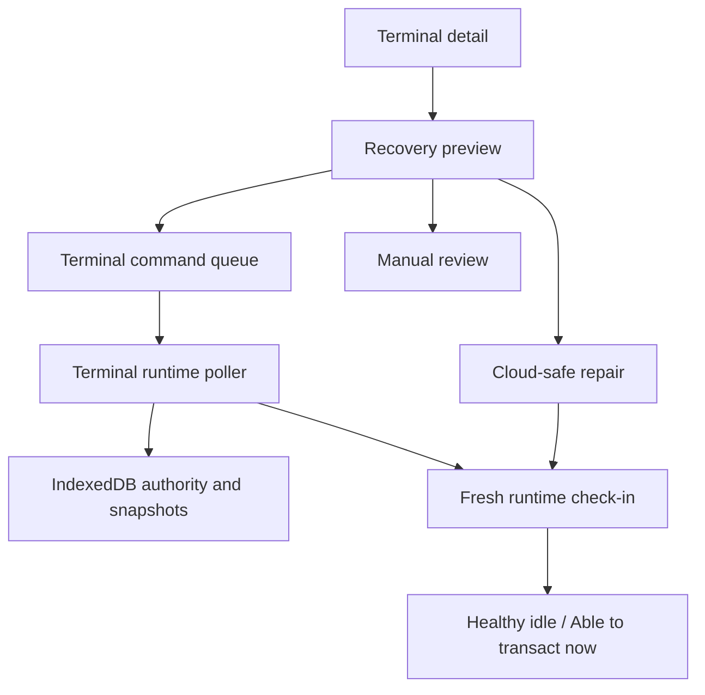
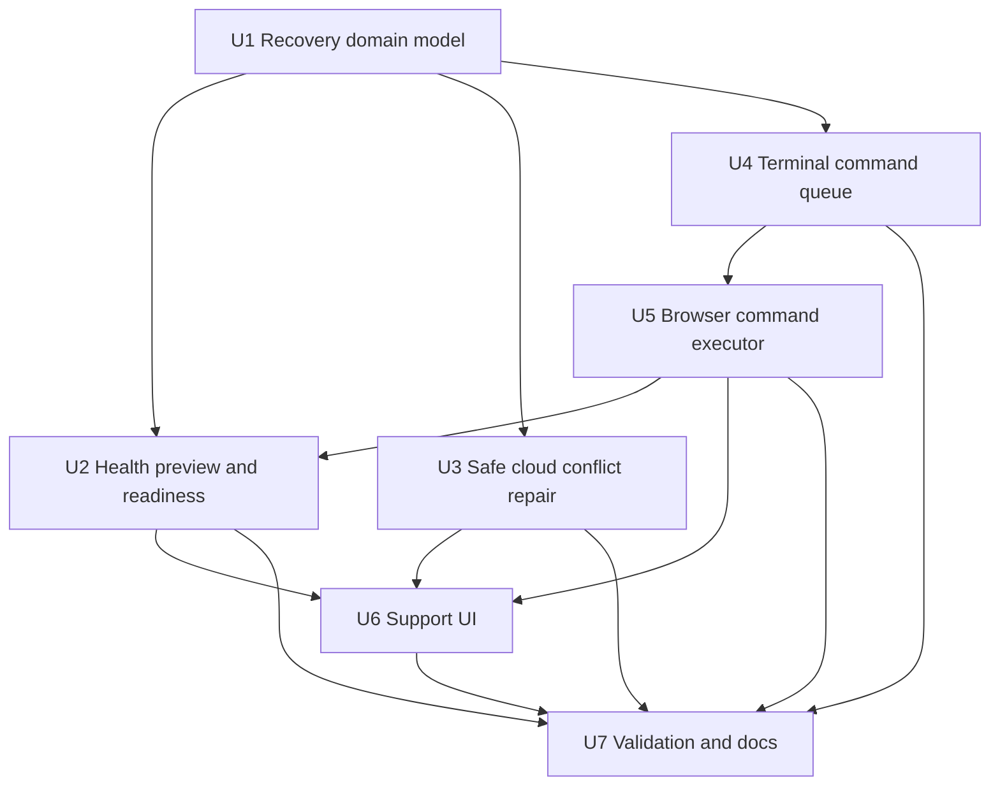
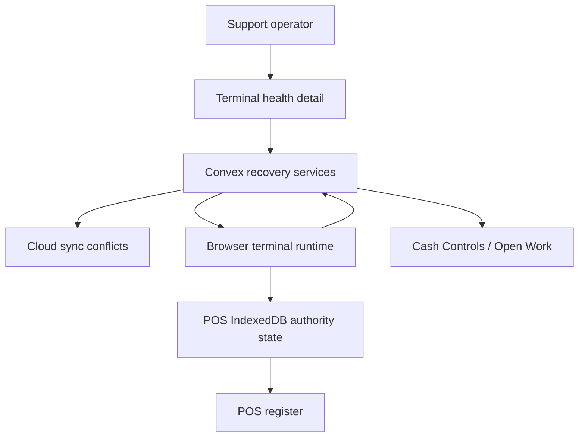

# feat: Add POS Remote Terminal Health Recovery

## Summary

Add a remote terminal health recovery flow for Athena POS support. The flow gives support a safe preview of why a terminal cannot sell, resolves cloud-only stale evidence when it is provably safe, sends auditable terminal-scoped commands for browser-local repair, and verifies recovery through fresh runtime check-ins before declaring the terminal healthy.

This plan is motivated by the M Supplies production terminal audit: the terminal was active and checking in, but it was not able to transact because it had no open register session, no active POS session, unresolved duplicate drawer-open sync conflicts, a stale terminal-integrity block, a drawer-authority block, and expired staff authority.

## Problem Frame

Athena already reports POS terminal health, local sync evidence, runtime check-ins, terminal integrity, drawer authority, and staff authority. Those surfaces are good at diagnosis, but they stop short of orchestrating remote recovery. Support can see that a terminal needs attention, yet still cannot safely answer: "Can this terminal transact sales now?" or "Which remote actions are safe to take without touching local sales, payments, or cash facts?"

The important distinction is between remote cloud repair and terminal-local repair. Convex can resolve safe stale cloud evidence, but it cannot directly mutate the browser's IndexedDB state. Browser-local terminal seed, terminal integrity, drawer authority, staff authority, and snapshots must be repaired by code running on the terminal, then reported back through runtime status.

## Assumptions

*This plan was authored from the approved design direction in this thread without a dedicated brainstorm document. The items below are explicit planning assumptions for review before implementation.*

- Support needs two separate states: `Healthy idle` means the terminal has no blocking setup/sync/runtime evidence and is ready to open a drawer; `Able to transact now` additionally requires an active cashier, open register session, active POS sale context, and transaction capability that supports the sale type.
- Remote repair should be orchestration, not a raw "force clear" mutation. Every action must state what it can change, what it cannot change, and what evidence proves completion.
- Cloud-only duplicate drawer-open conflicts can be auto-resolved only when they are stale, terminal-scoped, duplicate lifecycle attempts, and do not represent sale, payment, inventory, or closeout facts.
- Browser-local authority blocks must be repaired by the terminal after signed command polling and local precondition checks.
- Terminal health remains support telemetry. Cash Controls and Operations continue to own register reconciliation and manager review.

## Requirements

- R1. Support can preview a terminal recovery plan before taking action, including current health, runtime freshness, sync evidence, local blockers, cloud blockers, and whether the terminal is `Healthy idle` or `Able to transact now`.
- R2. Cloud repair can resolve safe stale duplicate drawer-open conflicts without approving, projecting, deleting, or rewriting completed sale, payment, inventory, closeout, or variance facts.
- R3. Terminal-local repair commands are terminal-scoped, signed or nonce-bound, auditable, idempotent, and executed only by the matching active terminal.
- R4. Terminal commands can request safe actions such as retry sync, repair terminal seed, clear stale recoverable drawer authority, refresh staff authority, refresh local snapshots, and report diagnostics.
- R5. Terminal command execution must run browser-local precondition checks before mutating IndexedDB authority state or refreshing local data.
- R6. A command acknowledgement alone is not enough. Athena must require a fresh runtime check-in that shows the intended blocker cleared before marking recovery complete.
- R7. The flow must never clear completed local sales, local event history, unresolved sale/payment/inventory conflicts, closeout variance, manager-review items affecting cash/payment/inventory/completed-sale facts, staff proof tokens, or terminal sync secrets.
- R8. Terminal health and POS register UI copy must stay calm, operational, and normalized. Raw backend messages such as duplicate register-open errors or authorization internals must not surface directly to operators.
- R9. The implementation must preserve POS local-first continuity. Normal offline, pending, or retryable local sync remains allowed by existing rules; explicit terminal-integrity and drawer-authority blocks continue to block sale-affecting commands until repaired.
- R10. Tests must cover the M Supplies-shaped case: active terminal, recent check-ins, no currently open register session, stale duplicate drawer-open conflicts, terminal integrity requiring repair, drawer authority blocked by cloud-closed evidence, and expired staff authority.

## Scope Boundaries

- This plan does not add cloud-side direct IndexedDB mutation. Browser-local repair must be executed by the terminal runtime.
- This plan does not create a cashier-facing manager override to bypass terminal integrity or drawer authority.
- This plan does not auto-approve completed sale, payment, inventory, closeout, variance, or staff-authority review items.
- This plan does not replace Cash Controls register-session review or Operations queue ownership.
- This plan does not require a terminal to be able to transact immediately after becoming healthy idle. Opening a register, cashier sign-in, staff authority, and sale context still follow existing POS flows.
- This plan does not introduce a separate remote monitoring product. It extends the existing terminal health/detail and POS runtime rails.

### Deferred to Follow-Up Work

- Fleet-wide automated terminal remediation scheduling across all stores.
- A production support runbook UI outside Athena's existing terminal health views.
- Historical backfill of old terminal recovery evidence.
- Cross-terminal offline coordination for two terminals attempting the same register lifecycle while disconnected.

## Context & Research

### Relevant Code and Patterns

- `packages/athena-webapp/convex/pos/public/terminals.ts` exposes terminal registration, health queries, and runtime status reporting.
- `packages/athena-webapp/convex/pos/application/queries/terminals.ts` derives health states and attention reasons from runtime status and cloud sync evidence.
- `packages/athena-webapp/convex/pos/infrastructure/repositories/terminalRepository.ts` reads terminal sync evidence, unresolved conflicts, latest review events, and safe register-session action targets.
- `packages/athena-webapp/convex/pos/application/commands/terminals.ts` sanitizes terminal runtime status and redacts diagnostic messages.
- `packages/athena-webapp/convex/pos/public/sync.ts` rejects stale terminal sync secrets with `authorization_failed` and marks terminal authorization failures through metadata.
- `packages/athena-webapp/convex/pos/application/sync/registerSessionSyncReview.ts` groups sync conflicts by mapped register sessions for Cash Controls, which means orphan duplicate drawer-open conflicts need a terminal-scoped support path.
- `packages/athena-webapp/convex/schemas/pos/posLocalSyncConflict.ts` supports `needs_review` and `resolved` conflict states.
- `packages/athena-webapp/src/lib/pos/infrastructure/local/posLocalStore.ts` owns terminal seed, terminal integrity, drawer authority, staff authority, snapshots, and local event persistence.
- `packages/athena-webapp/src/lib/pos/infrastructure/local/usePosLocalSyncRuntime.ts` uploads local events, publishes runtime check-ins, persists terminal authorization failure, clears accepted terminal-integrity state, and clears recoverable drawer-authority blocks when local evidence has settled.
- `packages/athena-webapp/src/lib/pos/infrastructure/local/terminalRuntimeStatus.ts` builds safe runtime status and copy diagnostics for support.
- `packages/athena-webapp/src/components/pos/terminals/POSTerminalDetailView.tsx` and `packages/athena-webapp/src/components/pos/terminals/POSTerminalHealthView.tsx` are the existing support UI surfaces for terminal evidence.

### Institutional Learnings

- `docs/solutions/architecture/athena-pos-terminal-health-visibility-2026-05-20.md` keeps terminal check-ins as telemetry and unresolved sync conflicts as the source of needs-review copy.
- `docs/solutions/architecture/athena-pos-terminal-runtime-review-actions-2026-05-28.md` routes attention reasons to existing POS Settings, POS Register, Cash Controls, or Open Work actions instead of adding terminal-management mutations to Cash Controls.
- `docs/solutions/logic-errors/athena-pos-stale-terminal-sale-block-2026-05-29.md` persists terminal integrity and drawer authority separately from local activity so rejected terminal or drawer authority blocks sale-affecting commands without deleting local events.
- `docs/solutions/architecture/athena-pos-local-staff-authority-2026-05-14.md` keeps local staff authority scoped to store and terminal, with proof material redacted from diagnostics.
- `docs/solutions/architecture/athena-pos-hub-app-session-continuity-2026-06-02.md` warns not to collapse terminal integrity, drawer authority, local command invariants, and staff proof into app-session recovery.
- `docs/product-copy-tone.md` requires calm, clear, restrained, operational copy and normalization of raw backend wording before it reaches operators.

### External References

External research skipped. The feature is specific to Athena's Convex POS terminal health, local-first sync, and browser IndexedDB authority model, and the repo has direct current patterns to follow.

## Key Technical Decisions

- Add recovery orchestration on top of terminal health instead of replacing terminal health. Existing health evidence remains the read-side source; recovery adds preview, commands, acknowledgements, and verification.
- Model terminal recovery as an auditable command queue. Server-side mutation should record intent and safe preconditions; browser runtime should execute terminal-local repair only after it proves the command is for the current store, terminal, seed, and local state.
- Keep cloud repair separate from terminal-local repair. Cloud repair may resolve safe stale conflicts; browser repair may clear local authority blocks or refresh local snapshots; neither should impersonate the other.
- Use positive allow-lists for auto repair. The first automatic cloud repair type should be stale duplicate `register_opened` conflicts with no sale/payment/inventory/closeout facts.
- Require verification through runtime status. A command is complete only when the terminal reports fresh state consistent with the repair target.
- Preserve existing sale authority gates. Local command gateway, register read model, terminal integrity, drawer authority, and staff authority remain the source of whether sale-affecting commands can run.
- Keep support UI in terminal detail. The existing detail view already separates identity, latest check-in, sync evidence, and action targets; adding a recovery preview/actions panel there avoids a new workspace.

## Open Questions

### Resolved During Planning

- Can we tell if the terminal can transact sales from cloud state alone? No. Cloud can say whether a terminal is healthy idle and whether there is an open register session, but `Able to transact now` also depends on browser-local cashier/session context and a fresh runtime report.
- Should remote commands directly mutate browser local state from Convex? No. The terminal must poll, validate, execute locally, and report back.
- Should duplicate drawer-open conflicts be approved or projected? No. They should be resolved as stale duplicate lifecycle attempts when the evidence proves they do not represent new business facts.
- Should support clear local sales/history during repair? No. Local event history is preserved for audit and reconciliation.
- Should terminal health become Cash Controls? No. Terminal health can link to Cash Controls or Open Work, but Cash Controls remains the reconciliation owner.

### Deferred to Implementation

- Exact command signing shape: nonce plus server command id may be enough if scoped to active terminal seed and authenticated runtime; implementation should choose the smallest shape that prevents replay and cross-terminal execution.
- Exact command retention period and cleanup policy.
- Whether cloud repair writes a new terminal recovery audit table only, or also adds operational events visible in Open Work.
- Whether staff authority refresh is a command wrapper around existing cashier auth refresh or a diagnostics-only instruction that guides the current user to sign in again.

## High-Level Technical Design

> This illustrates the intended approach and is directional guidance for review, not implementation specification. The implementing agent should treat it as context, not code to reproduce.

Recovery is deliberately two-phase. Support first sees what will happen and why. Safe cloud changes run on the server. Terminal-local changes are queued for the terminal browser, executed locally after precondition checks, and verified by fresh runtime status before Athena labels the terminal healthy.

## Implementation Units

- U1. **Define recovery state, audit, and command contract**

**Goal:** Add the backend data contract for terminal recovery previews, actions, command lifecycle, acknowledgements, and verification evidence.

**Requirements:** R1, R3, R4, R6, R7, R10.

**Dependencies:** None.

**Files:**
- Modify: `packages/athena-webapp/convex/schemas/pos/index.ts`
- Modify: `packages/athena-webapp/convex/schema.ts`
- Add: `packages/athena-webapp/convex/schemas/pos/posTerminalRecovery.ts`
- Add: `packages/athena-webapp/convex/pos/application/terminalRecovery/types.ts`
- Add: `packages/athena-webapp/convex/pos/infrastructure/repositories/terminalRecoveryRepository.ts`
- Test: `packages/athena-webapp/convex/pos/application/terminalRecovery/terminalRecoveryPolicy.test.ts`
- Test: `packages/athena-webapp/convex/pos/infrastructure/repositories/terminalRecoveryRepository.test.ts`

**Approach:**
- Add a recovery action record or command table scoped by store id, terminal id, command id, command type, issued by user, issued at, expires at, precondition hash/snapshot, status, acknowledgement, and verification status.
- Define command types as an allow-list: `retry_sync`, `repair_terminal_seed`, `clear_stale_drawer_authority`, `refresh_staff_authority`, `refresh_snapshots`, and `report_diagnostics`.
- Store only safe command payload fields: local register session id, expected cloud register session id, expected terminal seed identity, expected blocker type, expected conflict ids, and non-secret diagnostic reason.
- Track command lifecycle as pending, claimed, completed, failed, expired, and superseded.
- Keep audit data non-secret. Do not persist sync secrets, staff proof tokens, PIN material, raw local payload bodies, customer details, or payment details.

**Execution note:** Start with policy tests that prove unsafe command payloads and unsupported command types are rejected before adding public functions.

**Patterns to follow:**
- Command-result and safe failure patterns in `packages/athena-webapp/shared/commandResult.ts`.
- Runtime status sanitization in `packages/athena-webapp/convex/pos/application/commands/terminals.ts`.
- Existing POS schema validators in `packages/athena-webapp/convex/schemas/pos`.

**Test scenarios:**
- Happy path: a support user creates a `retry_sync` command scoped to one active terminal.
- Happy path: a `clear_stale_drawer_authority` command records expected local/cloud register session identifiers without secrets.
- Edge case: command payload for another store or terminal is rejected.
- Edge case: unsupported command type is rejected.
- Error path: command payload containing secret-like fields is rejected or redacted.
- Error path: expired or superseded commands cannot be claimed.

**Verification:**
- The data model can represent recovery intent, terminal acknowledgement, and later runtime verification without exposing sensitive fields.

---

- U2. **Build terminal recovery preview and readiness classification**

**Goal:** Extend terminal health queries with a recovery preview that separates diagnosis, safe cloud steps, terminal-required steps, manual-review blockers, `Healthy idle`, and `Able to transact now`.

**Requirements:** R1, R6, R8, R10.

**Dependencies:** U1.

**Files:**
- Modify: `packages/athena-webapp/convex/pos/application/queries/terminals.ts`
- Modify: `packages/athena-webapp/convex/pos/infrastructure/repositories/terminalRepository.ts`
- Modify: `packages/athena-webapp/convex/pos/public/terminals.ts`
- Modify: `packages/athena-webapp/convex/inventory/posTerminal.ts`
- Test: `packages/athena-webapp/convex/pos/application/terminals.test.ts`
- Test: `packages/athena-webapp/convex/pos/infrastructure/repositories/terminalRepository.test.ts`
- Test: `packages/athena-webapp/convex/pos/public/terminals.test.ts`

**Approach:**
- Add a preview object to terminal detail or a focused query such as `previewTerminalRecovery`.
- Compute readiness states:
  - `healthy_idle`: active terminal, fresh enough runtime check-in, no terminal-integrity block, no drawer-authority block, no local review backlog, no unresolved unsafe cloud conflicts, terminal seed ready, local store available.
  - `able_to_transact_now`: `healthy_idle` plus open register session, active POS/cashier context reported by runtime, usable staff authority, and transaction capability matching the requested transaction mode.
  - `needs_terminal_action`: browser-local repair or refresh is required.
  - `needs_cloud_repair`: cloud-only stale evidence can be safely resolved.
  - `needs_manual_review`: sale/payment/inventory/closeout/cash facts or ambiguous preconditions require human review.
- Include the exact evidence category that made a step safe, terminal-required, or manual.
- Normalize operator/support copy in the query or presentation helper so raw backend summaries are not shown as primary action text.
- Keep unresolved conflicts visible as evidence, but avoid using stale terminal check-ins alone as review work.

**Execution note:** Characterize current `deriveTerminalHealthAttentionReasons` behavior before changing readiness labels.

**Patterns to follow:**
- `deriveTerminalHealthAttentionReasons` and action-target resolution in `packages/athena-webapp/convex/pos/application/queries/terminals.ts`.
- Terminal evidence scoping in `packages/athena-webapp/convex/pos/infrastructure/repositories/terminalRepository.ts`.
- Copy presentation helpers in `packages/athena-webapp/src/components/pos/terminals/terminalHealthPresentation.ts`.

**Test scenarios:**
- M Supplies-shaped case: active online terminal with terminal integrity, drawer authority, local review, duplicate cloud conflicts, no open register session returns not able to transact and proposes safe/terminal/manual steps.
- Happy path: active terminal with fresh healthy runtime and no blockers returns `healthy_idle`.
- Happy path: healthy terminal with active runtime-reported drawer/cashier/sale authority returns `able_to_transact_now`.
- Edge case: stale runtime status cannot prove `able_to_transact_now` even if cloud rows look healthy.
- Edge case: revoked/lost terminal returns manual setup action, not recovery commands.
- Error path: unresolved payment or inventory conflict routes to manual review and does not appear in safe cloud repair steps.

**Verification:**
- Support can answer why the terminal is not transacting without inferring from raw conflict rows or browser-only state.

---

- U3. **Implement safe cloud repair for stale duplicate drawer-open conflicts**

**Goal:** Add a controlled backend mutation that resolves only cloud-safe stale duplicate drawer-open conflicts and records auditable recovery evidence.

**Requirements:** R2, R7, R8, R10.

**Dependencies:** U1, U2.

**Files:**
- Add: `packages/athena-webapp/convex/pos/application/terminalRecovery/cloudRepairPolicy.ts`
- Add: `packages/athena-webapp/convex/pos/application/terminalRecovery/resolveTerminalCloudRepair.ts`
- Modify: `packages/athena-webapp/convex/pos/public/terminals.ts`
- Modify: `packages/athena-webapp/convex/schemas/pos/posLocalSyncConflict.ts`
- Test: `packages/athena-webapp/convex/pos/application/terminalRecovery/cloudRepairPolicy.test.ts`
- Test: `packages/athena-webapp/convex/pos/public/terminals.test.ts`

**Approach:**
- Add a policy function that classifies `posLocalSyncConflict` rows as auto-resolvable only when:
  - conflict is scoped to the same store and terminal;
  - status is `needs_review`;
  - conflict summary/details identify duplicate register-open or duplicate local id for register session lifecycle;
  - corresponding source event is `register_opened`;
  - a different accepted/projected register-open already owns the real cloud drawer or the cloud drawer is already closed;
  - no related sale, payment, inventory, closeout, or variance facts are represented by the conflict;
  - precondition snapshot still matches the preview when mutation executes.
- Patch safe conflicts to `resolved`, set `resolvedAt`, `resolvedByStaffProfileId` where available, and record recovery audit context.
- Do not project the event, create a register session, or change cash/inventory totals.
- Return a command result that lists resolved ids and any conflicts skipped with safe reasons.

**Execution note:** Implement the policy as a pure function with fixtures before wiring the mutation.

**Patterns to follow:**
- Existing conflict resolution data shape in `packages/athena-webapp/convex/schemas/pos/posLocalSyncConflict.ts`.
- Conflict evidence reads in `packages/athena-webapp/convex/pos/infrastructure/repositories/terminalRepository.ts`.
- Cash Controls grouping in `packages/athena-webapp/convex/pos/application/sync/registerSessionSyncReview.ts`.

**Test scenarios:**
- Happy path: stale duplicate `register_opened` conflicts for a terminal resolve and are removed from actionable terminal health evidence.
- Edge case: duplicate conflict for another terminal or store is skipped.
- Edge case: conflict with missing source event is skipped.
- Edge case: conflict tied to `sale_completed`, payment, inventory, closeout, or variance is skipped.
- Edge case: preview precondition drift causes mutation to stop without partial unsafe repair.
- Error path: unauthorized user receives safe `authorization_failed` copy.

**Verification:**
- Cloud repair can clean orphan duplicate drawer-open conflicts without altering sale, cash, inventory, or closeout facts.

---

- U4. **Add terminal command queue public functions**

**Goal:** Let support issue recovery commands and let the matching terminal poll, claim, acknowledge, fail, or complete them through Convex.

**Requirements:** R3, R4, R6, R7, R10.

**Dependencies:** U1, U2.

**Files:**
- Add: `packages/athena-webapp/convex/pos/application/terminalRecovery/terminalCommandService.ts`
- Modify: `packages/athena-webapp/convex/pos/public/terminals.ts`
- Modify: `packages/athena-webapp/convex/inventory/posTerminal.ts`
- Test: `packages/athena-webapp/convex/pos/application/terminalRecovery/terminalCommandService.test.ts`
- Test: `packages/athena-webapp/convex/pos/public/terminals.test.ts`

**Approach:**
- Add support-facing mutation to issue a command from a recovery preview.
- Add terminal-facing query/mutation pair to list or claim pending commands for the active store/terminal.
- Require active terminal status, matching terminal id, store membership, and current terminal seed/sync-secret proof where the existing runtime path has access to it.
- Make command claim idempotent and bounded by expiry.
- Add acknowledgement mutations for completed, failed, skipped, and precondition-failed results.
- Keep command results separate from runtime verification. A command can be completed but still not verified until a subsequent status report proves the blocker cleared.

**Execution note:** Keep the public contract small. It should be possible to test command lifecycle without a browser.

**Patterns to follow:**
- Terminal runtime public mutation in `packages/athena-webapp/convex/pos/public/terminals.ts`.
- Terminal sync-secret proof flow in `packages/athena-webapp/convex/pos/public/sync.ts`.
- Command-result validators in `packages/athena-webapp/convex/lib/commandResultValidators.ts`.

**Test scenarios:**
- Happy path: support issues a command, terminal claims it, acknowledges completion, and command audit stores safe metadata.
- Happy path: duplicate claim from the same terminal returns the same active command.
- Edge case: another terminal cannot claim or acknowledge the command.
- Edge case: revoked or inactive terminal cannot claim the command.
- Edge case: expired command returns no work and is marked expired.
- Error path: acknowledgement cannot mark command verified without matching fresh runtime evidence.

**Verification:**
- Remote commands are targeted, auditable, non-secret, and cannot be executed cross-terminal.

---

- U5. **Execute terminal commands in the browser runtime**

**Goal:** Extend the POS local sync runtime to poll for terminal recovery commands, execute safe local repair actions after precondition checks, and publish fresh runtime status for verification.

**Requirements:** R3, R4, R5, R6, R7, R9, R10.

**Dependencies:** U4.

**Files:**
- Modify: `packages/athena-webapp/src/lib/pos/infrastructure/local/usePosLocalSyncRuntime.ts`
- Modify: `packages/athena-webapp/src/lib/pos/infrastructure/local/posLocalStore.ts`
- Modify: `packages/athena-webapp/src/lib/pos/infrastructure/local/terminalRuntimeStatus.ts`
- Add: `packages/athena-webapp/src/lib/pos/infrastructure/local/terminalRecoveryCommands.ts`
- Test: `packages/athena-webapp/src/lib/pos/infrastructure/local/usePosLocalSyncRuntime.test.ts`
- Test: `packages/athena-webapp/src/lib/pos/infrastructure/local/posLocalStore.test.ts`
- Test: `packages/athena-webapp/src/lib/pos/infrastructure/local/terminalRuntimeStatus.test.ts`
- Test: `packages/athena-webapp/src/lib/pos/infrastructure/local/terminalRecoveryCommands.test.ts`

**Approach:**
- Poll for commands only when the runtime has a provisioned terminal seed, store id, terminal id, and online Convex connectivity.
- Implement command executors:
  - `retry_sync`: trigger existing sync retry scheduling.
  - `repair_terminal_seed`: reuse terminal provisioning repair paths and clear terminal integrity only after the fresh seed is durably written.
  - `clear_stale_drawer_authority`: clear recoverable drawer authority only if local register session, cloud register session, blocker reason, and local event settlement match the command preconditions.
  - `refresh_staff_authority`: refresh or report staff authority state without persisting raw proof material in command audit.
  - `refresh_snapshots`: refresh catalog, service catalog, availability, and register read model snapshots through existing local store paths.
  - `report_diagnostics`: publish a fresh runtime status and copy diagnostics without mutating state.
- Reuse existing authority helpers where possible. Do not add a second local authority model.
- After command execution, force a runtime status publish so the server can verify the cleared blocker.
- Fail closed on local store errors, precondition drift, terminal mismatch, or unsupported command type.

**Execution note:** Prefer extracting pure command executor helpers so runtime hook tests do not become the only coverage.

**Patterns to follow:**
- Terminal integrity clear after accepted check-in in `packages/athena-webapp/src/lib/pos/infrastructure/local/usePosLocalSyncRuntime.ts`.
- Recoverable drawer-authority clearing helpers in `packages/athena-webapp/src/lib/pos/infrastructure/local/usePosLocalSyncRuntime.ts`.
- Atomic seed repair in `packages/athena-webapp/src/lib/pos/infrastructure/local/posLocalStore.ts`.

**Test scenarios:**
- Happy path: `retry_sync` calls the existing retry path and publishes updated runtime diagnostics.
- Happy path: `repair_terminal_seed` writes the new seed atomically and clears stale terminal integrity.
- Happy path: `clear_stale_drawer_authority` clears a recoverable drawer block when all preconditions match and local lifecycle events are settled.
- Edge case: drawer authority with `cloud_closed` is not cleared unless command policy explicitly proves the target local drawer is stale and safe.
- Edge case: precondition drift leaves local authority unchanged and acknowledges precondition failure.
- Edge case: command for another terminal is ignored and not acknowledged as success.
- Error path: local store failure leaves the blocker intact and reports safe failure diagnostics.
- Error path: staff authority refresh does not persist or report raw staff proof tokens.

**Verification:**
- Browser-local repair uses the same local store and sale authority gates as the register, and recovery cannot unblock sale-affecting commands unless local evidence really changed.

---

- U6. **Add support recovery UI to terminal health detail**

**Goal:** Give support a clear preview/action/verification workflow in the existing terminal detail view.

**Requirements:** R1, R2, R3, R4, R6, R8, R10.

**Dependencies:** U2, U3, U4.

**Files:**
- Modify: `packages/athena-webapp/src/components/pos/terminals/POSTerminalDetailView.tsx`
- Modify: `packages/athena-webapp/src/components/pos/terminals/POSTerminalHealthView.tsx`
- Modify: `packages/athena-webapp/src/components/pos/terminals/terminalHealthPresentation.ts`
- Modify: `packages/athena-webapp/src/components/pos/terminals/terminalHealthTypes.ts`
- Test: `packages/athena-webapp/src/components/pos/terminals/POSTerminalDetailView.test.tsx`
- Test: `packages/athena-webapp/src/components/pos/terminals/POSTerminalHealthView.test.tsx`
- Test: `packages/athena-webapp/src/components/pos/terminals/terminalHealthPresentation.test.ts`

**Approach:**
- Add a recovery panel to terminal detail with:
  - current readiness: healthy idle, able to transact now, needs cloud repair, needs terminal action, or needs manual review;
  - blockers grouped as cloud repair, terminal-required, and manual review;
  - explicit safe steps with preconditions and expected verification;
  - command status and latest acknowledgement;
  - next action links to POS Register, POS Settings, Cash Controls, or Open Work.
- Provide buttons only for safe support actions. Manual-review blockers should render links and copy, not repair buttons.
- Confirm destructive-looking repair actions with calm copy that says what will and will not change.
- Keep UI dense and operational; no marketing/hero treatment.
- Normalize copy:
  - `Duplicate drawer-open attempts can be resolved. No sales, payments, or inventory will be changed.`
  - `Terminal action required. This checkout station needs to run the repair before Athena can verify it.`
  - `Healthy idle. Open a drawer and sign in before selling.`
  - `Not able to transact now. No open drawer or active sale is reported.`

**Execution note:** Treat the panel as support tooling, not cashier guidance. Keep POS register blocking copy separate.

**Patterns to follow:**
- Existing terminal detail sections in `packages/athena-webapp/src/components/pos/terminals/POSTerminalDetailView.tsx`.
- Classification helpers in `packages/athena-webapp/src/components/pos/terminals/terminalHealthPresentation.ts`.
- Product copy guidance in `docs/product-copy-tone.md`.

**Test scenarios:**
- M Supplies-shaped detail renders not able to transact, cloud-safe duplicate conflict repair, terminal-required repair, expired staff authority, and manual next actions.
- Healthy idle terminal renders no repair buttons and explains that opening a drawer/sign-in are still required for sales.
- Able-to-transact terminal renders a positive state only when runtime reports active sale authority.
- Manual payment/inventory/closeout blocker renders no auto-repair button.
- Command in progress renders pending/claimed state and disables duplicate issue.
- Command completed but not runtime-verified still waits for fresh check-in.
- Copy tests verify raw backend duplicate register-open and authorization messages are not displayed as primary operator text.

**Verification:**
- Support can safely start recovery from terminal detail while seeing exactly which evidence remains unresolved.

---

- U7. **Update validation map, solution notes, and end-to-end gates**

**Goal:** Keep Athena's agent harness, solution memory, and regression gates aligned with the new terminal recovery workflow.

**Requirements:** R8, R9, R10.

**Dependencies:** U1, U2, U3, U4, U5, U6.

**Files:**
- Modify: `packages/athena-webapp/docs/agent/validation-map.json`
- Modify: `packages/athena-webapp/docs/agent/validation-guide.md`
- Modify: `scripts/harness-app-registry.ts`
- Add: `docs/solutions/architecture/athena-pos-remote-terminal-health-recovery-2026-06-11.md`
- Test: `scripts/validate-plan-html.test.ts` only if the plan artifact tooling changes; otherwise no direct test change.

**Approach:**
- Add terminal recovery files to the POS terminal health validation-map scenario.
- If generated validation docs are produced from `scripts/harness-app-registry.ts`, update the registry and rerun the generator instead of hand-editing generated files.
- Add a solution note documenting the remote recovery boundary: preview first, cloud repair separate from terminal commands, no local sale deletion, runtime check-in verification required.
- Run the focused POS terminal health validation suite plus broader Convex/frontend gates.

**Execution note:** If implementation changes code files, run `bun run graphify:rebuild` before handoff per repo rule.

**Patterns to follow:**
- Existing validation guide entry: `POS terminal health visibility and diagnostics edits`.
- Existing solution notes under `docs/solutions/architecture`.

**Test scenarios:**
- Validation map includes new backend recovery service files, terminal command executor files, and terminal detail UI files.
- Solution note references the boundary between terminal telemetry, cloud conflicts, terminal-local commands, and Cash Controls review.
- Harness review does not report uncovered Athena webapp surfaces.

**Verification:**
- Future agents changing terminal recovery receive the right focused tests and boundary guidance.

## System-Wide Impact

The recovery feature touches backend schema/services, terminal health queries, browser runtime polling, local store authority state, and support UI. The riskiest contract is between terminal commands and local sale authority: any repair that changes IndexedDB must preserve command-gateway sale blocks until the appropriate local state is safely cleared.

## Validation Plan

### Focused Tests

- `bun run --filter '@athena/webapp' test -- convex/schemas/pos/posTerminal.test.ts convex/pos/application/terminals.test.ts convex/pos/infrastructure/repositories/terminalRepository.test.ts convex/pos/public/terminals.test.ts src/components/pos/settings/POSSettingsView.test.tsx src/hooks/useGetTerminal.test.ts src/lib/pos/infrastructure/local/terminalRuntimeStatus.test.ts src/lib/pos/infrastructure/local/usePosLocalSyncRuntime.test.ts src/lib/pos/presentation/syncStatusPresentation.test.ts src/components/pos/register/POSRegisterView.test.tsx src/components/pos/terminals/terminalHealthPresentation.test.ts src/components/pos/terminals/POSTerminalHealthView.test.tsx src/components/pos/terminals/POSTerminalDetailView.test.tsx 'src/routes/_authed/$orgUrlSlug/store/$storeUrlSlug/pos/terminals.route.test.tsx' src/components/cash-controls/CashControlsDashboard.test.tsx src/components/cash-controls/RegisterSessionView.test.tsx`
- `bun run --filter '@athena/webapp' test -- src/lib/pos/infrastructure/local/posLocalStore.test.ts src/lib/pos/infrastructure/local/localCommandGateway.test.ts src/lib/pos/infrastructure/local/registerReadModel.test.ts`
- `bun run --filter '@athena/webapp' audit:convex`
- `bun run --filter '@athena/webapp' lint:convex:changed`
- `bun run --filter '@athena/webapp' lint:frontend:changed`
- `bunx tsc --noEmit -p packages/athena-webapp/tsconfig.json`
- `bun run --filter '@athena/webapp' build`

### Harness and Generated Artifacts

- If validation-map coverage changes, update `scripts/harness-app-registry.ts` and run `bun run harness:generate`.
- Run `bun run harness:review` before PR handoff.
- If code files changed, run `bun run graphify:rebuild`.
- If generated Convex client refs are needed, start `bunx convex dev --once` from `packages/athena-webapp`; do not use `bunx convex codegen`.

### Manual Production-Shaped Verification

- Use a test or QA terminal to create a stale duplicate drawer-open conflict and confirm preview classifies it as cloud-safe repair.
- Confirm support action resolves only the safe duplicate conflict rows.
- Confirm terminal command polling executes only on the matching terminal.
- Confirm local authority state changes only after terminal-side preconditions pass.
- Confirm a completed command is not marked verified until a fresh runtime check-in reflects the expected state.
- Confirm a terminal can be `Healthy idle` but still not `Able to transact now` when there is no open drawer or active cashier/sale context.

## Rollout Plan

- Ship behind a support-only path in terminal detail first.
- Start with preview and diagnostics visible before enabling command issue buttons.
- Enable safe duplicate drawer-open cloud repair before enabling browser-local authority repair commands.
- Monitor recovery audit rows, terminal runtime statuses, and unresolved conflict counts after release.
- Keep a support fallback: POS Settings terminal repair and POS Register drawer recovery remain available if remote commands fail or expire.

## Risks and Mitigations

- Risk: Auto repair clears evidence that should be manager-reviewed. Mitigation: allow-list only duplicate drawer-open lifecycle conflicts; skip sale/payment/inventory/closeout/variance facts; require precondition snapshots.
- Risk: Command executes on the wrong terminal. Mitigation: store/terminal scope, active terminal status, seed proof, command expiry, and terminal-side identity checks.
- Risk: A command clears local authority while local events still need review. Mitigation: terminal executor checks local lifecycle settlement and keeps sale authority blocked when review events remain.
- Risk: Support reads `Healthy idle` as "ready to sell now." Mitigation: separate `Healthy idle` and `Able to transact now` in backend and UI copy.
- Risk: Runtime check-in becomes a command loop. Mitigation: keep command acknowledgement/debug state out of runtime publish signatures except when local state or command verification evidence changes.

## Handoff Notes

- This is a standard-depth plan with a high-risk local-first POS boundary. Implement characterization-first around current terminal health/readiness and local authority clearing before adding mutations.
- Prioritize U1-U3 to make preview and safe cloud repair reviewable before browser command execution.
- Do not deploy browser-local repair commands until command targeting, precondition drift, and runtime verification tests are passing.
