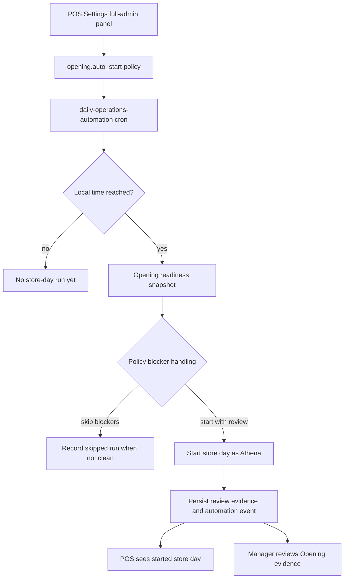

# feat: Configure POS store-day auto-start with manager review

## Summary

Add a POS settings control for store-scoped Opening auto-start time, then extend Daily Operations automation so Athena starts the store day at that local time even when Opening Handoff has blockers. Blocker and acknowledgement evidence stays durable for manager review while the existing manual start-day path remains strict.

---

## Problem Frame

An unstarted store day blocks cashiers from using POS. Athena already has `opening.auto_start`, but the current adapter skips when Opening Handoff needs human review, which preserves operational caution at the cost of cashier continuity.

---

## Requirements

- R1. Full admins can configure whether the selected store auto-starts the store day from POS settings.
- R2. The configuration includes a local start time for the store day and stores the timezone offset needed by the existing scheduled automation path.
- R3. At or after the configured local start time, `opening.auto_start` starts the store day even when Opening Handoff reports blockers, review items, or carry-forward items.
- R4. Every blocker, review item, and carry-forward item that existed at auto-start is preserved as manager-review evidence.
- R5. Manual Opening Handoff start remains unchanged: human starts still reject hard blockers and require acknowledgement for review and carry-forward items.
- R6. POS unlocks through the existing started store-day record, not through a cashier-side bypass.
- R7. Automation remains store-scoped, idempotent for a store operating date, and auditable through existing automation run and operational event rails.

---

## Scope Boundaries

- Do not change EOD completion or `eod.prepare` behavior.
- Do not let cashiers resolve, dismiss, or approve opening blockers.
- Do not build a general automation admin console; this plan adds only the POS settings control needed for Opening auto-start.
- Do not move drawer opening, opening float, register sessions, or Cash Controls ownership into Daily Opening.
- Do not weaken non-POS admin route protection or terminal registration rules.

---

## Context & Research

### Relevant Code and Patterns

- `packages/athena-webapp/convex/operations/dailyOperationsAutomation.ts` owns `opening.auto_start`, cron policy discovery, local operating-date derivation, and the clean-snapshot-only opening decision.
- `packages/athena-webapp/convex/operations/dailyOpening.ts` owns `buildDailyOpeningSnapshotWithCtx` and `startStoreDayWithCtx`; manual starts currently re-read readiness, reject blockers, require acknowledgement keys, and persist automation actor metadata when called by automation.
- `packages/athena-webapp/convex/schemas/automation.ts` and `packages/athena-webapp/convex/automation/runLedger.ts` provide the store-scoped policy and run ledger.
- `packages/athena-webapp/src/components/pos/settings/POSSettingsView.tsx` is the existing POS settings route and already gates full-admin-only panels such as POS recovery code management.
- `packages/athena-webapp/src/components/pos/register/POSRegisterOpeningGuard.tsx` already blocks POS until the store day is started; this plan should not add a second unlock path.

### Institutional Learnings

- `docs/solutions/architecture/athena-automation-foundation-2026-06-08.md`: automation should be auditable through `automationPolicy`, `automationRun`, and operational event metadata; user-facing copy should normalize automation outcomes.
- `docs/solutions/logic-errors/athena-daily-opening-readiness-gate-2026-05-08.md`: Opening is a store-day readiness gate and must not duplicate drawer or register-session workflows.
- `docs/solutions/logic-errors/athena-store-ops-workspace-state-boundaries-2026-05-09.md`: started workflow state is the presentation boundary, but raw source facts must remain available for audit and review.
- `docs/product-copy-tone.md`: operator-facing copy should be calm, clear, restrained, and operational.

### External References

- Not used. The needed behavior follows local Athena automation, Convex, and POS settings patterns.

---

## Key Technical Decisions

- Extend `opening.auto_start` instead of adding a new action: this keeps policy, run history, idempotency, and Daily Operations status in the existing automation lane.
- Add explicit policy fields for local start time and blocked-opening handling: default behavior remains conservative unless POS settings enables the start-with-review policy.
- Keep manual start strict: only automation policy can opt into starting with blockers, and the manual mutation continues to enforce current preconditions.
- Persist review evidence at the automation opening boundary: managers need the blocker/review/carry-forward list that existed when Athena started the day, not only aggregate counts.
- Put the control in POS settings as a full-admin store setting: the setting directly protects POS cashier continuity, but configuration authority remains manager/admin-only.

---

## Open Questions

### Resolved During Planning

- Should the control live in POS settings? Yes. The user explicitly requested POS settings because the problem is cashier POS availability.
- Should blockers stop automation? No. User intent is that the store day must start and blockers become manager review.
- Should manual starts also bypass blockers? No. Manual manager flows remain strict unless a later product decision changes them.

### Deferred to Implementation

- Exact policy field names: choose names that fit current schema conventions while preserving the plan-level concepts of local start minutes and blocker handling.
- Exact manager-review storage shape: implement as either a daily-opening review snapshot, automation-run metadata, operational-event metadata, or a combination that best fits existing validators without duplicating source truth unnecessarily.
- Exact local timezone source in the browser: use a deterministic offset derived from the admin's current store context; if Athena already stores a store timezone by implementation time, prefer that over browser-only inference.

---

## High-Level Technical Design

> *This illustrates the intended approach and is directional guidance for review, not implementation specification. The implementing agent should treat it as context, not code to reproduce.*

---

## Implementation Units

- U1. **Extend automation policy for scheduled opening configuration**

**Goal:** Add the policy shape and backend helpers needed to configure Opening auto-start time and blocked-opening behavior.

**Requirements:** R1, R2, R3, R7

**Dependencies:** None

**Files:**
- Modify: `packages/athena-webapp/convex/schemas/automation.ts`
- Modify: `packages/athena-webapp/convex/automation/runLedger.ts`
- Modify: `packages/athena-webapp/convex/operations/dailyOperationsAutomation.ts`
- Modify: `packages/athena-webapp/convex/schema.ts`
- Test: `packages/athena-webapp/convex/automation/automationFoundation.test.ts`
- Test: `packages/athena-webapp/convex/operations/operationsQueryIndexes.test.ts`

**Approach:**
- Extend `automationPolicy` with optional Opening-specific scheduling data: enabled mode, local start minutes, timezone offset, and blocker handling.
- Keep existing `mode`, `paused`, and `policyVersion` semantics as the source of whether automation can run.
- Add or reuse a narrow policy read/upsert helper so UI code does not write raw automation rows directly.
- Preserve existing indexes unless implementation discovers the configured-policy cron needs a time-based index; if so, add the smallest index that supports policy discovery.

**Execution note:** Add schema/helper tests before changing scheduler behavior so policy defaults stay explicit.

**Patterns to follow:**
- `packages/athena-webapp/convex/automation/runLedger.ts`
- `packages/athena-webapp/convex/automation/automationFoundation.test.ts`
- `packages/athena-webapp/convex/operations/dailyOperationsAutomation.test.ts`

**Test scenarios:**
- Happy path: an Opening auto-start policy can be read for a store with enabled mode, local start time, timezone offset, and start-with-review blocker handling.
- Happy path: updating the policy records `updatedAt`, `updatedByUserId`, `policyVersion`, and store/organization ownership.
- Edge case: a store with no policy reads as disabled and does not appear configured.
- Error path: invalid local start time outside one local day is rejected.
- Error path: duplicate policies for the same store/domain/action remain treated as ambiguous.

**Verification:**
- Policy schema, index coverage, and helper tests prove the setting can be safely stored without changing unrelated automation actions.

---

- U2. **Gate configured cron runs by local start time**

**Goal:** Make `runConfiguredDailyOperationsAutomationWithCtx` run Opening auto-start only after the configured local start time for the store's operating date.

**Requirements:** R2, R3, R7

**Dependencies:** U1

**Files:**
- Modify: `packages/athena-webapp/convex/operations/dailyOperationsAutomation.ts`
- Test: `packages/athena-webapp/convex/operations/dailyOperationsAutomation.test.ts`

**Approach:**
- Replace the current timezone-only operating-date decision for Opening with a policy-aware schedule check.
- Compute the local operating date using `operatingTimezoneOffsetMinutes`, then compare the local minute-of-day to the configured start minute.
- Preserve hourly cron behavior: the first cron tick at or after the configured local time applies the idempotent store-day run.
- Keep `runScheduledDailyOperationsAutomationWithCtx` for explicit operating-date tests and internal callers.
- Leave `eod.prepare` on its current timezone-based behavior unless implementation finds shared helper extraction useful without changing outcomes.

**Patterns to follow:**
- Existing `operatingDateForPolicy` behavior in `packages/athena-webapp/convex/operations/dailyOperationsAutomation.ts`
- Existing cron coverage in `packages/athena-webapp/convex/operations/dailyOperationsAutomation.test.ts`

**Test scenarios:**
- Happy path: a policy configured for 08:00 local time runs on the first cron evaluation at or after 08:00 local time.
- Edge case: the same policy does not run at 07:59 local time.
- Edge case: timezone offsets crossing UTC date boundaries derive the intended local operating date.
- Edge case: policies missing timezone offset or start time are skipped without recording misleading store-day automation runs.
- Integration: repeated cron evaluations after the configured time remain idempotent for the same store operating date.

**Verification:**
- Scheduled automation tests prove local-time eligibility and idempotency without requiring cron frequency changes.

---

- U3. **Start Opening with manager-review evidence under automation policy**

**Goal:** Allow `opening.auto_start` to start the store day with blockers only when policy says blockers become manager review.

**Requirements:** R3, R4, R5, R6, R7

**Dependencies:** U1, U2

**Files:**
- Modify: `packages/athena-webapp/convex/operations/dailyOperationsAutomation.ts`
- Modify: `packages/athena-webapp/convex/operations/dailyOpening.ts`
- Modify: `packages/athena-webapp/convex/schemas/operations/dailyOpening.ts`
- Modify: `packages/athena-webapp/convex/schemas/automation.ts`
- Test: `packages/athena-webapp/convex/operations/dailyOperationsAutomation.test.ts`
- Test: `packages/athena-webapp/convex/operations/dailyOpening.test.ts`

**Approach:**
- Add an automation-only start path that can accept the command-time snapshot with blockers, review items, and carry-forward items when blocker handling is configured for manager review.
- Preserve manual `startStoreDayWithCtx` behavior for human actors: blockers still reject, and review/carry-forward acknowledgement remains required.
- Persist review evidence from the snapshot that caused the automation start. At minimum, retain item keys, severity, category, title/message, source subject, and source link or metadata needed for manager follow-up.
- Record an automation run outcome and operational event that distinguish clean auto-start from auto-start with review required.
- Ensure POS remains unlocked because `dailyOpening` exists with `status: "started"`; do not add a POS-side bypass.

**Execution note:** Characterize current manual blocker rejection before introducing the automation-only bypass.

**Patterns to follow:**
- `packages/athena-webapp/convex/operations/dailyOpening.ts`
- `packages/athena-webapp/convex/operations/dailyOperationsAutomation.ts`
- `docs/solutions/logic-errors/athena-daily-opening-readiness-gate-2026-05-08.md`

**Test scenarios:**
- Happy path: enabled policy with start-with-review starts the store day when Opening has blocker items.
- Happy path: the resulting `dailyOpening` stores automation actor metadata, readiness counts, source subjects, and manager-review evidence.
- Happy path: the operational event and automation run identify that Athena started with review required.
- Edge case: existing clean Opening auto-start still records `applied` and does not create spurious review evidence.
- Edge case: already-started Opening remains skipped and does not create a second `dailyOpening`.
- Error path: human/manual start still rejects the same blocker snapshot.
- Integration: POS opening guard can rely on the started opening record without any special-case bypass.

**Verification:**
- Backend tests prove automation can start blocked openings only through policy, while manual starts and idempotency remain intact.

---

- U4. **Expose the setting in POS settings**

**Goal:** Add a full-admin POS settings section that lets managers configure Opening auto-start enablement and local start time.

**Requirements:** R1, R2, R4, R7

**Dependencies:** U1

**Files:**
- Modify: `packages/athena-webapp/src/components/pos/settings/POSSettingsView.tsx`
- Modify: `packages/athena-webapp/src/components/pos/settings/POSSettingsView.test.tsx`
- Modify: `packages/athena-webapp/convex/operations/dailyOperationsAutomation.ts`
- Modify: `packages/athena-webapp/convex/automation/runLedger.ts`
- Test: `packages/athena-webapp/src/components/pos/settings/POSSettingsView.test.tsx`
- Test: `packages/athena-webapp/convex/operations/dailyOperationsAutomation.test.ts`

**Approach:**
- Add a separate "Store day automation" section rather than folding store-level automation into terminal registration.
- Gate the section with `usePermissions().hasFullAdminAccess`, matching recovery-code management.
- Read the existing `opening.auto_start` policy and render disabled/enabled state, local start time, and a clear statement that blockers will be routed for manager review.
- Save through a narrow Convex mutation that validates store access with full-admin authorization and upserts only the `daily_operations` / `opening.auto_start` policy.
- Keep the mutation boundary backend-owned: POS settings calls a query/mutation API, while scheduler code only consumes stored policy and does not import UI concerns.
- Use `input type="time"` or the existing UI primitives for time input, and store the value as local minutes rather than a locale-formatted string.
- Use calm operational copy. The setting should say that Athena starts the store day and preserves review items; it should not imply blockers are resolved.

**Patterns to follow:**
- Full-admin POS recovery code panel in `packages/athena-webapp/src/components/pos/settings/POSSettingsView.tsx`
- Existing POS settings component tests in `packages/athena-webapp/src/components/pos/settings/POSSettingsView.test.tsx`
- `docs/product-copy-tone.md`

**Test scenarios:**
- Happy path: full admins see the store-day automation section with current policy values.
- Happy path: changing enablement and start time calls the policy mutation with store id, local start minutes, timezone offset, enabled mode, and start-with-review blocker handling.
- Happy path: successful save shows concise operational confirmation.
- Edge case: non-full-admin users do not see the section and the policy query is skipped.
- Error path: missing store context prevents saving and shows normalized operator copy.
- Error path: mutation failure shows a generic settings-save failure without exposing raw backend text.

**Verification:**
- POS settings tests prove the control is visible only to full admins and writes the expected policy shape.

---

- U5. **Surface manager-review evidence after auto-start**

**Goal:** Make managers able to inspect the blockers and review items Athena carried forward when it auto-started the day.

**Requirements:** R4, R6, R7

**Dependencies:** U3

**Files:**
- Modify: `packages/athena-webapp/src/components/operations/DailyOpeningView.tsx`
- Modify: `packages/athena-webapp/src/components/operations/DailyOperationsView.tsx`
- Modify: `packages/athena-webapp/src/components/operations/DailyOpeningView.test.tsx`
- Modify: `packages/athena-webapp/src/components/operations/DailyOperationsView.test.tsx`
- Test: `packages/athena-webapp/src/components/operations/DailyOpeningView.test.tsx`
- Test: `packages/athena-webapp/src/components/operations/DailyOperationsView.test.tsx`

**Approach:**
- Keep started Opening as the primary state so stale live blockers do not make the store look closed again.
- Add a manager-readable automation review panel or status detail when the started opening was created with review-required evidence.
- Link each review item back to the owning workflow when the source subject includes a route.
- Keep cashier POS surfaces quiet; review evidence belongs in operations/manager views.
- Normalize automation copy so it states what Athena did and what managers should review.

**Patterns to follow:**
- `packages/athena-webapp/src/components/operations/DailyOpeningView.tsx`
- `packages/athena-webapp/src/components/operations/DailyOperationsView.tsx`
- `docs/solutions/logic-errors/athena-store-ops-workspace-state-boundaries-2026-05-09.md`

**Test scenarios:**
- Happy path: an automation-started opening with review evidence shows that Athena started the day and lists manager-review items.
- Happy path: source links route to Opening, approval, Cash Controls, or work-item owners when available.
- Edge case: clean automation starts do not show an empty review panel.
- Edge case: started state remains primary even when live readiness would still report old blockers.
- Error path: missing review source link renders the item text without broken navigation.

**Verification:**
- Operations component tests prove managers can see review evidence while POS remains unlocked by started state.

---

- U6. **Refresh validation map and operational learning**

**Goal:** Keep generated artifacts and reusable implementation knowledge current after the feature lands.

**Requirements:** R7

**Dependencies:** U1, U2, U3, U4, U5

**Files:**
- Create: `docs/solutions/architecture/athena-store-day-auto-start-review-2026-06-11.md`
- Modify: `graphify-out/`

**Approach:**
- Add a solution note that documents the policy-controlled start-with-review boundary, local-time scheduling, and manager-review evidence path.
- Rebuild graphify after code changes so Athena's graph stays current.
- Keep the note focused on future automation work: start cashier-critical store-day flows on schedule, but preserve evidence and manager review.

**Patterns to follow:**
- `docs/solutions/architecture/athena-automation-foundation-2026-06-08.md`
- `docs/solutions/architecture/athena-pos-offline-sales-continuity-2026-06-04.md`

**Test scenarios:**
- Test expectation: none for prose-only docs and generated graph output. Validation comes from repo gates and graph freshness.

**Verification:**
- Solution note exists in the delivery branch and `bun run graphify:rebuild` has refreshed graph artifacts after code changes.

---

## System-Wide Impact

- **Interaction graph:** POS settings, automation policy, scheduled automation cron, Daily Opening command, automation run ledger, operational events, Daily Operations status, Opening Handoff UI, and POS register opening guard are affected.
- **Error propagation:** Policy save failures should surface normalized settings copy; automation failures should record failed runs and not expose raw backend errors in operator UI.
- **State lifecycle risks:** The auto-start path must be idempotent per store operating date and must not duplicate `dailyOpening` records when hourly cron retries.
- **API surface parity:** Manual `startStoreDay` remains strict; only internal automation and full-admin policy configuration get new behavior.
- **Integration coverage:** Tests need to cover the chain from POS settings policy save through scheduled automation decision, daily-opening insert, event/run evidence, and manager-facing UI.
- **Unchanged invariants:** Drawer state, register sessions, opening float, EOD completion, and Cash Controls remain owned by their existing commands.

---

## Risks & Dependencies

| Risk | Mitigation |
|------|------------|
| Automation hides unresolved operational risk | Persist the exact review evidence and show it in manager operations views. |
| Local start time runs on the wrong operating date | Keep timezone offset explicit in policy and add UTC-boundary tests. |
| Manual start path accidentally weakens | Add regression tests that human start still rejects blockers. |
| POS settings becomes a broad admin console | Limit the section to the single Opening auto-start policy and keep adjacent automation out of scope. |
| Hourly cron runs multiple times after the configured time | Reuse existing idempotency key per store/action/operating date. |

---

## Documentation / Operational Notes

- Start stores in disabled or dry-run mode unless a manager explicitly enables the setting from POS settings.
- Manager-facing copy should say Athena started the store day and preserved review items, not that blockers were cleared.
- Deployment should include Convex schema/API regeneration as needed by the implementation.
- After implementation, run focused Convex and POS settings tests first, then Athena's normal delivery gate and `bun run graphify:rebuild`.

---

## Sources & References

- Related plan: `docs/plans/2026-06-08-001-feat-daily-ops-automation-plan.md`
- Related requirements: `docs/brainstorms/2026-05-08-opening-mvp-store-readiness-gate-requirements.md`
- Related requirements: `docs/brainstorms/2026-05-07-daily-operations-lifecycle-requirements.md`
- Related code: `packages/athena-webapp/convex/operations/dailyOperationsAutomation.ts`
- Related code: `packages/athena-webapp/convex/operations/dailyOpening.ts`
- Related code: `packages/athena-webapp/src/components/pos/settings/POSSettingsView.tsx`
- Related solution: `docs/solutions/architecture/athena-automation-foundation-2026-06-08.md`
- Related solution: `docs/solutions/logic-errors/athena-daily-opening-readiness-gate-2026-05-08.md`
- Related solution: `docs/solutions/logic-errors/athena-store-ops-workspace-state-boundaries-2026-05-09.md`
